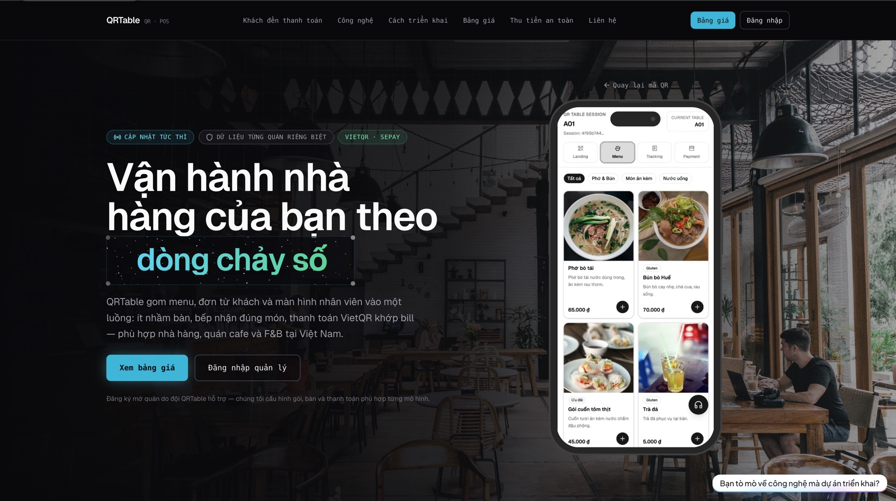
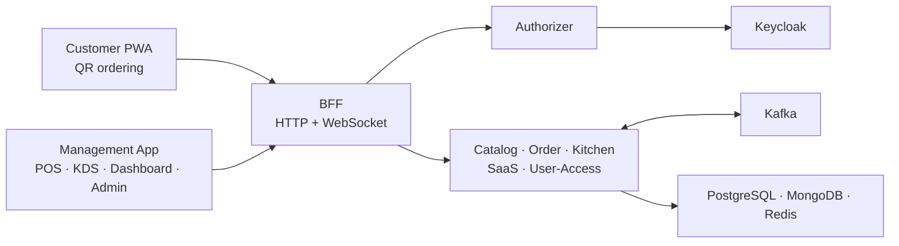

## Demo Preview

[Watch the project preview video](https://jumpshare.com/share/EQA2R9Y48flq6plbDIOa)

> Due to current infrastructure and budget constraints, the backend platform is not publicly deployed. The preview video demonstrates the project's main flows and interface.


<h1 align="center">QRTable</h1>

<p align="center">
  <strong>A multi-tenant SaaS POS for modern F&amp;B operations.</strong>
</p>

<p align="center">
  QR ordering, restaurant operations, kitchen workflows, and SaaS management in one event-driven platform.
</p>

<p align="center">
  <a href="docs/technical-architecture.md">Architecture</a> ·
  <a href="docs/business-logic.md">Business rules</a> ·
  <a href="docs/testing/README.md">Testing</a> ·
  <a href="docs/README.md">Documentation</a>
</p>

<p align="center">
  
</p>

## Demo Preview

[Watch the project preview video](https://jumpshare.com/share/EQA2R9Y48flq6plbDIOa)

> Due to current infrastructure and budget constraints, the backend platform is not publicly deployed. The preview video demonstrates the project's main flows and interface.

## Platform Highlights

| Area                  | Capabilities                                                                                 |
| --------------------- | -------------------------------------------------------------------------------------------- |
| Customer ordering     | Guest QR sessions, digital menu, cart, order submission, live status, and service requests.  |
| Restaurant operations | Table and area management, staff POS, order confirmation, and table lifecycle.               |
| Kitchen display       | Kafka-driven ticket ingestion, station routing, Redis-backed queues, and KDS status updates. |
| SaaS administration   | Tenant lifecycle, plans, subscriptions, staff access, feature entitlements, and reporting.   |
| Reliability           | Explicit tenant isolation, idempotent writes, transactional outbox, and Saga compensation.   |

## How QRTable Works

1. A customer scans the QR code assigned to a table. QRTable validates the token and opens an anonymous, tenant-scoped ordering session.
2. The Customer PWA loads the restaurant's public menu, manages the table cart, and submits an order with a server-controlled timestamp and idempotency context.
3. Staff review the pending order in the POS. Confirmation triggers the Order service to coordinate stock deduction with Catalog before committing the order.
4. The confirmed order is published through Kafka. Kitchen consumes the event, routes items to the correct station, and projects KDS tickets into Redis queues.
5. Socket.IO events act as update hints for the POS, KDS, and Customer PWA; clients refetch the authoritative snapshot after mutations or reconnects.

## Architecture



The BFF is the single client entry point. Each service owns its domain data and communicates through TCP or gRPC contracts for synchronous work and Kafka events for asynchronous side effects.

## Frontend Applications

QRTable uses two frontend applications so the anonymous customer journey stays lightweight while authenticated restaurant and platform workflows can use richer routing, authorization, and data-management patterns.

| Application      | Audience                                     | Runtime                    | Responsibility                                                                                             |
| ---------------- | -------------------------------------------- | -------------------------- | ---------------------------------------------------------------------------------------------------------- |
| `customer-pwa`   | Restaurant guests                            | React, Vite, React Router  | Mobile-first QR session, menu, cart, order tracking, and service-request experience.                       |
| `management-app` | Staff, managers, owners, and platform admins | Next.js App Router, React  | Role-oriented POS, KDS, restaurant dashboard, reporting, subscription, and SaaS administration workspaces. |
| `keycloak-theme` | Authenticated platform and restaurant users  | Keycloak theme application | Branded login, authentication feedback, and identity screens aligned with the QRTable interface.           |

### Product Surfaces

| Surface                 | Primary users             | Main routes and workflows                                                                                   |
| ----------------------- | ------------------------- | ----------------------------------------------------------------------------------------------------------- |
| Customer PWA            | Guest customers           | `/landing`, `/menu`, and `/order-tracking` for QR joining, ordering, and order status.                      |
| Staff POS               | Waiters and service staff | `/pos`, table map, guest service requests, and order confirmation.                                          |
| Kitchen Display System  | Chefs and baristas        | `/kds/kitchen` and `/kds/bar` with station-specific queues, ticket details, recall, and preparation status. |
| Restaurant Dashboard    | Owners and managers       | Menu, table and QR, staff, order history, subscription, and tenant reporting.                               |
| Platform Administration | Super admins              | Tenant onboarding and lifecycle, pricing plans, subscriptions, and cross-tenant analytics.                  |
| Identity Experience     | Staff, owners, and admins | Keycloak SSO login, callback handling, session hydration, and role-based landing routes.                    |

### Frontend Architecture

- **Application split:** `customer-pwa` optimizes the anonymous mobile journey; `management-app` groups authenticated operational surfaces under Next.js route groups.
- **Feature-oriented modules:** menu, cart, order, POS, KDS, staff, SaaS, reporting, and tenant concerns keep their components, hooks, query keys, services, and types together.
- **Server and client state:** TanStack Query owns remote snapshots, caching, and invalidation; Zustand and focused React contexts hold lightweight authentication, session, and interaction state.
- **Dual authentication model:** the Customer PWA uses tenant/session headers without guest login, while the Management App uses Auth.js with Keycloak OIDC and role-aware route protection.
- **Realtime convergence:** Socket.IO delivers invalidation hints; query hooks refetch authoritative API data after mutations, reconnects, or missed events.
- **Design system:** Tailwind CSS, shadcn/ui, Radix primitives, Lucide icons, and Motion provide shared responsive components and interaction patterns.
- **Typed validation:** shared TypeScript contracts, Zod schemas, and React Hook Form keep API data and complex forms predictable at the UI boundary.

## Backend Services

| Service       | Responsibility                                                                             | Primary state     |
| ------------- | ------------------------------------------------------------------------------------------ | ----------------- |
| `bff`         | HTTP/WebSocket gateway, guard chain, rate limiting, request routing, and realtime fan-out. | Stateless         |
| `authorizer`  | JWT/OIDC verification and Keycloak administration through gRPC.                            | Keycloak          |
| `catalog`     | Menus, categories, areas, tables, QR tokens, and the canonical stock write path.           | PostgreSQL        |
| `order`       | Customer sessions, carts, order lifecycle, and order-confirm coordination.                 | PostgreSQL, Redis |
| `kitchen`     | Kafka ingestion, station routing, KDS ticket queues, recall, and SLA projection.           | Redis             |
| `saas`        | Tenant lifecycle, onboarding, pricing plans, subscriptions, quotas, and entitlements.      | PostgreSQL        |
| `user-access` | Application profiles, roles, permissions, and tenant staff management.                     | MongoDB           |

## Technology Stack

| Layer       | Technologies                                                     |
| ----------- | ---------------------------------------------------------------- |
| Frontend    | Next.js, React, Vite, TanStack Query, Tailwind CSS, shadcn/ui    |
| Backend     | NestJS, TypeScript, Nx                                           |
| Data        | PostgreSQL, TypeORM, MongoDB, Mongoose, Redis                    |
| Integration | Apache Kafka, TCP, gRPC, Socket.IO, and Keycloak                 |
| Operations  | Docker Compose, Caddy, migration tooling, and deployment scripts |

## Engineering Model

- **Service-owned data:** a service never imports another service's repository or writes to its database.
- **Tenant isolation:** tenant context is established at the boundary and every tenant-scoped query applies an explicit tenant predicate.
- **Event-driven side effects:** synchronous contracts handle immediate coordination; Kafka carries asynchronous domain events and recovery paths.
- **Resilient writes:** order workflows use idempotency, transactional outbox records, replay-safe consumers, and compensation where a distributed step can fail.
- **Authoritative snapshots:** WebSocket messages notify clients that state changed; REST/TCP snapshots remain the source of truth.

## Workspace

| Path                                  | Purpose                                                                         |
| ------------------------------------- | ------------------------------------------------------------------------------- |
| `apps/`                               | BFF, seven domain services, Customer PWA, Management App, and Keycloak theme.   |
| `libs/`                               | Shared contracts, configuration, guards, UI, providers, and utilities.          |
| `docker/` and `docker-compose.*.yaml` | Local infrastructure, application, and proxy layers.                            |
| `tools/`                              | Database, Kafka, seed, deployment, and verification tooling.                    |
| `docs/`                               | Canonical architecture, business, phase, testing, and operations documentation. |

## Local Development

### Prerequisites

- Node.js and pnpm
- Docker Engine with Docker Compose

```sh
cp .env.example .env
pnpm install
docker compose -f docker-compose.provider.yaml up -d
pnpm dev:reseed -- --yes
pnpm dev
```

Review `.env` before startup. `dev:reseed` recreates and seeds the local development databases; never run it against a shared or production environment. See the [development seed guide](tools/dev-seed/README.md) for fixtures and verification details.

Useful development profiles:

```sh
pnpm dev:bff-auth
pnpm dev:bff-order
pnpm nx show projects
pnpm nx show project <name>
```

## Validation

| Command                    | Purpose                                                                 |
| -------------------------- | ----------------------------------------------------------------------- |
| `pnpm verify:doc-anchors`  | Verify that long-lived documentation still points to real source paths. |
| `pnpm db:verify:ownership` | Check database-per-service ownership and configuration.                 |
| `pnpm db:test`             | Run database provisioning and ownership tests.                          |
| `pnpm theme:build`         | Build the custom Keycloak theme.                                        |

Run integration checks only with their required local services and fixtures available.

## Deployment and Operations

The repository separates infrastructure, application services, and reverse proxy configuration into composable Docker Compose layers. Production bootstrap runs migrations, verifies database ownership, provisions Kafka topics, and configures Keycloak before application startup.

Deployment artifacts are configuration, not proof of a live public environment. Use the production runbook to provision a target host, validate HTTPS and health endpoints, record the deployed revision, and prepare rollback before declaring a release operational.

## Documentation

| Document                                                           | Focus                                                                            |
| ------------------------------------------------------------------ | -------------------------------------------------------------------------------- | --- |
| [Documentation index](docs/README.md)                              | Source-of-truth order and the complete documentation map.                        |
| [Business logic](docs/business-logic.md)                           | Actors, operational workflows, state transitions, and business rules.            |
| [Technical architecture](docs/technical-architecture.md)           | Service boundaries, data ownership, communication, security, and infrastructure. |
| [Permission matrix](docs/architecture/permission-matrix.md)        | Role and permission boundaries across platform and tenant operations.            |     |
| [Deployment runbook](docs/guides/production-deployment-runbook.md) | Production provisioning, bootstrap, verification, and rollback.                  |
| [Project status](docs/project-status.md)                           | Evidence-based implementation, verification, and deployment status.              |
