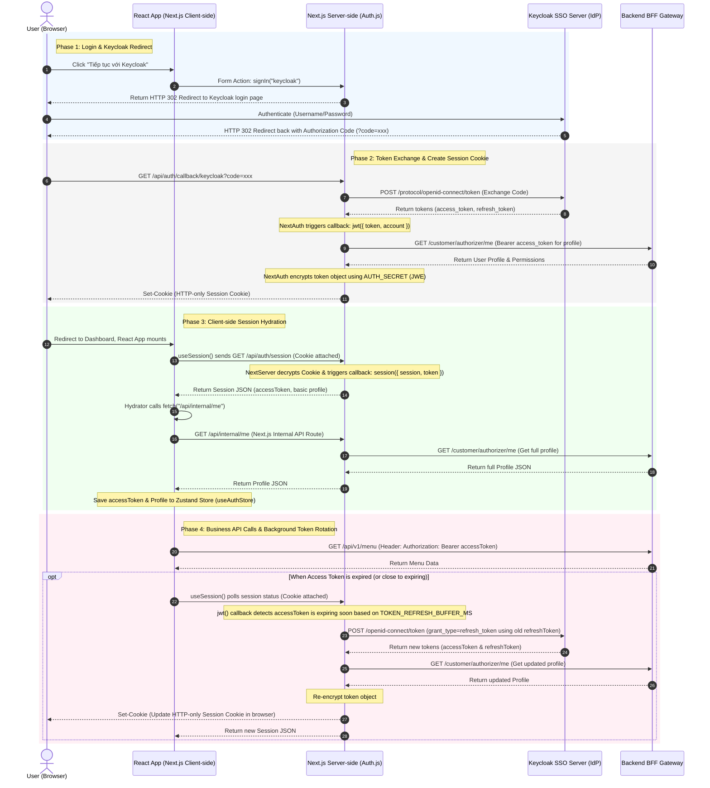

# QRTable Management Application (management-app)

> This document provides a detailed guide on the source code structure, system architecture, state management mechanisms, security, and outlines an optimal roadmap for developers to understand the source code.

---

## 1. Architectural Overview

The **Management App** is built on **Next.js App Router (v16.1.7)** and **React 19**, serving as the dashboard and operations system for three user groups:

1.  **Super Admin (SaaS Admin)**: Manages restaurants (Tenants), subscription plans (Subscriptions), payments, and system-wide revenue.
2.  **Restaurant Owner / Manager**: Manages menus, table layouts, staff, and VietQR payment configurations for individual restaurants.
3.  **Staff (Waiter, Chef, Barista)**: Handles point-of-sale (POS) operations, views table support requests, and prepares items at the kitchen/bar (KDS).

### Main Directory Structure (`src/`)

```text
apps/management-app/src/
├── app/                        # Next.js App Router
│   ├── (admin)/                # Route Group for Super Admin (/admin)
│   ├── (auth)/                 # Keycloak Login (/login)
│   ├── (dashboard)/            # Restaurant Management Dashboard (/dashboard)
│   ├── (kds)/                  # Kitchen/Bar Display Screen for Chefs/Baristas (/kds)
│   ├── (pos)/                  # Counter Point of Sale for Waiters (/pos)
│   ├── api/                    # Local API Routes (Auth callbacks, Session sync proxy)
│   ├── layout.tsx              # Root Layout
│   └── providers.tsx           # Wrappers for global providers (React Query, NextAuth, Theme)
├── auth.ts                     # NextAuth v5 configuration integrated with Keycloak (OIDC/OAuth)
├── proxy.ts                    # Next.js Proxy to control route protection & role-based access control (RBAC)
├── constants/
│   ├── api.ts                  # BFF API endpoints and cache configuration
│   └── routes.ts               # Constants defining all application routes
├── lib/
│   ├── api/
│   │   └── authenticated-client.ts # API Client that automatically injects Keycloak Bearer Token & Tenant Headers
│   ├── auth/
│   │   ├── auth-store.ts       # Zustand Store for client-side profiles and tokens
│   │   ├── bff-server.ts       # Direct API calls from Next.js server-side to the BFF
│   │   └── role-routing.ts     # Mapping application roles (AppRole) to page access permissions
│   └── utils.ts                # Shared utility functions
├── features/                   # Modular independent business features
│   ├── saas/                   # Subscription, Tenant, and Plan Management
│   ├── tenant/                 # Restaurant profile configurations, SePay bank accounts
│   ├── menu/                   # Menu categories, dishes CRUD, and modifiers
│   ├── tables/                 # Area & table layouts layout configuration + QR code token generation
│   ├── order/                  # Order life-cycle state machine, order lists & invoice logs
│   ├── pos/                    # Counter POS, point of sale cart and checkout flows
│   ├── kds/                    # Real-time Kitchen/Bar Display queues with Socket.io cache invalidation
│   ├── staff/                  # Employee accounts management & Role-Based permissions (RBAC)
│   ├── payment/                # SePay webhook processing, cash log verifications
│   ├── reports/                # Revenue, service performance analytics, and order reports
│   ├── service-requests/       # Real-time guest help/call dashboard
│   └── landing/                # SaaS POS introduction homepage
└── components/                 # Shared UI components across the application (Shadcn-based)
```

#### Detailed Page Routes Map (`src/app/`)

- **`(admin)` (SaaS Control Panel):**
  - `/admin/tenants`: List, create, and manage registered restaurants (Tenants) on the SaaS platform.
  - `/admin/plans`: Create and edit SaaS subscription plans (pricing, limits).
  - `/admin/billing`: Track transactions, invoice status, and system-wide revenue reports.
  - `/admin/analytics`: General platform growth charts.
- **`(dashboard)` (Restaurant Portal):**
  - `/dashboard/menu`: Manage restaurant menus (dishes CRUD, categories, options).
  - `/dashboard/tables`: Setup dining areas and tables layout; print/export QR codes.
  - `/dashboard/staff`: Manage restaurant employees, roles, and SSO credentials.
  - `/dashboard/orders`: View historical invoices, dining room orders, and payment audits.
  - `/dashboard/payment-settings`: Setup bank account integrations (SePay API/webhooks) for VietQR.
  - `/dashboard/subscription`: Check current pricing plan, usage, and billing history.
- **`(kds)` (Kitchen/Bar Display Screen):**
  - `/kds/kitchen`: Real-time active food items queue for Chefs.
  - `/kds/bar`: Real-time active drinks queue for Baristas.
- **`(pos)` (Cashier Desk):**
  - `/pos`: Live order queue and order operations.
  - `/pos/tables`: Visual table status grid, order placement, checkout processing, and cash billing desk.
  - `/pos/service-requests`: Guest call/payment/help requests from tables.
  - `/pos/payment`: Payment operations shortcut.
  - `/pos/bills`: Open and historical bill list.

#### Modular Feature Folders (`src/features/`)

To keep the codebase scalable, all business logic is separated into domains inside `features/`. Every directory uses the following conventions:

- `features/{domain}/services/{domain}.service.ts`: REST API service functions backed by `authApiClient`.
- `features/{domain}/{domain}-keys.ts`: React Query key factories used by hooks, mutations, and realtime invalidation.
- `features/{domain}/types.ts`: TypeScript interfaces representing the domain model.
- `features/{domain}/components/`: Local components used only by this feature.
- `features/{domain}/hooks/`: Custom state or query hooks (e.g., `use-kds-realtime.ts`).

---

## 2. Technology Stack & Key Libraries

This application utilizes a modern frontend stack to deliver a premium, responsive user experience:

- **Frontend Framework**: **Next.js 16.1.7 (App Router)** & **React 19**
  - Leverages Server and Client Components to optimize SSR and client-side interactions.
  - Configured for `standalone` output and uses `Turbopack` for fast development cycles.
- **Styling & UI**: **Tailwind CSS v4** & **Shadcn UI**
  - Employs the newest Tailwind CSS v4 CSS-first configuration and `@source` directive to scan shared workspace library UI classes (`libs/frontend/ui/src`).
  - Uses custom theme variables, `clsx`, and `tailwind-merge` to ensure a consistent, responsive theme layout.
  - Smooth visual micro-animations powered by **Framer Motion / Motion** and **tw-animate-css**.
- **Authentication**: **NextAuth.js v5 (auth.js)** & **Keycloak (SSO/OAuth2/OIDC)**
  - Authenticates staff, owners, and admins via a unified SSO.
  - Provides secure token validation and handles token rotation (Offline Access tokens) in the background.
- **State Management**:
  - **React Query (TanStack Query v5)**: Manages server-side state, caching, pagination (`normalizePaginated`), and auto-refetching.
  - **Zustand**: Handles lightweight client-side state (`auth-store.ts`), including active tenant/token access.
- **Real-time Synchronization**: **Socket.io-client**
  - Connects to the backend BFF gateway socket room to listen for events (e.g., KDS queue updates) and invalidate cached REST data.
- **Form & Validation**: **React Hook Form** + **Zod**.

---

## 3. Configuration & Local Setup

### Environment Variables Configuration

Create a `.env` file in `apps/management-app` based on `.env.example`:

```env
# NextAuth / Keycloak SSO Configuration
AUTH_SECRET=your_nextauth_secret_key # Key for encrypting session cookies
AUTH_KEYCLOAK_ID=management-app
AUTH_KEYCLOAK_SECRET=your_keycloak_client_secret
AUTH_KEYCLOAK_ISSUER=http://localhost:8180/realms/qrtable

# BFF Gateway API Base URLs
MANAGEMENT_BFF_BASE_URL=http://localhost:3300/api/v1
NEXT_PUBLIC_BFF_BASE_URL=http://localhost:3300/api/v1
NEXT_PUBLIC_BFF_URL=http://localhost:3300/api/v1

# Customer PWA origin (for table QR code navigation)
NEXT_PUBLIC_CUSTOMER_PWA_URL=http://localhost:5173
```

### Monorepo Run Commands

As this app is part of an **Nx Monorepo**, use the root package scripts or target runners:

- **Start Local Development Server**:
  ```bash
  pnpm nx serve management-app
  # or inside apps/management-app
  pnpm dev
  ```
  This runs Next.js dev server on [http://localhost:3000](http://localhost:3000).
- **Build Production Bundle**:
  ```bash
  pnpm nx build management-app
  ```
- **Run Production Server locally**:
  ```bash
  pnpm nx start management-app
  ```
- **Run Jest Unit Tests**:
  ```bash
  pnpm nx test management-app
  ```
- **Run Linter**:
  ```bash
  pnpm nx lint management-app
  ```

---

## 4. Codebase Structure & Architectural Patterns

- **Nx Shell Application Template**:
  - Acts as the shell dashboard that imports and aggregates UI components and utilities from shared libraries (`libs/frontend/ui/`, `libs/shared/types/`, etc.).
  - Contains the routing shell, NextAuth configurations, global proxy, and next configuration (`next.config.ts`).
- **Modular Feature-Based Architecture (`src/features/`)**:
  Instead of scattering files by types, this app organizes business logic into modular feature folders:
  ```text
  src/features/{feature-name}/
  ├── components/         # Feature-specific components
  │   └── data-table.tsx
  ├── hooks/              # Custom React Query / WebSocket hooks
  │   └── use-saas-queries.ts
  ├── services/           # API calls (REST services)
  │   └── {feature-name}.service.ts
  ├── {feature-name}-keys.ts # React Query key factory
  ├── types.ts            # Local type definitions
  └── utils.ts            # Local utility functions
  ```
  This ensures that each module (SaaS, POS, KDS, Order, Tenant, Table, Staff) is self-contained and easy to maintain.
- **Server/Client Component Boundaries**:
  - Server Components: Routes in `src/app/` are Server Components by default. They handle SEO metadata and fetch initial server-side sessions.
  - Client Components: Interactive forms, dashboards, and real-time displays are demarcated with `'use client'`.

---

## 5. Authentication & State Synchronization Management

In a Next.js App Router architecture, the **Server environment (Node.js)** and the **Client environment (Browser)** are physically and logically separate. They do not share memory space or runtime states. Therefore, this app uses a structured token synchronization flow:



### Why is this synchronization design necessary?

1.  **Server-Side Routing Protection**: As the user navigates, the Next.js Server intercepts page requests and reads the HttpOnly session cookie inside [proxy.ts](./src/proxy.ts) to authorize access. For maximum security against Cross-Site Scripting (XSS) attacks, Javascript code on the browser is forbidden from reading this cookie.
2.  **Client-Side API Requests**: When running interactive React components on the browser, Javascript needs to read the raw Keycloak Access Token to attach it as a Bearer header (`Authorization: Bearer <token>`) when calling the BFF backend.
3.  **Synchronization Bridge**: [auth-session-hydrator.tsx](./src/components/auth/auth-session-hydrator.tsx) acts as the bridge. It extracts the token safely from NextAuth, calls the local Next.js proxy route `/api/internal/me` to get the employee's profile details, and saves them into the client-side Zustand store [auth-store.ts](./src/lib/auth/auth-store.ts). Once hydrated, the API client [authenticated-client.ts](./src/lib/api/authenticated-client.ts) reads from the store synchronously to sign outgoing API requests instantly.

### Key files involved in this flow:

1.  **[auth.ts](./src/auth.ts)**:
    - Integrates the Keycloak Provider.
    - Registers the `jwt()` callback to decode the `realm_access.roles` field and calls the BFF to fetch the profile.
    - Supports automatic token refreshing (`refreshAccessToken`) in the background via offline access/refresh token when it is close to expiring.
2.  **[auth-session-hydrator.tsx](./src/components/auth/auth-session-hydrator.tsx)**:
    - Listens to login state changes from NextAuth `useSession()`.
    - If a token is expired and cannot be refreshed (`RefreshAccessTokenError`), automatically redirects the user to log in again via SSO.
    - Calls the intermediate API route `/api/internal/me` on the Next.js Server to retrieve the full profile and synchronizes the data into `useAuthStore`.
3.  **[auth-store.ts](./src/lib/auth/auth-store.ts)**:
    - A lightweight Zustand store that holds the `profile`, `accessToken`, and client readiness state (`hydrated`).
4.  **[authenticated-client.ts](./src/lib/api/authenticated-client.ts)**:
    - The API Client wrapper `authApiClient`. It automatically pulls the token and `tenantId` from the Zustand Store to attach to headers:
      ```typescript
      headers['Authorization'] = `Bearer ${accessToken}`;
      headers['x-tenant-id'] = tenantId;
      ```

---

## 6. Role-Based Access Control (RBAC)

The permission system is strictly enforced at both the **Routing level** and the **API level**:

### Routing via Next.js Proxy

The **[proxy.ts](./src/proxy.ts)** file runs before every matched page request to verify access permissions:

- **Public page (`/`)**: If the user is already logged in, they are automatically redirected to their respective home page corresponding to their role via the `getRoleHomeRoute(roles)` function.
- **Protected routes (`/dashboard`, `/pos`, `/kds`, `/admin`)**:
  - If not logged in: Redirects to `/login`, saving the original path in the `?next=...` query parameter to redirect back after login.
  - If logged in: Calls the `hasAccessToPath(pathname, roles)` function from **[role-routing.ts](./src/lib/auth/role-routing.ts)** to verify access. If unauthorized, automatically redirects the user to the closest valid Home Route.

### Role Configuration & Access Permissions Mapping:

- `SUPER_ADMIN` $\rightarrow$ `/admin` (Manages the entire SaaS POS platform).
- `OWNER` / `MANAGER` $\rightarrow$ `/dashboard` (Manages menus, staff, revenues, and table layouts of the restaurant).
- `WAITER` $\rightarrow$ `/pos` (Creates quick table orders, records support requests).
- `CHEF` $\rightarrow$ `/kds/kitchen` (Views the kitchen's list of food items to prepare).
- `BARISTA` $\rightarrow$ `/kds/bar` (Views the bar's list of beverages to prepare).

---

## 7. State Management & Real-time Cache Invalidation

Similar to the Customer PWA, the Next.js Management App uses the **WebSocket Invalidation Hints** mechanism to combine the benefits of REST APIs (easy to manage, secure, cacheable) with WebSockets (real-time):

1.  **REST Fetching**: The UI uses React Query (`useQuery`) to fetch data from the BFF.
2.  **WebSocket Listener**: When changes occur in the system (e.g., guest places a new order, guest requests payment, food preparation is completed), the BFF emits a real-time event via Socket.io.
3.  **Invalidate Cache**: Custom real-time hooks listen to events and simply invalidate React Query cache (`queryClient.invalidateQueries`).
4.  **Auto Re-fetch**: React Query detects that the cache is invalidated and automatically triggers background REST API calls to fetch fresh data and update the UI.

### Typical Example: KDS Real-time Queue

The kitchen display screen listens to events via the **[use-kds-realtime.ts](./src/features/kds/hooks/use-kds-realtime.ts)** hook:

- Kitchen staff logs in and selects a station (e.g., Kitchen or Bar).
- The hook connects to the socket using the JWT auth token. Rooms are assigned server-side from staff roles; when a screen explicitly enables station subscription, the hook also sends:
  ```typescript
  socket.emit('subscribe.kds', { station });
  ```
- Listens to events like `events.kdsQueueChanged`, `events.kitchenItemReady`, and `events.kitchenSlaWarning`, then invalidates the React Query cache corresponding to that station to refresh the food queue.

---

## 8. Source Code Navigation Roadmap

To quickly grasp and master the codebase of the management application, you should approach it in the following 5-step order:

### Step 1: Authentication & Login Flow

_Understand how the system secures the application before exploring UI files._

- **[auth.ts](./src/auth.ts)**: NextAuth and Keycloak configuration, token rotation handling.
- **[proxy.ts](./src/proxy.ts)** and **[role-routing.ts](./src/lib/auth/role-routing.ts)**: Route interception mechanisms and role-based redirection.
- **[auth-session-hydrator.tsx](./src/components/auth/auth-session-hydrator.tsx)**: How to sync Server Session into Client State (Zustand).

### Step 2: API Client & Core Utilities

_Understand how client requests are signed with token and tenant headers._

- **[authenticated-client.ts](./src/lib/api/authenticated-client.ts)**: How tokens and tenant IDs are automatically attached to headers.

### Step 3: Basic Features Comprehension (SaaS & Tenant)

_Understand how to write a standard CRUD module using React Query._

- **[features/saas/README.md](./src/features/saas/README.md)**: Monorepo layering rules regarding status badges and display text.
- **[features/saas/services/saas.service.ts](./src/features/saas/services/saas.service.ts)**: Inspect API service structuring integrated with pagination (`normalizePaginated`).
- **[features/saas/saas-keys.ts](./src/features/saas/saas-keys.ts)**: Inspect the canonical React Query key factory pattern used across features.

### Step 4: Real-time Kitchen (KDS) & Point of Sale (POS)

_Explore complex features combining React Query cache invalidation with Socket.io._

- **[features/kds/hooks/use-kds-realtime.ts](./src/features/kds/hooks/use-kds-realtime.ts)**: How to listen to kitchen queue events and invalidate cache.
- **`features/pos/`**: Grasp the flow of counter ordering, table status updates, and invoice processing.

### Step 5: Understanding App Layouts & Pages

_See how Next.js App Router hooks Server and Client components together to render the UI._

- Global layouts and context shell: [layout.tsx](./src/app/layout.tsx) and [providers.tsx](./src/app/providers.tsx).
- System admin pages: `src/app/(admin)/admin/tenants/page.tsx`
- Restaurant management dashboard: `src/app/(dashboard)/dashboard/menu/page.tsx`
- Kitchen KDS screen: `src/app/(kds)/kds/kitchen/page.tsx`
- POS screen: `src/app/(pos)/pos/tables/page.tsx`

---

## 9. Development Guidelines

When developing new features or refactoring the code in `management-app`, always comply with the following rules:

1.  **Do not call `process.env` directly in business components**: Always retrieve environment variables from the shared configuration or secure server-side files.
2.  **Do not hardcode display labels directly**: Use language mapping helpers (e.g., `billingPeriodVi`, `subscriptionStatusVi` from `@einvoice/shared-constants`) to maintain bilingual Vietnamese-English consistency.
3.  **Separate UI and Data Fetching**:
    - Create React Query custom hooks placed in the `features/{feature}/hooks/` directory instead of writing inline `useQuery` inside the Page/Component file.
    - Put REST calls in `features/{feature}/services/{feature}.service.ts`; do not add new feature-level `api.ts` files.
    - Put cache keys in `features/{feature}/{feature}-keys.ts`; avoid inline `queryKey: [...]` arrays in components/pages.
    - Avoid excessively large components (> 300 lines); decompose them into localized subcomponents.
4.  **Always attach `x-tenant-id`**: For tenant-scoped APIs, ensure the client utilizes the correct `authApiClient` wrapper to prevent cross-tenant data leakage (Tenant Isolation).
5.  **VND Rounding Rule**: Every payment amount must go through the `roundVnd` formatting helper from `@qrtable/utils`.
