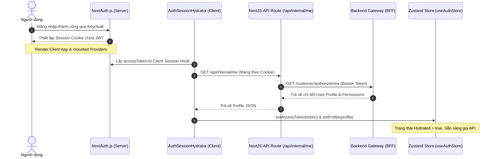

# QRTable Management Application (management-app)

> Tài liệu này cung cấp hướng dẫn chi tiết về cấu trúc mã nguồn, kiến trúc hệ thống, cơ chế quản lý state, bảo mật, và đưa ra lộ trình đọc hiểu source code một cách tối ưu cho lập trình viên.

---

## 1. Tổng quan Kiến trúc

Ứng dụng **Management App** được xây dựng trên nền tảng **Next.js App Router (v15)**, đóng vai trò là bảng điều khiển và hệ thống vận hành dành cho 3 nhóm đối tượng:

1.  **Super Admin (SaaS Admin)**: Quản lý các nhà hàng (Tenants), các gói dịch vụ (Subscriptions), thanh toán & doanh thu toàn hệ thống.
2.  **Restaurant Owner / Manager**: Quản lý thực đơn, sơ đồ bàn ăn, nhân sự, cấu hình thanh toán VietQR tại từng nhà hàng.
3.  **Staff (Waiter, Chef, Barista)**: Thực hiện bán hàng (POS), xem yêu cầu hỗ trợ từ bàn ăn, và chuẩn bị món ăn tại bếp/quầy nước (KDS).

### Bản đồ cấu trúc thư mục chính (`src/`)

```text
apps/management-app/src/
├── app/                        # Next.js App Router
│   ├── (admin)/                # Route Group dành cho Super Admin (/admin)
│   ├── (auth)/                 # Đăng nhập Keycloak (/login)
│   ├── (dashboard)/            # Dashboard quản lý nhà hàng (/dashboard)
│   ├── (kds)/                  # Màn hình bếp/bar dành cho Chef/Barista (/kds)
│   ├── (pos)/                  # Điểm bán hàng tại quầy dành cho Waiter (/pos)
│   ├── api/                    # Cục bộ API Routes (Auth callbacks, Session sync proxy)
│   ├── layout.tsx              # Root Layout
│   └── providers.tsx           # Bọc các global providers (React Query, NextAuth, Theme)
├── auth.ts                     # Cấu hình NextAuth v5 tích hợp Keycloak (OIDC/OAuth)
├── middleware.ts               # Next.js Middleware kiểm soát bảo vệ route & phân quyền (RBAC)
├── constants/
│   ├── api.ts                  # Đầu mút API BFF và cài đặt cache
│   └── routes.ts               # Hằng số định nghĩa toàn bộ đường dẫn của ứng dụng
├── lib/
│   ├── api/
│   │   └── authenticated-client.ts # API Client tự động inject Keycloak Bearer Token & Tenant Headers
│   ├── auth/
│   │   ├── auth-store.ts       # Zustand Store lưu trữ client-side profile và token
│   │   ├── bff-server.ts       # API gọi trực tiếp từ server-side Next.js lên BFF
│   │   └── role-routing.ts     # Ánh xạ vai trò (AppRole) với quyền truy cập trang
│   └── utils.ts                # Các hàm tiện ích dùng chung
├── features/                   # Mô-đun hóa các tính năng nghiệp vụ độc lập
│   ├── saas/                   # Quản lý Đăng ký gói (Subscription), Tenants, Plans
│   ├── kds/                    # Real-time Kitchen Display System (Bếp hiển thị)
│   ├── pos/                    # Điểm bán hàng, giỏ hàng POS
│   ├── order/                  # Quản lý danh sách, chi tiết đơn hàng
│   ├── tenant/                 # Cấu hình thông tin nhà hàng, tài khoản ngân hàng SePay
│   ├── tables/                 # Sơ đồ khu vực (Areas) & bàn ăn (Tables) + QR Generator
│   └── staff/                  # Quản lý nhân viên & tài khoản phân quyền
└── components/                 # Các UI component dùng chung toàn ứng dụng (Shadcn-based)
```

---

## 2. Quản lý Authentication & State Synchronization

Một trong những thiết kế quan trọng nhất của `management-app` là cách đồng bộ thông tin đăng nhập từ **Server-side (NextAuth)** xuống **Client-side (Zustand)** để tối ưu hoá hiệu năng và bảo vệ API:



### Các file cấu trúc chính trong luồng này:

1.  **[auth.ts](file:///Users/vodinhquan/Developer/Graduation-Thesis/graduation-thesis/qr-order/apps/management-app/src/auth.ts)**:
    - Tích hợp Keycloak Provider.
    - Đăng ký callback `jwt()` để giải mã các trường `realm_access.roles` và gọi BFF fetch profile.
    - Hỗ trợ tự động làm mới token (`refreshAccessToken`) ở background khi token sắp hết hạn bằng offline access/refresh token.
2.  **[auth-session-hydrator.tsx](file:///Users/vodinhquan/Developer/Graduation-Thesis/graduation-thesis/qr-order/apps/management-app/src/components/auth/auth-session-hydrator.tsx)**:
    - Lắng nghe thay đổi trạng thái đăng nhập từ NextAuth `useSession()`.
    - Nếu phát hiện token hết hạn và không thể tự làm mới (`RefreshAccessTokenError`), tự động điều hướng người dùng đăng nhập lại qua SSO.
    - Gọi API route trung gian `/api/internal/me` trên Next.js Server để lấy profile đầy đủ và đồng bộ dữ liệu vào `useAuthStore`.
3.  **[auth-store.ts](file:///Users/vodinhquan/Developer/Graduation-Thesis/graduation-thesis/qr-order/apps/management-app/src/lib/auth/auth-store.ts)**:
    - Store Zustand gọn nhẹ lưu trạng thái `profile`, `accessToken` và trạng thái sẵn sàng của client (`hydrated`).
4.  **[authenticated-client.ts](file:///Users/vodinhquan/Developer/Graduation-Thesis/graduation-thesis/qr-order/apps/management-app/src/lib/api/authenticated-client.ts)**:
    - API Client wrapper `authApiClient`. Nó tự động kéo token và `tenantId` từ Zustand Store để gắn vào tiêu đề:
      ```typescript
      headers['Authorization'] = `Bearer ${accessToken}`;
      headers['x-tenant-id'] = tenantId;
      ```

---

## 3. Phân Quyền Người Dùng (Role-Based Access Control - RBAC)

Hệ thống phân quyền được thực thi chặt chẽ ở cả **mức định tuyến (Routing)** và **mức API**:

### Phân tuyến qua Next.js Middleware

File **[middleware.ts](file:///Users/vodinhquan/Developer/Graduation-Thesis/graduation-thesis/qr-order/apps/management-app/src/middleware.ts)** chạy trước mọi request để kiểm tra quyền truy cập:

- **Trang công cộng (`/`)**: Nếu người dùng đã đăng nhập, tự động chuyển hướng họ vào trang chủ tương ứng với vai trò của họ thông qua hàm `getRoleHomeRoute(roles)`.
- **Route bảo vệ (`/dashboard`, `/pos`, `/kds`, `/admin`)**:
  - Nếu chưa đăng nhập: Chuyển hướng tới `/login`, lưu lại link cũ vào tham số query `?next=...` để redirect lại sau.
  - Nếu đã đăng nhập: Gọi hàm `hasAccessToPath(pathname, roles)` từ **[role-routing.ts](file:///Users/vodinhquan/Developer/Graduation-Thesis/graduation-thesis/qr-order/apps/management-app/src/lib/auth/role-routing.ts)** để kiểm tra. Nếu không có quyền, tự động điều hướng về Home Route hợp lệ gần nhất.

### Bảng cấu hình vai trò & Quyền hạn truy cập:

- `SUPER_ADMIN` $\rightarrow$ `/admin` (Quản lý toàn bộ SaaS POS).
- `OWNER` / `MANAGER` $\rightarrow$ `/dashboard` (Quản lý Menu, nhân viên, doanh thu, sơ đồ bàn của nhà hàng).
- `WAITER` $\rightarrow$ `/pos` (Tạo đơn hàng nhanh tại bàn, ghi nhận yêu cầu hỗ trợ).
- `CHEF` $\rightarrow$ `/kds/kitchen` (Xem danh sách món ăn cần chế biến của bếp).
- `BARISTA` $\rightarrow$ `/kds/bar` (Xem danh sách đồ uống cần pha chế của quầy bar).

---

## 4. Quản lý State & Cơ chế Real-time Cache Invalidation

Giống như Customer PWA, Next.js Management App sử dụng cơ chế **WebSocket Invalidation Hints** để kết hợp giữa ưu điểm của REST API (dễ quản lý, bảo mật, cache tốt) với WebSockets (thời gian thực):

1.  **REST Fetching**: Giao diện hiển thị sử dụng React Query (`useQuery`) để gọi dữ liệu từ BFF.
2.  **WebSocket Listener**: Khi có thay đổi xảy ra trên hệ thống (ví dụ: khách đặt món mới, khách xin thanh toán, món ăn nấu xong), BFF bắn event thời gian thực thông qua Socket.io.
3.  **Invalidate Cache**: Các custom hook realtime lắng nghe sự kiện và chỉ thực hiện xoá cache của React Query (`queryClient.invalidateQueries`).
4.  **Auto Re-fetch**: React Query phát hiện cache bị xoá sẽ tự động gọi lại API REST ở background để tải dữ liệu mới và cập nhật UI.

### Ví dụ tiêu biểu: KDS Realtime Queue

Màn hình nhà bếp lắng nghe sự kiện qua hook **[use-kds-realtime.ts](file:///Users/vodinhquan/Developer/Graduation-Thesis/graduation-thesis/qr-order/apps/management-app/src/features/kds/hooks/use-kds-realtime.ts)**:

- Nhân viên bếp đăng nhập, chọn station (ví dụ: Bếp hoặc Quầy bar).
- Hook sẽ kết nối socket với JWT auth token, và gửi tín hiệu tham gia phòng bếp/bar tương ứng:
  ```typescript
  socket.emit('subscribe.kds', { station });
  ```
- Lắng nghe các sự kiện `events.kdsQueueChanged`, `events.kitchenItemReady`, `events.kitchenSlaWarning` và dọn cache React Query tương ứng với station đó để cập nhật hàng đợi món ăn.

---

## 5. Chiến lược & Thứ tự Đọc mã nguồn (Roadmap)

Để nhanh chóng nắm bắt và làm chủ codebase của ứng dụng quản lý, bạn nên tiếp cận theo trình tự 5 bước dưới đây:

### Bước 1: Luồng Authentication & Đăng nhập

Tìm hiểu cách hệ thống xác thực người dùng và phân quyền.

- **[auth.ts](file:///Users/vodinhquan/Developer/Graduation-Thesis/graduation-thesis/qr-order/apps/management-app/src/auth.ts)**: Cấu hình NextAuth và Keycloak.
- **[middleware.ts](file:///Users/vodinhquan/Developer/Graduation-Thesis/graduation-thesis/qr-order/apps/management-app/src/middleware.ts)** và **[role-routing.ts](file:///Users/vodinhquan/Developer/Graduation-Thesis/graduation-thesis/qr-order/apps/management-app/src/lib/auth/role-routing.ts)**: Cơ chế chặn route và điều hướng theo phân quyền.
- **[auth-session-hydrator.tsx](file:///Users/vodinhquan/Developer/Graduation-Thesis/graduation-thesis/qr-order/apps/management-app/src/components/auth/auth-session-hydrator.tsx)**: Cách đồng bộ Session thành Client State (Zustand).

### Bước 2: API Client & Các Tiện ích Core

Tìm hiểu cách gọi API từ client lên backend.

- **[authenticated-client.ts](file:///Users/vodinhquan/Developer/Graduation-Thesis/graduation-thesis/qr-order/apps/management-app/src/lib/api/authenticated-client.ts)**: Cách token và tenant ID tự động đính kèm vào headers.

### Bước 3: Đọc hiểu Feature cơ bản (SaaS & Tenant)

Tìm hiểu cách viết một module CRUD hoàn chỉnh bằng React Query.

- **[features/saas/README.md](file:///Users/vodinhquan/Developer/Graduation-Thesis/graduation-thesis/qr-order/apps/management-app/src/features/saas/README.md)**: Quy tắc phân lớp monorepo đối với các badge trạng thái và text hiển thị.
- **[features/saas/api.ts](file:///Users/vodinhquan/Developer/Graduation-Thesis/graduation-thesis/qr-order/apps/management-app/src/features/saas/api.ts)**: Xem cách tổ chức API service tích hợp phân trang (`normalizePaginated`).

### Bước 4: Màn hình Real-time Bếp (KDS) & Bán hàng (POS)

Tìm hiểu các tính năng tương tác phức tạp hơn có sự kết hợp của Socket.io.

- **[features/kds/hooks/use-kds-realtime.ts](file:///Users/vodinhquan/Developer/Graduation-Thesis/graduation-thesis/qr-order/apps/management-app/src/features/kds/hooks/use-kds-realtime.ts)**: Cách lắng nghe sự kiện hàng đợi bếp và invalidate cache.
- **`features/pos/`**: Đọc hiểu luồng tạo order trực tiếp tại quầy, cập nhật bàn ăn và xử lý hóa đơn.

### Bước 5: Tìm hiểu App Layouts & Pages

Sau khi nắm chắc logic nghiệp vụ và state ở trên, bắt đầu xem cách lắp ráp UI vào trang Next.js:

- Màn hình admin hệ thống: `src/app/(admin)/admin/tenants/page.tsx`
- Màn hình quản lý nhà hàng: `src/app/(dashboard)/dashboard/menu/page.tsx`
- Màn hình KDS: `src/app/(kds)/kds/kitchen/page.tsx`
- Màn hình POS: `src/app/(pos)/pos/tables/page.tsx`

---

## 6. Tiêu chuẩn viết code (Development Guidelines)

Khi phát triển thêm tính năng hoặc refactor mã nguồn trong `management-app`, luôn tuân thủ các quy tắc sau:

1.  **Không gọi `process.env` trực tiếp trong business component**: Luôn lấy biến môi trường từ cấu hình chung hoặc các server-side files an toàn.
2.  **Không hardcode nhãn hiển thị trực tiếp**: Dùng các helper map ngôn ngữ (ví dụ: `billingPeriodVi`, `subscriptionStatusVi` từ `@einvoice/shared-constants`) để giữ tính nhất quán đa ngôn ngữ Việt - Anh.
3.  **Tách biệt UI và Data Fetching**:
    - Tạo các custom hook React Query đặt trong thư mục `features/{feature}/hooks/` thay vì viết `useQuery` inline trực tiếp trong file Page/Component.
    - Tránh các component quá lớn (> 300 dòng), hãy phân rã thành các component con cục bộ.
4.  **Luôn đính kèm `x-tenant-id`**: Với các API thuộc phạm vi tenant, luôn chắc chắn client sử dụng đúng hàm `authApiClient` để tránh rò rỉ dữ liệu chéo giữa các nhà hàng (Tenant Isolation).
