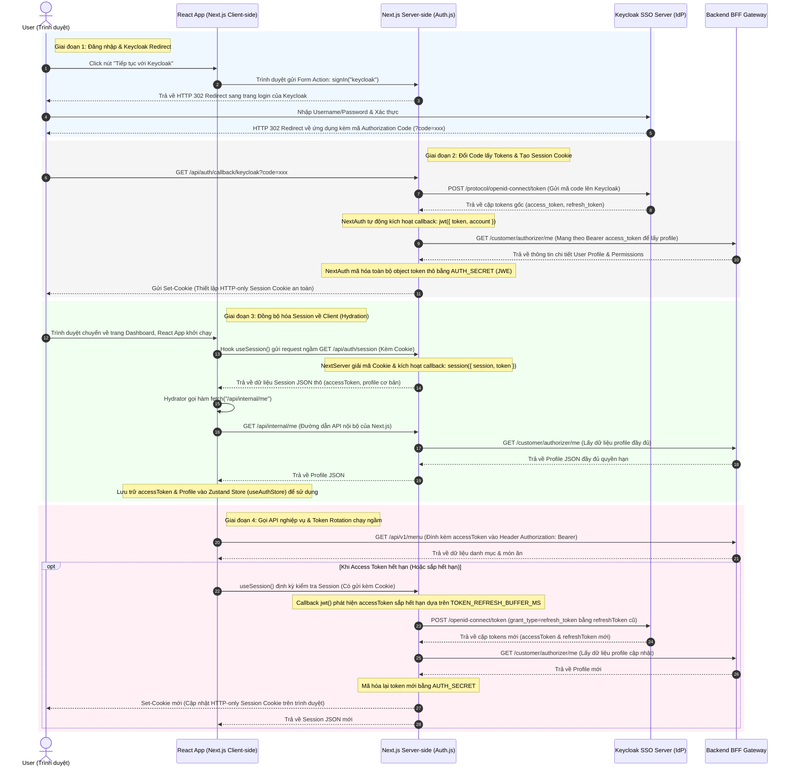

# Hướng Dẫn Phát Triển & Đọc Hiểu Mã Nguồn (management-app)

> Tài liệu này cung cấp hướng dẫn chi tiết về cấu trúc mã nguồn, kiến trúc hệ thống, cơ chế quản lý state, bảo mật, và đưa ra lộ trình đọc hiểu source code một cách tối ưu cho lập trình viên làm việc trên ứng dụng quản lý của hệ thống QRTable.

---

## 1. Tổng quan Kiến trúc

Ứng dụng **Management App** được xây dựng trên nền tảng **Next.js App Router (v15)** và **React 19**, đóng vai trò là bảng điều khiển và hệ thống vận hành dành cho 3 nhóm đối tượng:

1.  **Super Admin (SaaS Admin)**: Quản lý các nhà hàng (Tenants), các gói dịch vụ (Subscriptions), thanh toán & doanh thu toàn hệ thống.
2.  **Restaurant Owner / Manager**: Quản lý thực đơn, sơ đồ bàn ăn, nhân sự, cấu hình thanh toán VietQR tại từng nhà hàng.
3.  **Staff (Waiter, Chef, Barista)**: Thực hiện bán hàng (POS), xem yêu cầu hỗ trợ từ bàn ăn, và chuẩn bị món ăn tại bếp/quầy nước (KDS).

### Bản đồ cấu trúc thư mục chính (`src/`)

```text
apps/management-app/src/
├── app/                        # Next.js App Router
│   ├── (admin)/                # Route Group dành cho Super Admin (/admin)
│   ├── (auth)/                 # Đăng nhập Keycloak (/login)
│   ├── (dashboard)/            # Dashboard quản lý nhà hàng (/dashboard)
│   ├── (kds)/                  # Màn hình bếp/bar dành cho Chef/Barista (/kds)
│   ├── (pos)/                  # Điểm bán hàng tại quầy dành cho Waiter (/pos)
│   ├── api/                    # Cục bộ API Routes (Auth callbacks, Session sync proxy)
│   ├── layout.tsx              # Root Layout
│   └── providers.tsx           # Bọc các global providers (React Query, NextAuth, Theme)
├── auth.ts                     # Cấu hình NextAuth v5 tích hợp Keycloak (OIDC/OAuth)
├── middleware.ts               # Next.js Middleware kiểm soát bảo vệ route & phân quyền (RBAC)
├── constants/
│   ├── api.ts                  # Đầu mút API BFF và cài đặt cache
│   └── routes.ts               # Hằng số định nghĩa toàn bộ đường dẫn của ứng dụng
├── lib/
│   ├── api/
│   │   └── authenticated-client.ts # API Client tự động inject Keycloak Bearer Token & Tenant Headers
│   ├── auth/
│   │   ├── auth-store.ts       # Zustand Store lưu trữ client-side profile và token
│   │   ├── bff-server.ts       # API gọi trực tiếp từ server-side Next.js lên BFF
│   │   └── role-routing.ts     # Ánh xạ vai trò (AppRole) với quyền truy cập trang
│   └── utils.ts                # Các hàm tiện ích dùng chung
├── features/                   # Mô-đun hóa các tính năng nghiệp vụ độc lập
│   ├── saas/                   # Quản lý Đăng ký gói (Subscription), Tenants, Plans
│   ├── tenant/                 # Cấu hình thông tin nhà hàng, tài khoản ngân hàng SePay
│   ├── menu/                   # Quản lý thực đơn (Món ăn, danh mục, tuỳ chọn options)
│   ├── tables/                 # Sơ đồ khu vực (Areas) & bàn ăn (Tables) + QR Generator
│   ├── order/                  # Quản lý danh sách đơn hàng, hóa đơn và lịch sử đặt món
│   ├── pos/                    # Điểm bán hàng, giỏ hàng POS, thanh toán nhanh
│   ├── kds/                    # Real-time Kitchen Display System (Bếp hiển thị)
│   ├── staff/                  # Quản lý nhân viên & tài khoản phân quyền
│   ├── payment/                # Xử lý webhook SePay, đối soát hoá đơn
│   ├── reports/                # Báo cáo doanh thu và hiệu suất nhà bếp
│   ├── service-requests/       # Danh sách yêu cầu hỗ trợ từ bàn ăn realtime
│   └── landing/                # Trang chủ giới thiệu SaaS POS
└── components/                 # Các UI component dùng chung toàn ứng dụng (Shadcn-based)
```

### Bản đồ Định Tuyến Chi Tiết (`src/app/`)

- **`(admin)` (SaaS Control Panel):**
  - `/admin/tenants`: Xem danh sách, tạo mới, và quản lý các nhà hàng đăng ký trên hệ thống.
  - `/admin/plans`: Tạo và chỉnh sửa cấu hình gói dịch vụ (giá cả, giới hạn tính năng).
  - `/admin/billing`: Theo dõi hóa đơn đăng ký và doanh thu toàn hệ thống.
- **`(dashboard)` (Cửa Hàng Portal):**
  - `/dashboard/menu`: Quản lý thực đơn nhà hàng (Thêm/Sửa/Xóa món ăn, danh mục, topping).
  - `/dashboard/tables`: Thiết lập khu vực và bàn ăn, xuất/in mã QR bàn.
  - `/dashboard/staff`: Quản lý nhân viên, phân vai trò, tạo tài khoản.
  - `/dashboard/orders`: Xem lịch sử hóa đơn, đơn hàng và đối soát thanh toán.
  - `/dashboard/payment-settings`: Tích hợp tài khoản ngân hàng (SePay API/webhooks) để nhận VietQR.
  - `/dashboard/subscription`: Xem thông tin gói dịch vụ hiện tại, hạn dùng và lịch sử hóa đơn.
- **`(kds)` (Màn Hình Nhà Bếp):**
  - `/kds/kitchen`: Hàng đợi các món ăn cần nấu dành cho Đầu bếp.
  - `/kds/bar`: Hàng đợi các loại đồ uống cần pha chế dành cho Barista.
- **`(pos)` (Quầy Thu Ngân & Phục Vụ):**
  - `/pos/tables`: Sơ đồ trạng thái bàn ăn, chọn bàn đặt món, thanh toán nhanh và in hóa đơn tại quầy.

---

## 2. Công Nghệ Sử Dụng & Thư Viện Key

- **Frontend Framework**: **Next.js 15 (App Router)** & **React 19**
  - Sử dụng cơ chế Server Components (mặc định) để tối ưu hóa SEO, tải trang nhanh và bảo mật.
  - Sử dụng Client Components (đánh dấu bằng `'use client'`) cho các thành phần cần tương tác cao và realtime.
- **Styling & UI**: **Tailwind CSS v4** & **Shadcn UI**
  - Sử dụng cấu hình CSS-first mới của Tailwind CSS v4, quét các class UI từ thư viện dùng chung `libs/frontend/ui/src` thông qua chỉ thị `@source`.
  - Tối ưu hiệu ứng vi chuyển động (micro-animations) bằng **Framer Motion** và **tw-animate-css**.
- **Authentication**: **NextAuth.js v5 (auth.js)** & **Keycloak (SSO/OIDC)**
  - Xác thực thống nhất cho toàn bộ nhân viên, chủ nhà hàng và quản trị viên hệ thống qua Single Sign-On.
  - Tự động xoay vòng access token (`refreshAccessToken`) dưới nền thông qua refresh token.
- **State Management**:
  - **React Query (TanStack Query v5)**: Quản lý dữ liệu từ API (Server State), xử lý caching, phân trang và tự động fetch lại.
  - **Zustand**: Quản lý trạng thái giao diện cục bộ (Client State), lưu trữ token và profile an toàn ở phía client.
- **Real-time Synchronization**: **Socket.io-client**
  - Kết nối với cổng BFF Gateway để lắng nghe sự kiện thời gian thực và điều khiển React Query làm mới cache.

---

## 3. Cấu hình & Chạy Local

### Cài đặt biến môi trường

Tạo file `.env` tại thư mục `apps/management-app` từ mẫu `.env.example`:

```env
# NextAuth / Keycloak SSO Configuration
AUTH_SECRET=your_nextauth_secret_key # Key mã hóa session cookie ở server
AUTH_KEYCLOAK_ID=management-app
AUTH_KEYCLOAK_SECRET=your_keycloak_client_secret
AUTH_KEYCLOAK_ISSUER=http://localhost:8180/realms/qrtable

# BFF Gateway API Base URLs
MANAGEMENT_BFF_BASE_URL=http://localhost:3300/api/v1
NEXT_PUBLIC_BFF_BASE_URL=http://localhost:3300/api/v1
NEXT_PUBLIC_BFF_URL=http://localhost:3300/api/v1

# Đường dẫn Customer PWA (phục vụ sinh link QR bàn ăn)
NEXT_PUBLIC_CUSTOMER_PWA_URL=http://localhost:5173
```

### Các lệnh vận hành chính (Nx Monorepo)

- **Chạy môi trường phát triển (Dev Server)**:
  ```bash
  pnpm nx serve management-app
  # hoặc di chuyển vào apps/management-app và chạy:
  pnpm dev
  ```
  Ứng dụng sẽ chạy tại địa chỉ [http://localhost:3000](http://localhost:3000).
- **Build Production**:
  ```bash
  pnpm nx build management-app
  ```
- **Chạy Test (Jest)**:
  ```bash
  pnpm nx test management-app
  ```
- **Linter & Format**:
  ```bash
  pnpm nx lint management-app
  ```

---

## 4. Cơ chế Đăng Nhập & Đồng Bộ Trạng Thái (Auth & State Sync)

Trong kiến trúc Next.js App Router, **môi trường Server (Node.js)** và **môi trường Client (Trình duyệt)** là hai môi trường độc lập, không dùng chung bộ nhớ RAM. Do đó, app áp dụng mô hình đồng bộ Auth cực kỳ chặt chẽ:



### Tại sao phải thiết kế luồng đồng bộ này?

1.  **Bảo vệ tuyến đường ở Server**: Khi người dùng chuyển trang, Next.js Server cần đọc cookie đăng nhập ngay lập tức để quyết định xem có cho phép truy cập hay không thông qua [middleware.ts](./src/middleware.ts). Để bảo mật tuyệt đối chống tấn công XSS, cookie này được đặt chế độ `HttpOnly` (Javascript client không thể đọc).
2.  **Gọi API từ Client**: Khi chạy các component tương tác ở trình duyệt, Javascript cần lấy Access Token để đính kèm vào header `Authorization: Bearer <token>` gửi lên BFF Backend.
3.  **Đồng bộ**: [auth-session-hydrator.tsx](./src/components/auth/auth-session-hydrator.tsx) đóng vai trò là "cầu nối". Nó lấy token từ NextAuth (đã được cấu hình xuất ra client an toàn), gọi API trung gian để lấy profile và nạp vào Zustand store [auth-store.ts](./src/lib/auth/auth-store.ts). Từ đó, API client [authenticated-client.ts](./src/lib/api/authenticated-client.ts) ở client-side chỉ cần đọc từ Zustand để gọi API cực nhanh.

---

## 5. Phân Quyền Người Dùng (Role-Based Access Control - RBAC)

Quyền truy cập được kiểm soát ở cả **Định tuyến (Routing)** và **API**:

- **Middleware bảo vệ ([middleware.ts](./src/middleware.ts))**: Chạy trước mọi request.
  - Nếu chưa đăng nhập: Chuyển hướng người dùng về `/login`, lưu đường dẫn cũ vào query param `?next=...` để tự động quay lại sau khi login thành công.
  - Nếu đã đăng nhập: Gọi hàm `hasAccessToPath(pathname, roles)` từ [role-routing.ts](./src/lib/auth/role-routing.ts). Nếu người dùng không có quyền truy cập vào đường dẫn hiện tại, tự động chuyển hướng họ về trang chủ mặc định tương ứng với vai trò (Home Route).
- **Phân bổ trang chủ mặc định theo vai trò**:
  - `SUPER_ADMIN` $\rightarrow$ `/admin` (Quản trị hệ thống SaaS).
  - `OWNER` / `MANAGER` $\rightarrow$ `/dashboard` (Quản lý nhà hàng).
  - `WAITER` $\rightarrow$ `/pos` (Bán hàng & Phục vụ).
  - `CHEF` $\rightarrow$ `/kds/kitchen` (Bếp trưởng).
  - `BARISTA` $\rightarrow$ `/kds/bar` (Nhân viên pha chế).

---

## 6. Cơ chế Cập Nhật Thời Gian Thực (Real-time Cache Invalidation hints)

Để tối ưu hóa băng thông và tài nguyên máy chủ, thay vì gửi toàn bộ dữ liệu qua WebSocket, Management App áp dụng mô hình **WebSocket Invalidation Hints**:

1.  **Đọc dữ liệu**: Sử dụng React Query (`useQuery`) để gọi dữ liệu từ REST API của BFF. Dữ liệu này được cache trong bộ nhớ.
2.  **Lắng nghe sự kiện**: Khi có biến động dữ liệu phía backend (ví dụ: bếp nấu xong món, khách gọi nhân viên, thanh toán thành công), BFF bắn một sự kiện nhỏ qua Socket.io.
3.  **Xoá cache**: Các hook realtime lắng nghe sự kiện, xác thực đúng `tenantId` và thực hiện xóa cache của React Query (`queryClient.invalidateQueries`).
4.  **Tự động tải lại**: React Query phát hiện dữ liệu cache bị lỗi thời (invalidated) sẽ tự động kích hoạt cuộc gọi REST API ngầm để fetch dữ liệu mới nhất hiển thị lên UI.

_Ví dụ điển hình_: Đọc hiểu logic này tại hook của nhà bếp [use-kds-realtime.ts](./src/features/kds/hooks/use-kds-realtime.ts).

---

## 7. Lộ Trình Đọc Hiểu Mã Nguồn Từng Bước (Roadmap)

Để nhanh chóng nắm bắt và làm chủ toàn bộ logic của ứng dụng quản lý này, hãy đọc mã nguồn theo trình tự 5 bước dưới đây:

### Bước 1: Cơ chế Đăng Nhập & Phân Quyền (Auth & RBAC)

_Hãy đọc để hiểu cách hệ thống bảo mật ứng dụng trước khi tìm hiểu giao diện._

1.  **[auth.ts](./src/auth.ts)**: Xem cấu hình NextAuth, cách tích hợp Keycloak và cách cấu hình xoay vòng token dưới nền.
2.  **[middleware.ts](./src/middleware.ts)** và **[role-routing.ts](./src/lib/auth/role-routing.ts)**: Hiểu cơ chế intercept request, chặn đường dẫn và cách ánh xạ vai trò (`AppRole`) với URL trang chủ.
3.  **[auth-session-hydrator.tsx](./src/components/auth/auth-session-hydrator.tsx)**: Đọc để hiểu cách app đồng bộ session từ server thành Zustand store ở client.

### Bước 2: API Client & Cầu nối mạng (Networking)

_Hiểu cách client đính kèm Header và mã Tenant để giao tiếp an toàn._

1.  **[authenticated-client.ts](./src/lib/api/authenticated-client.ts)**: Xem cách API client tự động lấy token và `tenantId` từ Zustand để nhúng vào header `Authorization` và `x-tenant-id`.

### Bước 3: Xem tính năng CRUD mẫu (SaaS Module)

_Tìm hiểu cách tổ chức code cho một module nghiệp vụ cơ bản không có realtime._

1.  **[features/saas/README.md](./src/features/saas/README.md)**: Đọc quy tắc phân lớp monorepo đối với hiển thị ngôn ngữ Việt - Anh.
2.  **[features/saas/api.ts](./src/features/saas/api.ts)**: Xem cách tổ chức dịch vụ API, bọc các query và mutation, xử lý chuẩn hóa dữ liệu phân trang (`normalizePaginated`).

### Bước 4: Xem tính năng Realtime phức tạp (KDS & POS)

_Tìm hiểu cách kết hợp React Query với Socket.io client._

1.  **[use-kds-realtime.ts](./src/features/kds/hooks/use-kds-realtime.ts)**: Xem cách khởi tạo kết nối socket, tham gia phòng bếp theo vai trò (`subscribe.kds`) và xử lý xoá cache khi nhận sự kiện.
2.  **Thư mục `features/pos/`**: Đọc hiểu luồng tạo đơn hàng, quản lý giỏ hàng tại quầy và quy trình thanh toán bill.

### Bước 5: Tìm hiểu cấu trúc Layouts & Pages

_Xem cách Next.js App Router lắp ráp các Server/Client Components lại với nhau để dựng trang._

1.  Layout chính toàn cục: [layout.tsx](./src/app/layout.tsx) và [providers.tsx](./src/app/providers.tsx).
2.  Trang Admin hệ thống: `src/app/(admin)/admin/tenants/page.tsx`.
3.  Trang Dashboard nhà hàng: `src/app/(dashboard)/dashboard/menu/page.tsx`.
4.  Trang màn hình KDS nhà bếp: `src/app/(kds)/kds/kitchen/page.tsx`.
5.  Trang bán hàng POS: `src/app/(pos)/pos/tables/page.tsx`.

---

## 8. Quy Chuẩn Viết Code (Development Guidelines)

Khi phát triển hoặc chỉnh sửa tính năng, bắt buộc phải tuân theo các quy tắc dưới đây:

1.  **Không gọi `process.env` trực tiếp trong Component**: Luôn lấy biến môi trường qua file cấu hình trung tâm để đảm bảo an toàn và dễ debug.
2.  **Không hardcode chuỗi hiển thị tiếng Việt/tiếng Anh**: Sử dụng các hàm ánh xạ tiếng Việt (như `billingPeriodVi`, `subscriptionStatusVi` từ thư viện `@einvoice/shared-constants`) để đảm bảo dịch ngôn ngữ nhất quán.
3.  **Tách biệt UI và Data Fetching**:
    - Tạo các React Query custom hook riêng đặt trong thư mục `features/{feature}/hooks/`. Không viết `useQuery` hay fetch API trực tiếp (inline) trong file giao diện Page/Component.
    - Nếu một component dài quá 300 dòng, bắt buộc phải phân rã thành các component con cục bộ.
4.  **Tuân thủ Tenant Isolation (Cô lập dữ liệu nhà hàng)**:
    - Với mọi API nghiệp vụ của nhà hàng, phải chắc chắn sử dụng `authApiClient` để header mang theo `x-tenant-id`.
    - Tuyệt đối không để rò rỉ chéo dữ liệu giữa các nhà hàng khác nhau.
5.  **Làm tròn tiền VND (VND Rounding)**: Mọi số tiền thanh toán phải đi qua hàm làm tròn lên nghìn đồng `roundVnd` từ thư viện `@qrtable/utils`.
