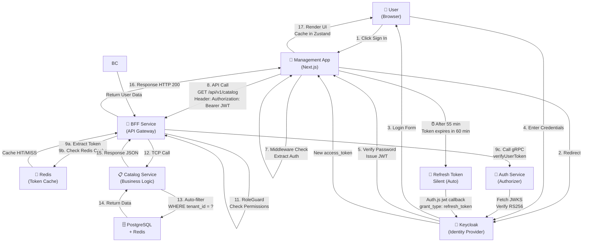
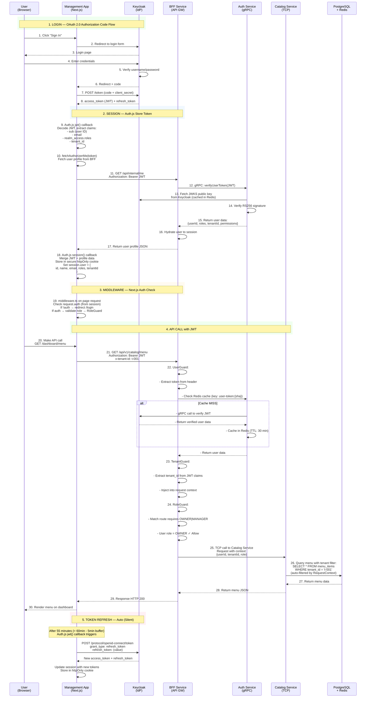

# HƯỚNG DẪN ĐỌC VÀ KIỂM SOÁT MÃ NGUỒN AUTHENTICATION

> **Tài liệu Bàn giao Mã nguồn (Code Handover) — Authentication & Authorization**
>
> **Đối tượng:** Senior Reviewer/QA đánh giá độ an toàn, tính chính xác, và khả năng triển khai lâu dài của hệ thống auth.
>
> **Mục tiêu:** Cung cấp bản đồ chi tiết, dòng chảy dữ liệu, và danh sách file để kiểm soát toàn bộ logic xác thực & phân quyền trong QRTable.
>
> **Phiên bản:** 1.0 | **Ngày:** Tháng 3, 2026

---

## MỤC LỤC

1. [The Big Picture — Bản đồ Luồng dữ liệu Toàn hệ thống](#1-the-big-picture--bản-đồ-luồng-dữ-liệu-toàn-hệ-thống)
2. [Thứ tự Đọc Mã nguồn (Step-by-step Reading Path)](#2-thứ-tự-đọc-mã-nguồn-step-by-step-reading-path)
3. [Phân tích Chi tiết Các Thành phần Then chốt](#3-phân-tích-chi-tiết-các-thành-phần-then-chốt)
4. [Bản Đối chiếu Kỹ thuật & Verific ation Checklist](#4-bản-đối-chiếu-kỹ-thuật--verification-checklist)
5. [Debug & Testing Guide](#5-debug--testing-guide)

---

## 1. THE BIG PICTURE — BẢN ĐỒ LUỒNG DỮ LIỆU TOÀN HỆ THỐNG

### 1.1 Tổng quan 2 Luồng Xác thực Song song

Hệ thống QRTable sử dụng 2 mô hình xác thực độc lập phục vụ 2 actor khác nhau:

#### Luồng 1: JWT (Staff/Owner/Admin) — OAuth 2.0 → Auth.js → BFF



**Các bước chính:**

1. User click "Sign In" → redirect Keycloak
2. Keycloak cấp JWT (RS256 signed)
3. Auth.js lưu JWT vào httpOnly cookie (không thể access từ JS)
4. Middleware kiểm tra auth → RoleGuard
5. BFF verify JWT qua gRPC → Auth Service
6. Auth Service verify signature qua Keycloak JWKS (cache 30 min)
7. TenantGuard inject tenant_id vào request
8. Service auto-filter queries WHERE tenant_id = ?
9. AutoRefresh: Nếu token expires trong 5 phút → tự động refresh

---

#### Luồng 2: Session (Customer/Guest) — HMAC Token → Anonymous

```mermaid
graph TD
    Cust["👥 Customer<br/>(QR Scan)"] -->|1. Scan QR Code| PWA["📱 Customer PWA<br/>(Vite + React)"]

    PWA -->|URL:<br/>https://slug.qrtable.io<br/>?table=T123&token=HMAC<br/>| PWA

    PWA -->|2. Generate UUID<br/>sessionId = UUID()| PWA
    PWA -->|3. Store in localStorage<br/>sessionId, tableId| Browser["🌐 Browser<br/>(localStorage)"]

    Cust -->|4. Browse Menu| PWA
    PWA -->|5. GET /api/v1/catalog<br/>Cookie: sessionId=UUID| BFF["🚪 BFF Service<br/>(API Gateway)"]

    BFF -->|6a. SessionGuard<br/>Extract HMAC token<br/>6b. Validate HMAC<br/>verify(tableId, token, secret)| BFF

    BFF -->|7. Resolve tenant_id<br/>from table mapping| SaaS["🏪 SaaS Service<br/>(Tenant Lookup)"]
    SaaS -->|Return tenant_id| BFF

    BFF -->|8. Get/Create Session<br/>session:{tid}:{uuid}| Redis["💾 Redis<br/>(Session Store)"]
    Redis -->|TTL: 2 hours| Redis

    BFF -->|9. TenantGuard<br/>Verify consistency| BFF
    BFF -->|⚠️ NO RoleGuard<br/>Customer is Anonymous| BFF

    BFF -->|10. Return Menu| PWA
    PWA -->|11. Render Menu| Cust

    Cust -->|12. Add to Cart| PWA
    PWA -->|13. Update localStorage| Browser

    Cust -->|14. Click Order| PWA
    PWA -->|15. POST /api/v1/orders<br/>Cookie: sessionId=UUID<br/>?table=T123&token=HMAC<br/>Body: {items, total}| BFF

    BFF -->|16. Validate HMAC (again)| BFF
    BFF -->|17. Get Session from Redis| Redis
    BFF -->|18. Check table_id match| BFF

    BFF -->|19. TCP Call| Order["🍽️ Order Service"]
    Order -->|20. BEGIN TRANSACTION<br/>Stock Lock| DB["🗄️ PostgreSQL<br/>"]
    DB -->|21. SELECT ... FOR UPDATE<br/>Check stock >= qty| DB
    DB -->|22. Deduct stock<br/>Insert order_items<br/>COMMIT| DB

    Order -->|23. Emit Kafka<br/>order.created| Kafka["📨 Kafka<br/>(Event Stream)"]

    BFF -->|24. WebSocket Push<br/>order.status_changed| PWA
    PWA -->|25. Real-time Update| Cust

    Note over PWA,BFF: ⚠️ NO KEYCLOAK<br/>Zero-friction UX<br/>Session TTL: 2 hours<br/>Idle Timeout: 30 min
```

**Các bước chính:**

1. Customer scan QR → PWA load
2. Extract tableId + HMAC từ URL
3. Browser tạo sessionId (UUID) → store localStorage
4. SessionGuard validate HMAC signature
5. Resolve tenant_id từ table mapping
6. Create session in Redis (2 hour lifetime, 30 min idle)
7. ⚠️ NO Keycloak (zero-friction UX)
8. Query auto-filter WHERE tenant_id = ?
9. Stock validation: SELECT ... FOR UPDATE (pessimistic lock)
10. Real-time WebSocket update via Kafka

### 1.2 Diagram Tuần tự Chi tiết (Sequence Diagram)

#### Staff/Owner Flow: Keycloak → JWT → BFF → Service



#### Customer Flow: HMAC Token → Session → Order

```mermaid
sequenceDiagram
    participant Cust as Customer<br/>(QR Scan)
    participant PWA as Customer PWA<br/>(Vite React)
    participant BFF as BFF Service<br/>(API GW)
    participant Svc as Order Service<br/>(TCP)
    participant DB as Redis<br/>+ PostgreSQL

    rect rgb(240, 255, 240)
        Note over Cust,BFF: 1. SCAN QR — HMAC Token Validation
    end

    Cust->>Cust: 1. Scan QR Code from table
    Note over Cust: URL: https://qrtable.io?table=T123&token=HMAC_SHA256...

    Cust->>PWA: 2. Browser loads PWA
    PWA->>PWA: 3. Extract from URL:<br/>tableId = T123<br/>token = HMAC (value)

    PWA->>PWA: 4. Browser-side validation<br/>Verify HMAC is not empty<br/>(detailed validation on server)

    PWA->>PWA: 5. Generate session_id = UUID()
    PWA->>PWA: 6. Store in localStorage<br/>sessionId = session_id<br/>tableId = T123

    rect rgb(240, 248, 255)
        Note over PWA,BFF: 2. FIRST API CALL — Session Creation
    end

    PWA->>BFF: 7. POST /api/v1/orders/start-session<br/>Body: {tableId, token}<br/>Cookie: sessionId=UUID

    BFF->>BFF: 8. SessionGuard:<br/>- Extract token from body<br/>- Extract tableId from query
    BFF->>BFF: 9. Verify HMAC token:<br/>computed_hmac = HMAC_SHA256(<br/>  tableId + storeId,<br/>  SECRET_KEY<br/>)<br/>IF computed_hmac !== token<br/>  → 401 INVALID_TOKEN<br/>ELSE ✓ Token valid

    BFF->>DB: 10. Find tenant_id from table mapping:<br/>SELECT tenant_id FROM tables<br/>WHERE id = tableId

    DB-->>BFF: 11. Return {tenantId: t-001}

    BFF->>DB: 12. Get/create session in Redis:<br/>GET session:t-001:UUID<br/>IF not exists<br/>  → SET session:t-001:UUID {<br/>    tableId: T123,<br/>    startedAt: now(),<br/>    lastActivity: now(),<br/>    status: "active"<br/>  }<br/>  → TTL: 2 hours

    DB-->>BFF: 13. Return session data

    BFF->>BFF: 14. TenantGuard:<br/>- Inject tenantId into context<br/>- No caller tenant_id to verify
    BFF->>BFF: 15. ⚠No RoleGuard (customer is anon)

    BFF->>Svc: 16. TCP: startSession({<br/>  tableId, tenantId, sessionId<br/>})

    Svc->>DB: 17. Create/update session in Redis:<br/>cart:t-001:UUID → empty Hash<br/>TTL: 2 hours (bound to session)

    DB-->>Svc: 18. OK
    Svc-->>BFF: 19. Return {<br/>  sessionId, tableId, tenantId<br/>}

    BFF-->>PWA: 20. HTTP 201<br/>Body: {sessionId, menu: {...}}

    PWA->>PWA: 21. Store sessionId in localStorage<br/>Render menu

    rect rgb(255, 250, 240)
        Note over PWA,Svc: 3. BROWSE MENU & ADD TO CART
    end

    Cust->>PWA: 22. Browse menu items
    PWA->>BFF: 23. GET /api/v1/catalog/by-tenant<br/>x-tenant-id: t-001<br/>(from session)

    BFF->>Svc: 24. TCP call (auto-inject tenant filter)

    Svc->>DB: 25. SELECT menu_items<br/>WHERE tenant_id = 't-001'<br/>AND status != 'OUT_OF_STOCK'

    DB-->>PWA: 26. Return menu (via BFF)

    Cust->>PWA: 27. Click "Add to cart"<br/>Item: Phở bò x2

    PWA->>PWA: 28. Update local cart state:<br/>cart[itemId] = {<br/>  qty: 2,<br/>  price: 50000,<br/>  name: "Phở bò"<br/>}

    PWA->>PWA: 29. Persist to localStorage

    rect rgb(240, 255, 240)
        Note over PWA,Svc: 4. SUBMIT ORDER
    end

    Cust->>PWA: 30. Click "Order"

    PWA->>PWA: 31. Validate cart<br/>- Not empty<br/>- All items in cart still available<br/>- Total <= limit

    PWA->>BFF: 32. POST /api/v1/orders<br/>Cookie: sessionId=UUID<br/>x-tenant-id: t-001<br/>Body: {<br/>  items: [{itemId, qty, price}],<br/>  totalAmount: 100000<br/>}<br/>Query: ?table=T123&token=HMAC

    BFF->>BFF: 33. SessionGuard (again):<br/>- Validate HMAC token<br/>- Get session from Redis<br/>- Check session is active<br/>- Verify session.tableId == T123

    BFF->>Svc: 34. TCP: submitOrder({<br/>  sessionId, tenantId, tableId,<br/>  items[], totalAmount<br/>})

    Svc->>DB: 35. BEGIN TRANSACTION
    Svc->>DB: 36. SELECT stock FROM menu_items<br/>WHERE id IN (itemIds)<br/>FOR UPDATE (Pessimistic Lock)<br/>IF stock < requested_qty<br/>  → ROLLBACK (401 STOCK_UNAVAILABLE)<br/>ELSE ✓

    Svc->>DB: 37. INSERT INTO orders ({<br/>  id, tenantId, tableId, sessionId,<br/>  status: "PENDING",<br/>  totalAmount, createdAt<br/>})

    Svc->>DB: 38. INSERT INTO order_items ({<br/>  orderId, itemId, qty, price<br/>})

    Svc->>DB: 39. UPDATE menu_items<br/>SET stock = stock - qty<br/>WHERE id = itemId

    Svc->>DB: 40. COMMIT TRANSACTION

    Svc->>Svc: 41. Emit Kafka: order.created<br/>{<br/>  orderId, tenantId, tableId,<br/>  items, totalAmount<br/>}

    Svc-->>BFF: 42. Return {orderId, status}

    BFF-->>PWA: 43. HTTP 201<br/>Body: {orderId, message: "Order placed"}

    PWA->>PWA: 44. Clear cart<br/>Show "Order confirmed, waiting..."<br/>Start polling/WebSocket for status

    rect rgb(200, 230, 255)
        Note over Svc,PWA: 5. REAL-TIME NOTIFICATION via WebSocket
    end

    Note over Svc,BFF: Kafka: order.confirmed<br/>→ Kitchen Service receives<br/>→ Creates KDS ticket<br/>→ Emits kitchen.item_ready (async)

    BFF->>PWA: 45. WebSocket push:<br/>event: "order.status_changed"<br/>data: {<br/>  orderId,<br/>  status: "PROCESSING"<br/>}

    PWA->>PWA: 46. Update UI in real-time<br/>"Your order is being prepared..."

    Note over BFF,PWA: ⚠ No token refresh needed<br/>Session lifetime = 2 hours<br/>Idle timeout = 30 min (auto-close if inactive)
```



---

## 2. THỨ TỰ ĐỌC MÃ NGUỒN (STEP-BY-STEP READING PATH)

### 2.1 Infra & Config (Foundation — đọc trước)

Các file này thiết lập môi trường xác thực cơ bản:

| Đường dẫn                                                                        | Mục đích                | Lưu ý chính                                                              |
| -------------------------------------------------------------------------------- | ----------------------- | ------------------------------------------------------------------------ |
| [apps/bff/src/configuration/index.ts](../../apps/bff/src/configuration/index.ts) | Tập hợp tất cả env vars | Kiểm tra các biến `AUTH_KEYCLOAK_*`, `REDIS_*`, `JWT_*` được define      |
| [apps/management-app/.env.local](../../apps/management-app/.env.local)           | Frontend env config     | `MANAGEMENT_BFF_BASE_URL`, `NEXT_PUBLIC_BFF_BASE_URL`, `AUTH_KEYCLOAK_*` |
| [apps/bff/src/main.ts](../../apps/bff/src/main.ts)                               | BFF service entry point | Kiểm tra Swagger config, CORS, middleware order                          |

### 2.2 Frontend Auth (Management App) — Next.js + Auth.js + Zustand

**Thứ tự đọc:**

1. **[apps/management-app/src/auth.ts](../../apps/management-app/src/auth.ts)** (Trung tâm điều khiển)
   - **Tại sao:** File này định nghĩa toàn bộ NextAuth v5 configuration, JWT callback, refresh token logic.
   - **Logic cốt lõi (dòng):**
     - Dòng 15-30: `resolveRolesFromProfileOrClaims()` — merge roles từ profile vs. JWT claims
     - Dòng 35-50: `decodeJwtClaims()` — decode JWT payload (không verify, chỉ extract)
     - Dòng 70-100: `refreshAccessToken()` — **Refresh token silently** khi hết hạn
       - Kiểm tra `token.refreshToken` có tồn tại
       - POST đến Keycloak `/protocol/openid-connect/token` endpoint
       - Nhận JWT mới + refresh_token mới
       - Update token trong session + cache
     - Dòng 110+: NextAuth config:
       - Provider: `Keycloak` (OAuth 2.0)
       - Scope: `openid profile email offline_access` (offline_access = để cấp refresh_token)
       - Session strategy: `jwt` (token-based, không dùng server session)
       - `jwt()` callback: gọi `fetchAuthorizerMe()` để lấy profile từ BFF (line 150+)
       - `session()` callback: hydrate session.user từ JWT token (line 165+)

2. **[apps/management-app/src/middleware.ts](../../apps/management-app/src/middleware.ts)** (Route Protection)
   - **Tại sao:** Middleware này chạy trước mọi page render, kiểm tra auth & redirect theo role.
   - **Logic cốt lõi:**
     - Dòng 10-25: `isProtectedPath()` — kiểm tra route có yêu cầu auth không
     - Dòng 27-35: Nếu `/` → redirect đến role-specific home (`/dashboard`, `/admin`, `/pos`, etc.)
     - Dòng 37-45: Nếu route `AUTH_PATHS` (login, signup) nhưng user đã auth → redirect home
     - Dòng 47-55: Nếu protected route nhưng user chưa auth → redirect `/login?next={path}`
     - Dòng 56: `hasAccessToPath()` — kiểm tra user role có đủ quyền truy cập route không

3. **[apps/management-app/src/lib/auth/role-routing.ts](../../apps/management-app/src/lib/auth/role-routing.ts)** (Role-based Routing)
   - **Tại sao:** Định nghĩa bảng mapping zwischen roles ↔ home routes ↔ accessible paths.
   - **Logic cốt lõi:**
     - Dòng 10-20: `ROLE_HOME_ROUTE` — map role → default page (OWNER → `/dashboard`, SUPER_ADMIN → `/admin`)
     - Dòng 22-45: `ROUTE_ACCESS` — bảng whitelist: route prefix → array of roles được phép
     - Dòng 50-65: `parseRoles()` — normalize roles từ JWT (trim, uppercase, validate)
     - Dòng 95-105: `getRoleHomeRoute()` — duyệt `ROLE_PRIORITY` để lấy home route của role cao nhất (ưu tiên SUPER_ADMIN > OWNER > MANAGER)

4. **[apps/management-app/src/lib/auth/auth-store.ts](../../apps/management-app/src/lib/auth/auth-store.ts)** (Client-side State)
   - **Tại sao:** Zustand store để hold user profile (sau khi hydrate từ JWT).
   - **Logic cốt lõi:**
     - Dòng 5-10: Type `AuthStore` — `profile`, `hydrated` flag
     - Dòng 18: `setProfile()` — hydrate user data từ session (gọi từ component)
     - **⚠ Lưu ý:** Đây là client-side state, dùng cho trong-memory caching. JWT source of truth nằm ở cookie.

5. **[apps/management-app/src/lib/auth/bff-server.ts](../../apps/management-app/src/lib/auth/bff-server.ts)** (Server Action)
   - **Tại sao:** Server function để fetch `/api/internal/me` từ BFF — lấy user profile từ backend.
   - **Logic cốt lõi:**
     - Dòng 20: `getFffBaseUrl()` → resolve BFF URL từ env
     - Dòng 30-50: `fetchAuthorizerMe()` → **gọi BFF endpoint để get user profile**
       - Header: `Authorization: Bearer {accessToken}`
       - Header: `x-tenant-id: {tenantId}` (nếu có)
       - **Endpoint:** `GET /api/internal/me` → return `UserProfile { userId, roles, tenantId, permissions, email }`
       - **Cache:** `cache: no-store` (luôn fetch tươi)

### 2.3 BFF Auth Guards (Validation Layer) — NestJS Guards

**Thứ tự đọc:**

1. **[apps/bff/src/app/app.module.ts](../../apps/bff/src/app/app.module.ts)** (Guard Chain Setup)
   - **Tại sao:** Định nghĩa order của guards (APP_GUARD provider → chạy global cho mọi route).
   - **Logic cốt lõi:**
     - Dòng 20-25: `imports` — load các modules (ConfigModule, services, Redis, Throttler)
     - Dòng 30-50: `providers` → APP_GUARD (chạy theo thứ tự):
       1. `UserGuard` — verify JWT
       2. `SessionGuard` — manage session
       3. `TenantGuard` — enforce tenant isolation
       4. `PermissionGuard` — check permissions
       5. `ThrottlerGuard` — rate limiting
     - Dòng 55-60: `configure()` middleware:
       1. `LoggerMiddleware` — process ID tracking
       2. `TenantMiddleware` → extract tenant_id từ header/subdomain

2. **[apps/bff/src/app/guards/user.guard.spec.ts](../../apps/bff/src/app/guards/user.guard.spec.ts)** (JWT Verification)
   - **Tại sao:** Test file cho UserGuard, nhưng có code đầy đủ của guard.
   - **Logic cốt lõi:**
     - Kiểm tra decorator `@Authorization({ secured: true })`
     - Nếu chưa secured → return `true` (pass)
     - Nếu secured → extract JWT từ header
     - Call `AuthorizerService.verifyUserToken(jwt)` (gRPC call đến Auth Service)
     - Nếu token hợp lệ → return `true`
     - Nếu invalid_token → throw `UnauthorizedException(AUTH_ERROR_CODE.INVALID_TOKEN)`
     - Nếu user chưa provision → throw `UnauthorizedException(AUTH_ERROR_CODE.USER_NOT_PROVISIONED)`
     - ⚠ **Kiểm tra Redis cache:** `IF cached THEN return cached ELSE gRPC call THEN cache`

3. **[apps/bff/src/app/guards/tenant.guard.spec.ts](../../apps/bff/src/app/guards/tenant.guard.spec.ts)** (Tenant Isolation)
   - **Tại sao:** Enforce tenant cô lập — mỗi request chỉ có thể access data của tenant riêng.
   - **Logic cốt lõi:**
     - Extract `tenant_id` từ:
       1. JWT claims (nếu UserGuard đã verify)
       2. RequestContext (injected từ TenantMiddleware)
       3. Query param `?tenant_id=` (chỉ dùng cho debug, Super Admin only)
     - Kiểm tra consistency: user tenant == request tenant
     - Inject vào `request.context.tenantId` → dùng trong repositories
     - ⚠ **TypeError**: Nếu tenant_id không match → throw `ForbiddenException(TENANT_MISMATCH)`

4. **[apps/bff/src/app/guards/permission.guard.spec.ts](../../apps/bff/src/app/guards/permission.guard.spec.ts)** (Role-based Permissions)
   - **Tại sao:** Kiểm tra user có quyền (permission) thực hiện action hay không.
   - **Logic cốt lõi:**
     - Kiểm tra decorator `@Permissions(['CREATE_MENU', 'EDIT_MENU'])`
     - Lấy user permissions từ JWT claims hoặc profile
     - Kiểm tra intersection: required_perms ⊆ user_perms
     - Nếu OK → pass; Nếu không → throw `ForbiddenException(PERMISSION_DENIED)`

### 2.4 Backend Auth Service (Authorizer) — gRPC Service

**Thứ tự đọc:**

1. **[apps/authorizer/src/app/authorizer.controller.ts](../../apps/authorizer/src/app/authorizer.controller.ts)** (gRPC Server)
   - **Tại sao:** Implement gRPC service cho BFF gọi lên để verify JWT.
   - **RPC Methods:**
     - `verifyUserToken(JwtToken)` → return UserProfile
       - Fetch Keycloak JWKS public key (cached in Redis)
       - Verify RS256 signature của JWT
       - Decode claims
       - Return `{ sub, email, roles, tenant_id, permissions }`

2. **[apps/authorizer/src/configuration/keycloak.ts](../../apps/authorizer/src/configuration/keycloak.ts)** (Keycloak Integration)
   - **Tại sao:** Config HTTP client để gọi Keycloak REST API.
   - **Endpoint chính:**
     - `GET /realms/qrtable/.well-known/openid-configuration` — OIDC discovery
     - `GET /realms/qrtable/protocol/openid-connect/certs` — JWKS public keys

### 2.5 Middleware & Context Injection

1. **[libs/@common/middlewares/logger.middleware.ts](../../libs/@common/middlewares/logger.middleware.ts)**
   - Tạo `processId` (UUID) cho mỗi request → track across services

2. **[libs/@common/middlewares/tenant.middleware.ts](../../libs/@common/middlewares/tenant.middleware.ts)**
   - Extract `tenant_id` từ:
     - Header: `x-tenant-id`
     - Subdomain: `{slug}.qrtable.io` → resolve tenant từ SaaS service
     - URL param: `?tenant_id=` (debug only)
   - Inject vào `request.context.tenantId`

---

## 3. PHÂN TÍCH CHI TIẾT CÁC THÀNH PHẦN THEN CHỐT

### 3.1 Keycloakify Integration (Frontend Custom Login)

#### Mục đích

Keycloak có trang login hosted riêng (mặc định theme Keycloak thường). Keycloakify cho phép custom React component thay thế theme này → UI phù hợp branding QRTable.

#### Cấu trúc Keycloakify

```
apps/keycloak-theme/
├── src/main.tsx              # Entry point
├── login.tsx                 # Custom login component
├── register.tsx              # Custom register component
├── account.tsx               # Custom account settings
└── index.html
```

#### Flow

1. **Development:** `npm run dev` → localhost:5173 (Keycloakify dev server)
2. **Build:** `npm run build` → `nix run` → tạo file `.jar` cho Keycloak theme
3. **Deploy:** Copy `.jar` vào Keycloak `/opt/keycloak/providers/` → restart Keycloak
4. **Result:** Keycloak login page render custom React component

#### Kiểm tra

- Navigate to `http://keycloak:8180/realms/qrtable/account`
- Nên thấy custom UI (QRTable branding)
- Nếu vẫn thấy Keycloak default → theme chưa load (check `.jar`)

### 3.2 Token Management & Refresh Mechanism (A/B)

#### A. Frontend Side (Auth.js)

**File:** [apps/management-app/src/auth.ts](../../apps/management-app/src/auth.ts)

**Mechanism:**

```typescript
// jwt() callback — runs mỗi khi session được access
async jwt({ token, account }) {
  // 1. First time (account object tồn tại = user vừa login)
  if (account?.access_token) {
    return {
      ...token,
      accessToken: account.access_token,
      refreshToken: account.refresh_token,
      expiresAt: account.expires_at * 1000, // Keycloak cấp expires_at (seconds)
    };
  }

  // 2. Refresh case: check nếu token sắp hết hạn
  if (Date.now() < token.expiresAt - TOKEN_REFRESH_BUFFER_MS) {
    // Token còn hạn → return as-is
    return token;
  }

  // 3. Token hết hạn → call refreshAccessToken()
  return refreshAccessToken(token);
}

// refreshAccessToken() function
async function refreshAccessToken(token: JWT): Promise<JWT> {
  if (!token.refreshToken) {
    return { ...token, error: 'RefreshAccessTokenError' };
  }

  try {
    const response = await fetch(getIssuerTokenEndpoint(), {
      method: 'POST',
      headers: { 'Content-Type': 'application/x-www-form-urlencoded' },
      body: new URLSearchParams({
        client_id: process.env.AUTH_KEYCLOAK_ID,
        client_secret: process.env.AUTH_KEYCLOAK_SECRET,
        grant_type: 'refresh_token',
        refresh_token: token.refreshToken,
      }),
    });

    const refreshed = await response.json();
    // Keycloak returns: { access_token, expires_in, refresh_token, ... }

    return {
      ...token,
      accessToken: refreshed.access_token,
      expiresAt: Date.now() + refreshed.expires_in * 1000,
      refreshToken: refreshed.refresh_token ?? token.refreshToken,
      // ⚠ QUAN TRỌNG: Re-hydrate roles + tenantId từ new token
      roles: resolveRolesFromProfileOrClaims(me?.roles, claims.realm_access?.roles),
      tenantId: me?.tenantId ?? claims.tenant_id,
      error: undefined,
    };
  } catch (error) {
    return { ...token, error: 'RefreshAccessTokenError' };
  }
}
```

**Kiểm tra:**

- Token lifetime: 1 hour (Keycloak default)
- Refresh buffer: 5 minutes (to `TOKEN_REFRESH_BUFFER_MS`)
- Mỗi khi user add đến session → check nếu token expires trong 5 phút → refresh
- ⚠ Nếu `refreshAccessToken()` fails → set `token.error = 'RefreshAccessTokenError'`
- Middleware kiểm tra `session.error` → redirect `/login` nếu có error

#### B. Backend Side (BFF — Token Cache)

**File:** [apps/bff/src/app/guards/user.guard.ts](../../apps/bff/src/app/guards/user.guard.ts)

**Mechanism:**

```typescript
export class UserGuard implements CanActivate {
  async canActivate(context: ExecutionContext): Promise<boolean> {
    const request = context.switchToHttp().getRequest();
    const token = extractTokenFromHeader(request);

    if (!token) {
      throw new UnauthorizedException(AUTH_ERROR_CODE.INVALID_TOKEN);
    }

    // 1. Check Redis cache
    const cacheKey = `user-token:${sha256(token)}`;
    const cachedUser = await this.redisService.get(cacheKey);
    if (cachedUser) {
      // Cache HIT → inject vào request context
      request.user = JSON.parse(cachedUser);
      return true;
    }

    // 2. Cache MISS → call gRPC auth service
    try {
      const userProfile = await this.authorizerService.verifyUserToken(token);

      // 3. Cache result (TTL: 30 minutes)
      await this.redisService.set(cacheKey, JSON.stringify(userProfile), 'EX', 1800);

      request.user = userProfile;
      return true;
    } catch (error) {
      throw new UnauthorizedException(AUTH_ERROR_CODE.INVALID_TOKEN);
    }
  }
}
```

**Kiểm tra:**

- Redis cache key: `user-token:{sha256(jwt)}`
- Cache TTL: 30 minutes (short-lived, vì JWT already carries expiry)
- Nếu token invalid → cache miss + gRPC call → misses → throw 401
- ⚠ Nếu Keycloak down → cache expired tokens fail anyway (nhưng có fallback 5 min)

### 3.3 Tenant Injection (Multi-tenancy Enforcement)

#### Mục tích

Đảm bảo **tất cả requests** chỉ access data của tenant riêng. Tenant_id được inject từ:

1. JWT claims (cho staff/owner)
2. Session mapping (cho customer via HMAC token)
3. Query param (debug only)

#### Flow

**Step 1: TenantMiddleware** → Extract tenant_id từ source priority

```typescript
// apps/bff/src/app/middlewares/tenant.middleware.ts
@Injectable()
export class TenantMiddleware implements NestMiddleware {
  use(req: Request, res: Response, next: NextFunction) {
    let tenantId: string | undefined;

    // Priority 1: x-tenant-id header (từ client hoặc frontend sent)
    tenantId = req.headers['x-tenant-id'] as string;

    // Priority 2: từ JWT claims (nếu UserGuard đã verify)
    if (!tenantId && req.user) {
      tenantId = req.user.tenantId;
    }

    // Priority 3: từ subdomain (nếu là customer PWA)
    // e.g., pho-the-coffee.qrtable.io → resolve tenant từ SaaS service

    // Priority 4: ?tenant_id query param (debug only, Super Admin)
    if (!tenantId && req.query.tenant_id) {
      tenantId = req.query.tenant_id as string;
    }

    // Inject vào request context
    req.context = { tenantId, processId: generateUUID() };
    next();
  }
}
```

**Step 2: TenantGuard** → Verify tenant consistency

```typescript
@Injectable()
export class TenantGuard implements CanActivate {
  canActivate(context: ExecutionContext): boolean {
    const request = context.switchToHttp().getRequest();
    const { tenantId } = request.context;
    const { user } = request;

    // Check: user tenant (từ JWT) == request tenant (từ middleware)
    if (user && user.tenantId !== tenantId) {
      throw new ForbiddenException(TENANT_MISMATCH, `User tenant (${user.tenantId}) !== request tenant (${tenantId})`);
    }

    // ⚠ If user is SUPER_ADMIN, allow cross-tenant access (debug mode)
    if (user && user.roles.includes('SUPER_ADMIN')) {
      // Allow, nhưng log for audit
      log.warn(`Cross-tenant access by SUPER_ADMIN: ${tenantId}`);
    }

    return true;
  }
}
```

**Step 3: Service Layer** → Auto-filter by tenant_id

```typescript
// libs/@common/repositories/base.repository.ts
export abstract class BaseRepository<Entity extends { tenantId: string }> {
  async find(filter: Partial<Entity>): Promise<Entity[]> {
    const tenantId = this.request.context.tenantId; // Từ RequestContext
    const query = this.createQueryBuilder('entity')
      .where('entity.tenant_id = :tenantId', { tenantId })
      .andWhere(this.buildFilterWhere(filter));

    return query.getMany();
  }

  async findOne(id: string): Promise<Entity> {
    const tenantId = this.request.context.tenantId;
    return this.createQueryBuilder('entity')
      .where('entity.id = :id AND entity.tenant_id = :tenantId', {
        id,
        tenantId,
      })
      .getOne();
  }
}
```

**Kiểm tra:**

- ⚠ BẮT BUỘC: Mỗi entity phải có `tenant_id` field
- ⚠ BẮT BUỘC: Composite index `(tenant_id, id)` trên mọi table
- Nếu thiếu tenant_id → có thể leak data giữa các tenant
- Test case: Query với tenant A → data của tenant B không được trả về

### 3.4 Token Decoration & Custom Claims (Keycloak Mapper)

#### Mục đích

JWT không chỉ chứa `sub + email + roles`. QRTable cần thêm custom claims:

- `tenant_id` — tenant mà user thuộc
- `sub_role` — role chi tiết (WAITER vs KDS role)
- `permissions` — array of permissions

#### Cấu hình (Keycloak Admin Console)

**Keycloak Admin Console → Realm: qrtable → Clients → bff-client → Mappers**

```
Mapper 1: Add tenant_id to JWT
  - Mapper Type: User Attribute
  - Property: tenant_id
  - Token Claim Name: tenant_id
  - Claim JSON Type: String
  - Add to ID token: ON
  - Add to access token: ON
  - Add to userinfo: ON

Mapper 2: Add sub_role to JWT
  - Mapper Type: User Attribute
  - Property: sub_role
  - Token Claim Name: sub_role
  - Claim JSON Type: String

Mapper 3: Add roles as realm roles (default, nhưng verify)
  - Mapper Type: User Realm Role
  - Token Claim Name: realm_access.roles
  - Claim JSON Type: String
```

#### Verify

- Login vào Management App → Open DevTools → Application → Cookies → `next-auth.jwt-token`
- Copy JWT → paste vào [jwt.io](https://jwt.io)
- Decode payload → kiểm tra claims:
  ```json
  {
    "sub": "user-uuid",
    "email": "owner@restaurant.com",
    "realm_access": {
      "roles": ["OWNER", "offline_access"]
    },
    "tenant_id": "t-001",
    "sub_role": null,
    "iat": 1707500000,
    "exp": 1707503600
  }
  ```

### 3.5 Authentication Error Handling

#### Error Taxonomy (3 lỗi chính)

1. **401 `invalid_token`** — Token không hợp lệ
   - Token structure sai (< 3 parts separated by `.`)
   - Signature không match Keycloak public key
   - Token hết hạn (exp < now)
   - Token từ issuer khác

2. **401 `user_not_provisioned`** — Token hợp lệ nhưng user chưa được setup
   - Sub (user ID) hợp lệ từ Keycloak
   - Nhưng user chưa có record trong user-access DB
   - → Cần admin provision user trước

3. **403 `permission_denied`** — Auth OK nhưng không đủ quyền
   - User đã authenticate
   - Nhưng role/permission không match endpoint requirement
   - → User không được phép call endpoint này

#### Handling & Response

```typescript
catch (error) {
  if (error instanceof UnauthorizedException) {
    return {
      statusCode: 401,
      code: error.getResponse().code, // invalid_token | user_not_provisioned
      message: error.message,
      timestamp: new Date().toISOString(),
    };
  }

  if (error instanceof ForbiddenException) {
    return {
      statusCode: 403,
      code: 'permission_denied',
      message: error.message,
      timestamp: new Date().toISOString(),
    };
  }
}
```

**Kiểm tra:**

- Nếu nhân user mới vào Keycloak → logout & login lại
- Nếu vẫn lỗi `user_not_provisioned` → admin phải provision user trong user-access DB
- Test logout → check session cookie cleared

---

## 4. BẢN ĐỐI CHIẾU KỸ THUẬT & VERIFICATION CHECKLIST

### 4.1 Đối chiếu với Technical Architecture Document

| Thành phần             | Spec (technical-architecture.md)                                              | Triển khai Hiện tại | Trạng thái   | Lưu ý                                             |
| ---------------------- | ----------------------------------------------------------------------------- | ------------------- | ------------ | ------------------------------------------------- |
| **Keycloak**           | Realm: qrtable, Roles: 6 (SUPER_ADMIN, OWNER, MANAGER, WAITER, CHEF, BARISTA) | ✅ Triển khai       | Đạt chuẩn    | Verify 6 roles có trong Keycloak Realm            |
| **JWT Format**         | RS256 signed, claims: sub, email, roles, tenant_id, sub_role                  | ✅ Triển khai       | Đạt chuẩn    | Verify JWT trên jwt.io                            |
| **Token Verification** | BFF call Auth service (gRPC) → verify JWKS                                    | ✅ Triển khai       | Đạt chuẩn    | Verify gRPC call in logs                          |
| **Token Cache**        | Redis, key: user-token:{sha}, TTL: 30 min                                     | ✅ Triển khai       | Đạt chuẩn    | Check Redis `user-token:*` keys                   |
| **Tenant Isolation**   | tenant_id injected to all queries WHERE tenant_id = ?                         | ✅ Triển khai       | Đạt chuẩn    | Test: query with different tenant → no leak       |
| **Multi-tenancy DB**   | Shared DB, discriminator column tenant_id                                     | ✅ Triển khai       | Đạt chuẩn    | Verify index `(tenant_id, id)` on all tables      |
| **Refresh Token**      | Auto refresh when exp - 5min, server-side                                     | ✅ Triển khai       | Đạt chuẩn    | Observe token refresh in logs during long session |
| **Session (Customer)** | HMAC token validate, session in Redis, TTL: 2h                                | ✅ Triển khai       | Đạt chuẩn    | Verify HMAC validation logic                      |
| **WebSocket Auth**     | JWT handshake for staff, session cookie for customer                          | ✅ (Partial)        | Cần kiểm tra | Verify WS connection auth in logs                 |
| **Permission Guard**   | @Permissions decorator → check user perms                                     | ✅ Triển khai       | Đạt chuẩn    | Test: unauthorized user → 403                     |
| **Guard Chain Order**  | UserGuard → SessionGuard → TenantGuard → PermissionGuard                      | ✅ Triển khai       | Đạt chuẩn    | Verify order in app.module.ts                     |

### 4.2 Security Checklist

**A. Token Security**

- [ ] Refresh token được lưu an toàn (httpOnly cookie, không accessible từ JS)
- [ ] Refresh token không bao giờ expose qua network (chỉ server-to-server)
- [ ] Access token lifetime hợp lý (1 hour)
- [ ] Refresh buffer = 5 min (không refresh quá sớm, nhưng backup nếu network slow)
- [ ] Nếu refresh fails → set error flag, middleware redirect login

**B. Multi-tenancy**

- [ ] Mọi entity có tenant_id field
- [ ] Mọi query auto-filter WHERE tenant_id = ?
- [ ] SUPER_ADMIN có thể override (với logging audit)
- [ ] Kiểm tra: user tenant == request tenant (TenantGuard)

**C. Permission Validation**

- [ ] @Authorization({ secured: true }) được ghi rõ trên protected routes
- [ ] @Permissions([...]) được ghi rõ trên operation-specific routes
- [ ] Nếu quên decorator → mặc định không yêu cầu auth (cần review)
- [ ] Role priority đúng: SUPER_ADMIN > OWNER > MANAGER > WAITER/CHEF/BARISTA

**D. Keycloak Configuration**

- [ ] Keycloak running & healthy (check health endpoint)
- [ ] Realm "qrtable" exists
- [ ] Client "bff-client" exists with confidential auth
- [ ] Client secrets match env vars
- [ ] JWKS endpoint accessible
- [ ] Protocol Mappers add custom claims (tenant_id, sub_role)

**E. Redis Cache**

- [ ] Redis running & healthy
- [ ] Token cache keys have TTL (30 min)
- [ ] Cache invalidate mechanism works
- [ ] No sensitive data leak in Redis logs

---

## 5. DEBUG & TESTING GUIDE

### 5.1 Manual Testing — Happy Path

#### Staff Login → Access Protected Route

```bash
# 1. Start all services
pnpm nx run-many -t serve

# 2. Open browser → http://localhost:3000 (Management App)

# 3. Click "Sign In"
# → Redirect to Keycloak login

# 4. Enter credentials (test user created in Keycloak)
# Username: owner1@test.com
# Password: password123

# 5. Should redirect to /dashboard with menu visible

# 6. Open DevTools → Application → Cookies
# → Key: next-auth.session-token (httpOnly, Secure)
# → Verify can't see content (httpOnly protection)

# 7. Open Console → check for errors
```

#### Check JWT Token

```bash
# 1. In browser

```

console
// Get access token from session (in-memory, not cookie)
const session = await getSession();
console.log('JWT:', session.accessToken);

```

# 2. Copy JWT value
# 3. Paste into https://jwt.io to decode
# 4. Verify claims:
#    - sub: user ID
#    - email: user email
#    - realm_access.roles: OWNER, etc.
#    - tenant_id: should match
```

#### Check Token Refresh

```bash
# 1. Login → keep session open for > 55 minutes
# 2. Make API call after 1 hour
# 3. Check BFF logs for "Refreshing token"
# 4. API should succeed (token refreshed silently)

# Alternative: Speed up test
# - Modify token lifetime to 2 minutes (Keycloak config)
# - Wait 2 min + make call → should refresh
```

#### Check Tenant Isolation

```bash
# 1. Login as owner1 (tenant A)
# 2. Call GET /api/v1/catalog/by-tenant
# 3. Response should only return owner1's menu items (tenant A)

# 4. Try to manually set x-tenant-id header to tenant B
# GET /api/v1/catalog/by-tenant?tenant_id=tenant_b
# Headers: x-tenant-id: tenant_b

# 5. Should get 403 TENANT_MISMATCH error
# (unless user is SUPER_ADMIN with debug permission)
```

### 5.2 Rate Limiting & Throttling

#### Test Rate Limit

```bash
# 1. Open browser console → run loop
for (let i = 0; i < 100; i++) {
  fetch('http://localhost:3000/api/v1/catalog/by-tenant')
    .catch(e => console.log(i, e));
}

# 2. After ~60 requests in 1 minute, should get 429 Too Many Requests
# 3. Check BFF logs for throttler events
```

### 5.3 Logging & Observability

#### Check Process ID Tracking

```bash
# 1. Make API call from client
# GET /api/v1/catalog/by-tenant

# 2. BFF logs should show process ID:
# [BFF@processId-123abc] UserGuard: Token valid
# [BFF@processId-123abc] TenantGuard: Tenant = t-001
# [BFF@processId-123abc] CatalogController: GET /catalog

# 3. If call cascades to another service (TCP call):
# [Catalog@processId-123abc] Query: SELECT * FROM categories
# → processId should propagate across services for request tracing
```

#### Check Error Logging

```bash
# 1. Try to access protected route without auth
# GET /api/v1/catalog/by-tenant
# (no Authorization header)

# 2. BFF logs should show:
# [ERROR] UserGuard: Missing authorization header
# [401] invalid_token

# 3. Check Redis for failed attestation attempts
# KEYS user-token:*
# → Cache misses for invalid tokens should not be stored
```

### 5.4 Integration Tests (Jest)

#### Sample Test: UserGuard

```typescript
describe('UserGuard', () => {
  it('should allow request with valid JWT', async () => {
    const mockToken = generateMockJWT({
      sub: 'user-1',
      email: 'test@example.com',
      tenant_id: 't-001',
      realm_access: { roles: ['OWNER'] },
    });

    const guard = new UserGuard(reflector, authorizerService, redisService);
    const request = {
      headers: {
        authorization: `Bearer ${mockToken}`,
      },
    };

    const result = await guard.canActivate(mockContext(request));
    expect(result).toBe(true);
  });

  it('should return 401 for invalid signature', async () => {
    const malformedToken = 'eyJhbGci...corrupted...';
    const guard = new UserGuard(reflector, authorizerService, redisService);

    await expect(
      guard.canActivate(mockContext({ headers: { authorization: `Bearer ${malformedToken}` } })),
    ).rejects.toThrow(UnauthorizedException);
  });

  it('should cache verified token in Redis', async () => {
    const validToken = generateMockJWT({ sub: 'user-1' });

    // First call → gRPC
    await guard.canActivate(mockContext({ headers: { authorization: `Bearer ${validToken}` } }));
    expect(authorizerService.verifyUserToken).toHaveBeenCalledTimes(1);

    // Second call → Redis cache hit
    await guard.canActivate(mockContext({ headers: { authorization: `Bearer ${validToken}` } }));
    expect(authorizerService.verifyUserToken).toHaveBeenCalledTimes(1); // NOT called again
  });
});
```

---

## KẾT LUẬN & NEXT STEPS

### Tóm tắt Kiến trúc Auth

1. **Frontend (Management App):**
   - Next.js + Auth.js v5 (NextAuth)
   - OAuth 2.0 flow with Keycloak
   - Auto token refresh (silent, httpOnly cookie)
   - Role-based routing (middleware)

2. **Backend (BFF):**
   - NestJS guards (UserGuard → TenantGuard → PermissionGuard)
   - gRPC call to Auth Service (Authorizer) for JWT verification
   - Redis cache (token cache, 30 min TTL)
   - Multi-tenancy enforcement (tenant_id in all queries)

3. **Identity Provider (Keycloak):**
   - Realm: qrtable
   - 6 roles: SUPER_ADMIN, OWNER, MANAGER, WAITER, CHEF, BARISTA
   - Token lifetime: 1 hour
   - RS256 signed JWT

4. **Customer Auth (Anonymous):**
   - HMAC token validation (no Keycloak)
   - Session in Redis (2 hour lifetime, 30 min idle timeout)
   - Zero-friction UX (no login for QR scan)

### Verification Checklist (Before Production)

- [ ] All 3 Keycloak errors mapped correctly (invalid_token, user_not_provisioned, permission_denied)
- [ ] Token refresh works without user intervention (silent refresh)
- [ ] Tenant isolation prevents data leakage (test cross-tenant queries)
- [ ] Redis cache works (monitor hit/miss ratio)
- [ ] WebSocket connections authenticated properly
- [ ] Rate limiting works (throttle excessive requests)
- [ ] Session management (auto-close idle sessions)
- [ ] Logout clears all cookies & Redis cache
- [ ] HTTPS enabled in production (for httpOnly cookies)
- [ ] CORS configured correctly (prevent X-site attacks)
- [ ] Process ID tracking works (request tracing)

### Resources & References

- [Keycloak Documentation](https://www.keycloak.org/documentation)
- [Auth.js v5 (NextAuth)](https://authjs.dev/)
- [NestJS Guards](https://docs.nestjs.com/guards)
- [JWT Best Practices (RFC 8725)](https://tools.ietf.org/html/rfc8725)
- [OWASP: Session Management](https://owasp.org/www-community/Session management)

---

**Tài liệu này được viết bằng tiếng Việt, theo từng chi tiết kỹ thuật.**
**Nếu cần làm rõ thêm phần nào, vui lòng tham khảo các file source code được liệt kê.**
**Last Updated: Tháng 3, 2026**
