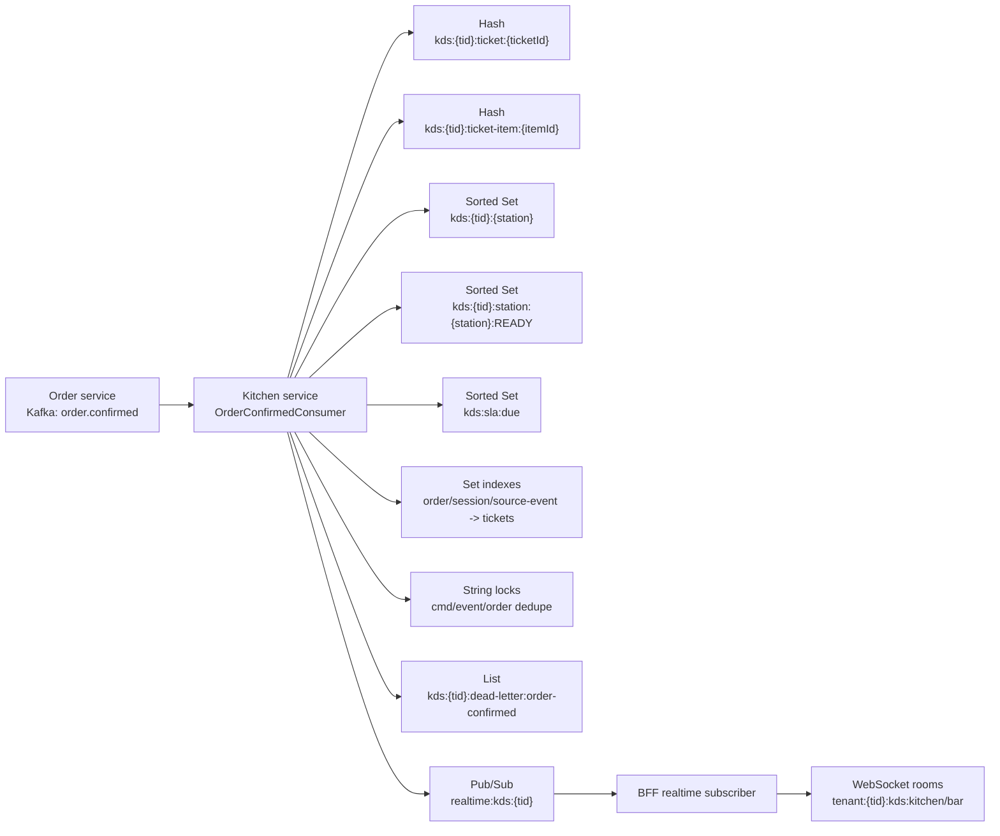
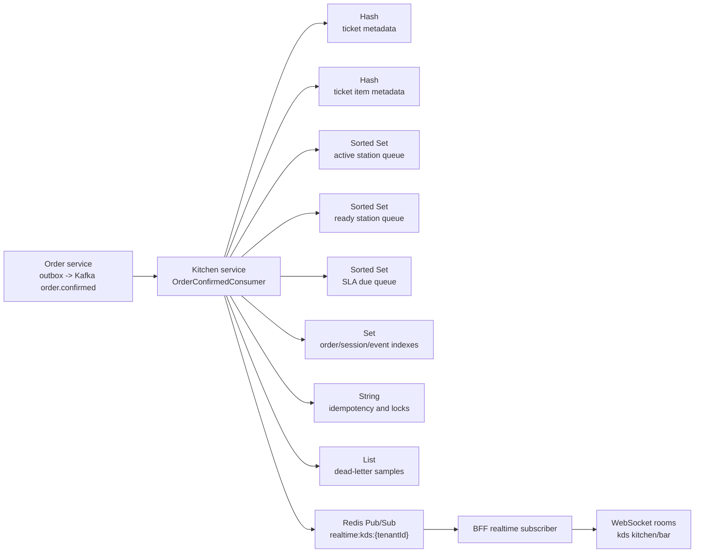

# Kế hoạch làm sâu mục Kafka và Redis trong Chương 4

> Ngày lập: 2026-06-05.
> Phạm vi độc lập: làm rõ vùng mục Chương 4 về Kafka, Redis, KDS runtime state và realtime hint.
> Quan hệ với các plan trước: plan này bổ sung sau `chapter-04-architecture-polish-plan.md` và `chapter-04-database-dbdiagram-plan.md`; không thay thế Plan A/Plan B/Plan C đã hoàn tất.

## 0. Protocol bắt buộc khi thực thi plan

Lưu ý chung:

- Viết tài liệu bằng tiếng Việt học thuật, rõ ràng. Giữ tên công nghệ và thuật ngữ chuẩn ngành khi cần: `Kafka`, `Redis`, `WebSocket`, `BFF`, `Pub/Sub`, `Sorted Set`, `Hash`, `consumer group`, `outbox`, `idempotency`, `tenant isolation`.
- Dùng CodeGraph trước khi chỉnh file để xác nhận trạng thái codebase hiện tại. Tối thiểu chạy `codegraph status .` và một truy vấn liên quan tới `RedisKey`, `KdsRedisRepository`, `OutboxEvent`, `Kafka`.
- Có thể dùng web/browser để kiểm chứng nguồn chính thức hoặc metadata nếu phát sinh citation mới. Không thêm citation nếu nội dung chỉ dựa trên code/docs nội bộ.
- Dùng Context7/`ctx7` nếu cần tra tài liệu hiện tại của library, framework, SDK, API, CLI tool hoặc cloud service theo `AGENTS.md`.
- Không invent Kafka topic, Redis key, WebSocket room, database table, endpoint, số liệu benchmark hoặc claim production-grade.
- Không thêm nguồn giả vào `references.bib`. Chỉ thêm nguồn thật, đủ chắc và được trích dẫn thật trong LaTeX.
- Cuối session phải build LaTeX và cập nhật `docs/graduation-thesis-resources/thesis-workflow-plan.md`.

Use relevant installed skills khi cần:

- `Zoom Out`: dùng để giữ mức trình bày ở tầng kiến trúc/domain, không biến Chương 4 thành walkthrough code.
- `Grill with Docs`: dùng để audit mâu thuẫn giữa source code, `docs/technical-architecture.md`, Chương 4 và evidence map.
- `Writing Plans`: dùng khi cần tách tiếp plan thành task nhỏ hơn.
- `Doc Coauthoring`: chỉ dùng nếu cần refine wording/caption hoặc reader testing, không draft chương dài một mạch nếu chưa chốt cấu trúc.

## 1. Mục tiêu

Người viết muốn mục Chương 4 về Redis và Kafka không chỉ dừng ở mức "hệ thống dùng Redis/Kafka", mà phải làm rõ thiết kế bên trong ở mức học thuật và kiến trúc:

- Kafka dùng cho những domain event nào, vì sao dùng Kafka, producer/consumer nào tham gia, payload chính gồm gì, message key/partitioning và outbox được dùng ra sao.
- Redis dùng cấu trúc dữ liệu nào cho từng nhiệm vụ: cache, session/cart, quota, KDS queue, SLA, lock/dedupe, Pub/Sub hint, SaaS cache và Payment OAuth state.
- KDS cần được trình bày như case study sâu nhất cho Redis vì nó có nhiều cấu trúc dữ liệu và thể hiện rõ thiết kế runtime queue.
- Nội dung phải giải thích "thiết kế và cách thi công trong hệ thống" chứ không phân tích từng function/method trong source code.
- Chương 4 cần thêm bảng/diagram đủ trực quan để reviewer thấy QRTable có thiết kế dữ liệu trong Redis/Kafka rõ ràng.

## 2. Nguồn sự thật và bằng chứng đã audit

### 2.1. CodeGraph snapshot

Phiên thảo luận ngày 2026-06-05 đã chạy:

```bash
codegraph status .
```

Kết quả:

- Files: 1.196.
- Nodes: 15.534.
- Edges: 30.489.
- Index up-to-date.

CodeGraph query liên quan đã chỉ ra các điểm cần dùng làm evidence:

- `libs/constants/src/lib/redis-key.constants.ts`
- `libs/constants/src/lib/ws-room.constants.ts`
- `apps/kitchen/src/app/modules/kitchen/repositories/kds-redis.repository.ts`
- `apps/kitchen/src/app/modules/kitchen/repositories/kds-ticket-store.repository.ts`
- `apps/kitchen/src/app/modules/kitchen/repositories/kds-sla-store.repository.ts`
- `apps/kitchen/src/app/modules/kitchen/repositories/kds-recovery-store.repository.ts`
- `apps/kitchen/src/app/modules/kitchen/utils/kds-keys.ts`
- `libs/configuration/src/lib/kafka.config.ts`
- `libs/entities/src/lib/outbox-event.entity.ts`
- `libs/entities/src/lib/saas-outbox-event.entity.ts`
- `apps/payment/src/app/modules/payment/entities/payment-outbox-event.entity.ts`
- `apps/order/src/app/modules/order/services/outbox-publisher.service.ts`
- `apps/payment/src/app/modules/payment/services/payment-outbox-publisher.service.ts`
- `apps/saas/src/services/saas-outbox-publisher.service.ts`

### 2.2. Canonical docs cần đọc lại khi thực thi

- `AGENTS.md`
- `docs/graduation-thesis-resources/thesis-workflow-plan.md`
- `docs/graduation-thesis-resources/thesis-official-outline.md`
- `docs/graduation-thesis-resources/thesis-evidence-map.md`
- `docs/graduation-thesis-resources/thesis-artifact-backlog.md`
- `docs/graduation-thesis-resources/thesis-report/chapters/04-thiet-ke-va-kien-truc-he-thong.tex`
- `docs/README.md`
- `docs/DOC-CODE-ANCHORS.md`
- `docs/technical-architecture.md`
- `docs/business-logic.md`
- `docs/phases/phase-2a-order-kafka.md`
- `docs/phases/phase-2b-kitchen-websocket.md`
- `docs/phases/phase-3-payment.md`
- `docs/phases/phase-4b-saas-onboarding.md`

## 3. Phạm vi

### 3.1. Làm trong plan này khi thực thi

- Sửa Chương 4 LaTeX, tập trung vào hai section hiện có:
  - `Thiết kế hướng sự kiện và sổ đăng ký topic Kafka`
  - `Redis cho bộ nhớ đệm, phiên, giỏ và KDS`
- Bổ sung một hoặc nhiều bảng LaTeX để mô tả:
  - Kafka topic contract/payload.
  - Outbox record/publishing discipline.
  - Redis data structures theo owner/use case.
  - KDS Redis data structures.
- Bổ sung ít nhất một diagram chuyên đề cho KDS Redis data structures và realtime fan-out.
- Cập nhật Mermaid source trong `thesis-report/assets/diagrams/`.
- Render PDF/PNG vào `thesis-report/assets/figures/`.
- Cập nhật `thesis-artifact-backlog.md` nếu có artifact mới.
- Cập nhật `thesis-workflow-plan.md`.
- Build LaTeX và kiểm tra `.lof`/`.lot` nếu thêm hình/bảng.

### 3.2. Không làm trong plan này

- Không sửa business logic hoặc source code.
- Không thêm Kafka topic ngoài registry hiện tại.
- Không biến `kds.queue_changed` thành Kafka topic lõi.
- Không thêm Notification Service vào kiến trúc lõi.
- Không viết Customer dùng Keycloak.
- Không claim Redis là source of truth của dữ liệu nghiệp vụ.
- Không claim Kafka exactly-once, CDC/Debezium, production-grade event streaming hoặc benchmark throughput/latency nếu chưa có bằng chứng thật.
- Không refactor Chương 5/6 nếu không cần thiết cho cross-reference.
- Không thêm screenshot/demo evidence.

## 4. Cấu trúc mục Chương 4 được đề xuất

Giữ mỗi công nghệ là một section lớn để mạch Chương 4 không bị vỡ. KDS là case study sâu trong section Redis, không tách thành section ngang hàng riêng trừ khi PDF sau khi render quá dài.

### 4.1. Section Kafka

Tên giữ hoặc chỉnh nhẹ:

```latex
\section{Thiết kế hướng sự kiện và sổ đăng ký topic Kafka}
```

Bên trong chia nhỏ:

```latex
\subsection{Vai trò của Kafka trong kiến trúc QRTable}
\subsection{Sổ đăng ký topic và hợp đồng sự kiện}
\subsection{Transactional outbox và kỷ luật phát sự kiện}
\subsection{Ranh giới giữa Kafka, BFF Direct và WebSocket}
\subsection{Giới hạn thiết kế và các claim không mở rộng}
```

Nội dung cần đạt:

- Kafka chỉ dùng cho domain event có phản ứng nghiệp vụ bất đồng bộ hoặc cần temporal decoupling.
- TCP/gRPC vẫn dùng cho command/query cần phản hồi ngay.
- WebSocket/BFF Direct dùng cho realtime hint/UI side-effect khi BFF đã có response hợp lệ.
- `order.confirmed`, `payment.completed`, `tenant.created` có outbox hoặc publisher discipline rõ ràng.
- `kitchen.sla_warning` là timer/internal event của Kitchen, dùng Kafka để BFF bridge realtime alert.
- `order.status_changed` là approved durable Order outbox topic cho projection/audit extension; immediate UI feedback vẫn không phụ thuộc Kafka.

### 4.2. Section Redis

Tên giữ hoặc chỉnh nhẹ:

```latex
\section{Redis cho bộ nhớ đệm, trạng thái chạy và KDS}
```

Bên trong chia nhỏ:

```latex
\subsection{Nguyên tắc sở hữu Redis theo domain}
\subsection{Các nhóm khóa và cấu trúc dữ liệu Redis}
\subsection{Case study KDS: hàng đợi theo trạm bếp/bar}
\subsection{Redis Pub/Sub cho gợi ý thời gian thực}
\subsection{Giới hạn và nguồn sự thật của dữ liệu}
```

Nội dung cần đạt:

- Redis là cache/runtime state/projection, không phải shared business database.
- Mỗi key group có owner rõ ràng.
- KDS dùng Redis sâu nhất, vì Kitchen không có database bền vững riêng trong phạm vi hiện tại.
- Session/cart của Order có TTL và optimistic versioning bằng Redis hash + `WATCH`/`MULTI`.
- SaaS dùng String/JSON cache cho subscription và suspended flag.
- Payment dùng String với TTL ngắn cho OAuth state.
- Redis Pub/Sub `realtime:kds:{tenantId}` chỉ là internal hint để BFF phát socket, không phải source of truth.

## 5. Bảng cần bổ sung hoặc refactor

### 5.1. Bảng Kafka topic contract

Nếu Bảng 4.5 hiện tại còn đơn giản, mở rộng hoặc thay bằng bảng mới có các cột:

- Topic.
- Producer.
- Consumer/runtime status.
- Message key/partition key.
- Payload chính.
- Lý do dùng Kafka.
- Cơ chế reliability/idempotency.

Nội dung dự kiến:

| Topic                  | Producer | Consumer/status                                         | Key        | Payload chính                                                                                           | Reliability/idempotency                               |
| ---------------------- | -------- | ------------------------------------------------------- | ---------- | ------------------------------------------------------------------------------------------------------- | ----------------------------------------------------- |
| `order.confirmed`      | Order    | Kitchen                                                 | `tenantId` | `eventId`, `tenantId`, `orderId`, `sessionId`, `tableId`, `items[]`, `confirmedAt`, `confirmedByUserId` | Order outbox; Kitchen dedupe theo event/order/station |
| `order.status_changed` | Order    | Projection/audit extension; no current runtime consumer | `tenantId` | `tenantId`, `orderId`, `toStatus`                                                                       | Order outbox; UI immediate path không phụ thuộc Kafka |
| `payment.completed`    | Payment  | Order, BFF realtime bridge                              | `tenantId` | `eventId`, `tenantId`, `billId`, `paymentId`, `method`, `amount`, `paidAt`                              | Payment outbox; Order `markPaid` idempotent           |
| `kitchen.sla_warning`  | Kitchen  | BFF realtime bridge                                     | `tenantId` | `eventId`, `tenantId`, `ticketId`, `level`, `waitTimeSeconds`, `thresholdSeconds`                       | SLA dedupe bucket; timer event                        |
| `tenant.created`       | SaaS     | Catalog                                                 | `tenantId` | `tenantId`, `slug/name`, owner info, `planCode`, `correlationId`                                        | SaaS outbox; Catalog checks default area exists       |

### 5.2. Bảng outbox record và publisher discipline

Tạo bảng ngắn nếu prose về outbox chưa đủ rõ.

Cột đề xuất:

- Field trong outbox.
- Ý nghĩa thiết kế.
- Tác dụng trong QRTable.

Rows dự kiến:

- `tenant_id`: giữ tenant context cho publish/update row.
- `topic`: destination Kafka topic.
- `event_type`: phân loại semantic event.
- `aggregate_id`: entity/domain aggregate phát event.
- `partition_key`: message key khi publish.
- `payload`: body JSONB trước khi gửi.
- `status`: `PENDING`, `PUBLISHED`, `FAILED`.
- `attempt_count`, `last_error`: retry/failure tracking.
- `published_at`: thời điểm publish thành công.

Lưu ý wording: không claim outbox hiện tại là CDC/Debezium hoặc exactly-once.

### 5.3. Bảng Redis ownership/data structure

Cột đề xuất:

- Nhóm dữ liệu.
- Owner.
- Key pattern.
- Redis data type.
- TTL hoặc lifecycle.
- Source of truth.
- Vai trò trong kiến trúc.

Rows dự kiến:

| Nhóm                 | Owner               | Key pattern                      | Type                                   | Lifecycle                                        | Source of truth                          |
| -------------------- | ------------------- | -------------------------------- | -------------------------------------- | ------------------------------------------------ | ---------------------------------------- |
| Public menu cache    | Catalog/BFF         | `menu:{tenantId}`                | String/JSON cache                      | invalidate khi menu/category/item đổi            | Catalog PostgreSQL                       |
| Session runtime      | Order               | `session:{tenantId}:{sessionId}` | Hash                                   | session TTL, delete khi close/release            | Order PostgreSQL                         |
| Shared cart          | Order               | `cart:{tenantId}:{sessionId}`    | Hash + JSON items                      | TTL, version conflict, clear/lock on submit/bill | Order runtime + Order DB after submit    |
| Daily quota          | Order/SaaS boundary | `quota:{tenantId}:orders:{date}` | Counter/String                         | per-day window                                   | Order/SaaS entitlement                   |
| Subscription cache   | SaaS                | `subscription:{tenantId}`        | String/JSON                            | 300 seconds                                      | SaaS PostgreSQL                          |
| Suspended flag       | SaaS                | `tenant:{tenantId}:suspended`    | String flag                            | set/clear by lifecycle                           | SaaS PostgreSQL                          |
| OAuth state          | Payment             | `oauth_state:{state}`            | String/JSON                            | 300 seconds                                      | Payment OAuth flow/settings DB           |
| KDS queue/projection | Kitchen             | `kds:*`                          | Hash/Set/Sorted Set/List/String/PubSub | ticket lifecycle/SLA/cleanup                     | Order event + Kitchen runtime projection |

### 5.4. Bảng KDS Redis data structures

Cột đề xuất:

- Key pattern.
- Type.
- Nội dung/member.
- Mục đích.
- Ghi chú consistency.

Rows dự kiến:

- `kds:{tenantId}:ticket:{ticketId}`: Hash, ticket metadata.
- `kds:{tenantId}:ticket-item:{ticketItemId}`: Hash, item metadata.
- `kds:{tenantId}:ticket:{ticketId}:items`: Set, ticket item ids.
- `kds:{tenantId}:order:{orderId}:tickets`: Set, order -> ticket ids.
- `kds:{tenantId}:session:{sessionId}:tickets`: Set, session -> ticket ids.
- `kds:{tenantId}:{stationSlug}`: Sorted Set, active queue; score = FIFO/priority score.
- `kds:{tenantId}:station:{station}:READY`: Sorted Set, ready queue; score = ready timestamp.
- `kds:sla:due`: Sorted Set, due warnings/breaches; member = `tenantId|station|ticketId|level`.
- `kds:{tenantId}:ticket:{ticketId}:sla`: Hash, SLA metadata.
- `kds:{tenantId}:dedupe:event:{eventId}`: String lock, event dedupe.
- `kds:{tenantId}:dedupe:order:{orderId}:{station}`: String lock, ticket dedupe.
- `kds:{tenantId}:cmd:{requestId}`: String lock, command idempotency.
- `kds:{tenantId}:dead-letter:order-confirmed`: List, malformed/missing-station item sample.
- `lock:kds:rebuild:{tenantId}`: String lock, rebuild snapshot lock.
- `realtime:kds:{tenantId}`: Pub/Sub channel, internal hint to BFF.

## 6. Diagram cần tạo

### 6.1. Diagram bắt buộc: KDS Redis data structures

File source:

```txt
docs/graduation-thesis-resources/thesis-report/assets/diagrams/chapter4-kds-redis-data-structures.mmd
```

File render:

```txt
docs/graduation-thesis-resources/thesis-report/assets/figures/chapter4-kds-redis-data-structures.pdf
docs/graduation-thesis-resources/thesis-report/assets/figures/chapter4-kds-redis-data-structures.png
```

Ý tưởng nội dung:



Diagram phải thể hiện rõ:

- `order.confirmed` đi qua Kafka để Kitchen tạo projection.
- Redis giữ queue/projection/runtime structures.
- `realtime:kds:{tenantId}` chỉ là hint channel.
- BFF phát WebSocket tới room KDS, không tự suy luận trạng thái bếp.

Caption gợi ý:

```latex
\caption{Cấu trúc dữ liệu Redis cho hàng đợi KDS và cầu nối thời gian thực.}
```

### 6.2. Diagram tùy chọn: Kafka outbox publishing path

Chỉ tạo nếu prose/bảng chưa đủ rõ hoặc page budget còn ổn.

File source:

```txt
docs/graduation-thesis-resources/thesis-report/assets/diagrams/chapter4-kafka-outbox-publishing-path.mmd
```

Ý tưởng nội dung:

- Service transaction writes domain row + outbox row.
- Outbox publisher polls `PENDING`.
- Producer sends Kafka message with key = `partitionKey`.
- On success mark `PUBLISHED`.
- On failure increment attempt, keep `PENDING` or mark `FAILED`.
- Consumer validates payload and applies idempotent side effect.

Caption gợi ý:

```latex
\caption{Đường phát sự kiện Kafka qua transactional outbox trong QRTable.}
```

Nếu tạo diagram này, cập nhật backlog thành P1/P0 tùy vai trò sau khi build pass.

## 7. Task breakdown khi thực thi

### Task 1: Read the room bằng CodeGraph và docs

**Files đọc:**

- `docs/graduation-thesis-resources/thesis-workflow-plan.md`
- `docs/graduation-thesis-resources/thesis-artifact-backlog.md`
- `docs/graduation-thesis-resources/thesis-report/chapters/04-thiet-ke-va-kien-truc-he-thong.tex`
- `docs/technical-architecture.md`
- `docs/business-logic.md`
- `libs/configuration/src/lib/kafka.config.ts`
- `libs/constants/src/lib/redis-key.constants.ts`
- `libs/constants/src/lib/ws-room.constants.ts`
- `apps/kitchen/src/app/modules/kitchen/utils/kds-keys.ts`
- `apps/kitchen/src/app/modules/kitchen/repositories/kds-ticket-store.repository.ts`
- `apps/kitchen/src/app/modules/kitchen/repositories/kds-sla-store.repository.ts`
- `apps/kitchen/src/app/modules/kitchen/repositories/kds-recovery-store.repository.ts`
- `libs/entities/src/lib/outbox-event.entity.ts`
- `apps/payment/src/app/modules/payment/entities/payment-outbox-event.entity.ts`
- `libs/entities/src/lib/saas-outbox-event.entity.ts`

**Commands:**

```bash
codegraph status .
codegraph query "KdsRedisRepository RedisKey OutboxEvent Kafka PAYMENT_COMPLETED_TOPIC ORDER_CONFIRMED_TOPIC"
rg -n "ORDER_CONFIRMED_TOPIC|PAYMENT_COMPLETED_TOPIC|KITCHEN_SLA_WARNING_TOPIC|TENANT_CREATED_TOPIC|ORDER_STATUS_CHANGED_TOPIC|outbox|kds.queue_changed|realtime:kds" apps libs docs --glob '*.ts' --glob '*.md'
```

**Expected:**

- CodeGraph index up-to-date.
- Kafka topic list still has five approved topics.
- KDS Redis key functions still match planned tables.

### Task 2: Chốt outline section trong Chương 4

**Modify:**

- `docs/graduation-thesis-resources/thesis-report/chapters/04-thiet-ke-va-kien-truc-he-thong.tex`

**Steps:**

- [ ] Locate current sections:
  - `\section{Thiết kế hướng sự kiện và sổ đăng ký topic Kafka}`
  - `\section{Redis cho bộ nhớ đệm, phiên, giỏ và KDS}`
- [ ] Insert subsection headings from §4 of this plan.
- [ ] Keep existing figure/table labels stable where possible:
  - `fig:chapter4-kafka-decision-flow`
  - `tab:chapter4-kafka-topic-registry`
  - `fig:chapter4-redis-ownership`
- [ ] Do not renumber manually. Let LaTeX generate numbering.

**Verify:**

```bash
rg -n "\\\\subsection\\{.*Kafka|\\\\subsection\\{.*Redis|\\\\subsection\\{.*KDS" docs/graduation-thesis-resources/thesis-report/chapters/04-thiet-ke-va-kien-truc-he-thong.tex
```

### Task 3: Refactor Kafka prose and table

**Modify:**

- `docs/graduation-thesis-resources/thesis-report/chapters/04-thiet-ke-va-kien-truc-he-thong.tex`

**Steps:**

- [ ] Expand the Kafka explanation before/after Hình Kafka decision flow.
- [ ] Replace or extend Bảng Kafka topic registry using columns in §5.1.
- [ ] Add a short outbox subsection using §5.2.
- [ ] Add prose explaining:
  - `order.confirmed` -> Kitchen business reaction.
  - `payment.completed` -> Order finalization + BFF bridge.
  - `tenant.created` -> Catalog default data seeding.
  - `kitchen.sla_warning` -> timer/internal event.
  - `order.status_changed` -> durable projection/audit extension.
- [ ] Add guardrail prose:
  - UI events are BFF Direct/WebSocket/Redis hint.
  - Kafka is at-least-once oriented in current implementation.
  - idempotency/dedupe belongs to consumers and domain services.

**Verify:**

```bash
rg -n "order.created|cart.updated|bill.requested|table.transferred|kds.queue_changed.*Kafka|exactly-once|Debezium|CDC" docs/graduation-thesis-resources/thesis-report/chapters/04-thiet-ke-va-kien-truc-he-thong.tex
```

Expected:

- No new disallowed topic is written as approved Kafka topic.
- If `kds.queue_changed` appears, it is described as Redis Pub/Sub/WebSocket hint, not Kafka topic.
- No exactly-once/CDC/Debezium production claim.

### Task 4: Refactor Redis prose and add data-structure tables

**Modify:**

- `docs/graduation-thesis-resources/thesis-report/chapters/04-thiet-ke-va-kien-truc-he-thong.tex`

**Steps:**

- [ ] Keep Hình Redis ownership as overview.
- [ ] Add Redis ownership/data-structure table using §5.3.
- [ ] Add KDS-specific Redis data-structure table using §5.4.
- [ ] Explain session/cart design:
  - `session:{tenantId}:{sessionId}` as Hash.
  - `cart:{tenantId}:{sessionId}` as Hash with `items` JSON and `cartVersion`.
  - Redis TTL supports hot path, not authoritative deletion semantics.
- [ ] Explain KDS design:
  - active/ready queues by station.
  - ticket/item hash.
  - index sets.
  - SLA due queue.
  - locks/dedupe.
  - dead-letter list.
  - Pub/Sub hint channel.
- [ ] Explain SaaS/Payment Redis usage briefly:
  - `subscription:{tenantId}` cache.
  - `tenant:{tenantId}:suspended` flag.
  - `oauth_state:{state}` short-lived state.

**Verify:**

```bash
rg -n "menu:\\{tenantId\\}|session:\\{tenantId\\}:\\{sessionId\\}|cart:\\{tenantId\\}:\\{sessionId\\}|kds:\\*|oauth_state|subscription:\\{tenantId\\}|tenant:\\{tenantId\\}:suspended" docs/graduation-thesis-resources/thesis-report/chapters/04-thiet-ke-va-kien-truc-he-thong.tex
```

### Task 5: Create KDS Redis diagram source

**Create:**

- `docs/graduation-thesis-resources/thesis-report/assets/diagrams/chapter4-kds-redis-data-structures.mmd`

**Content requirements:**

- Shows Order -> Kafka `order.confirmed` -> Kitchen.
- Shows Kitchen writing Redis structures:
  - ticket hash.
  - item hash.
  - active sorted set.
  - ready sorted set.
  - SLA sorted set.
  - index sets.
  - dedupe locks.
  - dead-letter list.
  - Pub/Sub channel.
- Shows Pub/Sub -> BFF -> WebSocket KDS rooms.
- Does not show `kds.queue_changed` as Kafka topic.

**Suggested source skeleton:**



The implementer should adapt styling to match existing Chapter 4 Mermaid style.

### Task 6: Render and insert KDS Redis diagram

**Modify:**

- `docs/graduation-thesis-resources/thesis-report/chapters/04-thiet-ke-va-kien-truc-he-thong.tex`
- `docs/graduation-thesis-resources/thesis-artifact-backlog.md`

**Render command options:**

Use existing render script if extended:

```bash
bash docs/graduation-thesis-resources/thesis-report/tools/render-chapter4-diagrams.sh
```

If the script does not include the new diagram, either update the script or render directly:

```bash
PUPPETEER_EXECUTABLE_PATH='/Applications/Google Chrome.app/Contents/MacOS/Google Chrome' pnpm exec mmdc -i docs/graduation-thesis-resources/thesis-report/assets/diagrams/chapter4-kds-redis-data-structures.mmd -o docs/graduation-thesis-resources/thesis-report/assets/figures/chapter4-kds-redis-data-structures.pdf --pdfFit
PUPPETEER_EXECUTABLE_PATH='/Applications/Google Chrome.app/Contents/MacOS/Google Chrome' pnpm exec mmdc -i docs/graduation-thesis-resources/thesis-report/assets/diagrams/chapter4-kds-redis-data-structures.mmd -o docs/graduation-thesis-resources/thesis-report/assets/figures/chapter4-kds-redis-data-structures.png
```

**LaTeX insertion:**

Place inside Redis section after KDS data-structure prose/table:

```latex
\begin{figure}[H]
  \centering
  \includegraphics[width=\textwidth,height=0.82\textheight,keepaspectratio]{chapter4-kds-redis-data-structures.pdf}
  \caption{Cấu trúc dữ liệu Redis cho hàng đợi KDS và cầu nối thời gian thực.}
  \label{fig:chapter4-kds-redis-data-structures}
\end{figure}
```

**Backlog update:**

Add or update row:

- ID: `Hình 4.x`
- Artifact: `KDS Redis data structures`
- Claim/vai trò: làm rõ Redis Sorted Set/Hash/Set/String/List/PubSub cho KDS.
- Source: `chapter4-kds-redis-data-structures.mmd`, KDS repository/key code.
- Status: `verified` only after LaTeX build and `.lof` check.

### Task 7: Optional Kafka outbox diagram

Only execute if Chapter 4 remains readable and page budget is acceptable after Task 6.

**Create optional source:**

- `docs/graduation-thesis-resources/thesis-report/assets/diagrams/chapter4-kafka-outbox-publishing-path.mmd`

**Insert only if it adds clarity beyond tables.**

If skipped, record in workflow plan:

```md
Kafka outbox path was explained with prose/table; separate diagram was skipped to avoid overloading Chương 4.
```

### Task 8: Update cross-doc handoff

**Modify if needed:**

- `docs/graduation-thesis-resources/thesis-artifact-backlog.md`
- `docs/graduation-thesis-resources/thesis-official-outline.md`
- `docs/graduation-thesis-resources/thesis-evidence-map.md`
- `docs/graduation-thesis-resources/thesis-workflow-plan.md`

**Required updates:**

- `thesis-artifact-backlog.md`: add/update new KDS Redis diagram and any new table references.
- `thesis-workflow-plan.md`: record what changed, build result, next step.

**Conditional updates:**

- `thesis-official-outline.md`: update only if section names or artifact plan materially change.
- `thesis-evidence-map.md`: update only if a new claim/evidence category is introduced. For prose clarification based on existing code/docs, a workflow note may be enough.

### Task 9: Verification

Run from repo root or thesis-report directory.

**Build command:**

```bash
python3 /Users/vodinhquan/.codex/plugins/cache/openai-bundled/latex/0.2.2/scripts/compile_latex.py /Users/vodinhquan/Developer/Graduation-Thesis/graduation-thesis/qr-order/docs/graduation-thesis-resources/thesis-report/undergraduate-theses-report.tex --compiler texlive --engine xelatex --json
```

**Check figure/table lists if new figure/table added:**

```bash
rg -n "KDS Redis|Kafka|Redis|Sổ đăng ký topic|outbox" docs/graduation-thesis-resources/thesis-report/undergraduate-theses-report.lof docs/graduation-thesis-resources/thesis-report/undergraduate-theses-report.lot
```

**Check forbidden claims/topics:**

```bash
rg -n "order.created|cart.updated|bill.requested|table.transferred|tenant.suspended|menu.updated|exactly-once|production-grade|Debezium|CDC" docs/graduation-thesis-resources/thesis-report/chapters/04-thiet-ke-va-kien-truc-he-thong.tex
```

Expected:

- Build exit code 0.
- New figure/table appears in `.lof`/`.lot` if inserted.
- Forbidden strings either absent or explicitly described as not part of Kafka core topic registry.
- No new undefined references/citations.

## 8. Done criteria

- [ ] Chương 4 has detailed Kafka subsections without inventing new topics.
- [ ] Kafka topic registry table includes topic, producer, consumer/status, key, payload summary, reliability/idempotency notes.
- [ ] Outbox design is explained through prose/table and does not claim CDC/exactly-once.
- [ ] Redis section has ownership/data-structure table.
- [ ] KDS Redis case study has a detailed data-structure table.
- [ ] `chapter4-kds-redis-data-structures.mmd` exists.
- [ ] KDS Redis diagram is rendered to PDF/PNG and inserted into LaTeX, unless explicitly deferred with reason.
- [ ] Artifact backlog reflects actual artifact state.
- [ ] `thesis-workflow-plan.md` records the result and next step.
- [ ] LaTeX build passes after edits.

## 9. Self-review checklist before final handoff

Trước khi gọi task hoàn tất, người thực thi phải tự kiểm:

- Chương 4 có còn viết Redis/Kafka như liệt kê công nghệ chung chung không?
- Có đoạn nào biến Chương 4 thành phân tích method/function cụ thể không?
- Có topic nào ngoài 5 topic approved bị viết như Kafka topic lõi không?
- Có đoạn nào làm người đọc hiểu WebSocket hoặc Redis là source of truth không?
- Có đoạn nào claim production-grade event streaming, benchmark, exactly-once hoặc CDC không?
- KDS diagram có phân biệt Kafka `order.confirmed`, Redis KDS structures và Redis Pub/Sub hint không?
- Bảng Redis có owner và source of truth cho từng nhóm dữ liệu không?
- Bảng Kafka có payload chính nhưng không dump quá nhiều field implementation không?
- Tất cả hình/bảng mới có caption/label và xuất hiện trong danh mục sau build không?

## 10. Final handoff format sau khi thực thi

Khi thực thi xong plan này, final response nên ngắn gọn và nêu:

- File LaTeX đã sửa.
- Diagram/table mới đã thêm.
- Workflow/backlog đã cập nhật.
- Build command đã chạy và exit code.
- Warning còn lại nếu có.
- Phần chưa làm hoặc quyết định bị skip, ví dụ Kafka outbox diagram optional.
