# QRTable Codebase Reading Map

> Guide to reading the QRTable codebase in accordance with the project's current architecture.
>
> **Last verified:** 2026-07-27, after running `codegraph sync .` and cross-checking entry points, configuration composition, module/caller graphs, shared-library usage, transports, state owners, domain flows, active tests, and canonical documentation.
>
> **Canonical role:** This document serves as the codebase reading map. In case of conflicts, prioritize current code/tests, `docs/README.md`, phase records, and accepted specs.

## Objectives

This document helps you read QRTable systematically, preventing you from getting lost in the Nx monorepo, multiple NestJS microservices, two frontend apps, and shared libraries.

After reading this guide, you should be able to answer:

- Which service owns which state in QRTable.
- How a request flows from the UI through BFF, TCP/gRPC, database, Redis, Kafka, and WebSocket.
- Which files to read first, which ones to read later, and which folders can be temporarily bypassed.
- Where the current implementation differs from old specs/roadmaps.
- How to explain the project using architectural theory rather than just describing the code during interviews.

### Scope and Completion Criteria

This is a **critical-path reading map**, not an inventory of every file in the monorepo. A flow is sufficiently traced only when you have followed:

```text
UI route/service/hook
  -> BFF controller/guard
  -> TCP, gRPC, or Kafka contract
  -> owner-service controller/consumer
  -> domain service
  -> repository/state store
  -> side effect/outbox/realtime
  -> boundary-protecting test
```

Globs such as `features/*` or `controllers/*.ts` are discovery aids after you have read the exact paths listed here. If a mapped file no longer exists, treat it as documentation drift and inspect `git log -- <path>`; do not guess its replacement.

## How to Read This Repo

Do not read folders in alphabetical order. Since QRTable is a multi-tenant, event-driven system, the correct approach is to read by **business flow** and **state ownership**.

Every time you open a file, ask yourself these 5 questions:

1. Which layer does this file belong to: UI, BFF orchestration, domain service, repository, shared contract, or infrastructure?
2. Does this file own state, or does it only read/forward/transform state?
3. If an error occurs, should it be blocked at a guard, controller, service, or repository?
4. If the flow needs to invoke another service, does it call sync TCP/gRPC or publish an async Kafka event?
5. If the frontend receives a WebSocket event, is that event the source of truth or just an invalidation hint?

### Dependency Expansion Rule: Read Now, Route Later, Ignore for Now

A file importing many dependencies does not mean that every dependency should be opened immediately. Classify each import into one of three groups:

| Group                     | When to open it                                                                                 | BFF bootstrap example                                                                             |
| ------------------------- | ----------------------------------------------------------------------------------------------- | ------------------------------------------------------------------------------------------------- |
| **Read now**              | It directly determines the current step's input/output, lifecycle, or side effect.              | `base.config.ts`, `app.config.ts`, `redis.config.ts`, the CORS validator, Redis I/O adapter.      |
| **Route to a later step** | It declares a boundary that belongs to a later step or domain flow.                             | Move `tcp.config.ts` and `grpc.config.ts` to Round 2 - Step 2; route `kafka.config.ts` to Flow 8. |
| **Ignore for now**        | It is a framework/type helper that does not change the current mental model. Open it on demand. | NestJS decorator internals, Swagger helpers, and generated/build output.                          |

This rule preserves **black-box thinking** without losing dependencies: record the later reading checkpoint, do not traverse all of `libs/` alphabetically, and do not assume an import is irrelevant.

**How to explain in interviews:**

> I do not analyze microservices by opening each service individually from the beginning. Instead, I start from the boundaries: UI route -> BFF controller -> TCP message -> service owner -> repository/state -> event/realtime. This helps me trace the ownership and consistency boundaries of each flow.

## Current Code Snapshot

| Layer             | Current reality                                                                                                                                  |
| ----------------- | ------------------------------------------------------------------------------------------------------------------------------------------------ |
| Monorepo          | Nx workspace, deployable apps reside in `apps/`, shared code resides in `libs/`.                                                                 |
| Backend edge      | `apps/bff`: HTTP API gateway, guard chain, middleware, WebSocket gateway, TCP clients.                                                           |
| Backend services  | `catalog`, `order`, `kitchen`, `payment`, `saas`, `authorizer`, `user-access`.                                                                   |
| Frontend          | `apps/management-app` is a Next.js app; `apps/customer-pwa` is a React/Vite PWA; `apps/keycloak-theme` is the Keycloak theme.                    |
| Current aliases   | Backend uses `@common/*`; frontend/shared uses `@einvoice/*`. Refer to the current `tsconfig.base.json` when tracing code.                       |
| State stores      | PostgreSQL/TypeORM for main services; Mongo/Mongoose for user-access; Redis for session/cart/KDS/cache/rate-limit; Kafka for async side-effects. |
| Generated folders | Skip `.next`, `dist`, `node_modules`, and coverage/build outputs when reading the code.                                                          |

## Overall Architecture Map

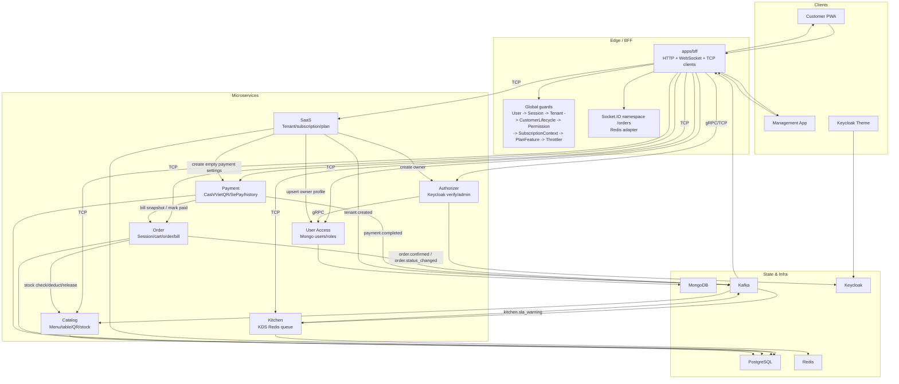

## App Ownership

| App                   | Current role                                                                 | When to read                                               |
| --------------------- | ---------------------------------------------------------------------------- | ---------------------------------------------------------- |
| `apps/bff`            | API gateway, guard chain, HTTP controllers, WebSocket gateway, TCP clients.  | First thing to read in the backend.                        |
| `apps/catalog`        | Area, table, QR token, category, menu item, public menu, stock.              | Read before Order submit/confirm.                          |
| `apps/order`          | Session, cart, order, bill, service request, table transfer, outbox.         | Business core; read after grasping BFF + Catalog.          |
| `apps/kitchen`        | KDS queue on Redis, consumes `order.confirmed`, SLA, recovery.               | Read after Order confirm.                                  |
| `apps/payment`        | Payment record, cash, VietQR, SePay webhook, audit, payment outbox.          | Read after Bill flow.                                      |
| `apps/saas`           | Tenant, onboarding saga, plan, subscription, invoice, lifecycle cache.       | Read after grasping Order/Payment and tenant guard.        |
| `apps/authorizer`     | Keycloak login/verify/admin, gRPC verify token.                              | Read when working on auth/RBAC.                            |
| `apps/user-access`    | User profile, staff, role, tenant user data on MongoDB.                      | Read along with Authorizer/SaaS onboarding.                |
| `apps/customer-pwa`   | Customer scans QR, joins session, views menu, cart, order tracking, payment. | Read after customer backend flow.                          |
| `apps/management-app` | Admin/dashboard/POS/KDS/SaaS UI.                                             | Read after BFF admin endpoints.                            |
| `apps/keycloak-theme` | Custom Keycloak theme interfaces.                                            | Read when customized auth UX/branding is needed, not core. |

## Source Of Truth Priority

Read in this order of priority:

1. Current code and tests.
2. `docs/README.md`, canonical business/technical docs, and accepted phase records.
3. `docs/testing/README.md` and the traceability matrix if tracing test coverage.
4. Supporting guides in `docs/guides/*`; always re-check paths and behavior against source.
5. README boilerplate, generated output, build folders.

Important note: `AGENTS.md` defines the current engineering standards, while `tsconfig.base.json` confirms the actual import mappings. Backend code uses `@common/*`; frontend/shared code still uses the legacy-but-valid `@einvoice/*`. Do not infer or create an `@qrtable/*` alias that the source does not declare.

## Round 0: Read Maps Before Code

Read these files to acquire context:

| File                                              | What to understand                                                               |
| ------------------------------------------------- | -------------------------------------------------------------------------------- |
| `AGENTS.md`                                       | Mandatory working protocol, service boundaries, shared aliases, and conventions. |
| `docs/README.md`                                  | Which docs are canonical, which ones are reference-only.                         |
| `docs/DOC-CODE-ANCHORS.md`                        | Which source paths anchor each documentation topic.                              |
| `docs/project-status.md`                          | Which phases are verified, pending, or deferred.                                 |
| `docs/technical-architecture.md`                  | Microservices, database per service, Redis, Kafka, WebSocket rooms.              |
| `docs/business-logic.md`                          | State machine, business rules, business edge cases.                              |
| `docs/architecture/permission-matrix.md`          | Roles and permissions before reading admin, POS, and KDS.                        |
| `docs/testing/README.md`                          | Taxonomy, gate policy, and how to read evidence.                                 |
| `docs/testing/traceability-matrix.md`             | Mapping requirements to unit/integration/E2E tests and status.                   |
| `docs/guides/react-nextjs-qrtable.md`             | Read when tracing frontend React/Next.js.                                        |
| `docs/guides/kafka-qrtable.md`                    | Read when extending event-driven flows.                                          |
| `docs/guides/redis-qrtable.md`                    | Read when looking into Redis keys/sessions/carts/KDS.                            |
| `docs/guides/websocket-socketio-qrtable.md`       | Read when tracing realtime features.                                             |
| `docs/guides/keycloak-qrtable.md`                 | Read when tracing auth/Keycloak flows.                                           |
| `docs/guides/sepay-configuration-guide-phase3.md` | Read when tracing VietQR/SePay configuration.                                    |
| `docs/guides/frontend-domain-display.md`          | Wire enum → UI label mappings; `vi-domain-labels`, SaaS badges.                  |

Then read phase records in chronological order:

1. `docs/phases/phase-0-foundation.md`
2. `docs/phases/phase-1-catalog.md`
3. `docs/phases/phase-2a-order-kafka.md`
4. `docs/phases/phase-2b-kitchen-websocket.md`
5. `docs/phases/phase-3-payment.md`
6. `docs/phases/phase-4a-saga-hardening.md`
7. `docs/phases/phase-4b-saas-onboarding.md`
8. `docs/phases/phase-4c-staff-management.md`
9. `docs/phases/phase-4d-dashboard-reporting.md`
10. `docs/phases/phase-5-testing.md`
11. `docs/phases/phase-7-deployment.md`

`docs/graduation-thesis-resources/thesis-workflow-plan.md`, the LaTeX files under `docs/graduation-thesis-resources/thesis-report/`, and `.mmd` diagrams are thesis explanation/corroboration sources; they do **not override** current code or canonical engineering documentation. Historical workflow sections may describe components that were refactored or removed. Edit them only when the task explicitly includes thesis/PDF impact.

## Round 1: Nx Workspace and Aliases

Read:

- `package.json`
- `nx.json`
- `tsconfig.base.json`
- `apps/bff/project.json`
- `apps/bff/webpack.config.js`
- `libs/configuration/project.json`
- Then use `apps/*/project.json`, `apps/*/webpack.config.js`, and `libs/*/project.json` as comparison/discovery globs.

Helpful commands to run:

```bash
npx nx show projects
npx nx graph
```

Key takeaways:

- Which project is a deployable app, and which is a library.
- Which `package.json` script runs which domain slice: `dev:bff-order`, `dev:bff-payment`, `dev:bff-auth`.
- Which executor owns build/serve in `project.json`; `webpack.config.js` is what proves the backend process entry is `./src/main.ts`.
- How `tsconfig.base.json` maps aliases to directories.
- Current backend imports `@common/constants/*`, `@common/interfaces/*`, `@common/entities/*`, etc.
- Current frontend/shared imports `@einvoice/types`, `@einvoice/frontend-ui`, `@einvoice/frontend-hooks`, etc.

**Theory to know:**

An Nx monorepo groups multiple deployable apps and shared libraries under a single repository. The key goal is not "everyone sharing all code", but rather **dependency boundary enforcement**: apps should depend on contracts/shared libs, and should not import internal modules of other services directly.

**How to explain in interviews:**

> QRTable uses Nx to manage NestJS services and frontend apps in a single repository, bringing benefits like shared contracts, consistent tooling, and affected tests/builds. However, service boundaries are still enforced via TCP/Kafka contracts. We do not import the repository or entity of other services directly to create business logic shortcuts.

## Round 2: Backend Boundary First

The goal of this round is to establish the **process, transport, and state-ownership boundaries** before entering business logic. Read the BFF first, then each service entry point and root module; do not open every service implementation yet.

### Step 1: BFF Process Bootstrap

Read the **mandatory set** in this exact order:

1. `apps/bff/src/main.ts`
2. `apps/bff/src/configuration/index.ts`
3. `libs/configuration/src/lib/base.config.ts`
4. `libs/configuration/src/lib/app.config.ts`
5. `libs/configuration/src/lib/redis.config.ts`
6. `apps/bff/src/configuration/cors-origins.ts`
7. `apps/bff/src/app/modules/realtime/adapters/redis-io.adapter.ts`
8. `apps/bff/src/app/app.module.ts`
9. `libs/configuration/src/lib/throttler.config.ts`
10. `libs/providers/redis-client/src/lib/redis-client.module.ts`
11. `libs/providers/redis-client/src/lib/redis-client.service.ts`

Key takeaways:

- Bootstrap now lives directly in `main.ts`; `apps/bff/src/bootstrap.ts` **no longer exists**.
- `main.ts` configures `rawBody` parsing, the Redis Socket.IO adapter, global route prefixing, `ValidationPipe`, CORS, and Swagger.
- `configuration/index.ts` is a **composition tree**, not a demand to inspect every import immediately. It combines Base/App/TCP/Redis/Kafka/gRPC with BFF payment/platform/CORS configuration and then validates the tree.
- On the first pass, still read all three local classes—`BffPaymentConfiguration`, `BffPlatformConfiguration`, and `BffCorsConfiguration`—inside `configuration/index.ts` to learn their keys, defaults, and validation; defer only the payment/platform consumer trace to the matching domain flow.
- `BaseConfiguration` explains `NODE_ENV`, `GLOBAL_PREFIX`, and validation; `AppConfiguration` explains the listen port; `RedisConfiguration` explains the Redis host/port shared by cache and Socket.IO scale-out.
- `RedisIoAdapter` is the WebSocket runtime adapter used by `main.ts`; `RedisProvider` and `RedisClientModule` are separate abstractions for cache-manager and direct Redis commands. Continue into `RedisClientService` to see how the direct client is created and closed with the provider lifecycle; defer domain key/store consumers to the flow that uses them.
- `app.module.ts` is the composition root: it imports BFF features and registers middleware, the global interceptor, and global guards in declaration order.
- `ThrottlerProvider` is not imported by the BFF configuration index, but it is still a bootstrap dependency because `AppModule` registers Redis-backed global rate limiting.
- BFF performs orchestration at the edge boundary, but does not own domain state.

**Configuration branches visible but deliberately not traced deeply in Step 1:**

| Branch/source                                        | Deep-reading checkpoint     | Why                                                                                               |
| ---------------------------------------------------- | --------------------------- | ------------------------------------------------------------------------------------------------- |
| `libs/configuration/src/lib/tcp.config.ts`           | Round 2 - Step 2            | Client tokens/providers and synchronous downstream boundaries.                                    |
| `libs/configuration/src/lib/grpc.config.ts`          | Round 2 - Step 2, Flow 7    | Authorizer/User Access gRPC boundaries and proto assets.                                          |
| `libs/configuration/src/lib/kafka.config.ts`         | Flow 8 / realtime deep dive | Kafka clients/groups/topics are consumed by the realtime bridge.                                  |
| `BFF_PAYMENT_CONFIG` in the BFF configuration index  | Flow 2 and Flow 5           | Timeouts sit on Order/Payment HTTP boundaries; secret/base URL belong to payment/VietQR behavior. |
| `BFF_PLATFORM_CONFIG` in the BFF configuration index | Flow 6                      | Contact metadata belongs to the public SaaS/platform response, not the BFF process lifecycle.     |

`libs/configuration/src/lib/type-orm.config.ts`, `libs/configuration/src/lib/mongo.config.ts`, and `libs/configuration/src/lib/keycloak.config.ts` are not imported by the BFF configuration index. They belong to service owners in Step 4, so reading them in Step 1 would mix the BFF process boundary with another service's persistence or identity boundary.

**Checkpoint:** at the end of Step 1, explain how the BFF process starts and which configuration drives HTTP/CORS/Redis/rate limiting. You do not yet need to memorize seven service ports or Kafka consumer groups.

### Step 2: BFF Modules and Downstream Clients

Before opening feature modules, read the transport foundation once:

1. `libs/configuration/src/lib/tcp.config.ts`
2. `libs/configuration/src/lib/grpc.config.ts`
3. `libs/interfaces/src/lib/tcp/common/request.interface.ts`
4. `libs/interfaces/src/lib/tcp/common/response.interface.ts`
5. `libs/interfaces/src/lib/tcp/common/tcp-client.interface.ts`
6. `libs/constants/src/lib/enum/tcp-request-message.ts`
7. `libs/interfaces/src/lib/proto/authorizer/authorizer.proto`
8. `libs/interfaces/src/lib/proto/user-access/user-access.proto`

This order answers: **which client token/provider is injected -> what the request/response envelope looks like -> which message pattern routes it -> which gRPC wire contract is copied into backend builds**.

Read a module before its controller so you know which owners an HTTP surface is allowed to call:

| BFF module                                                 | Primary downstream boundary                                    |
| ---------------------------------------------------------- | -------------------------------------------------------------- |
| `apps/bff/src/app/modules/authorizer/authorizer.module.ts` | Authorizer TCP and gRPC.                                       |
| `apps/bff/src/app/modules/catalog/catalog.module.ts`       | Catalog TCP; Cloudinary and cache for menu images/public menu. |
| `apps/bff/src/app/modules/order/order.module.ts`           | Order, Kitchen, Payment, SaaS TCP and realtime emission.       |
| `apps/bff/src/app/modules/kitchen/kitchen.module.ts`       | Kitchen + Order TCP and realtime; includes edge orchestration. |
| `apps/bff/src/app/modules/payment/payment.module.ts`       | Payment TCP.                                                   |
| `apps/bff/src/app/modules/saas/saas.module.ts`             | SaaS + Payment TCP and realtime.                               |
| `apps/bff/src/app/modules/user/user.module.ts`             | User Access TCP.                                               |
| `apps/bff/src/app/modules/reporting/reporting.module.ts`   | Order + Payment + Catalog + SaaS TCP reporting surface.        |
| `apps/bff/src/app/modules/realtime/realtime.module.ts`     | Authorizer, Order, Kafka/Redis bridges, and Socket.IO.         |
| `apps/bff/src/app/modules/health/health.module.ts`         | Aggregates Catalog + SaaS health over TCP into `UP/DEGRADED`.  |

For each route, follow this chain:

1. BFF feature module.
2. Exact controller and route decorator.
3. Guard/decorator plus `libs/interfaces/src/lib/gateway/<domain>/` request/response DTO.
4. `buildTcpRequestContext()` plus the common TCP envelope.
5. `TCP_REQUEST_MESSAGE.<DOMAIN>` plus `libs/interfaces/src/lib/tcp/<domain>/` request/response contracts.
6. Downstream `@MessagePattern` controller/consumer.
7. Domain service -> repository/store -> test.

`apps/bff/src/app/modules/*/controllers/*.ts` and `libs/interfaces/src/lib/tcp/*` are discovery globs only. Open only the subfolder for the domain being traced. Recognize the exceptions: Health composes downstream health, Reporting composes a read surface from multiple owners, Kitchen performs compensation orchestration, Catalog has Cloudinary/cache side effects, and Realtime bridges Kafka/Redis into Socket.IO.

### Step 3: HTTP Cross-Cutting Lifecycle

Middleware, guards, and the interceptor are different stages; do not flatten them into one sequence.

**Middleware order in `AppModule.configure()`:**

| Order | File                                            | Role                                      |
| ----- | ----------------------------------------------- | ----------------------------------------- |
| 1     | `libs/middlewares/src/lib/logger.middleware.ts` | Request/process logging.                  |
| 2     | `libs/middlewares/src/lib/tenant.middleware.ts` | Resolves/injects a tenant hint from HTTP. |

**Global guard order in `app.module.ts`:**

| Order | File                                                                             | Role                                                                     |
| ----- | -------------------------------------------------------------------------------- | ------------------------------------------------------------------------ |
| 1     | `libs/guards/src/lib/user.guard.ts`                                              | Verifies JWT via Authorizer and caches by SHA-256 token.                 |
| 2     | `libs/guards/src/lib/session.guard.ts`                                           | Resolves customer session header/cache and skip metadata.                |
| 3     | `libs/guards/src/lib/tenant.guard.ts`                                            | Resolves tenant from middleware, headers, claims, or session.            |
| 4     | `apps/bff/src/app/guards/customer-tenant-lifecycle.guard.ts`                     | Gates customer/menu flows by tenant lifecycle.                           |
| 5     | `libs/guards/src/lib/permission.guard.ts`                                        | Evaluates `@Permissions`.                                                |
| 6     | `apps/bff/src/app/modules/reporting/guards/tenant-subscription-context.guard.ts` | Hydrates subscription/feature context for tenant report routes.          |
| 7     | `libs/guards/src/lib/plan-feature.guard.ts`                                      | Evaluates `@RequiresPlanFeature`; skips routes without feature metadata. |
| 8     | `@nestjs/throttler` `ThrottlerGuard`                                             | Edge rate limiting.                                                      |

`libs/interceptors/src/lib/exception.interceptor.ts` is the global interceptor that normalizes exception/response shapes; it is not a ninth guard.

After learning that order, read the supporting core as a data path rather than as folders:

1. `libs/constants/src/lib/common.constant.ts` — metadata keys/skip flags shared by middleware, decorators, and guards.
2. `libs/constants/src/lib/request-context.constant.ts` — canonical header/session/tenant policies.
3. `libs/decorators/src/lib/authorizer.decorator.ts` — secured-route metadata.
4. `libs/decorators/src/lib/permission.decorator.ts` — permission metadata.
5. `libs/decorators/src/lib/requires-plan-feature.decorator.ts` — plan-feature metadata.
6. `libs/utils/src/lib/request.util.ts` — reads HTTP metadata and builds the typed TCP request context.
7. `libs/error-messages/src/lib/business.exception.ts` — domain error envelope.
8. `libs/error-messages/src/lib/error-code.enum.ts` and `libs/error-messages/src/lib/error-messages.registry.ts` — stable error code to localized message.
9. `libs/interceptors/src/lib/tcpLogging.interceptor.ts` — service-side `BusinessException`/database error to `RpcException`.
10. `libs/interceptors/src/lib/exception.interceptor.ts` — BFF-side RPC/HTTP/database/unknown error to normalized HTTP response.

This lifecycle has two halves:

```text
HTTP request
  -> middleware records process/tenant hints
  -> decorators declare metadata
  -> guards hydrate/check context
  -> buildTcpRequestContext creates the transport envelope
  -> downstream TcpLoggingInterceptor maps failures to RpcException
  -> BFF ExceptionInterceptor maps failures to the HTTP response
```

**Active-wiring caveat:** `libs/guards/src/lib/tenant-plan.guard.ts` and `libs/guards/src/lib/tenant-status.guard.ts` exist in the library but are not registered by the current `apps/bff/src/app/app.module.ts`. Do not count a guard as runtime behavior because its file exists; composition-root registration is the evidence.

### Step 4: Service Entry Points, Root Modules, and State Owners

Do not reread every shared configuration file for every service. Use five passes:

1. `main.ts` — process bootstrap and HTTP/TCP/gRPC inbound transports.
2. `configuration/index.ts` — service-specific composition and overrides.
3. Root module — modules/providers/entity registrations.
4. Only the shared infrastructure factory actually used by that root/configuration.
5. DataSource/schema plus feature module/repository — evidence of state ownership.

Read each row left to right:

| Service     | Entry -> local configuration -> root module                                                                                 | Shared infrastructure to open in pass 4                                                                                                                                                         | Inbound runtime   | State owner to verify                                                                         |
| ----------- | --------------------------------------------------------------------------------------------------------------------------- | ----------------------------------------------------------------------------------------------------------------------------------------------------------------------------------------------- | ----------------- | --------------------------------------------------------------------------------------------- |
| Authorizer  | `apps/authorizer/src/main.ts` -> `apps/authorizer/src/configuration/index.ts` -> `apps/authorizer/src/app/app.module.ts`    | `libs/configuration/src/lib/grpc.config.ts`, `libs/configuration/src/lib/keycloak.config.ts`; TCP foundation was covered in Step 2.                                                             | TCP + gRPC + HTTP | Keycloak integration; no domain database.                                                     |
| Catalog     | `apps/catalog/src/main.ts` -> `apps/catalog/src/configuration/index.ts` -> `apps/catalog/src/app/app.module.ts`             | `libs/configuration/src/lib/type-orm.config.ts`; inspect `libs/configuration/src/lib/kafka.config.ts` deeply only for `tenant.created`.                                                         | TCP + HTTP        | PostgreSQL: Area, Category, MenuItem, StockReservation, Table.                                |
| Order       | `apps/order/src/main.ts` -> `apps/order/src/configuration/index.ts` -> `apps/order/src/app/app.module.ts`                   | `libs/configuration/src/lib/type-orm.config.ts`, `libs/providers/redis-client/src/lib/redis-client.module.ts`; Kafka belongs to confirm/payment flows.                                          | TCP + HTTP        | PostgreSQL: Session, Order, OrderItem, Bill, ServiceRequest, OutboxEvent; Redis cart/session. |
| Kitchen     | `apps/kitchen/src/main.ts` -> `apps/kitchen/src/configuration/index.ts` -> `apps/kitchen/src/app/app.module.ts`             | `libs/providers/redis-client/src/lib/redis-client.module.ts`; inspect Kafka deeply for KDS ingestion/SLA.                                                                                       | TCP + HTTP        | Redis KDS queue/dedupe/SLA/recovery; **no domain database/DataSource**.                       |
| Payment     | `apps/payment/src/main.ts` -> `apps/payment/src/configuration/index.ts` -> `apps/payment/src/app/app.module.ts`             | `libs/configuration/src/lib/type-orm.config.ts`; inspect Kafka deeply for the payment outbox.                                                                                                   | TCP + HTTP        | PostgreSQL: Payment, audit, payment outbox, tenant payment settings.                          |
| SaaS        | `apps/saas/src/main.ts` -> `apps/saas/src/configuration/index.ts` -> `apps/saas/src/app.module.ts`                          | `libs/configuration/src/lib/type-orm.config.ts`, `libs/providers/redis-client/src/lib/redis-client.module.ts`; Kafka belongs to the tenant outbox.                                              | TCP + HTTP        | PostgreSQL: Tenant, PricingPlan, Subscription, SubscriptionInvoice, SaaS outbox; Redis cache. |
| User Access | `apps/user-access/src/main.ts` -> `apps/user-access/src/configuration/index.ts` -> `apps/user-access/src/app/app.module.ts` | `libs/configuration/src/lib/mongo.config.ts`, `libs/schemas/src/lib/base.schema.ts`, `libs/schemas/src/lib/user.schema.ts`, `libs/schemas/src/lib/role.schema.ts`; gRPC foundation from Step 2. | TCP + gRPC + HTTP | MongoDB: user profile, role, staff/tenant membership.                                         |

After each root module, verify migration/runtime ownership at these exact paths:

- `apps/catalog/src/database/catalog.data-source.ts`
- `apps/order/src/database/order.data-source.ts`
- `apps/payment/src/database/payment.data-source.ts`
- `apps/saas/src/database/saas.data-source.ts`

For User Access, replace a DataSource read with `libs/configuration/src/lib/mongo.config.ts`, `apps/user-access/src/app/modules/user/user.module.ts`, `apps/user-access/src/app/modules/role/role.module.ts`, and the three schemas listed in the table. For Kitchen, the absence of DataSource/TypeORM/Mongoose registration is important evidence, not a missing file.

Catalog/Order/SaaS entities live in `libs/entities` for type/metadata reuse; Payment keeps its entities local to its module. Neither arrangement authorizes another service to query the owner's database. Root-module/DataSource registration and tenant-scoped repositories establish ownership.

**Theory to know:**

The guard chain handles authentication, session validation, tenant isolation, authorization, plan entitlement, and rate limiting. Controllers should not parse tokens, check roles, or resolve tenants using local business logic. A service boundary is demonstrated by transport wiring, root-module composition, and repository ownership—not merely by folder names.

**Round 2 exit criteria:**

- Explain the BFF bootstrap/configuration tree and why TCP/gRPC/Kafka are lazy-loaded at later checkpoints.
- Draw which services the BFF calls through TCP/gRPC and identify orchestration exceptions.
- State all eight global guards in order and distinguish middleware/interceptor stages.
- Identify the local configuration, infrastructure provider, and state store for all seven backend services, especially Kitchen's lack of a database.
- Start from any BFF route and find the exact owning `@MessagePattern` without reading the entire service.

**How to explain in interviews:**

> I start from composition roots and transport boundaries: the BFF normalizes HTTP, auth, tenant, and plan context before sending typed TCP/gRPC payloads to an owner service. I establish ownership through root modules, DataSources, and repositories—not service names—so domain services remain detached from Express and from one another's databases.

## Round 3: Read by Domain Flow

### Flow 1: QR, Tenant, Table Session, Public Menu

Read in order:

| Layer       | Files                                                                             |
| ----------- | --------------------------------------------------------------------------------- |
| Customer UI | `apps/customer-pwa/src/pages/landing-page.tsx`                                    |
| Customer UI | `apps/customer-pwa/src/features/landing/services/session.service.ts`              |
| Customer UI | `apps/customer-pwa/src/features/landing/services/tenant.service.ts`               |
| Customer UI | `apps/customer-pwa/src/features/session/context/session-provider.tsx`             |
| Customer UI | `apps/customer-pwa/src/features/menu/hooks/use-menu-query.ts`                     |
| Customer UI | `apps/customer-pwa/src/lib/api-client.ts`                                         |
| BFF         | `apps/bff/src/app/modules/saas/controllers/public-tenant.controller.ts`           |
| BFF         | `apps/bff/src/app/modules/catalog/controllers/menu.controller.ts`                 |
| BFF         | `apps/bff/src/app/modules/order/controllers/customer-session.controller.ts`       |
| SaaS        | `apps/saas/src/controllers/saas.controller.ts`                                    |
| SaaS        | `apps/saas/src/services/saas.service.ts`                                          |
| SaaS        | `apps/saas/src/repositories/saas.repository.ts`                                   |
| Catalog     | `apps/catalog/src/app/modules/table/controllers/table.controller.ts`              |
| Catalog     | `apps/catalog/src/app/modules/table/services/table.service.ts`                    |
| Catalog     | `apps/catalog/src/app/modules/menu/services/menu.service.ts`                      |
| Order       | `apps/order/src/app/modules/order/controllers/order.controller.ts`                |
| Order       | `apps/order/src/app/modules/order/services/order.service.ts` method `joinSession` |
| Order       | `apps/order/src/app/modules/order/services/session.service.ts`                    |

Sequence of events:

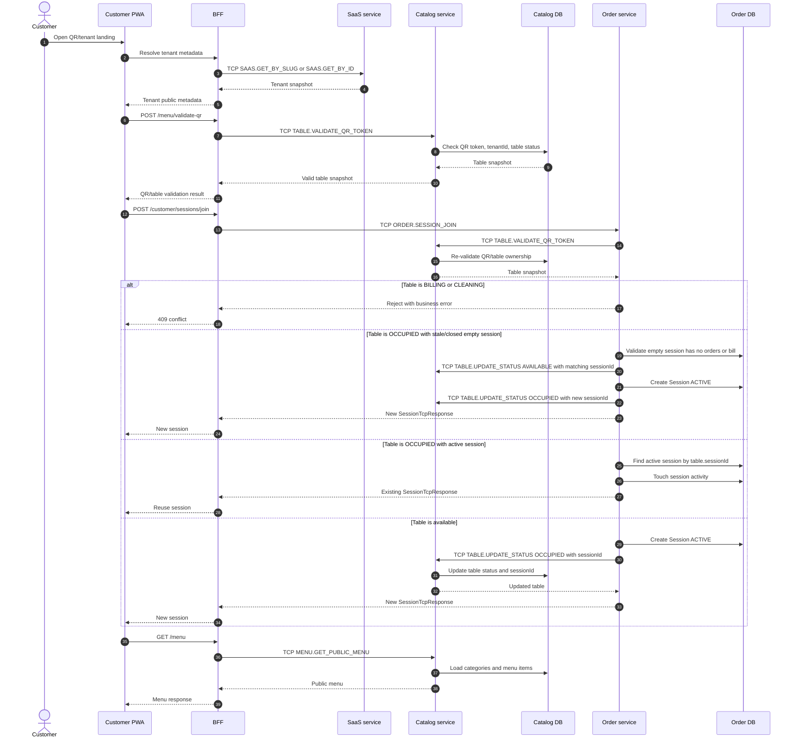

1. Customer opens QR/tenant landing in the PWA.
2. PWA resolves tenant metadata and validates the QR code via BFF.
3. BFF sends `ORDER.SESSION_JOIN` TCP message via `POST /customer/sessions/join`.
4. Order Service invokes Catalog `TABLE.VALIDATE_QR_TOKEN` to confirm table/QR ownership.
5. If the table status is `BILLING` or `CLEANING`, Order rejects the join.
6. If the table is `OCCUPIED` but the bound session is empty and stale/closed, Order releases the binding for that `sessionId` and creates a fresh session.
7. If the table is `OCCUPIED` with a valid active session, Order retrieves the existing session and touches its activity.
8. If the table is `AVAILABLE`, Order creates a new `Session` and tells Catalog to update the table status to `OCCUPIED`.
9. PWA stores the session context, and the menu is fetched via `GET /menu`.

**Theory to know:**

- A QR token is not an authentication token for a user; it is an entry token for a table within a tenant.
- A session represents the "current dining session" of a customer at a table, not a user login account.
- Table status belongs to the Catalog domain, but the session belongs to the Order domain; joining a session requires synchronous communication between Order and Catalog.
- The tenant lifecycle guard blocks customer access if a tenant is suspended/closed.

**How to explain in interviews:**

> Customers don't log in with user accounts. Instead, they scan a QR code to join a table session. QR/table validation logic belongs to Catalog, while the dining session belongs to Order. When joining, Order validates the QR code via Catalog, creates or reuse a session, and updates the table status. This clearly decouples table inventory from order sessions.

### Flow 2: Cart, Submit Order, Idempotency, Quota

Read in order:

| Layer       | Files                                                                                   |
| ----------- | --------------------------------------------------------------------------------------- |
| Customer UI | `apps/customer-pwa/src/features/order/services/order.service.ts`                        |
| Customer UI | `apps/customer-pwa/src/features/order/hooks/order-query-keys.ts`                        |
| Customer UI | `apps/customer-pwa/src/features/order/hooks/use-cart-query.ts`                          |
| Customer UI | `apps/customer-pwa/src/features/order/hooks/use-order-query.ts`                         |
| Customer UI | `apps/customer-pwa/src/features/order/hooks/use-bill-query.ts`                          |
| Customer UI | `apps/customer-pwa/src/lib/idempotency.ts`                                              |
| BFF         | `apps/bff/src/app/modules/order/controllers/customer-order.controller.ts`               |
| Order       | `apps/order/src/app/modules/order/controllers/order.controller.ts`                      |
| Order       | `apps/order/src/app/modules/order/services/cart.service.ts`                             |
| Order       | `apps/order/src/app/modules/order/services/order-submit.service.ts`                     |
| Order       | `apps/order/src/app/modules/order/services/order-quota.service.ts`                      |
| Order       | `apps/order/src/app/modules/order/services/bill.service.ts`                             |
| Order       | `apps/order/src/app/modules/order/utils/recalculate-bill-totals.ts`                     |
| Tests       | `apps/order/src/app/modules/order/tests/order-submit-cart.integration.spec.ts`          |
| Tests       | `apps/order/src/app/modules/order/tests/order-payment-finalization.integration.spec.ts` |

Sequence of events:

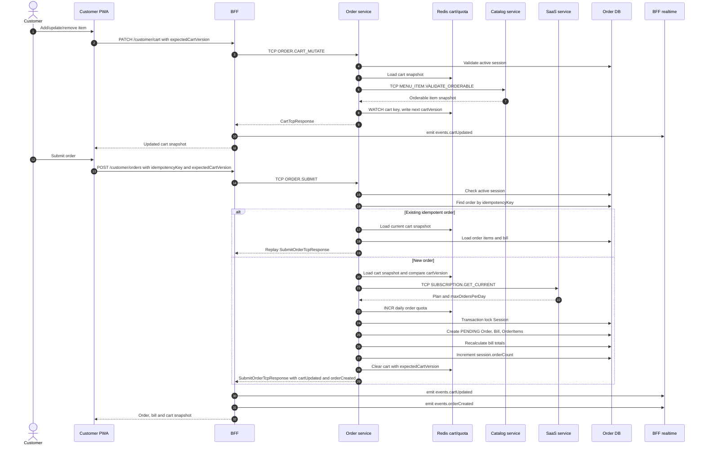

1. Customer mutates cart through `GET/PATCH/DELETE /customer/cart`.
2. Cart Service persists cart snapshots scoped to tenant/session and tracks cart version.
3. Order is submitted via `POST /customer/orders` with `idempotencyKey` and `expectedCartVersion`.
4. `OrderSubmitService` validates active session, performs idempotency check/replay, checks cart version, and rejects empty carts.
5. For new orders, it reserves daily order quota via SaaS.
6. A database transaction locks the session, creates the `Order` in `PENDING` status, creates/reuses an open `Bill`, creates `OrderItem` rows, recalculates the bill, increments `session.orderCount`, and clears the cart.
7. Response returns the order, bill, cart snapshot, and events to let BFF trigger UI updates.

**Theory to know:**

- An idempotency key handles double submit/retry issues: resending the same action will not duplicate the order.
- `expectedCartVersion` enforces optimistic concurrency control: if the client submits based on an out-of-date cart state, the server rejects it.
- Bills belong to the Order domain because they aggregate order/session totals; Payment Service only manages final payment records.
- Quota reservations must rollback if the transaction fails to avoid deducting quotas incorrectly.

**How to explain in interviews:**

> Submitting an order is a write operation prone to double clicks and network retries. I resolved this using idempotency keys and cart versions. Cart versions protect users from submitting stale cart states, while idempotency keys prevent duplicate orders on the backend. Order and bill rows are created within a single transaction; if quota was reserved but the transaction fails, the quota is rolled back.

### Flow 3: Staff POS, Confirm Order, Stock, Order State Machine

Read in order:

| Layer         | Files                                                                                        |
| ------------- | -------------------------------------------------------------------------------------------- |
| Management UI | `apps/management-app/src/app/(pos)/pos/page.tsx`                                             |
| Management UI | `apps/management-app/src/features/pos/components/*`                                          |
| Management UI | `apps/management-app/src/features/order/services/order.service.ts`                           |
| Management UI | `apps/management-app/src/features/order/hooks/use-order-query.ts`                            |
| BFF           | `apps/bff/src/app/modules/order/controllers/staff-order.controller.ts`                       |
| Order         | `apps/order/src/app/modules/order/controllers/order.controller.ts`                           |
| Order         | `apps/order/src/app/modules/order/services/order.service.ts` facade                          |
| Order         | `apps/order/src/app/modules/order/services/order-confirm-saga.service.ts`                    |
| Order         | `apps/order/src/app/modules/order/services/catalog-stock-gateway.service.ts`                 |
| Order         | `apps/order/src/app/modules/order/services/order-state-transition.service.ts` cancel paths   |
| Order         | `apps/order/src/app/modules/order/services/outbox-publisher.service.ts`                      |
| Catalog       | `apps/catalog/src/app/modules/menu-item/controllers/menu-item.controller.ts`                 |
| Catalog       | `apps/catalog/src/app/modules/menu-item/services/stock-reservation.service.ts`               |
| Catalog       | `apps/catalog/src/app/modules/menu-item/repositories/stock-reservation.repository.ts`        |
| Catalog       | `apps/catalog/src/app/modules/menu-item/repositories/menu-item.repository.ts`                |
| Shared        | `libs/entities/src/lib/stock-reservation.entity.ts`                                          |
| Shared        | `libs/interfaces/src/lib/tcp/catalog/menu-item-request.interface.ts`                         |
| Shared        | `libs/interfaces/src/lib/tcp/catalog/menu-item-response.interface.ts`                        |
| Tests         | `apps/order/src/app/modules/order/tests/order-confirm-saga.service.spec.ts`                  |
| Tests         | `apps/order/src/app/modules/order/tests/order-confirm-stock-idempotency.integration.spec.ts` |
| Tests         | `apps/order/src/app/modules/order/tests/order-stock-concurrency.integration.spec.ts`         |
| Tests         | `apps/catalog/src/app/modules/menu-item/tests/stock-reservation.service.spec.ts`             |

Sequence of events:

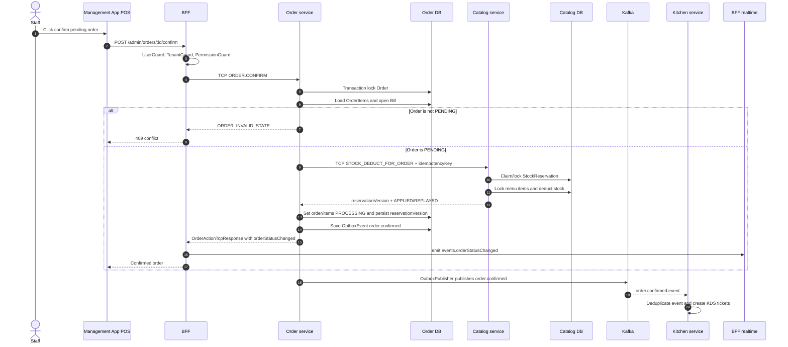

1. Staff monitors pending/live orders in the POS.
2. Staff confirms the order via `POST /admin/orders/:id/confirm`.
3. BFF forwards the `ORDER.CONFIRM` TCP message.
4. `OrderService.confirmOrder` delegates to `OrderConfirmSagaService`; the saga locks the order, loads items/the open bill, and verifies `PENDING`.
5. `CatalogStockGatewayService` sends `MENU_ITEM.STOCK_DEDUCT_FOR_ORDER` with idempotency key `confirm-order:{orderId}`.
6. Catalog `StockReservationService` claims a reservation by tenant/order/key/hash, locks menu items, mutates stock, and returns a `reservationVersion` with `APPLIED` or `REPLAYED`.
7. Order persists `stockReservationVersion`, transitions order/items to `PROCESSING`, and writes the `order.confirmed` outbox event.
8. If the Order step fails after stock deduction, the saga compensates with a release carrying the same `reservationVersion`; an old release returns `STALE` instead of incrementing stock incorrectly.
9. The outbox publisher pushes the event to Kafka; Kitchen consumes it to generate KDS tickets.
10. Processing cancellation in `OrderStateTransitionService` releases stock with the persisted version and publishes `order.status_changed`.

**Theory to know:**

- Stock belongs to the Catalog domain, not Order, because Catalog owns menu item inventory records.
- The Order state machine manages transitions: `PENDING -> PROCESSING -> READY -> SERVED` or cancellation paths.
- Confirming an order requires a synchronous stock mutation call because the staff needs immediate feedback if items are out of stock.
- `reservationVersion` protects deduct/release retries and old compensations; an idempotency key alone cannot distinguish a stale release across multiple reservation cycles.
- The transactional outbox pattern guarantees that side-effect events are published after the DB transaction commits successfully, preventing dual-write issues.

**How to explain in interviews:**

> I do not deduct stock when a customer submits an order because staff may still reject it. On confirm, `OrderConfirmSagaService` calls Catalog synchronously; Catalog uses a reservation plus row locks and returns a version. Order persists that version so compensation/cancellation cannot release a newer reservation, then writes `order.confirmed` to the outbox for Kitchen.

### Flow 4: KDS Queue, Ticket Lifecycle, Recovery, SLA

Read in order:

| Layer         | Files                                                                                   |
| ------------- | --------------------------------------------------------------------------------------- |
| Management UI | `apps/management-app/src/app/(kds)/kds/kitchen/page.tsx`                                |
| Management UI | `apps/management-app/src/app/(kds)/kds/bar/page.tsx`                                    |
| Management UI | `apps/management-app/src/features/kds/services/kds.service.ts`                          |
| Management UI | `apps/management-app/src/features/kds/hooks/use-kds-queue.ts`                           |
| Management UI | `apps/management-app/src/features/kds/hooks/use-kds-realtime.ts`                        |
| BFF           | `apps/bff/src/app/modules/kitchen/controllers/kitchen.controller.ts`                    |
| BFF           | `apps/bff/src/app/modules/kitchen/services/kds-station-access.service.ts`               |
| Kitchen       | `apps/kitchen/src/app/modules/kitchen/controllers/kitchen.controller.ts`                |
| Kitchen       | `apps/kitchen/src/app/modules/kitchen/services/order-confirmed.consumer.ts`             |
| Kitchen       | `apps/kitchen/src/app/modules/kitchen/services/kds-ticket.service.ts`                   |
| Kitchen       | `apps/kitchen/src/app/modules/kitchen/services/kitchen-events.publisher.ts`             |
| Kitchen       | `apps/kitchen/src/app/modules/kitchen/services/kitchen-recovery.service.ts`             |
| Kitchen       | `apps/kitchen/src/app/modules/kitchen/services/kitchen-sla.worker.ts`                   |
| Kitchen       | `apps/kitchen/src/app/modules/kitchen/repositories/kds-redis.repository.ts` facade      |
| Kitchen       | `apps/kitchen/src/app/modules/kitchen/repositories/kds-ticket-store.repository.ts`      |
| Kitchen       | `apps/kitchen/src/app/modules/kitchen/repositories/kds-sla-store.repository.ts`         |
| Kitchen       | `apps/kitchen/src/app/modules/kitchen/repositories/kds-recovery-store.repository.ts`    |
| Kitchen       | `apps/kitchen/src/app/modules/kitchen/utils/kds-keys.ts`                                |
| Kitchen       | `apps/kitchen/src/app/modules/kitchen/utils/kds-score.ts`                               |
| Tests         | `apps/kitchen/src/app/modules/kitchen/tests/order-confirmed-dedupe.integration.spec.ts` |

Sequence of events:

Sequence for generating KDS tickets from `order.confirmed`:

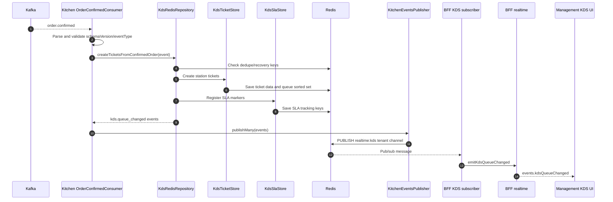

Sequence for KDS ticket operations:

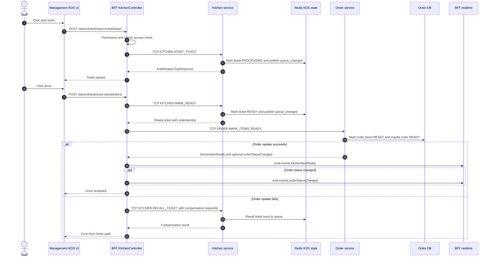

1. Kitchen consumes `order.confirmed` from Kafka.
2. `order-confirmed.consumer.ts` deduplicates events and routes tickets by preparation station.
3. `KdsTicketService` manipulates KDS queue states via Redis repository facade.
4. `kds-ticket-store.repository.ts` stores ticket structures and manages Redis Sorted Sets.
5. `kds-sla-store.repository.ts` monitors SLA deadlines and schedules warnings.
6. `kds-recovery-store.repository.ts` tracks deduplication recovery data.
7. Staff interacts with KDS endpoints: `GET /admin/kds/queue`, `start`, `done`, `recall`, `priority`.
8. When marked `done`, BFF calls Kitchen `MARK_READY` TCP pattern, then updates Order `MARK_ITEMS_READY`.
9. If the Order DB update fails, BFF sends `RECALL_TICKET` to Kitchen to compensate the queue state.
10. Realtime pushes KDS state hints to POS, KDS, and PWA screens via BFF.

**Theory to know:**

- Kitchen does not have a separate SQL database; the KDS queue is an operational state backed by Redis.
- Redis Sorted Sets are ideal for KDS queues because score weights represent ticket timestamps, priority values, and SLA indicators.
- Deduplicating Kafka events prevents consumers from creating duplicate tickets when Kafka retries delivery.
- Marking a ticket done is a cross-service transaction: Kitchen sets ticket status, and Order marks order items. Since there is no distributed transactional boundary, a compensation step is needed.

**How to explain in interviews:**

> KDS is an operational queue, so I used Redis instead of a relational database. Kitchen consumes the `order.confirmed` event to generate tickets, applying deduplication to prevent double-processing. When the chef completes a ticket, the BFF orchestrates Kitchen and Order services. If Order fails to update item statuses, BFF triggers a compensation call to Kitchen to roll back the ticket state.

### Flow 5: Bill, Payment, VietQR/SePay

Read in order:

| Layer         | Files                                                                                           |
| ------------- | ----------------------------------------------------------------------------------------------- |
| Customer UI   | `apps/customer-pwa/src/features/payment/services/payment.service.ts`                            |
| Customer UI   | `apps/customer-pwa/src/features/payment/hooks/use-create-vietqr-mutation.ts`                    |
| Customer UI   | `apps/customer-pwa/src/pages/request-payment-page.tsx`                                          |
| Management UI | `apps/management-app/src/features/payment/services/payment.service.ts`                          |
| Management UI | `apps/management-app/src/features/payment/hooks/use-payment.ts`                                 |
| Management UI | `apps/management-app/src/features/payment/components/bill-settlement-panel.tsx`                 |
| BFF           | `apps/bff/src/app/modules/payment/controllers/payment.controller.ts`                            |
| BFF           | `apps/bff/src/app/modules/payment/guards/sepay-webhook-secret.guard.ts`                         |
| BFF           | `apps/bff/src/app/modules/saas/controllers/sepay-webhook.controller.ts`                         |
| BFF           | `apps/bff/src/app/modules/saas/saas-bff-routes.ts`                                              |
| BFF           | `apps/bff/src/app/modules/order/controllers/customer-order.controller.ts` customer bill APIs    |
| Order         | `apps/order/src/app/modules/order/services/bill.service.ts`                                     |
| Order         | `apps/order/src/app/modules/order/services/payment-events-consumer.service.ts`                  |
| Payment       | `apps/payment/src/app/modules/payment/controllers/payment.controller.ts`                        |
| Payment       | `apps/payment/src/app/modules/payment/services/payment.service.ts` facade                       |
| Payment       | `apps/payment/src/app/modules/payment/services/payment-settlement.service.ts`                   |
| Payment       | `apps/payment/src/app/modules/payment/services/payment-query.service.ts`                        |
| Payment       | `apps/payment/src/app/modules/payment/services/sepay-webhook.service.ts`                        |
| Payment       | `apps/payment/src/app/modules/payment/services/payment-order.gateway.ts`                        |
| Payment       | `apps/payment/src/app/modules/payment/services/payment-reference.service.ts`                    |
| Payment       | `apps/payment/src/app/modules/payment/repositories/payment.repository.ts`                       |
| Payment       | `apps/payment/src/app/modules/payment/repositories/audit-payment.repository.ts`                 |
| Payment       | `apps/payment/src/app/modules/payment/repositories/payment-outbox.repository.ts`                |
| Payment       | `apps/payment/src/app/modules/payment/services/payment-outbox-publisher.service.ts`             |
| Tests         | `apps/payment/src/app/modules/payment/tests/payment-completed-order-bridge.integration.spec.ts` |

Refund handling is not implemented in accepted Phase 3; broader refund/financial operations are deferred. A nullable `refundId` in the audit schema is not evidence of a current refund use case.

Cash flow diagram:

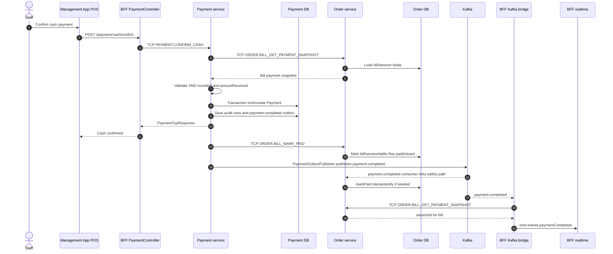

1. Staff or customer initiates payment, Order Service moves the bill state to `PENDING_PAYMENT`.
2. Staff confirms cash receipt via `POST /payment/cash/confirm`.
3. Payment Service requests the bill payment snapshot from Order.
4. Payment validates VND rounding logic and checks `amountReceived`.
5. Payment writes the payment record, saves audit logs, and pushes `payment.completed` to the outbox.
6. Payment calls Order `BILL_MARK_PAID` TCP message to close the bill, dining session, and free the table.
7. Order Service maintains `PaymentEventsConsumerService` to consume the Kafka event as an asynchronous retry-safety mechanism; the `markPaid` logic is written idempotently.

VietQR/SePay flow diagram:

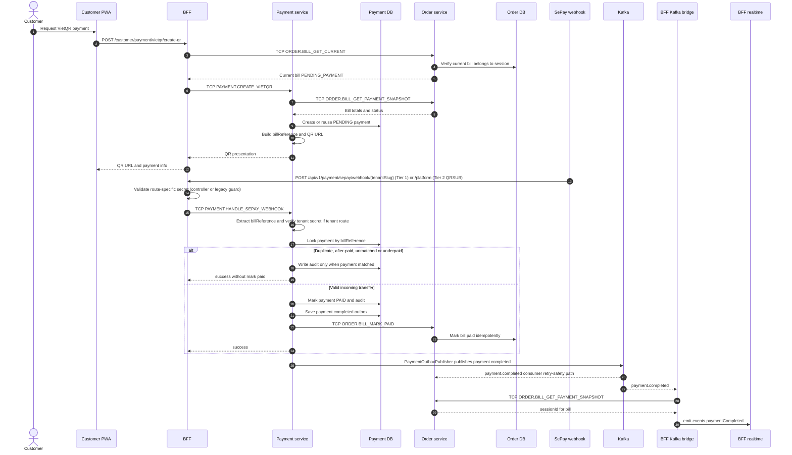

1. UI hits `POST /payment/vietqr/create-qr` or the customer PWA route through BFF.
2. Payment creates a pending payment structure, computes the bill reference, and generates the QR presentation parameters.
3. SePay reaches the BFF through Tier 1 `/api/v1/payment/sepay/webhook/:tenantSlug` or Tier 2 `.../webhook/platform` on the SaaS BFF controller, while legacy HMAC `.../payment/sepay/webhook` goes through the Payment controller and `SepayWebhookSecretGuard` (see [sepay-configuration-guide-phase3.md](sepay-configuration-guide-phase3.md) §0).
4. The BFF resolves the secret according to route topology; `SepayWebhookService` validates the tenant secret for tenant routes, extracts the bill reference, locks the payment record, and prevents duplicate/underpaid processing.
5. On a valid transfer match, it updates payment to `PAID`, audits it, writes to the outbox, and fires a TCP call to Order Service to close the bill.
6. Order handles the transition idempotently if the event is delivered via the async broker path.
7. BFF Kafka bridge consumes `payment.completed`, queries the session ID from Order, and emits WebSocket notices to clients.

**Theory to know:**

- Order Service is the source of truth for bill states and dining sessions; Payment Service is the source of truth for payment ledgers and audit records.
- Payment does not compute bill totals; it acquires a read snapshot from Order and validates the VND rounding.
- Webhook processing must be idempotent because payment providers may retry webhooks multiple times.
- Audit logs for payment entries track external money movements for reconciliation.
- Refunds are outside the current accepted scope; do not infer a use case from a nullable audit field or an older roadmap.

**How to explain in interviews:**

> I decoupled bills from payments: bills belong to the Order domain because they represent dining session totals, while payments belong to the Payment domain because they handle bank interactions and auditing. Payment does not calculate bill totals; it queries a snapshot from Order, validates the VND rounding, records the receipt, and notifies Order. The webhook is processed idempotently to handle provider retries safely.

### Flow 6: SaaS Onboarding, Subscription, Tenant Lifecycle

Read in order:

| Layer         | Files                                                                           |
| ------------- | ------------------------------------------------------------------------------- |
| Management UI | `apps/management-app/src/features/saas/services/saas.service.ts`                |
| Management UI | `apps/management-app/src/features/saas/saas-keys.ts`                            |
| Management UI | `apps/management-app/src/features/saas/README.md` (labels vs badges)            |
| Management UI | `apps/management-app/src/features/saas/components/badges/*`                     |
| Management UI | `libs/shared/constants/src/lib/vi-domain-labels.ts`                             |
| Management UI | `apps/management-app/src/features/saas/admin-tenants/onboard-tenant-dialog.tsx` |
| Management UI | `apps/management-app/src/features/saas/subscription/*`                          |
| Management UI | `apps/management-app/src/features/saas/payment-settings/*`                      |
| Customer PWA  | Customer PWA pages using `*Vi()` from `@einvoice/shared-constants`              |
| BFF           | `apps/bff/src/app/modules/saas/controllers/*.ts`                                |
| BFF           | `apps/bff/src/app/modules/saas/saas-bff-routes.ts`                              |
| SaaS          | `apps/saas/src/controllers/saas.controller.ts`                                  |
| SaaS          | `apps/saas/src/services/onboarding-saga.service.ts`                             |
| SaaS          | `apps/saas/src/services/tenant-admin.service.ts`                                |
| SaaS          | `apps/saas/src/services/tenant-lifecycle.service.ts`                            |
| SaaS          | `apps/saas/src/services/tenant-status-cache.service.ts`                         |
| SaaS          | `apps/saas/src/services/tenant-suspend-cron.service.ts`                         |
| SaaS          | `apps/saas/src/services/subscription.service.ts`                                |
| SaaS          | `apps/saas/src/services/subscription-invoice.service.ts`                        |
| SaaS          | `apps/saas/src/services/subscription-dashboard.service.ts`                      |
| SaaS          | `apps/saas/src/services/pricing-plan-admin.service.ts`                          |
| SaaS          | `apps/saas/src/services/saas-outbox-publisher.service.ts`                       |
| Shared        | `libs/constants/src/lib/saas.constants.ts`                                      |
| Shared        | `libs/entities/src/lib/tenant.entity.ts`                                        |
| Shared        | `libs/entities/src/lib/subscription.entity.ts`                                  |
| Shared        | `libs/entities/src/lib/subscription-invoice.entity.ts`                          |
| Shared        | `libs/entities/src/lib/pricing-plan.entity.ts`                                  |

Path note: `apps/saas` places its files directly under `src/controllers`, `src/services`, and `src/repositories`, rather than nesting inside `src/app/modules`.

Onboarding sequence diagram:

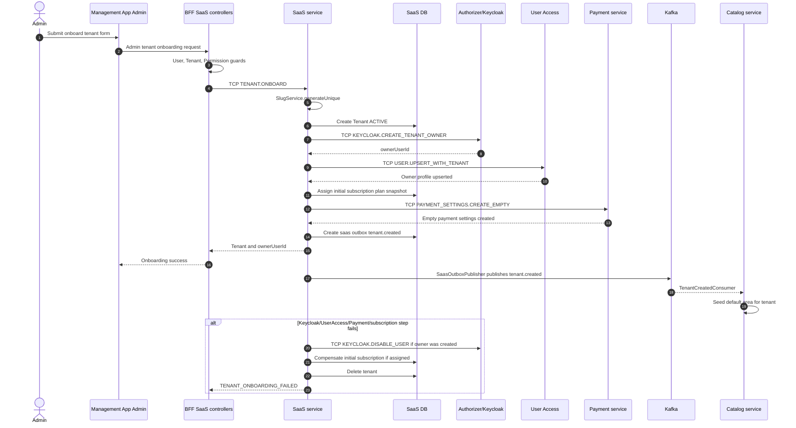

1. Admin triggers tenant onboarding from the Management App.
2. BFF SaaS controller forwards the request via TCP message `TENANT.ONBOARD`.
3. `OnboardingSagaService` manages tenant creation, Owner provisioning on Authorizer/Keycloak, Owner profile synchronization on User Access, empty payment settings setups on Payment, subscription plans setups, and logs outbox events.
4. If a critical step fails, the current catch path disables the Keycloak owner if created, compensates the initial subscription if assigned, and deletes the tenant.

Do not infer a full rollback: the catch path does not issue commands to delete an already-created User Access profile or Payment settings. This residual-state question should be checked against tests and the operational cleanup policy when reviewing the saga.

Tenant lifecycle sequence diagram:

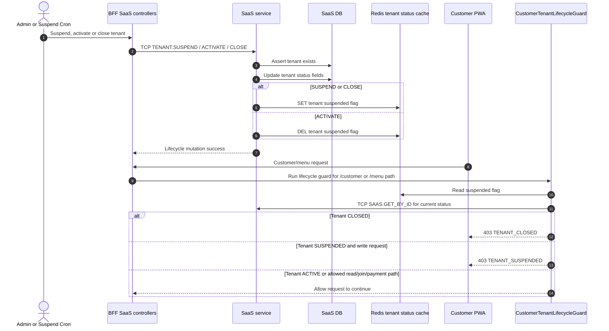

1. Tenants are assigned a status: active, suspended, or closed.
2. `TenantLifecycleService` modifies tenant status attributes.
3. `TenantStatusCacheService` updates the status flag in Redis.
4. `CustomerTenantLifecycleGuard` on BFF references Redis to block PWA customer order/menu flows.
5. `TenantSuspendCronService` automatically suspends tenants if subscriptions expire beyond the grace period.

**Theory to know:**

- SaaS Service manages platform-level tenant lifecycles, separating administrative state from restaurant operations.
- Tenant onboarding is modeled as a saga because it crosses multiple boundaries: Keycloak, User Access, Payment, and Subscription.
- Subscriptions store snapshots of selected pricing plans to ensure invoices and historical data remain stable even if plans are edited.
- Tenant lifecycles are treated as authorization/business gates rather than just cosmetic UI values.

**How to explain in interviews:**

> Tenant onboarding is a distributed workflow, so it uses a saga rather than a distributed transaction. Current compensation disables the owner identity, rolls back the initial subscription, and deletes the tenant; I do not claim full User Access/Payment rollback without matching cleanup commands. Tenant status is cached so the BFF can quickly gate suspended or closed tenants.

### Flow 7: Auth, Keycloak, User Access, RBAC

Read in order:

| Layer          | Files                                                                          |
| -------------- | ------------------------------------------------------------------------------ |
| Management App | `apps/management-app/src/auth.ts`                                              |
| Management App | `apps/management-app/src/proxy.ts`                                             |
| Management App | `apps/management-app/src/lib/auth/*`                                           |
| BFF            | `libs/guards/src/lib/user.guard.ts`                                            |
| BFF            | `libs/guards/src/lib/permission.guard.ts`                                      |
| BFF            | `libs/guards/src/lib/tenant.guard.ts`                                          |
| Authorizer     | `apps/authorizer/src/app/authorizer/controllers/authorizer-grpc.controller.ts` |
| Authorizer     | `apps/authorizer/src/app/authorizer/services/authorizer.service.ts`            |
| Authorizer     | `apps/authorizer/src/app/keycloak/services/keycloak-admin.service.ts`          |
| User Access    | `apps/user-access/src/app/modules/user/services/user.service.ts`               |
| User Access    | `apps/user-access/src/app/modules/user/services/tenant-user.service.ts`        |
| User Access    | `apps/user-access/src/app/modules/user/services/staff-quota.enforcer.ts`       |
| Shared         | `libs/constants/src/lib/enum/role.enum.ts`                                     |
| Docs           | `docs/architecture/permission-matrix.md`                                       |

Flow diagram:

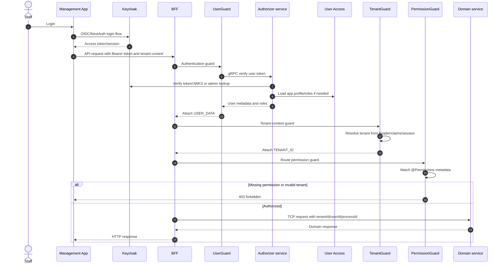

1. Staff/owner/admin logs in via Keycloak/NextAuth.
2. Management App requests BFF endpoints with a Bearer token.
3. `UserGuard` validates the token via Authorizer and caches the result.
4. `TenantGuard` extracts and resolves the tenant ID from the token claims, session, or headers.
5. `PermissionGuard` checks if the user possesses the permissions required by the route decorators.
6. Domain services receive pre-resolved tenant and user IDs inside TCP payloads, bypassing HTTP layer dependencies.

**Staff-management subtrack (Phase 4C):**

1. `apps/management-app/src/features/staff/staff-page-client.tsx`
2. `apps/management-app/src/features/staff/services/staff.service.ts`
3. `apps/management-app/src/features/staff/hooks/use-staff-query.ts`
4. `apps/bff/src/app/modules/user/controllers/dashboard-staff.controller.ts`
5. `apps/user-access/src/app/modules/user/controllers/user.controller.ts`
6. `apps/user-access/src/app/modules/user/services/staff-management.service.ts`
7. `apps/user-access/src/app/modules/user/services/staff-quota.enforcer.ts`
8. `apps/user-access/src/app/modules/user/repositories/user.repository.ts`
9. `apps/user-access/src/app/modules/user/services/staff-management.service.spec.ts`

Staff creation checks actor-role policy and the active subscription's `maxStaff`, creates the Keycloak identity through Authorizer, then creates the Mongo profile. If profile creation fails, it disables the newly created identity. Role changes and enable/disable operations also coordinate Keycloak with Mongo and compensate toward the previous state on failure. Repository operations remain tenant-scoped, and Owner/Manager capabilities differ.

**Theory to know:**

- Keycloak acts as the Identity Provider; User Access Service stores application-level profile information and tenant-specific staff records.
- Authentication answers "who are you"; authorization/permissions answer "what are you allowed to do".
- Tenant isolation context must be resolved at the API Gateway level to ensure database queries are filtered correctly.

**How to explain in interviews:**

> I separated authentication from application authorization. Keycloak manages logins and token issuance, Authorizer handles validation, and User Access maintains tenant-specific profile records. The BFF guard chain attaches user and tenant context to incoming requests before routing them to domain services, ensuring they are independent of Express HTTP details.

### Flow 8: Realtime and Client Cache

Read in order:

| Layer       | Files                                                                          |
| ----------- | ------------------------------------------------------------------------------ |
| BFF         | `apps/bff/src/app/modules/realtime/gateways/order-events.gateway.ts`           |
| BFF         | `apps/bff/src/app/modules/realtime/realtime.module.ts`                         |
| BFF         | `apps/bff/src/app/modules/realtime/services/realtime-auth.service.ts`          |
| BFF         | `apps/bff/src/app/modules/realtime/services/realtime-events.service.ts`        |
| BFF         | `apps/bff/src/app/modules/realtime/services/realtime-kafka-bridge.service.ts`  |
| BFF         | `apps/bff/src/app/modules/realtime/services/kds-internal-events.subscriber.ts` |
| BFF         | `apps/bff/src/app/modules/realtime/adapters/redis-io.adapter.ts`               |
| Shared      | `libs/constants/src/lib/ws-room.constants.ts`                                  |
| Shared      | `libs/shared/types/src/lib/realtime-events.types.ts`                           |
| Customer UI | `apps/customer-pwa/src/features/order/hooks/use-customer-order-realtime.ts`    |
| Customer UI | `apps/customer-pwa/src/components/realtime/realtime-status-pill.tsx`           |
| Staff UI    | `apps/management-app/src/features/order/hooks/use-staff-order-realtime.ts`     |
| KDS UI      | `apps/management-app/src/features/kds/hooks/use-kds-realtime.ts`               |
| Tests       | `apps/bff/src/app/modules/realtime/tests/architecture-contracts.spec.ts`       |

Sequence of events:

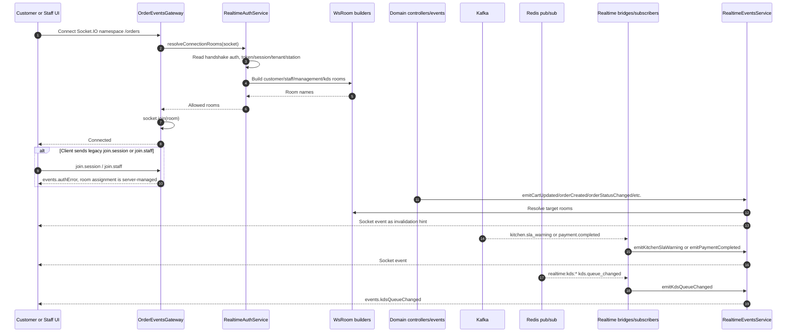

1. Clients connect to the Socket.IO namespace `/orders`.
2. `RealtimeAuthService` parses connection parameters to resolve room names.
3. Room assignments are managed by the server; legacy client messages like `join.session` or `join.staff` are rejected with error messages.
4. Bounded context updates (Order, Payment, Kitchen) are mapped to targets and emitted via BFF.
5. The client uses the WebSocket payload as a hint to trigger a TanStack Query invalidate/refetch.
6. `subscribe.kds` is an exception that accepts client parameters, but BFF still checks tenant/role boundaries before joining the station room.

**Theory to know:**

- WebSocket payloads should not contain canonical business state.
- The source of truth for state remains HTTP/TCP query endpoints back to the owning microservice.
- The Redis Socket.IO adapter distributes room emissions across multiple BFF instances horizontally.
- Room names must be created using the `WsRoom` builder to avoid hardcoded inconsistencies.

**How to explain in interviews:**

> Realtime events in QRTable function as query invalidation hints. When order, payment, or KDS events occur, BFF pushes a WebSocket event to let the client refetch data. I avoided placing business state inside WebSocket payloads because the database and domain services remain the source of truth.

### Flow 9: Dashboard Reporting, Plan Entitlement, Admin Analytics

This Phase 4D flow is the clearest example of read-side composition without introducing a shared reporting database.

Read in order:

| Layer         | Files                                                                                             |
| ------------- | ------------------------------------------------------------------------------------------------- |
| Management UI | `apps/management-app/src/app/(dashboard)/dashboard/page.tsx`                                      |
| Management UI | `apps/management-app/src/app/(admin)/admin/analytics/page.tsx`                                    |
| Management UI | `apps/management-app/src/features/reports/services/reports.service.ts`                            |
| Management UI | `apps/management-app/src/features/reports/reports-keys.ts`                                        |
| Management UI | `apps/management-app/src/features/reports/hooks/use-report-query.ts`                              |
| Management UI | `apps/management-app/src/features/reports/hooks/use-dashboard-entitlements.ts`                    |
| BFF           | `apps/bff/src/app/modules/reporting/reporting.module.ts`                                          |
| BFF           | `apps/bff/src/app/modules/reporting/controllers/dashboard-report.controller.ts`                   |
| BFF           | `apps/bff/src/app/modules/reporting/controllers/admin-analytics.controller.ts`                    |
| BFF           | `apps/bff/src/app/modules/reporting/guards/tenant-subscription-context.guard.ts`                  |
| BFF           | `apps/bff/src/app/modules/reporting/services/tenant-subscription-resolver.service.ts`             |
| Shared        | `libs/guards/src/lib/plan-feature.guard.ts`                                                       |
| Shared        | `libs/decorators/src/lib/requires-plan-feature.decorator.ts`                                      |
| Order         | `apps/order/src/app/modules/order/services/order-report.service.ts`                               |
| Payment       | `apps/payment/src/app/modules/payment/services/payment-report.service.ts`                         |
| Catalog       | `apps/catalog/src/app/modules/table/services/catalog-report.service.ts`                           |
| SaaS          | `apps/saas/src/services/platform-report.service.ts`                                               |
| Tests         | `apps/bff/src/app/modules/reporting/controllers/dashboard-report.controller.plan-feature.spec.ts` |
| Tests         | `apps/order/src/app/modules/order/tests/order-report.service.spec.ts`                             |
| Tests         | `apps/payment/src/app/modules/payment/tests/payment-report.service.spec.ts`                       |
| Tests         | `apps/catalog/src/app/modules/table/services/catalog-report.service.spec.ts`                      |
| Tests         | `apps/saas/src/services/platform-report.service.spec.ts`                                          |

Tenant dashboard flow:

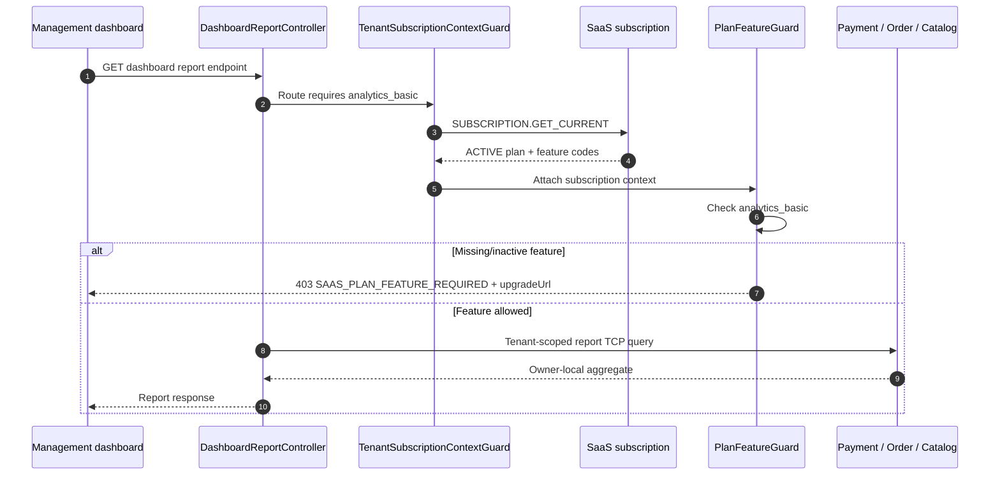

- Tenant routes require both `REPORT_READ_OWN` and `analytics_basic`.
- `TenantSubscriptionContextGuard` must run before `PlanFeatureGuard` so the subscription context exists.
- Super Admin analytics uses `REPORT_READ_ANY` and is not gated by a tenant plan. Platform reports belong to SaaS; tenant drilldowns still call the appropriate domain owner.
- Payment aggregates revenue, Order aggregates orders/bills, Catalog aggregates table/menu availability, and SaaS aggregates platform/subscription metrics.
- BFF exposes one reporting HTTP surface through several TCP clients; it neither joins databases nor becomes the report-data owner.

**How to explain in interviews:**

> Reporting has no shared database. Each service aggregates the data it owns, while the BFF exposes a unified read surface. Tenant dashboards are gated by both permission and an active subscription feature; Super Admin uses a global permission and does not depend on one tenant's plan.

### Deep Dive: Realtime, Kafka, Redis Reading Strategy

Trace these three parts by **data signals** rather than analyzing each tool in isolation. A single business event often flows through Kafka, Redis, and WebSockets, with each layer serving a specific purpose:

| Layer     | Role in QRTable                                       | What it is NOT                                   |
| --------- | ----------------------------------------------------- | ------------------------------------------------ |
| Kafka     | Durable async event log between service owners.       | Not a channel to push data directly to browsers. |
| Redis     | Short-term operational state, cache, queues, pub-sub. | Not a replacement for PostgreSQL audit ledgers.  |
| WebSocket | Push invalidation hints to client rooms via BFF.      | Not the source of truth for business states.     |

#### Track A: Order Confirm -> Kitchen KDS

Read in order:

1. `apps/bff/src/app/modules/order/controllers/staff-order.controller.ts` — HTTP actions and immediate WebSocket emissions for POS UI.
2. `apps/order/src/app/modules/order/services/order-confirm-saga.service.ts` — handles transaction boundary, stock deduct requests, and outbox logs.
3. `apps/order/src/app/modules/order/services/outbox-publisher.service.ts` — publishes `order.confirmed` to Kafka post-commit.
4. `apps/kitchen/src/app/modules/kitchen/services/order-confirmed.consumer.ts` — consumes, validates, and deduplicates the message.
5. `apps/kitchen/src/app/modules/kitchen/repositories/kds-redis.repository.ts` — facade managing ticket, SLA, and recovery stores on Redis.
6. `apps/kitchen/src/app/modules/kitchen/services/kitchen-events.publisher.ts` — publishes `realtime:kds:{tenantId}` to Redis pub/sub.
7. `apps/bff/src/app/modules/realtime/services/kds-internal-events.subscriber.ts` — subscribes to Redis pub/sub and invokes the realtime service.
8. `apps/bff/src/app/modules/realtime/services/realtime-events.service.ts` — translates events and broadcasts to the target `WsRoom`.
9. `apps/management-app/src/features/kds/hooks/use-kds-realtime.ts` — KDS UI hook intercepts hints and triggers a query refetch.

When reading this track, ask: which events require durability, which states are simply transient queues, and does the client treat payload data as canonical state?

#### Track B: Payment Completed -> UI Realtime

Read in order:

1. `apps/payment/src/app/modules/payment/services/payment-settlement.service.ts` or `sepay-webhook.service.ts` — writes payment record and outbox event `payment.completed`.
2. `apps/payment/src/app/modules/payment/repositories/payment-outbox.repository.ts` — manages transaction outbox logging.
3. `apps/payment/src/app/modules/payment/services/payment-outbox-publisher.service.ts` — publishes to Kafka.
4. `apps/order/src/app/modules/order/services/payment-events-consumer.service.ts` — async consumer handles order/session closure idempotently.
5. `apps/bff/src/app/modules/realtime/services/realtime-kafka-bridge.service.ts` — consumes Kafka `payment.completed`, resolves session info, and routes to WebSocket service.
6. `apps/bff/src/app/modules/realtime/services/realtime-events.service.ts` — broadcasts `events.paymentCompleted` to customer and staff rooms.
7. Customer/staff payment hooks — refetches bill/payment states from HTTP API endpoints.

Do not view the BFF bridge as the owner of payment state. It simply translates Kafka messages into UI invalidation signals.

#### Track C: Room, Key, Topic Contracts

Read contracts first:

| Contract                | File                                                                                                                | Key Question to Answer                                     |
| ----------------------- | ------------------------------------------------------------------------------------------------------------------- | ---------------------------------------------------------- |
| WebSocket rooms         | `libs/constants/src/lib/ws-room.constants.ts`                                                                       | Which tenant, session, or KDS station room gets the event? |
| Realtime event payloads | `libs/shared/types/src/lib/realtime-events.types.ts`                                                                | Is the payload data a hint or canonical state?             |
| Redis key builders      | `libs/constants/src/lib/redis-key.constants.ts`                                                                     | Are keys scoped correctly to tenant/session boundaries?    |
| KDS Redis key/score     | `apps/kitchen/src/app/modules/kitchen/utils/kds-keys.ts`, `apps/kitchen/src/app/modules/kitchen/utils/kds-score.ts` | How are queues sorted by time, priority, and SLA?          |
| Kafka topic registry    | `libs/constants/src/lib/kafka-topic.constants.ts`                                                                   | Which canonical topic do producers/consumers use?          |
| Kafka runtime config    | `libs/configuration/src/lib/kafka.config.ts`                                                                        | How are brokers, groups, and default topics wired?         |
| TCP messages            | `libs/constants/src/lib/enum/tcp-request-message.ts`                                                                | What sync boundaries must occur before async events?       |

Rule of thumb: If you spot hardcoded rooms, keys, or topics, trace them back to shared constants. If a WebSocket payload contains large data structures, find the underlying API query hook.

## Round 4: Shared Libs and Contracts

Read shared libraries after learning at least one domain flow. The goal is not to “read all of `libs/`”; open the exact **contract bundle** or **infrastructure bundle** traversed by the flow.

### Protocol: From Import Back to Owner

Whenever an import uses `@common/*` or `@einvoice/*`, follow this order:

1. Confirm the alias in `tsconfig.base.json`.
2. Open the exact imported leaf file, not its entire directory.
3. Open a core dependency of that leaf only if it changes the contract or lifecycle.
4. Return to the owning app/service and find where the dependency is registered and used.
5. Read the contract/boundary test before moving to another library.

### Library Routing Table

| Library path                                | When to read it                                                                      | Core entry/file to start with                                                                            |
| ------------------------------------------- | ------------------------------------------------------------------------------------ | -------------------------------------------------------------------------------------------------------- |
| `libs/configuration`                        | Process bootstrap, transport, database, Redis, or Kafka.                             | `base.config.ts`, then only the factory used by the app configuration/root module.                       |
| `libs/constants`                            | Stable messages, topics, keys, rooms, permissions, or wire values.                   | `tcp-request-message.ts`, `kafka-topic.constants.ts`, `redis-key.constants.ts`, `ws-room.constants.ts`.  |
| `libs/interfaces`                           | Trace HTTP DTO -> TCP/gRPC wire contract.                                            | Common TCP envelope, then only the active `gateway/<domain>` and `tcp/<domain>` folders.                 |
| `libs/entities`                             | Verify Catalog/Order/SaaS TypeORM shapes.                                            | `base.entity.ts`, the flow entity, then owner DataSource/module/repository.                              |
| `libs/schemas`                              | Trace User Access Mongo documents.                                                   | `base.schema.ts` -> `user.schema.ts` / `role.schema.ts` -> Mongoose module/repository.                   |
| `libs/guards`                               | Trace active BFF auth/session/tenant/permission/plan lifecycle.                      | Start from registration in `apps/bff/src/app/app.module.ts`; do not begin with unwired files.            |
| `libs/middlewares`                          | Trace process/logging and the tenant hint before guards.                             | `logger.middleware.ts` -> `tenant.middleware.ts`.                                                        |
| `libs/decorators`                           | Understand route metadata or parameter extraction used by a guard/controller.        | Open the decorator on the current route; do not read alphabetically.                                     |
| `libs/interceptors` + `libs/error-messages` | Trace responses/errors across the HTTP <-> TCP boundary.                             | `business.exception.ts` -> `tcpLogging.interceptor.ts` -> `exception.interceptor.ts`.                    |
| `libs/providers/redis-client`               | Direct Redis commands for cart/KDS/cache/lifecycle behavior.                         | `redis-client.module.ts` -> `redis-client.service.ts` -> domain key builder/store.                       |
| `libs/providers/cloudinary`                 | Only when tracing BFF Catalog menu-image upload/delete.                              | `cloudinary.module.ts` -> `cloudinary.service.ts` -> BFF menu-item controller.                           |
| `libs/utils`                                | Request context, VND rounding, or reporting range/bucket logic.                      | The exact `request.util.ts`, `vnd-rounding.util.ts`, `report-range.util.ts`, or `report-bucket.util.ts`. |
| `libs/shared/types`                         | Cross-platform API/domain/realtime types used by frontend or events.                 | `src/index.ts`, then `order.types.ts`, `kds.types.ts`, `realtime-events.types.ts`, and so on.            |
| `libs/shared/constants`                     | Frontend wire enums, display labels, query/default configuration.                    | `src/index.ts` -> `saas-wire-types.ts` / `vi-domain-labels.ts` / `config.ts`.                            |
| `libs/frontend/ui`                          | An app imports a specific shared component.                                          | `src/index.ts`, then that component; do not read every Shadcn primitive.                                 |
| `libs/frontend/hooks`                       | Small shared UI hooks. It currently exports only `useIsMobile` and `useDialogState`. | `src/index.ts` -> the imported leaf hook. Query/realtime hooks remain app-local.                         |
| `libs/frontend/utils`                       | Shared `cn`, formatting, generic API/upload client, and message helpers.             | `src/index.ts` -> the utility actually imported by the app.                                              |
| `libs/shared/mock-data`                     | Test/demo/mock data; never a production state owner.                                 | `src/index.ts` and the data-conformance test, only when a flow/test uses mock data.                      |

### Track A: Configuration and Runtime Providers

Read by concern, not by traversing `libs/configuration/src/lib/*.ts`:

| Concern               | Exact order                                                                                                                                                                                                                            | Stop point                                                                |
| --------------------- | -------------------------------------------------------------------------------------------------------------------------------------------------------------------------------------------------------------------------------------- | ------------------------------------------------------------------------- |
| BFF process           | `libs/configuration/src/lib/base.config.ts` -> `libs/configuration/src/lib/app.config.ts` -> `libs/configuration/src/lib/redis.config.ts` -> `apps/bff/src/configuration/index.ts` -> `libs/configuration/src/lib/throttler.config.ts` | Stop before TCP/gRPC/Kafka internals in Round 2 - Step 1.                 |
| Synchronous transport | `libs/configuration/src/lib/tcp.config.ts` -> `libs/configuration/src/lib/grpc.config.ts` -> proto files under `libs/interfaces/src/lib/proto/`                                                                                        | Return to the BFF/service module and confirm provider-token registration. |
| Kafka                 | `libs/configuration/src/lib/kafka.config.ts` -> `libs/constants/src/lib/kafka-topic.constants.ts` -> producer/consumer for the current flow                                                                                            | Do not inspect every producer/consumer at once.                           |
| PostgreSQL            | `libs/configuration/src/lib/type-orm.config.ts` -> `apps/<service>/src/configuration/index.ts` -> root module -> app DataSource                                                                                                        | DataSource/entity registration proves ownership before query details.     |
| MongoDB               | `libs/configuration/src/lib/mongo.config.ts` -> `apps/user-access/src/configuration/index.ts` -> `apps/user-access/src/app/app.module.ts` -> user/role schemas                                                                         | Only User Access uses Mongo in the backend core.                          |
| Direct Redis          | `libs/configuration/src/lib/redis.config.ts` for host/port -> `libs/providers/redis-client/src/lib/redis-client.module.ts` -> `libs/providers/redis-client/src/lib/redis-client.service.ts` -> domain-specific key/store               | Cache-manager and the direct Redis client are separate abstractions.      |
| Keycloak              | `libs/configuration/src/lib/keycloak.config.ts` -> `apps/authorizer/src/configuration/index.ts` -> Keycloak module/services                                                                                                            | Go deeper only in Flow 7 or SaaS/staff compensation.                      |

Service-local classes—BFF payment/CORS, Order payment consumer, Kitchen KDS, Payment SePay/OAuth/secrets, and SaaS platform payment configuration—live in each `apps/<service>/src/configuration/index.ts`. Shared factories provide a baseline; the local index is the effective process configuration.

### Track B: Synchronous Boundary Contract Bundle

For one HTTP -> TCP route, read this exact bundle:

1. BFF `apps/bff/src/app/modules/<domain>/<domain>.module.ts`.
2. Exact BFF controller method.
3. The used `libs/interfaces/src/lib/gateway/<domain>/` request/response DTO.
4. `buildTcpRequestContext` in `libs/utils/src/lib/request.util.ts`.
5. `libs/interfaces/src/lib/tcp/common/request.interface.ts`.
6. `libs/interfaces/src/lib/tcp/common/response.interface.ts`.
7. `libs/interfaces/src/lib/tcp/common/tcp-client.interface.ts`.
8. The matching domain member in `libs/constants/src/lib/enum/tcp-request-message.ts`.
9. Exact request/response type under `libs/interfaces/src/lib/tcp/<domain>/`.
10. Owner controller with the matching `@MessagePattern`.
11. Owner service/repository and boundary test.

Do not read all of `gateway/*` or `tcp/*`. For Order submit, open only gateway/order, TCP order, the common envelope, and the matching Order controller. Lazy-load Catalog/Payment/SaaS contracts when the flow actually invokes them.

For gRPC, replace TCP messages/interfaces with:

1. `libs/configuration/src/lib/grpc.config.ts`.
2. `libs/interfaces/src/lib/proto/authorizer/authorizer.proto` or `libs/interfaces/src/lib/proto/user-access/user-access.proto`.
3. Matching `libs/interfaces/src/lib/grpc/<domain>/` DTO/interface.
4. BFF/Authorizer/User Access client/controller implementation.

### Track C: Request Context and Error Propagation

Read in order:

1. `libs/constants/src/lib/common.constant.ts`
2. `libs/constants/src/lib/request-context.constant.ts`
3. `libs/middlewares/src/lib/logger.middleware.ts`
4. `libs/middlewares/src/lib/tenant.middleware.ts`
5. Active guards in BFF `AppModule` registration order
6. The decorator used by the current route
7. `libs/utils/src/lib/request.util.ts`
8. `libs/error-messages/src/lib/business.exception.ts`
9. `libs/error-messages/src/lib/error-code.enum.ts`
10. `libs/error-messages/src/lib/error-messages.registry.ts`
11. `libs/error-messages/src/lib/db-error.transformer.ts`
12. `libs/interceptors/src/lib/tcpLogging.interceptor.ts`
13. `libs/interceptors/src/lib/exception.interceptor.ts`

This sequence shows how tenant/user/session/process context is created at the HTTP edge, carried in a typed TCP envelope, and returned as stable error codes without making domain services depend on Express.

### Track D: Persistence Ownership

**PostgreSQL/TypeORM:**

1. Service `configuration/index.ts` — dedicated database name.
2. `libs/configuration/src/lib/type-orm.config.ts` — provider and deployed-environment fallback policy.
3. Root module — entity list for the runtime connection.
4. Service DataSource — entity + migration list for the CLI.
5. Feature module `TypeOrmModule.forFeature(...)`.
6. Flow entity.
7. Tenant-scoped repository.
8. Service/test.

Catalog, Order, and SaaS use entities from `libs/entities`. Payment keeps entities local:

- `apps/payment/src/app/modules/payment/entities/payment.entity.ts`
- `apps/payment/src/app/modules/payment/entities/audit-payment.entity.ts`
- `apps/payment/src/app/modules/payment/entities/payment-outbox-event.entity.ts`
- `apps/payment/src/app/modules/payment/entities/tenant-payment-settings.entity.ts`

**Mongo/Mongoose:**

1. `apps/user-access/src/configuration/index.ts`
2. `libs/configuration/src/lib/mongo.config.ts`
3. `libs/schemas/src/lib/base.schema.ts`
4. `libs/schemas/src/lib/user.schema.ts`
5. `libs/schemas/src/lib/role.schema.ts`
6. User/Role module registration
7. Repository -> service -> test

An entity/schema imported by another service may be type/shape reuse. Before reporting a cross-database violation, verify whether that service registers/queries the entity or merely uses its type. Ownership is proven by root module, DataSource/Mongoose registration, and repository queries.

### Track E: Async, Redis, and Realtime Contracts

Read along the signal path:

1. `libs/constants/src/lib/kafka-topic.constants.ts`
2. `libs/configuration/src/lib/kafka.config.ts`
3. Owner-side producer payload type/builder
4. Consumer parser/deduplication
5. `libs/constants/src/lib/redis-key.constants.ts` or KDS-local `kds-keys.ts`
6. `libs/constants/src/lib/ws-room.constants.ts`
7. `libs/shared/types/src/lib/realtime-events.types.ts` or `kds.types.ts`
8. BFF bridge/realtime service
9. Frontend query key + realtime hook + refetch test

Kafka topics, Redis keys, and WebSocket rooms are three different contracts; do not collapse them into a generic “realtime constant.”

### Track F: Cross-Platform Frontend Contracts

When frontend code imports a bare alias, read its barrel to identify the public API, then open the leaf:

1. `libs/shared/types/src/index.ts` -> exact domain type.
2. `libs/shared/constants/src/index.ts` -> wire constant/label/config.
3. App feature service -> API shape.
4. Feature query/mutation hook -> server-state ownership.
5. Shared UI/hook/util leaf only when the component imports it.

In particular:

- `libs/shared/constants/src/lib/saas-wire-types.ts` must match `libs/constants/src/lib/saas.constants.ts`.
- `libs/shared/constants/src/lib/vi-domain-labels.ts` is display mapping, not the backend wire source.
- `libs/frontend/hooks` does not contain TanStack Query or Socket.IO business hooks; those live in `apps/customer-pwa/src/features/*` and `apps/management-app/src/features/*`.
- `libs/shared/mock-data` is not runtime evidence or a source of truth.

### Active, On-Demand, and Unwired

| Item                                                                                                                       | Current reading status                                                          |
| -------------------------------------------------------------------------------------------------------------------------- | ------------------------------------------------------------------------------- |
| `libs/guards/src/lib/user.guard.ts`, `session.guard.ts`, `tenant.guard.ts`, `permission.guard.ts`, `plan-feature.guard.ts` | Active via BFF `AppModule`; read in Round 2 - Step 3.                           |
| `libs/guards/src/lib/tenant-plan.guard.ts`, `libs/guards/src/lib/tenant-status.guard.ts`                                   | Files/tests exist, but the current BFF composition root does not register them. |
| `libs/providers/cloudinary`                                                                                                | Active for the BFF Catalog menu-image flow; on-demand elsewhere.                |
| `libs/frontend/hooks`                                                                                                      | Small active UI use (`useIsMobile`); not a business-state layer.                |
| `libs/shared/mock-data`                                                                                                    | Test/demo support; skip during production-flow reading.                         |

**Round 4 exit criteria:**

- From an import alias, find the exact leaf and caller/owner without reading the whole library.
- Trace HTTP DTO -> TCP/gRPC envelope -> owner contract -> error response.
- Distinguish shared configuration baselines from service-local composition.
- Prove database/Redis ownership using registrations and repositories, not entity locations alone.
- Distinguish active shared code from files that exist but are not wired.

**Theory to know:**

Shared libraries should not be used as dumping grounds for any shared code. They should house cross-cutting concerns: contract boundaries, DTO interfaces, global constants, and core utilities. Keep business logic encapsulated within its owning service. A shared entity class does not dissolve the database-per-service boundary; return to the root module, DataSource, and tenant-scoped repository to identify the owner.

**How to explain in interviews:**

> Shared libraries stabilize the interfaces between apps and services, including TCP message contracts, entities, and validation models. I avoid placing domain logic inside shared libs to maintain microservice boundaries.

## Round 5: Frontend Surfaces

### Customer PWA Reading Order

Read in order:

1. `apps/customer-pwa/src/main.tsx`
2. `apps/customer-pwa/src/App.tsx`
3. `apps/customer-pwa/src/constants/routes.ts`
4. `apps/customer-pwa/src/lib/api-client.ts`
5. `apps/customer-pwa/src/features/session/context/session-provider.tsx`
6. `apps/customer-pwa/src/pages/landing-page.tsx`
7. `apps/customer-pwa/src/features/landing/*`
8. `apps/customer-pwa/src/pages/menu-page.tsx`
9. `apps/customer-pwa/src/features/menu/*`
10. `apps/customer-pwa/src/features/order/*`
11. `apps/customer-pwa/src/features/payment/*`
12. `apps/customer-pwa/src/features/tenant/*`

Key takeaways:

- The PWA follows a mobile-first customer journey.
- Session contexts and request headers are used instead of traditional user logins.
- React Query hooks act as the layer interfacing with server states.
- WebSocket hooks provide realtime invalidation triggers.

### Customer PWA State Ownership

- `SessionProvider` owns only browser-persisted session identity: session ID, tenant ID, table metadata, and tenant-lifecycle presentation state.
- TanStack React Query owns BFF-backed data: menu, Redis-backed cart snapshots, orders, bills, and Payment command state.
- Features call the BFF through `services/` and expose behavior through `hooks/`; pages/components do not call feature services directly.
- `apps/customer-pwa/src/features/order/hooks/order-query-keys.ts` is the single source for customer cart/order/bill query keys. Socket.IO invalidates those keys rather than becoming a second state owner.
- Do not introduce a parallel local cart Context, Zustand store, or reducer while the Redis cart remains server-authoritative.

### Management App Reading Order

Read in order:

1. `apps/management-app/src/app/layout.tsx`
2. `apps/management-app/src/app/providers.tsx`
3. `apps/management-app/src/auth.ts`
4. `apps/management-app/src/proxy.ts`
5. `apps/management-app/src/components/layout/data/sidebar-data.ts`
6. `apps/management-app/src/lib/api/authenticated-client.ts`
7. `apps/management-app/src/app/(dashboard)/*`
8. `apps/management-app/src/app/(pos)/*`
9. `apps/management-app/src/app/(kds)/*`
10. `apps/management-app/src/app/(admin)/*`
11. `apps/management-app/src/features/menu/*`
12. `apps/management-app/src/features/tables/*`
13. `apps/management-app/src/features/order/*`
14. `apps/management-app/src/features/payment/*`
15. `apps/management-app/src/features/kds/*`
16. `apps/management-app/src/features/saas/*`
17. `apps/management-app/src/features/staff/*`
18. `apps/management-app/src/features/reports/*`
19. `apps/management-app/src/features/service-requests/*`
20. `apps/management-app/src/features/tenant/*`

Key takeaways:

- Next.js route groups organize workspaces: admin, dashboard, POS, and KDS.
- `features/*/services` encapsulate API calls.
- `features/*/hooks` manage server mutations and real-time triggers.
- `features/pos/components/*` and `features/kds/components/*` implement high-frequency staff UI workflows.

**Theory to know:**

Separating local UI state from server state is a frontend best practice. Server state should be managed via TanStack Query and service layers, avoiding hardcoded endpoints inside layout files.

**How to explain in interviews:**

> The frontends follow a structure of route -> feature service -> query hook -> component. Management App uses route groups to isolate admin/dashboard/POS/KDS views, while Customer PWA focuses on session-based, anonymous flows. I treat WebSocket events as invalidation triggers, and do not let them bypass query API sources of truth.

## Round 6: Tests and Traceability

Analyze test structures by business flow, rather than looking at all tests at once.

| Flow              | Target tests to read                                                                                                   |
| ----------------- | ---------------------------------------------------------------------------------------------------------------------- |
| Cart/order        | `apps/order/src/app/modules/order/tests/order-submit-cart.integration.spec.ts`                                         |
| Stock/confirm     | `apps/order/src/app/modules/order/tests/order-confirm-saga.service.spec.ts`                                            |
| Stock/versioning  | `apps/order/src/app/modules/order/tests/order-confirm-stock-idempotency.integration.spec.ts`                           |
| Stock/concurrency | `apps/order/src/app/modules/order/tests/order-stock-concurrency.integration.spec.ts`                                   |
| Payment/bill      | `apps/payment/src/app/modules/payment/tests/payment-completed-order-bridge.integration.spec.ts`                        |
| KDS dedupe        | `apps/kitchen/src/app/modules/kitchen/tests/order-confirmed-dedupe.integration.spec.ts`                                |
| Realtime          | `apps/bff/src/app/modules/realtime/tests/*`                                                                            |
| Staff             | `apps/user-access/src/app/modules/user/services/staff-management.service.spec.ts`                                      |
| Reporting/plan    | `apps/bff/src/app/modules/reporting/controllers/dashboard-report.controller.plan-feature.spec.ts`                      |
| Frontend          | Exact colocated `*.spec.ts(x)`, for example under `features/order/hooks/`, `features/staff/`, and `features/reports/`. |

Read also:

- `docs/testing/README.md`
- `docs/testing/traceability-matrix.md`
- `docs/testing/saga-validation-strategy.md` when a flow touches consistency or compensation

**Current test-tree caveat:** `tests/e2e/` and `tests/benchmark/` were removed from this checkout. The `e2e:*` scripts in `package.json` still target Playwright specs that no longer exist, so they are **not runnable evidence** until the suite is restored or the scripts are cleaned up. Active tests are colocated with app/domain code as shown above. If testing docs or the traceability matrix still list old E2E suites, record documentation/tooling debt rather than assuming the tests still run.

Key commands to run:

```bash
pnpm nx test order
pnpm nx test kitchen
pnpm nx test payment
pnpm nx test bff
pnpm nx test user-access
pnpm nx test management-app
```

**Theory to know:**

Microservice testing should protect boundary contracts: state transitions, idempotency guarantees, API schema validation, consumer deduplication, compensation flows, and external integration behavior, rather than only focusing on happy-path controller testing.

## File Landmarks

| Concept to Understand       | Target File to Open                                                                                                                                                                 |
| --------------------------- | ----------------------------------------------------------------------------------------------------------------------------------------------------------------------------------- |
| BFF bootstrap               | `apps/bff/src/main.ts`                                                                                                                                                              |
| BFF configuration tree      | `apps/bff/src/configuration/index.ts`                                                                                                                                               |
| Shared config baseline      | `libs/configuration/src/lib/base.config.ts`, `libs/configuration/src/lib/app.config.ts`, `libs/configuration/src/lib/redis.config.ts`                                               |
| BFF rate-limit provider     | `libs/configuration/src/lib/throttler.config.ts`                                                                                                                                    |
| TCP/gRPC client registry    | `libs/configuration/src/lib/tcp.config.ts`, `libs/configuration/src/lib/grpc.config.ts`                                                                                             |
| TCP common envelope         | `libs/interfaces/src/lib/tcp/common/request.interface.ts`, `libs/interfaces/src/lib/tcp/common/response.interface.ts`, `libs/interfaces/src/lib/tcp/common/tcp-client.interface.ts` |
| gRPC proto source           | `libs/interfaces/src/lib/proto/authorizer/authorizer.proto`, `libs/interfaces/src/lib/proto/user-access/user-access.proto`                                                          |
| PostgreSQL/Mongo provider   | `libs/configuration/src/lib/type-orm.config.ts`, `libs/configuration/src/lib/mongo.config.ts`                                                                                       |
| Direct Redis provider       | `libs/providers/redis-client/src/lib/redis-client.module.ts`, `libs/providers/redis-client/src/lib/redis-client.service.ts`                                                         |
| BFF guard chain             | `apps/bff/src/app/app.module.ts`                                                                                                                                                    |
| HTTP -> TCP request context | `libs/utils/src/lib/request.util.ts`                                                                                                                                                |
| TCP message patterns        | `libs/constants/src/lib/enum/tcp-request-message.ts`                                                                                                                                |
| Kafka topic registry        | `libs/constants/src/lib/kafka-topic.constants.ts`                                                                                                                                   |
| Kafka runtime config        | `libs/configuration/src/lib/kafka.config.ts`                                                                                                                                        |
| Redis keys                  | `libs/constants/src/lib/redis-key.constants.ts` and `apps/kitchen/src/app/modules/kitchen/utils/kds-keys.ts`                                                                        |
| WebSocket rooms             | `libs/constants/src/lib/ws-room.constants.ts`                                                                                                                                       |
| Realtime event payloads     | `libs/shared/types/src/lib/realtime-events.types.ts`                                                                                                                                |
| BFF realtime registration   | `apps/bff/src/app/modules/realtime/realtime.module.ts`                                                                                                                              |
| BFF KDS Redis subscriber    | `apps/bff/src/app/modules/realtime/services/kds-internal-events.subscriber.ts`                                                                                                      |
| Error hierarchy             | `libs/error-messages/src/lib/business.exception.ts`, `libs/error-messages/src/lib/error-code.enum.ts`                                                                               |
| TCP -> HTTP error bridge    | `libs/interceptors/src/lib/tcpLogging.interceptor.ts`, `libs/interceptors/src/lib/exception.interceptor.ts`                                                                         |
| Order facade                | `apps/order/src/app/modules/order/services/order.service.ts`                                                                                                                        |
| Order submit logic          | `apps/order/src/app/modules/order/services/order-submit.service.ts`                                                                                                                 |
| Order confirm saga          | `apps/order/src/app/modules/order/services/order-confirm-saga.service.ts`                                                                                                           |
| Order state machine         | `apps/order/src/app/modules/order/services/order-state-transition.service.ts`                                                                                                       |
| Order bill management       | `apps/order/src/app/modules/order/services/bill.service.ts`                                                                                                                         |
| Order outbox publishing     | `apps/order/src/app/modules/order/services/outbox-publisher.service.ts`                                                                                                             |
| Catalog stock reservation   | `apps/catalog/src/app/modules/menu-item/services/stock-reservation.service.ts`                                                                                                      |
| Kitchen ticket logic        | `apps/kitchen/src/app/modules/kitchen/services/kds-ticket.service.ts`                                                                                                               |
| Kitchen Redis repository    | `apps/kitchen/src/app/modules/kitchen/repositories/kds-redis.repository.ts`                                                                                                         |
| Kitchen realtime publish    | `apps/kitchen/src/app/modules/kitchen/services/kitchen-events.publisher.ts`                                                                                                         |
| Payment settlement          | `apps/payment/src/app/modules/payment/services/payment-settlement.service.ts`                                                                                                       |
| SePay webhook parsing       | `apps/payment/src/app/modules/payment/services/sepay-webhook.service.ts`                                                                                                            |
| SaaS onboarding saga        | `apps/saas/src/services/onboarding-saga.service.ts`                                                                                                                                 |
| Tenant lifecycle rules      | `apps/saas/src/services/tenant-lifecycle.service.ts`                                                                                                                                |
| Authorizer token checks     | `apps/authorizer/src/app/authorizer/services/authorizer.service.ts`                                                                                                                 |
| User profile management     | `apps/user-access/src/app/modules/user/services/user.service.ts`                                                                                                                    |
| Staff management            | `apps/user-access/src/app/modules/user/services/staff-management.service.ts`                                                                                                        |
| Tenant reports              | `apps/bff/src/app/modules/reporting/controllers/dashboard-report.controller.ts`                                                                                                     |
| Plan feature gate           | `libs/guards/src/lib/plan-feature.guard.ts`                                                                                                                                         |
| Customer PWA client         | `apps/customer-pwa/src/lib/api-client.ts`                                                                                                                                           |
| Management app client       | `apps/management-app/src/lib/api/authenticated-client.ts`                                                                                                                           |
| Management sidebar map      | `apps/management-app/src/components/layout/data/sidebar-data.ts`                                                                                                                    |

## Command Cheat Sheet

```bash
# Refresh the graph before trusting query results
codegraph sync .
codegraph status .

# Workspace analysis
npx nx show projects
npx nx graph

# Search directories quickly
rg --files apps/order/src/app/modules/order
rg --files apps/kitchen/src/app/modules/kitchen
rg --files apps/management-app/src/features

# Trace route decorators and message patterns
rg "@(Get|Post|Patch|Delete|Controller)\\(" apps/bff/src/app/modules -n
rg "@MessagePattern" apps/order apps/kitchen apps/payment apps/catalog apps/saas -n

# Trace contracts
rg "TCP_REQUEST_MESSAGE\\.ORDER" apps libs -n
rg "WsRoom" apps libs -n
rg "RedisKey" apps libs -n
rg "KafkaTopic|ORDER_CONFIRMED_TOPIC|PAYMENT_COMPLETED_TOPIC|KITCHEN_SLA_WARNING_TOPIC|TENANT_CREATED_TOPIC" apps libs -n
rg "realtime:kds|KdsInternalEventsSubscriber|KitchenEventsPublisher" apps libs -n
rg "events\\.(orderCreated|orderStatusChanged|kdsQueueChanged|paymentCompleted)" apps libs -n

# Run focused code slices
pnpm dev:bff-order
pnpm dev:bff-payment
pnpm dev:bff-auth

# Validate documentation and anchors
pnpm exec prettier --check docs/guides/codebase-reading-map.md docs/guides/codebase-reading-map.en.md
pnpm verify:doc-anchors
```

## Common Mistakes When Reading the Codebase

| Mistake                                                 | Correction                                                                                             |
| ------------------------------------------------------- | ------------------------------------------------------------------------------------------------------ |
| Analyzing `apps/order` before BFF and Catalog.          | Start with the BFF routes and TCP message types, then inspect Order internals.                         |
| Opening every config imported by the BFF config index.  | Step 1 opens Base/App/Redis/CORS/runtime providers; route TCP/gRPC to Step 2 and Kafka to Flow 8.      |
| Reading `libs/` alphabetically or expanding every glob. | Open the exact imported leaf -> contract bundle -> caller/owner -> boundary test.                      |
| Treating every file in `libs/guards` as active.         | Claim runtime behavior only when the BFF `AppModule` registers the guard.                              |
| Treating Health as a local-only endpoint.               | The BFF Health controller aggregates Catalog + SaaS health over TCP.                                   |
| Assuming Payment owns Bills or Refund exists.           | Order owns Bills; Payment owns the ledger/audit. Refund remains deferred.                              |
| Assuming Kitchen Service owns an SQL database.          | Kitchen Service is currently a Redis-backed KDS queue.                                                 |
| Looking for SaaS modules under `src/app/modules`.       | SaaS files are placed directly under `apps/saas/src/controllers`, `services`, and `repositories`.      |
| Treating WebSocket payloads as the state source.        | WebSockets provide realtime invalidation; API queries back to owning services are the source of truth. |
| Hardcoding topics, rooms, or keys in application logic. | Use constant builders: `TCP_REQUEST_MESSAGE`, `RedisKey`, `WsRoom`, SaaS constants.                    |
| Inferring an `@qrtable/*` alias from the product name.  | Follow `tsconfig.base.json`: `@common/*` and legacy-but-valid `@einvoice/*` are current.               |
| Analyzing generated build folders.                      | Ignore `.next`, `dist`, and `node_modules`; analyze code under `src`.                                  |
| Treating BFF as the home of business logic.             | BFF coordinates boundaries; domain state rules belong to service owners.                               |
| Bypassing test files.                                   | Tests document application expectations and verify state behaviors.                                    |
| Trusting `codegraph status` without refreshing.         | Run `codegraph sync .`; a stale graph can retain deleted files.                                        |
| Treating thesis workflow/LaTeX as engineering truth.    | Use them to corroborate the report; current code/tests and canonical docs take priority.               |
| Running `e2e:*` only because a package script exists.   | Confirm target specs exist; current `tests/e2e/` has been removed.                                     |
| Looking for confirm logic in the transition service.    | Confirm delegates to `OrderConfirmSagaService`; the transition service handles cancel/serve paths.     |
| Skipping subscription guards when reading reports.      | The context guard hydrates the plan before `PlanFeatureGuard` checks the feature.                      |

## Recommended Study Plan

### Step 1: Map the Boundaries

1. Read `AGENTS.md`, `docs/README.md`, `docs/DOC-CODE-ANCHORS.md`, `docs/project-status.md`, `docs/technical-architecture.md`, and `docs/business-logic.md`.
2. Open `package.json`, `tsconfig.base.json`, `nx.json`, `apps/bff/project.json`, and `apps/bff/webpack.config.js`.
3. Complete Round 2 - Step 1: BFF `main.ts` -> configuration tree -> Base/App/Redis/CORS/Redis adapter -> `AppModule` -> throttler/direct Redis module.
4. Complete the Step 2 transport foundation: TCP/gRPC configuration -> common envelope -> message registry/proto -> one BFF feature module/controller.
5. Complete Step 3: middleware -> active guards -> decorators/request context -> TCP/HTTP error bridge.
6. Build a service table from each `main.ts` -> local `configuration/index.ts` -> root module -> correct TypeORM/Mongo/Redis provider -> DataSource/schema.
7. Only then open `kafka-topic.constants.ts`, `kafka.config.ts`, and the producer/consumer for the first async flow.

Target: Know which process runs, which configuration/provider wires it, which services communicate, how request/error envelopes move, and which owner controls each state store.

### Step 2: Trace a Customer Order End-to-End

1. Trace PWA landing pages, dining sessions, and menu retrievals.
2. Trace BFF session management and order submission endpoints.
3. Trace Catalog table validations and menu details.
4. Trace Order cart operations, order submissions, and bill generation.
5. Trace staff confirmation, Catalog stock updates, Order outbox events, and Kitchen KDS queue updates.
6. Trace bill settlements, Payment service updates, Order mark-paid updates, and client notifications.

Target: Trace a dining session from the initial QR scan to final bill payment.

### Step 3: Platform Administration

1. Trace Authentication, Keycloak interactions, and User Access profiles.
2. Trace Permission matrices and BFF guard validations.
3. Trace staff management, quota checks, and Keycloak compensation.
4. Trace SaaS onboarding sagas, subscriptions, and tenant lifecycles.
5. Trace reporting, plan entitlement, and Super Admin analytics.
6. Trace Management App pages: Admin, Dashboard, POS, and KDS.
7. Trace active colocated tests; compare Phase 5/traceability records without running removed E2E paths.

Target: Understand the SaaS POS platform model, going beyond order-taking details.

## Interview-Ready Questions

Answer these questions to test your understanding:

1. Why does QRTable use a BFF instead of letting the frontend invoke microservices directly?
2. Why does Order invoke Catalog via TCP to deduct stock instead of importing Catalog's repository?
3. Why doesn't submitting an order deduct stock immediately?
4. How does an idempotency key differ from a cart version optimistic concurrency check?
5. Why does Kitchen use a Redis queue instead of an SQL database?
6. If KDS marks a ticket as ready in Kitchen but the update fails in Order, what happens?
7. Why does the Bill belong to Order while the payment ledger belongs to Payment?
8. How does the SePay webhook handler manage duplicate or underpaid transfers?
9. At which layer does a suspended tenant block customer actions?
10. Should WebSocket events in QRTable be treated as the source of truth or as invalidation hints?
11. Why do tenant reports require both a permission and a plan feature while Super Admin analytics bypasses tenant plan gating?
12. Why is there no shared reporting database, and which owner aggregates revenue, order, table, and platform metrics?
13. What does `reservationVersion` solve that an idempotency key alone cannot?

If you can answer these questions using flows, ownership, and failure paths, your codebase understanding is interview-ready.

## Summary

Read the QRTable codebase in this order: **BFF boundary -> domain flow -> service owner -> shared contract -> frontend surface -> tests**.

Boundary overview:

```text
Customer/Staff UI
  -> BFF controller + guard chain
  -> TCP/gRPC contract
  -> Service owner
  -> Repository/state store
  -> Kafka/Redis/WebSocket side effects
  -> Frontend query invalidation/refetch
```

Apply this data flow model to analyze new features. When encountering new files, identify their boundary roles and state ownership first before analyzing local logic.
