# Codebase QRTable Reading Map

> Hướng dẫn đọc codebase QRTable theo đúng kiến trúc hiện tại của dự án.
>
> **Last verified:** 2026-05-27, đối chiếu với source code hiện tại sau session recovery và domain-label stabilization.
>
> **Canonical role:** Tài liệu này là bản đồ đọc code. Khi có xung đột, ưu tiên current code/tests, `docs/README.md`, phase records và accepted specs.

## Mục Tiêu

Tài liệu này giúp bạn đọc QRTable có hệ thống, không bị lạc trong Nx monorepo, nhiều NestJS microservices, hai frontend app và các shared libs.

Sau khi đọc xong, bạn nên trả lời được:

- Service nào sở hữu state nào trong QRTable.
- Một request đi từ UI qua BFF, TCP/gRPC, database, Redis, Kafka và WebSocket như thế nào.
- Nên đọc file nào trước, file nào đọc sau, folder nào có thể tạm bỏ qua.
- Flow thực tế hiện tại khác với spec/roadmap cũ ở đâu.
- Khi phỏng vấn, có thể giải thích bằng lý thuyết kiến trúc, không chỉ kể lại code.

## Cách Đọc Repo Này

Không đọc theo thứ tự alphabet từng folder. QRTable là hệ thống multi-tenant, event-driven, nên cách đọc đúng là đọc theo **flow nghiệp vụ** và **ownership**.

Mỗi khi mở một file, hãy hỏi 5 câu:

1. File này nằm ở layer nào: UI, BFF orchestration, domain service, repository, shared contract hay infrastructure?
2. File này có sở hữu state không, hay chỉ đọc/forward/transform state?
3. Nếu có lỗi, lỗi này nên được chặn ở guard, controller, service hay repository?
4. Nếu flow cần gọi service khác, nó gọi sync TCP/gRPC hay publish async Kafka event?
5. Nếu frontend nhận WebSocket event, event đó là source of truth hay chỉ là invalidation hint?

**Cách nói trong phỏng vấn:**

> Em không đọc microservices bằng cách mở từng service riêng lẻ ngay từ đầu. Em đọc từ boundary trước: UI route -> BFF controller -> TCP message -> service owner -> repository/state -> event/realtime. Cách này giúp em thấy được ownership và consistency boundary của từng flow.

## Current Code Snapshot

| Layer             | Current reality                                                                                                                                     |
| ----------------- | --------------------------------------------------------------------------------------------------------------------------------------------------- |
| Monorepo          | Nx workspace, deployable apps nằm trong `apps/`, shared code nằm trong `libs/`.                                                                     |
| Backend edge      | `apps/bff`: HTTP API gateway, guard chain, middleware, WebSocket gateway, TCP clients.                                                              |
| Backend services  | `catalog`, `order`, `kitchen`, `payment`, `saas`, `authorizer`, `user-access`.                                                                      |
| Frontend          | `apps/management-app` là Next.js app; `apps/customer-pwa` là React/Vite PWA; `apps/keycloak-theme` là Keycloak theme.                               |
| Current aliases   | Backend đang dùng `@common/*`; frontend/shared đang dùng `@einvoice/*`. Dựa theo `tsconfig.base.json` hiện tại khi trace code.                      |
| State stores      | PostgreSQL/TypeORM cho các service chính; Mongo/Mongoose cho user-access; Redis cho session/cart/KDS/cache/rate-limit; Kafka cho async side-effect. |
| Generated folders | Bỏ qua `.next`, `dist`, `node_modules`, coverage/build output khi đọc code.                                                                         |

## Overall Architecture Map

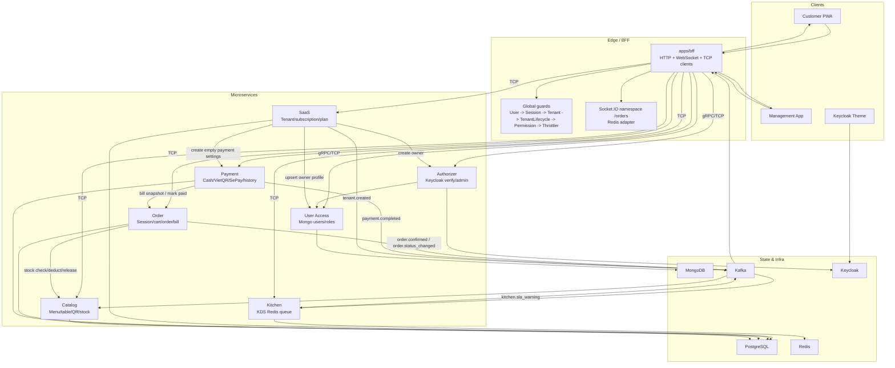

## App Ownership

| App                   | Role thực tế                                                                | Nên đọc khi nào                                |
| --------------------- | --------------------------------------------------------------------------- | ---------------------------------------------- |
| `apps/bff`            | API gateway, guard chain, HTTP controllers, WebSocket gateway, TCP clients. | Đọc đầu tiên trong backend.                    |
| `apps/catalog`        | Area, table, QR token, category, menu item, public menu, stock.             | Đọc trước Order submit/confirm.                |
| `apps/order`          | Session, cart, order, bill, service request, table transfer, outbox.        | Business core; đọc sau khi nắm BFF + Catalog.  |
| `apps/kitchen`        | KDS queue trên Redis, consume `order.confirmed`, SLA, recovery.             | Đọc sau Order confirm.                         |
| `apps/payment`        | Payment record, cash, VietQR, SePay webhook, audit, payment outbox.         | Đọc sau Bill flow.                             |
| `apps/saas`           | Tenant, onboarding saga, plan, subscription, invoice, lifecycle cache.      | Đọc sau khi nắm Order/Payment và tenant guard. |
| `apps/authorizer`     | Keycloak login/verify/admin, gRPC verify token.                             | Đọc khi cần auth/RBAC.                         |
| `apps/user-access`    | User profile, staff, role, tenant user data trên MongoDB.                   | Đọc cùng Authorizer/SaaS onboarding.           |
| `apps/customer-pwa`   | Khách quét QR, vào session, xem menu, cart, order tracking, payment.        | Đọc sau customer backend flow.                 |
| `apps/management-app` | Admin/dashboard/POS/KDS/SaaS UI.                                            | Đọc sau BFF admin endpoints.                   |
| `apps/keycloak-theme` | Giao diện Keycloak.                                                         | Đọc khi cần auth UX/branding, không phải core. |

## Source Of Truth Priority

Đọc theo thứ tự ưu tiên này:

1. Current code và tests.
2. `docs/README.md`, accepted phase records, accepted specs.
3. `docs/testing/phase-5/*` nếu đang trace test coverage.
4. Guides cũ trong `docs/guides/*`.
5. README boilerplate, generated output, folder build.

Lưu ý quan trọng: `AGENTS.md` mô tả target standards của dự án. Trong code hiện tại, import alias vẫn là `@common/*` và `@einvoice/*`, chưa phải tất cả đều là `@qrtable/*`.

## Round 0: Đọc Map Trước Code

Đọc các file này để lấy context:

| File                                              | Đọc để nắm gì                                                       |
| ------------------------------------------------- | ------------------------------------------------------------------- |
| `docs/README.md`                                  | Tài liệu nào canonical, tài liệu nào chỉ là reference.              |
| `docs/implementation_plan.md`                     | Phase nào đã xong, phase nào deferred.                              |
| `docs/technical-architecture.md`                  | Microservices, database per service, Redis, Kafka, WebSocket rooms. |
| `docs/business-logic.md`                          | State machine, business rules, edge cases nghiệp vụ.                |
| `docs/architecture/permission-matrix.md`          | Role/permission trước khi đọc admin, POS, KDS.                      |
| `docs/testing/phase-5/traceability-matrix.md`     | Mapping requirement -> unit/integration/e2e tests.                  |
| `docs/testing/phase-5/phase-5-handoff.md`         | Trạng thái handoff test/refactor mới nhất.                          |
| `docs/guides/react-nextjs-qrtable.md`             | Nên đọc kèm khi trace frontend React/Next.js.                       |
| `docs/guides/kafka-qrtable.md`                    | Đọc khi cần mở rộng event-driven flow.                              |
| `docs/guides/redis-qrtable.md`                    | Đọc khi cần nắm Redis key/session/cart/KDS.                         |
| `docs/guides/websocket-socketio-qrtable.md`       | Đọc khi trace realtime.                                             |
| `docs/guides/keycloak-qrtable.md`                 | Đọc khi trace auth/Keycloak.                                        |
| `docs/guides/sepay-configuration-guide-phase3.md` | Đọc khi trace VietQR/SePay setup.                                   |
| `docs/guides/frontend-domain-display.md`          | Map enum wire → nhãn UI; cấu trúc `vi-domain-labels`, SaaS badges.  |

Sau đó đọc phase records theo thứ tự:

1. `docs/phases/phase-0-foundation.md`
2. `docs/phases/phase-1-catalog.md`
3. `docs/phases/phase-2a-order-kafka.md`
4. `docs/phases/phase-2b-kitchen-websocket.md`
5. `docs/phases/phase-3-payment.md`
6. `docs/phases/phase-4a-saga-hardening.md`
7. `docs/phases/phase-4b-saas-onboarding.md`
8. `docs/phases/phase-5-7-finalization.md`

## Round 1: Nx Workspace Và Aliases

Đọc:

- `package.json`
- `nx.json`
- `tsconfig.base.json`
- `apps/*/project.json`
- `libs/*/project.json`

Lệnh nên chạy:

```bash
npx nx show projects
npx nx graph
```

Cần rút ra:

- Project nào là deployable app, project nào là library.
- `package.json` script nào chạy domain slice nào: `dev:bff-order`, `dev:bff-payment`, `dev:bff-auth`.
- `tsconfig.base.json` map alias nào vào folder nào.
- Backend code hiện tại import `@common/constants/*`, `@common/interfaces/*`, `@common/entities/*`, ...
- Frontend/shared code hiện tại import `@einvoice/types`, `@einvoice/frontend-ui`, `@einvoice/frontend-hooks`, ...

**Lý thuyết cần nắm:**

Nx monorepo giúp gom nhiều deployable app và shared libs trong một repo. Điểm quan trọng không phải "tất cả dùng chung code", mà là **kiểm soát dependency boundary**: app chỉ nên phụ thuộc vào contract/shared libs, không import trực tiếp internal module của service khác.

**Cách nói trong phỏng vấn:**

> QRTable dùng Nx để quản lý nhiều NestJS services và frontend apps trong cùng repo. Lợi ích là shared contracts, consistent tooling và affected tests/builds. Tuy nhiên service boundary vẫn phải được giữ bằng TCP/Kafka contracts, không import repository/entity của service khác để làm shortcut nghiệp vụ.

## Round 2: Backend Boundary Trước

Đọc BFF trước khi đọc service internals.

### BFF Entry Points

Đọc:

- `apps/bff/src/main.ts`
- `apps/bff/src/app/app.module.ts`
- `apps/bff/src/app/modules/*/controllers/*.ts`
- `apps/bff/src/app/modules/realtime/gateways/order-events.gateway.ts`
- `apps/bff/src/app/modules/realtime/services/realtime-auth.service.ts`
- `apps/bff/src/app/modules/realtime/services/realtime-events.service.ts`
- `apps/bff/src/app/modules/realtime/services/realtime-kafka-bridge.service.ts`

Cần nắm:

- `main.ts` bật `rawBody`, Redis Socket.IO adapter, global prefix, `ValidationPipe`, CORS, Swagger.
- `app.module.ts` đang register global middleware, interceptor và guard chain.
- BFF controller map HTTP route sang `TCP_REQUEST_MESSAGE`.
- BFF được phép orchestration ở boundary, nhưng không sở hữu domain state.

### Middleware, Guards, Interceptor

| Order | File                                                         | Vai trò                                                                                     |
| ----- | ------------------------------------------------------------ | ------------------------------------------------------------------------------------------- |
| 1     | `libs/middlewares/src/lib/logger.middleware.ts`              | Request logging.                                                                            |
| 2     | `libs/middlewares/src/lib/tenant.middleware.ts`              | Inject/resolve tenant context từ request.                                                   |
| 3     | `libs/guards/src/lib/user.guard.ts`                          | Verify JWT qua Authorizer, cache token key dạng `user-token:{sha256}`.                      |
| 4     | `libs/guards/src/lib/session.guard.ts`                       | Quản lý customer session header/cache và skip metadata.                                     |
| 5     | `libs/guards/src/lib/tenant.guard.ts`                        | Resolve tenant từ middleware/header/claims/session; super admin có bypass đúng context.     |
| 6     | `apps/bff/src/app/guards/customer-tenant-lifecycle.guard.ts` | Chặn customer/menu flow khi tenant suspended/closed; đọc đúng path này, không dùng path cũ. |
| 7     | `libs/guards/src/lib/permission.guard.ts`                    | Check `@Permissions`.                                                                       |
| 8     | `@nestjs/throttler` `ThrottlerGuard`                         | Rate limiting.                                                                              |
| 9     | `libs/interceptors/src/lib/exception.interceptor.ts`         | Normalize exception/response shape.                                                         |

**Lý thuyết cần nắm:**

Guard chain là nơi xử lý cross-cutting concerns: authentication, session, tenant isolation, authorization, rate limit. Controller không nên tự parse token, tự check role, hoặc tự resolve tenant bằng business logic.

**Cách nói trong phỏng vấn:**

> Em đặt BFF làm boundary để tập trung HTTP concerns: validation, auth, tenant context, permission và response normalization. Domain service phía sau nhận request đã có context rõ ràng qua TCP payload, nên service không cần biết Express request/response.

## Round 3: Đọc Theo Domain Flow

### Flow 1: QR, Tenant, Table Session, Public Menu

Đọc theo thứ tự:

| Layer       | Files                                                                             |
| ----------- | --------------------------------------------------------------------------------- |
| Customer UI | `apps/customer-pwa/src/pages/landing-page.tsx`                                    |
| Customer UI | `apps/customer-pwa/src/features/landing/services/session.service.ts`              |
| Customer UI | `apps/customer-pwa/src/features/landing/services/tenant.service.ts`               |
| Customer UI | `apps/customer-pwa/src/features/session/context/session-provider.tsx`             |
| Customer UI | `apps/customer-pwa/src/features/menu/hooks/use-menu-query.ts`                     |
| Customer UI | `apps/customer-pwa/src/lib/api-client.ts`                                         |
| BFF         | `apps/bff/src/app/modules/catalog/controllers/menu.controller.ts`                 |
| BFF         | `apps/bff/src/app/modules/order/controllers/customer-session.controller.ts`       |
| Catalog     | `apps/catalog/src/app/modules/table/controllers/table.controller.ts`              |
| Catalog     | `apps/catalog/src/app/modules/table/services/table.service.ts`                    |
| Catalog     | `apps/catalog/src/app/modules/menu/services/menu.service.ts`                      |
| Order       | `apps/order/src/app/modules/order/services/order.service.ts` method `joinSession` |
| Order       | `apps/order/src/app/modules/order/services/session.service.ts`                    |

Flow thực tế:

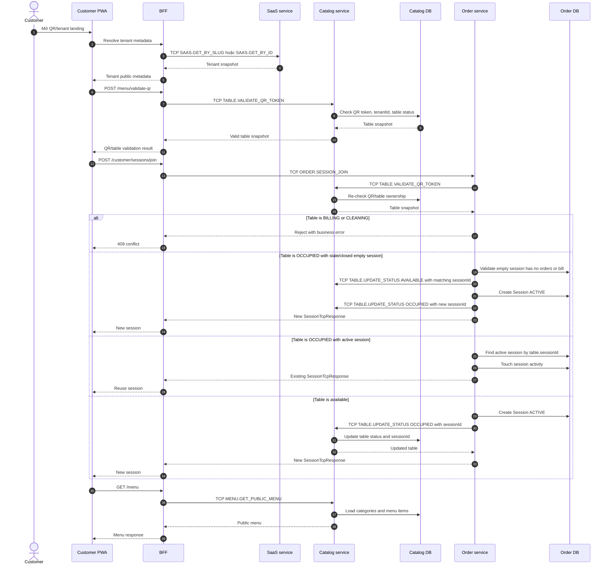

1. Customer mở QR/tenant landing trong PWA.
2. PWA resolve tenant và validate QR qua BFF.
3. BFF `POST /customer/sessions/join` gửi `TCP_REQUEST_MESSAGE.ORDER.SESSION_JOIN`.
4. Order gọi Catalog `TABLE.VALIDATE_QR_TOKEN` để xác thực table/QR.
5. Nếu table đang `BILLING` hoặc `CLEANING`, Order reject join.
6. Nếu table đang `OCCUPIED` nhưng session rỗng đã stale/closed, Order release binding cũ theo `sessionId`, rồi tạo session mới.
7. Nếu table đang `OCCUPIED` với active session hợp lệ, Order lấy session hiện có và touch activity.
8. Nếu table available, Order tạo `Session`, sau đó gọi Catalog update table status thành `OCCUPIED`.
9. PWA lưu session context, menu được fetch qua `GET /menu`.

**Lý thuyết cần nắm:**

- QR token không phải auth token của user; nó là entry token cho một table trong tenant.
- Session là "bàn ăn hiện tại" của customer, không phải login account.
- Table status thuộc Catalog, nhưng session thuộc Order; vì vậy join session cần sync call giữa Order và Catalog.
- Tenant lifecycle guard dùng để chặn customer access nếu nhà hàng bị suspended/closed.

**Cách nói trong phỏng vấn:**

> Customer không login theo user account. Họ quét QR để vào một table session. QR/table ownership nằm ở Catalog, còn dining session nằm ở Order. Khi join, Order validate QR qua Catalog, tạo hoặc reuse session, rồi update table status. Cách này tách rõ inventory/table state với order/session state.

### Flow 2: Cart, Submit Order, Idempotency, Quota

Đọc theo thứ tự:

| Layer       | Files                                                                                   |
| ----------- | --------------------------------------------------------------------------------------- |
| Customer UI | `apps/customer-pwa/src/features/order/services/order.service.ts`                        |
| Customer UI | `apps/customer-pwa/src/features/order/hooks/use-order-query.ts`                         |
| Customer UI | `apps/customer-pwa/src/lib/idempotency.ts`                                              |
| BFF         | `apps/bff/src/app/modules/order/controllers/customer-order.controller.ts`               |
| Order       | `apps/order/src/app/modules/order/controllers/order.controller.ts`                      |
| Order       | `apps/order/src/app/modules/order/services/cart.service.ts`                             |
| Order       | `apps/order/src/app/modules/order/services/order-submit.service.ts`                     |
| Order       | `apps/order/src/app/modules/order/services/order-quota.service.ts`                      |
| Order       | `apps/order/src/app/modules/order/services/bill.service.ts`                             |
| Order       | `apps/order/src/app/modules/order/utils/recalculate-bill-totals.ts`                     |
| Tests       | `apps/order/src/app/modules/order/tests/order-submit-cart.integration.spec.ts`          |
| Tests       | `apps/order/src/app/modules/order/tests/order-payment-finalization.integration.spec.ts` |

Flow thực tế:

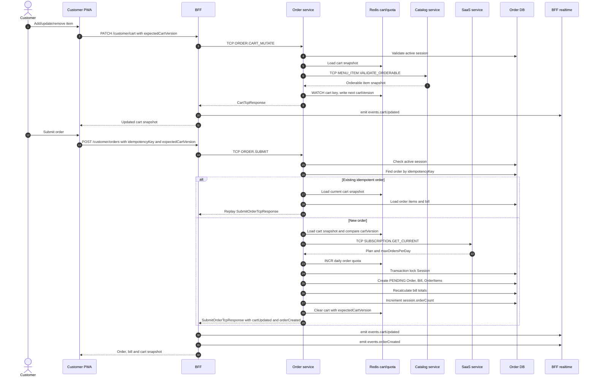

1. Customer mutate cart qua `GET/PATCH/DELETE /customer/cart`.
2. Cart service lưu snapshot theo tenant/session và cart version.
3. Submit order qua `POST /customer/orders` kèm `idempotencyKey` và `expectedCartVersion`.
4. `OrderSubmitService` check active session, idempotency replay, cart version conflict, empty cart.
5. Nếu là order mới, service reserve daily order quota từ SaaS.
6. Transaction lock session, tạo `Order` status `PENDING`, tạo/reuse open `Bill`, tạo `OrderItem`, recalculate bill, tăng `session.orderCount`, clear cart.
7. Response trả về order, bill, cart snapshot và events để BFF/frontend update.

**Lý thuyết cần nắm:**

- Idempotency key giải quyết double submit/retry: cùng một action gửi lại không tạo duplicate order.
- `expectedCartVersion` là optimistic concurrency control: nếu client submit trên cart cũ, server reject conflict.
- Bill thuộc Order service vì bill tổng hợp order/session, còn Payment service chỉ quản lý payment record.
- Quota reservation phải rollback nếu transaction fail để không trừ oan quota.

**Cách nói trong phỏng vấn:**

> Submit order là write operation có rủi ro double click và retry, nên em dùng idempotency key kết hợp cart version. Cart version bảo vệ user khỏi submit state cũ, còn idempotency key bảo vệ backend khỏi duplicate order. Order và bill được tạo trong transaction; nếu quota đã reserve mà transaction fail thì rollback quota.

### Flow 3: Staff POS, Confirm Order, Stock, Order State Machine

Đọc theo thứ tự:

| Layer         | Files                                                                                |
| ------------- | ------------------------------------------------------------------------------------ |
| Management UI | `apps/management-app/src/app/(pos)/pos/page.tsx`                                     |
| Management UI | `apps/management-app/src/components/pos/*`                                           |
| Management UI | `apps/management-app/src/features/order/services/order.service.ts`                   |
| Management UI | `apps/management-app/src/features/order/hooks/use-order-query.ts`                    |
| BFF           | `apps/bff/src/app/modules/order/controllers/staff-order.controller.ts`               |
| Order         | `apps/order/src/app/modules/order/services/order.service.ts` facade                  |
| Order         | `apps/order/src/app/modules/order/services/session.service.ts`                       |
| Order         | `apps/order/src/app/modules/order/services/order-state-transition.service.ts`        |
| Order         | `apps/order/src/app/modules/order/services/order-kds-event.service.ts`               |
| Order         | `apps/order/src/app/modules/order/services/outbox-publisher.service.ts`              |
| Catalog       | `apps/catalog/src/app/modules/menu-item/services/menu-item.service.ts`               |
| Catalog       | `apps/catalog/src/app/modules/menu-item/repositories/menu-item.repository.ts`        |
| Tests         | `apps/order/src/app/modules/order/tests/order-state-transition.service.spec.ts`      |
| Tests         | `apps/order/src/app/modules/order/tests/session.service.spec.ts`                     |
| Tests         | `apps/order/src/app/modules/order/tests/order-stock-concurrency.integration.spec.ts` |

Flow thực tế:

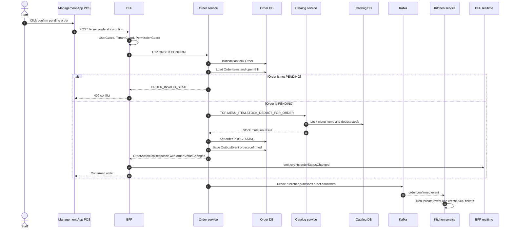

1. Staff xem pending/live orders trong POS.
2. Staff confirm order qua `POST /admin/orders/:id/confirm`.
3. BFF gửi `TCP_REQUEST_MESSAGE.ORDER.CONFIRM`.
4. `OrderStateTransitionService.confirmOrder` lock order, check status `PENDING`.
5. Order gọi Catalog `MENU_ITEM.STOCK_DEDUCT_FOR_ORDER` với idempotency key `confirm-order:{orderId}`.
6. Nếu stock deduct thành công, Order chuyển order sang `PROCESSING`, tạo outbox event `order.confirmed`.
7. Outbox publisher publish Kafka, Kitchen consume để tạo KDS tickets.
8. Cancel processing sẽ release stock qua Catalog và publish `order.status_changed`.

**Lý thuyết cần nắm:**

- Stock thuộc Catalog, không thuộc Order, vì Catalog sở hữu menu item inventory.
- Order state machine giữ workflow: `PENDING -> PROCESSING -> READY -> SERVED` hoặc cancel paths.
- Confirm order cần sync stock mutation vì user cần biết ngay stock còn hay hết.
- Kafka outbox dùng để publish side-effect sau khi DB transaction commit, giảm rủi ro DB đã commit nhưng event bị mất.

**Cách nói trong phỏng vấn:**

> Em không trừ stock lúc customer submit, vì order vẫn có thể bị staff reject. Stock được trừ khi staff confirm order. Catalog là source of truth của stock, Order chỉ gọi TCP stock deduct với idempotency key. Sau khi order sang PROCESSING, Order ghi outbox `order.confirmed` để Kitchen nhận async.

### Flow 4: KDS Queue, Ticket Lifecycle, Recovery, SLA

Đọc theo thứ tự:

| Layer         | Files                                                                                   |
| ------------- | --------------------------------------------------------------------------------------- |
| Management UI | `apps/management-app/src/app/(kds)/kds/kitchen/page.tsx`                                |
| Management UI | `apps/management-app/src/app/(kds)/kds/bar/page.tsx`                                    |
| Management UI | `apps/management-app/src/features/kds/services/kds.service.ts`                          |
| Management UI | `apps/management-app/src/features/kds/hooks/use-kds-queue.ts`                           |
| Management UI | `apps/management-app/src/features/kds/hooks/use-kds-realtime.ts`                        |
| BFF           | `apps/bff/src/app/modules/kitchen/controllers/kitchen.controller.ts`                    |
| BFF           | `apps/bff/src/app/modules/kitchen/services/kds-station-access.service.ts`               |
| Kitchen       | `apps/kitchen/src/app/modules/kitchen/controllers/kitchen.controller.ts`                |
| Kitchen       | `apps/kitchen/src/app/modules/kitchen/services/order-confirmed.consumer.ts`             |
| Kitchen       | `apps/kitchen/src/app/modules/kitchen/services/kds-ticket.service.ts`                   |
| Kitchen       | `apps/kitchen/src/app/modules/kitchen/services/kitchen-recovery.service.ts`             |
| Kitchen       | `apps/kitchen/src/app/modules/kitchen/services/kitchen-sla.worker.ts`                   |
| Kitchen       | `apps/kitchen/src/app/modules/kitchen/repositories/kds-redis.repository.ts` facade      |
| Kitchen       | `apps/kitchen/src/app/modules/kitchen/repositories/kds-ticket-store.repository.ts`      |
| Kitchen       | `apps/kitchen/src/app/modules/kitchen/repositories/kds-sla-store.repository.ts`         |
| Kitchen       | `apps/kitchen/src/app/modules/kitchen/repositories/kds-recovery-store.repository.ts`    |
| Kitchen       | `apps/kitchen/src/app/modules/kitchen/utils/kds-keys.ts`                                |
| Kitchen       | `apps/kitchen/src/app/modules/kitchen/utils/kds-score.ts`                               |
| Tests         | `apps/kitchen/src/app/modules/kitchen/tests/order-confirmed-dedupe.integration.spec.ts` |

Flow thực tế:

Sequence tạo KDS ticket từ `order.confirmed`:

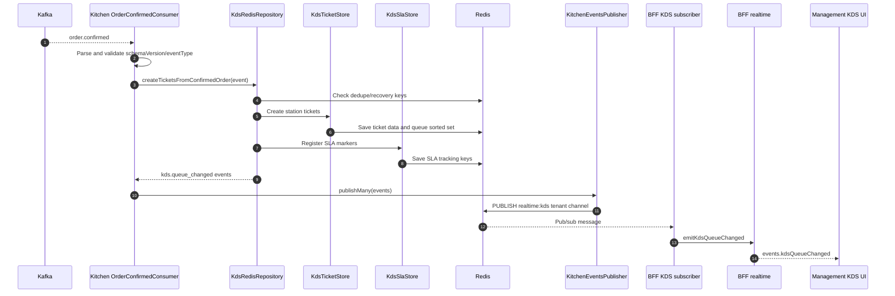

Sequence staff thao tác ticket:

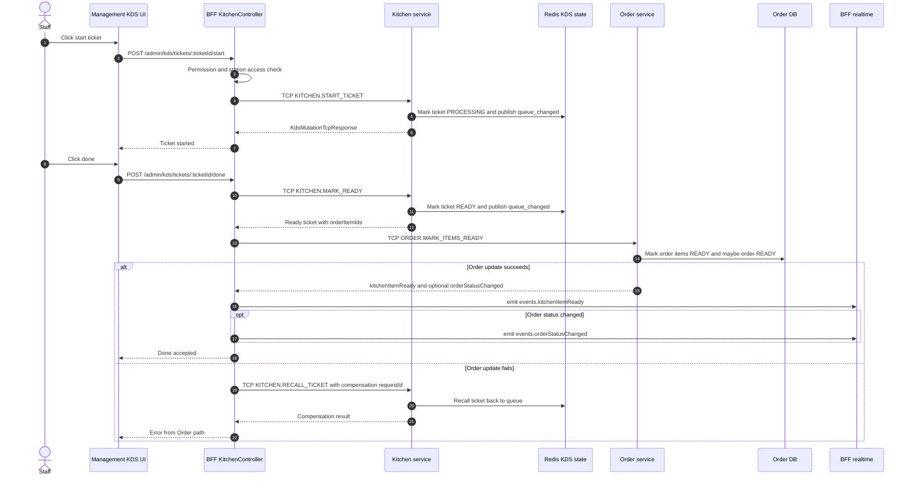

1. Kitchen consume Kafka `order.confirmed`.
2. `order-confirmed.consumer.ts` dedupe event và tạo ticket theo station.
3. `KdsTicketService` thao tác queue/ticket qua Redis repository facade.
4. `kds-ticket-store.repository.ts` quản lý ticket data/queue.
5. `kds-sla-store.repository.ts` quản lý SLA markers/warnings.
6. `kds-recovery-store.repository.ts` lưu recovery/recall info.
7. Staff KDS gọi `GET /admin/kds/queue`, `start`, `done`, `recall`, `priority`.
8. Khi mark done, BFF gọi Kitchen `MARK_READY`, sau đó gọi Order `MARK_ITEMS_READY`.
9. Nếu Order update fail, BFF gọi Kitchen `RECALL_TICKET` để compensate.
10. Realtime push cập nhật KDS/staff/customer qua BFF.

**Lý thuyết cần nắm:**

- Kitchen không có database riêng; KDS queue là operational state trên Redis.
- Redis Sorted Set phù hợp cho queue vì cần score theo thời gian/priority/SLA.
- Dedupe Kafka event để consumer retry không tạo duplicate ticket.
- KDS `done` là cross-service command: Kitchen ready ticket, Order ready item. Vì không có distributed transaction, cần compensation.

**Cách nói trong phỏng vấn:**

> KDS là read/operational queue nên em dùng Redis thay vì database riêng. Kitchen consume `order.confirmed` để tạo ticket, có dedupe để chống Kafka retry. Khi bếp mark done, BFF phối hợp Kitchen và Order; nếu Order không mark items ready được, BFF recall ticket để đưa queue về state hợp lý.

### Flow 5: Bill, Payment, VietQR/SePay, Refund

Đọc theo thứ tự:

| Layer         | Files                                                                                           |
| ------------- | ----------------------------------------------------------------------------------------------- |
| Customer UI   | `apps/customer-pwa/src/features/payment/services/payment.service.ts`                            |
| Customer UI   | `apps/customer-pwa/src/pages/request-payment-page.tsx`                                          |
| Management UI | `apps/management-app/src/features/payment/services/payment.service.ts`                          |
| Management UI | `apps/management-app/src/features/payment/hooks/use-payment.ts`                                 |
| Management UI | `apps/management-app/src/features/payment/components/bill-settlement-panel.tsx`                 |
| BFF           | `apps/bff/src/app/modules/payment/controllers/payment.controller.ts`                            |
| BFF           | `apps/bff/src/app/modules/order/controllers/customer-order.controller.ts` customer bill APIs    |
| Order         | `apps/order/src/app/modules/order/services/bill.service.ts`                                     |
| Order         | `apps/order/src/app/modules/order/services/payment-events-consumer.service.ts`                  |
| Payment       | `apps/payment/src/app/modules/payment/services/payment.service.ts` facade                       |
| Payment       | `apps/payment/src/app/modules/payment/services/payment-settlement.service.ts`                   |
| Payment       | `apps/payment/src/app/modules/payment/services/sepay-webhook.service.ts`                        |
| Payment       | `apps/payment/src/app/modules/payment/services/payment.service.ts`                              |
| Payment       | `apps/payment/src/app/modules/payment/services/payment-order.gateway.ts`                        |
| Payment       | `apps/payment/src/app/modules/payment/services/payment-reference.service.ts`                    |
| Payment       | `apps/payment/src/app/modules/payment/services/payment-outbox-publisher.service.ts`             |
| Tests         | `apps/payment/src/app/modules/payment/tests/payment-completed-order-bridge.integration.spec.ts` |

Flow cash:

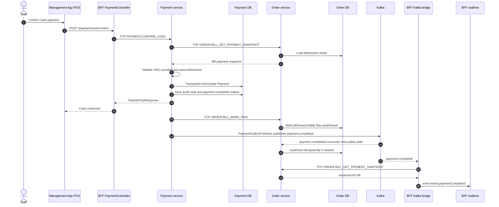

1. Staff/customer yêu cầu bill, Order chuyển bill sang `PENDING_PAYMENT`.
2. Staff confirm cash qua BFF `POST /payment/cash/confirm`.
3. Payment lấy bill payment snapshot từ Order.
4. Payment validate VND rounding snapshot và amount received.
5. Payment tạo/lock payment record, audit, outbox `payment.completed`.
6. Payment gọi Order `BILL_MARK_PAID` để close bill/session/table flow.
7. Order vẫn có `PaymentEventsConsumerService` consume `payment.completed` như async finalization/retry-safety path, nên `markPaid` phải đọc theo hướng idempotent.

Flow VietQR/SePay:

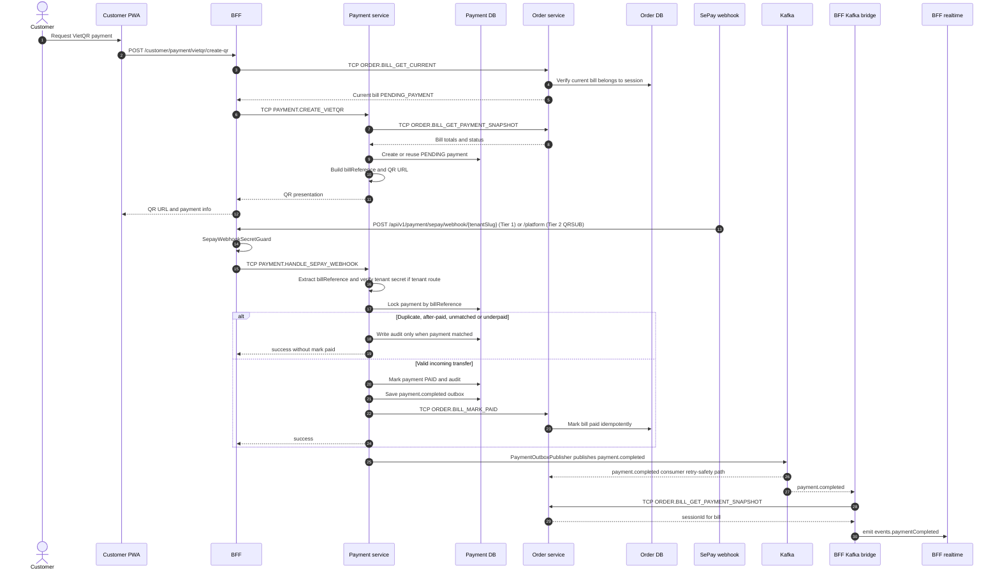

1. UI gọi `POST /payment/vietqr/create-qr` hoặc customer route từ BFF.
2. Payment tạo pending payment, generate bill reference và QR presentation.
3. SePay webhook vào BFF: Tier 1 `POST /api/v1/payment/sepay/webhook/:tenantSlug`, Tier 2 `.../webhook/platform`, hoặc legacy HMAC `.../payment/sepay/webhook` (xem [sepay-configuration-guide-phase3.md](sepay-configuration-guide-phase3.md) §0).
4. `SepayWebhookService` verify tenant webhook secret nếu dùng tenant route, extract bill reference, lock payment, check duplicate/underpaid.
5. Nếu valid, mark payment `PAID`, audit, outbox `payment.completed`, gọi Order mark bill paid.
6. Order consume/mark paid idempotently nếu event đi qua async path.
7. BFF Kafka bridge consume `payment.completed`, lấy session snapshot từ Order và emit realtime.

**Lý thuyết cần nắm:**

- Order là source of truth của bill/session; Payment là source of truth của payment ledger/audit.
- Payment không tự tính lại bill total; nó lấy snapshot từ Order và validate rounding snapshot.
- Webhook phải idempotent vì nhà cung cấp có thể retry.
- Audit payment giúp truy vết external money movement.

**Cách nói trong phỏng vấn:**

> Em tách bill và payment: bill nằm ở Order vì nó tổng hợp order/session, còn Payment nằm ở Payment service vì liên quan external money movement và audit. Payment không tính lại bill; nó xin snapshot từ Order, validate VND rounding, sau đó mark paid và thông báo lại Order. Webhook được xử lý idempotent để chịu được retry từ SePay.

### Flow 6: SaaS Onboarding, Subscription, Tenant Lifecycle

Đọc theo thứ tự:

| Layer         | Files                                                                           |
| ------------- | ------------------------------------------------------------------------------- |
| Management UI | `apps/management-app/src/features/saas/api.ts`                                  |
| Management UI | `apps/management-app/src/features/saas/README.md` (layering: labels vs badges)  |
| Management UI | `apps/management-app/src/features/saas/components/badges/*`                     |
| Management UI | `libs/shared/constants/src/lib/vi-domain-labels.ts`                             |
| Management UI | `apps/management-app/src/features/saas/admin-tenants/onboard-tenant-dialog.tsx` |
| Management UI | `apps/management-app/src/features/saas/subscription/*`                          |
| Management UI | `apps/management-app/src/features/saas/payment-settings/*`                      |
| Customer PWA  | `apps/customer-pwa` pages using `*Vi()` from `@einvoice/shared-constants`       |
| BFF           | `apps/bff/src/app/modules/saas/controllers/*.ts`                                |
| BFF           | `apps/bff/src/app/modules/saas/saas-bff-routes.ts`                              |
| SaaS          | `apps/saas/src/controllers/saas.controller.ts`                                  |
| SaaS          | `apps/saas/src/services/onboarding-saga.service.ts`                             |
| SaaS          | `apps/saas/src/services/tenant-admin.service.ts`                                |
| SaaS          | `apps/saas/src/services/tenant-lifecycle.service.ts`                            |
| SaaS          | `apps/saas/src/services/tenant-status-cache.service.ts`                         |
| SaaS          | `apps/saas/src/services/tenant-suspend-cron.service.ts`                         |
| SaaS          | `apps/saas/src/services/subscription.service.ts`                                |
| SaaS          | `apps/saas/src/services/subscription-invoice.service.ts`                        |
| SaaS          | `apps/saas/src/services/subscription-dashboard.service.ts`                      |
| SaaS          | `apps/saas/src/services/pricing-plan-admin.service.ts`                          |
| SaaS          | `apps/saas/src/services/saas-outbox-publisher.service.ts`                       |
| Shared        | `libs/constants/src/lib/saas.constants.ts`                                      |
| Shared        | `libs/entities/src/lib/tenant.entity.ts`                                        |
| Shared        | `libs/entities/src/lib/subscription.entity.ts`                                  |
| Shared        | `libs/entities/src/lib/subscription-invoice.entity.ts`                          |
| Shared        | `libs/entities/src/lib/pricing-plan.entity.ts`                                  |

Lưu ý path: `apps/saas` hiện đang đặt file trực tiếp dưới `src/controllers`, `src/services`, `src/repositories`, không phải `src/app/modules`.

Flow onboarding:

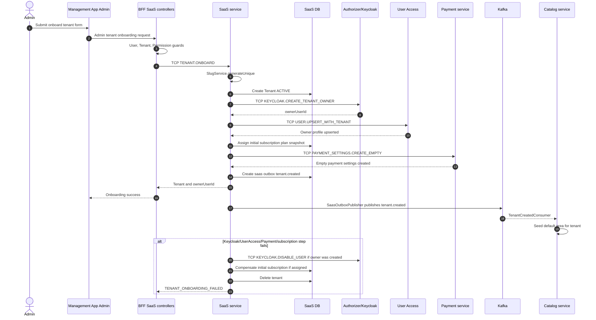

1. Admin onboard tenant từ Management App.
2. BFF SaaS controller gửi `TCP_REQUEST_MESSAGE.TENANT.ONBOARD`.
3. `OnboardingSagaService` tạo tenant, tạo owner qua Authorizer/Keycloak, upsert owner profile qua User Access, tạo empty payment settings qua Payment, assign plan/subscription, ghi tenant created outbox.
4. Nếu một bước quan trọng fail, saga compensate tenant/subscription đã tạo.

Flow lifecycle:

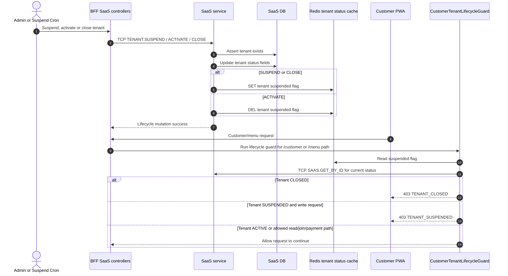

1. Tenant có status active/suspended/closed.
2. `TenantLifecycleService` suspend/activate/close tenant.
3. `TenantStatusCacheService` ghi cache/flag tenant status vào Redis.
4. `CustomerTenantLifecycleGuard` trong BFF đọc status để chặn customer/menu flow khi cần.
5. `TenantSuspendCronService` suspend tenant khi subscription expired beyond grace.

**Lý thuyết cần nắm:**

- SaaS service quản lý platform-level tenant lifecycle, khác với restaurant operation flow.
- Onboarding là saga vì nó chạm nhiều external/internal service: Keycloak, User Access, Payment, subscription.
- Subscription nên lưu plan snapshot để hóa đơn/lịch sử không thay đổi khi plan hiện tại bị edit.
- Tenant lifecycle là authorization/business gate, không chỉ là UI status.

**Cách nói trong phỏng vấn:**

> Onboarding tenant là distributed workflow nên em xử lý theo saga, không có distributed transaction. SaaS tạo tenant, owner, profile, payment settings và subscription; nếu lỗi thì compensate những phần đã tạo. Tenant status được cache để BFF guard có thể chặn nhanh customer flow khi tenant suspended hoặc closed.

### Flow 7: Auth, Keycloak, User Access, RBAC

Đọc theo thứ tự:

| Layer          | Files                                                                          |
| -------------- | ------------------------------------------------------------------------------ |
| Management App | `apps/management-app/src/auth.ts`                                              |
| Management App | `apps/management-app/src/middleware.ts`                                        |
| Management App | `apps/management-app/src/lib/auth/*`                                           |
| BFF            | `libs/guards/src/lib/user.guard.ts`                                            |
| BFF            | `libs/guards/src/lib/permission.guard.ts`                                      |
| BFF            | `libs/guards/src/lib/tenant.guard.ts`                                          |
| Authorizer     | `apps/authorizer/src/app/authorizer/controllers/authorizer-grpc.controller.ts` |
| Authorizer     | `apps/authorizer/src/app/authorizer/services/authorizer.service.ts`            |
| Authorizer     | `apps/authorizer/src/app/keycloak/services/keycloak-admin.service.ts`          |
| User Access    | `apps/user-access/src/app/modules/user/services/user.service.ts`               |
| User Access    | `apps/user-access/src/app/modules/user/services/tenant-user.service.ts`        |
| User Access    | `apps/user-access/src/app/modules/user/services/staff-quota.enforcer.ts`       |
| Shared         | `libs/constants/src/lib/enum/role.enum.ts`                                     |
| Docs           | `docs/architecture/permission-matrix.md`                                       |

Flow thực tế:

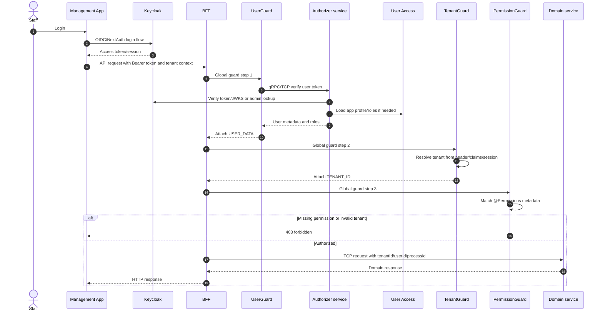

1. Staff/owner/admin login qua Keycloak/NextAuth integration.
2. Management App gọi BFF với bearer token.
3. `UserGuard` verify token qua Authorizer, cache result.
4. `TenantGuard` resolve tenant context từ request/claims/session.
5. `PermissionGuard` check permission decorator trên route.
6. Service nhận tenant/user context qua TCP payload, không đọc Express request.

**Lý thuyết cần nắm:**

- Keycloak là identity provider; User Access giữ app-level profile/role/staff metadata.
- Authentication trả lời "bạn là ai"; authorization/permission trả lời "bạn được làm gì".
- Tenant isolation phải được resolve trước domain service để mọi query/mutation có tenant context.

**Cách nói trong phỏng vấn:**

> Em tách identity và app authorization. Keycloak phụ trách login/token, Authorizer verify token, User Access giữ profile/role theo tenant. BFF guard chain gắn user và tenant context trước khi route gọi domain service, nên service không phụ thuộc HTTP layer.

### Flow 8: Realtime Và Client Cache

Đọc theo thứ tự:

| Layer       | Files                                                                         |
| ----------- | ----------------------------------------------------------------------------- |
| BFF         | `apps/bff/src/app/modules/realtime/gateways/order-events.gateway.ts`          |
| BFF         | `apps/bff/src/app/modules/realtime/services/realtime-auth.service.ts`         |
| BFF         | `apps/bff/src/app/modules/realtime/services/realtime-events.service.ts`       |
| BFF         | `apps/bff/src/app/modules/realtime/services/realtime-kafka-bridge.service.ts` |
| BFF         | `apps/bff/src/app/modules/realtime/adapters/redis-io.adapter.ts`              |
| Shared      | `libs/constants/src/lib/ws-room.constants.ts`                                 |
| Customer UI | `apps/customer-pwa/src/features/order/hooks/use-customer-order-realtime.ts`   |
| Customer UI | `apps/customer-pwa/src/components/realtime/realtime-status-pill.tsx`          |
| Staff UI    | `apps/management-app/src/features/order/hooks/use-staff-order-realtime.ts`    |
| KDS UI      | `apps/management-app/src/features/kds/hooks/use-kds-realtime.ts`              |
| Tests       | `apps/bff/src/app/modules/realtime/tests/architecture-contracts.spec.ts`      |

Flow thực tế:

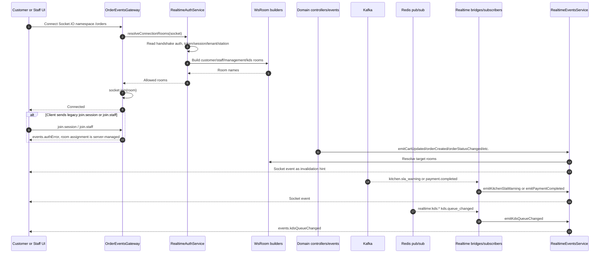

1. Client connect Socket.IO namespace `/orders`.
2. `RealtimeAuthService` resolve rooms từ token/session/tenant/station.
3. Room assignment là server-managed; legacy `join.session`/`join.staff` bị reject với message hướng dẫn.
4. Domain event từ Order/Payment/Kitchen được BFF emit vào rooms tương ứng.
5. Frontend nhận event để invalidate/refetch TanStack Query hoặc update UI nhẹ.

**Lý thuyết cần nắm:**

- WebSocket payload không nên là source of truth cho business state.
- Source of truth vẫn là HTTP/TCP query về service owner.
- Redis Socket.IO adapter giúp scale BFF instance mà vẫn broadcast đúng room.
- Room naming phải dùng `WsRoom`, không hardcode string local.

**Cách nói trong phỏng vấn:**

> Realtime trong QRTable chủ yếu là invalidation hint. Khi có order/payment/KDS event, BFF emit qua Socket.IO để UI refetch đúng query. Em không đưa toàn bộ state consistency vào WebSocket payload, vì source of truth vẫn nằm ở domain service và database/Redis owner.

## Round 4: Shared Libs Và Contracts

Đọc shared libs sau khi đã nắm flow, vì lúc đó bạn mới hiểu contract nào được dùng ở đâu.

| Lib path                      | Current role                                                                            |
| ----------------------------- | --------------------------------------------------------------------------------------- |
| `libs/configuration`          | Config modules, TCP service tokens, Redis/throttler config.                             |
| `libs/constants`              | TCP messages, role/permission enum, RedisKey, WsRoom, SaaS constants.                   |
| `libs/interfaces`             | Gateway DTOs, TCP request/response interfaces, gRPC proto/contracts.                    |
| `libs/entities`               | TypeORM entities shared by backend services.                                            |
| `libs/schemas`                | Mongo/Mongoose schemas for user-access.                                                 |
| `libs/guards`                 | BFF global guards.                                                                      |
| `libs/middlewares`            | Logger/tenant middleware.                                                               |
| `libs/interceptors`           | Exception/TCP logging interceptors.                                                     |
| `libs/decorators`             | Authorization, permission, request/process decorators.                                  |
| `libs/error-messages`         | BusinessException, ErrorCode, i18n error registry, DB error transformer.                |
| `libs/providers/redis-client` | Redis client module/service.                                                            |
| `libs/providers/cloudinary`   | Cloudinary integration.                                                                 |
| `libs/utils`                  | Shared backend utilities, request helpers, VND rounding checks.                         |
| `libs/shared/types`           | Cross-platform shared frontend/backend types exposed as `@einvoice/types`.              |
| `libs/shared/constants`       | Cross-platform constants; `vi-domain-labels.ts` maps wire enums → Vietnamese UI labels. |
| `libs/frontend/ui`            | Frontend UI components.                                                                 |
| `libs/frontend/hooks`         | Shared frontend hooks.                                                                  |
| `libs/frontend/utils`         | Shared frontend utilities.                                                              |
| `libs/shared/mock-data`       | Mock/seed data for frontend/test contexts.                                              |

**Cần đọc kỹ:**

- `libs/constants/src/lib/enum/tcp-request-message.ts`
- `libs/constants/src/lib/redis-key.constants.ts`
- `libs/constants/src/lib/ws-room.constants.ts`
- `libs/constants/src/lib/saas.constants.ts`
- `libs/interfaces/src/lib/tcp/*`
- `libs/interfaces/src/lib/gateway/*`
- `libs/entities/src/lib/*.entity.ts`
- `libs/error-messages/src/lib/error-code.enum.ts`

**Lý thuyết cần nắm:**

Shared lib không phải nơi để bỏ mọi thứ dùng chung. Nó nên chứa contracts, constants, DTO/interfaces và helpers thực sự cross-cutting. Nếu business logic chỉ thuộc một service, giữ nó trong service đó.

**Cách nói trong phỏng vấn:**

> Shared libs trong monorepo được dùng để ổn định contract giữa apps và services: TCP messages, interfaces, constants, entities/common utilities. Em tránh đưa domain business logic của một service vào shared lib, vì như vậy sẽ làm mờ service boundary.

## Round 5: Frontend Surfaces

### Customer PWA Reading Order

Đọc theo thứ tự:

1. `apps/customer-pwa/src/main.tsx`
2. `apps/customer-pwa/src/App.tsx`
3. `apps/customer-pwa/src/constants/routes.ts`
4. `apps/customer-pwa/src/lib/api-client.ts`
5. `apps/customer-pwa/src/features/session/context/session-provider.tsx`
6. `apps/customer-pwa/src/pages/landing-page.tsx`
7. `apps/customer-pwa/src/features/landing/*`
8. `apps/customer-pwa/src/pages/menu-page.tsx`
9. `apps/customer-pwa/src/features/menu/*`
10. `apps/customer-pwa/src/features/order/*`
11. `apps/customer-pwa/src/features/payment/*`
12. `apps/customer-pwa/src/features/tenant/*`

Cần nắm:

- PWA là mobile-first customer journey.
- Session context và headers quan trọng hơn global login.
- React Query hooks là nơi trace server state.
- WebSocket hooks chỉ bổ sung realtime invalidation.

### Management App Reading Order

Đọc theo thứ tự:

1. `apps/management-app/src/app/layout.tsx`
2. `apps/management-app/src/app/providers.tsx`
3. `apps/management-app/src/auth.ts`
4. `apps/management-app/src/middleware.ts`
5. `apps/management-app/src/components/layout/data/sidebar-data.ts`
6. `apps/management-app/src/lib/api/authenticated-client.ts`
7. `apps/management-app/src/app/(dashboard)/*`
8. `apps/management-app/src/app/(pos)/*`
9. `apps/management-app/src/app/(kds)/*`
10. `apps/management-app/src/app/(admin)/*`
11. `apps/management-app/src/features/menu/*`
12. `apps/management-app/src/features/tables/*`
13. `apps/management-app/src/features/order/*`
14. `apps/management-app/src/features/payment/*`
15. `apps/management-app/src/features/kds/*`
16. `apps/management-app/src/features/saas/*`
17. `apps/management-app/src/features/service-requests/*`
18. `apps/management-app/src/features/tenant/*`

Cần nắm:

- Next.js route groups chia theo workspace: admin, dashboard, POS, KDS, auth.
- `features/*/services` là nơi map HTTP API.
- `features/*/hooks` là server-state/mutation/realtime layer.
- `components/pos/*` và `components/kds/*` là UI surface cho high-frequency staff workflows.

**Lý thuyết cần nắm:**

Frontend nên tách UI state và server state. Server state nên đi qua TanStack Query/service layer; UI component không nên hardcode endpoint lung tung.

**Cách nói trong phỏng vấn:**

> Frontend QRTable đọc theo route -> feature service -> query hook -> component. Management App dùng route groups để tách admin/dashboard/POS/KDS, còn Customer PWA tập trung vào session-based flow. Em xem WebSocket hook như layer invalidation, không thay thế query source of truth.

## Round 6: Tests Và Traceability

Đọc tests theo flow, không đọc tất cả test cùng lúc.

| Flow            | Tests nên đọc                                                                                    |
| --------------- | ------------------------------------------------------------------------------------------------ |
| Cart/order      | `apps/order/src/app/modules/order/tests/order-submit-cart.integration.spec.ts`                   |
| Stock/confirm   | `apps/order/src/app/modules/order/tests/order-stock-concurrency.integration.spec.ts`             |
| Payment/bill    | `apps/payment/src/app/modules/payment/tests/payment-completed-order-bridge.integration.spec.ts`  |
| KDS dedupe      | `apps/kitchen/src/app/modules/kitchen/tests/order-confirmed-dedupe.integration.spec.ts`          |
| Realtime        | `apps/bff/src/app/modules/realtime/tests/*`                                                      |
| BFF controllers | `apps/bff/src/app/modules/**/**/*.spec.ts`                                                       |
| Frontend hooks  | `apps/customer-pwa/src/features/**/*.spec.tsx`, `apps/management-app/src/features/**/*.spec.tsx` |
| E2E             | `tests/e2e/*.spec.ts` và scripts trong `package.json`                                            |

Đọc thêm:

- `docs/testing/phase-5/README.md`
- `docs/testing/phase-5/traceability-matrix.md`
- `docs/testing/phase-5/01-traceability-inventory-plan.md`
- `docs/testing/phase-5/02-unit-contract-hardening-plan.md`
- `docs/testing/phase-5/03-integration-boundary-plan.md`
- `docs/testing/phase-5/04-playwright-e2e-plan.md`
- `docs/testing/phase-5/05-ci-gates-and-handoff-plan.md`

Lệnh tham khảo:

```bash
pnpm nx test order
pnpm nx test kitchen
pnpm nx test payment
pnpm nx test bff
pnpm e2e:demo
```

**Lý thuyết cần nắm:**

Test trong microservices nên bảo vệ boundary: state machine, idempotency, contract shape, consumer dedupe, compensation và external integration behavior. Không chỉ test happy path controller.

## File Landmarks

| Muốn hiểu                 | Đọc file                                                                       |
| ------------------------- | ------------------------------------------------------------------------------ |
| BFF bootstrap             | `apps/bff/src/main.ts`                                                         |
| BFF guard chain           | `apps/bff/src/app/app.module.ts`                                               |
| TCP message names         | `libs/constants/src/lib/enum/tcp-request-message.ts`                           |
| Redis keys                | `libs/constants/src/lib/redis-key.constants.ts` và Kitchen `utils/kds-keys.ts` |
| WebSocket rooms           | `libs/constants/src/lib/ws-room.constants.ts`                                  |
| Error model               | `libs/error-messages/src/lib/business.exception.ts`, `error-code.enum.ts`      |
| Order facade              | `apps/order/src/app/modules/order/services/order.service.ts`                   |
| Order submit              | `apps/order/src/app/modules/order/services/order-submit.service.ts`            |
| Order transitions         | `apps/order/src/app/modules/order/services/order-state-transition.service.ts`  |
| Order bill                | `apps/order/src/app/modules/order/services/bill.service.ts`                    |
| Kitchen ticket logic      | `apps/kitchen/src/app/modules/kitchen/services/kds-ticket.service.ts`          |
| Kitchen Redis facade      | `apps/kitchen/src/app/modules/kitchen/repositories/kds-redis.repository.ts`    |
| Payment settlement        | `apps/payment/src/app/modules/payment/services/payment-settlement.service.ts`  |
| SePay webhook             | `apps/payment/src/app/modules/payment/services/sepay-webhook.service.ts`       |
| SaaS onboarding           | `apps/saas/src/services/onboarding-saga.service.ts`                            |
| Tenant lifecycle          | `apps/saas/src/services/tenant-lifecycle.service.ts`                           |
| Authorizer token verify   | `apps/authorizer/src/app/authorizer/services/authorizer.service.ts`            |
| User profile/staff        | `apps/user-access/src/app/modules/user/services/user.service.ts`               |
| Customer PWA API client   | `apps/customer-pwa/src/lib/api-client.ts`                                      |
| Management API client     | `apps/management-app/src/lib/api/authenticated-client.ts`                      |
| Management sidebar/routes | `apps/management-app/src/components/layout/data/sidebar-data.ts`               |

## Command Cheat Sheet

```bash
# Workspace map
npx nx show projects
npx nx graph

# Find files fast
rg --files apps/order/src/app/modules/order
rg --files apps/kitchen/src/app/modules/kitchen
rg --files apps/management-app/src/features

# Trace routes / message patterns
rg "@(Get|Post|Patch|Delete|Controller)\\(" apps/bff/src/app/modules -n
rg "@MessagePattern" apps/order apps/kitchen apps/payment apps/catalog apps/saas -n

# Trace contracts
rg "TCP_REQUEST_MESSAGE\\.ORDER" apps libs -n
rg "WsRoom" apps libs -n
rg "RedisKey" apps libs -n

# Run focused slices
pnpm dev:bff-order
pnpm dev:bff-payment
pnpm dev:bff-auth

# Validation for docs
pnpm exec prettier --check docs/guides/codebase-reading-map.md
```

## Common Mistakes Khi Đọc Codebase

| Mistake                                                | Cách sửa                                                                        |
| ------------------------------------------------------ | ------------------------------------------------------------------------------- |
| Đọc `apps/order` trước BFF và Catalog.                 | Đọc BFF route + TCP message trước, sau đó mới vào Order internals.              |
| Tưởng Payment sở hữu Bill.                             | Order sở hữu Bill; Payment sở hữu Payment/Audit/Refund.                         |
| Tưởng Kitchen có database.                             | Kitchen hiện là Redis-backed KDS queue.                                         |
| Mở sai SaaS path theo `src/app/modules`.               | SaaS hiện ở `apps/saas/src/controllers`, `services`, `repositories`.            |
| Nghĩ WebSocket payload là state chính.                 | WebSocket là realtime/invalidation; query service owner mới là source of truth. |
| Hardcode topic/room/key khi đọc/implement.             | Đọc constants: `TCP_REQUEST_MESSAGE`, `RedisKey`, `WsRoom`, SaaS constants.     |
| Bị rối vì alias docs target và alias code khác nhau.   | Theo `tsconfig.base.json`: hiện tại là `@common/*` và `@einvoice/*`.            |
| Đọc generated folders `.next`, `dist`, `node_modules`. | Bỏ qua; đọc source trong `src`.                                                 |
| Xem BFF là nơi chứa business logic.                    | BFF chỉ coordination/boundary; domain state/rules thuộc service owner.          |
| Đọc test như phần phụ.                                 | Test là evidence tốt nhất cho behavior sau refactor.                            |

## Recommended Study Plan

### Vòng 1: Lấy Bản Đồ

1. Đọc `docs/README.md`, `technical-architecture.md`, `business-logic.md`.
2. Mở `package.json`, `tsconfig.base.json`, `nx.json`.
3. Mở `apps/bff/src/app/app.module.ts` để nắm guard chain.
4. Mở `libs/constants/src/lib/enum/tcp-request-message.ts` để nắm contracts.

Kết quả mong đợi: biết service nào nói với service nào, request đi qua đâu.

### Vòng 2: Một Customer Order End-To-End

1. Customer PWA landing/session/menu.
2. BFF customer session/order controllers.
3. Catalog QR/table/menu.
4. Order session/cart/submit/bill.
5. Staff confirm -> Catalog stock -> Order outbox -> Kitchen KDS.
6. Payment bill -> Payment service -> Order mark paid -> realtime.

Kết quả mong đợi: trace được một bàn ăn từ lúc quét QR đến lúc thanh toán.

### Vòng 3: Platform/Admin Concerns

1. Auth/Keycloak/User Access.
2. Permission matrix + BFF guards.
3. SaaS onboarding/subscription/tenant lifecycle.
4. Management App admin/dashboard/POS/KDS surfaces.
5. Phase 5 tests và traceability.

Kết quả mong đợi: giải thích được SaaS POS platform, không chỉ là app order món.

## Interview-Ready Questions

Dùng các câu hỏi này để tự kiểm tra:

1. Vì sao QRTable cần BFF thay vì frontend gọi từng microservice?
2. Tại sao Order gọi Catalog để trừ stock, không import repository của Catalog?
3. Vì sao customer submit order không trừ stock ngay?
4. Idempotency key khác optimistic concurrency cart version như thế nào?
5. Vì sao Kitchen dùng Redis queue thay vì database riêng?
6. Khi KDS mark done thành công ở Kitchen nhưng fail ở Order thì hệ thống làm gì?
7. Tại sao Bill thuộc Order còn Payment record thuộc Payment?
8. Webhook SePay cần xử lý duplicate/underpaid ra sao?
9. Tenant suspended ảnh hưởng customer flow ở layer nào?
10. WebSocket event trong QRTable nên được xem là source of truth hay invalidation hint?

Nếu trả lời được 10 câu trên bằng flow và ownership, bạn đã nắm được codebase ở mức interview-ready.

## Kết Luận

QRTable nên được đọc theo **BFF boundary -> domain flow -> service owner -> shared contract -> frontend surface -> tests**.

Bản đồ ngắn gọn:

```text
Customer/Staff UI
  -> BFF controller + guard chain
  -> TCP/gRPC contract
  -> Service owner
  -> Repository/state store
  -> Kafka/Redis/WebSocket side effects
  -> Frontend query invalidation/refetch
```

Dùng flow này để đọc mọi tính năng mới. Nếu gặp file mới sau refactor, trước tiên xác định nó thuộc boundary nào và có sở hữu state không; sau đó mới đọc chi tiết implementation.
