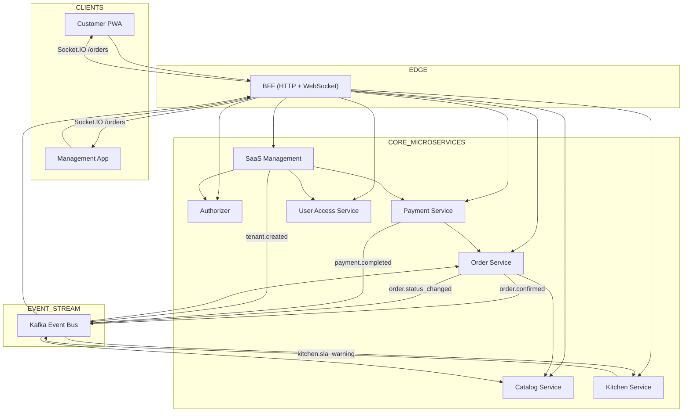
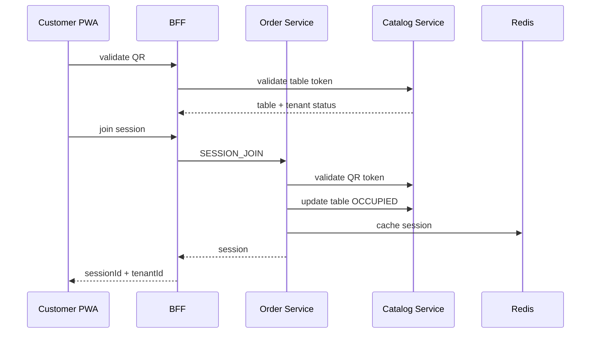
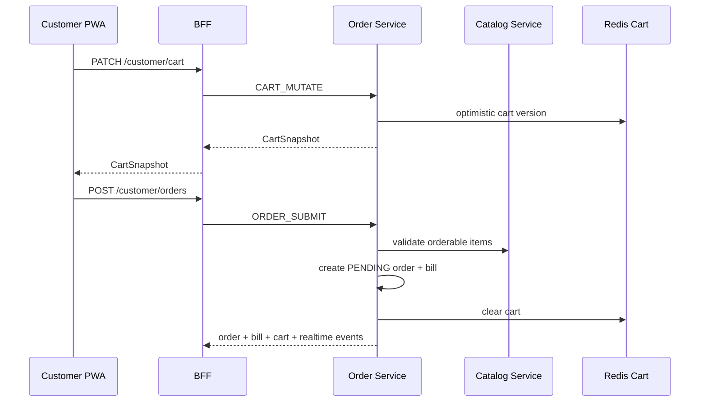
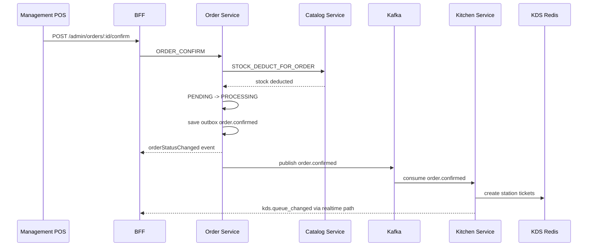
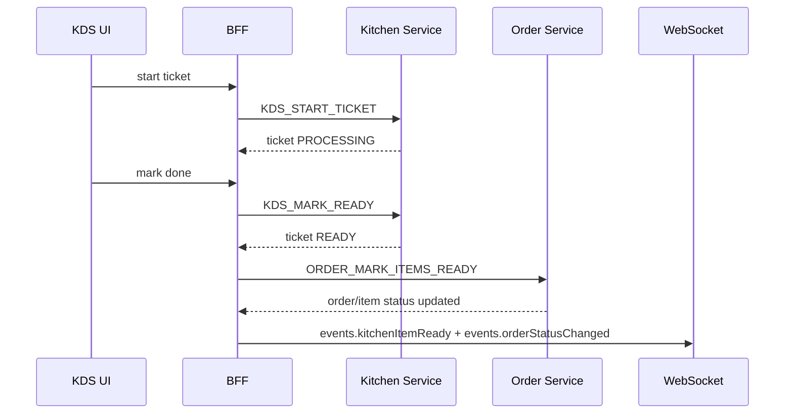
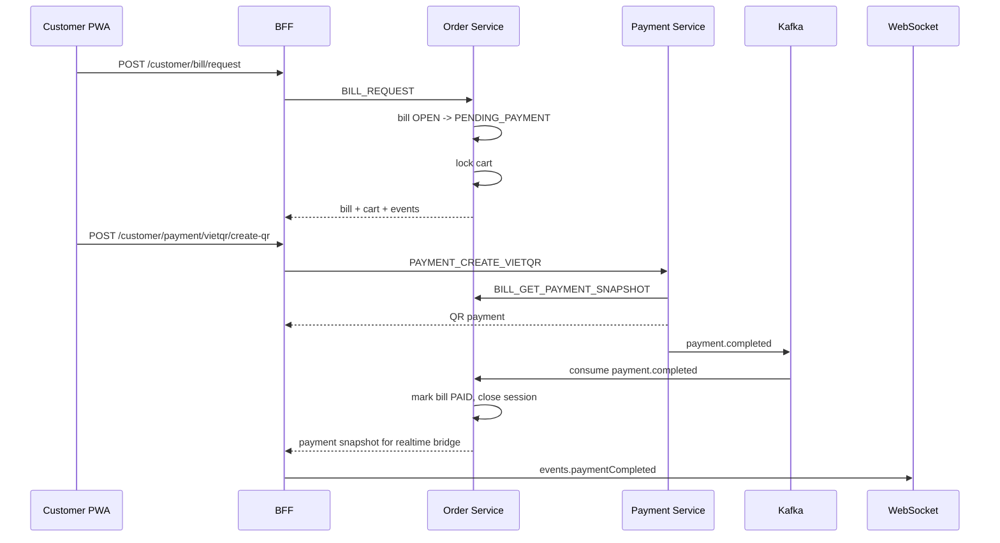
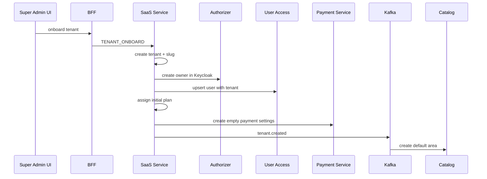

# Codebase QRTable Reading Map

> Instructions for reading QRTable codebase according to Nx monorepo architecture, NestJS microservices and two frontend apps.
>
> **Canonical Role:** Supporting guide. When there is a conflict, prioritize `docs/README.md`, phase records, accepted specs, current code/tests.
>
> Updated according to current documentation and source code: 2026-05-22.

## Target

This document helps you read the QRTable codebase systematically, in the right order, and without being overwhelmed by the number of services, libraries, documentation, and frontend surfaces.

After reading this document, you should achieve the following goals:

- Understand the overall architecture of Nx monorepo.
- Know which service owns which operation.
- Trace the flow from UI to BFF, microservices, DB, Redis, Kafka and realtime.
- Know which files to read first, which files to read later, and which files can be skipped in the first round.
- Know how to use existing documentation without getting confused between “architectural goals” and “current code state”.

## Guidelines for Reading This Codebase

You should not read by opening each folder from top to bottom. This repo is large, multi-layered and multi-phased, so that way of reading it can easily lose context.

Read along 5 axes:

1. **Domain flow**: QR/session, cart/order, KDS, payment, SaaS.
2. **Ownership**: which service is the source of truth for which state.
3. **Boundary**: HTTP/WebSocket in BFF, TCP between services, Kafka for domain events.
4. **State machine**: table, order, bill, payment, tenant lifecycle.
5. **Contract**: shared types, DTO, TCP message constants, realtime event payloads.

Questions to repeat when reading each file:

> Which layer is this file located in: request coordination, business processing, saving state, broadcasting events, or just rendering UI?

## Overall Architectural Map



## Each App's Role

| App                   | Role                                                                    | When should you read                                  |
| --------------------- | ----------------------------------------------------------------------- | ----------------------------------------------------- |
| `apps/bff`            | API gateway, auth guard, HTTP controller, WebSocket gateway, TCP client | Read first in backend                                 |
| `apps/catalog`        | Menu, category, area, table, QR token, stock                            | Read first Order                                      |
| `apps/order`          | Session, cart, order, bill, service request, table transfer, outbox     | Read the following Catalog, this is the business core |
| `apps/kitchen`        | KDS Redis queue, consume `order.confirmed`, SLA warning                 | Read later Order confirmation                         |
| `apps/payment`        | Cash, VietQR, SePay webhook, refund, payment outbox                     | Read later Bill flow                                  |
| `apps/saas`           | tenant onboarding, plan, subscription, invoice, tenant lifecycle        | Read after grasping Order/Payment                     |
| `apps/authorizer`     | Token verification, Keycloak integration                                | Read when researching auth/RBAC                       |
| `apps/user-access`    | User, role, permission seed, Mongo auth data                            | Read with Authorizer                                  |
| `apps/product`        | Legacy/template service                                                 | Skip in the first round                               |
| `apps/customer-pwa`   | QR scanning customer app                                                | Read after understanding the customer flow backend    |
| `apps/management-app` | Admin, dashboard, POS, KDS, SaaS surfaces                               | Read after understanding BFF/admin endpoints          |

## Source Of Truth When Docs Are Duplicate

Read in this order of priority:

1. Current code and testing.
2. Latest specs/docs have been accepted.
3. Phase records in `docs/phases`.
4. Old Docs, references, old architecture diagrams.
5. README boilerplate or generated docs.

Very important point: `AGENTS.md` clearly states that many parts are **target standards**, not all of which 100% reflect the current state of the code. So use docs to get the map, but always verify with code.

## Document Reading Order

### Round 0: Get Map Docs

Read these files before touching the code:

1. `docs/README.md`
   - Purpose: knowing which docs are canonical and which docs are just reference.
2. `docs/implementation_plan.md`
   - Purpose: know which phase has been completed, which phase is deferred, and which phase has not been completed.
3. `docs/technical-architecture.md`
   - Purpose: overall understanding of microservices, DB per service, Kafka topics, Redis, WebSocket rooms.
4. `docs/business-logic.md`
   - Purpose: grasp the state machine and business rules.
5. `docs/architecture/permission-matrix.md`
   - Purpose: grasp role/permission before reading admin, POS, KDS.

Then read the phase records in order:

1. `docs/phases/phase-1-catalog.md`
2. `docs/phases/phase-2a-order-kafka.md`
3. `docs/phases/phase-2b-kitchen-websocket.md`
4. `docs/phases/phase-3-payment.md`
5. `docs/phases/phase-4b-saas-onboarding.md`

Only read the detailed specs when you need to dig deeper:

- `docs/specs/business-logic-step-2.4-spec.md`
- `docs/specs/business-logic-step-2.6-spec.md`
- `docs/specs/business-logic-step-2.7-spec.md`
- `docs/specs/business-logic-phase-3-spec.md`
- `docs/specs/business-logic-phase-4b-spec.md`

## Round 1: Understanding Nx Monorepo

Read:

- `package.json`
- `nx.json`
- `tsconfig.base.json`
- `apps/*/project.json`
- `libs/*/project.json`

Recommended command:

```bash
npx nx show projects
npx nx graph
```

Need to draw:

- Which app is a deployable app?
- Which lib is a shared contract?
- Which alias maps to which folder?
- Which dev script runs which set of services?

In `package.json`, scripts like `dev:bff-order`, `dev:bff-payment`, `dev:bff-auth` show how to run and read each domain slice.

## Round 2: Read Backend Boundary First

Don't start from service internals right away. Read the BFF and guard chain first, as this is the gateway to the entire system.

### BFF Entry Points

Read:

- `apps/bff/src/main.ts`
- `apps/bff/src/app/app.module.ts`
- `apps/bff/src/app/modules/*/controllers/*.ts`
- `apps/bff/src/app/modules/realtime/*`

Need to know:

- Global prefix API.
- Validation pipe.
- CORS.
- Redis Socket.IO adapter.
- Order of middleware, guard, interceptor.
- Which HTTP route maps to which TCP message?

### Auth, tenant And Permission

Read:

- `libs/middlewares/src/lib/tenant.middleware.ts`
- `libs/guards/src/lib/user.guard.ts`
- `libs/guards/src/lib/session.guard.ts`
- `libs/guards/src/lib/tenant.guard.ts`
- `libs/guards/src/lib/permission.guard.ts`
- `apps/bff/src/app/modules/saas/guards/customer-tenant-lifecycle.guard.ts`

Need to know:

- Staff uses JWT/Keycloak.
- Customer uses Redis session with `x-session-id`.
- tenant taken from `x-tenant-id` or subdomain.
- Permission enforcement is in the BFF guard, frontend navigation is just UX.
- tenant suspended/closed affects customer write actions.

## Round 3: Read Backend According to Domain Flow

### Flow 1: QR, Table, Session, Menu

Goal: understand how customers scan the QR and enter the table.

Read in order:

1. `apps/customer-pwa/src/pages/landing-page.tsx`
2. `apps/customer-pwa/src/features/landing/services/session.service.ts`
3. `apps/bff/src/app/modules/catalog/controllers/menu.controller.ts`
4. `apps/bff/src/app/modules/order/controllers/customer-session.controller.ts`
5. `apps/order/src/app/modules/order/services/order.service.ts`
6. `apps/catalog/src/app/modules/table/services/table.service.ts`
7. `apps/catalog/src/app/modules/menu/services/menu.service.ts`

Flow you need to know:



State to remember:

- Table status: `AVAILABLE -> OCCUPIED -> BILLING -> CLEANING -> AVAILABLE`.
- Session is located in Order service, cache in Redis.
- QR token is managed by Catalog/Table.
- The public menu only returns active and available items/categories.

### Flow 2: Cart And Submit Order

Goal: understand customers add items, submit orders and share cart state.

Read in order:

1. `apps/customer-pwa/src/features/order/services/order.service.ts`
2. `apps/customer-pwa/src/features/order/hooks/use-order-query.ts`
3. `apps/bff/src/app/modules/order/controllers/customer-order.controller.ts`
4. `apps/order/src/app/modules/order/services/cart.service.ts`
5. `apps/order/src/app/modules/order/services/order.service.ts`
6. `apps/catalog/src/app/modules/menu-item/services/menu-item.service.ts`

Flow you need to know:



Important points:

- Cart source of truth is Redis.
- Cart uses optimistic version to avoid conflicts.
- Submit order only validates availability.
- Stock deduction does not occur at submission, but occurs at staff confirmation.
- BFF emit `events.orderCreated` and `events.cartUpdated` directly via WebSocket.

### Flow 3: Staff Confirm, Stock Deduct, KDS

Goal: understand from the time the staff confirms until the kitchen sees the ticket.

Read in order:

1. `apps/management-app/src/features/order/services/order.service.ts`
2. `apps/management-app/src/features/order/hooks/use-order-query.ts`
3. `apps/bff/src/app/modules/order/controllers/staff-order.controller.ts`
4. `apps/order/src/app/modules/order/services/order.service.ts`
5. `apps/catalog/src/app/modules/menu-item/services/menu-item.service.ts`
6. `apps/order/src/app/modules/order/services/outbox-publisher.service.ts`
7. `apps/kitchen/src/app/modules/kitchen/services/order-confirmed.consumer.ts`
8. `apps/kitchen/src/app/modules/kitchen/repositories/kds-redis.repository.ts`

Flow you need to know:



Important points:

- `order.confirmed` only publishes after staff confirm.
- Kitchen does not have its own DB, the source of truth is Redis.
- Tickets can be divided by station: `KITCHEN`, `BAR`.
- KDS frontend does not believe the socket payload is the main data. The socket only invalidates the query, the REST snapshot is still the source of truth.

### Flow 4: KDS Start, Done, Ready, Served

Objective: understand how kitchen staff manipulate tickets and synchronize orders.

Read in order:

1. `apps/management-app/src/features/kds/services/kds.service.ts`
2. `apps/management-app/src/features/kds/hooks/use-kds-queue.ts`
3. `apps/management-app/src/features/kds/hooks/use-kds-realtime.ts`
4. `apps/bff/src/app/modules/kitchen/controllers/kitchen.controller.ts`
5. `apps/kitchen/src/app/modules/kitchen/repositories/kds-redis.repository.ts`
6. `apps/order/src/app/modules/order/services/order.service.ts`

Flow you need to know:



Important points:

- BFF orchestration between Kitchen and Order when `done`.
- If sync to Order fails, BFF has logic compensation recall ticket.
- CHEF points to station `KITCHEN`, BARISTA points to `BAR`; Owner/MANAGER on both.

### Flow 5: Bill Request And Payment

Goal: understand from the moment the customer requests payment to the moment the bill is paid.

Read in order:

1. `apps/customer-pwa/src/pages/request-payment-page.tsx`
2. `apps/customer-pwa/src/features/payment/services/payment.service.ts`
3. `apps/bff/src/app/modules/order/controllers/customer-order.controller.ts`
4. `apps/order/src/app/modules/order/services/bill.service.ts`
5. `apps/bff/src/app/modules/payment/controllers/payment.controller.ts`
6. `apps/payment/src/app/modules/payment/services/payment-settlement.service.ts`
7. `apps/payment/src/app/modules/payment/services/sepay-webhook.service.ts`
8. `apps/payment/src/app/modules/payment/repositories/payment-outbox.repository.ts`
9. `apps/order/src/app/modules/order/services/payment-events-consumer.service.ts`

Flow you need to know:



Important points:

- Bill owned by Order.
- Payment owned by Payment.
- Cash and VietQR both create payment records in Payment service.
- Payment completed has a fast path to call Order and has a Kafka outbox for eventual consistency.
- Rounding VND: `ceil(amount / 1000) * 1000`.
- `QRTBL` is the reference for customer payment.
- Direct Phase 3 SePay route now verifies HMAC raw-body; tenant/platform routes Phase 4B uses its own `x-secret-key` path.

### Flow 6: SaaS Onboarding, Subscription, Tenant Lifecycle

Goal: understand the control plane of multi-tenant SaaS.

Read in order:

1. `apps/management-app/src/features/saas/api.ts`
2. `apps/management-app/src/app/(admin)/admin/tenants/page.tsx`
3. `apps/bff/src/app/modules/saas/controllers/admin-tenants.controller.ts`
4. `apps/saas/src/services/onboarding-saga.service.ts`
5. `apps/saas/src/services/subscription.service.ts`
6. `apps/saas/src/services/subscription-invoice.service.ts`
7. `apps/saas/src/services/tenant-lifecycle.service.ts`
8. `apps/bff/src/app/modules/saas/guards/customer-tenant-lifecycle.guard.ts`

Flow you need to know:



Important points:

- `QRSUB` is the reference for tenant subscription payment.
- Payment service owns `tenant_payment_settings`; SaaS service owns tenant/subscription/invoice.
- SaaS lifecycle affects customer writes via Redis key `tenant:{tenantId}:suspended`.
- Owner dashboard has payment settings OAuth SePay.
- Super Admin manages tenants, plans, billing.

## Round 4: Read Shared Libraries

Once you understand the flow, read the shared libs to understand the contract.

### Backend Shared

| Lib                           | Content to read                                  |
| ----------------------------- | ------------------------------------------------ |
| `libs/constants`              | Enum, TCP request messages, permission constants |
| `libs/interfaces`             | Request/response wrappers, TCP payload contracts |
| `libs/entities`               | TypeORM entities uses chung                      |
| `libs/guards`                 | Auth, tenant, permission, session guards         |
| `libs/middlewares`            | tenant resolution                                |
| `libs/interceptors`           | Response/error shape                             |
| `libs/configuration`          | Env/config schema                                |
| `libs/providers/redis-client` | Redis client provider                            |

### Frontend Shared

| Lib                     | Content to read                                               |
| ----------------------- | ------------------------------------------------------------- |
| `libs/shared/types`     | Domain types uses for FE/BE, event payload, state transitions |
| `libs/shared/constants` | Status labels, roles, query config                            |
| `libs/frontend/utils`   | API client, error handling, upload client                     |
| `libs/frontend/ui`      | Shared UI primitives                                          |
| `libs/frontend/hooks`   | Shared React hooks                                            |

Should read first:

- `libs/shared/types/src/lib/order.types.ts`
- `libs/shared/types/src/lib/session.types.ts`
- `libs/shared/types/src/lib/bill.types.ts`
- `libs/shared/types/src/lib/payment.types.ts`
- `libs/shared/types/src/lib/kds.types.ts`
- `libs/shared/types/src/lib/realtime-events.types.ts`

## Round 5: Read Frontend According to Surface

### Customer PWA

Entry:

- `apps/customer-pwa/src/main.tsx`
- `apps/customer-pwa/src/App.tsx`
- `apps/customer-pwa/src/lib/api-client.ts`
- `apps/customer-pwa/src/features/session/context/session-provider.tsx`

Read routes according to business order:

1. `landing-page.tsx`: resolve tenant, verify QR, join session.
2. `menu-page.tsx`: public menu, cart drawer.
3. `features/order/hooks/use-order-query.ts`: cart/order/bill query and mutations.
4. `features/order/hooks/use-customer-order-realtime.ts`: socket invalidation.
5. `order-tracking-page.tsx`: order status tracking.
6. `request-payment-page.tsx`: bill request, VietQR creation, polling.

PWA frontend principles:

- Session persist in localStorage.
- API client attaches `x-tenant-id` and `x-session-id`.
- Khi session closed, client clear local session.
- WebSocket only invalidates React Query cache.

### Management App

Entry:

- `apps/management-app/src/middleware.ts`
- `apps/management-app/src/auth.ts`
- `apps/management-app/src/app/providers.tsx`
- `apps/management-app/src/lib/api/authenticated-client.ts`
- `apps/management-app/src/components/layout/data/sidebar-data.ts`

Read by route group:

1. `(auth)`: login, callback, NextAuth/Keycloak.
2. `(dashboard)`: owner/manager menu, tables, staff, orders, subscription, payment settings.
3. `(pos)`: waiter/manager live orders, tables, service requests, bills.
4. `(kds)`: kitchen/bar board.
5. `(admin)`: super admin tenants, plans, billing, analytics.

Frontend management principles:

- Middleware gate route theo role.
- Sidebar filter theo role and permission.
- API client attaches Bearer token and `x-tenant-id`.
- React Query is cache layer.
- Realtime hook invalidate list/detail queries.

## Command Cheat Sheet

### Find Projects And Alias

```bash
npx nx show projects
rg -n "\"@einvoice|\"@common" tsconfig.base.json
find apps libs -name project.json | sort
```

### Trace An HTTP Endpoint From BFF Into service

```bash
rg -n "@Controller|@Get|@Post|@Patch|@Delete" apps/bff/src/app/modules/order
rg -n "TCP_REQUEST_MESSAGE.ORDER" apps/bff apps/order libs
rg -n "@MessagePattern\\(TCP_REQUEST_MESSAGE.ORDER" apps/order/src
```

### Trace Kafka Events

```bash
rg -n "order.confirmed|payment.completed|payment.refunded|kitchen.sla_warning|tenant.created" apps libs docs
```

### Trace Realtime Events

```bash
rg -n "events\\.orderCreated|events\\.orderStatusChanged|events\\.cartUpdated|events\\.paymentCompleted|events\\.kdsQueueChanged" apps libs
```

### Trace Permissions

```bash
rg -n "@Authorization|@Permissions|PERMISSION\\.|phase4bPermissions|hasPermission" apps libs
```

### Trace Frontend API Calls

```bash
rg -n "authApiClient|customerApi|useQuery|useMutation|io\\(" apps/customer-pwa apps/management-app
```

### Read State Machines

```bash
rg -n "OrderStatus|BillStatus|PaymentStatus|SessionStatus|TABLE_STATUS|TableStatus" apps libs docs
```

## Sample Notes When Reading a Flow

Let's create a table for each flow:

| Column         | Question                                            |
| -------------- | --------------------------------------------------- |
| UI surfaces    | Which page/hook/component triggers the action?      |
| API endpoints  | Which BFF route receives the request?               |
| Auth rule      | Route uses staff JWT, customer session, hay public? |
| TCP messages   | Which message does BFF call to the service?         |
| service method | Which method handles the main business rule?        |
| Persistence    | State stored in DB, Redis or Kafka outbox?          |
| Realtime       | Which event to send, which room to receive?         |
| Tests          | Which test describes this behavior?                 |
| Doc reference  | Which phase/spec is involved?                       |

Example for confirm order:

| Column         | Value                                                                               |
| -------------- | ----------------------------------------------------------------------------------- |
| UI surfaces    | `management-app` POS live orders                                                    |
| API endpoints  | `POST /admin/orders/:id/confirm`                                                    |
| Auth rule      | Staff JWT + permission                                                              |
| TCP messages   | `ORDER.CONFIRM`                                                                     |
| service method | `OrderService.confirmOrder` delegates to `OrderStateTransitionService.confirmOrder` |
| Persistence    | Order DB update, Catalog stock transaction, Order outbox                            |
| Realtime       | `events.orderStatusChanged`                                                         |
| Kafka          | `order.confirmed`                                                                   |
| Consumer       | Kitchen service                                                                     |

## Common Mistakes

### Docs Are Target, Code Is Reality

Some docs describe the target architecture. When you see the docs and code are different, use the current code and tests to draw conclusions, then record the gap.

Examples to be wary of:

- Docs may say QR HMAC, but the Table service code is using opaque random token.
- Old Docs/diagrams may say payments DB owns bills, but the current flow is Order owns bills.
- `product` service shows signs of legacy/template, should not be read early.

### Kafka Not Used to Proxy UI

Kafka is only used for domain cross-service events:

- `order.confirmed`
- `payment.completed`
- `payment.refunded`
- `kitchen.sla_warning`
- `tenant.created`

UI events like cart/order/status/bill/table are often emitted by BFF directly after TCP success.

### WebSocket Is Not Source Of Truth

Frontend uses Socket.IO as invalidation hint:

1. Socket event arrives.
2. React Query invalidate.
3. UI refetch REST snapshot.

So when reading realtime bugs, look at both REST queries and socket hooks.

### Table, Session, Bill, Payment Other Owner

| State                                       | Owner                    |
| ------------------------------------------- | ------------------------ |
| Table, QR, menu, stock                      | Catalog                  |
| Session, cart, order, bill, service request | Order                    |
| KDS ticket/queue                            | Kitchen Redis            |
| Payment, refund, audit                      | Payment                  |
| Tenant, plan, subscription invoice          | SaaS                     |
| Role/permission/user mapping                | User Access + Authorizer |

### Customer And Staff Auth Are Different

| Actor       | Auth style                                           |
| ----------- | ---------------------------------------------------- |
| Customers   | Redis session, `x-session-id`, anonymous             |
| Staff/Admin | Keycloak JWT, `Authorization: Bearer`, `x-tenant-id` |
| Super Admin | JWT role, can bypass tenant scope in some guards     |

## File Landmarks

### Core Docs

- `docs/README.md`
- `docs/technical-architecture.md`
- `docs/business-logic.md`
- `docs/implementation_plan.md`
- `docs/architecture/permission-matrix.md`

### BFF

- `apps/bff/src/main.ts`
- `apps/bff/src/app/app.module.ts`
- `apps/bff/src/app/modules/realtime/gateways/order-events.gateway.ts`
- `apps/bff/src/app/modules/realtime/services/realtime-events.service.ts`
- `apps/bff/src/app/modules/realtime/services/realtime-kafka-bridge.service.ts`

### Order

- `apps/order/src/app/modules/order/order.module.ts`
- `apps/order/src/app/modules/order/controllers/order.controller.ts`
- `apps/order/src/app/modules/order/services/order.service.ts`
- `apps/order/src/app/modules/order/services/cart.service.ts`
- `apps/order/src/app/modules/order/services/bill.service.ts`
- `apps/order/src/app/modules/order/services/session.service.ts`
- `apps/order/src/app/modules/order/services/transfer.service.ts`
- `apps/order/src/app/modules/order/services/outbox-publisher.service.ts`
- `apps/order/src/app/modules/order/services/payment-events-consumer.service.ts`

### Catalog

- `apps/catalog/src/app/modules/table/services/table.service.ts`
- `apps/catalog/src/app/modules/menu/services/menu.service.ts`
- `apps/catalog/src/app/modules/menu-item/services/menu-item.service.ts`
- `apps/catalog/src/app/modules/tenant-events/tenant-created.consumer.ts`

### Kitchen

- `apps/kitchen/src/app/modules/kitchen/controllers/kitchen.controller.ts`
- `apps/kitchen/src/app/modules/kitchen/services/order-confirmed.consumer.ts`
- `apps/kitchen/src/app/modules/kitchen/repositories/kds-redis.repository.ts`
- `apps/kitchen/src/app/modules/kitchen/services/kitchen-sla.worker.ts`

### Payment

- `apps/payment/src/app/modules/payment/controllers/payment.controller.ts`
- `apps/payment/src/app/modules/payment/services/payment-settlement.service.ts`
- `apps/payment/src/app/modules/payment/services/sepay-webhook.service.ts`
- `apps/payment/src/app/modules/payment/services/refund.service.ts`
- `apps/payment/src/app/modules/payment/services/tenant-payment-settings.service.ts`
- `apps/payment/src/app/modules/payment/repositories/payment-outbox.repository.ts`

### SaaS

- `apps/saas/src/controllers/saas.controller.ts`
- `apps/saas/src/services/onboarding-saga.service.ts`
- `apps/saas/src/services/subscription.service.ts`
- `apps/saas/src/services/subscription-invoice.service.ts`
- `apps/saas/src/services/tenant-lifecycle.service.ts`
- `apps/saas/src/services/saas-outbox-publisher.service.ts`

### Customer PWA

- `apps/customer-pwa/src/main.tsx`
- `apps/customer-pwa/src/App.tsx`
- `apps/customer-pwa/src/lib/api-client.ts`
- `apps/customer-pwa/src/features/session/context/session-provider.tsx`
- `apps/customer-pwa/src/features/order/hooks/use-order-query.ts`
- `apps/customer-pwa/src/features/order/hooks/use-customer-order-realtime.ts`

### Management App

- `apps/management-app/src/middleware.ts`
- `apps/management-app/src/auth.ts`
- `apps/management-app/src/lib/api/authenticated-client.ts`
- `apps/management-app/src/components/layout/data/sidebar-data.ts`
- `apps/management-app/src/features/order/hooks/use-staff-order-realtime.ts`
- `apps/management-app/src/features/kds/hooks/use-kds-realtime.ts`
- `apps/management-app/src/features/saas/api.ts`

## Recommended Course of Study

### Day 1: Docs And Nx Skeleton

Objective:

- Know what apps/libs the repo has.
- Know which docs to trust.
- Draw the overall architecture diagram.

Checklist:

- Read `docs/README.md`.
- Read `technical-architecture.md`.
- Read `business-logic.md`.
- Run `npx nx show projects`.
- Open `tsconfig.base.json` to understand alias.

### Day 2: BFF, Auth, tenant, Permission

Objective:

- Understand how every request goes through BFF.
- Understand staff vs customer auth.

Checklist:

- Read BFF `main.ts` and `app.module.ts`.
- Read guards in `libs/guards`.
- Read `permission-matrix.md`.
- Trace an admin route and a customer route.

### Day 3: Catalog And Order

Objective:

- Understand QR/session/cart/order/bill.
- Grasp the main state machine.

Checklist:

- Read Catalog table/menu-item services.
- Read Order controller and Order service façade.
- Read `OrderSubmitService`, `OrderStateTransitionService` and `OrderKdsEventService` for the focused business logic.
- Read Cart service, Bill service, Session service.
- Trace `submitOrder` and `confirmOrder`.

### Day 4: Kitchen And Payment

Objective:

- Understand Kafka, outbox, KDS Redis, payment settlement.

Checklist:

- Trace `order.confirmed`.
- Read KDS Redis repository façade and ticket/SLA/recovery stores.
- Trace `payment.completed`.
- Read Payment settlement and SePay webhooks.

### Day 5: SaaS And Frontend

Objective:

- Understand tenant onboarding, subscription, lifecycle.
- Connect frontend pages to backend endpoints.

Checklist:

- Read SaaS onboarding saga.
- Read tenant lifecycle guard.
- Read Customer PWA routes/hooks.
- Read Management App middleware/auth/sidebar/features.

## How to Check You Understand

You should be able to answer the following questions:

1. When a customer scans a QR, which service validates the token?
2. When the customer submits the order, has the stock been deducted or not?
3. When staff confirms an order, which Kafka events are published?
4. Kitchen tickets are stored in DB or Redis?
5. When KDS clicks done, which service updates Order item status?
6. When a customer requests a bill, what conditions must be true?
7. Does payment service own the bill?
8. How does `payment.completed` affect Order service?
9. tenant suspended, what else can the customer do?
10. Frontend realtime uses payload socket to render directly or invalidate/refetch?

If you can answer these 10 questions, you have grasped the backbone of QRTable.

## How to Read When Encountering a Bug or New Feature

Use this procedure:

1. Identify actors: customer, waiter, chef, barista, manager, Owner, super admin.
2. Determine UI surface: PWA, POS, KDS, dashboard, admin.
3. Find the endpoint in BFF.
4. Find the TCP message BFF to call the service.
5. Find the service method that handles the business rule.
6. Find persistence Owner: DB, Redis, Kafka outbox.
7. Find realtime events if the UI needs live updates.
8. Find tests near that domain.
9. Compare docs/phase/spec.
10. Record gaps between docs and code if any.

## Order Should Not Be Read

Do not start with:

- `node_modules`
- `.nx`
- `dist`
- `.next`
- Generated lockfiles
- Small UI components in `components/ui`
- CSS/theme files
- `apps/product` legacy/template
- Old architecture images before reading canonical docs

These files may be needed later, but do not help grasp the flow in the first round.

## Conclusion

Codebase QRTable is large, but not chaotic if read on the correct axis.

The best order is:

1. Docs canonical.
2. Nx project map.
3. BFF boundary.
4. Guards/auth/tenant.
5. Catalog.
6. Order.
7. Kitchen.
8. Payment.
9. SaaS.
10. Frontend routes, services, hooks.
11. Shared types/constants.
12. Tests.

Most important reading philosophy:

> Don't read the file. Read flow. Then use the file to demonstrate that flow.
