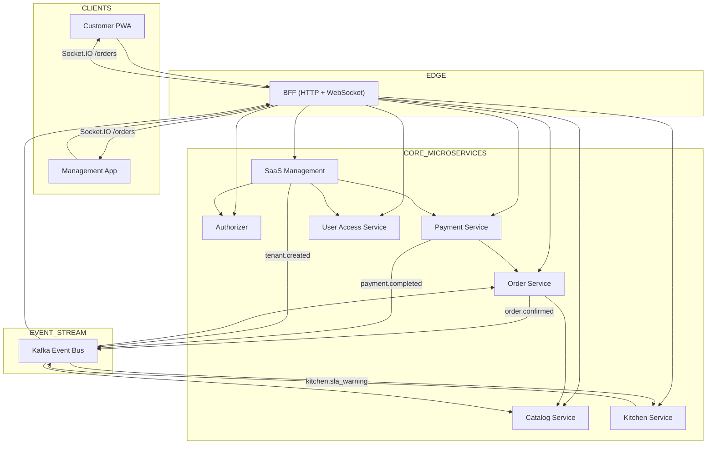
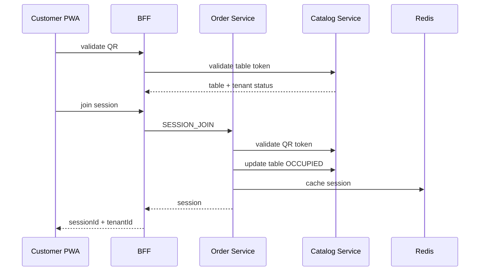
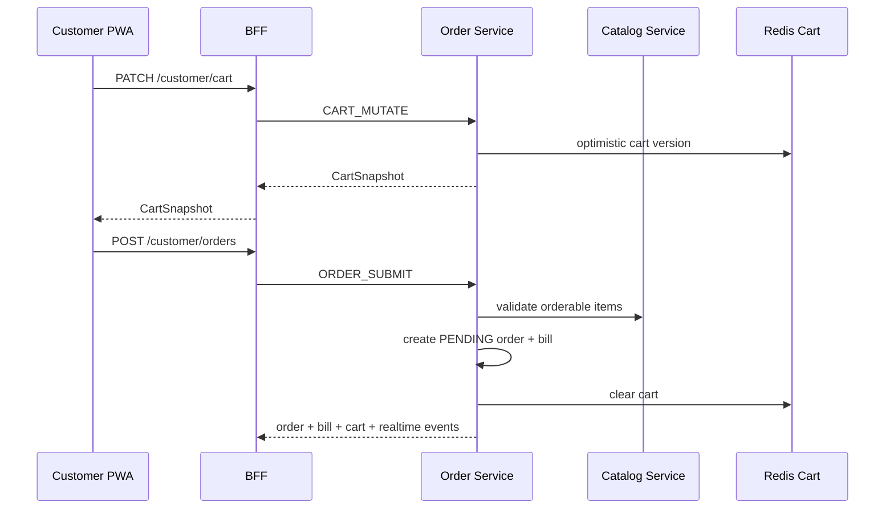
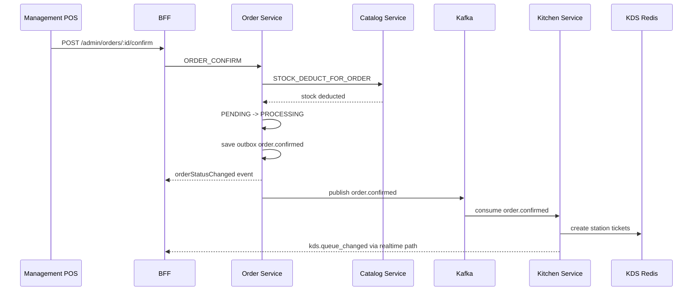
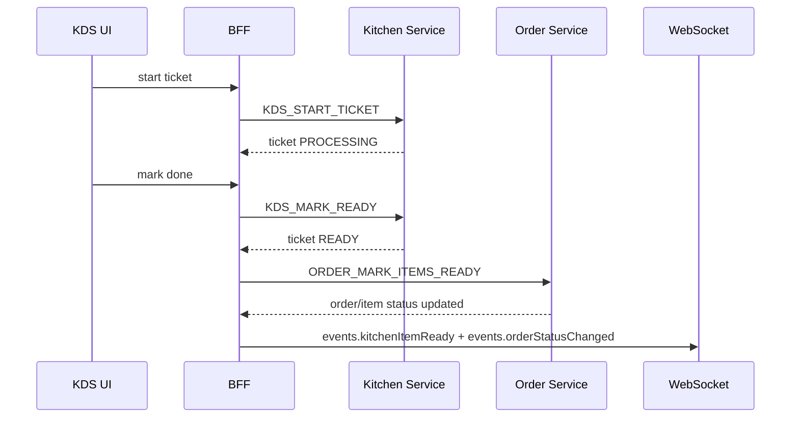
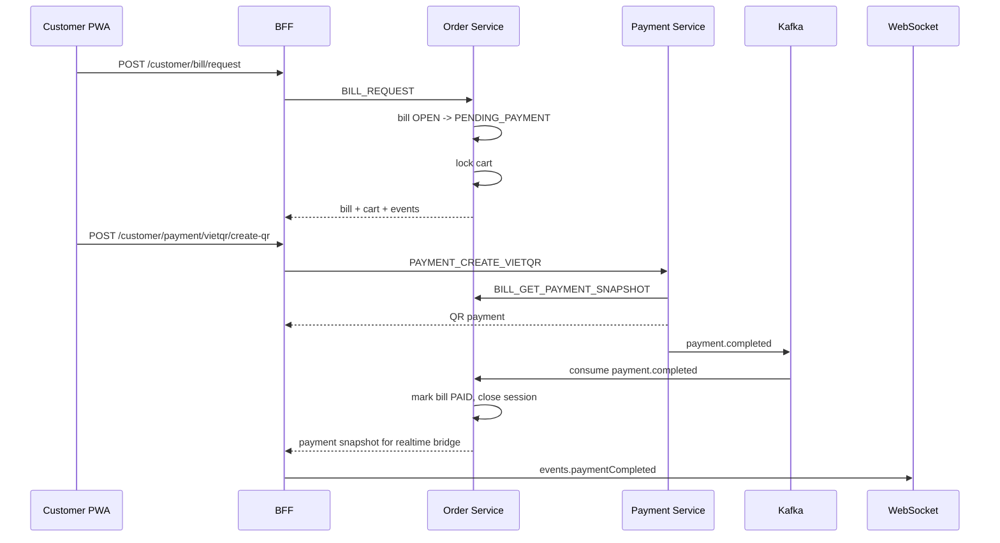
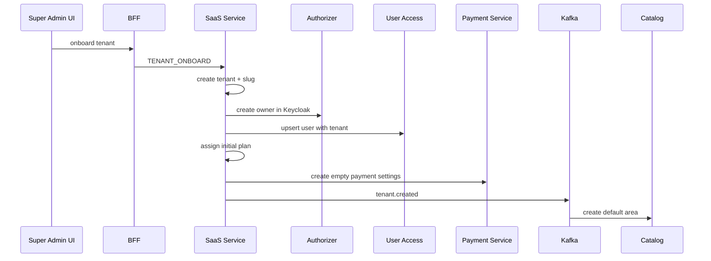

# Bản Đồ Đọc Codebase QRTable

> Hướng dẫn đọc codebase QRTable theo kiến trúc Nx monorepo, NestJS microservices và hai frontend app.
>
> **Canonical Role:** Supporting guide. Khi có mâu thuẫn, ưu tiên `docs/README.md`, phase records, specs đã accepted, code/tests hiện tại.
>
> Cập nhật theo tài liệu và mã nguồn hiện tại: 2026-05-14.

## Mục Tiêu

Tài liệu này giúp bạn đọc codebase QRTable một cách có hệ thống, đúng thứ tự và không bị ngợp bởi số lượng service, thư viện, tài liệu và bề mặt frontend.

Sau khi đọc theo tài liệu này, bạn nên đạt được các mục tiêu sau:

- Nắm được kiến trúc tổng thể của Nx monorepo.
- Biết service nào sở hữu nghiệp vụ nào.
- Lần được flow từ UI đến BFF, microservice, DB, Redis, Kafka và realtime.
- Biết file nào nên đọc trước, file nào đọc sau, file nào có thể bỏ qua ở vòng đầu.
- Biết cách dùng tài liệu hiện có mà không bị nhầm giữa “mục tiêu kiến trúc” và “trạng thái code hiện tại”.

## Nguyên Tắc Đọc Codebase Này

Không nên đọc theo kiểu mở từng thư mục từ trên xuống. Repo này lớn, nhiều tầng và nhiều phase, nên cách đọc đó rất dễ làm mất ngữ cảnh.

Hãy đọc theo 5 trục:

1. **Domain flow**: QR/session, cart/order, KDS, payment, SaaS.
2. **Ownership**: service nào là nguồn sự thật của state nào.
3. **Boundary**: HTTP/WebSocket ở BFF, TCP giữa services, Kafka cho domain events.
4. **State machine**: table, order, bill, payment, tenant lifecycle.
5. **Contract**: shared types, DTO, TCP message constants, realtime event payloads.

Câu hỏi nên lặp lại khi đọc mỗi file:

> File này đang nằm ở layer nào: điều phối request, xử lý nghiệp vụ, lưu state, phát event, hay chỉ render UI?

## Bản Đồ Kiến Trúc Tổng Thể



## Vai Trò Từng App

| App                   | Vai trò                                                                 | Nên đọc khi nào                       |
| --------------------- | ----------------------------------------------------------------------- | ------------------------------------- |
| `apps/bff`            | API gateway, auth guard, HTTP controller, WebSocket gateway, TCP client | Đọc đầu tiên trong backend            |
| `apps/catalog`        | Menu, category, area, table, QR token, stock                            | Đọc trước Order                       |
| `apps/order`          | Session, cart, order, bill, service request, table transfer, outbox     | Đọc sau Catalog, đây là lõi nghiệp vụ |
| `apps/kitchen`        | KDS Redis queue, consume `order.confirmed`, SLA warning                 | Đọc sau Order confirm                 |
| `apps/payment`        | Cash, VietQR, SePay webhook, refund, payment outbox                     | Đọc sau Bill flow                     |
| `apps/saas`           | Tenant onboarding, plan, subscription, invoice, tenant lifecycle        | Đọc sau khi nắm Order/Payment         |
| `apps/authorizer`     | Token verify, Keycloak integration                                      | Đọc khi nghiên cứu auth/RBAC          |
| `apps/user-access`    | User, role, permission seed, Mongo auth data                            | Đọc cùng Authorizer                   |
| `apps/product`        | Legacy/template service                                                 | Bỏ qua ở vòng đầu                     |
| `apps/customer-pwa`   | App khách hàng quét QR                                                  | Đọc sau khi nắm customer flow backend |
| `apps/management-app` | Admin, dashboard, POS, KDS, SaaS surfaces                               | Đọc sau khi nắm BFF/admin endpoints   |

## Source Of Truth Khi Docs Bị Trùng Lặp

Đọc theo thứ tự ưu tiên này:

1. Code và test hiện tại.
2. Specs/docs mới nhất đã được accepted.
3. Phase records trong `docs/phases`.
4. Docs cũ, references, architecture diagrams cũ.
5. README boilerplate hoặc generated docs.

Điểm rất quan trọng: `AGENTS.md` nói rõ nhiều phần là **tiêu chuẩn mục tiêu**, không phải tất cả đều phản ánh 100% trạng thái code hiện tại. Vì vậy hãy dùng docs để lấy bản đồ, nhưng luôn verify bằng code.

## Thứ Tự Đọc Tài Liệu

### Vòng 0: Lấy Bản Đồ Docs

Đọc các file này trước khi chạm vào code:

1. `docs/README.md`
   - Mục đích: biết docs nào là canonical, docs nào chỉ là tham khảo.
2. `docs/implementation_plan.md`
   - Mục đích: biết phase nào đã xong, phase nào deferred, phase nào chưa làm.
3. `docs/technical-architecture.md`
   - Mục đích: nắm tổng thể microservices, DB per service, Kafka topics, Redis, WebSocket rooms.
4. `docs/business-logic.md`
   - Mục đích: nắm state machine và business rules.
5. `docs/architecture/permission-matrix.md`
   - Mục đích: nắm role/permission trước khi đọc admin, POS, KDS.

Sau đó đọc phase records theo thứ tự:

1. `docs/phases/phase-1-catalog.md`
2. `docs/phases/phase-2a-order-kafka.md`
3. `docs/phases/phase-2b-kitchen-websocket.md`
4. `docs/phases/phase-3-payment.md`
5. `docs/phases/phase-4b-saas-onboarding.md`

Chỉ đọc specs chi tiết khi cần đào sâu:

- `docs/specs/business-logic-step-2.4-spec.vi.md`
- `docs/specs/business-logic-step-2.6-spec.vi.md`
- `docs/specs/business-logic-step-2.7-spec.vi.md`
- `docs/specs/business-logic-phase-3-spec.vi.md`
- `docs/specs/business-logic-phase-4b-spec.md`

## Vòng 1: Hiểu Nx Monorepo

Đọc:

- `package.json`
- `nx.json`
- `tsconfig.base.json`
- `apps/*/project.json`
- `libs/*/project.json`

Lệnh nên dùng:

```bash
npx nx show projects
npx nx graph
```

Cần rút ra:

- App nào là deployable app.
- Lib nào là shared contract.
- Alias nào map tới thư mục nào.
- Script dev nào chạy tập service nào.

Trong `package.json`, các script như `dev:bff-order`, `dev:bff-payment`, `dev:bff-auth` cho biết cách chạy và đọc theo từng slice domain.

## Vòng 2: Đọc Backend Boundary Trước

Đừng bắt đầu từ service internals ngay. Hãy đọc BFF và guard chain trước, vì đây là cửa ngõ của toàn bộ hệ thống.

### BFF Entry Points

Đọc:

- `apps/bff/src/main.ts`
- `apps/bff/src/app/app.module.ts`
- `apps/bff/src/app/modules/*/controllers/*.ts`
- `apps/bff/src/app/modules/realtime/*`

Cần nắm:

- Global prefix API.
- Validation pipe.
- CORS.
- Redis Socket.IO adapter.
- Thứ tự middleware, guard, interceptor.
- HTTP route nào map sang TCP message nào.

### Auth, Tenant Và Permission

Đọc:

- `libs/middlewares/src/lib/tenant.middleware.ts`
- `libs/guards/src/lib/user.guard.ts`
- `libs/guards/src/lib/session.guard.ts`
- `libs/guards/src/lib/tenant.guard.ts`
- `libs/guards/src/lib/permission.guard.ts`
- `apps/bff/src/app/modules/saas/guards/customer-tenant-lifecycle.guard.ts`

Cần nắm:

- Staff dùng JWT/Keycloak.
- Customer dùng Redis session với `x-session-id`.
- Tenant lấy từ `x-tenant-id` hoặc subdomain.
- Permission enforcement nằm ở BFF guard, frontend navigation chỉ là UX.
- Tenant suspended/closed ảnh hưởng customer write actions.

## Vòng 3: Đọc Backend Theo Domain Flow

### Flow 1: QR, Table, Session, Menu

Mục tiêu: hiểu khách quét QR và vào bàn như thế nào.

Đọc theo thứ tự:

1. `apps/customer-pwa/src/pages/landing-page.tsx`
2. `apps/customer-pwa/src/features/landing/services/session.service.ts`
3. `apps/bff/src/app/modules/catalog/controllers/menu.controller.ts`
4. `apps/bff/src/app/modules/order/controllers/customer-session.controller.ts`
5. `apps/order/src/app/modules/order/services/order.service.ts`
6. `apps/catalog/src/app/modules/table/services/table.service.ts`
7. `apps/catalog/src/app/modules/menu/services/menu.service.ts`

Flow cần nắm:



State cần nhớ:

- Table status: `AVAILABLE -> OCCUPIED -> BILLING -> CLEANING -> AVAILABLE`.
- Session nằm ở Order service, cache trong Redis.
- QR token do Catalog/Table quản lý.
- Menu public chỉ trả item/category active và available.

### Flow 2: Cart Và Submit Order

Mục tiêu: hiểu khách thêm món, submit order và shared cart state.

Đọc theo thứ tự:

1. `apps/customer-pwa/src/features/order/services/order.service.ts`
2. `apps/customer-pwa/src/features/order/hooks/use-order-query.ts`
3. `apps/bff/src/app/modules/order/controllers/customer-order.controller.ts`
4. `apps/order/src/app/modules/order/services/cart.service.ts`
5. `apps/order/src/app/modules/order/services/order.service.ts`
6. `apps/catalog/src/app/modules/menu-item/services/menu-item.service.ts`

Flow cần nắm:



Điểm quan trọng:

- Cart source of truth là Redis.
- Cart dùng optimistic version để tránh conflict.
- Submit order chỉ validate availability.
- Stock deduction không xảy ra lúc submit, mà xảy ra lúc staff confirm.
- BFF emit `events.orderCreated` và `events.cartUpdated` trực tiếp qua WebSocket.

### Flow 3: Staff Confirm, Stock Deduct, KDS

Mục tiêu: hiểu từ lúc staff confirm đến lúc bếp thấy ticket.

Đọc theo thứ tự:

1. `apps/management-app/src/features/order/services/order.service.ts`
2. `apps/management-app/src/features/order/hooks/use-order-query.ts`
3. `apps/bff/src/app/modules/order/controllers/staff-order.controller.ts`
4. `apps/order/src/app/modules/order/services/order.service.ts`
5. `apps/catalog/src/app/modules/menu-item/services/menu-item.service.ts`
6. `apps/order/src/app/modules/order/services/outbox-publisher.service.ts`
7. `apps/kitchen/src/app/modules/kitchen/services/order-confirmed.consumer.ts`
8. `apps/kitchen/src/app/modules/kitchen/repositories/kds-redis.repository.ts`

Flow cần nắm:



Điểm quan trọng:

- `order.confirmed` chỉ publish sau staff confirm.
- Kitchen không có DB riêng, source of truth là Redis.
- Ticket có thể chia theo station: `KITCHEN`, `BAR`.
- KDS frontend không tin socket payload là data chính. Socket chỉ invalidate query, REST snapshot vẫn là source of truth.

### Flow 4: KDS Start, Done, Ready, Served

Mục tiêu: hiểu staff bếp thao tác ticket và đồng bộ về Order.

Đọc theo thứ tự:

1. `apps/management-app/src/features/kds/services/kds.service.ts`
2. `apps/management-app/src/features/kds/hooks/use-kds-queue.ts`
3. `apps/management-app/src/features/kds/hooks/use-kds-realtime.ts`
4. `apps/bff/src/app/modules/kitchen/controllers/kitchen.controller.ts`
5. `apps/kitchen/src/app/modules/kitchen/repositories/kds-redis.repository.ts`
6. `apps/order/src/app/modules/order/services/order.service.ts`

Flow cần nắm:



Điểm quan trọng:

- BFF orchestration giữa Kitchen và Order khi `done`.
- Nếu sync sang Order fail, BFF có logic compensate recall ticket.
- CHEF chỉ vào station `KITCHEN`, BARISTA chỉ vào `BAR`; OWNER/MANAGER vào cả hai.

### Flow 5: Bill Request Và Payment

Mục tiêu: hiểu từ lúc khách yêu cầu thanh toán đến lúc bill paid.

Đọc theo thứ tự:

1. `apps/customer-pwa/src/pages/request-payment-page.tsx`
2. `apps/customer-pwa/src/features/payment/services/payment.service.ts`
3. `apps/bff/src/app/modules/order/controllers/customer-order.controller.ts`
4. `apps/order/src/app/modules/order/services/bill.service.ts`
5. `apps/bff/src/app/modules/payment/controllers/payment.controller.ts`
6. `apps/payment/src/app/modules/payment/services/payment-settlement.service.ts`
7. `apps/payment/src/app/modules/payment/services/sepay-webhook.service.ts`
8. `apps/payment/src/app/modules/payment/repositories/payment-outbox.repository.ts`
9. `apps/order/src/app/modules/order/services/payment-events-consumer.service.ts`

Flow cần nắm:



Điểm quan trọng:

- Bill owned by Order.
- Payment owned by Payment.
- Cash và VietQR đều tạo payment record trong Payment service.
- Payment completed có fast path gọi Order và có outbox Kafka để eventual consistency.
- Rounding VND: `ceil(amount / 1000) * 1000`.
- `QRTBL` là reference cho customer payment.
- Direct Phase 3 SePay route hiện verify HMAC raw-body; tenant/platform routes Phase 4B dùng `x-secret-key` path riêng.

### Flow 6: SaaS Onboarding, Subscription, Tenant Lifecycle

Mục tiêu: hiểu control plane của multi-tenant SaaS.

Đọc theo thứ tự:

1. `apps/management-app/src/features/saas/api.ts`
2. `apps/management-app/src/app/(admin)/admin/tenants/page.tsx`
3. `apps/bff/src/app/modules/saas/controllers/admin-tenants.controller.ts`
4. `apps/saas/src/services/onboarding-saga.service.ts`
5. `apps/saas/src/services/subscription.service.ts`
6. `apps/saas/src/services/subscription-invoice.service.ts`
7. `apps/saas/src/services/tenant-lifecycle.service.ts`
8. `apps/bff/src/app/modules/saas/guards/customer-tenant-lifecycle.guard.ts`

Flow cần nắm:



Điểm quan trọng:

- `QRSUB` là reference cho tenant subscription payment.
- Payment Service sở hữu `tenant_payment_settings`; SaaS Service sở hữu tenant/subscription/invoice.
- SaaS lifecycle ảnh hưởng customer writes qua Redis key `tenant:{tenantId}:suspended`.
- Owner dashboard có payment settings OAuth SePay.
- Super Admin quản lý tenants, plans, billing.

## Vòng 4: Đọc Shared Libraries

Sau khi đã nắm flow, hãy đọc shared libs để hiểu contract.

### Backend Shared

| Lib                           | Nội dung cần đọc                                 |
| ----------------------------- | ------------------------------------------------ |
| `libs/constants`              | Enum, TCP request messages, permission constants |
| `libs/interfaces`             | Request/response wrappers, TCP payload contracts |
| `libs/entities`               | TypeORM entities dùng chung                      |
| `libs/guards`                 | Auth, tenant, permission, session guards         |
| `libs/middlewares`            | Tenant resolution                                |
| `libs/interceptors`           | Response/error shape                             |
| `libs/configuration`          | Env/config schema                                |
| `libs/providers/redis-client` | Redis client provider                            |

### Frontend Shared

| Lib                     | Nội dung cần đọc                                              |
| ----------------------- | ------------------------------------------------------------- |
| `libs/shared/types`     | Domain types dùng cho FE/BE, event payload, state transitions |
| `libs/shared/constants` | Status labels, roles, query config                            |
| `libs/frontend/utils`   | API client, error handling, upload client                     |
| `libs/frontend/ui`      | Shared UI primitives                                          |
| `libs/frontend/hooks`   | Shared React hooks                                            |

Nên đọc trước:

- `libs/shared/types/src/lib/order.types.ts`
- `libs/shared/types/src/lib/session.types.ts`
- `libs/shared/types/src/lib/bill.types.ts`
- `libs/shared/types/src/lib/payment.types.ts`
- `libs/shared/types/src/lib/kds.types.ts`
- `libs/shared/types/src/lib/realtime-events.types.ts`

## Vòng 5: Đọc Frontend Theo Surface

### Customer PWA

Entry:

- `apps/customer-pwa/src/main.tsx`
- `apps/customer-pwa/src/App.tsx`
- `apps/customer-pwa/src/lib/api-client.ts`
- `apps/customer-pwa/src/features/session/context/session-provider.tsx`

Đọc routes theo business order:

1. `landing-page.tsx`: resolve tenant, verify QR, join session.
2. `menu-page.tsx`: public menu, cart drawer.
3. `features/order/hooks/use-order-query.ts`: cart/order/bill query và mutations.
4. `features/order/hooks/use-customer-order-realtime.ts`: socket invalidation.
5. `order-tracking-page.tsx`: order status tracking.
6. `request-payment-page.tsx`: bill request, VietQR creation, polling.

Nguyên tắc frontend PWA:

- Session persist trong localStorage.
- API client gắn `x-tenant-id` và `x-session-id`.
- Khi session closed, client clear local session.
- WebSocket chỉ invalidate React Query cache.

### Management App

Entry:

- `apps/management-app/src/middleware.ts`
- `apps/management-app/src/auth.ts`
- `apps/management-app/src/app/providers.tsx`
- `apps/management-app/src/lib/api/authenticated-client.ts`
- `apps/management-app/src/components/layout/data/sidebar-data.ts`

Đọc theo route group:

1. `(auth)`: login, callback, NextAuth/Keycloak.
2. `(dashboard)`: owner/manager menu, tables, staff, orders, subscription, payment settings.
3. `(pos)`: waiter/manager live orders, tables, service requests, bills.
4. `(kds)`: kitchen/bar board.
5. `(admin)`: super admin tenants, plans, billing, analytics.

Nguyên tắc frontend management:

- Middleware gate route theo role.
- Sidebar filter theo role và permission.
- API client gắn Bearer token và `x-tenant-id`.
- React Query là cache layer.
- Realtime hook invalidate list/detail queries.

## Command Cheat Sheet

### Tìm Project Và Alias

```bash
npx nx show projects
rg -n "\"@einvoice|\"@common" tsconfig.base.json
find apps libs -name project.json | sort
```

### Trace Một HTTP Endpoint Từ BFF Vào Service

```bash
rg -n "@Controller|@Get|@Post|@Patch|@Delete" apps/bff/src/app/modules/order
rg -n "TCP_REQUEST_MESSAGE.ORDER" apps/bff apps/order libs
rg -n "@MessagePattern\\(TCP_REQUEST_MESSAGE.ORDER" apps/order/src
```

### Trace Kafka Events

```bash
rg -n "order.confirmed|payment.completed|payment.refunded|kitchen.sla_warning|tenant.created" apps libs docs
```

### Trace Realtime Events

```bash
rg -n "events\\.orderCreated|events\\.orderStatusChanged|events\\.cartUpdated|events\\.paymentCompleted|events\\.kdsQueueChanged" apps libs
```

### Trace Permissions

```bash
rg -n "@Authorization|@Permissions|PERMISSION\\.|phase4bPermissions|hasPermission" apps libs
```

### Trace Frontend API Calls

```bash
rg -n "authApiClient|customerApi|useQuery|useMutation|io\\(" apps/customer-pwa apps/management-app
```

### Đọc State Machines

```bash
rg -n "OrderStatus|BillStatus|PaymentStatus|SessionStatus|TABLE_STATUS|TableStatus" apps libs docs
```

## Mẫu Ghi Chú Khi Đọc Một Flow

Hãy tạo một bảng cho mỗi flow:

| Cột            | Câu hỏi                                             |
| -------------- | --------------------------------------------------- |
| UI surface     | Page/hook/component nào kích hoạt action?           |
| API endpoint   | BFF route nào nhận request?                         |
| Auth rule      | Route dùng staff JWT, customer session, hay public? |
| TCP message    | BFF gọi message nào sang service?                   |
| Service method | Method nào xử lý business rule chính?               |
| Persistence    | State lưu ở DB, Redis hay Kafka outbox?             |
| Realtime       | Event nào emit, room nào nhận?                      |
| Tests          | Test nào mô tả behavior này?                        |
| Doc reference  | Phase/spec nào liên quan?                           |

Ví dụ cho confirm order:

| Cột            | Giá trị                                                  |
| -------------- | -------------------------------------------------------- |
| UI surface     | `management-app` POS live orders                         |
| API endpoint   | `POST /admin/orders/:id/confirm`                         |
| Auth rule      | Staff JWT + permission                                   |
| TCP message    | `ORDER.CONFIRM`                                          |
| Service method | `OrderService.confirmOrder`                              |
| Persistence    | Order DB update, Catalog stock transaction, Order outbox |
| Realtime       | `events.orderStatusChanged`                              |
| Kafka          | `order.confirmed`                                        |
| Consumer       | Kitchen service                                          |

## Những Điểm Dễ Nhầm

### Docs Là Target, Code Là Thực Tế

Một số docs mô tả kiến trúc mục tiêu. Khi thấy docs và code lệch nhau, dùng code và test hiện tại để kết luận, sau đó ghi lại gap.

Ví dụ cần cảnh giác:

- Docs có thể nói QR HMAC, nhưng code Table service đang dùng opaque random token.
- Docs/diagram cũ có thể nói payments DB sở hữu bills, nhưng flow hiện tại là Order owns bills.
- `product` service có dấu hiệu legacy/template, không nên đọc sớm.

### Kafka Không Dùng Để Proxy UI

Kafka chỉ dùng cho domain events cross-service:

- `order.confirmed`
- `payment.completed`
- `payment.refunded`
- `kitchen.sla_warning`
- `tenant.created`

Những event UI như cart/order/status/bill/table thường được BFF emit trực tiếp sau TCP success.

### WebSocket Không Phải Source Of Truth

Frontend dùng Socket.IO như invalidation hint:

1. Socket event đến.
2. React Query invalidate.
3. UI refetch REST snapshot.

Vì vậy khi đọc bug realtime, hãy xem cả REST query và socket hook.

### Table, Session, Bill, Payment Khác Owner

| State                                       | Owner                    |
| ------------------------------------------- | ------------------------ |
| Table, QR, menu, stock                      | Catalog                  |
| Session, cart, order, bill, service request | Order                    |
| KDS ticket/queue                            | Kitchen Redis            |
| Payment, refund, audit                      | Payment                  |
| Tenant, plan, subscription invoice          | SaaS                     |
| Role/permission/user mapping                | User Access + Authorizer |

### Customer Và Staff Auth Khác Nhau

| Actor       | Auth style                                              |
| ----------- | ------------------------------------------------------- |
| Customer    | Redis session, `x-session-id`, anonymous                |
| Staff/Admin | Keycloak JWT, `Authorization: Bearer`, `x-tenant-id`    |
| Super Admin | JWT role, có thể bypass tenant scope trong một số guard |

## File Landmarks

### Core Docs

- `docs/README.md`
- `docs/technical-architecture.md`
- `docs/business-logic.md`
- `docs/implementation_plan.md`
- `docs/architecture/permission-matrix.md`

### BFF

- `apps/bff/src/main.ts`
- `apps/bff/src/app/app.module.ts`
- `apps/bff/src/app/modules/realtime/gateways/order-events.gateway.ts`
- `apps/bff/src/app/modules/realtime/services/realtime-events.service.ts`
- `apps/bff/src/app/modules/realtime/services/realtime-kafka-bridge.service.ts`

### Order

- `apps/order/src/app/modules/order/order.module.ts`
- `apps/order/src/app/modules/order/controllers/order.controller.ts`
- `apps/order/src/app/modules/order/services/order.service.ts`
- `apps/order/src/app/modules/order/services/cart.service.ts`
- `apps/order/src/app/modules/order/services/bill.service.ts`
- `apps/order/src/app/modules/order/services/session.service.ts`
- `apps/order/src/app/modules/order/services/transfer.service.ts`
- `apps/order/src/app/modules/order/services/outbox-publisher.service.ts`
- `apps/order/src/app/modules/order/services/payment-events-consumer.service.ts`

### Catalog

- `apps/catalog/src/app/modules/table/services/table.service.ts`
- `apps/catalog/src/app/modules/menu/services/menu.service.ts`
- `apps/catalog/src/app/modules/menu-item/services/menu-item.service.ts`
- `apps/catalog/src/app/modules/tenant-events/tenant-created.consumer.ts`

### Kitchen

- `apps/kitchen/src/app/modules/kitchen/controllers/kitchen.controller.ts`
- `apps/kitchen/src/app/modules/kitchen/services/order-confirmed.consumer.ts`
- `apps/kitchen/src/app/modules/kitchen/repositories/kds-redis.repository.ts`
- `apps/kitchen/src/app/modules/kitchen/services/kitchen-sla.worker.ts`

### Payment

- `apps/payment/src/app/modules/payment/controllers/payment.controller.ts`
- `apps/payment/src/app/modules/payment/services/payment-settlement.service.ts`
- `apps/payment/src/app/modules/payment/services/sepay-webhook.service.ts`
- `apps/payment/src/app/modules/payment/services/refund.service.ts`
- `apps/payment/src/app/modules/payment/services/tenant-payment-settings.service.ts`
- `apps/payment/src/app/modules/payment/repositories/payment-outbox.repository.ts`

### SaaS

- `apps/saas/src/controllers/saas.controller.ts`
- `apps/saas/src/services/onboarding-saga.service.ts`
- `apps/saas/src/services/subscription.service.ts`
- `apps/saas/src/services/subscription-invoice.service.ts`
- `apps/saas/src/services/tenant-lifecycle.service.ts`
- `apps/saas/src/services/saas-outbox-publisher.service.ts`

### Customer PWA

- `apps/customer-pwa/src/main.tsx`
- `apps/customer-pwa/src/App.tsx`
- `apps/customer-pwa/src/lib/api-client.ts`
- `apps/customer-pwa/src/features/session/context/session-provider.tsx`
- `apps/customer-pwa/src/features/order/hooks/use-order-query.ts`
- `apps/customer-pwa/src/features/order/hooks/use-customer-order-realtime.ts`

### Management App

- `apps/management-app/src/middleware.ts`
- `apps/management-app/src/auth.ts`
- `apps/management-app/src/lib/api/authenticated-client.ts`
- `apps/management-app/src/components/layout/data/sidebar-data.ts`
- `apps/management-app/src/features/order/hooks/use-staff-order-realtime.ts`
- `apps/management-app/src/features/kds/hooks/use-kds-realtime.ts`
- `apps/management-app/src/features/saas/api.ts`

## Lộ Trình Học Đề Xuất

### Ngày 1: Docs Và Nx Skeleton

Mục tiêu:

- Biết repo có những app/lib nào.
- Biết docs nào cần tin.
- Vẽ được architecture diagram tổng thể.

Checklist:

- Đọc `docs/README.md`.
- Đọc `technical-architecture.md`.
- Đọc `business-logic.md`.
- Chạy `npx nx show projects`.
- Mở `tsconfig.base.json` để hiểu alias.

### Ngày 2: BFF, Auth, Tenant, Permission

Mục tiêu:

- Hiểu mọi request đi qua BFF như thế nào.
- Hiểu staff vs customer auth.

Checklist:

- Đọc BFF `main.ts` và `app.module.ts`.
- Đọc guards trong `libs/guards`.
- Đọc `permission-matrix.md`.
- Trace một route admin và một route customer.

### Ngày 3: Catalog Và Order

Mục tiêu:

- Hiểu QR/session/cart/order/bill.
- Nắm state machine chính.

Checklist:

- Đọc Catalog table/menu-item services.
- Đọc Order controller và Order service.
- Đọc Cart service, Bill service, Session service.
- Trace `submitOrder` và `confirmOrder`.

### Ngày 4: Kitchen Và Payment

Mục tiêu:

- Hiểu Kafka, outbox, KDS Redis, payment settlement.

Checklist:

- Trace `order.confirmed`.
- Đọc KDS Redis repository.
- Trace `payment.completed`.
- Đọc Payment settlement và SePay webhook.

### Ngày 5: SaaS Và Frontend

Mục tiêu:

- Hiểu tenant onboarding, subscription, lifecycle.
- Nối được frontend pages với backend endpoints.

Checklist:

- Đọc SaaS onboarding saga.
- Đọc tenant lifecycle guard.
- Đọc Customer PWA routes/hooks.
- Đọc Management App middleware/auth/sidebar/features.

## Cách Kiểm Tra Bạn Đã Hiểu

Bạn nên tự trả lời được các câu hỏi sau:

1. Khi khách quét QR, service nào validate token?
2. Khi customer submit order, stock đã trừ hay chưa?
3. Khi staff confirm order, Kafka event nào được publish?
4. Kitchen ticket lưu ở DB hay Redis?
5. Khi KDS bấm done, service nào update Order item status?
6. Khi khách yêu cầu bill, điều kiện nào phải đúng?
7. Payment service có sở hữu bill không?
8. `payment.completed` ảnh hưởng Order service như thế nào?
9. Tenant suspended thì customer còn được làm gì?
10. Frontend realtime dùng payload socket để render trực tiếp hay invalidate/refetch?

Nếu trả lời được 10 câu này, bạn đã nắm phần xương sống của QRTable.

## Cách Đọc Khi Gặp Bug Hoặc Feature Mới

Dùng quy trình này:

1. Xác định actor: customer, waiter, chef, barista, manager, owner, super admin.
2. Xác định UI surface: PWA, POS, KDS, dashboard, admin.
3. Tìm endpoint trong BFF.
4. Tìm TCP message BFF gọi sang service.
5. Tìm service method xử lý business rule.
6. Tìm persistence owner: DB, Redis, Kafka outbox.
7. Tìm realtime event nếu UI cần cập nhật live.
8. Tìm tests gần domain đó.
9. Đối chiếu docs/phase/spec.
10. Ghi lại gap giữa docs và code nếu có.

## Thứ Tự Không Nên Đọc

Không nên bắt đầu bằng:

- `node_modules`
- `.nx`
- `dist`
- `.next`
- Generated lockfiles
- UI components nhỏ lẻ trong `components/ui`
- CSS/theme files
- `apps/product` legacy/template
- Architecture images cũ trước khi đọc docs canonical

Những file này có thể cần sau, nhưng không giúp nắm flow ở vòng đầu.

## Kết Luận

Codebase QRTable lớn, nhưng không phải hỗn loạn nếu đọc đúng trục.

Thứ tự tốt nhất là:

1. Docs canonical.
2. Nx project map.
3. BFF boundary.
4. Guards/auth/tenant.
5. Catalog.
6. Order.
7. Kitchen.
8. Payment.
9. SaaS.
10. Frontend routes, services, hooks.
11. Shared types/constants.
12. Tests.

Triết lý đọc quan trọng nhất:

> Đừng đọc file. Hãy đọc flow. Sau đó dùng file để chứng minh flow đó.
