# Kafka: In-depth Theory — For QRTable Phase 2

> **Document philosophy:** Understand the _why_ before the _how_. Every concept is anchored in context
> QRTable's specifics so you don't learn abstract theory but learn to apply it immediately.
>
> **Current code status (2026-05-31):** This document is a supporting guide. The approved Kafka topic registry is `order.confirmed`, `order.status_changed`, `payment.completed`, `kitchen.sla_warning`, and `tenant.created`. Runtime consumers already included in the code include `order.confirmed → Kitchen`, `payment.completed → Order + BFF realtime bridge`, `kitchen.sla_warning → BFF realtime bridge`, and `tenant.created → Catalog`. `order.status_changed` is currently an Order outbox topic for durable status projection/audit; immediate order WebSocket feedback still uses BFF Direct after the TCP response. Notification service does not exist in `apps/`; Notification examples below are future-extension examples only, not the current runtime state and not Phase 4C scope.

---

## Table of Contents

1. [Kafka Problem Solved](#1-kafka-problem-solved)
2. [The Nature of Kafka — Distributed Commit Log](#2-nature-of-kafka--distributed-commit-log)
3. [Anatomy One Message](#3-anatomy-one-message)
4. [Topic, Partition and Physical Log](#4-topic-partition-and-physical-log)
5. [Replication and Data Durability](#5-replication-and-data-durability)
6. [Producer — Message Sending Mechanism](#6-producer--message-sending-mechanism)
7. [Consumer and Consumer Group](#7-consumer-and-consumer-group)
8. [Delivery Semantics](#8-delivery-semantics)
9. [Architectural Decisions: Kafka vs BFF Direct in QRTable](#9-architectural-decisions-kafka-vs-bff-direct-in-qrtable)
10. [Dual-Write Problem and Outbox Pattern](#10-dual-write-problem-and-outbox-pattern)
11. [Partition Strategy for Multi-tenant](#11-partition-strategy-for-multi-tenant)
12. [Consumer Group Design for QRTable](#12-consumer-group-design-for-qrtable)
13. [Summary Mental Model](#13-summary-mental-model)

---

## 1. Problems Kafka Solve

Before learning what Kafka is, you need to understand what problem Kafka was born to solve. If you skip this part, you will tend to over-engineer Kafka or not know when to use it.

### 1.1 Original Problem: Connecting N Services

Imagine a QRTable system without Kafka. When an order is confirmed, Order service needs to notify multiple parties:

- Kitchen service must know to create kitchen tickets
- (future extension) Notification service wants to record audit log
- (In the future) Analytics service wants to collect revenue statistics

Without Kafka, the Order service must call each service directly:

```
Order Service ──TCP──► Kitchen Service
Order Service ──TCP──► Notification Service (future extension)
Order service ──TCP──► Analytics service (future)
```

#### Diagram: Point-to-Point Coupling — Problem without Kafka

> The diagram below illustrates the **point-to-point** architecture without a message broker. Each service must know about the existence of every other service, creating a complex network of connections (N×M connections). When adding a new service, all producers must edit the code.

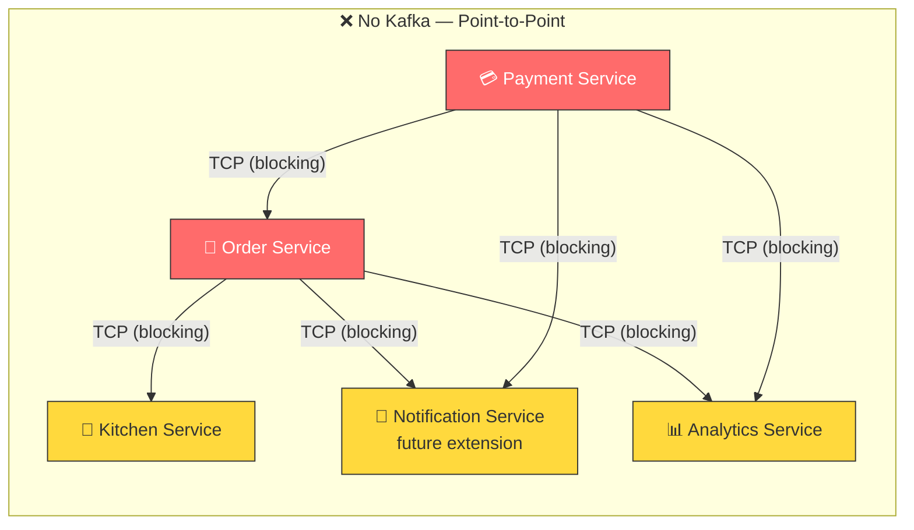

#### Diagram: Kafka Unleashes Coupling

> With Kafka in the middle, the producer just needs to publish to the topic, no matter who subscribes. Consumers subscribe to topics without knowing who published them. Adding a new service just requires subscription — don't edit the producer code.


This design has a series of serious problems:

**Issue 1 — Temporal Coupling (time constraint):** Order service only completes when _all_ downstream services have finished responding. If Kitchen service is under maintenance or running slowly, customers must wait — although creating a kitchen ticket has no effect on order confirmation.

**Problem 2 — Structural Coupling:** Order service must _know_ Kitchen service exists. When adding Analytics service, the Order service code must be edited. This is a violation of the Open/Closed Principle — every time there is a new consumer, the producer must change.

**Issue 3 — No Replay:** If the Kitchen service is restarted at the exact moment the Order service has just sent the request, the message is lost forever. There is no way for Kitchen service to "ask again" for orders it has missed.

#### Diagram: Three Problems Kafka Solve

> The table visually compares the three main problems of point-to-point architecture and how Kafka solves each problem. Kafka uses persistent logs in the middle as an intermediary, completely eliminating direct dependencies between producers and consumers.

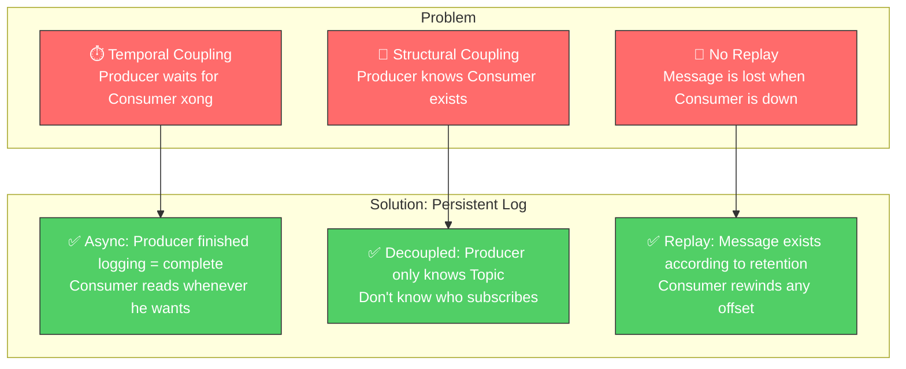

Kafka solves all three problems with a single mechanism: **separating producers and consumers through a persistent log in the middle**.

### 1.2 When is Kafka NOT the Solution

Kafka is not the answer to every communication problem. In QRTable, there are 6 UI events (`order.created`, `menu.updated`, `table.status_changed`, etc.) that are handled differently — BFF Direct Pattern — because they only need to push data to the WebSocket for the client, without needing business logic in another bounded context. Using Kafka for these events adds unnecessary latency and complexity.

#### Diagram: Decision Tree — Kafka or BFF Direct?

> Decision trees help quickly determine when to use Kafka and when to use BFF Direct. Start from the question "Does the event trigger business logic in another bounded context?" — if Yes → Kafka, if No (UI update only) → BFF Direct.

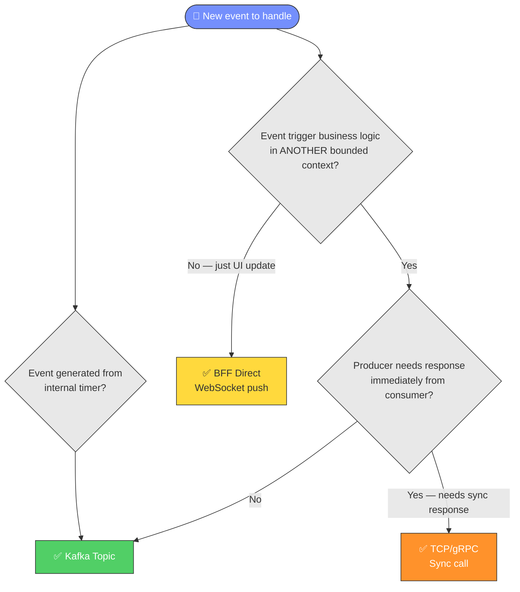

Simple rule: **if the producer already has enough information and only needs to notify the UI, don't use Kafka**. Kafka is for cases that need true cross-domain business reaction or temporal decoupling.

---

## 2. Nature of Kafka — Distributed Commit Log

The most common misconception about Kafka is to think of it as a distributed message queue — like RabbitMQ but bigger. This is a fundamental misunderstanding that leads to all subsequent design mistakes.

### 2.1 What Really Is Kafka

Kafka is essentially a **distributed, persistent, append-only log**. Each topic is a collection of log files stored on the hard disk. When the producer sends a message, Kafka appends it to the end of the log — never editing or deleting the recorded message.

Imagine a diary: you only write at the end, never erase. Consumers read books by remembering which page they have read (called _offset_). Unlike traditional queues, messages are not deleted after they are read — they stay there until the storage period expires (default 7 days).

#### Diagram: Append-Only Log — Core structure of Kafka

> Illustrate the append-only log nature. Producer can only write to the end of the log (right). Consumer reads at its own offset and moves gradually to the right. Old messages are not deleted when read — they persist until the retention period expires.

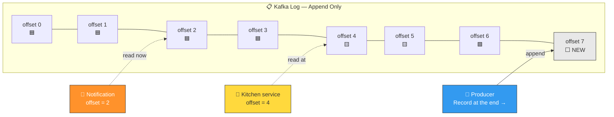

### 2.2 Consequences of Log Design

The append-only log design creates completely different characteristics from a message queue:

**Feature 1 — Multiple independent consumers:** Because messages are not deleted after reading, multiple consumers can read the same message completely independently, each keeping track of their own location. In the current QRTable, `payment.completed` is read independently by the Order service and the BFF realtime bridge; `tenant.created` is read by the Catalog service to seed the default area. Notification is a future-extension consumer.

**Feature 2 — Replay:** Consumer can "rewind" to an old location in the log and read the message again. If Kitchen service has a bug and incorrectly processed 100 orders in the past 2 hours, the team can fix the code, reset the offset to 2 hours ago, and let Kitchen service process everything again — without Order service doing anything else.

**Feature 3 — Consumers pace themselves:** Kafka uses a pull model — consumers _pull_ messages at their own pace, instead of brokers _pushing_ messages to consumers. If Kitchen service processes slowly, it only lags behind (lower offset) but does not crash the whole system.

#### Diagram: Three Outstanding Characteristics of Log

> Visually compare the three sinest features of the log model versus the message queue. Each characteristic is illustrated with a specific scenario in the QRTable.

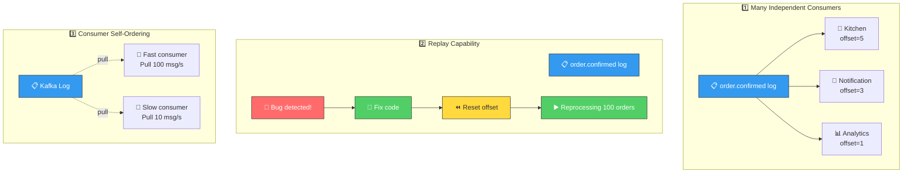

### 2.3 Comparison with Traditional Message Queue

| Aspect                 | RabbitMQ / Queue                       | Apache Kafka                                       |
| ---------------------- | -------------------------------------- | -------------------------------------------------- |
| **Data Model**         | Queue — message lost after consumption | Log — messages exist according to retention policy |
| **Consumer model**     | Broker pushes to consumer              | Consumer pulls from broker                         |
| **Multiple consumers** | Need manual fan-out exchange           | Natural — each group reads independently           |
| **Ordering**           | Per-queue                              | Per-partition                                      |
| **Replay**             | Impossible                             | Rewind offset any                                  |
| **Throughput**         | Moderate                               | Very high (sequential disk I/O)                    |
| **Suitable for**       | Task queue, RPC async                  | Event streaming, audit log, decoupling             |

#### Diagram: Queue vs Log — The Core Difference

> Visually illustrate the difference between the Queue model (message disappears after the consumer reads it) and the Log model (message persists, consumer only moves the offset pointer). This is the fundamental difference that determines all subsequent designs.

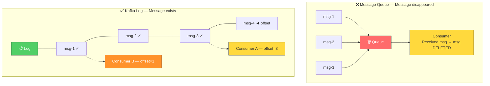

---

## 3. Anatomy of a Message

Every message in Kafka has a fixed structure. Understanding each component helps you design the right message schema from the beginning.

### 3.1 Ingredients

A Kafka message consists of 5 main components:

**Key (optional):** A byte string used to determine which partition this message will go to. The key is not the unique ID of the message — multiple messages can have the same key. Kafka hash key to select partition, ensuring all messages with the same key always go to the same partition (ordering guarantee).

In QRTable, the key of every event is `tenantId`. The reason will be explained in detail in section 11.

**Value:** The actual content of the message — usually JSON. This is the section that contains business data: order information, payment events, etc.

**Headers (optional):** Metadata in key-value form, similar to HTTP headers. Used for cross-cutting concerns such as tracing ID, source service name, schema version. Headers do not affect routing or partitioning.

**Timestamp:** The time the message was created (assigned by the producer or assigned by the broker). Kafka supports two modes: `CreateTime` (when the producer sends) and `LogAppendTime` (when the broker writes to the log).

**Offset:** The sequence number of messages in the partition, assigned by Kafka and increasing gradually. Offset starts from 0 in each partition and is never reset.

#### Diagram: Structure of a Kafka Message

> Each Kafka message consists of 5 clearly distinct components. **Key** determines which partition the message falls into. **Value** contains the business payload. **Headers** contains operational metadata. **Timestamp** records the time. **Offset** is a sequence number assigned by the broker — consumers use offset to keep track of read positions.

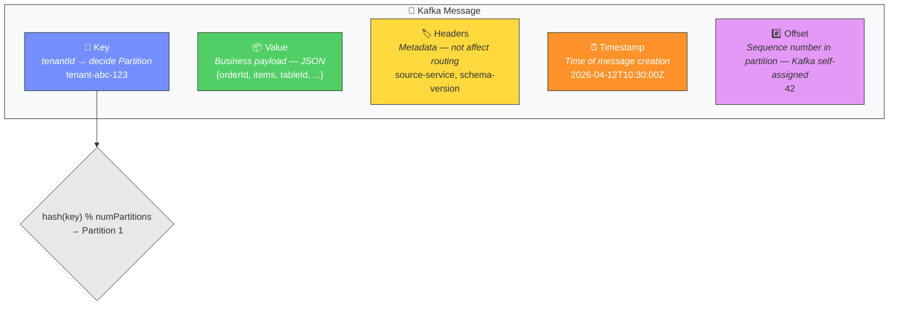

### 3.2 Example in QRTable

When Order service confirms an order from "The Coffee House" restaurant, message `order.confirmed` will look like:

```
Key: "tenant-abc-123" ← tenantId, partition decision
Value: {
  "version": "1.0",
  "timestamp": "2026-04-12T10:30:00Z",
  "tenantId": "tenant-abc-123",
  "orderId": "order-xyz-789",
  "tableId": "table-05",
  "sessionId": "session-qrs-456",
  "items": [
{ "menuItemId": "item-001", "name": "Milk coffee", "qty": 2, "type": "drink" },
{ "menuItemId": "item-045", "name": "Banh mi", "qty": 1, "type": "food" }
  ]
}
Headers: {
  "source-service": "order-service",
  "schema-version": "1.0"
}
```

#### Diagram: Message Flow `order.confirmed` In QRTable

> Sequence diagram showing the current journey of message `order.confirmed` — from when the staff confirms the order, Order service publishes to Kafka, until Kitchen service consumes and records Redis KDS. BFF does not consume `order.confirmed`; realtime order status goes through BFF Direct from the TCP response, while KDS queue hint goes through Kitchen Redis Pub/Sub after Redis has been written.

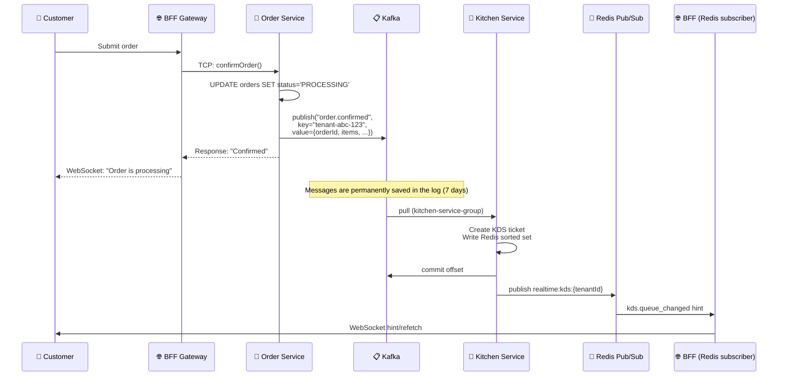

Note the `version` field in the value and `schema-version` in the header: this is to prepare for future schema changes without breaking the old consumer.

---

## 4. Topic, Partition and Physical Log

### 4.1 What is Topic

Topic is a logical name to group messages of the same type — similar to table names in a database. `order.confirmed`, `payment.completed` are different topics.

But a topic is not a file or a single queue. Behind, each topic is divided into many **partitions**.

### 4.2 Partition — Actual Unit

Partition is the actual physical unit in Kafka. Each partition is an **ordered, immutable, append-only log** stored on the broker's disk.

When you create topic `order.confirmed` with 3 partitions, Kafka actually creates 3 independent log files:

```
Topic: order.confirmed
├── Partition 0  ──  [msg@offset-0] [msg@offset-1] [msg@offset-4] [msg@offset-6] ...
├── Partition 1  ──  [msg@offset-0] [msg@offset-2] [msg@offset-5] [msg@offset-7] ...
└── Partition 2  ──  [msg@offset-0] [msg@offset-3] [msg@offset-8] ...
```

#### Diagram: Topic, Partitions and Offset

> Topic is the logical name, partition is the physical unit. Each partition is a separate log with a **separate** ascending offset sequence. Producer writes to partition based on hash(key). Note: offset 0 in Partition 0 and offset 0 in Partition 1 are two **completely different** messages.

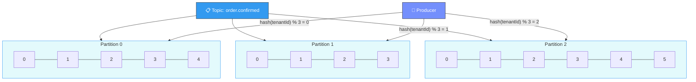

There are two important things to realize from this diagram:

**Observation 1 — Offset is per-partition, not per-topic:** Partition 0 has offset 0, Partition 1 also has its own offset 0. There is no "global offset" for the entire topic. When the consumer keeps track of read locations, it must keep track of `(partition, offset)` for each partition.

**Observation 2 — Ordering is only guaranteed within the same partition:** Messages in Partition 0 are guaranteed to be in the order they are written. But there is no guarantee about the relative order between messages in Partition 0 and Partition 1.

### 4.3 Why Many Partitions Are Needed

Partition is Kafka's scaling mechanism, in both directions:

**Scale write (producer):** Producer can write to multiple partitions in parallel. 3 partitions = 3 simultaneous write "threads", instead of a sequential queue.

**Scale read (consumer):** This is the more important reason. In Kafka, **each partition can only be processed by a maximum of 1 consumer in the same consumer group at a time**. This means: the number of topic partitions is the _upper limit_ for the level of parallelism that can be achieved in processing.

#### Diagram: Partition = Scale Unit

> Partition determines maximum parallelism. For example: 3 partitions → maximum 3 consumer instances processing in parallel. The 4th instance will be idle. This is the reason for choosing a "generous" number of partitions when designing the topic.

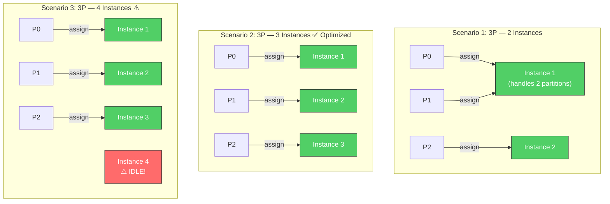

Example for QRTable: If `order.confirmed` has 3 partitions and Kitchen service deploys 3 instances, each instance processes 1 partition — the throughput increases by 3. If deploying 4 instances with 3 partitions, the 4th instance will sit idle because there is no more partition to assign.

### 4.4 Log Segment and Retention

Each partition is not a single file — it consists of many **log segments**, each segment is a file with a limited size (default 1GB). When the segment is full, Kafka closes it and creates a new segment.

#### Diagram: Log Segments and Retention

> Each partition includes many segment files. The oldest segment is deleted when the retention period expires (default 7 days). Kafka deletes **entire segments**, not individual messages — this is why Kafka is efficient with disk I/O (sequential write, batch delete).

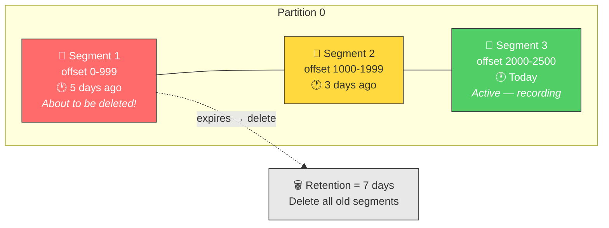

When the retention period expires (default 7 days), Kafka deletes the oldest segments — **but only the entire segment, not individual messages**. This is why Kafka is so effective with disk I/O: sequential writes, batch deletes, no random I/O like a regular database.

In QRTable's dev environment, there's not much need to worry about retention — the default 7 days is more than enough. Actual production needs to be tuned depending on traffic.

---

## 5. Replication and Ensuring Data Durability

### 5.1 Why Replication is Needed

Kafka is designed to run on multi-broker clusters (servers). If a broker crashes, data is not lost thanks to replication. Although QRTable Phase 2 runs single-broker (dev), understanding replication helps you configure it correctly and explain the architecture in your thesis.

### 5.2 Leaders and Followers

Each partition has a **leader** and many **followers** (number of followers = replication factor - 1):

- **Leader:** Handles all read and write requests for that partition
- **Followers:** Only copies data from the leader, does not serve clients directly

When a leader crashes, a follower in the ISR (In-Sync Replicas) list is elected as the new leader — this process is completely automatic.

#### Diagram: Replication — Leader, Follower and ISR

> Each partition has only 1 Leader who handles all read/write. Followers continuously fetch data from the Leader to synchronize. The set of **fully synchronized** replicas is called ISR. When a Leader collapses, a Follower in the ISR is automatically elected as the new Leader — no data loss.

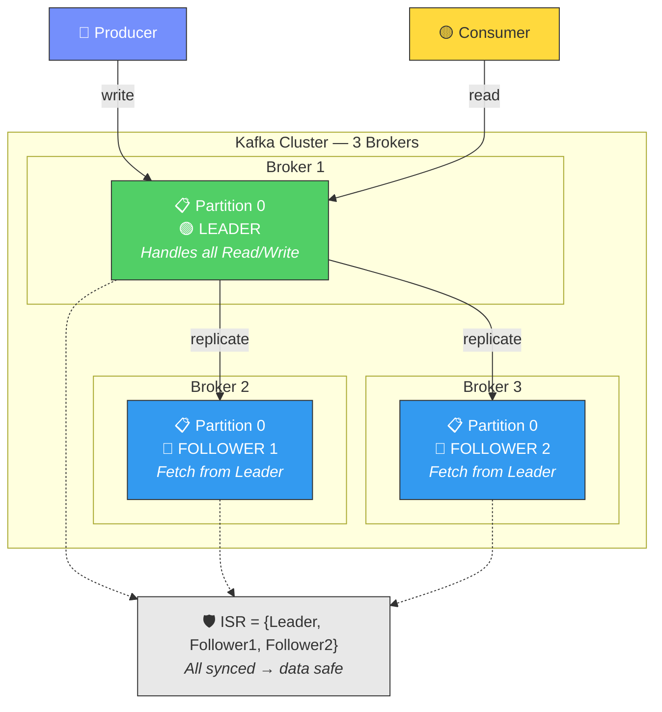

### 5.3 ISR — In-Sync Replicas

ISR is a collection of replicas (leader + followers) that have fully copied data from the leader. A follower is removed from the ISR if it lags too long (default 10 seconds without fetching from the leader).

ISR is a key concept to understanding the producer's `acks` setting.

### 5.4 Acks — How Long Does Producer Wait?

When the producer sends a message, it can configure the level of confirmation it wants to receive from the broker. Here's the trade-off between **safety** and **performance**:

`**acks=0` (fire-and-forget):\*\* Producer sends and does not wait for any confirmation from broker. Fastest but may lose data if the broker crashes immediately after receiving the packet. Suitable for non-critical log metrics — not for QRTables.

`**acks=1`:\*\* Producer waits for leader to finish recording before continuing. If the leader crashes before the follower can replicate, the message is lost. Acceptable for `kitchen.sla_warning` (event from internal timer, loss of a warning does not cause serious harm).

`**acks=all` (or `acks=-1`):\** Producer waits for *all\* replicas in the ISR to finish writing. This is the highest level of security — suitable for `order.confirmed`, `payment.completed`, `tenant.created` because losing these events has serious business consequences.

#### Diagram: Acks Levels — Trade-off Safety vs Performance

> Three levels of acks form a spectrum from fastest (acks=0) to safest (acks=all). QRTable chooses `acks=all` as the default for all business events, sacrificing a little latency to ensure no data loss.

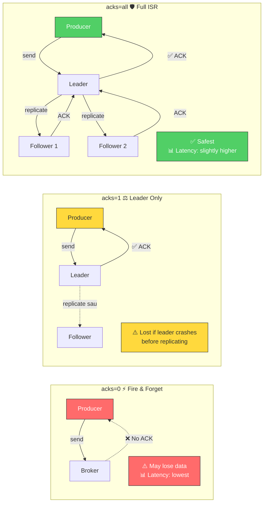

**Rules for QRTable:** Use `acks=all` along with `idempotent=true` (explained in part 6) as default for all producers. The added overhead is insignificant compared to the risk of losing the event.

---

## 6. Producer — Message Sending Mechanism

### 6.1 Lifecycle of a Message from Producer

When application code calls `producer.send(message)`, the message is not sent immediately. It goes through the following pipeline:

**Step 1 — Serialization:** Value and key are converted from object/string to byte array. Kafka doesn't care about content — it only knows bytes.

**Step 2 — Partitioner:** Kafka decides which partition this message goes into. Default logic: if there is a key then `partition = hash(key) % numPartitions`; If there is no key, then round-robin between partitions.

**Step 3 — Accumulator (Record Buffer):** The message is put into buffer memory, _waiting_ to be collected with other messages to send in batches. This is an important difference — the producer does not send individual messages.

**Step 4 — Sender Thread:** A background thread continuously checks the buffer and sends the batch to the broker when qualified.

#### Diagram: Producer Pipeline — From send() to Broker

> Complete Pipeline inside Kafka Producer. The message goes through four stages before actually being sent to the broker. In particular, the Accumulator step is the reason Kafka has high throughput — sending hundreds of messages in a network round-trip instead of one message at a time.

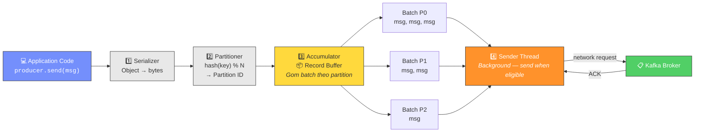

### 6.2 Batching — Why Kafka is Fast

The producer collects messages into batches before sending, controlled by two parameters:

`linger.ms`: Maximum waiting time for batch collection. If linger.ms=5, the producer waits up to 5ms to gather more messages before sending — even if the batch is not full. The default is 0 (send as soon as a message arrives), but increasing it to 5-10ms improves throughput significantly in high-traffic systems.

`batch.size`: Maximum size of a batch (bytes). When the size is sufficient, the batch is sent immediately without waiting for linger.ms to expire.

#### Diagram: Batching — linger.ms vs batch.size

> Two batch sending triggers: (1) timeout `linger.ms` or (2) full size `batch.size`. Whichever condition comes first will trigger sending. For low traffic QRTables, the default (linger.ms=0) is enough.

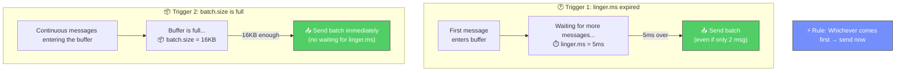

With QRTable — low traffic (a few dozen orders/hour per restaurant) — default batching is enough. But understanding this mechanism helps you explain why Kafka has low latency (sub-millisecond) and still achieves high throughput.

### 6.3 Idempotent Producer — Resolving Duplicate When Retrying

**Problem:** Producer sends message, broker receives and writes, but network timeout occurs before ACK reaches producer. The producer doesn't know if it was sent successfully or not, so it retries — the broker receives it a second time and records another copy. Result: `order.confirmed` appears twice in Kafka, Kitchen service creates 2 tickets for the same order.

#### Diagram: Duplicate Problem and Idempotent Producer Solution

> **Left**: No idempotent — producer retry creates duplicate message. **Right**: With idempotent — broker detects duplicates via (PID, SeqNum) and ignores duplicates. Result: Kitchen service only received 1 message.

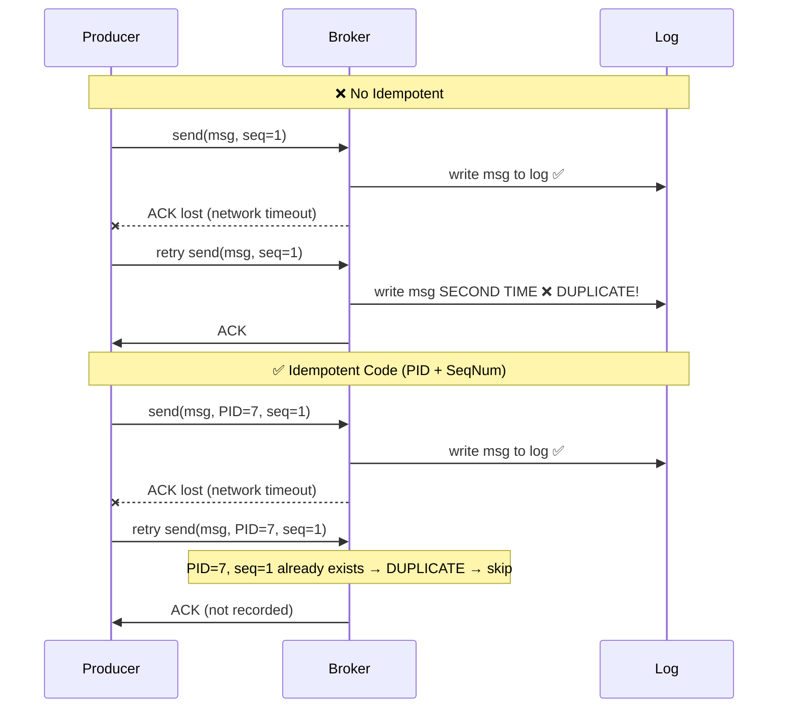

**Solution — Idempotent Producer:** When `idempotent=true` is enabled, Kafka grants each producer instance a unique `Producer ID (PID)`. Each message is numbered `Sequence Number` in ascending per-partition numbers. Broker checks: if receiving a message with `(PID, SequenceNumber)` identical to the saved message → it is duplicate → ignore.

This mechanism is completely transparent to the application code — you only need to turn on one flag, Kafka takes care of the rest.

**Important limitation:** Idempotent producers only dedup in the same _session_ (from the time the producer starts until it is restarted). If Order service crashes and restarts, it receives a new PID → cannot dedup duplicates that occurred before the crash. This is the reason why the Outbox Pattern is needed (see section 10) to ensure truly-once at the application layer.

### 6.4 Producer's Ordering Guarantee

Kafka ensures: **messages from the same producer to the same partition are written in the correct order sent**.

However, with `max.in.flight.requests.per.connection > 1` (default 5), the producer can send multiple batches in parallel before receiving the ACK. If batch 1 fails and retry after batch 2 has succeeded → ordering is reversed. When `idempotent=true` is enabled, Kafka automatically fixes this issue by ensuring the broker reorders according to the sequence number.

#### Diagram: Ordering — Problems and Solutions

> When `max.in.flight > 1`, two batches sent in parallel can be reversed if the first batch fails and retries. `idempotent=true` solves this by having the broker reorder by sequence number.


**Practical conclusion:** With `idempotent=true` (recommend for QRTable), you get both: no-duplicate and in-order delivery per partition.

---

## 7. Consumer and Consumer Group

### 7.1 Pull Model vs Push Model

This is the most important architectural difference between Kafka and traditional queues.

**Push model (RabbitMQ):** Broker actively pushes messages to consumers. If the consumer processes slowly, it is flooded with messages. The broker must understand the _speed_ of each consumer to control traffic — this is complex logic.

**Pull model (Kafka):** Consumer actively asks broker "give me at most N messages from offset M of partition P". Consumer has complete control over processing speed. If Kitchen service is processing a complex order and needs more time, it simply doesn't fetch more — no need to notify Kafka.

#### Diagram: Push vs Pull Model

> **Push** (RabbitMQ): Broker controls speed, consumers are flooded if slow. **Pull** (Kafka): Consumer controls the speed, decides when to fetch again. The Pull model allows consumers to process according to their capabilities, without creating backpressure on the broker.

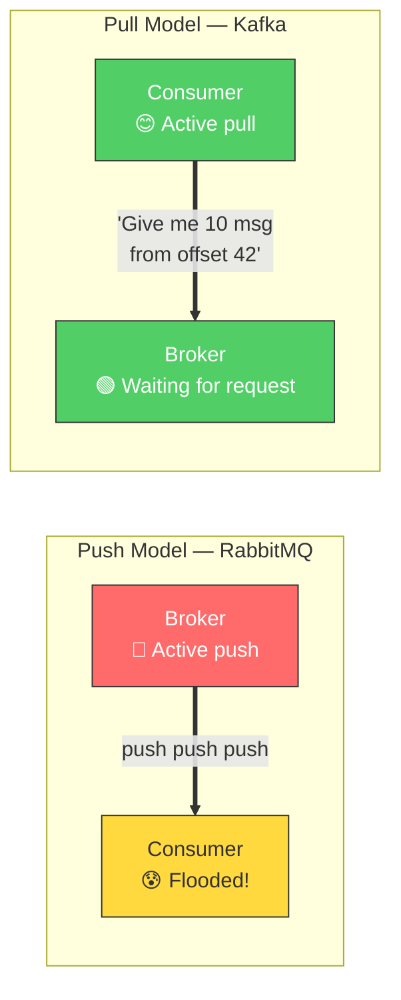

Consequence: Consumers can batch multiple messages in a single fetch, process them at once, and then commit them all — much more efficiently than processing individual messages.

### 7.2 Offset — Consumer Bookmark

Offset is the sequence number of the message in the partition. The consumer needs to remember the offset of the message _it finally processed successfully_ so that when it restarts, it knows where to continue from.

Where is the consumer's offset stored? Kafka uses a special internal topic named `__consumer_offsets`. When the consumer "commits" the offset, it is essentially writing to this topic: "consumer group X has processed up to offset Y of partition Z on topic T".

#### Diagram: Offset Tracking and Commit

> Consumer keeps track of read position by offset. When processing is complete, the consumer "commits" the offset — essentially writing to the internal topic `__consumer_offsets`. When restarting, the consumer reads the committed offset again to know where to continue from.

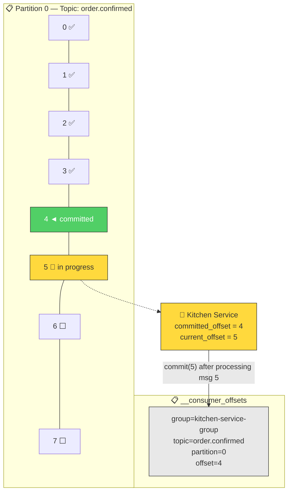

Here's the key point: **offset commitment is the act of writing an addition to the Kafka log**, not deleting a message or updating state somewhere. Different consumer groups have their own offsets, completely independent.

### 7.3 Consumer Group — Scale Mechanism

A consumer group is a group of consumer instances that share the work of reading a topic. Core rule: **each partition can only be assigned to a maximum of one consumer instance in the same group at a time**.

Let's imagine topic `order.confirmed` has 3 partitions and Kitchen service has 2 instances:

```
Partition 0 ──────────► Kitchen Instance 1
Partition 1 ──────────► Kitchen Instance 1  (1 instance handles 2 partitions)
Partition 2 ──────────► Kitchen Instance 2
```

When deploying a third instance:

```
Partition 0 ──────────► Kitchen Instance 1
Partition 1 ──────────► Kitchen Instance 2
Partition 2 ──────────► Kitchen Instance 3
```

When deploying the 4th instance (with still 3 partitions):

```
Partition 0 ──────────► Kitchen Instance 1
Partition 1 ──────────► Kitchen Instance 2
Partition 2 ──────────► Kitchen Instance 3
Kitchen Instance 4 ──── idle (no partitions)
```

**Important insight:** The topic's partition number is the _bottleneck_ of scalability. There cannot be more consumers processing in parallel than the number of partitions. This is the reason why when designing a topic, you should choose a "generous" number of partitions — increasing the partition later is more difficult than decreasing it (rebalancing all data).

### 7.4 Partition Assignment and Rebalancing

When a consumer group changes (new consumer joins, old consumer leaves, or crashes), Kafka needs to redistribute the partition — called **rebalancing**.

#### Diagram: Rebalancing Flow

> Rebalancing process when a new consumer joins or an old consumer leaves the group. During rebalancing, **the entire group stops processing** (stop-the-world), causing temporary downtime. Static Group Membership reduces the frequency of rebalances by allowing consumers to temporarily disconnect without triggering a rebalance.

```mermaid
sequenceDiagram
    participant C1 as Consumer 1
    participant C2 as Consumer 2
participant C3 as Consumer 3 (New)
    participant GC as Group Coordinator

Note over C1,GC: Before C3 joins
    C1->>GC: Heartbeat (P0, P1 assigned)
    C2->>GC: Heartbeat (P2 assigned)

    Note over C1,GC: 🔄 C3 Join → Trigger Rebalance
    C3->>GC: JoinGroup request
GC->>C1: Revoke partitions ⏸️ STOP processing
GC->>C2: Revoke partitions ⏸️ STOP processing

Note over C1,GC: ⚠️ STOP-THE-WORLD — No one handled it

GC->>C1: Leader — calculates new assignment
    C1->>GC: Assignment: C1=P0, C2=P1, C3=P2

    GC->>C1: Assign P0 ▶️ Resume
    GC->>C2: Assign P1 ▶️ Resume
    GC->>C3: Assign P2 ▶️ Resume
```

**Rebalancing process:**

1. A special broker (Group Coordinator) receives notification of changes in the group
2. Group Coordinator requests all consumers in the group to "leave" the current partition — the entire group stops processing
3. Consumer elected as **Group Leader** (usually the consumer who joins the earliest) receives the list of existing consumers and calculates the new assignment
4. Assignment is sent to each consumer via Group Coordinator
5. Consumer resume processes with new partition

**The problem with rebalancing:** During rebalancing, the entire consumer group _stops processing_ — called "stop-the-world". For systems that need low latency like QRTable's KDS, this is undesirable.

**How to reduce rebalancing frequency:** Use `Static Group Membership` — each consumer is assigned a fixed `instanceId`. When the consumer disconnects and reconnects between `sessionTimeout`, Kafka recognizes it as the old consumer (same instanceId) and does not trigger rebalance. Only if the consumer does not reconnect during the timeout period is it considered to have left the group.

### 7.5 Auto Commit vs Manual Commit — Dangerous Choice

This is one of the most difficult sources of bugs to debug with Kafka.

#### Diagram: Auto Commit — Lost Message Danger

> Illustration of message loss scenario with auto commit. Auto commit runs according to time (every 5 seconds), not according to processing results. If the consumer crashes mid-stream, the committed but unprocessed messages will be **lost forever** — Kitchen service never receives the ticket.

```mermaid
graph TB
subgraph "❌ Auto Commit — Loses 4 messages"
        direction TB
        AC1["12:00:00 — Fetch 10 message (offset 0-9)"]
AC2["12:00:03 — Finished processing msg 0-5"]
AC3["12:00:05 — ⚡ AUTO COMMIT offset=9<br/><i>Commit took 10 msg even though it only processed 6</i>"]
AC4["12:00:06 — 💥 CRASH when processing msg 6"]
AC5["12:00:10 — Restart → read from offset 10<br/>❌ Messages 6,7,8,9 LOST FOREVER"]

        AC1 --> AC2 --> AC3 --> AC4 --> AC5
    end

subgraph "✅ Manual Commit — No loss"
        direction TB
        MC1["12:00:00 — Fetch 10 message"]
MC2["12:00:03 — Finished processing msg 0-5"]
        MC3["12:00:03 — Manual commit offset=5"]
MC4["12:00:06 — 💥 CRASH when processing msg 6"]
MC5["12:00:10 — Restart → read from offset 6<br/>✅ Messages 6,7,8,9 are processed again"]

        MC1 --> MC2 --> MC3 --> MC4 --> MC5
    end

    style AC3 fill:#ff6b6b,stroke:#333,color:#fff
    style AC5 fill:#ff6b6b,stroke:#333,color:#fff
    style MC3 fill:#51cf66,stroke:#333,color:#fff
    style MC5 fill:#51cf66,stroke:#333,color:#fff
```

**Auto Commit:** Kafka automatically commits offset at intervals (default every 5 seconds). Problem: commits happen based on time, not on processing results. If the consumer fetches 10 messages at 12:00:00, auto commit runs at 12:00:05 and commits all 10 messages, but the consumer has only processed 6/10. Consumer crashes at 12:00:06 while processing message 7. When restarting, Kafka sees the offset committed → ignores messages 7, 8, 9, 10. **4 messages are completely lost** — Kitchen service did not receive 4 tickets.

**Manual Commit:** Consumer commits the offset himself after processing and confirmation is successful. This is the correct model for QRTable:

```
1. Consumer fetch message
2. Process messages (create KDS ticket, write Redis, etc.)
3. SUCCESSFUL processing → commit offset
4. Handling FAILURE → DO NOT commit → message is fetched again upon restart
```

The default NestJS Kafka transport implements manual commit this way: normal handler return → commit; handler throws exception → does not commit → message will be processed again. Understand this mechanism so you can use try-catch properly (don't catch and swallow exceptions if you want to retry).

---

## 8. Delivery Semantics

### 8.1 Three Levels of Guarantee

**At-most-once (maximum 1 time):** Message is processed no more than once, but may not be processed at all (lost). Achieved by committing offset _before_ processing. If crash occurs after commit, before processing → message is skipped.

This is the lowest level, suitable for "throwaway" data such as monitoring metrics — not critical if a few data points are lost. **QRTable does not use at-most-once** for any business events.

**At-least-once (at least once):** Message is processed at least once, possibly more (duplicate). Achieved by committing the offset _after_ successful processing. If there is a crash after processing but before commit → the message is fetched and processed again.

**This is QRTable's selection for all approved Kafka topics.** Mandatory consequence: every consumer processing a message must be **idempotent** — that is, processing the same message twice must produce identical results as processing it once.

**Exactly-once (exactly once):** Message is processed exactly once. Kafka supports this through Kafka Transactions — combining idempotent producers, transactional APIs, and `read_committed` isolation on consumers. Significantly more complex, has performance overhead, and requires both producer and consumer to be in the Kafka ecosystem (not applicable when consumers write to PostgreSQL or Redis).

**QRTable does not implement exactly-once** at the Kafka level. Instead, ensure idempotency at the application layer — simpler and sufficient for the project scope.

#### Diagram: Delivery Semantics Spectrum

> Three levels of delivery semantics form a spectrum. QRTable select **At-least-once** (middle area) — ensures no message loss, accepts duplicates, and handles duplicates with idempotency at the application layer. This is the most common choice in production.

```mermaid
graph TB
    subgraph "📊 Delivery Semantics Spectrum"
AT_MOST["⚡ At-Most-Once<br/>───────────────<br/>Commit BEFORE processing<br/>✅ Fast, simple<br/>❌ May LOSE message<br/>───────────────<br/>📌 Metrics, logs"]

AT_LEAST["⚖️ At-Least-Once<br/>───────────────<br/>Commit AFTER processing<br/>✅ No message lost<br/>⚠️ Can DUPLICATE<br/>→ Need idempotent consumer<br/>───────────────<br/>📌 QRTable ✅ SELECT"]

EXACTLY["🛡️ Exactly-Once<br/>───────────────<br/>Kafka Transactions<br/>✅ Exactly once<br/>❌ Complex, high overhead<br/>❌ Only in Kafka ecosystem<br/>───────────────<br/>📌 Not for QRTable"]
    end

AT_MOST ---|"Increase safety →"| AT_LEAST ---|"Increase complexity →"| EXACTLY

    style AT_MOST fill:#ff6b6b,stroke:#333,color:#fff
    style AT_LEAST fill:#51cf66,stroke:#333,color:#fff
    style EXACTLY fill:#748ffc,stroke:#333,color:#fff
```

### 8.2 Idempotent Consumer — Safe Duplicate Handling

Since at-least-once may send messages more than once, consumers must be designed to handle duplicates without harm.

**Specific example:** Suppose `order.confirmed` with orderId="order-789" is received by Kitchen service twice (due to a crash after processing but before committing). If Kitchen service does not have an anti-duplicate mechanism, it will create 2 KDS tickets for the same order — the kitchen will make 2 times the amount of food.

**Solution — Idempotency Key + Deduplication Store:**

Before processing an event, the consumer checks to see if this event has been processed by looking up a unique key in the store (usually Redis). If it has already been processed → skip. If not → process then mark as processed.

#### Diagram: Idempotent Consumer Flow

> Complete flowchart handling idempotency at consumers. Each message is checked through the Redis idempotency key before processing. If the key already exists → this is a duplicate → safely skip. 24h TTL is enough to cover all retry scenarios.

```mermaid
flowchart TD
START(["📨 Receive order.confirmed<br/>orderId=order-789<br/>tenantId=t-001"]) --> KEY["🔑 Create idempotency key<br/><code>kds_processed:t-001:order-789</code>"]

KEY --> CHECK{"🔍 Key exists<br/>in Redis?"}

CHECK -->|"YES → DUPLICATE"| SKIP["⏭️ Skip<br/>Return now"]
    SKIP --> COMMIT_SKIP["✅ Commit offset"]

CHECK -->|"NO → First time"| PROCESS["⚙️ Processing:<br/>Create KDS ticket<br/>in Redis sorted set"]

PROCESS --> WRITE_KEY["📝 Ghi idempotency key<br/>to Redis (TTL=24h)"]

    WRITE_KEY --> COMMIT["✅ Commit Kafka offset"]

PROCESS -->|"❌ Failure"| NO_COMMIT["❌ NO commit<br/>→ Message will be retried"]

    style START fill:#748ffc,stroke:#333,color:#fff
    style CHECK fill:#ffd93d,stroke:#333,color:#333
    style SKIP fill:#e8e8e8,stroke:#333
    style PROCESS fill:#339af0,stroke:#333,color:#fff
    style WRITE_KEY fill:#51cf66,stroke:#333,color:#fff
    style COMMIT fill:#51cf66,stroke:#333,color:#fff
    style COMMIT_SKIP fill:#51cf66,stroke:#333,color:#fff
    style NO_COMMIT fill:#ff6b6b,stroke:#333,color:#fff
```

```
When receiving order.confirmed with orderId="order-789", tenantId="t-001":

1. Create idempotency key: "kds_processed:t-001:order-789"
2. Check Redis: does this key exist?
- YES → this is duplicate, ignore (return immediately)
- NO → continue processing
3. Processing: create KDS ticket in Redis sorted set
4. Write the idempotency key to Redis with a 24-hour TTL
5. Commit Kafka offset
```

A 24-hour TTL is enough because Kafka retries typically happen in seconds to minutes, not the next day.

**Important note about the order of steps 4 and 5:** Must write the idempotency key _before_ committing offset. If a crash occurs after step 3 (ticket creation) but before step 4 (write key) and before step 5 (commit offset), the message will be retried. The retry, because the idempotency key has not been written, the consumer will process again — but this time the key is written successfully. If you write the key after the commit offset, there is a small race condition but in practice with single-threaded consumers it doesn't cause a problem.

---

## 9. Architecture Decision: Kafka vs BFF Direct in QRTable

### 9.1 4P+2AP Framework — The Real Meaning

The QRTable architecture defines a 4P+2AP rule set to decide which events go through Kafka and which events use BFF Direct. This section explains the in-depth meaning of each principle.

#### Diagram: Framework 4P+2AP — Panorama

> Complete framework with 4 principles "Use Kafka when..." (P1-P4) and 2 anti-patterns "DO NOT use Kafka when..." (AP1-AP2). Each principle is illustrated with specific examples in the QRTable.

```mermaid
graph TB
    FRAMEWORK["🏗️ Framework 4P + 2AP"]

subgraph POSITIVE["✅ 4P — Use Kafka When..."]
P1["P1: Cross-Context Reaction<br/><i>Business logic in another BC</i><br/>📌 order.confirmed → Kitchen creates ticket"]
P2["P2: Temporal Decoupling<br/><i>Producer cannot wait</i><br/>📌 kitchen.sla_warning from timer"]
P3["P3: Fan-out<br/><i>1 event → many consumers</i><br/>📌 payment.completed → 3 services"]
P4["P4: Atomicity Safeguard<br/><i>Event tied to DB write</i><br/>📌 Outbox Pattern"]
    end

subgraph NEGATIVE["❌ 2AP — DO NOT Use Kafka When..."]
AP1["AP1: Kafka as UI Proxy<br/><i>BFF already has enough info → BFF Direct</i><br/>📌 order.created, menu.updated"]
AP2["AP2: Sync for Fire-and-Forget<br/><i>Don't use TCP for tasks<br/>that don't need a response</i>"]
    end

    FRAMEWORK --> POSITIVE
    FRAMEWORK --> NEGATIVE

    style FRAMEWORK fill:#748ffc,stroke:#333,color:#fff
    style POSITIVE fill:#d3f9d8,stroke:#51cf66
    style NEGATIVE fill:#ffe3e3,stroke:#ff6b6b
    style P1 fill:#51cf66,stroke:#333,color:#fff
    style P2 fill:#51cf66,stroke:#333,color:#fff
    style P3 fill:#51cf66,stroke:#333,color:#fff
    style P4 fill:#51cf66,stroke:#333,color:#fff
    style AP1 fill:#ff6b6b,stroke:#333,color:#fff
    style AP2 fill:#ff6b6b,stroke:#333,color:#fff
```

**P1 — Cross-Context Domain Reaction:**

This is the core principle of Event-Driven Architecture. Kafka is suitable when a state change in Bounded Context A needs to trigger **independent business logic** in Bounded Context B.

The keyword is "independent business logic" — not UI update, not cache invalidation, but actual business logic that belongs to the bounded receiving context.

Example of applying P1 in QRTable: When an order is confirmed (Order Context), Kitchen service (Kitchen Context) needs to create a KDS ticket — this is Kitchen's business logic, not Order. Order service should not know or care how Kitchen handles tickets. → `order.confirmed` via Kafka.

On the contrary, when the staff confirms the order and the BFF needs to push the WebSocket update to the client — this is not business logic of another bounded context, just a UI side-effect. BFF already has enough information from the TCP response. → Don't use Kafka, use BFF Direct.

**P2 — Temporal Decoupling:**

Use Kafka when the producer is not allowed to wait for the consumer to finish processing. There are two specific cases:

_Case 1 — Long-running consumer:_ Kitchen service can process a ticket creation in a few seconds. Order service cannot wait for Kitchen to finish processing before returning the response to the customer — that is bad UX and creates time coupling.

_Case 2 — Event generated from internal timer:_ `kitchen.sla_warning` is generated by Kitchen service's internal timer when a ticket exceeds the threshold time. This event is not associated with any HTTP request, there is no "caller" to return the response. Cannot use TCP or BFF Direct. → Must go through Kafka.

**P3 — Fan-out:**

Kafka is especially suitable when the same event needs to trigger a business response in many different bounded contexts. Producer publishes once, every consumer receives regularly.

Current example: `payment.completed` needs to handle Order service (close session, mark bill paid, call Catalog TCP to update table status) and BFF realtime bridge (hint UI). If you use TCP fan-out for every side-effect, the Payment service will know too much downstream. With Kafka, Payment publishes an event; Order/BFF consumes itself. Notification/email receipt is a future-extension consumer.

#### Diagram: Fan-out — payment.completed

> Illustrate P3 Fan-out through the example `payment.completed`. Payment service publishes a single event → 3 consumer groups with 3 completely different business logic process at the same time. Adding Analytics service in the future just requires a subscription — **do not edit Payment service code**.

```mermaid
graph LR
PAY["💳 Payment service<br/><i>Publish once only</i>"]
    TOPIC["📋 payment.completed"]

    PAY -->|"publish"| TOPIC

TOPIC -->|"consume"| OS["🛒 Order service<br/>Close session/bill<br/>Call Catalog TCP"]
    TOPIC -->|"consume"| BFF["🌐 BFF Bridge<br/>WebSocket hint"]
    TOPIC -.->|"future extension"| NS["📧 Notification Service<br/>Email receipt/audit"]
TOPIC -.->|"future"| AS2["📊 Analytics service<br/><i>Just subscribe</i><br/><i>Don't edit Payment!</i>"]

    style PAY fill:#748ffc,stroke:#333,color:#fff
    style TOPIC fill:#339af0,stroke:#333,color:#fff
    style OS fill:#51cf66,stroke:#333,color:#fff
    style CS fill:#51cf66,stroke:#333,color:#fff
    style NS fill:#51cf66,stroke:#333,color:#fff
    style AS2 fill:#e8e8e8,stroke:#999,stroke-dasharray: 5 5
```

**P4 — Atomicity Safeguard:**

When a domain event is the result of a database write, the event _must_ be written in the same database transaction as that state change. Otherwise, a situation may occur: DB write succeeds but Kafka publish fails → system inconsistent.

This is the reason for the Outbox Pattern (see section 10). P4 was intentionally simplified in early Phase 2 work to reduce complexity. The current implementation uses local outbox records for the Order and Payment flows that need durable Kafka publication, while deeper CDC/Debezium-style hardening remains future operational work.

**AP1 — Kafka as UI Proxy (Forbidden):**

Kafka is NOT a message bus for everything. Specifically: do not use Kafka just to bridge UI side-effects when the BFF already has enough information after the TCP response.

Quick test: "Does this side-effect need business logic in another bounded context?"

- No → BFF already has enough information → BFF Direct
- Yes → Kafka

Using Kafka for `order.created` (BFF learned after the customer submitted the order) or `menu.updated` (BFF just called Catalog service and received response) is a waste of infrastructure, adds latency, and does not solve any business problems.

**AP2 — Sync for Fire-and-Forget (Forbidden):**

Do not use TCP/gRPC for tasks where the producer does not need a response, especially when the consumer may be slow to process or temporarily unavailable. This is the reverse of AP1 — if a task is "fire-and-forget", use Kafka; If you need an immediate response, use TCP.

### 9.2 Analyze Each Topic

#### Diagram: Event Map — All Topics In QRTable

> Panoramic map of 5 Kafka topics and typical BFF Direct events in QRTable. Each topic is labeled with the corresponding 4P+2AP principle. Looking from above, you can clearly see which producer publishes which event, and which consumer that event goes to.

```mermaid
graph TB
    subgraph KAFKA_EVENTS["📋 Kafka Topics — 5 Events"]
        subgraph T1["order.confirmed (P1+P2)"]
            T1_PROD["🛒 Order Service"]
            T1_CONS1["🍳 Kitchen Service"]
        end
        subgraph T2["payment.completed (P1+P2+P3)"]
            T2_PROD["💳 Payment Service"]
            T2_CONS1["🛒 Order Service"]
            T2_CONS2["🌐 BFF Bridge"]
        end
        subgraph T3["kitchen.sla_warning (P2)"]
            T3_PROD["🍳 Kitchen Timer"]
            T3_CONS1["🌐 BFF Bridge"]
        end
        subgraph T4["tenant.created (P1+P3)"]
            T4_PROD["🏢 SaaS Mgmt"]
            T4_CONS1["📋 Catalog Service"]
        end
        subgraph T5["order.status_changed (P4)"]
            T5_PROD["🛒 Order Service"]
            T5_CONS1["📊 Projection/Audit<br/>future"]
        end
    end

    subgraph BFF_EVENTS["🌐 BFF Direct / Socket Events"]
        BE1["order.created"]
        BE2["events.orderStatusChanged"]
        BE3["service.requested"]
        BE4["cart.updated"]
        BE5["bill.requested"]
        BE6["table.transferred"]
        BE7["tenant.suspended/activated/closed"]
    end

    style KAFKA_EVENTS fill:#e3fafc,stroke:#339af0
    style BFF_EVENTS fill:#fff3bf,stroke:#ffd93d
```

`**order.confirmed` → Kafka (P1 + P2)\*\*

P1: Kitchen service has independent business logic (routing by dish type, creating FIFO tickets, priorities and SLA). Order service shouldn't know that.

P2: Order service must not wait for Kitchen to finish creating the ticket. Kitchen can process multiple orders simultaneously, taking a few seconds. Customer must receive the "Order confirmed" response immediately.

`**order.status_changed` → Kafka (P4, durable stream)\*\*

P4: Order status transitions are database-backed domain state. The Kafka topic exists for durable status projection/audit or future downstream consumers. It is not used as the immediate UI push path; BFF still emits `events.orderStatusChanged` directly from successful TCP responses.

`**payment.completed` → Kafka (P1 + P2 + P3)\*\*

P1: Current code has two consumer runtimes — Order closes session/bill and calls Catalog TCP to update table; BFF realtime bridge plays UI hint. Notification/email is outside current scope and only a future extension.

P2: Payment service must not wait for downstream consumers to complete processing.

P3: Current fan-out includes Order and BFF; To add Notification/Analytics later, just subscribe, do not edit Payment service.

`**kitchen.sla_warning` → Kafka (Pure P2)\*\*

This is the only event in QRTable that does not have a "core" producer (P1) or fan-out (P3). It only needs Kafka because P2: generated from internal timer, not attached to any request. BFF Direct is not applicable.

`**tenant.created` → Kafka (P1 + P3)\*\*

P1: Catalog service seeds the default area from `tenant.created` in the current code. Notification service is not a current consumer; it is only a future-extension option if reintroduced.

P3: Current consumer is Catalog; Notification/IAM/Billing future consumers can subscribe later without editing the SaaS Mgmt code.

---

## 10. Dual-Write Problem and Outbox Pattern

### 10.1 Dual-Write Problem — Hidden Dangerous Problem

Consider the following logic — seemingly correct but actually very dangerous:

```
// In Order service, when confirming an order:
BEGIN TRANSACTION
  UPDATE orders SET status = 'PROCESSING' WHERE id = orderId
COMMIT TRANSACTION

// Afterward:
publish event 'order.confirmed' to Kafka
```

#### Diagram: Dual-Write Problem — Crash Between Two Writes

> Illustration of dangerous scenario: server crashes in the space between DB commit and Kafka publish. The DB has been updated but Kafka has not received the event yet → the system is permanently inconsistent. Kitchen service never knew this order existed.

```mermaid
sequenceDiagram
    participant OS as 🛒 Order Service
    participant DB as 🗄️ PostgreSQL
    participant K as 📋 Kafka

    OS->>DB: BEGIN TRANSACTION
    OS->>DB: UPDATE orders SET status='PROCESSING'
    OS->>DB: COMMIT ✅

    Note over OS: 💥 SERVER CRASH!

OS--xK: publish order.confirmed ❌ NOT SENT

Note over DB,K: 🚨 INCONSISTENT STATE<br/>DB: order = PROCESSING ✅<br/>Kafka: NO event ❌<br/>Kitchen: DOES NOT know this order!
```

If the server crashes after a transaction commit but before publishing Kafka, the DB and Kafka state will be out of sync:

- Database: order is in state `PROCESSING`
- Kafka: no event `order.confirmed`
- Kitchen service: never knew this order existed → kitchen ticket was not created

This is called the **Dual-Write Problem**: you need to write to two systems (DB and Kafka) and want both to succeed or both to fail — but there is no distributed transaction that spans both.

### 10.2 Solution: Transactional Outbox Pattern

Core idea: instead of writing to Kafka directly, write the "publish intent" to the _same database_ in the _same transaction_ as the business state change. Then, a separate process reads these "intents" and actually publishes them to Kafka.

#### Diagram: Outbox Pattern — Complete Flow

> Complete flow of Transactional Outbox Pattern in 3 steps. **Step 1**: Record business data AND outbox event in the same transaction (atomic). **Step 2**: Background poller scans the outbox table every 1-2 seconds. **Step 3**: Publish to Kafka and mark PUBLISHED. If the poller crashes → the record is still PENDING → retry → duplicate but the consumer is idempotent.

```mermaid
graph TB
subgraph STEP1["Step 1: Atomic Write — Same Transaction"]
        TX_START["BEGIN TRANSACTION"]
        BIZ_WRITE["UPDATE orders<br/>SET status='PROCESSING'"]
        OUTBOX_WRITE["INSERT INTO outbox_events<br/>(topic, payload, status='PENDING')"]
        TX_END["COMMIT ✅"]

        TX_START --> BIZ_WRITE --> OUTBOX_WRITE --> TX_END
    end

subgraph STEP2["Step 2: Poller Scans Outbox"]
POLL["🔄 Background Poller<br/>(every 1-2 seconds)"]
        QUERY["SELECT * FROM outbox_events<br/>WHERE status = 'PENDING'"]
        POLL --> QUERY
    end

subgraph STEP3["Step 3: Publish & Update"]
PUB["📤 Publish to Kafka"]
        UPDATE["UPDATE outbox_events<br/>SET status='PUBLISHED'"]
        PUB --> UPDATE
    end

TX_END -.->|"Data ready<br/>in DB"| POLL
    QUERY --> PUB

SAFE["🛡️ SAFE:<br/>• Crash after step 1 → Poller will send<br/>• Crash after publish, before update → PENDING → resubmit (duplicate)<br/>• Consumer idempotent → safe duplicate"]

    style STEP1 fill:#d3f9d8,stroke:#51cf66
    style STEP2 fill:#e3fafc,stroke:#339af0
    style STEP3 fill:#fff3bf,stroke:#ffd93d
    style SAFE fill:#e8e8e8,stroke:#333
```

**Step 1 — Design table `outbox_events`:**

This table is in the same database as the business data (for example: `qrtable_order`). It stores the message that needs to be published but has not yet been published:

```
outbox_events:
  id            UUID           -- primary key
aggregate_id VARCHAR -- id of related entity (orderId)
topic VARCHAR -- Kafka topic name
payload JSONB -- message content
partition_key VARCHAR -- key to select partition (tenantId)
  status        VARCHAR        -- 'PENDING' | 'PUBLISHED' | 'FAILED'
  created_at    TIMESTAMPTZ
  published_at  TIMESTAMPTZ
```

**Step 2 — Atomic write in transaction:**

```
BEGIN TRANSACTION
  UPDATE orders SET status = 'PROCESSING' WHERE id = orderId  ← business write
INSERT INTO outbox_events (topic, payload, ...) VALUES (...)  ← "publish intent"
COMMIT TRANSACTION
```

Now both either succeed or rollback. It is not possible to have the status "DB updated but event not scheduled to be published".

**Step 3 — Poller/Relay process:**

A background job (cron runs every 1-2 seconds) scans table `outbox_events` to find records with status = `PENDING`:

```
Find PENDING records
For each record:
→ Publish to Kafka with the corresponding topic and payload
→ If successful → UPDATE status = 'PUBLISHED'
→ If failed → keep PENDING, retry next time (or increase retry_count)
```

#### Diagram: Comparison of Naive vs Outbox — Crash Safety

> Compare two approaches: **Naive** (write to DB then publish Kafka sequentially) vs **Outbox** (write both to DB in the same transaction). For every crash scenario, the Outbox pattern ensures consistency — either both successes, or both rollbacks.

```mermaid
graph TB
subgraph NAIVE["❌ Naive: DB → Sequential Kafka"]
        N1["DB Commit ✅"] --> N2["💥 CRASH"]
N2 --> N3["Kafka Publish ❌ NOT SENT"]
        N4["→ INCONSISTENT 💀"]
    end

subgraph OUTBOX["✅ Outbox: Same Transaction"]
        O1["DB Commit + Outbox ✅"] --> O2["💥 CRASH"]
O2 --> O3["Poller finds PENDING<br/>→ Publish Kafka ✅"]
O4["→ CONSISTENT ✅<br/>(duplicate but idempotent)"]
    end

    style NAIVE fill:#ffe3e3,stroke:#ff6b6b
    style OUTBOX fill:#d3f9d8,stroke:#51cf66
    style N4 fill:#ff6b6b,stroke:#333,color:#fff
    style O4 fill:#51cf66,stroke:#333,color:#fff
```

**Why is it safe?** If the poller crashes after publishing but before updating the status → the record is still PENDING → republished. This is a duplicate, but the consumer is idempotent (section 8.2) so the duplicate is safe. To summarize: Outbox pattern ensures **at-least-once delivery from DB to Kafka**.

### 10.3 Scope For QRTable

Phase 2A originally described a simpler implementation path. The current code now uses local outbox rows for important domain events such as `order.confirmed` and `payment.completed`, and Phase 4A adds the representative Order Confirm Saga around stock deduction plus outbox commit. Full CDC/Debezium hardening is still outside the main thesis scope. Understanding this pattern from the beginning has two benefits:

1. Design Phase 2A code to easily migrate to Outbox later (emit logic is separate from business logic)
2. This trade-off document in the thesis — demonstrates senior thinking: knowing risks, having a migration plan, not pretending the problem does not exist

---

## 11. Partition Strategy for Multi-tenant

### 11.1 Ordering Problems in Multi-tenant Systems

QRTable is SaaS with many restaurants (tenants). Each tenant operates independently — "The Coffee House" orders are not related to "Pizza Hut" orders.

In Kafka, ordering is only guaranteed within the same partition. This begs the question: what is partition key selection?

#### Diagram: Comparison of 3 Partition Key Strategies

> Three options for choosing partition key, each option has its own advantages and disadvantages. QRTable chooses **Option 3 (tenantId)** because ordering per tenant is an exact match to unit of business logic — each restaurant is an independent business unit.

```mermaid
graph TB
subgraph S1["Option 1: Null Key (Round-Robin)"]
        direction LR
        S1M1["☕ Coffee House<br/>order-1"] --> S1P0["P0"]
        S1M2["🍕 Pizza Hut<br/>order-2"] --> S1P1["P1"]
        S1M3["☕ Coffee House<br/>order-3"] --> S1P0
        S1M4["☕ Coffee House<br/>order-4"] --> S1P2["P2"]
S1R["❌ No ordering<br/>Order 3 and 4 are same tenant<br/>but different partition"]
    end

subgraph S2["Option 2: orderId Key"]
        direction LR
        S2M1["order-001"] --> S2P0["P0"]
        S2M2["order-002"] --> S2P1["P1"]
        S2M3["order-003"] --> S2P2["P2"]
S2R["⚠️ 1 event per order<br/>→ Key doesn't help"]
    end

subgraph S3["Option 3: tenantId Key ✅"]
        direction LR
        S3M1["☕ tenant-coffee<br/>order-1, order-3, order-4"] --> S3P0["P0"]
        S3M2["🍕 tenant-pizza<br/>order-2, order-5"] --> S3P1["P1"]
        S3M3["🍣 tenant-sushi<br/>order-6"] --> S3P2["P2"]
S3R["✅ Ordering per tenant<br/>All Coffee House orders<br/>in the same partition → correct order"]
    end

    style S1R fill:#ff6b6b,stroke:#333,color:#fff
    style S2R fill:#ffd93d,stroke:#333,color:#333
    style S3R fill:#51cf66,stroke:#333,color:#fff
```

**Alternative 1 — No key (null):** Kafka round-robin messages across all partitions. Throughput is good, but there is no ordering at all. Order 1 and order 2 of the same restaurant can be in different partitions, Kitchen service receives them in an unknown order.

**Option 2 — Key is `orderId`:** Each order goes into a random partition based on the hash of orderId. Doesn't help with ordering because each order usually has only one `order.confirmed` event.

**Option 3 — Key is `tenantId` (QRTTable option):** All events of the same tenant go to the same partition. Ensure ordering per tenant — Kitchen service of tenant "The Coffee House" receives events in the correct chronological order. This is the unit of ordering that is most suitable for restaurant operations.

### 11.2 Consequences of Choosing `tenantId` as Key

**Advantage — Ordering per tenant:** Events related to the same restaurant are processed in order. This is important for Kitchen service — kitchen tickets must appear in chronological order of the order.

**Disadvantage — Hotspot partition:** If there is a large tenant (for example, a restaurant chain with very high revenue), all events of that tenant go into the same partition. One partition is overloaded while the other partitions are idle.

#### Diagram: Hotspot Problem and Solution

> When a large tenant generates too many events, the partition containing that tenant is overloaded while other partitions are idle. Production solution: use compound key `tenantId:hour` to distribute events of the same tenant to multiple partitions by the hour, still keeping ordering within each hour.

```mermaid
graph TB
    subgraph PROBLEM["⚠️ Hotspot Problem"]
        direction LR
        BIG["🏢 Big Chain Tenant<br/>500 orders/day"]
        SMALL1["☕ Small Cafe 1<br/>20 orders/day"]
        SMALL2["🍕 Small Cafe 2<br/>15 orders/day"]

        BIG --> HP0["P0 — OVERLOADED 🔥<br/>500 events"]
        SMALL1 --> HP1["P1 — idle<br/>20 events"]
        SMALL2 --> HP2["P2 — idle<br/>15 events"]
    end

    subgraph SOLUTION["✅ Compound Key: tenantId:hour"]
        direction LR
        BIG2["🏢 Big Chain"]
        BIG2 -->|"tenant-big:08"| SP0["P0 — 60 events"]
        BIG2 -->|"tenant-big:09"| SP1["P1 — 70 events"]
        BIG2 -->|"tenant-big:10"| SP2["P2 — 55 events"]
    end

    style HP0 fill:#ff6b6b,stroke:#333,color:#fff
    style HP1 fill:#e8e8e8,stroke:#333
    style HP2 fill:#e8e8e8,stroke:#333
    style SP0 fill:#51cf66,stroke:#333,color:#fff
    style SP1 fill:#51cf66,stroke:#333,color:#fff
    style SP2 fill:#51cf66,stroke:#333,color:#fff
```

**Solution for thesis scope:** With a moderate number of tenants in demo and staging environments, hotspots are not a real problem. This trade-off document. Actual production with thousands of new tenants requires a more complex strategy (compound keys like `tenantId:hour` to distribute more evenly while still maintaining ordering within a time frame).

### 11.3 tenant Isolation At Application Layer

Kafka has no internal concept of multi-tenancy — there is no mechanism to prevent a consumer of tenant A from reading tenant B's events if they subscribe to the same topic. Isolation must be enforced at the application layer.

#### Diagram: tenant Isolation — 3 Principles

> Kafka does not have built-in multi-tenancy. Three isolation principles must be enforced at the application layer: (1) `tenantId` is required in all payloads, (2) all operations are scoped to `tenantId`, (3) there are no cross-tenant consumers.

```mermaid
graph TB
    subgraph RULES["🛡️ Tenant Isolation Rules"]
R1["📌 Rule 1: tenantId required<br/>in EVERY event payload<br/>────────<br/>Missing tenantId?<br/>→ Malformed event → Log error"]

R2["📌 Rule 2: Scope by tenantId<br/>────────<br/>Redis key: kds:{tenantId}:kitchen<br/>DB query: WHERE tenant_id = ?<br/>NEVER write a key without tenantId"]

R3["📌 Rule 3: No cross-tenant consumer<br/>────────<br/>Consumer processes ALL tenants<br/>on the same infra<br/>but logic ISOLATED per tenant"]
    end

    EVENT["📨 order.confirmed<br/>tenantId=t-001"]
    EVENT --> R1
R1 -->|"✅ Has tenantId"| R2
    R2 -->|"scope operation"| REDIS["Redis: kds:t-001:kitchen"]
    R2 -->|"scope query"| DB["DB: WHERE tenant_id='t-001'"]

    style R1 fill:#748ffc,stroke:#333,color:#fff
    style R2 fill:#748ffc,stroke:#333,color:#fff
    style R3 fill:#748ffc,stroke:#333,color:#fff
```

Guidelines for QRTable:

**Rule 1 — `tenantId` is a required field in all event payloads.** There are no exceptions. If a consumer receives an event missing `tenantId`, consider it a malformed event and log the error instead of processing it.

**Principle 2 — Consumers always scope operations according to `tenantId`.** When Kitchen service processes `order.confirmed`, all Redis operations use the key pattern `kds:{tenantId}:kitchen` — never write to a key without a tenantId.

**Principle 3 — There are no "cross-tenant consumers".** Each consumer group handles all tenants on the same infrastructure, but business logic is always isolated according to the tenantId in the payload. There are no consumers that only handle tenant X.

---

## 12. Consumer Group Design for QRTable

### 12.1 One Consumer Group For Each Logical Role

The Consumer group ID is more than just a technical name — it represents "who is reading this stream for what purpose". Each service that needs to receive events in its own way must have its own consumer group.

#### Diagram: Consumer Group Topology — QRTable

> Panorama map of all consumer groups in QRTable. Each group has its own offset, completely independent. `bff-kafka-bridge` is special — it bridges from the Kafka event stream to WebSocket. Each service = each group, do NOT share groups between services.

```mermaid
graph LR
    subgraph TOPICS["📋 Kafka Topics"]
        T1["order.confirmed"]
        T2["payment.completed"]
        T3["kitchen.sla_warning"]
        T4["tenant.created"]
        T5["order.status_changed"]
    end

    subgraph GROUPS["🏷️ Consumer Groups"]
        G1["kitchen-service-group<br/>🍳 Kitchen Service"]
        G2["notification-service-group<br/>📧 Future extension only"]
        G3["order-payment-consumer-group<br/>🛒 Order Service"]
        G4["bff-kafka-bridge<br/>🌐 BFF Gateway"]
        G5["catalog-tenant-created-consumer-group<br/>📋 Catalog Service"]
    end

    T1 --> G1
    T2 --> G3
    T2 --> G4

    T3 --> G4

    T4 --> G5

    T5 -.-> G2

    style T1 fill:#339af0,stroke:#333,color:#fff
    style T2 fill:#339af0,stroke:#333,color:#fff
    style T3 fill:#339af0,stroke:#333,color:#fff
    style T4 fill:#339af0,stroke:#333,color:#fff
    style T5 fill:#339af0,stroke:#333,color:#fff
    style T6 fill:#339af0,stroke:#333,color:#fff
    style G1 fill:#ffd93d,stroke:#333,color:#333
    style G2 fill:#ff922b,stroke:#333,color:#fff
    style G3 fill:#51cf66,stroke:#333,color:#fff
    style G4 fill:#748ffc,stroke:#333,color:#fff
    style G5 fill:#e599f7,stroke:#333,color:#333
```

`**kitchen-service-group`:\*\* Consume `order.confirmed` to create KDS ticket. Kitchen service is the only consumer in this group. If scaled to multiple instances, the instances share the partition in the group.

`**notification-service-group` (future extension only):\*\_ If Notification service is added later, this group can consume approved existing topics such as `payment.completed`, `tenant.created` or `order.status_changed` to send email and record audit log. Currently `apps/` does not have this service, and it is not part of Phase 4C scope.

`**order-payment-consumer-group`:\*\* Order service consumes `payment.completed` to close the session/bill and call Catalog TCP to update the table. This group name clearly shows: Order service is syncing status from Payment domain.

`**bff-kafka-bridge`:\*\* BFF consumes `kitchen.sla_warning` and `payment.completed` to bridge to WebSocket. Order tracking goes through BFF Direct after the TCP response, not consuming `order.confirmed`.

`**catalog-tenant-created-consumer-group`:\*\* Catalog service consumes `tenant.created` to seed default area. The group name shows that this is a setup operation, not regular business processing.

### 12.2 Why Group ID is Important

#### Diagram: Independent Offset Between Consumer Groups

> Illustrate offset independence. `order-payment-consumer-group` is at offset 8 (realtime). `notification-service-group` is a future extension example and is lagging at offset 3 (slow). These two groups **do not affect each other at all** — Current Orders/BFFs still run normally even though future Notifications will be slow.

```mermaid
graph TB
    subgraph LOG["📋 payment.completed — Partition 0"]
        direction LR
        M0["0"] --- M1["1"] --- M2["2"] --- M3["3"] --- M4["4"] --- M5["5"] --- M6["6"] --- M7["7"] --- M8["8"]
    end

    G1["🛒 order-payment-consumer-group<br/>offset = 8 ✅ Realtime<br/>lag = 0"]
    G2["📧 notification-service-group<br/>future extension<br/>offset = 3 ⚠️ Lagging<br/>lag = 5"]
    G3["🌐 bff-kafka-bridge<br/>offset = 7 ✅ Near-realtime<br/>lag = 1"]

    M8 -.-> G1
    M3 -.-> G2
    M7 -.-> G3

INDEPENDENT["✅ Completely INDEPENDENT<br/>Notification lag ≠ Order/BFF affected"]

    style G1 fill:#51cf66,stroke:#333,color:#fff
    style G2 fill:#ff6b6b,stroke:#333,color:#fff
    style G3 fill:#51cf66,stroke:#333,color:#fff
    style INDEPENDENT fill:#e8e8e8,stroke:#333
```

**Reason 1 — Complete independence:** Each group has its own offset. `notification-service-group` future extension lag or failure has no effect on the offset of `order-payment-consumer-group` or `bff-kafka-bridge`. This is something that cannot be done with TCP fan-out.

**Reason 2 — Independent restart and recovery:** When Notification service future extension is restarted after maintenance, it continues from the committed offset — no events are skipped, no need to ask the Payment service again. Order/BFF is running normally and does not know anything about Notification being restarted.

**Reason 3 — Clear debugging and monitoring:** Kafka UI displays consumer lag (number of unprocessed messages) per group. Looking at `bff-kafka-bridge` lag = 0 means WebSocket events are being delivered real-time. If a future Notification service adds `notification-service-group`, lag = 500 means Notification service is slow — the team can handle it independently.

**Reason 4 — Do not share groups between different services:** This is a common mistake. If Kitchen service and Notification service have the same group ID, Kafka will assign a partition to the "pool" that includes both Kitchen and Notification instances — a Kitchen instance can receive events that Notification should have handled, and vice versa. Always: one service = one group.

#### Diagram: Anti-Pattern — Sharing Consumer Group

> Illustrates common mistakes when two different services share the same consumer group. Kafka does not distinguish between services — it just assigns partitions to instances in the group. Result: Kitchen instance receives an event that Notification must handle, causing a serious business error.

```mermaid
graph TB
    subgraph WRONG["❌ WRONG: Chung Group ID"]
        direction TB
        TOPIC_W["📋 order.confirmed<br/>3 partitions"]
        K1_W["🍳 Kitchen Instance 1"]
        K2_W["🍳 Kitchen Instance 2"]
        N1_W["📧 Notification Instance 1"]

        TOPIC_W -->|"P0"| K1_W
        TOPIC_W -->|"P1"| N1_W
        TOPIC_W -->|"P2"| K2_W

ERR["⚠️ Notification received P1<br/>but Kitchen did NOT receive P1<br/>→ Ticket for P1 orders IS LOST!"]
    end

subgraph RIGHT["✅ RIGHT: Each service = One Group"]
        direction TB
        TOPIC_R["📋 order.confirmed<br/>3 partitions"]
K1_R["🍳 Kitchen (group A)<br/>Get ALL 3P"]
N1_R["📧 Notification (group B)<br/>Receive ALL 3P"]

        TOPIC_R -->|"P0,P1,P2"| K1_R
        TOPIC_R -->|"P0,P1,P2"| N1_R
    end

    style WRONG fill:#ffe3e3,stroke:#ff6b6b
    style RIGHT fill:#d3f9d8,stroke:#51cf66
    style ERR fill:#ff6b6b,stroke:#333,color:#fff
```

### 12.3 `fromBeginning` — Rereading History

When a consumer group connects for the first time (without committed offset), it must decide where to start reading:

`**fromBeginning: true`:\*\* Read from the first message in the topic (offset 0). Useful when deploying a new service that requires reprocessing the entire history. For example: deploying a new Analytics service, need to recalculate revenue from 7 days ago.

`**fromBeginning: false` (default):\*\* Start reading from the latest message — ignore any messages that existed before the consumer started. Suitable for most cases in QRTable.

#### Diagram: fromBeginning — true vs false

> `fromBeginning` only applies to consumer groups **first time** connecting (no committed offset yet). After committing the offset at least once, the consumer always continues from the committed offset regardless of this setting.

```mermaid
graph LR
    subgraph LOG["📋 Topic Log"]
        direction LR
        M0["0"] --- M1["1"] --- M2["2"] --- M3["3"] --- M4["4"] --- M5["5<br/>Latest"]
    end

FB_TRUE["fromBeginning: true<br/>🔵 Starting from offset 0<br/>📌 new Analytics service<br/>needs complete replay"]
FB_FALSE["fromBeginning: false<br/>🟡 Start from offset 5 (latest)<br/>📌 Most services QRTable"]

M0 -.->|"read from here"| FB_TRUE
M5 -.->|"read from here"| FB_FALSE

NOTE["⚠️ Only applicable FIRST TIME connection<br/>There is already a committed offset → always continue from the old offset"]

    style FB_TRUE fill:#339af0,stroke:#333,color:#fff
    style FB_FALSE fill:#ffd93d,stroke:#333,color:#333
    style NOTE fill:#e8e8e8,stroke:#333
```

**Note:** `fromBeginning` only works for consumer groups connecting for the first time. Once there is a committed offset, the consumer always continues from the committed offset, regardless of this setting.

---

## 13. Mental Model Summary

#### Diagram: Aggregated Mental Model — Kafka In QRTable

> Mind map summarizing all Kafka knowledge applied to QRTable. From nature (distributed log), through design (partition, consumer group), to architectural decisions (4P+2AP, Outbox). This is a "cheat sheet" to review before implementation.

```mermaid
mindmap
  root((Kafka<br/>QRTable))
Nature
      Distributed Append-Only Log
Consumer Pull from Broker
Messages exist according to Retention
Not Message Queue
    Partition
Ordering + Scaling unit
Ordering only within the same Partition
Partition count = Max Parallelism
      Key = tenantId → per-tenant ordering
    Consumer Group
Each group reads independently
      1 Partition → Max 1 Consumer/Group
      1 Service = 1 Group
      Offset commit → __consumer_offsets
    Delivery
At-Least-Once ← QRTable chooses
Consumer must Idempotent
      Idempotency Key + Redis
      Manual Commit
Architecture
      4P+2AP Framework
      5 Kafka Topics
      BFF Direct Events
Outbox Pattern for Atomicity
    Multi-Tenant
      tenantId = Partition Key
tenantId required in Payload
Isolation at the application layer
```

After reading the entire document, here is a brief mental model to remember:

**In essence:** Kafka is distributed append-only log. Consumer pull, not broker push. The message is not lost once read — it stays there until retention runs out.

**About partition:** Partition is the ordering and scaling unit. Ordering is only guaranteed within the same partition. Number of partitions = upper limit of consumer parallelism. Choosing a partition key means choosing a "unit of ordering" that is appropriate for the business.

**About consumer groups:** Each group reads topics independently with its own offset. One partition → maximum one consumer in the group. Each service needs its own group. Consumer group ID represents "who is reading for what".

**About delivery semantics:** At-least-once is the reality of most systems. Consumer must be idempotent — safely handle duplicates. Idempotency key + Redis is the simplest pattern to achieve this.

**About the decision to use Kafka:** Not every event needs to go through Kafka. Test with AP1: "Does BFF have enough information from the TCP response to process?" → Yes → BFF Direct. "Does the event trigger business logic in another bounded context?" → Yes → Kafka. "Event generated from internal timer?" → Kafka.

**About dual-write:** Do not write DB and publish Kafka sequentially. Using Outbox Pattern: write "publish intent" to DB in the same transaction, background poller actually publishes. Ensures atomicity without distributed transactions.

**About multi-tenant:** `tenantId` is the partition key (ordering per tenant) and is a required component in every event payload (isolation at application layer). All Redis keys, DB queries, and business operations must be scoped to `tenantId`.

#### Diagram: Cheat Sheet — Quick Decisions

> Quick summary of 5 Kafka topics with producer, consumer, partition key, acks level, and delivery semantics. Used as a "quick reference" when implementing.

| Topic                  | Producer        | Consumer Groups                                   | Key      | acks | Delivery      | Principles   |
| ---------------------- | --------------- | ------------------------------------------------- | -------- | ---- | ------------- | ------------ |
| `order.confirmed`      | Order service   | kitchen-service-group                             | tenantId | all  | at-least-once | P1 + P2      |
| `order.status_changed` | Order service   | none current; projection/audit consumer is future | tenantId | all  | at-least-once | P4           |
| `payment.completed`    | Payment service | order-payment-consumer-group, bff-kafka-bridge    | tenantId | all  | at-least-once | P1 + P2 + P3 |
| `kitchen.sla_warning`  | Kitchen service | bff-kafka-bridge                                  | tenantId | 1    | at-least-once | P2           |
| `tenant.created`       | SaaS Mgmt       | catalog-tenant-created-consumer-group             | tenantId | all  | at-least-once | P1 + P3      |
