# Kafka: Lý Thuyết Chuyên Sâu — Dành Cho QRTable Phase 2

> **Triết lý tài liệu:** Hiểu _tại sao_ trước _như thế nào_. Mọi khái niệm được neo vào ngữ cảnh
> cụ thể của QRTable để bạn không học lý thuyết trừu tượng mà học để áp dụng được ngay.

---

## Mục Lục

1. [Vấn Đề Kafka Giải Quyết](#1-vấn-đề-kafka-giải-quyết)
2. [Bản Chất Của Kafka — Distributed Commit Log](#2-bản-chất-của-kafka--distributed-commit-log)
3. [Giải Phẫu Một Message](#3-giải-phẫu-một-message)
4. [Topic, Partition và Log Vật Lý](#4-topic-partition-và-log-vật-lý)
5. [Replication và Đảm Bảo Độ Bền Dữ Liệu](#5-replication-và-đảm-bảo-độ-bền-dữ-liệu)
6. [Producer — Cơ Chế Gửi Message](#6-producer--cơ-chế-gửi-message)
7. [Consumer và Consumer Group](#7-consumer-và-consumer-group)
8. [Delivery Semantics](#8-delivery-semantics)
9. [Quyết Định Kiến Trúc: Kafka vs BFF Direct trong QRTable](#9-quyết-định-kiến-trúc-kafka-vs-bff-direct-trong-qrtable)
10. [Dual-Write Problem và Outbox Pattern](#10-dual-write-problem-và-outbox-pattern)
11. [Partition Strategy cho Multi-Tenant](#11-partition-strategy-cho-multi-tenant)
12. [Consumer Group Design cho QRTable](#12-consumer-group-design-cho-qrtable)
13. [Tổng Kết Mental Model](#13-tổng-kết-mental-model)

---

## 1. Vấn Đề Kafka Giải Quyết

Trước khi học Kafka là gì, cần hiểu Kafka ra đời để giải quyết bài toán nào. Nếu bỏ qua phần này, bạn sẽ có xu hướng dùng Kafka ở khắp nơi (over-engineering) hoặc không biết khi nào nên dùng nó.

### 1.1 Bài Toán Gốc: Kết Nối N Services

Hãy tưởng tượng hệ thống QRTable không có Kafka. Khi một đơn hàng được xác nhận, Order Service cần thông báo cho nhiều bên:

- Kitchen Service phải biết để tạo ticket bếp
- Notification Service muốn ghi audit log
- (Trong tương lai) Analytics Service muốn thống kê doanh thu

Không có Kafka, Order Service phải gọi trực tiếp vào từng service:

```
Order Service ──TCP──► Kitchen Service
Order Service ──TCP──► Notification Service
Order Service ──TCP──► Analytics Service (tương lai)
```

#### Sơ đồ: Point-to-Point Coupling — Vấn đề khi không có Kafka

> Sơ đồ dưới đây minh họa kiến trúc **point-to-point** khi không có message broker. Mỗi service phải biết về sự tồn tại của mọi service khác, tạo ra mạng lưới kết nối phức tạp (N×M connections). Khi thêm một service mới, tất cả producer phải sửa code.

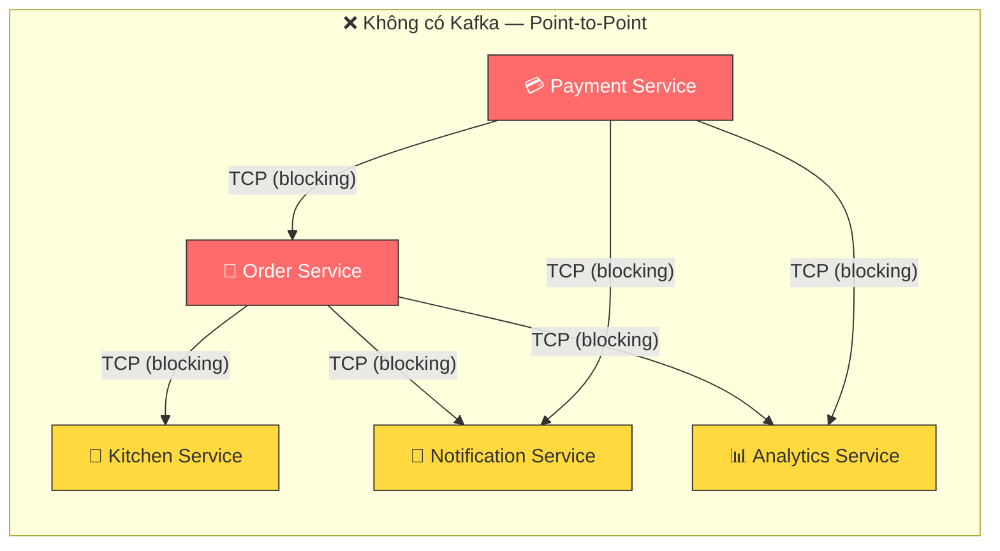

#### Sơ đồ: Kafka Giải Phóng Coupling

> Với Kafka ở giữa, producer chỉ cần publish vào topic, không cần biết ai subscribe. Consumer subscribe topic mà không cần biết ai publish. Thêm service mới chỉ cần subscribe — không sửa code producer.

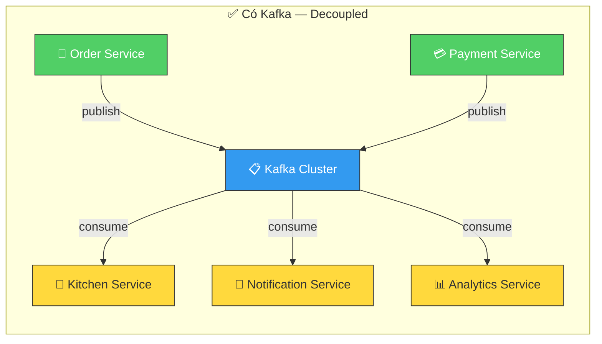

Thiết kế này có một loạt vấn đề nghiêm trọng:

**Vấn đề 1 — Temporal Coupling (ràng buộc thời gian):** Order Service chỉ hoàn thành khi _tất cả_ downstream services phản hồi xong. Nếu Kitchen Service đang bảo trì hoặc chạy chậm, khách hàng phải chờ — dù việc tạo ticket bếp không ảnh hưởng gì đến việc xác nhận đơn hàng.

**Vấn đề 2 — Structural Coupling (ràng buộc cấu trúc):** Order Service phải _biết_ Kitchen Service tồn tại. Khi thêm Analytics Service, phải sửa code Order Service. Đây là vi phạm Open/Closed Principle — mỗi lần có consumer mới, producer phải thay đổi.

**Vấn đề 3 — No Replay:** Nếu Kitchen Service bị restart đúng lúc Order Service vừa gửi request, message đó mất vĩnh viễn. Không có cách nào để Kitchen Service "hỏi lại" những đơn nó đã bỏ lỡ.

#### Sơ đồ: Ba Vấn Đề Kafka Giải Quyết

> Bảng so sánh trực quan ba vấn đề chính của kiến trúc point-to-point và cách Kafka giải quyết từng vấn đề. Kafka sử dụng persistent log ở giữa làm trung gian, loại bỏ hoàn toàn sự phụ thuộc trực tiếp giữa producer và consumer.

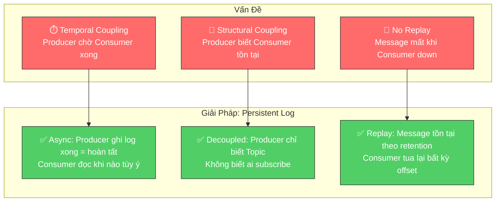

Kafka giải quyết cả ba vấn đề bằng một cơ chế duy nhất: **tách biệt producer và consumer thông qua một persistent log ở giữa**.

### 1.2 Khi Nào Kafka KHÔNG Phải Giải Pháp

Kafka không phải câu trả lời cho mọi bài toán giao tiếp. Trong QRTable, có 6 sự kiện UI (`order.created`, `menu.updated`, `table.status_changed`, v.v.) được xử lý theo cách khác — BFF Direct Pattern — vì chúng chỉ cần đẩy dữ liệu lên WebSocket cho client, không cần logic nghiệp vụ ở bounded context khác. Dùng Kafka cho những sự kiện này sẽ thêm độ trễ và phức tạp vô ích.

#### Sơ đồ: Decision Tree — Kafka hay BFF Direct?

> Cây quyết định giúp xác định nhanh khi nào dùng Kafka và khi nào dùng BFF Direct. Bắt đầu từ câu hỏi "Event có trigger business logic ở bounded context khác không?" — nếu Có → Kafka, nếu Không (chỉ UI update) → BFF Direct.

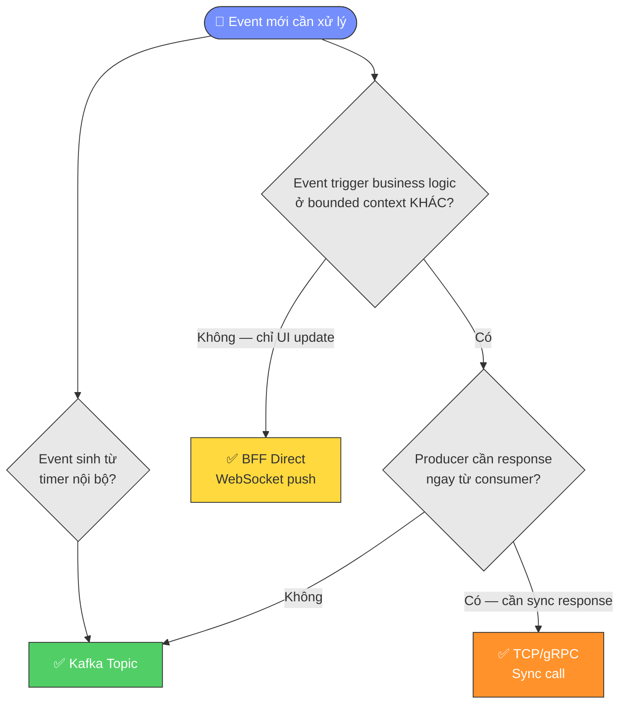

Nguyên tắc đơn giản: **nếu producer đã có đủ thông tin và chỉ cần notify UI, đừng dùng Kafka**. Kafka dành cho các trường hợp cần cross-domain business reaction hoặc temporal decoupling thực sự.

---

## 2. Bản Chất Của Kafka — Distributed Commit Log

Hiểu lầm phổ biến nhất về Kafka là coi nó như một message queue phân tán — giống RabbitMQ nhưng to hơn. Đây là hiểu lầm căn bản dẫn đến mọi sai lầm thiết kế tiếp theo.

### 2.1 Kafka Là Gì Thực Sự

Kafka về bản chất là một **distributed, persistent, append-only log**. Mỗi topic là một tập hợp các file log được lưu trên đĩa cứng. Khi producer gửi message, Kafka _ghi thêm vào cuối_ log — không bao giờ sửa hay xóa message đã ghi.

Hãy hình dung một cuốn sổ nhật ký: bạn chỉ viết thêm vào cuối, không bao giờ tẩy xóa. Consumer đọc sổ bằng cách ghi nhớ mình đã đọc đến trang nào (gọi là _offset_). Khác với queue truyền thống, message không bị xóa sau khi đọc xong — nó ở đó cho đến khi hết thời gian lưu trữ (mặc định 7 ngày).

#### Sơ đồ: Append-Only Log — Cấu trúc cốt lõi của Kafka

> Minh họa bản chất append-only log. Producer chỉ có thể ghi vào cuối log (bên phải). Consumer đọc tại vị trí offset riêng của mình và di chuyển dần về phía phải. Message cũ không bị xóa khi đọc — chúng tồn tại cho đến khi hết retention period.

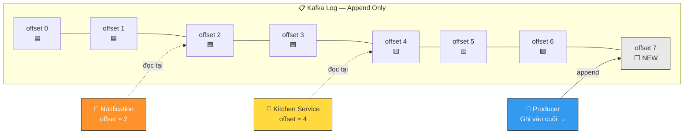

### 2.2 Hệ Quả Của Thiết Kế Log

Thiết kế append-only log tạo ra những đặc tính hoàn toàn khác với message queue:

**Đặc tính 1 — Nhiều consumer độc lập:** Vì message không bị xóa sau khi đọc, nhiều consumer có thể đọc cùng một message hoàn toàn độc lập, mỗi người theo dõi vị trí của riêng mình. Trong QRTable, `order.confirmed` được Kitchen Service và Notification Service cùng đọc — hai service này không biết nhau, không ảnh hưởng nhau.

**Đặc tính 2 — Replay:** Consumer có thể "tua lại" về một vị trí cũ trong log và đọc lại message. Nếu Kitchen Service bị bug và xử lý sai 100 đơn hàng trong 2 giờ qua, team có thể fix code, reset offset về 2 giờ trước, và để Kitchen Service xử lý lại toàn bộ — mà không cần Order Service làm gì thêm.

**Đặc tính 3 — Consumer tự điều phối tốc độ:** Kafka dùng mô hình pull — consumer _kéo_ message về theo tốc độ của mình, thay vì broker _đẩy_ message vào consumer. Nếu Kitchen Service xử lý chậm, nó chỉ lag behind (offset thấp hơn) nhưng không làm sập cả hệ thống.

#### Sơ đồ: Ba Đặc Tính Vượt Trội Của Log

> So sánh trực quan ba đặc tính mạnh nhất của mô hình log so với message queue. Mỗi đặc tính được minh họa bằng một scenario cụ thể trong QRTable.

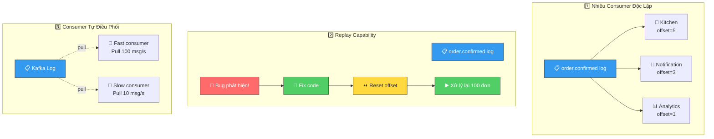

### 2.3 So Sánh Với Message Queue Truyền Thống

| Khía cạnh           | RabbitMQ / Queue                     | Apache Kafka                                |
| ------------------- | ------------------------------------ | ------------------------------------------- |
| **Mô hình dữ liệu** | Queue — message mất sau khi tiêu thụ | Log — message tồn tại theo retention policy |
| **Consumer model**  | Broker push vào consumer             | Consumer pull từ broker                     |
| **Nhiều consumer**  | Cần fan-out exchange thủ công        | Tự nhiên — mỗi group đọc độc lập            |
| **Ordering**        | Per-queue                            | Per-partition                               |
| **Replay**          | Không thể                            | Rewind offset bất kỳ                        |
| **Throughput**      | Vừa phải                             | Rất cao (sequential disk I/O)               |
| **Phù hợp cho**     | Task queue, RPC async                | Event streaming, audit log, decoupling      |

#### Sơ đồ: Queue vs Log — Khác Biệt Cốt Lõi

> Minh họa trực quan sự khác biệt giữa mô hình Queue (message biến mất sau khi consumer đọc) và mô hình Log (message vẫn tồn tại, consumer chỉ di chuyển con trỏ offset). Đây là khác biệt nền tảng quyết định mọi thiết kế tiếp theo.


---

## 3. Giải Phẫu Một Message

Mọi message trong Kafka đều có cấu trúc cố định. Hiểu từng thành phần giúp bạn thiết kế message schema đúng từ đầu.

### 3.1 Các Thành Phần

Một Kafka message gồm 5 thành phần chính:

**Key (tùy chọn):** Một chuỗi byte dùng để quyết định message này sẽ vào partition nào. Key không phải ID duy nhất của message — nhiều message có thể cùng key. Kafka hash key để chọn partition, đảm bảo tất cả message có cùng key luôn vào cùng partition (ordering guarantee).

Trong QRTable, key của mọi event là `tenantId`. Lý do sẽ được giải thích kỹ ở phần 11.

**Value:** Nội dung thực sự của message — thường là JSON. Đây là phần chứa business data: thông tin đơn hàng, sự kiện thanh toán, v.v.

**Headers (tùy chọn):** Metadata dạng key-value, tương tự HTTP headers. Dùng cho cross-cutting concerns như tracing ID, source service name, schema version. Headers không ảnh hưởng đến routing hay partitioning.

**Timestamp:** Thời điểm message được tạo (do producer gán hoặc broker gán). Kafka hỗ trợ hai chế độ: `CreateTime` (thời điểm producer gửi) và `LogAppendTime` (thời điểm broker ghi vào log).

**Offset:** Số thứ tự của message trong partition, do Kafka tự gán và tăng dần. Offset bắt đầu từ 0 trong mỗi partition và không bao giờ reset.

#### Sơ đồ: Cấu Trúc Một Kafka Message

> Mỗi Kafka message gồm 5 thành phần phân biệt rõ ràng. **Key** quyết định message rơi vào partition nào. **Value** chứa business payload. **Headers** chứa metadata vận hành. **Timestamp** ghi nhận thời điểm. **Offset** là số thứ tự do broker tự gán — consumer dùng offset để theo dõi vị trí đọc.

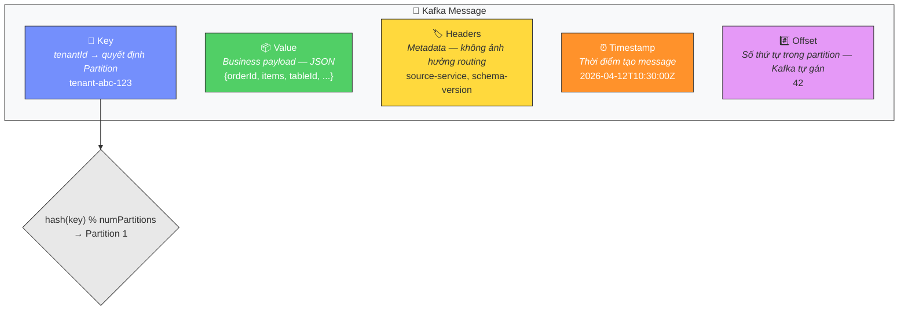

### 3.2 Ví Dụ Trong QRTable

Khi Order Service confirm một đơn hàng của nhà hàng "The Coffee House", message `order.confirmed` sẽ có dạng:

```
Key:   "tenant-abc-123"          ← tenantId, quyết định partition
Value: {
  "version": "1.0",
  "timestamp": "2026-04-12T10:30:00Z",
  "tenantId": "tenant-abc-123",
  "orderId": "order-xyz-789",
  "tableId": "table-05",
  "sessionId": "session-qrs-456",
  "items": [
    { "menuItemId": "item-001", "name": "Cà phê sữa", "qty": 2, "type": "drink" },
    { "menuItemId": "item-045", "name": "Bánh mì", "qty": 1, "type": "food" }
  ]
}
Headers: {
  "source-service": "order-service",
  "schema-version": "1.0"
}
```

#### Sơ đồ: Luồng Message `order.confirmed` Trong QRTable

> Sơ đồ sequence thể hiện hành trình đầy đủ của message `order.confirmed` — từ khi khách hàng submit đơn hàng, Order Service publish lên Kafka, đến khi Kitchen Service và BFF nhận và xử lý message đó. Chú ý Order Service **không chờ** Kitchen Service xử lý xong.

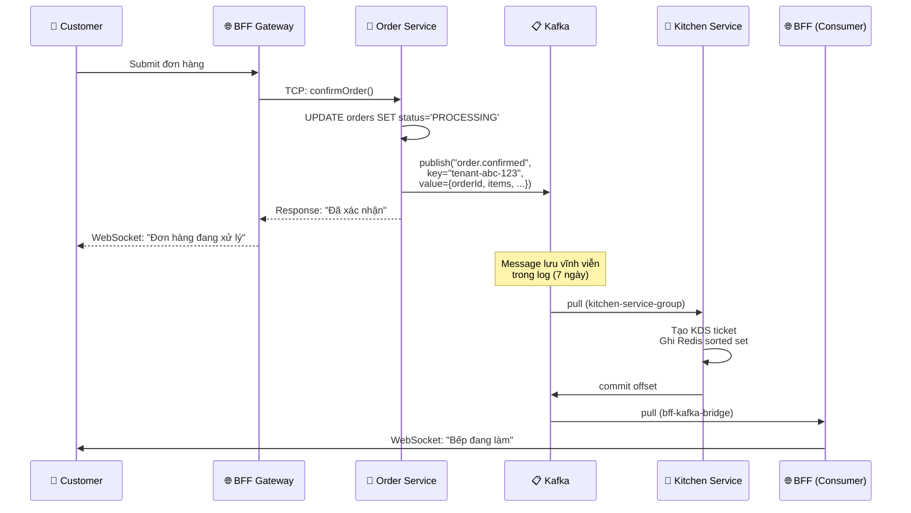

Lưu ý trường `version` trong value và `schema-version` trong header: đây là chuẩn bị cho việc thay đổi schema trong tương lai mà không phá vỡ consumer cũ.

---

## 4. Topic, Partition và Log Vật Lý

### 4.1 Topic Là Gì

Topic là một tên logic để nhóm các message cùng loại — tương tự như tên bảng trong database. `order.confirmed`, `payment.completed` là các topic khác nhau.

Nhưng một topic không phải một file hay một hàng đợi đơn. Phía sau, mỗi topic được chia thành nhiều **partition**.

### 4.2 Partition — Đơn Vị Thực Sự

Partition là đơn vị vật lý thực sự trong Kafka. Mỗi partition là một **ordered, immutable, append-only log** được lưu trên disk của broker.

Khi bạn tạo topic `order.confirmed` với 3 partitions, Kafka thực chất tạo 3 file log độc lập:

```
Topic: order.confirmed
├── Partition 0  ──  [msg@offset-0] [msg@offset-1] [msg@offset-4] [msg@offset-6] ...
├── Partition 1  ──  [msg@offset-0] [msg@offset-2] [msg@offset-5] [msg@offset-7] ...
└── Partition 2  ──  [msg@offset-0] [msg@offset-3] [msg@offset-8] ...
```

#### Sơ đồ: Topic, Partitions và Offset

> Topic là tên logic, partition là đơn vị vật lý. Mỗi partition là một log riêng biệt với chuỗi offset tăng dần **riêng rẽ**. Producer ghi vào partition dựa trên hash(key). Chú ý: offset 0 ở Partition 0 và offset 0 ở Partition 1 là hai message **hoàn toàn khác nhau**.

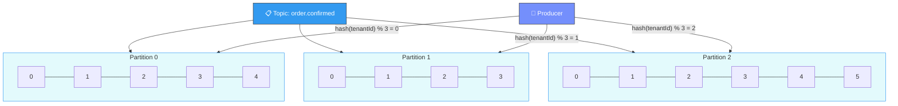

Có hai điều quan trọng cần nhận ra từ sơ đồ này:

**Quan sát 1 — Offset là per-partition, không per-topic:** Partition 0 có offset 0, Partition 1 cũng có offset 0 riêng của nó. Không có "global offset" cho toàn topic. Khi consumer theo dõi vị trí đọc, nó phải theo dõi `(partition, offset)` cho mỗi partition.

**Quan sát 2 — Ordering chỉ được đảm bảo trong cùng partition:** Message trong Partition 0 được đảm bảo theo thứ tự viết vào. Nhưng không có đảm bảo gì về thứ tự tương đối giữa message ở Partition 0 và Partition 1.

### 4.3 Tại Sao Cần Nhiều Partition

Partition là cơ chế scale của Kafka, theo cả hai chiều:

**Scale write (producer):** Producer có thể ghi vào nhiều partition song song. 3 partitions = 3 "luồng" ghi đồng thời, thay vì một hàng đợi tuần tự.

**Scale read (consumer):** Đây mới là lý do quan trọng hơn. Trong Kafka, **mỗi partition chỉ có thể được xử lý bởi tối đa 1 consumer trong cùng một consumer group tại một thời điểm**. Điều này có nghĩa: số partition của topic là _giới hạn trên_ cho mức độ song song có thể đạt được khi xử lý.

#### Sơ đồ: Partition = Đơn Vị Scale

> Partition quyết định parallelism tối đa. Ví dụ: 3 partitions → tối đa 3 consumer instances xử lý song song. Instance thứ 4 sẽ idle. Đây là lý do chọn số partition "hào phóng" khi thiết kế topic.

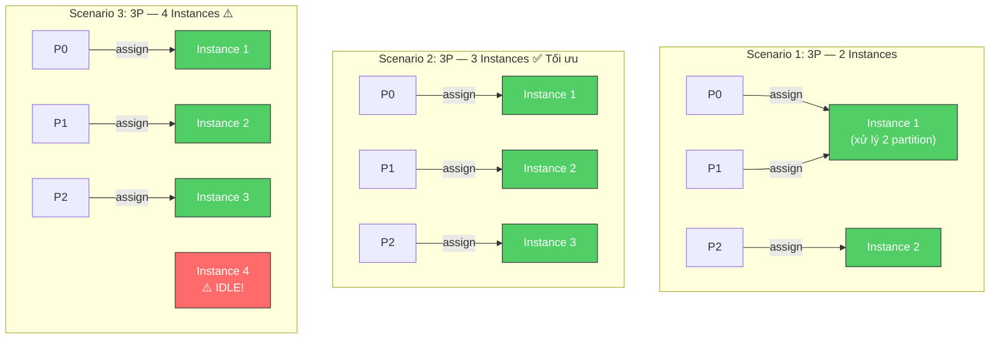

Ví dụ cho QRTable: Nếu `order.confirmed` có 3 partitions và Kitchen Service deploy 3 instances, mỗi instance xử lý 1 partition — throughput tăng gấp 3. Nếu deploy 4 instances với 3 partitions, instance thứ 4 sẽ ngồi idle vì không còn partition nào để assign.

### 4.4 Log Segment và Retention

Mỗi partition không phải một file duy nhất — nó gồm nhiều **log segment**, mỗi segment là một file có kích thước giới hạn (mặc định 1GB). Khi segment đầy, Kafka đóng nó lại và tạo segment mới.

#### Sơ đồ: Log Segments và Retention

> Mỗi partition bao gồm nhiều segment files. Segment cũ nhất bị xóa khi hết retention period (mặc định 7 ngày). Kafka xóa **toàn bộ segment**, không xóa từng message — đây là lý do Kafka hiệu quả với disk I/O (sequential write, batch delete).

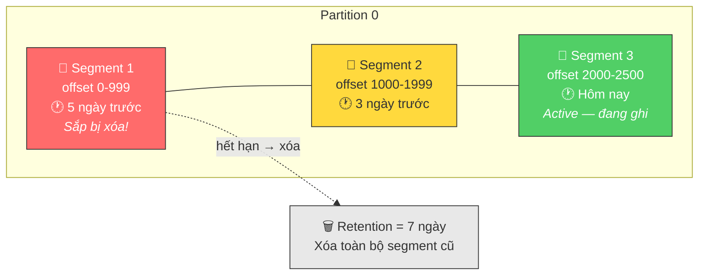

Khi retention period hết hạn (mặc định 7 ngày), Kafka xóa các segment cũ nhất — **nhưng chỉ xóa toàn bộ segment, không xóa từng message riêng lẻ**. Đây là lý do tại sao Kafka rất hiệu quả với disk I/O: ghi tuần tự, xóa theo lô, không có random I/O như database thông thường.

Trong môi trường dev của QRTable, không cần quan tâm nhiều đến retention — mặc định 7 ngày là quá đủ. Production thực tế mới cần tune tùy theo traffic.

---

## 5. Replication và Đảm Bảo Độ Bền Dữ Liệu

### 5.1 Tại Sao Cần Replication

Kafka được thiết kế chạy trên cluster nhiều broker (máy chủ). Nếu một broker gặp sự cố, data không bị mất nhờ replication. Dù QRTable Phase 2 chạy single-broker (dev), hiểu replication giúp bạn cấu hình đúng và giải thích kiến trúc trong luận văn.

### 5.2 Leader và Follower

Mỗi partition có một **leader** và nhiều **follower** (số follower = replication factor - 1):

- **Leader:** Xử lý tất cả read và write request cho partition đó
- **Followers:** Chỉ sao chép dữ liệu từ leader, không phục vụ client trực tiếp

Khi leader gặp sự cố, một follower trong danh sách ISR (In-Sync Replicas) được bầu chọn làm leader mới — quá trình này hoàn toàn tự động.

#### Sơ đồ: Replication — Leader, Follower và ISR

> Mỗi partition có duy nhất 1 Leader xử lý mọi read/write. Các Follower liên tục fetch data từ Leader để đồng bộ. Tập hợp các replica **đã đồng bộ đầy đủ** gọi là ISR. Khi Leader sập, một Follower trong ISR được tự động bầu làm Leader mới — không mất data.

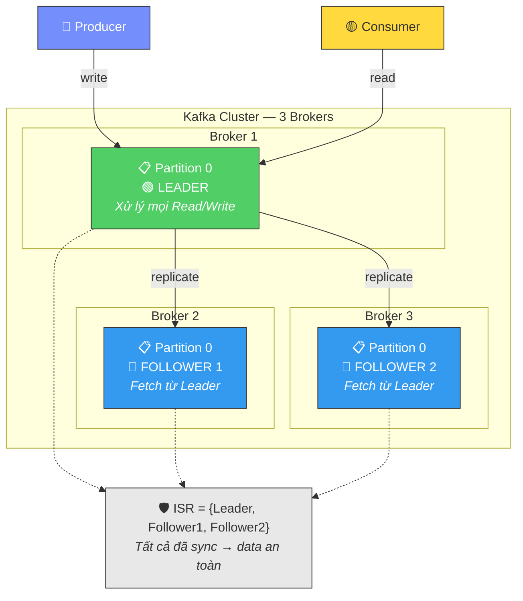

### 5.3 ISR — In-Sync Replicas

ISR là tập hợp các replica (leader + những follower) đã sao chép đầy đủ data từ leader. Một follower bị loại khỏi ISR nếu nó lag quá lâu (mặc định 10 giây không fetch từ leader).

ISR là khái niệm then chốt để hiểu `acks` setting của producer.

### 5.4 Acks — Producer Chờ Bao Lâu?

Khi producer gửi message, nó có thể cấu hình mức độ xác nhận muốn nhận từ broker. Đây là trade-off giữa **độ an toàn** và **hiệu năng**:

**`acks=0` (fire-and-forget):** Producer gửi và không chờ bất kỳ xác nhận nào từ broker. Nhanh nhất nhưng có thể mất data nếu broker crash ngay sau khi nhận packet. Phù hợp với log metrics không critical — không dùng cho QRTable.

**`acks=1`:** Producer chờ leader ghi xong mới tiếp tục. Nếu leader crash trước khi follower kịp replicate, message bị mất. Chấp nhận được cho `kitchen.sla_warning` (event từ timer nội bộ, mất một warning không gây hại nghiêm trọng).

**`acks=all` (hay `acks=-1`):** Producer chờ _tất cả_ replica trong ISR ghi xong. Đây là mức an toàn cao nhất — phù hợp với `order.confirmed`, `payment.completed`, `tenant.created` vì mất những event này có hậu quả nghiêm trọng về nghiệp vụ.

#### Sơ đồ: Acks Levels — Trade-off An Toàn vs Hiệu Năng

> Ba mức acks tạo thành một spectrum từ nhanh nhất (acks=0) đến an toàn nhất (acks=all). QRTable chọn `acks=all` làm mặc định cho mọi business event, hy sinh một chút latency để đảm bảo không mất data.

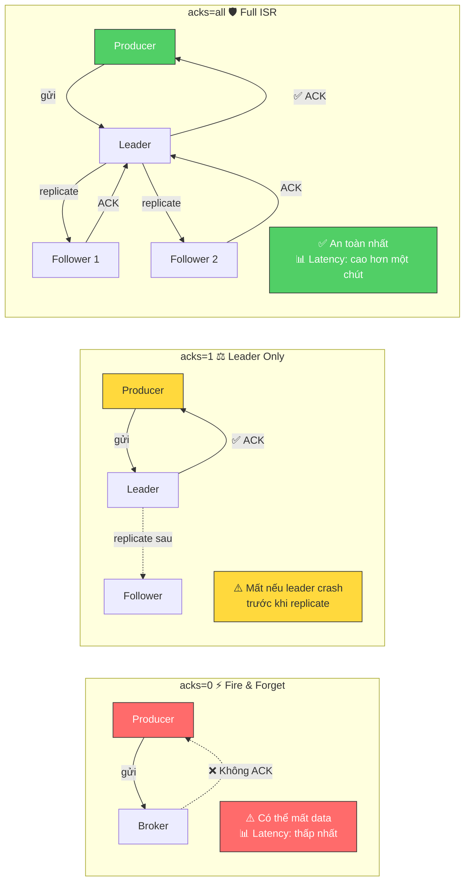

**Quy tắc cho QRTable:** Dùng `acks=all` cùng với `idempotent=true` (sẽ giải thích ở phần 6) làm mặc định cho mọi producer. Mức overhead thêm vào là không đáng kể so với rủi ro mất event.

---

## 6. Producer — Cơ Chế Gửi Message

### 6.1 Vòng Đời Của Một Message Từ Producer

Khi application code gọi `producer.send(message)`, message không được gửi ngay lập tức. Nó đi qua pipeline sau:

**Bước 1 — Serialization:** Value và key được chuyển từ object/string sang byte array. Kafka không quan tâm đến nội dung — nó chỉ biết byte.

**Bước 2 — Partitioner:** Kafka quyết định message này vào partition nào. Logic mặc định: nếu có key thì `partition = hash(key) % numPartitions`; nếu không có key thì round-robin giữa các partition.

**Bước 3 — Accumulator (Record Buffer):** Message được đưa vào buffer memory, _chờ_ được gom chung với các message khác để gửi theo batch. Đây là điểm khác biệt quan trọng — producer không gửi từng message riêng lẻ.

**Bước 4 — Sender Thread:** Một luồng nền (background thread) liên tục kiểm tra buffer và gửi batch lên broker khi đủ điều kiện.

#### Sơ đồ: Producer Pipeline — Từ send() đến Broker

> Pipeline hoàn chỉnh bên trong Kafka Producer. Message đi qua 4 giai đoạn trước khi thực sự được gửi đến broker. Đặc biệt, bước Accumulator (gom batch) là lý do Kafka có throughput cao — gửi hàng trăm message trong một network round-trip thay vì từng message một.


### 6.2 Batching — Tại Sao Kafka Nhanh

Producer gom message thành batch trước khi gửi, được kiểm soát bởi hai tham số:

`linger.ms`: Thời gian chờ tối đa để gom batch. Nếu linger.ms=5, producer chờ tối đa 5ms để gom thêm message trước khi gửi — ngay cả khi batch chưa đầy. Mặc định là 0 (gửi ngay khi có message), nhưng tăng lên 5-10ms cải thiện throughput đáng kể trong hệ thống high-traffic.

`batch.size`: Kích thước tối đa của một batch (bytes). Khi đủ kích thước, batch được gửi ngay mà không cần chờ hết linger.ms.

#### Sơ đồ: Batching — linger.ms vs batch.size

> Hai trigger gửi batch: (1) hết thời gian `linger.ms` hoặc (2) đủ kích thước `batch.size`. Điều kiện nào đến trước sẽ trigger gửi. Với QRTable traffic thấp, mặc định (linger.ms=0) là đủ.

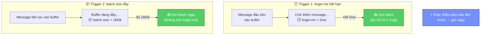

Với QRTable — traffic thấp (vài chục đơn/giờ mỗi nhà hàng) — batching mặc định là đủ. Nhưng hiểu cơ chế này giúp bạn giải thích tại sao Kafka có latency nhỏ (sub-millisecond) mà vẫn đạt throughput cao.

### 6.3 Idempotent Producer — Giải Quyết Duplicate Khi Retry

**Vấn đề:** Producer gửi message, broker nhận và ghi xong, nhưng network timeout xảy ra trước khi ACK về tới producer. Producer không biết gửi thành công hay chưa, nên retry — broker nhận lần thứ hai và ghi thêm một bản nữa. Kết quả: `order.confirmed` xuất hiện hai lần trong Kafka, Kitchen Service tạo 2 ticket cho cùng 1 đơn hàng.

#### Sơ đồ: Vấn Đề Duplicate và Giải Pháp Idempotent Producer

> **Trái**: Không có idempotent — producer retry tạo duplicate message. **Phải**: Với idempotent — broker nhận diện duplicate qua (PID, SeqNum) và bỏ qua bản thừa. Kết quả: Kitchen Service chỉ nhận đúng 1 message.

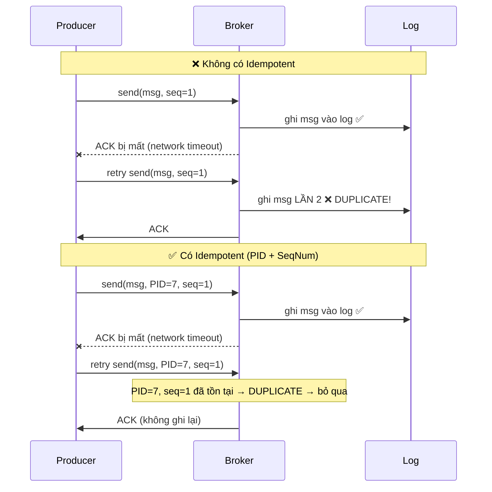

**Giải pháp — Idempotent Producer:** Khi bật `idempotent=true`, Kafka cấp cho mỗi producer instance một `Producer ID (PID)` duy nhất. Mỗi message được đánh số `Sequence Number` tăng dần per-partition. Broker kiểm tra: nếu nhận message có `(PID, SequenceNumber)` trùng với message đã lưu → là duplicate → bỏ qua.

Cơ chế này hoàn toàn transparent với application code — bạn chỉ cần bật một flag, Kafka lo phần còn lại.

**Giới hạn quan trọng:** Idempotent producer chỉ dedup trong cùng một _session_ (kể từ khi producer khởi động đến khi bị restart). Nếu Order Service crash và restart, nó nhận PID mới → không dedup được duplicate phát sinh trước khi crash. Đây là lý do cần Outbox Pattern (xem phần 10) cho đảm bảo truly-once ở tầng ứng dụng.

### 6.4 Ordering Guarantee Của Producer

Kafka đảm bảo: **message từ cùng một producer vào cùng một partition được ghi theo đúng thứ tự gửi**.

Tuy nhiên, với `max.in.flight.requests.per.connection > 1` (mặc định là 5), producer có thể gửi nhiều batch song song trước khi nhận ACK. Nếu batch 1 fail và retry sau khi batch 2 đã thành công → ordering bị đảo. Khi bật `idempotent=true`, Kafka tự động fix vấn đề này bằng cách đảm bảo broker sắp xếp lại theo sequence number.

#### Sơ đồ: Ordering — Vấn Đề và Giải Pháp

> Khi `max.in.flight > 1`, hai batch gửi song song có thể bị đảo thứ tự nếu batch đầu fail và retry. `idempotent=true` giải quyết điều này bằng cách broker sắp xếp lại theo sequence number.

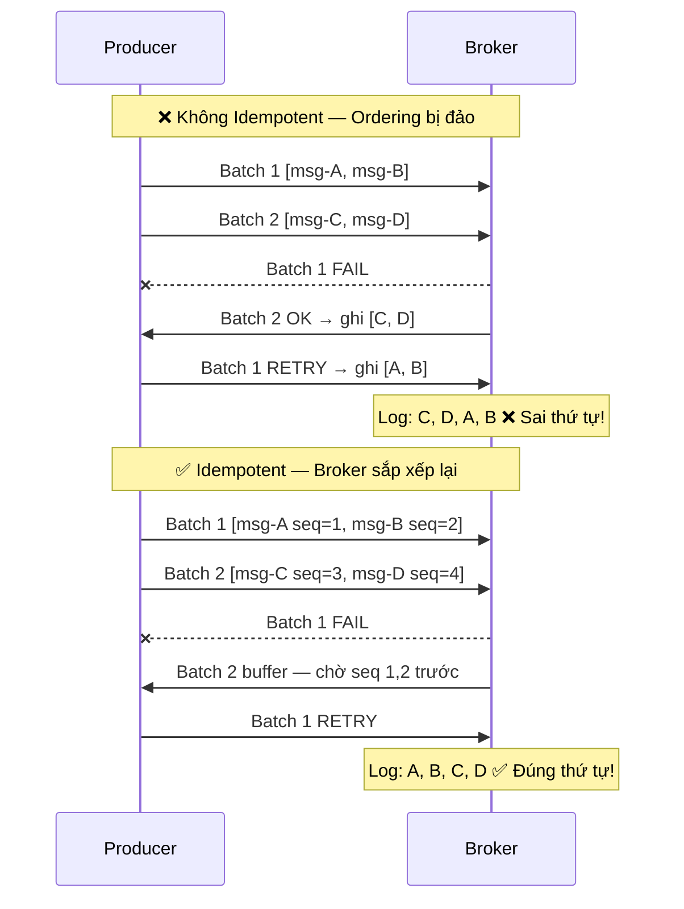

**Kết luận thực tiễn:** Với `idempotent=true` (recommend cho QRTable), bạn nhận được cả hai: no-duplicate và in-order delivery per partition.

---

## 7. Consumer và Consumer Group

### 7.1 Pull Model vs Push Model

Đây là sự khác biệt kiến trúc quan trọng nhất giữa Kafka và queue truyền thống.

**Push model (RabbitMQ):** Broker chủ động đẩy message vào consumer. Nếu consumer xử lý chậm, nó bị ngập bởi message. Broker phải hiểu _tốc độ_ của từng consumer để kiểm soát lưu lượng — đây là logic phức tạp.

**Pull model (Kafka):** Consumer chủ động hỏi broker "cho tôi tối đa N message từ offset M của partition P". Consumer kiểm soát hoàn toàn tốc độ xử lý. Nếu Kitchen Service đang xử lý đơn phức tạp và cần thêm thời gian, nó đơn giản là không fetch thêm — không cần báo cho Kafka.

#### Sơ đồ: Push vs Pull Model

> **Push** (RabbitMQ): Broker kiểm soát tốc độ, consumer bị ngập nếu chậm. **Pull** (Kafka): Consumer kiểm soát tốc độ, tự quyết định khi nào fetch tiếp. Mô hình Pull cho phép consumer xử lý theo khả năng, không tạo backpressure ngược lên broker.

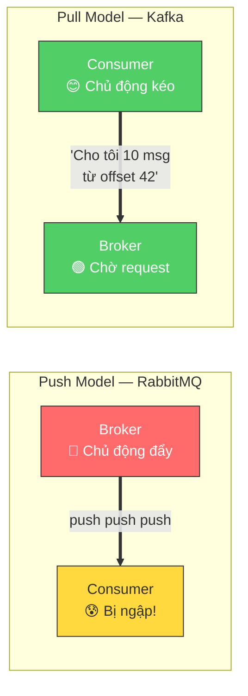

Hệ quả: Consumer có thể batch nhiều message trong một lần fetch, xử lý một lúc, rồi commit toàn bộ — hiệu quả hơn nhiều so với xử lý từng message.

### 7.2 Offset — Bookmark Của Consumer

Offset là số thứ tự của message trong partition. Consumer cần ghi nhớ offset của message _cuối cùng nó đã xử lý thành công_ để khi restart, nó biết tiếp tục từ đâu.

Offset của consumer được lưu ở đâu? Kafka dùng một internal topic đặc biệt tên `__consumer_offsets`. Khi consumer "commit" offset, nó thực chất đang ghi vào topic này: "consumer group X đã xử lý đến offset Y của partition Z trên topic T".

#### Sơ đồ: Offset Tracking và Commit

> Consumer theo dõi vị trí đọc bằng offset. Khi xử lý xong, consumer "commit" offset — thực chất là ghi vào internal topic `__consumer_offsets`. Khi restart, consumer đọc lại offset đã commit để biết tiếp tục từ đâu.

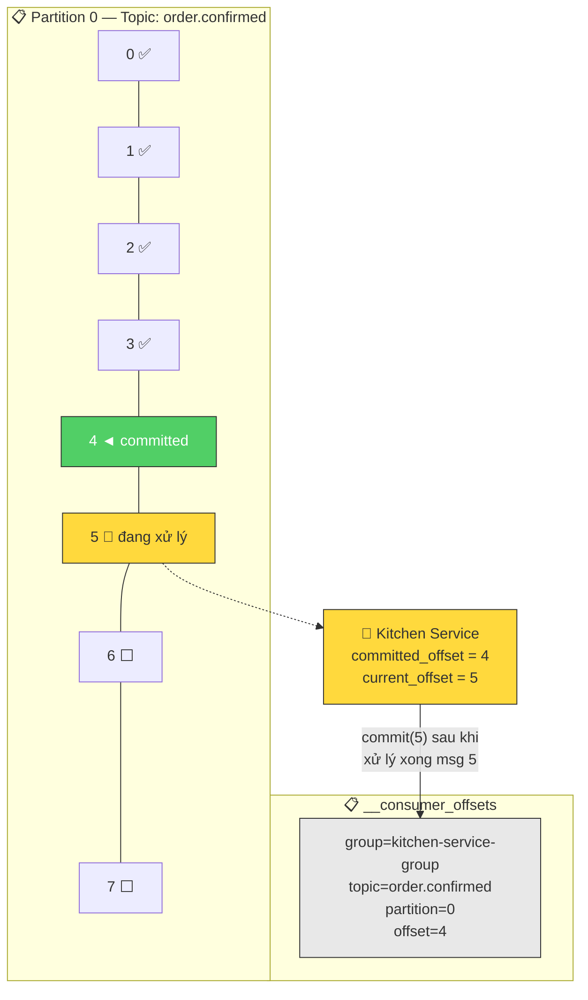

Đây là điểm then chốt: **offset commitment là hành động ghi thêm vào Kafka log**, không phải xóa message hay update state ở đâu đó. Consumer groups khác nhau có offset riêng, hoàn toàn độc lập.

### 7.3 Consumer Group — Cơ Chế Scale

Consumer group là một nhóm consumer instances cùng chia sẻ công việc đọc một topic. Rule cốt lõi: **mỗi partition chỉ được assign cho tối đa một consumer instance trong cùng group tại một thời điểm**.

Hãy hình dung topic `order.confirmed` có 3 partitions và Kitchen Service có 2 instances:

```
Partition 0 ──────────► Kitchen Instance 1
Partition 1 ──────────► Kitchen Instance 1  (1 instance xử lý 2 partition)
Partition 2 ──────────► Kitchen Instance 2
```

Khi deploy thêm instance thứ 3:

```
Partition 0 ──────────► Kitchen Instance 1
Partition 1 ──────────► Kitchen Instance 2
Partition 2 ──────────► Kitchen Instance 3
```

Khi deploy instance thứ 4 (với vẫn 3 partitions):

```
Partition 0 ──────────► Kitchen Instance 1
Partition 1 ──────────► Kitchen Instance 2
Partition 2 ──────────► Kitchen Instance 3
Kitchen Instance 4 ──── idle (không có partition nào)
```

**Insight quan trọng:** Số partition của topic là _bottleneck_ của khả năng scale. Không thể có nhiều consumer xử lý song song hơn số partition. Đây là lý do khi thiết kế topic nên chọn số partition "hào phóng" một chút — tăng partition sau khó hơn giảm (rebalancing toàn bộ data).

### 7.4 Partition Assignment và Rebalancing

Khi consumer group có sự thay đổi (consumer mới join, consumer cũ leave, hoặc crash), Kafka cần phân phối lại partition — gọi là **rebalancing**.

#### Sơ đồ: Rebalancing Flow

> Quy trình rebalancing khi một consumer mới join hoặc consumer cũ rời nhóm. Trong thời gian rebalancing, **toàn bộ group dừng xử lý** (stop-the-world), gây downtime tạm thời. Static Group Membership giảm tần suất rebalance bằng cách cho phép consumer tạm disconnect mà không trigger rebalance.

```mermaid
sequenceDiagram
    participant C1 as Consumer 1
    participant C2 as Consumer 2
    participant C3 as Consumer 3 (Mới)
    participant GC as Group Coordinator

    Note over C1,GC: Trước khi C3 join
    C1->>GC: Heartbeat (P0, P1 assigned)
    C2->>GC: Heartbeat (P2 assigned)

    Note over C1,GC: 🔄 C3 Join → Trigger Rebalance
    C3->>GC: JoinGroup request
    GC->>C1: Revoke partitions ⏸️ DỪNG xử lý
    GC->>C2: Revoke partitions ⏸️ DỪNG xử lý

    Note over C1,GC: ⚠️ STOP-THE-WORLD — Không ai xử lý

    GC->>C1: Leader — tính assignment mới
    C1->>GC: Assignment: C1=P0, C2=P1, C3=P2

    GC->>C1: Assign P0 ▶️ Resume
    GC->>C2: Assign P1 ▶️ Resume
    GC->>C3: Assign P2 ▶️ Resume
```

**Quá trình rebalancing:**

1. Một broker đặc biệt (Group Coordinator) nhận thông báo có sự thay đổi trong group
2. Group Coordinator yêu cầu tất cả consumer trong group "rời bỏ" partition hiện tại — toàn bộ group dừng xử lý
3. Consumer được bầu làm **Group Leader** (thường là consumer join sớm nhất) nhận danh sách consumer hiện có và tính toán assignment mới
4. Assignment được gửi về cho từng consumer qua Group Coordinator
5. Consumer resume xử lý với partition mới

**Vấn đề của rebalancing:** Trong thời gian rebalancing, toàn bộ consumer group _dừng xử lý_ — gọi là "stop-the-world". Với hệ thống cần low latency như KDS của QRTable, đây là điều không mong muốn.

**Cách giảm tần suất rebalancing:** Dùng `Static Group Membership` — mỗi consumer được cấp một `instanceId` cố định. Khi consumer ngắt kết nối và reconnect trong khoảng `sessionTimeout`, Kafka nhận ra đó là consumer cũ (cùng instanceId) và không trigger rebalance. Chỉ khi consumer không reconnect trong thời gian timeout mới coi là đã rời group.

### 7.5 Auto Commit vs Manual Commit — Lựa Chọn Nguy Hiểm

Đây là một trong những nguồn gây bug khó debug nhất với Kafka.

#### Sơ đồ: Auto Commit — Mất Message Nguy Hiểm

> Minh họa scenario mất message với auto commit. Auto commit chạy theo thời gian (mỗi 5s), không theo kết quả xử lý. Nếu consumer crash giữa chừng, các message đã commit nhưng chưa xử lý sẽ **mất vĩnh viễn** — Kitchen Service không bao giờ nhận được ticket.

```mermaid
graph TB
    subgraph "❌ Auto Commit — Mất 4 Message"
        direction TB
        AC1["12:00:00 — Fetch 10 message (offset 0-9)"]
        AC2["12:00:03 — Xử lý xong msg 0-5"]
        AC3["12:00:05 — ⚡ AUTO COMMIT offset=9<br/><i>Commit hết 10 msg dù mới xử lý 6</i>"]
        AC4["12:00:06 — 💥 CRASH khi xử lý msg 6"]
        AC5["12:00:10 — Restart → đọc từ offset 10<br/>❌ Message 6,7,8,9 MẤT VĨNH VIỄN"]

        AC1 --> AC2 --> AC3 --> AC4 --> AC5
    end

    subgraph "✅ Manual Commit — Không mất"
        direction TB
        MC1["12:00:00 — Fetch 10 message"]
        MC2["12:00:03 — Xử lý xong msg 0-5"]
        MC3["12:00:03 — Manual commit offset=5"]
        MC4["12:00:06 — 💥 CRASH khi xử lý msg 6"]
        MC5["12:00:10 — Restart → đọc từ offset 6<br/>✅ Message 6,7,8,9 được xử lý lại"]

        MC1 --> MC2 --> MC3 --> MC4 --> MC5
    end

    style AC3 fill:#ff6b6b,stroke:#333,color:#fff
    style AC5 fill:#ff6b6b,stroke:#333,color:#fff
    style MC3 fill:#51cf66,stroke:#333,color:#fff
    style MC5 fill:#51cf66,stroke:#333,color:#fff
```

**Auto Commit:** Kafka tự động commit offset theo interval (mặc định mỗi 5 giây). Vấn đề: commit xảy ra dựa trên thời gian, không dựa trên kết quả xử lý. Nếu consumer fetch 10 message lúc 12:00:00, auto commit chạy lúc 12:00:05 và commit hết 10 message, nhưng consumer mới xử lý xong 6/10. Consumer crash lúc 12:00:06 khi đang xử lý message 7. Khi restart, Kafka thấy offset đã commit → bỏ qua message 7, 8, 9, 10. **4 message bị mất hoàn toàn** — Kitchen Service không nhận được 4 ticket.

**Manual Commit:** Consumer tự commit offset sau khi đã xử lý xong và xác nhận thành công. Đây là mô hình đúng cho QRTable:

```
1. Consumer fetch message
2. Xử lý message (tạo KDS ticket, ghi Redis, v.v.)
3. Xử lý THÀNH CÔNG → commit offset
4. Xử lý THẤT BẠI → KHÔNG commit → message được fetch lại khi restart
```

NestJS Kafka transport mặc định implement manual commit theo cách này: handler return bình thường → commit; handler throw exception → không commit → message sẽ được xử lý lại. Hiểu cơ chế này để bạn dùng try-catch đúng cách (đừng catch và swallow exception nếu muốn retry).

---

## 8. Delivery Semantics

### 8.1 Ba Mức Đảm Bảo

**At-most-once (tối đa 1 lần):** Message được xử lý không quá một lần, nhưng có thể không được xử lý gì cả (bị mất). Đạt được bằng cách commit offset _trước_ khi xử lý. Nếu crash sau commit, trước xử lý → message bị skip.

Đây là mức thấp nhất, phù hợp với data "throwaway" như metrics giám sát — không critical nếu mất vài data point. **QRTable không dùng at-most-once** cho bất kỳ business event nào.

**At-least-once (ít nhất 1 lần):** Message được xử lý ít nhất một lần, có thể nhiều hơn (duplicate). Đạt được bằng cách commit offset _sau_ khi xử lý thành công. Nếu crash sau xử lý nhưng trước commit → message được fetch và xử lý lại.

**Đây là lựa chọn của QRTable cho tất cả 5 topics.** Hệ quả bắt buộc: mọi consumer xử lý message phải **idempotent** — tức là xử lý cùng một message hai lần phải cho kết quả giống hệt xử lý một lần.

**Exactly-once (đúng 1 lần):** Message được xử lý chính xác một lần. Kafka hỗ trợ điều này thông qua Kafka Transactions — kết hợp idempotent producer, transactional API, và `read_committed` isolation ở consumer. Phức tạp hơn đáng kể, có overhead performance, và yêu cầu cả producer lẫn consumer nằm trong Kafka ecosystem (không áp dụng được khi consumer ghi ra PostgreSQL hay Redis).

**QRTable không implement exactly-once** ở Kafka level. Thay vào đó, đảm bảo idempotency ở application layer — đơn giản hơn và đủ cho scope dự án.

#### Sơ đồ: Delivery Semantics Spectrum

> Ba mức delivery semantics tạo thành một spectrum. QRTable chọn **At-least-once** (vùng giữa) — đảm bảo không mất message, chấp nhận duplicate, và xử lý duplicate bằng idempotency ở application layer. Đây là lựa chọn phổ biến nhất trong production.

```mermaid
graph TB
    subgraph "📊 Delivery Semantics Spectrum"
        AT_MOST["⚡ At-Most-Once<br/>───────────────<br/>Commit TRƯỚC xử lý<br/>✅ Nhanh, đơn giản<br/>❌ Có thể MẤT message<br/>───────────────<br/>📌 Metrics, logs"]

        AT_LEAST["⚖️ At-Least-Once<br/>───────────────<br/>Commit SAU xử lý<br/>✅ Không mất message<br/>⚠️ Có thể DUPLICATE<br/>→ Cần idempotent consumer<br/>───────────────<br/>📌 QRTable ✅ CHỌN"]

        EXACTLY["🛡️ Exactly-Once<br/>───────────────<br/>Kafka Transactions<br/>✅ Chính xác 1 lần<br/>❌ Phức tạp, overhead cao<br/>❌ Chỉ trong Kafka ecosystem<br/>───────────────<br/>📌 Không dùng cho QRTable"]
    end

    AT_MOST ---|"Tăng Safety →"| AT_LEAST ---|"Tăng Complexity →"| EXACTLY

    style AT_MOST fill:#ff6b6b,stroke:#333,color:#fff
    style AT_LEAST fill:#51cf66,stroke:#333,color:#fff
    style EXACTLY fill:#748ffc,stroke:#333,color:#fff
```

### 8.2 Idempotent Consumer — Xử Lý Duplicate An Toàn

Vì at-least-once có thể gửi message nhiều hơn một lần, consumer phải được thiết kế để xử lý duplicate không gây hại.

**Ví dụ cụ thể:** Giả sử `order.confirmed` với orderId="order-789" được Kitchen Service nhận 2 lần (do crash sau xử lý nhưng trước commit). Nếu Kitchen Service không có cơ chế chống duplicate, nó sẽ tạo 2 KDS ticket cho cùng một đơn hàng — bếp sẽ làm 2 lần lượng thức ăn.

**Giải pháp — Idempotency Key + Deduplication Store:**

Trước khi xử lý event, consumer kiểm tra xem event này đã được xử lý chưa bằng cách tra cứu một key duy nhất trong store (thường là Redis). Nếu đã xử lý rồi → bỏ qua. Nếu chưa → xử lý rồi đánh dấu là đã xử lý.

#### Sơ đồ: Idempotent Consumer Flow

> Flowchart hoàn chỉnh xử lý idempotency ở consumer. Mỗi message được kiểm tra qua Redis idempotency key trước khi xử lý. Nếu key đã tồn tại → đây là duplicate → bỏ qua an toàn. TTL 24h đủ để cover mọi retry scenario.

```mermaid
flowchart TD
    START(["📨 Nhận order.confirmed<br/>orderId=order-789<br/>tenantId=t-001"]) --> KEY["🔑 Tạo idempotency key<br/><code>kds_processed:t-001:order-789</code>"]

    KEY --> CHECK{"🔍 Key tồn tại<br/>trong Redis?"}

    CHECK -->|"CÓ → DUPLICATE"| SKIP["⏭️ Bỏ qua<br/>Return ngay"]
    SKIP --> COMMIT_SKIP["✅ Commit offset"]

    CHECK -->|"KHÔNG → Lần đầu"| PROCESS["⚙️ Xử lý:<br/>Tạo KDS ticket<br/>trong Redis sorted set"]

    PROCESS --> WRITE_KEY["📝 Ghi idempotency key<br/>vào Redis (TTL=24h)"]

    WRITE_KEY --> COMMIT["✅ Commit Kafka offset"]

    PROCESS -->|"❌ Thất bại"| NO_COMMIT["❌ KHÔNG commit<br/>→ Message sẽ được retry"]

    style START fill:#748ffc,stroke:#333,color:#fff
    style CHECK fill:#ffd93d,stroke:#333,color:#333
    style SKIP fill:#e8e8e8,stroke:#333
    style PROCESS fill:#339af0,stroke:#333,color:#fff
    style WRITE_KEY fill:#51cf66,stroke:#333,color:#fff
    style COMMIT fill:#51cf66,stroke:#333,color:#fff
    style COMMIT_SKIP fill:#51cf66,stroke:#333,color:#fff
    style NO_COMMIT fill:#ff6b6b,stroke:#333,color:#fff
```

```
Khi nhận order.confirmed với orderId="order-789", tenantId="t-001":

1. Tạo idempotency key: "kds_processed:t-001:order-789"
2. Kiểm tra Redis: key này có tồn tại không?
   - CÓ → đây là duplicate, bỏ qua (return ngay)
   - KHÔNG → tiếp tục xử lý
3. Xử lý: tạo KDS ticket trong Redis sorted set
4. Ghi idempotency key vào Redis với TTL 24 giờ
5. Commit Kafka offset
```

TTL 24 giờ là đủ vì Kafka retry thường xảy ra trong vài giây đến vài phút, không phải ngày hôm sau.

**Lưu ý quan trọng về thứ tự bước 4 và 5:** Phải ghi idempotency key _trước_ khi commit offset. Nếu crash sau bước 3 (tạo ticket) nhưng trước bước 4 (ghi key) và trước bước 5 (commit offset), message sẽ được retry. Lần retry, vì idempotency key chưa được ghi, consumer sẽ xử lý lại — nhưng lần này thì ghi key thành công. Nếu ghi key sau commit offset, có một race condition nhỏ nhưng trong thực tế với single-threaded consumer nó không gây vấn đề.

---

## 9. Quyết Định Kiến Trúc: Kafka vs BFF Direct trong QRTable

### 9.1 Framework 4P+2AP — Ý Nghĩa Thực Sự

Kiến trúc QRTable định nghĩa bộ quy tắc 4P+2AP để quyết định event nào đi qua Kafka và event nào dùng BFF Direct. Phần này giải thích ý nghĩa sâu của từng nguyên tắc.

#### Sơ đồ: Framework 4P+2AP — Toàn Cảnh

> Framework hoàn chỉnh 4 nguyên tắc "Dùng Kafka khi..." (P1-P4) và 2 anti-pattern "KHÔNG dùng Kafka khi..." (AP1-AP2). Mỗi nguyên tắc được minh họa bằng ví dụ cụ thể trong QRTable.

```mermaid
graph TB
    FRAMEWORK["🏗️ Framework 4P + 2AP"]

    subgraph POSITIVE["✅ 4P — Dùng Kafka Khi..."]
        P1["P1: Cross-Context Reaction<br/><i>Business logic ở BC khác</i><br/>📌 order.confirmed → Kitchen tạo ticket"]
        P2["P2: Temporal Decoupling<br/><i>Producer không được chờ</i><br/>📌 kitchen.sla_warning từ timer"]
        P3["P3: Fan-out<br/><i>1 event → nhiều consumer</i><br/>📌 payment.completed → 3 services"]
        P4["P4: Atomicity Safeguard<br/><i>Event gắn với DB write</i><br/>📌 Outbox Pattern"]
    end

    subgraph NEGATIVE["❌ 2AP — KHÔNG Dùng Kafka Khi..."]
        AP1["AP1: Kafka as UI Proxy<br/><i>BFF đã có đủ info → BFF Direct</i><br/>📌 order.created, menu.updated"]
        AP2["AP2: Sync for Fire-and-Forget<br/><i>Không dùng TCP cho tác vụ<br/>không cần response</i>"]
    end

    FRAMEWORK --> POSITIVE
    FRAMEWORK --> NEGATIVE

    style FRAMEWORK fill:#748ffc,stroke:#333,color:#fff
    style POSITIVE fill:#d3f9d8,stroke:#51cf66
    style NEGATIVE fill:#ffe3e3,stroke:#ff6b6b
    style P1 fill:#51cf66,stroke:#333,color:#fff
    style P2 fill:#51cf66,stroke:#333,color:#fff
    style P3 fill:#51cf66,stroke:#333,color:#fff
    style P4 fill:#51cf66,stroke:#333,color:#fff
    style AP1 fill:#ff6b6b,stroke:#333,color:#fff
    style AP2 fill:#ff6b6b,stroke:#333,color:#fff
```

**P1 — Cross-Context Domain Reaction:**

Đây là nguyên tắc cốt lõi của Event-Driven Architecture. Kafka phù hợp khi một sự thay đổi trạng thái ở Bounded Context A cần kích hoạt **business logic độc lập** ở Bounded Context B.

Từ khóa là "business logic độc lập" — không phải UI update, không phải cache invalidation, mà là logic nghiệp vụ thực sự thuộc về bounded context nhận.

Ví dụ áp dụng P1 trong QRTable: Khi đơn hàng được confirm (Order Context), Kitchen Service (Kitchen Context) cần tạo ticket KDS — đây là business logic của Kitchen, không phải Order. Order Service không nên biết hay quan tâm đến cách Kitchen xử lý ticket. → `order.confirmed` qua Kafka.

Ngược lại, khi staff confirm đơn và BFF cần push WebSocket update cho client — đây không phải business logic của bounded context khác, chỉ là UI side-effect. BFF đã có đủ thông tin từ TCP response. → Không dùng Kafka, dùng BFF Direct.

**P2 — Temporal Decoupling:**

Dùng Kafka khi producer không được phép chờ consumer xử lý xong. Có hai trường hợp cụ thể:

_Trường hợp 1 — Long-running consumer:_ Kitchen Service có thể xử lý một lượt tạo ticket mất vài giây. Order Service không thể chờ Kitchen xử lý xong mới trả response cho customer — đó là UX tệ và tạo ra coupling về thời gian.

_Trường hợp 2 — Event sinh từ timer nội bộ:_ `kitchen.sla_warning` được sinh bởi timer nội bộ của Kitchen Service khi một ticket quá thời gian threshold. Event này không gắn với bất kỳ HTTP request nào, không có "caller" để trả response về. Không thể dùng TCP hay BFF Direct. → Phải qua Kafka.

**P3 — Fan-out:**

Kafka đặc biệt phù hợp khi cùng một event cần trigger phản ứng nghiệp vụ ở nhiều bounded context khác nhau. Producer publish một lần, mọi consumer nhận đều đặn.

Ví dụ: `payment.completed` cần đến tay Order Service (đóng session), Catalog Service (cập nhật trạng thái bàn), và Notification Service (gửi email receipt). Nếu dùng TCP, Payment Service phải gọi 3 service riêng lẻ — kết quả là structural coupling (Payment biết về Order, Catalog, Notification) và temporal coupling (Payment chờ cả 3 xong). Với Kafka, Payment chỉ publish một event, không biết ai subscribe.

#### Sơ đồ: Fan-out — payment.completed

> Minh họa P3 Fan-out qua ví dụ `payment.completed`. Payment Service publish 1 event duy nhất → 3 consumer groups với 3 business logic hoàn toàn khác nhau đồng thời xử lý. Thêm Analytics Service trong tương lai chỉ cần subscribe — **không sửa code Payment Service**.

```mermaid
graph LR
    PAY["💳 Payment Service<br/><i>Publish 1 lần duy nhất</i>"]
    TOPIC["📋 payment.completed"]

    PAY -->|"publish"| TOPIC

    TOPIC -->|"consume"| OS["🛒 Order Service<br/>Đóng session<br/>Cập nhật trạng thái đơn"]
    TOPIC -->|"consume"| CS["📋 Catalog Service<br/>Cập nhật trạng thái bàn<br/>→ AVAILABLE"]
    TOPIC -->|"consume"| NS["📧 Notification Service<br/>Gửi email receipt<br/>Ghi audit log"]
    TOPIC -.->|"tương lai"| AS2["📊 Analytics Service<br/><i>Chỉ cần subscribe</i><br/><i>Không sửa Payment!</i>"]

    style PAY fill:#748ffc,stroke:#333,color:#fff
    style TOPIC fill:#339af0,stroke:#333,color:#fff
    style OS fill:#51cf66,stroke:#333,color:#fff
    style CS fill:#51cf66,stroke:#333,color:#fff
    style NS fill:#51cf66,stroke:#333,color:#fff
    style AS2 fill:#e8e8e8,stroke:#999,stroke-dasharray: 5 5
```

**P4 — Atomicity Safeguard:**

Khi domain event là kết quả của một database write, event _phải_ được ghi trong cùng database transaction với state change đó. Nếu không, có thể xảy ra tình huống: DB write thành công nhưng Kafka publish thất bại → system inconsistent.

Đây là lý do cần Outbox Pattern (xem phần 10). P4 được document trong kiến trúc QRTable nhưng chưa implement đầy đủ ở Phase 2 — đây là trade-off có ý thức để giảm complexity, sẽ harden ở Phase 4A.

**AP1 — Kafka as UI Proxy (Cấm):**

Kafka KHÔNG phải message bus cho mọi thứ. Cụ thể: không dùng Kafka chỉ để bridge UI side-effects khi BFF đã có đủ thông tin sau TCP response.

Test nhanh: "Side-effect này có cần business logic ở bounded context khác không?"

- Không → BFF đã có đủ info → BFF Direct
- Có → Kafka

Dùng Kafka cho `order.created` (BFF đã biết sau khi customer submit đơn) hay `menu.updated` (BFF vừa gọi Catalog Service và nhận response) là lãng phí infrastructure, thêm latency, và không giải quyết bài toán business nào.

**AP2 — Sync for Fire-and-Forget (Cấm):**

Không dùng TCP/gRPC cho tác vụ mà producer không cần response, đặc biệt khi consumer có thể xử lý chậm hoặc tạm unavailable. Đây là ngược lại của AP1 — nếu một tác vụ là "fire-and-forget", dùng Kafka; nếu cần response ngay, dùng TCP.

### 9.2 Phân Tích Từng Topic

#### Sơ đồ: Bản Đồ Event — Tất Cả Topics Trong QRTable

> Bản đồ toàn cảnh 5 Kafka topics và 6 BFF Direct events trong QRTable. Mỗi topic được gắn nhãn nguyên tắc 4P+2AP tương ứng. Nhìn từ trên xuống, bạn thấy rõ producer nào publish event nào, và event đó đi đến consumer nào.

```mermaid
graph TB
    subgraph KAFKA_EVENTS["📋 Kafka Topics — 5 Events"]
        subgraph T1["order.confirmed (P1+P2)"]
            T1_PROD["🛒 Order Service"]
            T1_CONS1["🍳 Kitchen Service"]
            T1_CONS2["🌐 BFF Bridge"]
        end
        subgraph T2["payment.completed (P1+P2+P3)"]
            T2_PROD["💳 Payment Service"]
            T2_CONS1["🛒 Order Service"]
            T2_CONS2["📋 Catalog Service"]
            T2_CONS3["📧 Notification"]
            T2_CONS4["🌐 BFF Bridge"]
        end
        subgraph T3["kitchen.sla_warning (P2)"]
            T3_PROD["🍳 Kitchen Timer"]
            T3_CONS1["🌐 BFF Bridge"]
        end
        subgraph T4["tenant.created (P1+P3)"]
            T4_PROD["🏢 SaaS Mgmt"]
            T4_CONS1["📧 Notification"]
            T4_CONS2["📋 Catalog Service"]
        end
        subgraph T5["payment.refunded"]
            T5_PROD["💳 Payment Service"]
            T5_CONS1["📧 Notification"]
        end
    end

    subgraph BFF_EVENTS["🌐 BFF Direct — 6 Events"]
        BE1["order.created"]
        BE2["menu.updated"]
        BE3["table.status_changed"]
        BE4["order.status_changed"]
        BE5["kitchen.ticket_updated"]
        BE6["session.updated"]
    end

    style KAFKA_EVENTS fill:#e3fafc,stroke:#339af0
    style BFF_EVENTS fill:#fff3bf,stroke:#ffd93d
```

**`order.confirmed` → Kafka (P1 + P2)**

P1: Kitchen Service có business logic độc lập (routing theo loại món, tạo ticket FIFO, ưu tiên và SLA). Order Service không nên biết điều đó.

P2: Order Service không được chờ Kitchen tạo ticket xong. Kitchen có thể xử lý nhiều đơn đồng thời, mất vài giây. Customer phải nhận response "Đơn hàng đã xác nhận" ngay lập tức.

**`payment.completed` → Kafka (P1 + P2 + P3)**

P1: Ba consumer có business logic hoàn toàn khác nhau — đóng session (Order), cập nhật bàn (Catalog), gửi email (Notification).

P2: Payment Service không được chờ cả 3 service xử lý xong.

P3: Fan-out 3 consumer, tuân thủ Open/Closed Principle — thêm Analytics Service sau này chỉ cần subscribe, không sửa Payment Service.

**`kitchen.sla_warning` → Kafka (P2 thuần túy)**

Đây là event duy nhất trong QRTable không có producer "nhân" (P1) hay fan-out (P3). Nó chỉ cần Kafka vì P2: sinh từ timer nội bộ, không gắn với request nào. BFF Direct không áp dụng được.

**`tenant.created` → Kafka (P1 + P3)**

P1: Notification Service gửi welcome email (logic riêng), Catalog Service seed default categories (logic riêng khác hoàn toàn).

P3: Fan-out 2 consumer — thêm IAM Service hay Billing Service sau này không sửa SaaS Mgmt code.

---

## 10. Dual-Write Problem và Outbox Pattern

### 10.1 Dual-Write Problem — Vấn Đề Ẩn Nguy Hiểm

Hãy xem đoạn logic sau — tưởng như đúng nhưng thực ra rất nguy hiểm:

```
// Trong Order Service, khi confirm đơn hàng:
BEGIN TRANSACTION
  UPDATE orders SET status = 'PROCESSING' WHERE id = orderId
COMMIT TRANSACTION

// Sau đó:
publish event 'order.confirmed' to Kafka
```

#### Sơ đồ: Dual-Write Problem — Crash Between Two Writes

> Minh họa scenario nguy hiểm: server crash ở đúng khoảng trống giữa DB commit và Kafka publish. DB đã update nhưng Kafka chưa nhận event → hệ thống inconsistent vĩnh viễn. Kitchen Service không bao giờ biết đơn hàng này tồn tại.

```mermaid
sequenceDiagram
    participant OS as 🛒 Order Service
    participant DB as 🗄️ PostgreSQL
    participant K as 📋 Kafka

    OS->>DB: BEGIN TRANSACTION
    OS->>DB: UPDATE orders SET status='PROCESSING'
    OS->>DB: COMMIT ✅

    Note over OS: 💥 SERVER CRASH!

    OS--xK: publish order.confirmed ❌ CHƯA GỬI

    Note over DB,K: 🚨 INCONSISTENT STATE<br/>DB: order = PROCESSING ✅<br/>Kafka: KHÔNG có event ❌<br/>Kitchen: KHÔNG biết đơn này!
```

Nếu server crash sau khi transaction commit nhưng trước khi publish Kafka, trạng thái DB và Kafka sẽ không đồng bộ:

- Database: order ở trạng thái `PROCESSING`
- Kafka: không có event `order.confirmed`
- Kitchen Service: không bao giờ biết đơn này tồn tại → ticket bếp không được tạo

Đây gọi là **Dual-Write Problem**: bạn cần ghi vào hai hệ thống (DB và Kafka) và muốn cả hai thành công hoặc cả hai thất bại — nhưng không có distributed transaction nào span cả hai.

### 10.2 Giải Pháp: Transactional Outbox Pattern

Ý tưởng cốt lõi: thay vì ghi vào Kafka trực tiếp, hãy ghi "ý định publish" vào _cùng database_ trong _cùng transaction_ với business state change. Sau đó, một process riêng đọc những "ý định" này và thực sự publish lên Kafka.

#### Sơ đồ: Outbox Pattern — Toàn Bộ Flow

> Flow hoàn chỉnh của Transactional Outbox Pattern qua 3 bước. **Bước 1**: Ghi business data VÀ outbox event trong cùng 1 transaction (atomic). **Bước 2**: Background poller quét outbox table mỗi 1-2 giây. **Bước 3**: Publish lên Kafka và đánh dấu PUBLISHED. Nếu poller crash → record vẫn PENDING → retry → duplicate nhưng consumer đã idempotent.

```mermaid
graph TB
    subgraph STEP1["Bước 1: Atomic Write — Cùng Transaction"]
        TX_START["BEGIN TRANSACTION"]
        BIZ_WRITE["UPDATE orders<br/>SET status='PROCESSING'"]
        OUTBOX_WRITE["INSERT INTO outbox_events<br/>(topic, payload, status='PENDING')"]
        TX_END["COMMIT ✅"]

        TX_START --> BIZ_WRITE --> OUTBOX_WRITE --> TX_END
    end

    subgraph STEP2["Bước 2: Poller Quét Outbox"]
        POLL["🔄 Background Poller<br/>(mỗi 1-2 giây)"]
        QUERY["SELECT * FROM outbox_events<br/>WHERE status = 'PENDING'"]
        POLL --> QUERY
    end

    subgraph STEP3["Bước 3: Publish & Update"]
        PUB["📤 Publish lên Kafka"]
        UPDATE["UPDATE outbox_events<br/>SET status='PUBLISHED'"]
        PUB --> UPDATE
    end

    TX_END -.->|"Data sẵn sàng<br/>trong DB"| POLL
    QUERY --> PUB

    SAFE["🛡️ AN TOÀN:<br/>• Crash sau bước 1 → Poller sẽ gửi<br/>• Crash sau publish, trước update → PENDING → gửi lại (duplicate)<br/>• Consumer idempotent → duplicate an toàn"]

    style STEP1 fill:#d3f9d8,stroke:#51cf66
    style STEP2 fill:#e3fafc,stroke:#339af0
    style STEP3 fill:#fff3bf,stroke:#ffd93d
    style SAFE fill:#e8e8e8,stroke:#333
```

**Bước 1 — Thiết kế bảng `outbox_events`:**

Bảng này nằm trong cùng database với business data (ví dụ: `qrtable_order`). Nó lưu message cần publish nhưng chưa publish:

```
outbox_events:
  id            UUID           -- primary key
  aggregate_id  VARCHAR        -- id của entity liên quan (orderId)
  topic         VARCHAR        -- tên Kafka topic
  payload       JSONB          -- nội dung message
  partition_key VARCHAR        -- key để chọn partition (tenantId)
  status        VARCHAR        -- 'PENDING' | 'PUBLISHED' | 'FAILED'
  created_at    TIMESTAMPTZ
  published_at  TIMESTAMPTZ
```

**Bước 2 — Atomic write trong transaction:**

```
BEGIN TRANSACTION
  UPDATE orders SET status = 'PROCESSING' WHERE id = orderId  ← business write
  INSERT INTO outbox_events (topic, payload, ...) VALUES (...)  ← "ý định publish"
COMMIT TRANSACTION
```

Bây giờ cả hai hoặc cùng thành công, hoặc cùng rollback. Không thể có trạng thái "DB updated nhưng event chưa được lên lịch publish".

**Bước 3 — Poller/Relay process:**

Một background job (cron chạy mỗi 1-2 giây) quét bảng `outbox_events` tìm record có status = `PENDING`:

```
Tìm các bản ghi PENDING
Với mỗi bản ghi:
  → Publish lên Kafka với topic và payload tương ứng
  → Nếu thành công → UPDATE status = 'PUBLISHED'
  → Nếu thất bại → giữ nguyên PENDING, retry lần sau (hoặc tăng retry_count)
```

#### Sơ đồ: So Sánh Naive vs Outbox — Crash Safety

> So sánh hai approach: **Naive** (ghi DB rồi publish Kafka tuần tự) vs **Outbox** (ghi cả hai vào DB trong cùng transaction). Với mọi crash scenario, Outbox pattern đều đảm bảo consistency — hoặc cả hai thành công, hoặc cả hai rollback.

```mermaid
graph TB
    subgraph NAIVE["❌ Naive: DB → Kafka tuần tự"]
        N1["DB Commit ✅"] --> N2["💥 CRASH"]
        N2 --> N3["Kafka Publish ❌ CHƯA GỬI"]
        N4["→ INCONSISTENT 💀"]
    end

    subgraph OUTBOX["✅ Outbox: Cùng Transaction"]
        O1["DB Commit + Outbox ✅"] --> O2["💥 CRASH"]
        O2 --> O3["Poller tìm PENDING<br/>→ Publish Kafka ✅"]
        O4["→ CONSISTENT ✅<br/>(duplicate nhưng idempotent)"]
    end

    style NAIVE fill:#ffe3e3,stroke:#ff6b6b
    style OUTBOX fill:#d3f9d8,stroke:#51cf66
    style N4 fill:#ff6b6b,stroke:#333,color:#fff
    style O4 fill:#51cf66,stroke:#333,color:#fff
```

**Tại sao an toàn?** Nếu poller crash sau publish nhưng trước khi update status → record vẫn là PENDING → được publish lại. Đây là duplicate, nhưng consumer đã idempotent (phần 8.2) nên duplicate an toàn. Tổng hợp lại: Outbox pattern đảm bảo **at-least-once delivery từ DB sang Kafka**.

### 10.3 Scope Cho QRTable

Phase 2A sẽ implement theo cách đơn giản hơn — publish thẳng sau transaction commit, chấp nhận risk nhỏ về dual-write. Phase 4A mới implement Outbox đầy đủ. Tuy nhiên, hiểu pattern này ngay từ đầu có hai lợi ích:

1. Thiết kế code Phase 2A dễ migrate sang Outbox sau (emit logic tách biệt khỏi business logic)
2. Document được trade-off này trong luận văn — thể hiện tư duy senior: biết risk, có plan migrate, không pretend vấn đề không tồn tại

---

## 11. Partition Strategy cho Multi-Tenant

### 11.1 Vấn Đề Ordering Trong Hệ Thống Multi-Tenant

QRTable là SaaS với nhiều nhà hàng (tenant). Mỗi tenant hoạt động độc lập — đơn hàng của "The Coffee House" không liên quan đến đơn hàng của "Pizza Hut".

Trong Kafka, ordering chỉ được đảm bảo trong cùng partition. Điều này đặt câu hỏi: chọn partition key là gì?

#### Sơ đồ: So Sánh 3 Partition Key Strategies

> Ba phương án chọn partition key, mỗi phương án có ưu nhược điểm riêng. QRTable chọn **Phương án 3 (tenantId)** vì ordering per tenant is khớp chính xác với unit of business logic — mỗi nhà hàng là một đơn vị nghiệp vụ độc lập.

```mermaid
graph TB
    subgraph S1["Phương Án 1: Null Key (Round-Robin)"]
        direction LR
        S1M1["☕ Coffee House<br/>order-1"] --> S1P0["P0"]
        S1M2["🍕 Pizza Hut<br/>order-2"] --> S1P1["P1"]
        S1M3["☕ Coffee House<br/>order-3"] --> S1P0
        S1M4["☕ Coffee House<br/>order-4"] --> S1P2["P2"]
        S1R["❌ Không ordering<br/>Order 3 và 4 cùng tenant<br/>nhưng khác partition"]
    end

    subgraph S2["Phương Án 2: orderId Key"]
        direction LR
        S2M1["order-001"] --> S2P0["P0"]
        S2M2["order-002"] --> S2P1["P1"]
        S2M3["order-003"] --> S2P2["P2"]
        S2R["⚠️ Mỗi đơn 1 event<br/>→ Key không giúp gì"]
    end

    subgraph S3["Phương Án 3: tenantId Key ✅"]
        direction LR
        S3M1["☕ tenant-coffee<br/>order-1, order-3, order-4"] --> S3P0["P0"]
        S3M2["🍕 tenant-pizza<br/>order-2, order-5"] --> S3P1["P1"]
        S3M3["🍣 tenant-sushi<br/>order-6"] --> S3P2["P2"]
        S3R["✅ Ordering per tenant<br/>Tất cả đơn Coffee House<br/>vào cùng partition → đúng thứ tự"]
    end

    style S1R fill:#ff6b6b,stroke:#333,color:#fff
    style S2R fill:#ffd93d,stroke:#333,color:#333
    style S3R fill:#51cf66,stroke:#333,color:#fff
```

**Phương án 1 — Không có key (null):** Kafka round-robin message qua tất cả partitions. Throughput tốt, nhưng không có ordering gì cả. Đơn hàng 1 và đơn hàng 2 của cùng nhà hàng có thể vào partition khác nhau, Kitchen Service nhận theo thứ tự không xác định.

**Phương án 2 — Key là `orderId`:** Mỗi đơn hàng vào một partition ngẫu nhiên dựa trên hash của orderId. Không giúp gì cho ordering vì mỗi đơn thường chỉ có một event `order.confirmed`.

**Phương án 3 — Key là `tenantId` (lựa chọn của QRTable):** Mọi event của cùng tenant vào cùng partition. Đảm bảo ordering per tenant — Kitchen Service của tenant "The Coffee House" nhận event theo đúng thứ tự thời gian. Đây là unit of ordering phù hợp nhất với nghiệp vụ nhà hàng.

### 11.2 Hệ Quả Của Việc Chọn `tenantId` Làm Key

**Ưu điểm — Ordering per tenant:** Các event liên quan đến cùng một nhà hàng được xử lý theo thứ tự. Điều này quan trọng cho Kitchen Service — ticket bếp phải xuất hiện theo thứ tự thời gian của đơn hàng.

**Nhược điểm — Hotspot partition:** Nếu có một tenant lớn (ví dụ: chuỗi nhà hàng với doanh thu rất cao), mọi event của tenant đó đều vào cùng một partition. Một partition bị quá tải trong khi các partition khác idle.

#### Sơ đồ: Hotspot Problem và Giải Pháp

> Khi một tenant lớn tạo quá nhiều event, partition chứa tenant đó bị overload trong khi các partition khác idle. Giải pháp production: dùng compound key `tenantId:hour` để phân tán event của cùng tenant ra nhiều partition theo giờ, vẫn giữ ordering trong từng giờ.

```mermaid
graph TB
    subgraph PROBLEM["⚠️ Hotspot Problem"]
        direction LR
        BIG["🏢 Big Chain Tenant<br/>500 orders/day"]
        SMALL1["☕ Small Cafe 1<br/>20 orders/day"]
        SMALL2["🍕 Small Cafe 2<br/>15 orders/day"]

        BIG --> HP0["P0 — OVERLOADED 🔥<br/>500 events"]
        SMALL1 --> HP1["P1 — idle<br/>20 events"]
        SMALL2 --> HP2["P2 — idle<br/>15 events"]
    end

    subgraph SOLUTION["✅ Compound Key: tenantId:hour"]
        direction LR
        BIG2["🏢 Big Chain"]
        BIG2 -->|"tenant-big:08"| SP0["P0 — 60 events"]
        BIG2 -->|"tenant-big:09"| SP1["P1 — 70 events"]
        BIG2 -->|"tenant-big:10"| SP2["P2 — 55 events"]
    end

    style HP0 fill:#ff6b6b,stroke:#333,color:#fff
    style HP1 fill:#e8e8e8,stroke:#333
    style HP2 fill:#e8e8e8,stroke:#333
    style SP0 fill:#51cf66,stroke:#333,color:#fff
    style SP1 fill:#51cf66,stroke:#333,color:#fff
    style SP2 fill:#51cf66,stroke:#333,color:#fff
```

**Giải pháp cho scope luận văn:** Với số lượng tenant vừa phải trong môi trường demo và staging, hotspot không phải vấn đề thực tế. Document trade-off này. Production thực tế với hàng nghìn tenant mới cần chiến lược phức tạp hơn (compound key như `tenantId:hour` để phân tán đồng đều hơn mà vẫn maintain ordering trong một khung giờ).

### 11.3 Tenant Isolation Ở Application Layer

Kafka không có khái niệm multi-tenancy nội tại — không có cơ chế nào ngăn một consumer của tenant A đọc event của tenant B nếu họ subscribe cùng topic. Isolation phải được enforce ở application layer.

#### Sơ đồ: Tenant Isolation — 3 Nguyên Tắc

> Kafka không có built-in multi-tenancy. Ba nguyên tắc isolation phải được enforce ở application layer: (1) `tenantId` bắt buộc trong mọi payload, (2) mọi operation scoped theo `tenantId`, (3) không có cross-tenant consumer.

```mermaid
graph TB
    subgraph RULES["🛡️ Tenant Isolation Rules"]
        R1["📌 Rule 1: tenantId bắt buộc<br/>trong MỌI event payload<br/>────────<br/>Thiếu tenantId?<br/>→ Malformed event → Log error"]

        R2["📌 Rule 2: Scope theo tenantId<br/>────────<br/>Redis key: kds:{tenantId}:kitchen<br/>DB query: WHERE tenant_id = ?<br/>KHÔNG BAO GIỜ ghi key không có tenantId"]

        R3["📌 Rule 3: Không cross-tenant consumer<br/>────────<br/>Consumer xử lý TẤT CẢ tenant<br/>trên cùng infra<br/>nhưng logic ISOLATED per tenant"]
    end

    EVENT["📨 order.confirmed<br/>tenantId=t-001"]
    EVENT --> R1
    R1 -->|"✅ Có tenantId"| R2
    R2 -->|"scope operation"| REDIS["Redis: kds:t-001:kitchen"]
    R2 -->|"scope query"| DB["DB: WHERE tenant_id='t-001'"]

    style R1 fill:#748ffc,stroke:#333,color:#fff
    style R2 fill:#748ffc,stroke:#333,color:#fff
    style R3 fill:#748ffc,stroke:#333,color:#fff
```

Nguyên tắc cho QRTable:

**Nguyên tắc 1 — `tenantId` là trường bắt buộc trong mọi event payload.** Không có exception. Nếu consumer nhận được event thiếu `tenantId`, coi đó là malformed event và ghi log error thay vì xử lý.

**Nguyên tắc 2 — Consumer luôn scope operation theo `tenantId`.** Khi Kitchen Service xử lý `order.confirmed`, mọi Redis operation đều dùng key pattern `kds:{tenantId}:kitchen` — không bao giờ ghi vào key không có tenantId.

**Nguyên tắc 3 — Không có "cross-tenant consumer".** Mỗi consumer group xử lý tất cả tenant trên cùng infrastructure, nhưng business logic luôn isolated theo tenantId trong payload. Không có consumer chỉ xử lý tenant X.

---

## 12. Consumer Group Design cho QRTable

### 12.1 Một Consumer Group Cho Mỗi Logical Role

Consumer group ID không chỉ là tên kỹ thuật — nó thể hiện "ai đang đọc stream này với mục đích gì". Mỗi service cần nhận event theo cách riêng phải có consumer group riêng.

#### Sơ đồ: Consumer Group Topology — QRTable

> Bản đồ toàn cảnh tất cả consumer groups trong QRTable. Mỗi group có offset riêng, hoàn toàn độc lập. `bff-kafka-bridge` là điểm đặc biệt — nó bridge từ Kafka event stream sang WebSocket. Mỗi service = mỗi group, KHÔNG chia sẻ group giữa các service.

```mermaid
graph LR
    subgraph TOPICS["📋 Kafka Topics"]
        T1["order.confirmed"]
        T2["payment.completed"]
        T3["kitchen.sla_warning"]
        T4["tenant.created"]
        T5["payment.refunded"]
    end

    subgraph GROUPS["🏷️ Consumer Groups"]
        G1["kitchen-service-group<br/>🍳 Kitchen Service"]
        G2["notification-service-group<br/>📧 Notification Service"]
        G3["payment-order-sync-group<br/>🛒 Order Service"]
        G4["bff-kafka-bridge<br/>🌐 BFF Gateway"]
        G5["catalog-tenant-setup-group<br/>📋 Catalog Service"]
    end

    T1 --> G1
    T1 --> G4

    T2 --> G2
    T2 --> G3
    T2 --> G4

    T3 --> G4

    T4 --> G2
    T4 --> G5

    T5 --> G2

    style T1 fill:#339af0,stroke:#333,color:#fff
    style T2 fill:#339af0,stroke:#333,color:#fff
    style T3 fill:#339af0,stroke:#333,color:#fff
    style T4 fill:#339af0,stroke:#333,color:#fff
    style T5 fill:#339af0,stroke:#333,color:#fff
    style G1 fill:#ffd93d,stroke:#333,color:#333
    style G2 fill:#ff922b,stroke:#333,color:#fff
    style G3 fill:#51cf66,stroke:#333,color:#fff
    style G4 fill:#748ffc,stroke:#333,color:#fff
    style G5 fill:#e599f7,stroke:#333,color:#333
```

**`kitchen-service-group`:** Consume `order.confirmed` để tạo KDS ticket. Kitchen Service là consumer duy nhất trong group này. Nếu scale lên nhiều instance, các instance chia sẻ partition trong group.

**`notification-service-group`:** Consume `payment.completed`, `payment.refunded`, `tenant.created` để gửi email và ghi audit log. Hoàn toàn độc lập với `kitchen-service-group` — Notification Service tự quản lý offset của mình, không ảnh hưởng gì đến Kitchen Service.

**`payment-order-sync-group`:** Order Service consume `payment.completed` để đóng session và cập nhật trạng thái đơn hàng. Tên group này thể hiện rõ: Order Service đang sync trạng thái từ Payment domain.

**`bff-kafka-bridge`:** BFF consume `order.confirmed`, `kitchen.sla_warning`, `payment.completed` để bridge sang WebSocket. BFF là điểm kết hợp — nó bridge từ Kafka event stream sang WebSocket push cho client. Tên group phản ánh vai trò bridge này.

**`catalog-tenant-setup-group`:** Catalog Service consume `tenant.created` để seed default categories. Tên group cho thấy đây là setup operation, không phải regular business processing.

### 12.2 Tại Sao Group ID Quan Trọng

#### Sơ đồ: Độc Lập Offset Giữa Consumer Groups

> Minh họa tính độc lập offset. `kitchen-service-group` đang ở offset 8 (realtime). `notification-service-group` đang lag ở offset 3 (chậm). Hai group này **hoàn toàn không ảnh hưởng nhau** — Kitchen vẫn chạy bình thường dù Notification bị chậm.

```mermaid
graph TB
    subgraph LOG["📋 order.confirmed — Partition 0"]
        direction LR
        M0["0"] --- M1["1"] --- M2["2"] --- M3["3"] --- M4["4"] --- M5["5"] --- M6["6"] --- M7["7"] --- M8["8"]
    end

    G1["🍳 kitchen-service-group<br/>offset = 8 ✅ Realtime<br/>lag = 0"]
    G2["📧 notification-service-group<br/>offset = 3 ⚠️ Lagging<br/>lag = 5"]
    G3["🌐 bff-kafka-bridge<br/>offset = 7 ✅ Near-realtime<br/>lag = 1"]

    M8 -.-> G1
    M3 -.-> G2
    M7 -.-> G3

    INDEPENDENT["✅ Hoàn toàn ĐỘC LẬP<br/>Notification lag ≠ Kitchen bị ảnh hưởng"]

    style G1 fill:#51cf66,stroke:#333,color:#fff
    style G2 fill:#ff6b6b,stroke:#333,color:#fff
    style G3 fill:#51cf66,stroke:#333,color:#fff
    style INDEPENDENT fill:#e8e8e8,stroke:#333
```

**Lý do 1 — Độc lập hoàn toàn:** Mỗi group có offset riêng. `notification-service-group` lag hay fail không ảnh hưởng gì đến offset của `kitchen-service-group`. Đây là điều không thể làm được với TCP fan-out.

**Lý do 2 — Restart và recovery độc lập:** Khi Notification Service bị restart sau maintenance, nó tiếp tục từ offset đã commit — không bỏ qua event nào, không phải hỏi lại Payment Service. Kitchen Service đang chạy bình thường không biết gì về việc Notification bị restart.

**Lý do 3 — Debug và monitoring rõ ràng:** Kafka UI hiển thị consumer lag (số message chưa xử lý) theo từng group. Nhìn vào `bff-kafka-bridge` lag = 0 nghĩa là WebSocket events đang được deliver real-time. `notification-service-group` lag = 500 nghĩa là Notification Service đang bị chậm — team có thể xử lý độc lập.

**Lý do 4 — Không dùng chung group giữa các service khác nhau:** Đây là sai lầm phổ biến. Nếu Kitchen Service và Notification Service cùng group ID, Kafka sẽ assign partition cho "pool" gồm cả Kitchen và Notification instances — một instance Kitchen có thể nhận được event mà đáng ra Notification phải xử lý, và ngược lại. Luôn luôn: một service = một group.

#### Sơ đồ: Anti-Pattern — Chia Sẻ Consumer Group

> Minh họa sai lầm phổ biến khi hai service khác nhau dùng chung consumer group. Kafka không phân biệt service — nó chỉ assign partition cho instance trong group. Kết quả: Kitchen instance nhận event mà Notification phải xử lý, gây lỗi nghiệp vụ nghiêm trọng.

```mermaid
graph TB
    subgraph WRONG["❌ WRONG: Chung Group ID"]
        direction TB
        TOPIC_W["📋 order.confirmed<br/>3 partitions"]
        K1_W["🍳 Kitchen Instance 1"]
        K2_W["🍳 Kitchen Instance 2"]
        N1_W["📧 Notification Instance 1"]

        TOPIC_W -->|"P0"| K1_W
        TOPIC_W -->|"P1"| N1_W
        TOPIC_W -->|"P2"| K2_W

        ERR["⚠️ Notification nhận P1<br/>nhưng Kitchen KHÔNG nhận P1<br/>→ Ticket cho P1 orders BỊ MẤT!"]
    end

    subgraph RIGHT["✅ RIGHT: Mỗi Service = Một Group"]
        direction TB
        TOPIC_R["📋 order.confirmed<br/>3 partitions"]
        K1_R["🍳 Kitchen (group A)<br/>Nhận TẤT CẢ 3P"]
        N1_R["📧 Notification (group B)<br/>Nhận TẤT CẢ 3P"]

        TOPIC_R -->|"P0,P1,P2"| K1_R
        TOPIC_R -->|"P0,P1,P2"| N1_R
    end

    style WRONG fill:#ffe3e3,stroke:#ff6b6b
    style RIGHT fill:#d3f9d8,stroke:#51cf66
    style ERR fill:#ff6b6b,stroke:#333,color:#fff
```

### 12.3 `fromBeginning` — Đọc Lại Lịch Sử

Khi một consumer group kết nối lần đầu (không có committed offset), nó phải quyết định bắt đầu đọc từ đâu:

**`fromBeginning: true`:** Đọc từ message đầu tiên trong topic (offset 0). Hữu ích khi deploy service mới cần xử lý lại toàn bộ lịch sử. Ví dụ: deploy Analytics Service mới, cần tính lại doanh thu từ 7 ngày trước.

**`fromBeginning: false` (mặc định):** Bắt đầu đọc từ message mới nhất — bỏ qua mọi message đã có trước khi consumer khởi động. Phù hợp với hầu hết trường hợp trong QRTable.

#### Sơ đồ: fromBeginning — true vs false

> `fromBeginning` chỉ áp dụng cho consumer group **lần đầu** kết nối (chưa có committed offset). Sau khi đã commit offset ít nhất một lần, consumer luôn tiếp tục từ offset đã commit bất kể setting này.

```mermaid
graph LR
    subgraph LOG["📋 Topic Log"]
        direction LR
        M0["0"] --- M1["1"] --- M2["2"] --- M3["3"] --- M4["4"] --- M5["5<br/>Latest"]
    end

    FB_TRUE["fromBeginning: true<br/>🔵 Bắt đầu từ offset 0<br/>📌 Analytics Service mới<br/>cần replay toàn bộ"]
    FB_FALSE["fromBeginning: false<br/>🟡 Bắt đầu từ offset 5 (latest)<br/>📌 Hầu hết services QRTable"]

    M0 -.->|"đọc từ đây"| FB_TRUE
    M5 -.->|"đọc từ đây"| FB_FALSE

    NOTE["⚠️ Chỉ áp dụng LẦN ĐẦU kết nối<br/>Đã có committed offset → luôn tiếp tục từ offset cũ"]

    style FB_TRUE fill:#339af0,stroke:#333,color:#fff
    style FB_FALSE fill:#ffd93d,stroke:#333,color:#333
    style NOTE fill:#e8e8e8,stroke:#333
```

**Lưu ý:** `fromBeginning` chỉ có tác dụng với consumer group _lần đầu_ kết nối. Khi đã có committed offset, consumer luôn tiếp tục từ offset đã commit, không phụ thuộc setting này.

---

## 13. Tổng Kết Mental Model

#### Sơ đồ: Mental Model Tổng Hợp — Kafka Trong QRTable

> Bản đồ tư duy tổng hợp toàn bộ kiến thức Kafka áp dụng cho QRTable. Từ bản chất (distributed log), qua thiết kế (partition, consumer group), đến quyết định kiến trúc (4P+2AP, Outbox). Đây là "cheat sheet" để review trước khi triển khai.

```mermaid
mindmap
  root((Kafka<br/>QRTable))
    Bản Chất
      Distributed Append-Only Log
      Consumer Pull từ Broker
      Message tồn tại theo Retention
      Không phải Message Queue
    Partition
      Đơn vị Ordering + Scaling
      Ordering chỉ trong cùng Partition
      Số Partition = Max Parallelism
      Key = tenantId → per-tenant ordering
    Consumer Group
      Mỗi Group đọc độc lập
      1 Partition → Max 1 Consumer/Group
      1 Service = 1 Group
      Offset commit → __consumer_offsets
    Delivery
      At-Least-Once ← QRTable chọn
      Consumer phải Idempotent
      Idempotency Key + Redis
      Manual Commit
    Kiến Trúc
      4P+2AP Framework
      5 Kafka Topics
      6 BFF Direct Events
      Outbox Pattern cho Atomicity
    Multi-Tenant
      tenantId = Partition Key
      tenantId bắt buộc trong Payload
      Isolation ở Application Layer
```

Sau khi đọc toàn bộ tài liệu, đây là mental model ngắn gọn để ghi nhớ:

**Về bản chất:** Kafka là distributed append-only log. Consumer pull, không phải broker push. Message không mất khi đọc xong — nó ở đó cho đến khi hết retention.

**Về partition:** Partition là đơn vị ordering và scaling. Ordering chỉ đảm bảo trong cùng partition. Số partition = giới hạn trên của consumer parallelism. Chọn partition key là chọn "unit of ordering" phù hợp với nghiệp vụ.

**Về consumer group:** Mỗi group đọc topic độc lập với offset riêng. Một partition → tối đa một consumer trong group. Mỗi service cần có group riêng. Consumer group ID thể hiện "ai đang đọc để làm gì".

**Về delivery semantics:** At-least-once là thực tế của hầu hết hệ thống. Consumer phải idempotent — xử lý duplicate an toàn. Idempotency key + Redis là pattern đơn giản nhất để đạt được điều này.

**Về quyết định dùng Kafka:** Không phải mọi event cần đi qua Kafka. Test bằng AP1: "BFF có đủ info từ TCP response để xử lý không?" → Có → BFF Direct. "Event có trigger business logic ở bounded context khác không?" → Có → Kafka. "Event sinh từ timer nội bộ?" → Kafka.

**Về dual-write:** Không ghi DB và publish Kafka tuần tự. Dùng Outbox Pattern: ghi "ý định publish" vào DB trong cùng transaction, background poller thực sự publish. Đảm bảo atomicity mà không cần distributed transaction.

**Về multi-tenant:** `tenantId` là partition key (ordering per tenant) và là thành phần bắt buộc trong mọi event payload (isolation at application layer). Mọi Redis key, DB query, và business operation phải scope theo `tenantId`.

#### Sơ đồ: Cheat Sheet — Quyết Định Nhanh

> Bảng tổng hợp nhanh 5 Kafka topics với producer, consumers, partition key, acks level, và delivery semantics. Dùng như "quick reference" khi implement.

| Topic                 | Producer        | Consumer Groups                                                        | Key      | acks | Delivery      | Nguyên tắc   |
| --------------------- | --------------- | ---------------------------------------------------------------------- | -------- | ---- | ------------- | ------------ |
| `order.confirmed`     | Order Service   | kitchen-service-group, bff-kafka-bridge                                | tenantId | all  | at-least-once | P1 + P2      |
| `payment.completed`   | Payment Service | payment-order-sync-group, notification-service-group, bff-kafka-bridge | tenantId | all  | at-least-once | P1 + P2 + P3 |
| `kitchen.sla_warning` | Kitchen Service | bff-kafka-bridge                                                       | tenantId | 1    | at-least-once | P2           |
| `tenant.created`      | SaaS Mgmt       | notification-service-group, catalog-tenant-setup-group                 | tenantId | all  | at-least-once | P1 + P3      |
| `payment.refunded`    | Payment Service | notification-service-group                                             | tenantId | all  | at-least-once | P1           |
