# Kafka: Lý thuyết chuyên sâu — Dành cho QRTable Phase 2

> **Triết lý tài liệu:** Hiểu rõ _lý do (why)_ trước khi học _cách làm (how)_. Mọi khái niệm đều được gắn với ngữ cảnh thực tế của QRTable để bạn không học lý thuyết suông mà có thể áp dụng ngay lập tức.
>
> **Trạng thái code hiện tại (31/05/2026):** Tài liệu này là một hướng dẫn hỗ trợ. Các Kafka topic đã được phê duyệt trong hệ thống bao gồm `order.confirmed`, `order.status_changed`, `payment.completed`, `kitchen.sla_warning`, và `tenant.created`. Các consumer chạy thực tế (runtime) đã được tích hợp trong code bao gồm `order.confirmed → Kitchen`, `payment.completed → Order + BFF realtime bridge`, `kitchen.sla_warning → BFF realtime bridge`, và `tenant.created → Catalog`. `order.status_changed` hiện là một outbox topic của Order để lưu trữ bền vững trạng thái phục vụ cho việc projection/audit; phản hồi WebSocket tức thời của order vẫn sử dụng BFF Direct sau phản hồi TCP. Service Notification hiện chưa tồn tại trong thư mục `apps/`; các ví dụ về Notification dưới đây chỉ mang tính chất minh họa cho việc mở rộng trong tương lai, không đại diện cho trạng thái runtime hiện tại và nằm ngoài phạm vi Phase 4C.

---

## Mục lục

1. [Các vấn đề Kafka giải quyết](#1-cac-van-de-kafka-giai-quyet)
2. [Bản chất của Kafka — Distributed Commit Log](#2-ban-chat-cua-kafka--distributed-commit-log)
3. [Giải phẫu một Message](#3-giai-phau-mot-message)
4. [Topic, Partition và Physical Log](#4-topic-partition-va-physical-log)
5. [Replication và Đảm bảo an toàn dữ liệu](#5-replication-va-dam-bao-an-toan-du-lieu)
6. [Producer — Cơ chế gửi Message](#6-producer--co-che-gui-message)
7. [Consumer và Consumer Group](#7-consumer-va-consumer-group)
8. [Delivery Semantics](#8-delivery-semantics)
9. [Quyết định kiến trúc: Kafka vs BFF Direct trong QRTable](#9-quyet-dinh-kien-truc-kafka-vs-bff-direct-trong-qrtable)
10. [Vấn đề Dual-Write và Outbox Pattern](#10-van-de-dual-write-va-outbox-pattern)
11. [Chiến lược Partition cho Multi-tenant](#11-chien-luoc-partition-cho-multi-tenant)
12. [Thiết kế Consumer Group cho QRTable](#12-thiet-ke-consumer-group-cho-qrtable)
13. [Tổng kết Mental Model](#13-tong-ket-mental-model)

---

## 1. Các vấn đề Kafka giải quyết

Trước khi học Kafka là gì, bạn cần hiểu Kafka được sinh ra để giải quyết vấn đề gì. Nếu bỏ qua phần này, bạn sẽ có xu hướng over-engineer Kafka hoặc không biết khi nào nên sử dụng nó.

### 1.1 Vấn đề gốc: Kết nối N dịch vụ

Hãy tưởng tượng một hệ thống QRTable không có Kafka. Khi một đơn hàng được xác nhận, Order service cần thông báo cho nhiều bên:

- Kitchen service phải biết để tạo các ticket nhà bếp (kitchen tickets).
- (mở rộng tương lai) Notification service muốn ghi lại nhật ký kiểm toán (audit log).
- (Trong tương lai) Analytics service muốn thu thập thống kê doanh thu.

Nếu không có Kafka, Order service phải gọi trực tiếp đến từng service:

```
Order Service ──TCP──► Kitchen Service
Order Service ──TCP──► Notification Service (mở rộng tương lai)
Order Service ──TCP──► Analytics Service (tương lai)
```

#### Sơ đồ: Point-to-Point Coupling — Vấn đề khi không có Kafka

> Sơ đồ dưới đây minh họa kiến trúc **point-to-point** (điểm-đến-điểm) khi không có message broker. Mỗi service phải biết về sự tồn tại của mọi service khác, tạo ra một mạng lưới kết nối phức tạp (kết nối N×M). Khi thêm một service mới, tất cả các producer phải sửa đổi mã nguồn.


#### Sơ đồ: Kafka giải phóng Coupling

> Với Kafka ở giữa, producer chỉ cần publish vào topic, bất kể ai subscribe. Các consumer subscribe vào các topic mà không cần biết ai đã publish chúng. Việc thêm một service mới chỉ yêu cầu subscription — không cần chỉnh sửa mã nguồn của producer.

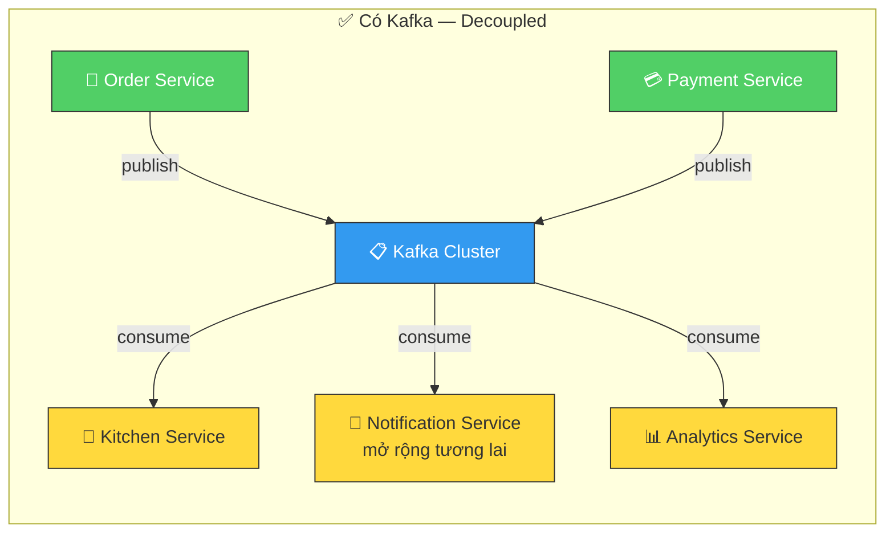

Thiết kế point-to-point này gặp phải một loạt các vấn đề nghiêm trọng:

**Vấn đề 1 — Temporal Coupling (Ràng buộc thời gian):** Order service chỉ hoàn thành khi _tất cả_ các dịch vụ downstream đã phản hồi xong. Nếu Kitchen service đang bảo trì hoặc chạy chậm, khách hàng phải chờ đợi — mặc dù việc tạo ticket nhà bếp không ảnh hưởng đến việc xác nhận đơn hàng của họ.

**Vấn đề 2 — Structural Coupling (Ràng buộc cấu trúc):** Order service phải _biết_ sự tồn tại của Kitchen service. Khi thêm Analytics service, mã nguồn của Order service buộc phải chỉnh sửa. Đây là sự vi phạm nguyên tắc Open/Closed Principle — mỗi khi có consumer mới, producer lại phải thay đổi.

**Vấn đề 3 — Không thể Replay:** Nếu Kitchen service bị khởi động lại đúng thời điểm Order service vừa gửi yêu cầu, message đó sẽ bị mất vĩnh viễn. Không có cách nào để Kitchen service "yêu cầu lại" các đơn hàng mà nó đã bỏ lỡ.

#### Sơ đồ: Ba vấn đề Kafka giải quyết

> Bảng so sánh trực quan ba vấn đề chính của kiến trúc point-to-point và cách Kafka giải quyết từng vấn đề. Kafka sử dụng các log bền vững (persistent logs) ở giữa như một trung gian, loại bỏ hoàn toàn sự phụ thuộc trực tiếp giữa producer và consumer.

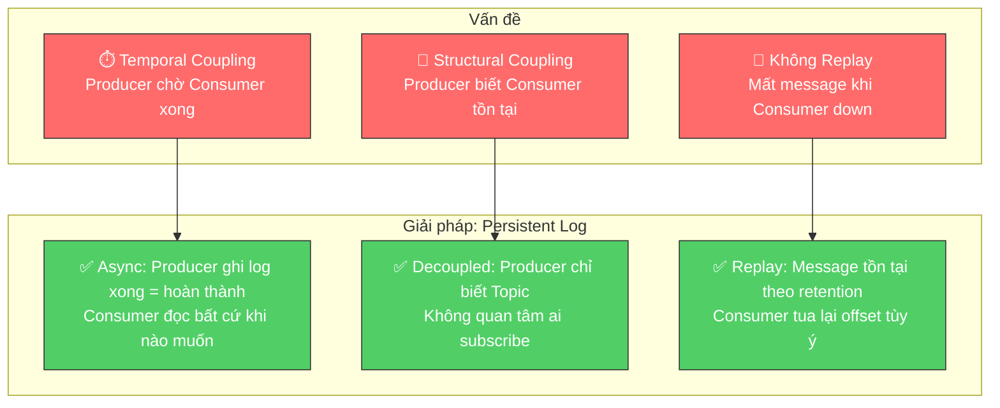

Kafka giải quyết cả ba vấn đề trên bằng một cơ chế duy nhất: **tách biệt producer và consumer thông qua một persistent log ở giữa**.

### 1.2 Khi nào Kafka KHÔNG phải là giải pháp

Kafka không phải là câu trả lời cho mọi vấn đề giao tiếp. Trong QRTable, có 6 sự kiện UI (`order.created`, `menu.updated`, `table.status_changed`, v.v.) được xử lý khác đi — theo BFF Direct Pattern — bởi vì chúng chỉ cần đẩy dữ liệu qua WebSocket cho client mà không cần logic nghiệp vụ ở một bounded context khác. Việc sử dụng Kafka cho các sự kiện này làm tăng thêm độ trễ (latency) và độ phức tạp không cần thiết.

#### Sơ đồ: Cây quyết định — Kafka hay BFF Direct?

> Cây quyết định giúp nhanh chóng xác định khi nào nên dùng Kafka và khi nào dùng BFF Direct. Bắt đầu từ câu hỏi "Sự kiện có kích hoạt logic nghiệp vụ ở một bounded context khác không?" — nếu Có → Kafka, nếu Không (chỉ cập nhật UI) → BFF Direct.

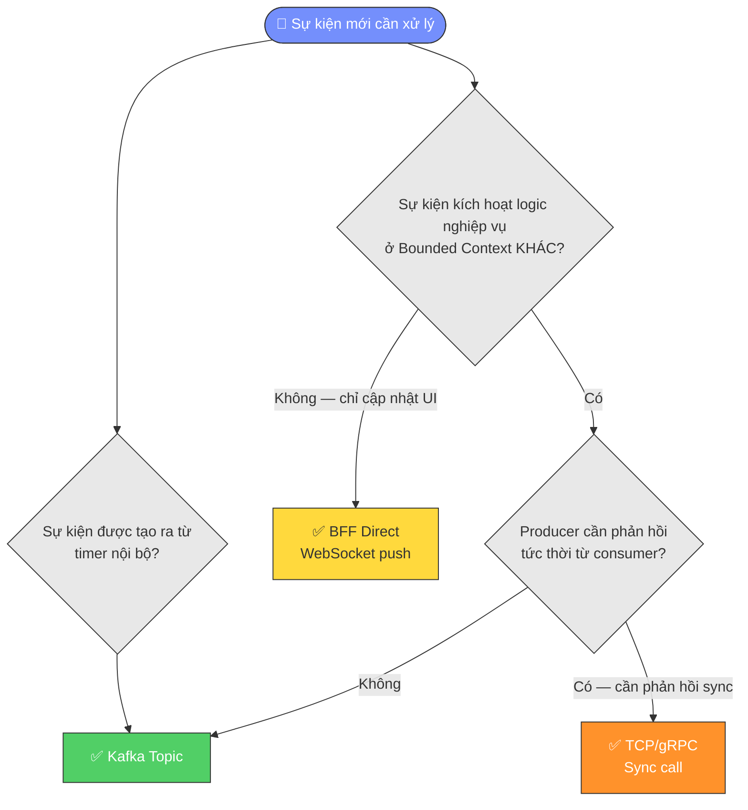

Quy tắc đơn giản: **nếu producer đã có đủ thông tin và chỉ cần thông báo cho UI, đừng dùng Kafka**. Kafka dành cho các trường hợp cần phản ứng nghiệp vụ chéo domain (cross-domain) thực sự hoặc cần temporal decoupling.

---

## 2. Bản chất của Kafka — Distributed Commit Log

Hiểu lầm phổ biến nhất về Kafka là coi nó như một hệ thống message queue phân tán — giống như RabbitMQ nhưng quy mô lớn hơn. Đây là một hiểu lầm cơ bản dẫn đến mọi sai lầm thiết kế sau đó.

### 2.1 Bản chất thực sự của Kafka

Kafka thực chất là một **hệ thống log phân tán, bền vững và chỉ-cho-ghi-đè (append-only log)**. Mỗi topic là một tập hợp các file log được lưu trữ trên đĩa cứng. Khi producer gửi một message, Kafka sẽ nối thêm message đó vào cuối log — không bao giờ chỉnh sửa hay xóa các message đã ghi.

Hãy tưởng tượng một cuốn nhật ký: bạn chỉ viết vào cuối trang, không bao giờ tẩy xóa. Các consumer đọc nhật ký bằng cách ghi nhớ trang mình đã đọc (gọi là _offset_). Khác với các queue truyền thống, các message không bị xóa đi sau khi đọc — chúng vẫn nằm đó cho đến khi hết hạn thời gian lưu trữ (mặc định là 7 ngày).

#### Sơ đồ: Append-Only Log — Cấu trúc cốt lõi của Kafka

> Minh họa tính chất append-only log. Producer chỉ có thể ghi vào cuối log (bên phải). Consumer đọc tại offset của chính nó và dịch chuyển dần sang phải. Các message cũ không bị xóa khi đọc — chúng tồn tại cho đến khi hết thời hạn retention.

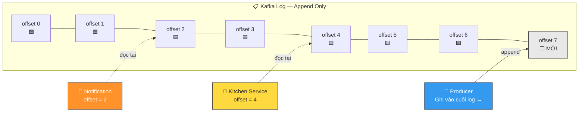

### 2.2 Hệ quả của thiết kế Log

Thiết kế append-only log tạo ra những đặc tính hoàn toàn khác biệt so với một message queue thông thường:

**Đặc tính 1 — Nhiều consumer độc lập:** Vì message không bị xóa sau khi đọc, nhiều consumer có thể đọc cùng một message một cách hoàn toàn độc lập, mỗi bên tự theo dõi vị trí đọc của mình. Trong QRTable hiện tại, `payment.completed` được đọc độc lập bởi Order service và BFF realtime bridge; `tenant.created` được đọc bởi Catalog service để seed area mặc định. Notification là một consumer mở rộng trong tương lai.

**Đặc tính 2 — Khả năng Replay:** Consumer có thể "tua ngược" về một vị trí cũ trong log để đọc lại các message. Nếu Kitchen service gặp bug và xử lý sai 100 đơn hàng trong 2 giờ qua, đội ngũ kỹ thuật có thể sửa code, reset offset về thời điểm 2 giờ trước và cho phép Kitchen service xử lý lại tất cả — mà không cần Order service phải thực hiện bất kỳ hành động nào khác.

**Đặc tính 3 — Consumer tự điều phối tốc độ:** Kafka sử dụng pull model — consumer chủ động _kéo (pull)_ message về theo khả năng của mình, thay vì broker _đẩy (push)_ message xuống consumer. Nếu Kitchen service xử lý chậm, nó chỉ bị tụt lại phía sau (offset thấp hơn) chứ không làm sập toàn bộ hệ thống.

#### Sơ đồ: Ba đặc tính nổi bật của Log

> So sánh trực quan ba tính năng nổi bật của mô hình log so với message queue. Mỗi đặc tính được minh họa bằng một kịch bản cụ thể trong QRTable.

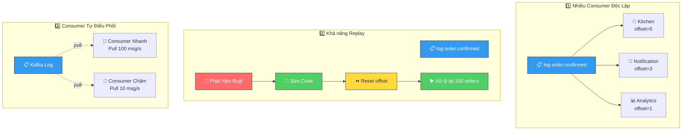

### 2.3 So sánh với Message Queue truyền thống

| Đặc điểm             | RabbitMQ / Queue                          | Apache Kafka                                    |
| :------------------- | :---------------------------------------- | :---------------------------------------------- |
| **Mô hình dữ liệu**  | Queue — message biến mất sau khi tiêu thụ | Log — message tồn tại theo chính sách retention |
| **Mô hình Consumer** | Broker đẩy (push) đến consumer            | Consumer kéo (pull) từ broker                   |
| **Nhiều consumer**   | Cần cấu hình thủ công fan-out exchange    | Tự nhiên — mỗi group đọc độc lập                |
| **Thứ tự**           | Theo từng queue                           | Theo từng partition                             |
| **Replay**           | Không thể                                 | Tua lại offset tùy ý                            |
| **Thông lượng**      | Trung bình                                | Rất cao (sequential disk I/O)                   |
| **Phù hợp với**      | Task queue, RPC async                     | Event streaming, audit log, decoupling          |

#### Sơ đồ: Queue vs Log — Khác biệt cốt lõi

> Minh họa trực quan sự khác biệt giữa mô hình Queue (message biến mất sau khi consumer đọc) và mô hình Log (message được giữ lại bền vững, consumer chỉ dịch chuyển con trỏ offset). Đây là điểm khác biệt cốt lõi quyết định tất cả các thiết kế sau này.

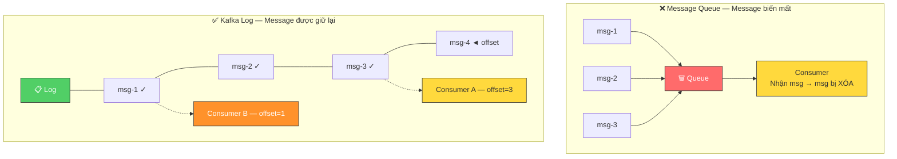

---

## 3. Giải phẫu một Message

Mỗi message trong Kafka đều có cấu trúc cố định. Hiểu rõ từng thành phần giúp bạn thiết kế schema của message chuẩn xác ngay từ đầu.

### 3.1 Các thành phần

Một Kafka message bao gồm 5 thành phần chính:

**Key (tùy chọn):** Một chuỗi byte dùng để xác định message này sẽ đi vào partition nào. Key không phải là ID duy nhất của message — nhiều message có thể có cùng một key. Kafka sẽ băm (hash) key này để chọn partition, đảm bảo tất cả các message có chung key sẽ luôn được đưa vào cùng một partition (đảm bảo thứ tự - ordering guarantee).

Trong QRTable, key của mọi sự kiện là `tenantId`. Lý do sẽ được giải thích chi tiết ở phần 11.

**Value:** Nội dung thực tế của message — thường là JSON. Đây là phần chứa dữ liệu nghiệp vụ: thông tin đơn hàng, sự kiện thanh toán, v.v.

**Headers (tùy chọn):** Metadata dưới dạng key-value, tương tự như HTTP headers. Được sử dụng cho các cross-cutting concerns như tracing ID, tên source service, phiên bản schema. Headers không ảnh hưởng đến việc định tuyến (routing) hay phân vùng (partitioning).

**Timestamp:** Thời gian message được tạo ra (do producer gán hoặc do broker tự gán). Kafka hỗ trợ hai chế độ: `CreateTime` (khi producer gửi) và `LogAppendTime` (khi broker ghi vào log).

**Offset:** Số thứ tự của message trong partition, do Kafka tự gán và tăng dần đều. Offset bắt đầu từ 0 trong mỗi partition và không bao giờ được reset.

#### Sơ đồ: Cấu trúc của một Kafka Message

> Mỗi Kafka message bao gồm 5 thành phần rõ rệt. **Key** quyết định partition nào message sẽ được lưu trữ. **Value** chứa nội dung nghiệp vụ (payload). **Headers** chứa metadata vận hành. **Timestamp** ghi nhận thời gian. **Offset** là số thứ tự do broker tự gán — consumer dựa vào offset để theo dõi vị trí đọc.

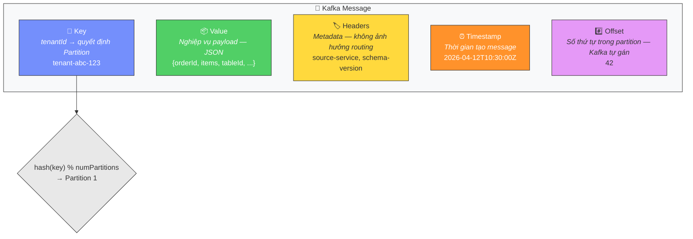

### 3.2 Ví dụ thực tế trong QRTable

Khi Order service xác nhận một đơn hàng từ nhà hàng "The Coffee House", message `order.confirmed` sẽ có dạng:

```
Key: "tenant-abc-123" ← tenantId, quyết định partition
Value: {
  "version": "1.0",
  "timestamp": "2026-04-12T10:30:00Z",
  "tenantId": "tenant-abc-123",
  "orderId": "order-xyz-789",
  "tableId": "table-05",
  "sessionId": "session-qrs-456",
  "items": [
    { "menuItemId": "item-001", "name": "Bạc xỉu", "qty": 2, "type": "drink" },
    { "menuItemId": "item-045", "name": "Bánh mì thịt", "qty": 1, "type": "food" }
  ]
}
Headers: {
  "source-service": "order-service",
  "schema-version": "1.0"
}
```

#### Sơ đồ: Dòng chảy sự kiện `order.confirmed` trong QRTable

> Sơ đồ tuần tự thể hiện hành trình hiện tại của sự kiện `order.confirmed` — từ lúc nhân viên xác nhận đơn hàng, Order service publish vào Kafka, cho tới khi Kitchen service tiêu thụ sự kiện đó để cập nhật Redis KDS. BFF không trực tiếp tiêu thụ `order.confirmed`; cập nhật trạng thái đơn hàng thời gian thực của client sử dụng BFF Direct từ phản hồi TCP, trong khi thông báo thay đổi KDS sử dụng Redis Pub/Sub sau khi ghi dữ liệu.

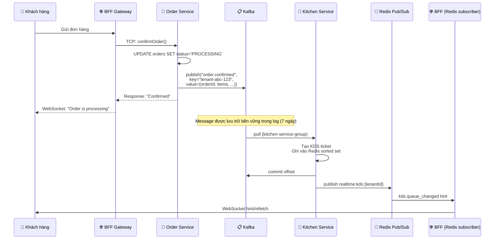

Lưu ý trường `version` trong value và `schema-version` in header: đây là bước chuẩn bị để sau này nâng cấp cấu trúc dữ liệu của message (schema evolution) mà không làm hỏng logic của các consumer phiên bản cũ.

---

## 4. Topic, Partition và Physical Log

### 4.1 Topic là gì

Topic là tên logic để gom nhóm các message cùng loại — tương tự như tên bảng trong cơ sở dữ liệu. `order.confirmed`, `payment.completed` là các topic khác nhau.

Tuy nhiên, một topic không phải là một file hay một hàng đợi duy nhất. Đằng sau hậu trường, mỗi topic được chia làm nhiều **partition**.

### 4.2 Partition — Đơn vị vật lý thực tế

Partition mới chính là đơn vị lưu trữ vật lý thực tế trong Kafka. Mỗi partition là một **file log có thứ tự, bất biến và chỉ-cho-ghi-đè** nằm trên đĩa cứng của broker.

Khi bạn tạo topic `order.confirmed` với 3 partitions, Kafka thực tế sẽ tạo ra 3 file log độc lập trên ổ đĩa:

```
Topic: order.confirmed
├── Partition 0  ──  [msg@offset-0] [msg@offset-1] [msg@offset-4] [msg@offset-6] ...
├── Partition 1  ──  [msg@offset-0] [msg@offset-2] [msg@offset-5] [msg@offset-7] ...
└── Partition 2  ──  [msg@offset-0] [msg@offset-3] [msg@offset-8] ...
```

#### Sơ đồ: Topic, Partition và Offset

> Topic là tên gọi logic, partition là đơn vị vật lý. Mỗi partition là một file log riêng biệt với một chuỗi **offset tăng dần độc lập**. Producer ghi vào partition dựa trên kết quả hash(key). Lưu ý: offset 0 ở Partition 0 và offset 0 ở Partition 1 là hai **message hoàn toàn khác nhau**.

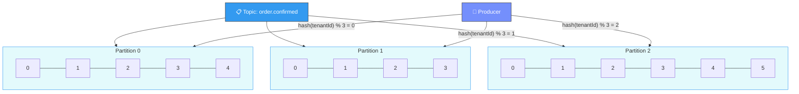

Có hai điểm quan trọng cần nhận ra từ sơ đồ này:

**Quan sát 1 — Offset có giá trị theo từng partition, không có giá trị toàn bộ topic:** Partition 0 có offset 0, Partition 1 cũng có offset 0 của riêng nó. Không có khái niệm "offset toàn cục" cho toàn bộ topic. Khi consumer ghi nhớ vị trí đã đọc, nó phải ghi nhớ cặp `(partition, offset)` cho từng partition cụ thể.

**Quan sát 2 — Thứ tự chỉ được đảm bảo trong phạm vi một partition:** Các message trong Partition 0 được đảm bảo nằm đúng thứ tự thời gian chúng được ghi. Nhưng không có bất kỳ đảm bảo nào về thứ tự giữa một message ở Partition 0 và một message ở Partition 1.

### 4.3 Tại sao cần nhiều Partition

Partition là cơ chế scale (mở rộng) của Kafka theo cả hai hướng:

**Scale ghi (producer):** Producer có thể ghi dữ liệu song song vào nhiều partition khác nhau. 3 partition = 3 "luồng" ghi đồng thời trên ổ đĩa, thay vì phải ghi tuần tự vào một hàng đợi duy nhất.

**Scale đọc (consumer):** Đây là lý do quan trọng hơn. Trong Kafka, **mỗi partition chỉ có thể được xử lý bởi tối đa 1 consumer instance trong cùng một consumer group tại một thời điểm**. Điều này có nghĩa là: số lượng partition của topic chính là _giới hạn trên_ cho khả năng xử lý song song.

#### Sơ đồ: Partition = Đơn vị Scale

> Số lượng partition quyết định mức độ xử lý song song tối đa. Ví dụ: 3 partition → tối đa 3 consumer instance xử lý song song. Instance thứ 4 sẽ rơi vào trạng thái rảnh rỗi (idle). Đây là lý do cần chọn số lượng partition một cách "rộng rãi" khi thiết kế topic.

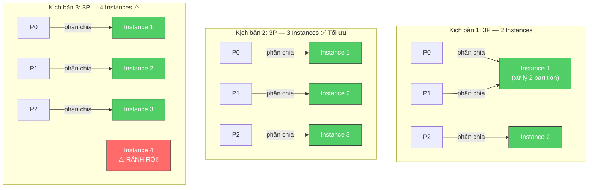

Ví dụ cho QRTable: Nếu `order.confirmed` has 3 partitions và Kitchen service được triển khai với 3 instances, mỗi instance sẽ xử lý 1 partition — năng suất xử lý tăng gấp 3. Nếu tăng lên 4 instances nhưng vẫn giữ 3 partitions, instance thứ 4 sẽ ngồi chơi xơi nước vì không còn partition nào để phân chia.

### 4.4 Log Segment và Retention

Mỗi partition không phải là một file đơn lẻ cực lớn — nó được chia thành nhiều **log segments**, mỗi segment là một file có dung lượng giới hạn (mặc định là 1GB). Khi segment hiện tại đầy, Kafka đóng file lại và tạo ra segment mới.

#### Sơ đồ: Log Segment và Chính Sách Retention

> Mỗi partition chứa nhiều file segment. File segment cũ nhất sẽ bị xóa khi hết hạn thời gian lưu trữ (mặc định là 7 ngày). Kafka tiến hành xóa **toàn bộ file segment** chứ không xóa lẻ tẻ từng message — đây là lý do giúp hoạt động I/O của Kafka rất hiệu quả (ghi tuần tự, xóa theo lô).

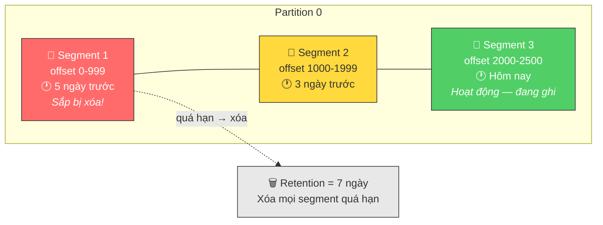

Khi vượt quá thời hạn lưu trữ (retention period - mặc định 7 ngày), Kafka sẽ xóa đi các segment cũ nhất — **nhưng chỉ xóa cả file segment, không xóa lẻ tẻ từng message**. Đây là lý do tại sao Kafka đạt hiệu năng I/O ổ đĩa cực lớn: ghi tuần tự liên tục vào cuối file, và xóa hàng loạt file cũ, không có hoạt động đọc ghi ngẫu nhiên như các database truyền thống.

Trong môi trường phát triển của QRTable, bạn không cần quá bận tâm về retention — cấu hình mặc định 7 ngày là quá đủ. Môi trường production thực tế sẽ cần tối ưu lại dựa theo lưu lượng dữ liệu.

---

## 5. Replication và Đảm bảo an toàn dữ liệu

### 5.1 Tại sao cần Replication

Kafka được thiết kế để chạy trên một cụm gồm nhiều broker (máy chủ). Nếu một broker bị hỏng đột ngột, dữ liệu vẫn được bảo vệ an toàn nhờ cơ chế sao chép (replication). Mặc dù QRTable Phase 2 chạy trên một broker duy nhất ở máy dev, việc nắm rõ cơ chế replication vẫn giúp bạn cấu hình chính xác và giải trình kiến trúc tốt hơn trong đồ án.

### 5.2 Leaders và Followers

Mỗi partition sẽ có 1 bản **leader** và nhiều bản **follower** (số lượng bản sao follower = replication factor - 1):

- **Leader:** Chịu trách nhiệm xử lý mọi yêu cầu đọc và ghi cho partition đó.
- **Follower:** Chỉ có nhiệm vụ sao chép dữ liệu từ leader, không phục vụ trực tiếp cho client.

Khi leader của một partition bị sập, một follower nằm trong danh sách ISR (In-Sync Replicas) sẽ tự động được bầu làm leader mới — quá trình này diễn ra hoàn toàn tự động.

#### Sơ đồ: Replication — Leader, Follower và ISR

> Mỗi partition chỉ có duy nhất 1 Leader xử lý toàn bộ các thao tác đọc/ghi. Các bản Follower liên tục sao chép dữ liệu từ Leader để đồng bộ. Tập hợp các replica **đã đồng bộ đầy đủ** được gọi là ISR. Khi Leader gặp sự cố, một Follower trong ISR sẽ được bầu làm Leader mới — không làm mất mát dữ liệu.

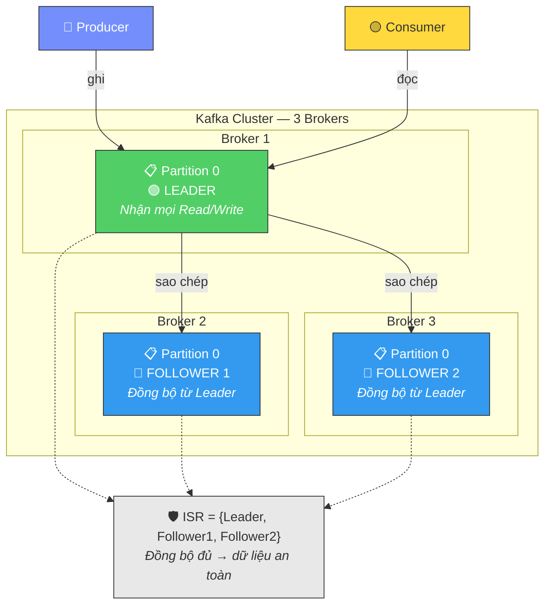

### 5.3 ISR — In-Sync Replicas

ISR là tập hợp các replica (gồm cả bản leader và các bản follower) đang có trạng thái dữ liệu đồng bộ hoàn toàn với leader. Một follower sẽ bị loại khỏi danh sách ISR nếu nó bị mất kết nối hoặc tụt lại quá xa so với leader (mặc định là quá 10 giây không gửi tín hiệu đồng bộ).

ISR là khái niệm mấu chốt để hiểu cấu hình xác thực `acks` của producer.

### 5.4 Acks — Producer chờ xác nhận trong bao lâu?

Khi producer gửi đi một message, nó có thể thiết lập mức độ xác nhận muốn nhận từ broker. Đây là sự đánh đổi giữa **độ an toàn dữ liệu** và **hiệu năng (latency)**:

`**acks=0` (gửi và quên - fire-and-forget):\*\* Producer gửi message đi và đi tiếp mà không cần đợi bất kỳ phản hồi nào từ broker. Tốc độ nhanh nhất nhưng cực kỳ dễ mất dữ liệu nếu broker bị sập ngay sau khi nhận gói tin. Cấu hình này chỉ thích hợp cho việc ghi log metric không quan trọng — không dùng cho QRTable.

`**acks=1`:\*\* Producer sẽ đợi cho đến khi bản leader ghi nhận thành công message vào ổ đĩa mới tiếp tục gửi. Nếu bản leader sập trước khi các follower kịp đồng bộ bản ghi đó, dữ liệu sẽ bị mất. Chấp nhận được với sự kiện `kitchen.sla_warning` (sự kiện phát sinh từ timer nội bộ, mất đi một cảnh báo không gây hậu quả lớn).

`**acks=all` (hoặc `acks=-1`):\** Producer chỉ tiếp tục khi *tất cả\* các replica trong danh sách ISR đã xác nhận ghi dữ liệu thành công. Đây là mức độ an toàn cao nhất — thích hợp cho các sự kiện cốt lõi của hệ thống như `order.confirmed`, `payment.completed`, `tenant.created` bởi vì việc mất mát các sự kiện này sẽ để lại hậu quả nghiêm trọng đối với hoạt động kinh doanh.

#### Sơ đồ: Các cấp độ Acks — Đánh đổi giữa An toàn và Hiệu năng

> Ba cấp độ acks tạo nên một dải đánh đổi từ nhanh nhất (acks=0) đến an toàn nhất (acks=all). QRTable lựa chọn `acks=all` làm cấu hình mặc định cho các sự kiện nghiệp vụ cốt lõi, chấp nhận hy sinh một phần nhỏ latency để đảm bảo dữ liệu không bị thất thoát.

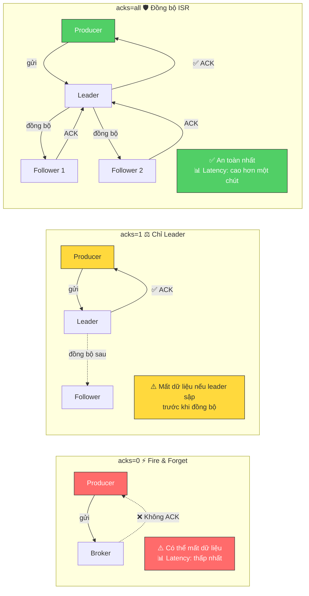

**Quy tắc áp dụng cho QRTable:** Luôn thiết lập cấu hình `acks=all` đi kèm với cấu hình `idempotent=true` (sẽ được giải thích ở phần 6) làm mặc định cho mọi producer. Độ trễ gia tăng thêm là không đáng kể so với rủi ro mất mát dữ liệu nghiệp vụ.

---

## 6. Producer — Cơ chế gửi Message

### 6.1 Vòng đời của một Message từ Producer

Khi mã nguồn ứng dụng thực thi lệnh `producer.send(message)`, message không lập tức được truyền đi qua mạng. Nó phải đi qua một pipeline tuần tự như sau:

**Bước 1 — Serialization (Tuần tự hóa):** Cả key và value được chuyển đổi từ dạng object/string trong ngôn ngữ lập trình thành một mảng byte thuần túy. Kafka không quan tâm nội dung bên trong message là gì — nó chỉ làm việc với byte dữ liệu.

**Bước 2 — Partitioner (Bộ phân vùng):** Kafka quyết định message này sẽ được gửi vào partition nào. Logic mặc định: nếu có khai báo key thì `partition = hash(key) % numPartitions`; nếu không khai báo key, message sẽ được phân bổ xoay vòng (round-robin) giữa các partition.

**Bước 3 — Accumulator (Bộ gom dữ liệu):** Message được đưa vào bộ nhớ đệm (buffer memory), _chờ đợi_ để được đóng gói cùng với các message khác tạo thành một batch lớn trước khi gửi đi. Đây là điểm khác biệt cốt lõi — producer không gửi các tin nhắn riêng lẻ.

**Bước 4 — Sender Thread:** Một luồng ngầm liên tục kiểm tra bộ đệm và thực hiện gửi batch dữ liệu sang broker khi thỏa mãn các điều kiện quy định.

#### Sơ đồ: Pipeline bên trong Producer — Từ send() đến Broker

> Pipeline hoàn chỉnh bên trong Kafka Producer. Message phải trải qua bốn giai đoạn trước khi chính thức được đẩy qua mạng tới broker. Đặc biệt, bước gom dữ liệu trong Accumulator là lý do giúp Kafka có throughput cực lớn — gửi hàng trăm message trong một network round-trip thay vì gửi nhỏ giọt từng cái một.

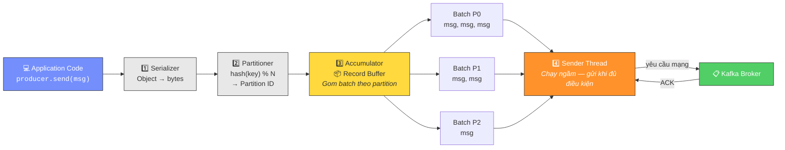

### 6.2 Batching — Tại sao Kafka lại nhanh

Producer tiến hành gom các message thành từng lô (batch) trước khi gửi đi, được cấu hình qua hai tham số quan trọng:

`linger.ms`: Thời gian chờ tối đa để tích lũy message vào batch. Nếu cấu hình `linger.ms=5`, producer sẽ chờ tối đa 5ms để gom thêm message trước khi gửi đi — bất kể batch đó đã đầy hay chưa. Mặc định là 0 (gửi ngay khi có tin nhắn mới), nhưng việc nâng cấu hình này lên 5-10ms sẽ cải thiện rõ rệt throughput của hệ thống khi có lưu lượng truy cập cao.

`batch.size`: Kích thước tối đa của một batch (tính bằng byte). Khi gom đủ dung lượng này, batch sẽ được gửi đi lập tức mà không cần đợi thời gian chờ `linger.ms` kết thúc.

#### Sơ đồ: Cơ chế Batching — linger.ms vs batch.size

> Hai điều kiện kích hoạt việc gửi batch: (1) thời gian chờ `linger.ms` kết thúc hoặc (2) dung lượng `batch.size` đã đầy. Điều kiện nào đến trước sẽ kích hoạt việc gửi đi ngay lập tức. Với QRTable có lưu lượng thấp ở máy dev, giá trị mặc định (linger.ms=0) là đủ dùng.

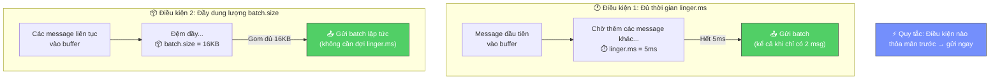

Với QRTable — có lưu lượng thấp (vài chục đơn hàng một giờ trên mỗi nhà hàng) — cấu hình mặc định là đủ đáp ứng. Tuy nhiên, hiểu rõ cơ chế này giúp bạn giải thích được vì sao Kafka vừa đạt được độ trễ thấp (dưới milisecond) vừa có thể xử lý lượng dữ liệu khổng lồ.

### 6.3 Idempotent Producer — Loại bỏ trùng lặp dữ liệu khi Retry

**Bài toán đặt ra:** Producer gửi một message sang broker, broker đã nhận và ghi nhận thành công, nhưng kết nối mạng bị gián đoạn (timeout) trước khi gói tin ACK phản hồi kịp truyền về producer. Lúc này, producer không biết message đã được lưu hay chưa nên nó sẽ tiến hành gửi lại (retry) — broker nhận được message lần thứ hai và tiếp tục ghi nhận. Kết quả: cùng một sự kiện `order.confirmed` xuất hiện hai lần trong Kafka log, dẫn tới việc Kitchen service in ra 2 ticket nhà bếp cho cùng một đơn hàng.

#### Sơ đồ: Bài toán trùng lặp và Giải pháp Idempotent Producer

> **Left**: Không có idempotent — producer gửi lại tạo trùng lặp message. **Right**: Có idempotent — broker phát hiện trùng lặp qua cặp định danh (PID, SeqNum) và bỏ qua việc ghi nhận. Kết quả: Kitchen service chỉ nhận được đúng 1 message.

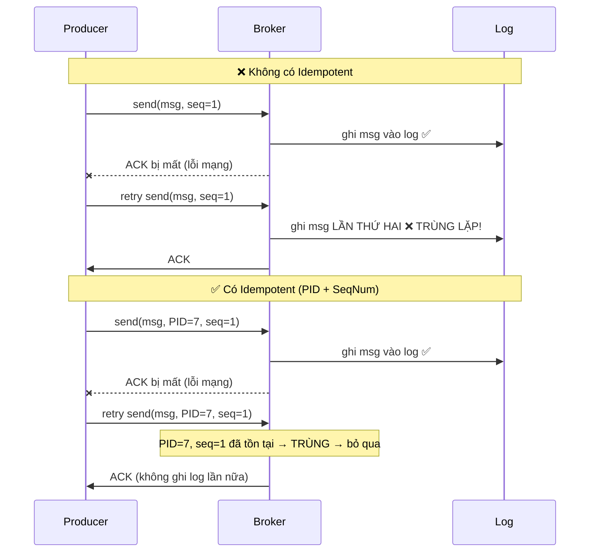

**Giải pháp — Idempotent Producer:** Khi bật cấu hình `idempotent=true`, Kafka sẽ cấp cho mỗi instance producer một mã định danh duy nhất `Producer ID (PID)`. Mỗi message gửi đi được gắn kèm số thứ tự `Sequence Number` tăng dần theo từng partition. Broker kiểm tra: nếu nhận được một message có `(PID, SequenceNumber)` trùng khớp với bản ghi đã lưu → message này bị gửi lặp do lỗi kết nối → bỏ qua không ghi tiếp.

Cơ chế này hoạt động hoàn toàn tự động ở tầng dưới — bạn chỉ cần bật cờ cấu hình trong code, Kafka sẽ tự lo phần việc còn lại.

**Giới hạn cần lưu ý:** Idempotency của producer chỉ có tác dụng trong phạm vi một _session_ (chu kỳ hoạt động của producer từ lúc khởi động đến lúc restart). Nếu Order service bị sập và khởi động lại, nó được cấp một PID mới → không thể phát hiện trùng lặp của các message đã gửi trước thời điểm sập. Đây là lý do chúng ta cần đến Outbox Pattern (xem phần 10) để đảm bảo an toàn dữ liệu ở tầng ứng dụng.

### 6.4 Đảm bảo thứ tự của Producer

Kafka cam kết: **các message gửi từ cùng một producer đến cùng một partition sẽ được ghi theo đúng thứ tự thời gian gửi**.

Tuy nhiên, nếu cấu hình `max.in.flight.requests.per.connection > 1` (mặc định là 5), producer được phép gửi song song nhiều batch trước khi nhận được ACK của batch trước đó. Nếu batch 1 bị lỗi mạng và tiến hành gửi lại (retry) sau khi batch 2 đã ghi nhận thành công → thứ tự các message sẽ bị đảo ngược. Khi bật cấu hình `idempotent=true`, Kafka tự động khắc phục hiện tượng này bằng cách sắp xếp lại thứ tự trên broker dựa vào số sequence number trước khi ghi log.

#### Sơ đồ: Đảm bảo thứ tự — Vấn đề và Giải pháp

> Khi cho phép gửi song song nhiều lô (`max.in.flight > 1`), thứ tự ghi có thể bị đảo lộn nếu lô đầu tiên bị lỗi và phải gửi lại. `idempotent=true` giải quyết triệt để lỗi này bằng cách cho phép broker tự sắp xếp lại dựa trên sequence number trước khi lưu log.

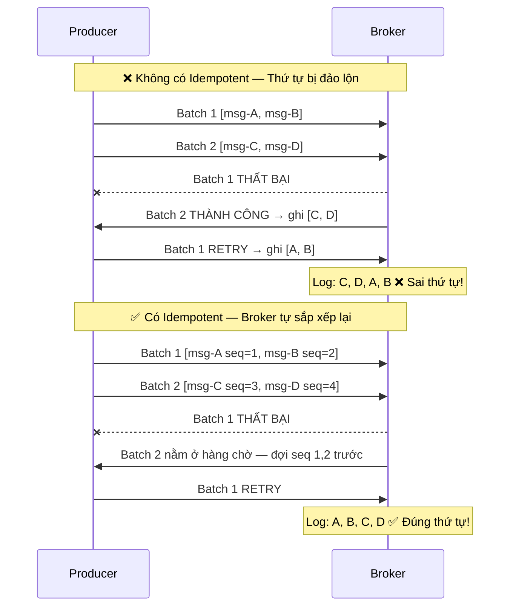

**Kết luận thực tiễn:** Khi bật cấu hình `idempotent=true` (khuyên dùng cho QRTable), bạn đạt được cả hai mục tiêu: không bị trùng lặp dữ liệu và đảm bảo tuyệt đối thứ tự phân phát trên từng partition.

---

## 7. Consumer và Consumer Group

### 7.1 Pull Model vs Push Model

Đây là điểm khác biệt lớn nhất về mặt kiến trúc giữa Kafka và các hệ thống message queue truyền thống.

**Push model (RabbitMQ):** Broker chủ động đẩy message xuống consumer. Nếu consumer xử lý chậm, nó sẽ bị quá tải (flooded). Broker buộc phải nắm được _tốc độ_ xử lý của từng consumer để điều tiết lưu lượng — đây là logic điều phối rất phức tạp.

**Pull model (Kafka):** Consumer chủ động gửi yêu cầu lên broker: "cho tôi xin tối đa N message từ offset M của partition P". Consumer hoàn toàn làm chủ tốc độ xử lý của mình. Nếu Kitchen service đang bận xử lý một đơn hàng lớn phức tạp và cần thêm thời gian, nó chỉ đơn giản là tạm thời chưa gửi yêu cầu kéo message tiếp theo — không cần thông báo gì cho Kafka.

#### Sơ đồ: Push Model vs Pull Model

> **Push** (RabbitMQ): Broker điều phối tốc độ, consumer dễ bị ngập lụt nếu xử lý chậm. **Pull** (Kafka): Consumer làm chủ tốc độ, tự quyết định thời điểm kéo tin nhắn tiếp theo. Pull model cho phép các consumer hoạt động phù hợp với năng lực phần cứng của mình mà không gây áp lực ngược lên broker.

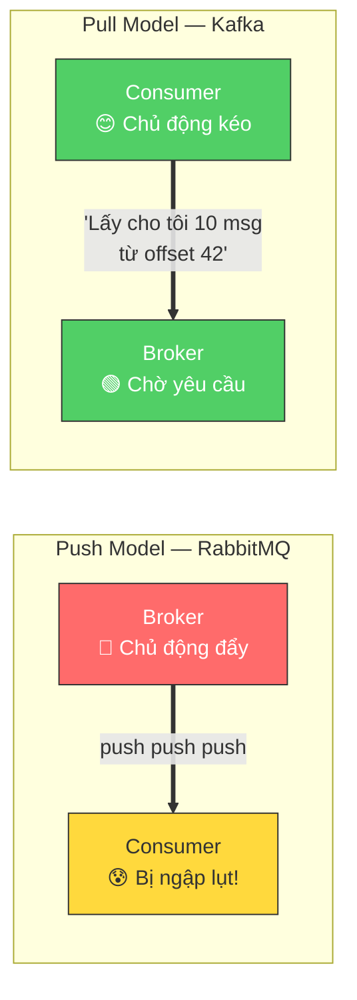

Hệ quả: Consumer có thể gộp nhiều message trong một lần pull để xử lý đồng loạt, sau đó tiến hành commit một lần duy nhất — đạt hiệu năng xử lý cao hơn hẳn so với việc xử lý lắt nhắt từng tin nhắn đơn lẻ.

### 7.2 Offset — Dấu trang của Consumer

Offset là số thứ tự tăng dần của message trong partition. Consumer cần ghi nhớ offset của message _gần nhất mà nó đã xử lý thành công_ để nếu chẳng may bị sập hoặc restart, nó biết cần phải đọc tiếp từ đâu.

Vậy offset của consumer được lưu trữ ở đâu? Kafka lưu nó trong một topic nội bộ chuyên dụng mang tên `__consumer_offsets`. Khi consumer thực hiện hành động "commit" offset, thực chất là nó đang ghi một bản tin vào topic này với nội dung: "consumer group X đã xử lý xong đến offset Y của partition Z thuộc topic T".

#### Sơ đồ: Lưu trữ và Commit Offset của Consumer

> Consumer tự theo dõi vị trí đọc bằng con trỏ offset. Khi xử lý xong dữ liệu, consumer thực hiện "commit" offset — bản chất là ghi vào topic nội bộ `__consumer_offsets`. Khi khởi động lại, consumer sẽ đọc giá trị đã commit này để biết cần xử lý tiếp từ vị trí nào.

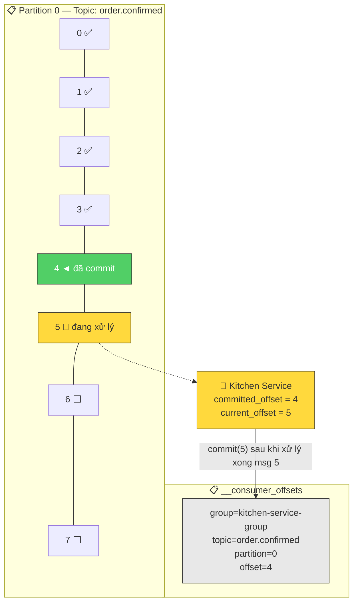

Điểm cốt lõi cần nhớ: **commit offset thực chất là ghi thêm một dòng vào log của Kafka**, không phải xóa message hay cập nhật trạng thái trực tiếp lên file log cũ. Các consumer group khác nhau ghi nhận offset độc lập hoàn toàn, không ảnh hưởng đến nhau.

### 7.3 Consumer Group — Cơ chế scale

Consumer group là tập hợp các consumer instance hoạt động cùng nhau để chia sẻ khối lượng công việc của một topic. Quy tắc tối thượng: **mỗi partition chỉ được gán cho duy nhất 1 consumer instance trong cùng một group tại một thời điểm**.

Hãy tưởng tượng topic `order.confirmed` có 3 partitions và Kitchen service được scale thành 2 instances:

```
Partition 0 ──────────► Kitchen Instance 1
Partition 1 ──────────► Kitchen Instance 1  (1 instance gánh 2 partition)
Partition 2 ──────────► Kitchen Instance 2
```

Khi triển khai thêm instance thứ 3:

```
Partition 0 ──────────► Kitchen Instance 1
Partition 1 ──────────► Kitchen Instance 2
Partition 2 ──────────► Kitchen Instance 3
```

Khi triển khai tiếp instance thứ 4 (trong khi vẫn chỉ có 3 partition):

```
Partition 0 ──────────► Kitchen Instance 1
Partition 1 ──────────► Kitchen Instance 2
Partition 2 ──────────► Kitchen Instance 3
Kitchen Instance 4 ──── rảnh rỗi (idle - không được phân partition nào)
```

**Nhận định quan trọng:** Số lượng partition của topic chính là _nút thắt cổ chai_ giới hạn khả năng scale song song. Bạn không thể có số lượng consumer hoạt động đồng thời nhiều hơn số lượng partition. Đây là lý do tại sao khi khởi tạo topic, chúng ta nên thiết kế số lượng partition dư dả một chút — việc tăng số lượng partition sau này phức tạp hơn nhiều so với việc duy trì dư thừa partition từ đầu.

### 7.4 Phân chia Partition và Rebalancing

Mỗi khi cấu trúc của một consumer group thay đổi (có thêm instance mới gia nhập, instance cũ bị tắt đi hoặc đột ngột gặp sự cố mất kết nối), Kafka sẽ tính toán phân chia lại các partition cho các instance còn hoạt động — quá trình này gọi là **rebalancing**.

#### Sơ đồ: Tiến trình Rebalancing

> Quá trình phân phối lại partition khi có thay đổi nhân sự trong group. Trong thời gian rebalancing diễn ra, **toàn bộ các instance trong group phải dừng hoạt động đọc tin nhắn** (hiện tượng stop-the-world), tạo ra độ trễ dịch vụ tạm thời. Thiết lập Static Group Membership giúp hạn chế việc này bằng cách cho phép instance offline tạm thời mà không kích hoạt rebalance.

```mermaid
sequenceDiagram
    participant C1 as Consumer 1
    participant C2 as Consumer 2
    participant C3 as Consumer 3 (Mới)
    participant GC as Group Coordinator

    Note over C1,GC: Trước khi C3 gia nhập
    C1->>GC: Gửi Heartbeat (giữ P0, P1)
    C2->>GC: Gửi Heartbeat (giữ P2)

    Note over C1,GC: 🔄 C3 Join → Kích hoạt Rebalance
    C3->>GC: Gửi JoinGroup request
    GC->>C1: Thu hồi partition ⏸️ TẠM DỪNG xử lý
    GC->>C2: Thu hồi partition ⏸️ TẠM DỪNG xử lý

    Note over C1,GC: ⚠️ STOP-THE-WORLD — Không ai xử lý message

    GC->>C1: Chọn làm Leader — tính toán phân chia mới
    C1->>GC: Kết quả phân chia: C1=P0, C2=P1, C3=P2

    GC->>C1: Gán P0 ▶️ Hoạt động tiếp
    GC->>C2: Gán P1 ▶️ Hoạt động tiếp
    GC->>C3: Gán P2 ▶️ Hoạt động tiếp
```

**Quy trình rebalancing:**

1. Một broker được chỉ định làm Group Coordinator nhận biết sự thay đổi cấu trúc trong group.
2. Group Coordinator yêu cầu tất cả các consumer hiện tại tạm thời bàn giao lại partition đang giữ — toàn bộ group tạm ngưng đọc dữ liệu.
3. Consumer được bầu làm **Group Leader** (thường là instance kết nối sớm nhất) nhận danh sách các instance đang hoạt động và tính toán phương án phân chia partition mới.
4. Phương án phân chia được gửi lại cho từng consumer thông qua Group Coordinator.
5. Các consumer nhận partition mới và tiếp tục công việc.

**Tác hại của rebalancing:** Trong suốt thời gian rebalancing diễn ra, toàn bộ group consumer rơi vào trạng thái ngừng hoạt động — gọi là "stop-the-world". Với các dịch vụ yêu cầu phản hồi nhanh như KDS của QRTable, điều này là không mong muốn.

**Giải pháp giảm thiểu rebalancing:** Áp dụng `Static Group Membership` — gán cho mỗi consumer instance một định danh cố định `instanceId`. Khi một instance bị mất kết nối và kết nối lại trong khoảng thời gian `sessionTimeout`, Kafka sẽ nhận diện đây vẫn là instance cũ (trùng instanceId) và bỏ qua việc kích hoạt rebalance. Chỉ khi quá thời gian timeout quy định mà instance chưa xuất hiện lại, nó mới bị coi là đã rời group thực sự.

### 7.5 Auto Commit vs Manual Commit — Sự lựa chọn nguy hiểm

Đây là một trong những nguồn phát sinh bug khó debug nhất khi làm việc với Kafka.

#### Sơ đồ: Auto Commit — Nguy cơ mất mát dữ liệu

> Minh họa tình huống mất mát tin nhắn khi sử dụng tính năng tự động commit (auto commit). Auto commit tự chạy theo chu kỳ thời gian (mặc định 5 giây) mà không cần quan tâm kết quả xử lý nghiệp vụ. Nếu consumer bị crash giữa chừng, những tin nhắn đã bị commit dù chưa kịp xử lý xong sẽ bị **mất dấu vĩnh viễn** — Kitchen service sẽ không bao giờ in ra ticket tương ứng.

```mermaid
graph TB
subgraph "❌ Auto Commit — Mất mát 4 message"
        direction TB
        AC1["12:00:00 — Pull về 10 message (offset 0-9)"]
AC2["12:00:03 — Xử lý xong msg từ 0 đến 5"]
        AC3["12:00:05 — ⚡ AUTO COMMIT offset=9<br/><i>Commit sạch 10 msg dù thực tế mới xử lý xong 6</i>"]
        AC4["12:00:06 — 💥 CRASH khi đang xử lý msg 6"]
        AC5["12:00:10 — Khởi động lại → đọc tiếp từ offset 10<br/>❌ Các message 6,7,8,9 BỊ MẤT VĨNH VIỄN"]

        AC1 --> AC2 --> AC3 --> AC4 --> AC5
    end

subgraph "✅ Manual Commit — An toàn dữ liệu"
        direction TB
        MC1["12:00:00 — Pull về 10 message"]
        MC2["12:00:03 — Xử lý xong msg từ 0 đến 5"]
        MC3["12:00:03 — Chủ động commit offset=5"]
        MC4["12:00:06 — 💥 CRASH khi đang xử lý msg 6"]
        MC5["12:00:10 — Khởi động lại → đọc lại từ offset 6<br/>✅ Các message 6,7,8,9 được xử lý lại"]

        MC1 --> MC2 --> MC3 --> MC4 --> MC5
    end

    style AC3 fill:#ff6b6b,stroke:#333,color:#fff
    style AC5 fill:#ff6b6b,stroke:#333,color:#fff
    style MC3 fill:#51cf66,stroke:#333,color:#fff
    style MC5 fill:#51cf66,stroke:#333,color:#fff
```

**Auto Commit:** Kafka tự động gửi lệnh commit offset định kỳ (mặc định 5 giây một lần). Nguy hiểm ở chỗ: commit diễn ra theo thời gian trôi qua, không đi theo kết quả xử lý nghiệp vụ. Nếu consumer lấy về 10 tin nhắn lúc 12:00:00, đến hạn 12:00:05 nó tự động commit hết cả 10 tin nhắn, trong khi thực tế ứng dụng mới xử lý xong đến tin nhắn thứ 6. Lúc 12:00:06 consumer bị crash khi đang xử lý tin nhắn thứ 7. Khi bật lại, Kafka thấy offset đã được commit → bỏ qua, chạy thẳng sang tin nhắn thứ 11. **4 tin nhắn (7, 8, 9, 10) bị bỏ sót hoàn toàn** — Kitchen service mất đi 4 đơn hàng của khách.

**Manual Commit:** Consumer tự chịu trách nhiệm phát lệnh commit offset sau khi đã thực hiện xử lý nghiệp vụ và lưu trữ kết quả thành công. Đây là mô hình chuẩn mực bắt buộc cho QRTable:

```
1. Consumer pull message về
2. Thực hiện xử lý nghiệp vụ (tạo ticket KDS, lưu Redis, v.v.)
3. Xử lý THÀNH CÔNG → gọi lệnh commit offset
4. Xử lý THẤT BẠI → KHÔNG gọi commit → tin nhắn sẽ được pull lại ở lần khởi động sau
```

NestJS Kafka transport mặc định triển khai cơ chế manual commit theo nguyên lý: hàm xử lý (handler) hoàn thành bình thường → commit; hàm xử lý ném ra lỗi (exception) → bỏ qua không commit → tin nhắn sẽ được xử lý lại. Hãy hiểu rõ nguyên lý này để viết khối try-catch chính xác (tránh bắt lỗi và nuốt exception nếu bạn muốn kích hoạt cơ chế retry).

---

## 8. Delivery Semantics

### 8.1 Ba cấp độ đảm bảo

**At-most-once (tối đa 1 lần):** Message được xử lý tối đa 1 lần, nhưng có nguy cơ bị mất mát hoàn toàn. Đạt được bằng cách thực hiện commit offset _trước_ khi bắt đầu xử lý nghiệp vụ. Nếu gặp sự cố sập nguồn sau khi commit nhưng trước khi xử lý xong → message bị bỏ qua vĩnh viễn ở lần khởi động sau.

Đây là cấp độ an toàn thấp nhất, chỉ phù hợp cho dữ liệu không quan trọng như thu thập metric giám sát hệ thống — mất mát vài điểm dữ liệu không gây ảnh hưởng lớn. **QRTable tuyệt đối không dùng at-most-once** cho các sự kiện nghiệp vụ.

**At-least-once (tối thiểu 1 lần):** Message chắc chắn được xử lý ít nhất một lần, nhưng chấp nhận rủi ro bị trùng lặp dữ liệu (duplicate). Đạt được bằng cách thực hiện commit offset _sau_ khi đã xử lý nghiệp vụ thành công. Nếu sập nguồn sau khi xử lý xong nhưng trước khi kịp commit → message sẽ được pull và xử lý lại ở lần khởi động sau.

**Đây là cấu hình chuẩn của QRTable áp dụng cho mọi sự kiện nghiệp vụ.** Hệ quả bắt buộc: mọi consumer xử lý tin nhắn đều phải có đặc tính **idempotent** — tức là việc xử lý cùng một tin nhắn nhiều lần phải cho ra kết quả đồng nhất như xử lý một lần duy nhất.

**Exactly-once (chính xác 1 lần):** Message được xử lý đúng một lần duy nhất. Kafka hỗ trợ cơ chế này thông qua tính năng Kafka Transactions — kết hợp giữa idempotent producer, các hàm API hỗ trợ transactional, và chế độ cô lập `read_committed` ở phía consumer. Cơ chế này rất phức tạp, ảnh hưởng nhiều đến hiệu năng hệ thống, và bắt buộc cả producer lẫn consumer phải hoạt động hoàn toàn bên trong hệ sinh thái Kafka (không áp dụng được khi consumer cần ghi dữ liệu vào PostgreSQL hay Redis).

**QRTable không áp dụng exactly-once** ở tầng Kafka. Thay vào đó, chúng ta giải quyết bài toán này bằng cách đảm bảo tính idempotency ở tầng ứng dụng — đơn giản hơn và hoàn toàn đáp ứng được quy mô dự án.

#### Sơ đồ: Dải Cấp Độ Delivery Semantics

> Ba mức độ đảm bảo tạo nên một dải lựa chọn từ đơn giản nhất đến phức tạp nhất. QRTable lựa chọn **At-least-once** (vùng ở giữa) — đảm bảo dữ liệu không bị thất thoát, chấp nhận có trùng lặp và triệt tiêu trùng lặp bằng logic idempotent ở phía consumer. Đây là lựa chọn phổ biến nhất trong các hệ thống thực tế.

```mermaid
graph TB
    subgraph "📊 Dải Cấp Độ Delivery Semantics"
        AT_MOST["⚡ At-Most-Once<br/>───────────────<br/>Commit TRƯỚC khi xử lý<br/>✅ Nhanh, đơn giản<br/>❌ Có thể MẤT message<br/>───────────────<br/>📌 Phù hợp: Metrics, logs"]

        AT_LEAST["⚖️ At-Least-Once<br/>───────────────<br/>Commit SAU khi xử lý<br/>✅ Không mất dữ liệu<br/>⚠️ Có thể trùng lặp<br/>→ Cần consumer idempotent<br/>───────────────<br/>📌 QRTable ✅ LỰA CHỌN"]

        EXACTLY["🛡️ Exactly-Once<br/>───────────────<br/>Kafka Transactions<br/>✅ Xử lý đúng 1 lần<br/>❌ Phức tạp, overhead cao<br/>❌ Chỉ hoạt động trong Kafka<br/>───────────────<br/>📌 Không dùng cho QRTable"]
    end

    AT_MOST ---|"Tăng độ an toàn →"| AT_LEAST ---|"Tăng độ phức tạp →"| EXACTLY

    style AT_MOST fill:#ff6b6b,stroke:#333,color:#fff
    style AT_LEAST fill:#51cf66,stroke:#333,color:#fff
    style EXACTLY fill:#748ffc,stroke:#333,color:#fff
```

### 8.2 Idempotent Consumer — Xử lý trùng lặp an toàn

Vì cấu hình at-least-once có thể gửi tin nhắn nhiều lần, consumer bắt buộc phải được thiết kế để xử lý các bản tin trùng lặp một cách an toàn.

**Ví dụ thực tế:** Giả sử sự kiện `order.confirmed` của đơn hàng có ID "order-789" bị đẩy xuống Kitchen service 2 lần (do consumer bị sập ngay sau khi xử lý nhưng trước khi kịp commit offset). Nếu Kitchen service không có cơ chế chặn trùng lặp, nó sẽ ghi nhận và tạo ra 2 ticket KDS cho cùng 1 đơn hàng — nhà bếp sẽ chế biến món ăn 2 lần.

**Giải pháp — Idempotency Key + Deduplication Store:**

Trước khi xử lý sự kiện, consumer kiểm tra sự tồn tại của một khóa duy nhất (idempotency key) trong một bộ lưu trữ trung gian (thường là Redis). Nếu khóa đã tồn tại → message này đã được xử lý xong từ trước → bỏ qua. Nếu chưa tồn tại → thực hiện xử lý nghiệp vụ, sau đó ghi lại khóa vào Redis để đánh dấu.

#### Sơ đồ: Quy trình xử lý tại Idempotent Consumer

> Lưu đồ xử lý chặn trùng lặp tại consumer. Mỗi message đi qua đều được kiểm tra sự tồn tại của idempotency key trong Redis. Nếu đã tồn tại → đây là bản ghi trùng lặp → bỏ qua an toàn và commit offset. Khóa chỉ cần lưu với thời gian sống (TTL) là 24 giờ để đảm bảo bao phủ mọi kịch bản retry lỗi mạng.

```mermaid
flowchart TD
START(["📨 Nhận order.confirmed<br/>orderId=order-789<br/>tenantId=t-001"]) --> KEY["🔑 Tạo idempotency key<br/><code>kds_processed:t-001:order-789</code>"]

KEY --> CHECK{"🔍 Khóa đã tồn tại<br/>trong Redis?"}

CHECK -->|"CÓ → TRÙNG LẶP"| SKIP["⏭️ Bỏ qua<br/>Kết thúc xử lý"]
    SKIP --> COMMIT_SKIP["✅ Commit offset"]

CHECK -->|"CHƯA → Lần đầu"| PROCESS["⚙️ Xử lý nghiệp vụ:<br/>Tạo ticket KDS<br/>trong Redis sorted set"]

PROCESS --> WRITE_KEY["📝 Ghi nhận idempotency key<br/>vào Redis (TTL=24h)"]

    WRITE_KEY --> COMMIT["✅ Commit Kafka offset"]

PROCESS -->|"❌ Xử lý lỗi"| NO_COMMIT["❌ KHÔNG commit<br/>→ Tin nhắn sẽ được gửi lại"]

    style START fill:#748ffc,stroke:#333,color:#fff
    style CHECK fill:#ffd93d,stroke:#333,color:#333
    style SKIP fill:#e8e8e8,stroke:#333
    style PROCESS fill:#339af0,stroke:#333,color:#fff
    style WRITE_KEY fill:#51cf66,stroke:#333,color:#fff
    style COMMIT fill:#51cf66,stroke:#333,color:#fff
    style COMMIT_SKIP fill:#51cf66,stroke:#333,color:#fff
    style NO_COMMIT fill:#ff6b6b,stroke:#333,color:#fff
```

```
Khi nhận sự kiện order.confirmed của đơn hàng orderId="order-789", thuộc tenant t-001:

1. Tạo idempotency key: "kds_processed:t-001:order-789"
2. Truy vấn Redis: khóa này đã tồn tại chưa?
   - CÓ → đây là tin nhắn trùng lặp, dừng xử lý (kết thúc hàm bình thường)
   - CHƯA → tiếp tục thực hiện
3. Xử lý nghiệp vụ: ghi nhận tạo ticket KDS trong Redis sorted set
4. Ghi nhận idempotency key vào Redis với thời hạn hết hạn (TTL) là 24 giờ
5. Thực hiện commit offset trên Kafka
```

Thiết lập thời gian sống (TTL) cho khóa là 24 giờ là đủ an toàn vì hoạt động gửi lại (retry) của Kafka thường diễn ra trong vòng vài giây hoặc vài phút, không kéo dài sang ngày hôm sau.

**Lưu ý quan trọng về thứ tự thực hiện các bước 4 và 5:** Bắt buộc phải ghi nhận khóa idempotency key thành công vào Redis _trước_ khi thực hiện commit offset lên Kafka. Nếu hệ thống sập nguồn sau bước 3 (tạo ticket) nhưng trước khi ghi khóa (bước 4) và trước khi commit (bước 5), message sẽ được retry gửi lại. Ở lần retry này, vì chưa có khóa trong Redis, consumer tiếp tục xử lý lại bước 3 (tạo ticket đè lên dữ liệu cũ) và ghi khóa thành công. Nếu bạn commit offset trước khi ghi khóa, có nguy cơ gặp race condition làm mất đi cơ chế bảo vệ.

---

## 9. Quyết định kiến trúc: Kafka vs BFF Direct trong QRTable

### 9.1 Khung quyết định 4P+2AP — Ý nghĩa thực tế

Kiến trúc của QRTable định nghĩa một tập hợp quy tắc 4P+2AP để hỗ trợ kỹ sư đưa ra quyết định khi nào nên định tuyến sự kiện qua Kafka và khi nào nên dùng BFF Direct. Dưới đây là giải thích chi tiết ý nghĩa của từng nguyên tắc.

#### Sơ đồ: Khung Quyết Định 4P + 2AP — Toàn Cảnh

> Bản đồ toàn cảnh khung quyết định gồm 4 nguyên tắc sử dụng Kafka (P1-P4) và 2 anti-pattern cần tránh sử dụng Kafka (AP1-AP2). Mỗi nguyên tắc được đi kèm ví dụ thực tế trong dự án QRTable.

```mermaid
graph TB
    FRAMEWORK["🏗️ Khung quyết định 4P + 2AP"]

subgraph POSITIVE["✅ 4P — Nên dùng Kafka khi..."]
P1["P1: Phản ứng chéo ngữ cảnh (Cross-Context)<br/><i>Logic nghiệp vụ thuộc một BC khác</i><br/>📌 order.confirmed → Kitchen tạo ticket"]
P2["P2: Tách biệt thời gian (Temporal Decoupling)<br/><i>Producer không được phép chờ</i><br/>📌 kitchen.sla_warning sinh ra từ timer"]
P3["P3: Gửi đi nhiều nơi (Fan-out)<br/><i>1 sự kiện → nhiều consumer xử lý</i><br/>📌 payment.completed → 3 service tiêu thụ"]
P4["P4: Đảm bảo tính nguyên tử (Atomicity)<br/><i>Sự kiện gắn liền với giao dịch ghi DB</i><br/>📌 Outbox Pattern"]
    end

subgraph NEGATIVE["❌ 2AP — KHÔNG dùng Kafka khi..."]
AP1["AP1: Kafka làm Proxy cho UI (UI Proxy)<br/><i>BFF đã có đủ thông tin → BFF Direct</i><br/>📌 order.created, menu.updated"]
AP2["AP2: Sử dụng TCP cho các tác vụ Fire-and-Forget<br/><i>Đừng dùng TCP cho các việc<br/>không cần phản hồi kết quả</i>"]
    end

    FRAMEWORK --> POSITIVE
    FRAMEWORK --> NEGATIVE

    style FRAMEWORK fill:#748ffc,stroke:#333,color:#fff
    style POSITIVE fill:#d3f9d8,stroke:#51cf66
    style NEGATIVE fill:#ffe3e3,stroke:#ff6b6b
    style P1 fill:#51cf66,stroke:#333,color:#fff
    style P2 fill:#51cf66,stroke:#333,color:#fff
    style P3 fill:#51cf66,stroke:#333,color:#fff
    style P4 fill:#51cf66,stroke:#333,color:#fff
    style AP1 fill:#ff6b6b,stroke:#333,color:#fff
    style AP2 fill:#ff6b6b,stroke:#333,color:#fff
```

**P1 — Cross-Context Domain Reaction (Phản ứng chéo ngữ cảnh):**

Đây là nguyên tắc cốt lõi của Kiến trúc hướng sự kiện (Event-Driven Architecture). Kafka phù hợp nhất khi một sự thay đổi trạng thái ở Bounded Context A cần kích hoạt một **logic nghiệp vụ độc lập** nằm ở Bounded Context B.

Từ khóa quan trọng ở đây là "logic nghiệp vụ độc lập" — không phải là hoạt động làm mới UI, không phải xóa cache, mà là logic nghiệp vụ thực sự thuộc về trách nhiệm của context nhận dữ liệu.

Ví dụ áp dụng P1 trong QRTable: Khi một đơn hàng được xác nhận (Order Context), Kitchen service (Kitchen Context) cần tạo ticket KDS tương ứng — đây là nghiệp vụ riêng của bếp, không liên quan đến Order. Order service không cần biết và không cần quan tâm cách bếp chế biến món ăn như thế nào. → Định tuyến `order.confirmed` qua Kafka.

Ngược lại, khi nhân viên xác nhận đơn hàng và BFF cần đẩy cập nhật WebSocket xuống cho client — đây không phải là logic nghiệp vụ của một bounded context khác, nó chỉ là một tác vụ hiển thị UI. BFF hoàn toàn có thể tự lấy thông tin này từ kết quả phản hồi của lệnh gọi TCP. → Không dùng Kafka, dùng BFF Direct.

**P2 — Temporal Decoupling (Tách biệt thời gian):**

Sử dụng Kafka khi producer không được phép chờ đợi consumer hoàn thành công việc. Có hai trường hợp cụ thể:

_Trường hợp 1 — Consumer xử lý lâu:_ Kitchen service có thể mất vài giây để khởi tạo và phân chia ticket nhà bếp. Order service không thể bắt khách hàng ngồi chờ bếp tạo xong ticket mới trả về kết quả thành công — điều đó làm giảm trải nghiệm người dùng (UX) và tạo ràng buộc về thời gian.

_Trường hợp 2 — Sự kiện sinh ra từ timer nội bộ:_ `kitchen.sla_warning` được tạo ra tự động bởi timer chạy ngầm của Kitchen service khi một món ăn bị nấu quá thời gian quy định. Sự kiện này không đi kèm với bất kỳ yêu cầu HTTP nào từ client, không có đối tượng gọi để trả phản hồi. Chúng ta không thể sử dụng kết nối TCP hay BFF Direct. → Bắt buộc phải truyền qua Kafka.

**P3 — Fan-out (Gửi đi nhiều nơi):**

Kafka đặc biệt phù hợp khi một sự kiện đơn lẻ cần kích hoạt nhiều hành động nghiệp vụ khác nhau ở nhiều bounded context độc lập. Producer chỉ publish một lần duy nhất, các consumer tự động nhận dữ liệu.

Ví dụ thực tế: Sự kiện `payment.completed` cần kích hoạt hoạt động của Order service (đóng session, đánh dấu hóa đơn đã thanh toán, gọi Catalog service qua TCP để chuyển trạng thái bàn về trống) và BFF realtime bridge (cập nhật UI hiển thị). Nếu sử dụng kết nối TCP tuần tự cho từng tác vụ này, Payment service sẽ bị phụ thuộc quá nhiều vào các service phía sau. Với Kafka, Payment chỉ cần phát một sự kiện; Order và BFF tự động tiêu thụ độc lập. Tác vụ gửi hóa đơn điện tử qua email (Notification) sẽ là consumer bổ sung sau này.

#### Sơ đồ: Cơ chế Fan-out đối với sự kiện `payment.completed`

> Minh họa nguyên tắc P3 Fan-out qua ví dụ sự kiện `payment.completed`. Payment service chỉ cần phát đi một sự kiện duy nhất → 3 group consumer chạy song song xử lý 3 logic nghiệp vụ khác nhau hoàn toàn. Việc thêm Analytics service sau này chỉ cần cho subscribe vào topic — **không làm thay đổi một dòng code nào của Payment service**.

```mermaid
graph LR
PAY["💳 Payment Service<br/><i>Publish duy nhất 1 lần</i>"]
    TOPIC["📋 payment.completed"]

    PAY -->|"publish"| TOPIC

TOPIC -->|"consume"| OS["🛒 Order Service<br/>Đóng session/bill<br/>Gọi Catalog TCP"]
    TOPIC -->|"consume"| BFF["🌐 BFF Bridge<br/>WebSocket cập nhật UI"]
    TOPIC -.->|"mở rộng tương lai"| NS["📧 Notification Service<br/>Gửi email hóa đơn"]
TOPIC -.->|"tương lai"| AS2["📊 Analytics Service<br/><i>Chỉ cần subscribe</i><br/><i>Không sửa code Payment!</i>"]

    style PAY fill:#748ffc,stroke:#333,color:#fff
    style TOPIC fill:#339af0,stroke:#333,color:#fff
    style OS fill:#51cf66,stroke:#333,color:#fff
    style BFF fill:#51cf66,stroke:#333,color:#fff
    style NS fill:#51cf66,stroke:#333,color:#fff
    style AS2 fill:#e8e8e8,stroke:#999,stroke-dasharray: 5 5
```

**P4 — Atomicity Safeguard (Bảo vệ tính nguyên tử):**

Khi một domain event là kết quả của một hoạt động thay đổi trạng thái trong database, sự kiện đó _phải_ được ghi nhận đồng thời trong cùng một transaction với trạng thái đó. Nếu không, có nguy cơ: database ghi nhận thành công nhưng việc gửi tin nhắn lên Kafka thất bại → hệ thống rơi vào trạng thái bất đồng nhất dữ liệu vĩnh viễn.

Đây là nguyên nhân chúng ta cần đến Outbox Pattern (xem phần 10). Ở Phase 2, nguyên tắc P4 được đơn giản hóa để giảm tải độ phức tạp vận hành. Mã nguồn hiện tại sử dụng các bảng outbox cục bộ cho các luồng xử lý Order và Payment quan trọng cần đảm bảo độ bền vững của sự kiện, trong khi việc tích hợp công cụ CDC chuyên dụng (như Debezium) sẽ được thực hiện ở các giai đoạn vận hành sau.

**AP1 — Kafka làm Proxy cho UI (Cấm kỵ):**

Kafka KHÔNG phải là nơi để truyền dẫn mọi loại tin nhắn trong hệ thống. Cụ thể: không sử dụng Kafka chỉ để làm cầu nối hiển thị UI khi bản thân BFF đã có sẵn đầy đủ thông tin từ kết quả phản hồi của cuộc gọi TCP.

Bài kiểm tra nhanh: "Hành động này có cần kích hoạt logic nghiệp vụ ở một bounded context khác không?"

- Không → BFF tự xử lý được từ kết quả trả về → Dùng BFF Direct.
- Có → Dùng Kafka.

Việc đẩy các sự kiện như `order.created` (BFF đã nhận biết ngay khi khách gửi đơn) hay `menu.updated` (BFF vừa gọi thành công Catalog service và nhận phản hồi) qua Kafka chỉ làm hao phí tài nguyên hạ tầng, tăng độ trễ hiển thị và không giải quyết bất kỳ bài toán nghiệp vụ nào.

**AP2 — Sử dụng TCP cho các tác vụ Fire-and-Forget (Cấm kỵ):**

Không sử dụng kết nối đồng bộ TCP/gRPC cho các tác vụ mà producer không cần quan tâm đến kết quả phản hồi, đặc biệt là khi consumer xử lý rất chậm hoặc có nguy cơ tạm thời ngoại tuyến (offline). Đây là nguyên tắc ngược lại của AP1 — nếu tác vụ thuộc dạng "gửi và quên", hãy chuyển qua Kafka; nếu cần kết quả tức thời để xử lý tiếp, hãy gọi TCP.

### 9.2 Phân tích các Topic thực tế

#### Sơ đồ: Bản đồ Sự kiện — Mọi sự kiện trong QRTable

> Bản đồ toàn cảnh chỉ rõ phân loại giữa các Kafka topic và các sự kiện sử dụng BFF Direct trong QRTable. Mỗi topic được gắn nhãn nguyên tắc 4P+2AP tương ứng. Nhìn từ trên xuống, bạn có thể thấy rõ producer nào phát sự kiện nào và đi tới các consumer nào.

```mermaid
graph TB
    subgraph KAFKA_EVENTS["📋 Kafka Topics — 5 Sự kiện"]
        subgraph T1["order.confirmed (P1+P2)"]
            T1_PROD["🛒 Order Service"]
            T1_CONS1["🍳 Kitchen Service"]
        end
        subgraph T2["payment.completed (P1+P2+P3)"]
            T2_PROD["💳 Payment Service"]
            T2_CONS1["🛒 Order Service"]
            T2_CONS2["🌐 BFF Bridge"]
        end
        subgraph T3["kitchen.sla_warning (P2)"]
            T3_PROD["🍳 Kitchen Timer"]
            T3_CONS1["🌐 BFF Bridge"]
        end
        subgraph T4["tenant.created (P1+P3)"]
            T4_PROD["🏢 SaaS Mgmt"]
            T4_CONS1["📋 Catalog Service"]
        end
        subgraph T5["order.status_changed (P4)"]
            T5_PROD["🛒 Order Service"]
            T5_CONS1["📊 Projection/Audit<br/>tương lai"]
        end
    end

    subgraph BFF_EVENTS["🌐 BFF Direct / Sự kiện Socket"]
        BE1["order.created"]
        BE2["events.orderStatusChanged"]
        BE3["service.requested"]
        BE4["cart.updated"]
        BE5["bill.requested"]
        BE6["table.transferred"]
        BE7["tenant.suspended/activated/closed"]
    end

    style KAFKA_EVENTS fill:#e3fafc,stroke:#339af0
    style BFF_EVENTS fill:#fff3bf,stroke:#ffd93d
```

`**order.confirmed` → Kafka (P1 + P2)\*\*

P1: Kitchen service chứa logic nghiệp vụ độc lập của bếp (phân loại món ăn theo line bếp, sắp xếp hàng chờ FIFO, quản lý độ ưu tiên và SLA). Order service không cần biết về các logic này.

P2: Order service không thể dừng lại chờ Kitchen hoàn tất việc lập ticket. Bếp có thể bận rộn xử lý nhiều đơn hàng cùng lúc. Khách hàng cần nhận được phản hồi "Đơn hàng đã được xác nhận" ngay lập tức để an tâm.

`**order.status_changed` → Kafka (P4, luồng lưu trữ bền vững)\*\*

P4: Trạng thái đơn hàng thay đổi liên quan trực tiếp đến dữ liệu nghiệp vụ ghi trong database. Kafka topic này phục vụ cho việc lưu trữ bền vững để phục vụ báo cáo (projection/audit) hoặc cho các consumer downstream sau này. Nó không được sử dụng để đẩy cập nhật UI tức thời; BFF vẫn phát sự kiện `events.orderStatusChanged` trực tiếp sau khi nhận phản hồi TCP thành công.

`**payment.completed` → Kafka (P1 + P2 + P3)\*\*

P1: Mã nguồn hiện tại có 2 consumer chạy thực tế — Order thực hiện đóng session/bill và gọi Catalog TCP để đổi trạng thái bàn ăn; BFF bridge cập nhật UI. Logic gửi email hóa đơn nằm ngoài phạm vi Phase 2 và chỉ là phần mở rộng sau này.

P2: Payment service không được phép chờ các tác vụ downstream xử lý xong.

P3: Các consumer tiêu thụ sự kiện hiện có Order và BFF; sau này muốn tích hợp thêm gửi email hóa đơn hay thống kê doanh thu, chỉ cần cắm thêm consumer vào topic, không làm thay đổi mã nguồn của Payment service.

`**kitchen.sla_warning` → Kafka (Thuần P2)\*\*

Đây là sự kiện duy nhất trong QRTable không có sự phụ thuộc chéo context (P1) hay phân phát đi nhiều nơi (P3). Nó cần Kafka thuần túy vì nguyên tắc P2: được tạo ra tự động từ timer chạy ngầm của Kitchen service, không đi kèm với bất kỳ request nào từ client. Cơ chế BFF Direct không thể áp dụng ở đây.

`**tenant.created` → Kafka (P1 + P3)\*\*

P1: Catalog service tiêu thụ sự kiện `tenant.created` để tự động seed các khu vực (area) và bàn ăn mặc định cho nhà hàng mới tạo. Notification service hiện chưa được tích hợp thực tế.

P3: Consumer hiện tại là Catalog; sau này các service Quản lý tài khoản (IAM) hay Tính cước (Billing) có thể subscribe thêm mà không cần sửa đổi mã nguồn của SaaS Mgmt.

---

## 10. Vấn đề Dual-Write và Outbox Pattern

### 10.1 Vấn đề ghi kép (Dual-Write Problem) — Cạm bẫy tiềm ẩn

Hãy xem xét đoạn code xử lý dưới đây — nhìn qua thì có vẻ hoàn toàn chính xác nhưng thực tế chứa đựng rủi ro rất lớn:

```typescript
// Trong Order service, khi xác nhận đơn hàng:
BEGIN TRANSACTION
  UPDATE orders SET status = 'PROCESSING' WHERE id = orderId
COMMIT TRANSACTION

// Sau đó thực hiện:
publish event 'order.confirmed' sang Kafka
```

#### Sơ đồ: Vấn đề Dual-Write — Server sập giữa hai tiến trình ghi

> Kịch bản lỗi: server đột ngột sập nguồn ngay sau khi transaction database vừa commit thành công nhưng trước khi kịp đẩy sự kiện lên Kafka. Database đã ghi nhận đơn hàng đang chế biến, nhưng Kafka không nhận được sự kiện → hệ thống rơi vào trạng thái bất đồng nhất dữ liệu vĩnh viễn. Kitchen service hoàn toàn không biết có đơn hàng này để chuẩn bị.

```mermaid
sequenceDiagram
    participant OS as 🛒 Order Service
    participant DB as 🗄️ PostgreSQL
    participant K as 📋 Kafka

    OS->>DB: BEGIN TRANSACTION
    OS->>DB: UPDATE orders SET status='PROCESSING'
    OS->>DB: COMMIT ✅

    Note over OS: 💥 SERVER SẬP NGUỒN!

    OS--xK: publish order.confirmed ❌ KHÔNG GỬI ĐƯỢC

    Note over DB,K: 🚨 TRẠNG THÁI BẤT ĐỒNG NHẤT<br/>DB: trạng thái order = PROCESSING ✅<br/>Kafka: KHÔNG có sự kiện ❌<br/>Kitchen: HOÀN TOÀN không biết đơn hàng này!
```

Nếu server bị sập nguồn ngay sau khi database transaction commit thành công nhưng trước khi mã nguồn kịp thực thi lệnh publish lên Kafka, trạng thái dữ liệu giữa hai hệ thống sẽ bị lệch:

- Database ghi nhận: đơn hàng đang trong trạng thái `PROCESSING`.
- Kafka ghi nhận: không có sự kiện `order.confirmed` nào.
- Kitchen service: hoàn toàn không biết có đơn hàng này → bếp không làm món ăn.

Đây gọi là **Vấn đề ghi kép (Dual-Write Problem)**: bạn cần ghi dữ liệu vào hai hệ thống độc lập (Database và Kafka) và yêu cầu cả hai cùng thành công hoặc cùng thất bại — nhưng thực tế không có cơ chế transaction phân tán nào có thể bao phủ đồng thời cả hai hệ thống này một cách hiệu quả.

### 10.2 Giải pháp: Transactional Outbox Pattern

Ý tưởng cốt lõi: Thay vì cố gắng publish trực tiếp lên Kafka, chúng ta ghi nhận "ý định publish sự kiện" vào _cùng một database_ và trong _cùng một transaction_ với quá trình thay đổi dữ liệu nghiệp vụ. Sau đó, một tiến trình chạy độc lập sẽ quét các "ý định" này trong database và thực hiện publish chúng lên Kafka một cách bền vững.

#### Sơ đồ: Quy trình hoạt động của Outbox Pattern

> Quy trình hoạt động hoàn chỉnh của Transactional Outbox Pattern qua 3 bước. **Bước 1**: Lưu trữ thông tin nghiệp vụ đồng thời với ghi nhận sự kiện vào bảng outbox trong cùng 1 database transaction (đảm bảo tính nguyên tử). **Bước 2**: Tiến trình chạy ngầm quét bảng outbox định kỳ mỗi 1-2 giây. **Bước 3**: Đẩy sự kiện lên Kafka thành công và cập nhật trạng thái đã gửi. Nếu tiến trình quét bị sập → sự kiện vẫn ở trạng thái PENDING → quét lại và gửi lại → tạo trùng lặp nhưng consumer có cơ chế idempotent xử lý an toàn.

```mermaid
graph TB
subgraph STEP1["Bước 1: Ghi Nguyên Tử — Chung Transaction"]
        TX_START["BEGIN TRANSACTION"]
        BIZ_WRITE["UPDATE orders<br/>SET status='PROCESSING'"]
        OUTBOX_WRITE["INSERT INTO outbox_events<br/>(topic, payload, status='PENDING')"]
        TX_END["COMMIT ✅"]

        TX_START --> BIZ_WRITE --> OUTBOX_WRITE --> TX_END
    end

subgraph STEP2["Bước 2: Tiến trình quét Outbox"]
        POLL["🔄 Background Poller<br/>(chạy mỗi 1-2 giây)"]
        QUERY["SELECT * FROM outbox_events<br/>WHERE status = 'PENDING'"]
        POLL --> QUERY
    end

subgraph STEP3["Bước 3: Gửi Kafka & Cập nhật"]
        PUB["📤 Publish lên Kafka"]
        UPDATE["UPDATE outbox_events<br/>SET status='PUBLISHED'"]
        PUB --> UPDATE
    end

    TX_END -.->|"Dữ liệu sẵn sàng<br/>trong DB"| POLL
    QUERY --> PUB

SAFE["🛡️ AN TOÀN TUYỆT ĐỐI:<br/>• Sập nguồn sau Bước 1 → Poller bật lại vẫn quét được để gửi<br/>• Sập nguồn sau khi gửi Kafka nhưng trước khi cập nhật DB → Trạng thái vẫn PENDING → Gửi lại (trùng lặp)<br/>• Consumer có cơ chế idempotent → Chấp nhận trùng lặp an toàn"]

    style STEP1 fill:#d3f9d8,stroke:#51cf66
    style STEP2 fill:#e3fafc,stroke:#339af0
    style STEP3 fill:#fff3bf,stroke:#ffd93d
    style SAFE fill:#e8e8e8,stroke:#333
```

**Bước 1 — Thiết kế bảng `outbox_events`:**

Bảng này nằm trong cùng database với dữ liệu nghiệp vụ (ví dụ: database `qrtable_order`). Nhiệm vụ của nó là lưu trữ lại các message cần gửi nhưng chưa được truyền đi:

```sql
CREATE TABLE outbox_events (
  id            UUID PRIMARY KEY,
  aggregate_id  VARCHAR(255) NOT NULL, -- ID của entity liên quan (ví dụ: orderId)
  topic         VARCHAR(255) NOT NULL, -- Tên Kafka topic cần gửi
  payload       JSONB NOT NULL,        -- Nội dung chi tiết của message
  partition_key VARCHAR(255) NOT NULL, -- Key dùng để chọn partition (ví dụ: tenantId)
  status        VARCHAR(50) NOT NULL,  -- Trạng thái: 'PENDING' | 'PUBLISHED' | 'FAILED'
  created_at    TIMESTAMPTZ NOT NULL,
  published_at  TIMESTAMPTZ
);
```

**Bước 2 — Ghi dữ liệu đồng thời trong transaction:**

```typescript
BEGIN TRANSACTION
  UPDATE orders SET status = 'PROCESSING' WHERE id = orderId; -- Ghi nghiệp vụ
  INSERT INTO outbox_events (topic, payload, ...) VALUES (...); -- Ghi outbox
COMMIT TRANSACTION
```

Lúc này, cả hai hành động ghi hoặc cùng thành công, hoặc cùng bị rollback. Hoàn toàn không thể xảy ra tình trạng dữ liệu đơn hàng đã cập nhật nhưng sự kiện đi kèm bị thất lạc.

**Bước 3 — Tiến trình quét và gửi sự kiện (Poller/Relay process):**

Một tiến trình chạy ngầm quét bảng `outbox_events` định kỳ mỗi 1-2 giây một lần để lọc ra các bản ghi có trạng thái `PENDING`:

```
Quét các bản ghi PENDING trong outbox_events
Với mỗi bản ghi tìm thấy:
→ Đẩy sự kiện lên Kafka với topic và payload tương ứng
→ Nếu gửi thành công → Cập nhật trạng thái = 'PUBLISHED' và ghi nhận thời gian
→ Nếu gửi thất bại → Giữ nguyên trạng thái 'PENDING' để chờ gửi lại ở chu kỳ sau
```

#### Sơ đồ: So sánh cơ chế Ghi tuần tự truyền thống vs Outbox Pattern

> So sánh trực quan hai cách tiếp cận: **Ghi tuần tự** (DB thành công rồi mới gọi Kafka) và **Outbox** (Ghi cả hai vào DB trong cùng transaction). Dưới mọi kịch bản sự cố sập nguồn xảy ra, Outbox Pattern luôn bảo toàn được dữ liệu nghiệp vụ và trạng thái nhất quán của toàn hệ thống.

```mermaid
graph TB
subgraph NAIVE["❌ Ghi tuần tự: DB → Gọi Kafka"]
        N1["DB Commit ✅"] --> N2["💥 SERVER SẬP"]
        N2 --> N3["Gửi Kafka ❌ THẤT BẠI"]
        N4["→ BẤT ĐỒNG NHẤT DỮ LIỆU 💀"]
    end

subgraph OUTBOX["✅ Outbox: Cùng 1 Transaction"]
        O1["DB Commit + Outbox ✅"] --> O2["💥 SERVER SẬP"]
        O2 --> O3["Poller bật lại quét PENDING<br/>→ Gửi Kafka ✅"]
        O4["→ HỆ THỐNG NHẤT DỮ LIỆU ✅<br/>(Chấp nhận trùng lặp và chặn trùng)"]
    end

    style NAIVE fill:#ffe3e3,stroke:#ff6b6b
    style OUTBOX fill:#d3f9d8,stroke:#51cf66
    style N4 fill:#ff6b6b,stroke:#333,color:#fff
    style O4 fill:#51cf66,stroke:#333,color:#fff
```

**Tại sao cơ chế này tuyệt đối an toàn?** Nếu tiến trình quét gặp sự cố sập nguồn ngay sau khi vừa đẩy thành công sự kiện lên Kafka nhưng chưa kịp cập nhật trạng thái về `PUBLISHED` trong database → bản ghi đó vẫn giữ trạng thái `PENDING` → chu kỳ quét tiếp theo sẽ gửi lại sự kiện đó lên Kafka lần nữa. Sự kiện bị trùng lặp, nhưng nhờ consumer đã có cơ chế idempotent xử lý chặn trùng (phần 8.2), sự trùng lặp này hoàn toàn vô hại. Outbox pattern cam kết **at-least-once delivery từ Database lên Kafka**.

### 10.3 Phạm vi áp dụng cho QRTable

Ở giai đoạn Phase 2A, hệ thống đã triển khai các bảng outbox cục bộ để lưu trữ bền vững cho các sự kiện cốt lõi như `order.confirmed` và `payment.completed`. Phase 4A hoàn thiện thêm logic quản lý Order Confirm Saga bao quanh quy trình trừ kho và commit outbox. Việc tích hợp các hệ thống CDC phức tạp như Debezium tạm thời nằm ngoài phạm vi đồ án tốt nghiệp này. Việc hiểu và áp dụng mẫu thiết kế này mang lại hai lợi thế lớn:

1. Mã nguồn Phase 2A được thiết kế tách biệt phần logic gửi sự kiện ra khỏi logic nghiệp vụ, dễ dàng nâng cấp lên Outbox hoàn chỉnh sau này.
2. Việc phân tích và trình bày giải pháp xử lý Dual-Write này trong đồ án tốt nghiệp thể hiện tư duy thiết kế hệ thống chuyên nghiệp — nhận biết được rủi ro thực tế, có phương án phòng ngừa rõ ràng chứ không bỏ qua lỗi hệ thống.

---

## 11. Chiến lược Partition cho Multi-tenant

### 11.1 Vấn đề thứ tự dữ liệu trong hệ thống Multi-tenant

QRTable hoạt động dưới dạng phần mềm dịch vụ SaaS phục vụ đồng thời nhiều nhà hàng khác nhau (gọi là các tenant). Hoạt động của từng nhà hàng là độc lập hoàn toàn — đơn hàng của nhà hàng "The Coffee House" không liên quan và không ảnh hưởng đến đơn hàng của nhà hàng "Pizza Hut".

Trong Kafka, thứ tự phân phát message chỉ được đảm bảo trong phạm vi một partition cụ thể. Điều này dẫn tới câu hỏi: chúng ta nên chọn thuộc tính nào làm key để phân chia partition?

#### Sơ đồ: So sánh 3 chiến lược chọn Partition Key

> Ba phương án thiết kế partition key thông dụng, kèm theo ưu nhược điểm của từng phương án. QRTable lựa chọn **Phương án 3 (sử dụng tenantId)** bởi vì nhu cầu đảm bảo thứ tự đơn hàng theo từng nhà hàng trùng khớp hoàn hảo với đơn vị vận hành thực tế — mỗi nhà hàng là một đơn vị kinh doanh độc lập.

```mermaid
graph TB
subgraph S1["Phương án 1: Không dùng Key (Round-Robin)"]
        direction LR
        S1M1["☕ Coffee House<br/>order-1"] --> S1P0["P0"]
        S1M2["🍕 Pizza Hut<br/>order-2"] --> S1P1["P1"]
        S1M3["☕ Coffee House<br/>order-3"] --> S1P0
        S1M4["☕ Coffee House<br/>order-4"] --> S1P2["P2"]
S1R["❌ Mất thứ tự dữ liệu<br/>Đơn hàng 3 và 4 của cùng một tiệm<br/>nằm ở 2 partition khác nhau"]
    end

subgraph S2["Phương án 2: Dùng orderId làm Key"]
        direction LR
        S2M1["order-001"] --> S2P0["P0"]
        S2M2["order-002"] --> S2P1["P1"]
        S2M3["order-003"] --> S2P2["P2"]
S2R["⚠️ Mỗi order chỉ có 1 sự kiện xác nhận<br/>→ Chọn key này vô tác dụng"]
    end

subgraph S3["Phương án 3: Dùng tenantId làm Key ✅"]
        direction LR
        S3M1["☕ tenant-coffee<br/>order-1, order-3, order-4"] --> S3P0["P0"]
        S3M2["🍕 tenant-pizza<br/>order-2, order-5"] --> S3P1["P1"]
        S3M3["🍣 tenant-sushi<br/>order-6"] --> S3P2["P2"]
S3R["✅ Đảm bảo thứ tự theo từng nhà hàng<br/>Mọi đơn hàng của Coffee House<br/>đi vào cùng partition → Đúng thứ tự"]
    end

    style S1R fill:#ff6b6b,stroke:#333,color:#fff
    style S2R fill:#ffd93d,stroke:#333,color:#333
    style S3R fill:#51cf66,stroke:#333,color:#fff
```

**Phương án 1 — Không sử dụng key (null key):** Kafka tự động phân bổ xoay vòng message giữa tất cả các partition. Ưu điểm là tải trọng ghi được phân bổ rất đều, nhưng nhược điểm lớn là mất hoàn toàn thứ tự tin nhắn. Đơn hàng 1 và đơn hàng 2 của cùng một nhà hàng có thể nằm ở hai partition khác nhau, dẫn tới Kitchen service nhận được chúng không theo đúng trình tự khách gọi món.

**Phương án 2 — Sử dụng `orderId` làm key:** Mỗi đơn hàng được hash và chuyển vào một partition ngẫu nhiên. Việc này không mang lại giá trị thực tế vì vòng đời một đơn hàng thường chỉ phát sinh duy nhất 1 sự kiện `order.confirmed`.

**Phương án 3 — Sử dụng `tenantId` làm key (Lựa chọn của QRTable):** Mọi sự kiện thuộc cùng một nhà hàng sẽ luôn được định tuyến vào chung một partition. Điều này giúp đảm bảo tuyệt đối thứ tự thời gian gọi món của từng nhà hàng cụ thể — Kitchen service của nhà hàng "The Coffee House" luôn nhận được các yêu cầu chế biến món ăn theo đúng trình tự thời gian khách đặt. Đây là thiết kế phù hợp nhất với nghiệp vụ vận hành thực tế của ngành F&B.

### 11.2 Hệ quả của việc chọn `tenantId` làm Key

**Ưu điểm — Đảm bảo thứ tự theo từng nhà hàng:** Các sự kiện liên quan đến cùng một nhà hàng được xử lý đúng trình tự. Đây là yêu cầu bắt buộc của nhà bếp — các ticket gọi món phải xuất hiện trên màn hình KDS theo đúng trình tự thời gian khách gọi món.

**Nhược điểm — Hiện tượng phân bổ lệch tải (Hotspot Partition):** Nếu hệ thống xuất hiện một tenant có quy mô cực lớn (ví dụ: một chuỗi nhà hàng lớn với lưu lượng đơn hàng khổng lồ), toàn bộ các sự kiện của chuỗi nhà hàng này sẽ đổ dồn vào một partition duy nhất. Partition này sẽ rơi vào trạng thái quá tải (overloaded) trong khi các partition khác lại rảnh rỗi.

#### Sơ đồ: Vấn đề Lệch Tải (Hotspot) và Phương Án Giải Quyết

> Khi một nhà hàng lớn tạo ra lượng sự kiện khổng lồ, partition chứa nhà hàng đó sẽ bị quá tải trong khi các partition khác rảnh rỗi. Giải pháp thực tế trên production: áp dụng khóa phức hợp `tenantId:hour` để phân bổ sự kiện của cùng một nhà hàng sang nhiều partition khác nhau theo khung giờ, vẫn đảm bảo tính thứ tự trong phạm vi từng giờ cụ thể.

```mermaid
graph TB
    subgraph PROBLEM["⚠️ Vấn đề Lệch Tải (Hotspot)"]
        direction LR
        BIG["🏢 Nhà hàng lớn<br/>500 đơn/ngày"]
        SMALL1["☕ Quán cafe nhỏ 1<br/>20 đơn/ngày"]
        SMALL2["🍕 Tiệm pizza nhỏ 2<br/>15 đơn/ngày"]

        BIG --> HP0["P0 — QUÁ TẢI 🔥<br/>500 events"]
        SMALL1 --> HP1["P1 — Rảnh rỗi<br/>20 events"]
        SMALL2 --> HP2["P2 — Rảnh rỗi<br/>15 events"]
    end

    subgraph SOLUTION["✅ Khóa phức hợp: tenantId:hour"]
        direction LR
        BIG2["🏢 Nhà hàng lớn"]
        BIG2 -->|"tenant-big:08"| SP0["P0 — 60 events"]
        BIG2 -->|"tenant-big:09"| SP1["P1 — 70 events"]
        BIG2 -->|"tenant-big:10"| SP2["P2 — 55 events"]
    end

    style HP0 fill:#ff6b6b,stroke:#333,color:#fff
    style HP1 fill:#e8e8e8,stroke:#333
    style HP2 fill:#e8e8e8,stroke:#333
    style SP0 fill:#51cf66,stroke:#333,color:#fff
    style SP1 fill:#51cf66,stroke:#333,color:#fff
    style SP2 fill:#51cf66,stroke:#333,color:#fff
```

**Giải pháp trong phạm vi đồ án tốt nghiệp:** Ở quy mô môi trường demo và chạy thử nghiệm, lượng dữ liệu giả lập chưa đủ lớn để tạo ra hiện tượng lệch tải rõ rệt. Tuy nhiên, việc đưa phần thảo luận đánh đổi này vào đồ án tốt nghiệp sẽ giúp chứng minh kiến thức chuyên sâu của bạn về kiến trúc hệ thống (thiết kế khóa phức hợp kiểu `tenantId:hour` để phân chia tải đồng đều hơn trên môi trường production lớn mà vẫn giữ được tính tuần tự trong từng khung giờ nhất định).

### 11.3 Cô lập Tenant ở tầng ứng dụng

Kafka hoàn toàn không có khái niệm hay cơ chế cô lập dữ liệu theo tenant (multi-tenancy) ở tầng hạ tầng — không có cách nào ngăn một consumer của tenant A đọc tin nhắn của tenant B nếu chúng cùng lắng nghe trên một topic. Do đó, việc cô lập dữ liệu bắt buộc phải được thực hiện triệt để ở tầng mã nguồn ứng dụng.

#### Sơ đồ: Cô lập Tenant — 3 Nguyên Tắc Vàng

> Bản chất Kafka không hỗ trợ multi-tenancy. Ba nguyên tắc cô lập bắt buộc phải được lập trình viên triển khai ở tầng ứng dụng: (1) yêu cầu thuộc tính `tenantId` trong mọi payload, (2) giới hạn phạm vi truy xuất dữ liệu theo `tenantId`, và (3) thiết kế consumer xử lý dữ liệu cô lập theo tenant.

```mermaid
graph TB
    subgraph RULES["🛡️ Quy Tắc Cô Lập Dữ Liệu Tenant"]
R1["📌 Nguyên tắc 1: Bắt buộc có tenantId<br/>trong MỌI sự kiện payload<br/>────────<br/>Thiếu tenantId?<br/>→ Event lỗi → Ghi log lỗi, dừng xử lý"]

R2["📌 Nguyên tắc 2: Giới hạn theo tenantId<br/>────────<br/>Redis key: kds:{tenantId}:kitchen<br/>DB query: WHERE tenant_id = ?<br/>CẤM tạo key thiếu tenantId"]

R3["📌 Nguyên tắc 3: Consumer xử lý chung hạ tầng<br/>────────<br/>Consumer đọc chung luồng sự kiện<br/>nhưng logic xử lý cô lập hoàn toàn<br/>theo tenantId trong payload"]
    end

    EVENT["📨 order.confirmed<br/>tenantId=t-001"]
    EVENT --> R1
    R1 -->|"✅ Hợp lệ"| R2
    R2 -->|"truy xuất giới hạn"| REDIS["Redis: kds:t-001:kitchen"]
    R2 -->|"truy vấn giới hạn"| DB["DB: WHERE tenant_id='t-001'"]

    style R1 fill:#748ffc,stroke:#333,color:#fff
    style R2 fill:#748ffc,stroke:#333,color:#fff
    style R3 fill:#748ffc,stroke:#333,color:#fff
```

Hướng dẫn lập trình cho QRTable:

**Nguyên tắc 1 — Thuộc tính `tenantId` là bắt buộc trong mọi payload sự kiện.** Không chấp nhận ngoại lệ. Nếu consumer phát hiện tin nhắn thiếu trường dữ liệu này, hãy lập tức đánh dấu đây là tin nhắn lỗi, ghi nhận nhật ký lỗi và dừng xử lý, tránh để ảnh hưởng đến luồng nghiệp vụ.

**Nguyên tắc 2 — Các thao tác đọc ghi của consumer luôn bị giới hạn phạm vi theo `tenantId`.** Khi Kitchen service xử lý sự kiện `order.confirmed`, mọi thao tác lưu trữ dữ liệu tạm vào Redis phải sử dụng cấu trúc khóa dạng `kds:{tenantId}:kitchen` — tuyệt đối không tạo các khóa dùng chung thiếu trường tenantId.

**Nguyên tắc 3 — Không thiết kế các consumer dành riêng cho từng tenant đơn lẻ.** Một group consumer sẽ chịu trách nhiệm xử lý chung luồng tin nhắn chứa sự kiện của tất cả các tenant trên cùng một hạ tầng máy chủ, nhưng logic nghiệp vụ bên trong code sẽ luôn tự động phân tách và xử lý dữ liệu cô lập dựa trên giá trị `tenantId` bóc tách từ payload.

---

## 12. Thiết kế Consumer Group cho QRTable

### 12.1 Một Consumer Group cho mỗi vai trò logic

Định danh Consumer Group ID không chỉ đơn thuần là một cấu hình kỹ thuật đặt cho có — nó đại diện cho "đối tượng nào đang đọc luồng dữ liệu này và đọc nhằm mục đích gì". Mỗi service có nhu cầu tiếp nhận và xử lý sự kiện theo cách riêng của mình bắt buộc phải được thiết kế một consumer group ID riêng biệt.

#### Sơ đồ: Bản Đồ Consumer Group trong hệ thống QRTable

> Sơ đồ phân bổ consumer group trong hệ thống QRTable. Mỗi group duy trì một con trỏ offset hoàn toàn độc lập với nhau. `bff-kafka-bridge` đóng vai trò là cầu nối trung gian chuyển đổi từ sự kiện Kafka sang luồng tin nhắn WebSocket đẩy xuống client. Mỗi service sở hữu một group riêng biệt, tuyệt đối không dùng chung group ID giữa các service khác nhau.

```mermaid
graph LR
    subgraph TOPICS["📋 Kafka Topics"]
        T1["order.confirmed"]
        T2["payment.completed"]
        T3["kitchen.sla_warning"]
        T4["tenant.created"]
        T5["order.status_changed"]
    end

    subgraph GROUPS["🏷️ Consumer Groups"]
        G1["kitchen-service-group<br/>🍳 Kitchen Service"]
        G2["notification-service-group<br/>📧 Chỉ là ví dụ mở rộng"]
        G3["order-payment-consumer-group<br/>🛒 Order Service"]
        G4["bff-kafka-bridge<br/>🌐 BFF Gateway"]
        G5["catalog-tenant-created-consumer-group<br/>📋 Catalog Service"]
    end

    T1 --> G1
    T2 --> G3
    T2 --> G4

    T3 --> G4

    T4 --> G5

    T5 -.-> G2

    style T1 fill:#339af0,stroke:#333,color:#fff
    style T2 fill:#339af0,stroke:#333,color:#fff
    style T3 fill:#339af0,stroke:#333,color:#fff
    style T4 fill:#339af0,stroke:#333,color:#fff
    style T5 fill:#339af0,stroke:#333,color:#fff
    style G1 fill:#ffd93d,stroke:#333,color:#333
    style G2 fill:#ff922b,stroke:#333,color:#fff
    style G3 fill:#51cf66,stroke:#333,color:#fff
    style G4 fill:#748ffc,stroke:#333,color:#fff
    style G5 fill:#e599f7,stroke:#333,color:#333
```

`**kitchen-service-group`:\*\* Tiêu thụ sự kiện `order.confirmed` để tạo ticket KDS phục vụ việc chế biến món ăn. Kitchen service là đối tượng duy nhất hoạt động trong group này. Khi scale lên nhiều instance, các instance này sẽ tự động chia sẻ các partition trong group để xử lý song song.

`**notification-service-group` (chỉ là ví dụ mở rộng tương lai):\*\* Nếu sau này hệ thống phát triển thêm Notification service, group này sẽ tiêu thụ các sự kiện nghiệp vụ sẵn có như `payment.completed`, `tenant.created` hay `order.status_changed` để thực hiện gửi email hóa đơn hoặc ghi nhận nhật ký kiểm toán. Hiện tại dịch vụ này chưa được phát triển trong thư mục `apps/`.

`**order-payment-consumer-group`:\*\* Order service tiêu thụ sự kiện `payment.completed` để tự động đóng session đặt bàn, kết toán hóa đơn và gọi Catalog service qua TCP để chuyển trạng thái bàn về trống. Tên group này phản ánh rõ: Order service đang đồng bộ trạng thái từ domain Payment.

`**bff-kafka-bridge`:\*\* BFF tiêu thụ hai sự kiện `kitchen.sla_warning` và `payment.completed` để đóng vai trò làm cầu nối đẩy WebSocket xuống cho client. Luồng cập nhật trạng thái đơn hàng thông thường đi theo cơ chế BFF Direct sau cuộc gọi TCP thành công, không tiêu thụ `order.confirmed` từ Kafka.

`**catalog-tenant-created-consumer-group`:\*\* Catalog service tiêu thụ sự kiện `tenant.created` để seed dữ liệu khu vực mặc định cho nhà hàng mới. Định danh group thể hiện đây là một tác vụ cấu hình hệ thống (setup), không phải là luồng xử lý nghiệp vụ bán hàng thường nhật.

### 12.2 Tại sao Group ID lại quan trọng

#### Sơ đồ: Sự độc lập của offset giữa các Consumer Group khác nhau

> Minh họa tính độc lập của offset. Group `order-payment-consumer-group` đã đọc tới offset 8 (thời gian thực). Group mẫu `notification-service-group` đang bị chậm và dừng ở offset 3. Việc chậm trễ của group tin nhắn cảnh báo/email không hề gây ảnh hưởng đến tiến độ xử lý đơn hàng hay cập nhật UI của BFF.

```mermaid
graph TB
    subgraph LOG["📋 payment.completed — Partition 0"]
        direction LR
        M0["0"] --- M1["1"] --- M2["2"] --- M3["3"] --- M4["4"] --- M5["5"] --- M6["6"] --- M7["7"] --- M8["8"]
    end

    G1["🛒 order-payment-consumer-group<br/>offset = 8 ✅ Thời gian thực<br/>lag = 0"]
    G2["📧 notification-service-group<br/>mở rộng tương lai<br/>offset = 3 ⚠️ Chậm trễ<br/>lag = 5"]
    G3["🌐 bff-kafka-bridge<br/>offset = 7 ✅ Gần thời gian thực<br/>lag = 1"]

    M8 -.-> G1
    M3 -.-> G2
    M7 -.-> G3

INDEPENDENT["✅ ĐỘC LẬP HOÀN TOÀN<br/>Sự chậm trễ của Notification ≠ Ảnh hưởng tới Order/BFF"]

    style G1 fill:#51cf66,stroke:#333,color:#fff
    style G2 fill:#ff6b6b,stroke:#333,color:#fff
    style G3 fill:#51cf66,stroke:#333,color:#fff
    style INDEPENDENT fill:#e8e8e8,stroke:#333
```

**Lý do 1 — Đảm bảo tính độc lập tuyệt đối:** Mỗi group tự quản lý con trỏ offset của riêng mình. Sự cố nghẽn mạng hay sập nguồn của group Notification (mở rộng tương lai) hoàn toàn không gây ảnh hưởng đến hoạt động đọc ghi của group xử lý đơn hàng `order-payment-consumer-group` hay group cập nhật UI `bff-kafka-bridge`. Đây là đặc tính vượt trội so với việc tự viết code gọi TCP tuần tự.

**Lý do 2 — Độc lập trong việc khởi động và phục hồi:** Khi Notification service (mở rộng tương lai) được khởi động lại sau thời gian bảo trì, nó sẽ tự động đọc tiếp tục từ vị trí offset đã commit trước đó — không bỏ sót bất kỳ sự kiện nào, không bắt Payment service phải phát lại dữ liệu. Quá trình này diễn ra thầm lặng, Order service và BFF vẫn hoạt động bình thường mà không hề nhận biết có sự thay đổi.

**Lý do 3 — Dễ dàng giám sát và debug lỗi:** Giao diện quản lý của Kafka hiển thị chỉ số consumer lag (số lượng message chưa xử lý) chi tiết theo từng group cụ thể. Ví dụ: nhìn vào group `bff-kafka-bridge` thấy chỉ số lag = 0 nghĩa là các sự kiện hiển thị UI đang được đẩy xuống client tức thời. Nếu group Notification báo lag = 500 nghĩa là dịch vụ gửi email đang bị chậm — đội ngũ vận hành có thể tiến hành xử lý cô lập lỗi này.

**Lý do 4 — Tuyệt đối không dùng chung Group ID giữa các dịch vụ khác nhau:** Đây là lỗi thiết kế rất phổ biến của lập trình viên mới. Nếu Kitchen service và Notification service cấu hình chung một group ID, Kafka sẽ hiểu lầm đây là các instance của cùng một dịch vụ và phân chia partition cho chúng xử lý song song — dẫn tới instance của Kitchen nhận được tin nhắn lẽ ra của Notification, và ngược lại. Kết quả: **message bị thất lạc chéo**, bếp không nhận được thông tin nấu ăn. Nguyên tắc bắt buộc: mỗi service sở hữu một group ID độc lập.

#### Sơ đồ: Anti-Pattern — Dùng chung Consumer Group ID

> Minh họa hậu quả khi hai dịch vụ khác nhau dùng chung một group ID. Kafka không phân biệt được mục đích của các dịch vụ mà chỉ phân bổ partition xoay vòng cho các instance trong group. Kết quả: instance của Notification nhận được sự kiện ở Partition 1, Kitchen service không nhận được P1 → mất đơn hàng của khách.

```mermaid
graph TB
    subgraph WRONG["❌ SAI LẦM: Dùng chung Group ID"]
        direction TB
        TOPIC_W["📋 order.confirmed<br/>3 partitions"]
        K1_W["🍳 Kitchen Instance 1"]
        K2_W["🍳 Kitchen Instance 2"]
        N1_W["📧 Notification Instance 1"]

        TOPIC_W -->|"P0"| K1_W
        TOPIC_W -->|"P1"| N1_W
        TOPIC_W -->|"P2"| K2_W

ERR["⚠️ Notification nhận P1<br/>nhưng Kitchen không nhận được P1<br/>→ Ticket đơn hàng P1 BỊ MẤT!"]
    end

subgraph RIGHT["✅ ĐÚNG ĐẮN: Mỗi service một Group riêng"]
        direction TB
        TOPIC_R["📋 order.confirmed<br/>3 partitions"]
K1_R["🍳 Kitchen (group A)<br/>Nhận đủ 3 partition"]
N1_R["📧 Notification (group B)<br/>Nhận đủ 3 partition"]

        TOPIC_R -->|"P0,P1,P2"| K1_R
        TOPIC_R -->|"P0,P1,P2"| N1_R
    end

    style WRONG fill:#ffe3e3,stroke:#ff6b6b
    style RIGHT fill:#d3f9d8,stroke:#51cf66
    style ERR fill:#ff6b6b,stroke:#333,color:#fff
```

### 12.3 `fromBeginning` — Đọc lại lịch sử dữ liệu

Khi một group consumer lần đầu tiên kết nối vào hệ thống (chưa hề có lịch sử commit offset lưu trữ trên broker), nó cần quyết định vị trí bắt đầu đọc tin nhắn:

`**fromBeginning: true`:\*\* Consumer sẽ đọc từ message đầu tiên đang tồn tại trong topic (offset 0). Cấu hình này cực kỳ hữu ích khi bạn triển khai một dịch vụ mới cần quét lại toàn bộ dữ liệu lịch sử hệ thống. Ví dụ: khi bạn code xong Analytics service mới và muốn chạy tính toán lại doanh thu của các nhà hàng từ 7 ngày trước.

`**fromBeginning: false` (mặc định):\*\* Consumer bỏ qua toàn bộ lịch sử trước đó và chỉ bắt đầu đọc từ tin nhắn mới nhất phát sinh sau thời điểm nó kết nối. Đây là cấu hình phù hợp cho hầu hết các dịch vụ nghiệp vụ thông thường của QRTable.

#### Sơ đồ: Ý nghĩa cấu hình fromBeginning — true vs false

> Cấu hình `fromBeginning` chỉ có tác dụng trong **lần đầu tiên kết nối** của một consumer group (khi broker chưa lưu offset của group này). Khi group đã thực hiện commit offset thành công ít nhất một lần, hệ thống sẽ luôn tự động đọc tiếp từ vị trí đã commit, bất kể cấu hình này được đặt là gì.

```mermaid
graph LR
    subgraph LOG["📋 Topic Log"]
        direction LR
        M0["0"] --- M1["1"] --- M2["2"] --- M3["3"] --- M4["4"] --- M5["5<br/>Mới nhất"]
    end

FB_TRUE["fromBeginning: true<br/>🔵 Đọc từ offset 0<br/>📌 Phù hợp: Analytics service mới<br/>cần tính toán lại lịch sử"]
FB_FALSE["fromBeginning: false<br/>🟡 Đọc từ offset 5 (mới nhất)<br/>📌 Phù hợp: Hầu hết service QRTable"]

M0 -.->|"bắt đầu đọc"| FB_TRUE
M5 -.->|"bắt đầu đọc"| FB_FALSE

NOTE["⚠️ Chỉ có tác dụng trong LẦN ĐẦU KẾT NỐI<br/>Nếu đã có offset đã commit → luôn luôn đọc tiếp từ vị trí cũ"]

    style FB_TRUE fill:#339af0,stroke:#333,color:#fff
    style FB_FALSE fill:#ffd93d,stroke:#333,color:#333
    style NOTE fill:#e8e8e8,stroke:#333
```

**Lưu ý quan trọng:** Cờ cấu hình `fromBeginning` chỉ phát huy tác dụng ở lần đầu tiên khởi chạy group consumer. Một khi group đã lưu dấu offset thành công trên broker, Kafka sẽ luôn ưu tiên vị trí đã lưu đó để đọc tiếp, bỏ qua hoàn toàn cờ cấu hình này.

---

## 13. Tổng kết Mental Model

#### Sơ đồ: Bản đồ tư duy tóm tắt kiến thức — Kafka trong hệ thống QRTable

> Sơ đồ mindmap tóm tắt toàn bộ khối lượng kiến thức về Kafka áp dụng trong QRTable. Từ bản chất hoạt động (log phân tán), cấu trúc vật lý (partition, consumer group), đến các quyết định thiết kế kiến trúc hệ thống (4P+2AP, Outbox, cô lập tenant). Đây là bản tóm tắt nhanh trước khi bắt tay vào triển khai code.

```mermaid
mindmap
  root((Kafka<br/>QRTable))
Bản chất
      Log phân tán chỉ cho ghi thêm
      Consumer chủ động kéo dữ liệu (Pull)
      Message tồn tại bền vững theo Retention
      Không phải Message Queue truyền thống
    Partition
      Đơn vị đảm bảo thứ tự và Scale
      Thứ tự chỉ đảm bảo trong 1 Partition
      Số Partition = Giới hạn xử lý song song
      Key = tenantId → Đảm bảo thứ tự theo tenant
    Consumer Group
      Mỗi group đọc độc lập, offset riêng
      1 Partition → Tối đa 1 Consumer/Group
      Mỗi service sở hữu một Group riêng
      Lưu offset vào topic __consumer_offsets
    Delivery Semantics
      At-Least-Once ← QRTable lựa chọn
      Consumer bắt buộc phải Idempotent
      Idempotency Key + Redis
      Cơ chế Manual Commit
Kiến trúc
      Khung quyết định 4P+2AP
      5 Kafka Topics cốt lõi
      Các sự kiện dùng BFF Direct
      Outbox Pattern đảm bảo tính nguyên tử
    Multi-Tenant
      tenantId làm khóa phân vùng (Partition Key)
      Bắt buộc có tenantId trong Payload
      Cô lập dữ liệu triệt để ở tầng ứng dụng
```

Dưới đây là tóm tắt nhanh những điểm cốt lõi bạn cần nhớ sau khi đọc tài liệu:

**Về bản chất:** Kafka là một hệ thống log phân tán chỉ cho phép ghi đè (append-only log). Consumer chủ động kéo dữ liệu (pull model), broker không ép đẩy dữ liệu. Message không bị biến mất sau khi đọc — nó tồn tại bền vững cho đến khi hết hạn cấu hình retention.

**Về partition:** Partition là đơn vị đảm bảo thứ tự và là đơn vị để scale hệ thống. Thứ tự tin nhắn chỉ được đảm bảo tuyệt đối trong phạm vi một partition cụ thể. Số lượng partition quyết định giới hạn năng lực xử lý song song của consumer group. Việc chọn partition key bản chất là chọn "đơn vị đảm bảo thứ tự" phù hợp với đặc thù nghiệp vụ kinh doanh.

**Về consumer group:** Mỗi group đọc dữ liệu từ topic một cách độc lập với offset riêng biệt. Một partition tại một thời điểm chỉ phục vụ tối đa một consumer trong group. Mỗi service cần sở hữu một group ID độc lập. Định danh group thể hiện "ai đang đọc dữ liệu nhằm mục đích gì".

**Về delivery semantics:** At-least-once là lựa chọn tối ưu của hầu hết hệ thống thực tế. Nó đòi hỏi consumer bắt buộc phải có thiết kế idempotent để xử lý an toàn tin nhắn trùng lặp. Giải pháp kết hợp Idempotency key + bộ nhớ đệm Redis là mẫu thiết kế thông dụng nhất.

**Về quyết định sử dụng Kafka:** Không phải sự kiện nào cũng cần đưa qua Kafka. Áp dụng bài kiểm tra AP1: "BFF đã có sẵn đủ thông tin từ phản hồi TCP để cập nhật UI chưa?" → Rồi → Dùng BFF Direct. "Sự kiện có kích hoạt logic nghiệp vụ ở một bounded context khác không?" → Có → Dùng Kafka. "Sự kiện được tạo ra tự động từ timer chạy ngầm?" → Dùng Kafka.

**Về Dual-Write:** Tuyệt đối không viết code ghi Database và publish Kafka tuần tự. Áp dụng Outbox Pattern: ghi "ý định gửi sự kiện" vào bảng outbox trong database cùng transaction với dữ liệu nghiệp vụ, tiến trình chạy ngầm quét bảng outbox để đẩy lên Kafka. Đảm bảo tính nguyên tử mà không cần transaction phân tán phức tạp.

**Về multi-tenant:** Sử dụng thuộc tính `tenantId` làm partition key (giúp đảm bảo thứ tự đơn hàng theo từng nhà hàng) và bắt buộc thuộc tính này phải xuất hiện trong mọi payload sự kiện (giúp cô lập dữ liệu ở tầng ứng dụng). Mọi thao tác truy xuất dữ liệu database hay bộ nhớ đệm Redis đều phải được giới hạn phạm vi rõ ràng theo `tenantId`.

#### Bảng tổng hợp: Cheat Sheet thiết kế các sự kiện trong hệ thống QRTable

> Bảng tra cứu nhanh 5 Kafka topic cốt lõi của hệ thống QRTable kèm theo cấu hình chi tiết về producer, consumer, key phân vùng, mức độ acks, cấp độ đảm bảo và nguyên tắc thiết kế đi kèm. Sử dụng làm tài liệu tham khảo nhanh khi lập trình.

| Topic                  | Producer                | Consumer Groups                                | Key      | acks | Delivery Semantics | Nguyên tắc áp dụng |
| :--------------------- | :---------------------- | :--------------------------------------------- | :------- | :--- | :----------------- | :----------------- |
| `order.confirmed`      | Order Service           | kitchen-service-group                          | tenantId | all  | at-least-once      | P1 + P2            |
| `order.status_changed` | Order Service           | chưa có (dành cho projection/audit tương lai)  | tenantId | all  | at-least-once      | P4                 |
| `payment.completed`    | Payment Service         | order-payment-consumer-group, bff-kafka-bridge | tenantId | all  | at-least-once      | P1 + P2 + P3       |
| `kitchen.sla_warning`  | Kitchen Service (timer) | bff-kafka-bridge                               | tenantId | 1    | at-least-once      | P2                 |
| `tenant.created`       | SaaS Mgmt               | catalog-tenant-created-consumer-group          | tenantId | all  | at-least-once      | P1 + P3            |
