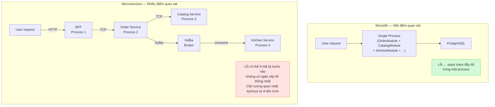
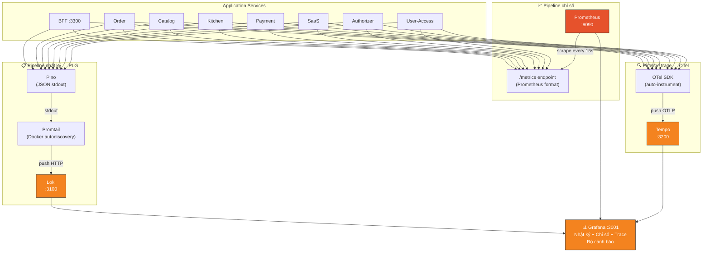

# Giám sát (monitoring) và khả năng quan sát (observability): Lý thuyết và triển khai thực chiến — QRTable Phase 6

> **Triết lý tài liệu:** Hiểu _tại sao_ trước _như thế nào_. Lý thuyết được dạy qua ngữ cảnh
> cụ thể của QRTable — không học trừu tượng mà học để áp dụng ngay. Tài liệu bao phủ cả
> **giám sát (monitoring)** — phát hiện vấn đề, đo lường SLO; **khả năng quan sát (observability)** — hiểu nguyên nhân, gỡ lỗi.
>
> **Quy ước thuật ngữ:** Khái niệm chính được ghi **tiếng Việt (tiếng Anh)** — ví dụ giám sát (monitoring), khả năng quan sát (observability).
>
> **Phạm vi:** Phase 6 — Bước 6.1 (Kiểm tra sức khỏe + PLG + Prometheus + Tempo/OTel)
> và Bước 6.2 (bảng điều khiển Grafana + cảnh báo). Đây là lý thuyết nền tảng kèm lộ trình
> triển khai — không phải code snippet copy-paste.

---

## Mục Lục

1. [Vấn Đề Cần Giải Quyết](#1-vấn-đề-cần-giải-quyết)
2. [Monolith vs Microservices — Tại sao khả năng quan sát (observability) trở thành bắt buộc](#2-monolith-vs-microservices--tại-sao-khả-năng-quan-sát-observability-trở-thành-bắt-buộc)
3. [Giám sát (monitoring) và khả năng quan sát (observability) — Hai khái niệm bổ sung cho nhau](#3-giám-sát-monitoring-và-khả-năng-quan-sát-observability--hai-khái-niệm-bổ-sung-cho-nhau)
4. [Ba trụ cột của khả năng quan sát (observability)](#4-ba-trụ-cột-của-khả-năng-quan-sát-observability)
5. [Kiểm tra sức khỏe — Tiên quyết trước tất cả](#5-kiểm-tra-sức-khỏe--tiên-quyết-trước-tất-cả)
6. [Tracing phân tán và lan truyền ngữ cảnh](#6-tracing-phân-tán-và-lan-truyền-ngữ-cảnh)
7. [Ngăn xếp công nghệ — Tại sao chọn gì](#7-ngăn-xếp-công-nghệ--tại-sao-chọn-gì)
8. [Kiến trúc khả năng quan sát (observability) trong QRTable](#8-kiến-trúc-khả-năng-quan-sát-observability-trong-qrtable)
9. [Bước 6.1A — Kiểm tra sức khỏe toàn bộ service](#9-bước-61a--health-checks-toàn-service)
10. [Bước 6.1B — Ngăn xếp PLG: Pino + Loki + Promtail + Grafana](#10-bước-61b--stack-plg-pino--loki--promtail--grafana)
11. [Bước 6.1C — Prometheus và Chỉ số tùy chỉnh](#11-bước-61c--prometheus-và-custom-metrics)
12. [Bước 6.1D — Tempo và OpenTelemetry](#12-bước-61d--tempo-và-opentelemetry)
13. [Bước 6.1E — Lan truyền ngữ cảnh qua TCP và Kafka](#13-bước-61e--context-propagation-qua-tcp-và-kafka)
14. [Bước 6.2 — Bảng điều khiển Grafana và cảnh báo](#14-bước-62--bảng-điều-khiển-grafana-và-cảnh-báo)
15. [Nghiệm thu — Tiêu chí hoàn thành](#15-nghiệm-thu--tiêu-chí-hoàn-thành)
16. [Tổng kết mô hình tư duy](#16-tổng-kết-mô-hình-tư-duy)

---

## 1. Vấn Đề Cần Giải Quyết

### 1.1 Một request đi qua nhiều bước

QRTable là microservices thực sự. Khi khách bàn 5 bấm "Đặt món", request không đi đến một nơi — nó qua nhiều service theo nhiều protocol khác nhau:

```
Customer PWA
    ↓ HTTP REST
BFF (port 3300)
    ↓ TCP
Order Service
    ↓ TCP
Catalog Service (kiểm tra stock)
    ↓ Kafka: order.confirmed
Kitchen Service (tạo KDS ticket)
    ↓ Redis Pub/Sub
BFF (emit WebSocket)
    ↓ WebSocket
KDS màn hình bếp
```

**Câu hỏi thực tế:** Khách báo "đặt món rồi mà bếp không thấy gì". Bạn gỡ lỗi thế nào?

Nếu không có giám sát (monitoring) và khả năng quan sát (observability):

- SSH vào từng container, đọc `stdout` từng service
- Không biết request có đến Order không, có qua Kafka không, Kitchen có nhận không
- Không biết bước nào thất bại, bước nào trễ
- Mỗi lần sự cố cần 20–30 phút để định vị, đôi khi không tìm được nguyên nhân

Nếu có giám sát (monitoring) và khả năng quan sát (observability):

- Một ID trace duy nhất nối toàn bộ hành trình từ BFF đến KDS
- Nhật ký tập trung: truy vấn `traceId = "abc123"` thấy ngay nhật ký của tất cả service liên quan
- Chỉ số cho biết phân tích độ trễ theo từng bước
- Nếu Kitchen không nhận Kafka event, chỉ số độ trễ consumer cảnh báo trước khi khách phàn nàn

### 1.2 Ba Tình Huống Điển Hình Của QRTable

**Tình huống 1 — Không biết service nào chết:** BFF không trả response nhưng không rõ TCP call đến Order bị lỗi hay Order call Catalog bị lỗi. Kiểm tra sức khỏe giải quyết: biết ngay service nào không hoạt động tốt.

**Tình huống 2 — Không biết tại sao chậm:** POS phàn nàn "danh sách đơn hàng tải rất chậm". Không có chỉ số thì không biết độ trễ P95 của `GET /admin/orders` là 2s hay 10s, không biết nút thắt ở BFF hay Order hay PostgreSQL. Prometheus + tracing giải quyết.

**Tình huống 3 — Không thể demo tin cậy:** Demo với hội đồng nhưng không có bảng điều khiển nào cho thấy lưu lượng thời gian thực, đơn/phút, KDS độ trễ, tất cả service đang hoạt động tốt. Bảng điều khiển Grafana giải quyết — biến dữ liệu thô thành câu chuyện vận hành có thể kể trong 5 phút.

---

## 2. Monolith vs Microservices — Tại sao khả năng quan sát (observability) trở thành bắt buộc

Đây là phần lý thuyết cốt lõi nhất. Hiểu sự khác biệt giữa hai kiến trúc từ góc nhìn khả năng quan sát (observability) mới hiểu tại sao QRTable — với 8 services và 4 protocol khác nhau — **không thể vận hành thiếu** giám sát (monitoring) và khả năng quan sát (observability).

### 2.1 Gỡ lỗi trong monolith — Tại Sao Đơn Giản Hơn

Trong monolith, toàn bộ logic nghiệp vụ chạy trong **một process duy nhất** trên **một máy** (hoặc vài instance giống hệt nhau). Điều này có nghĩa:

```
Monolith Process
├── HTTP Handler
├── OrderModule
├── CatalogModule
├── KitchenModule
├── PaymentModule
└── Database connection pool
```

**Khi có lỗi trong monolith:**

1. **Stack trace đầy đủ:** Lỗi xảy ra ở `OrderService.submit()` → ngăn xếp lỗi (stack trace) chứa toàn bộ chuỗi gọi từ HTTP handler xuống đến dòng code gây lỗi. Không cần "đi tìm" lỗi ở đâu — nó nằm ngay trong ngăn xếp lỗi (stack trace).

2. **Một process = một luồng nhật ký:** Toàn bộ nhật ký của request nằm trong cùng một file/stdout. Grep `"order-submit"` trong một file là đủ.

3. **In-process call không cần network:** Khi `OrderModule` gọi `CatalogModule`, đó là function call trong cùng process — không có độ trễ mạng, không có timeout, không có serialization. Không cần trace để biết "call đi qua đâu".

4. **Giao dịch (transaction) rõ ràng:** Một giao dịch database bao phủ toàn bộ thao tác — nếu lỗi thì rollback ngay, không có trạng thái dở dang trải khắp nhiều service.

**Giám sát (monitoring) trong monolith cũng đủ với công cụ đơn giản:**

- Một tệp nhật ký → grep
- Một process → `top` hoặc `htop` để xem CPU/memory
- Một database → truy vấn `pg_stat_statements` để tìm truy vấn chậm
- Uptime check: nếu process sống, system sống

Đây là lý do nhiều hệ thống monolith chạy nhiều năm chỉ với `console.log` và đôi khi cũng tốt.

### 2.2 Gỡ lỗi trong microservices — Tại Sao Phức Tạp Hơn Căn Bản

Microservices phân rã monolith thành **nhiều process độc lập** giao tiếp qua **network**. Chính sự thay đổi này tạo ra một loạt vấn đề hoàn toàn mới:

#### Sơ đồ: Sự khác biệt căn bản — Gỡ lỗi monolith vs microservices

> Trong monolith, một lỗi có một ngăn xếp lỗi (stack trace) trong một process. Trong microservices, cùng một "lỗi" từ góc nhìn user có thể là tập hợp của nhiều kiểu lỗi độc lập trải khắp nhiều service.



**Vấn đề 1 — Kiểu lỗi mạng không tồn tại trong monolith:**

Khi `OrderModule` gọi `CatalogModule` trong monolith, đó là function call — không thể "timeout", không thể "connection refused". Nhưng trong microservices, TCP call từ Order đến Catalog có thể:

- Timeout (Catalog quá tải)
- Connection refused (Catalog chưa khởi động)
- Lỗi một phần (Catalog nhận request nhưng không trả response)
- Phân vùng mạng (network partition) giữa hai container

Mỗi kiểu lỗi này yêu cầu chiến lược gỡ lỗi khác nhau — và **bạn cần chỉ số + trace để phân biệt chúng**.

**Vấn đề 2 — Không có ngăn xếp lỗi (stack trace) thống nhất:**

Trong monolith: `Error at OrderService.submitOrder (order.service.ts:45) at CatalogService.deductStock (catalog.service.ts:23) at...` — toàn bộ chuỗi gọi nằm trong một trace.

Trong microservices: Khi Order gọi TCP đến Catalog và Catalog lỗi, **Order chỉ thấy "TCP timeout"** — không thấy ngăn xếp lỗi (stack trace) bên trong Catalog. Catalog lỗi gì? Ở dòng code nào? Không biết nếu không có tracing phân tán.

**Vấn đề 3 — Nhật ký phân tán:**

Một request trong QRTable tạo ra bản ghi nhật ký trong BFF, Order, Catalog, và Kitchen — bốn process riêng biệt, bốn stdout stream riêng. Nếu không có ghi nhật ký tập trung và `traceId` được lan truyền, không thể ghép lại toàn bộ câu chuyện của một request.

**Vấn đề 4 — Giao dịch phân tán (distributed transactions) và lỗi một phần:**

Trong monolith, nếu `OrderModule.save()` thành công nhưng `KitchenModule.createTicket()` thất bại, giao dịch database rollback cả hai. Trong microservices, nếu Order save thành công nhưng Kafka message đến Kitchen bị mất, **trạng thái không nhất quán** — Order service nghĩ ticket đã được tạo, Kitchen không biết gì. Cần khả năng quan sát (observability) để phát hiện trạng thái này.

**Vấn đề 5 — "đổ lỗi" giữa services:**

Khi có sự cố, câu hỏi đầu tiên là "lỗi ở service nào?". Không có tracing phân tán, đây là một cuộc tranh luận dựa trên phỏng đoán. Với tracing phân tán, có câu trả lời chính xác trong vài giây.

### 2.3 Bảng So Sánh Căn Bản

| Khía cạnh               | Monolith                 | Microservices                                 |
| ----------------------- | ------------------------ | --------------------------------------------- |
| **Điểm quan sát**       | Một process              | N processes, N luồng nhật ký                  |
| **Lỗi xác định bằng**   | Stack trace đơn lẻ       | Trace phân tán qua N bước                     |
| **Gỡ lỗi bằng nhật ký** | Grep một file            | Truy vấn tập trung với traceId                |
| **Lỗi mạng**            | Không tồn tại            | Timeout, partition, bão thử lại (retry storm) |
| **Quy kết độ trễ**      | Rõ ràng trong call stack | Cần trace để phân tích từng bước              |
| **Lỗi một phần**        | Không có (transaction)   | Có thể xảy ra ở mọi bước                      |
| **Sức khỏe phụ thuộc**  | Một DB, một external     | N databases, Kafka, Redis, gRPC...            |
| **Công cụ tối thiểu**   | grep + top + truy vấn    | nhật ký tập trung + chỉ số + trace            |

### 2.4 Monolith Cũng Cần Giám sát (monitoring) — Nhưng Ở Mức Khác

Không nên hiểu nhầm rằng monolith không cần giám sát (monitoring). Mọi hệ thống ở môi trường sản xuất đều cần giám sát (monitoring) — sự khác biệt là **mức độ phức tạp và phạm vi cần thiết**:

**Monolith cần (và đủ với):**

- Giám sát (monitoring) thời gian hoạt động (uptime): process còn sống không?
- Giám sát (monitoring) tài nguyên: CPU, memory, disk của một server
- Tỷ lệ lỗi từ tệp nhật ký
- Giám sát (monitoring) truy vấn chậm trên database
- Thời gian phản hồi HTTP (nếu có web layer)

**Monolith bắt đầu cần khả năng quan sát (observability) khi:**

- Codebase lớn, nhiều module tương tác phức tạp
- Database truy vấn phức tạp, khó biết truy vấn nào chậm
- Nhiều người dùng đồng thời — cần hiểu distribution, không chỉ trung bình
- Business logic phức tạp — cần trace luồng gọi để gỡ lỗi các trường hợp biên

**Microservices cần khả năng quan sát (observability) từ ngày đầu vì:**

- Sự phức tạp của hệ thống phân tán không cho phép gỡ lỗi thủ công
- Miền lỗi (failure domain) nhiều hơn một monolith trưởng thành
- Network là dependency — có thể fail bất cứ lúc nào
- Không thể SSH vào 8 container để gỡ lỗi một request

**Kết luận:** Cả monolith và microservices đều cần giám sát (monitoring). Microservices **bắt buộc** phải có khả năng quan sát (observability) — nhật ký + chỉ số + trace — từ sớm vì không có nó, hệ thống trở thành "hộp đen" không thể vận hành tin cậy. QRTable với 8 services và 4 protocol (HTTP/TCP/Kafka/WebSocket) là minh chứng điển hình.

### 2.5 Tại sao QRTable đặt Phase 6 là khả năng quan sát (observability)

Nhìn lại roadmap QRTable: Phase 0 → Phase 5 là xây feature. Phase 6 là khả năng quan sát (observability). Tại sao không làm từ Phase 0?

**Lý do thực tế:** Khi team nhỏ, codebase còn nhỏ, chạy local với Docker Compose — có thể gỡ lỗi bằng cách đọc nhật ký từng container. Nhưng khi hệ thống có 8 services và sẵn sàng demo/triển khai, không thể tiếp tục gỡ lỗi thủ công.

**Lý do kỹ thuật:** Một số chỉ số (order rate, KDS độ trễ, payment success rate) chỉ có ý nghĩa khi có lưu lượng thật. Xây bảng điều khiển trước khi có lưu lượng là tối ưu sớm.

**Lý do cho demo/luận văn:** Ngăn xếp khả năng quan sát (observability) chứng minh hệ thống không chỉ "chạy được" mà còn "có thể vận hành". Đây là điểm cộng quan trọng — hội đồng thấy bảng điều khiển Grafana với chỉ số thời gian thực chứng tỏ bạn hiểu sản xuất, không chỉ lập trình.

---

## 3. Giám sát (monitoring) và khả năng quan sát (observability) — Hai khái niệm bổ sung cho nhau

### 3.1 Giám sát (monitoring) — Phát Hiện Vấn Đề, Đo Lường Cam Kết

Giám sát (monitoring) là quá trình **liên tục đo lường** và **so sánh với ngưỡng định trước** để phát hiện khi hệ thống lệch khỏi trạng thái bình thường. Giám sát (monitoring) trả lời câu hỏi bạn đã biết trước cần hỏi.

```
Giám sát (monitoring) = đặt câu hỏi trước → hệ thống tự trả lời theo thời gian thực
           = "Tỷ lệ lỗi > 5%? → Cảnh báo"
           = "Service down? → Cảnh báo"
           = phản ứng — biết KHI vấn đề đang xảy ra hoặc mới xảy ra
```

#### SLI, SLO, SLA — Nền tảng của giám sát (monitoring) có ý nghĩa

Giám sát (monitoring) chỉ có giá trị khi được neo vào **cam kết về chất lượng dịch vụ**. Ba khái niệm này định nghĩa cái gì cần giám sát (monitoring) và tại sao:

**SLI (Service Level Indicator):** Chỉ số đo lường thực tế — con số bạn đo được.

```
SLI = tỷ lệ request thành công
    = (request status 2xx) / (tổng request) = 99.3%

SLI = độ trễ P95 của BFF = 145ms
SLI = Kafka consumer lag của Kitchen = 12 messages
```

**SLO (Service Level Objective):** Mục tiêu bạn đặt ra cho SLI — ngưỡng để xác định "đang ổn" hay "có vấn đề".

```
SLO = tỷ lệ request thành công ≥ 99.5% (trong 30 ngày rolling)
SLO = độ trễ P95 BFF ≤ 500ms
SLO = KDS ticket created trong 30s sau order.confirmed
```

**SLA (Service Level Agreement):** Cam kết chính thức với người dùng/khách hàng — thường có hậu quả pháp lý hoặc tài chính nếu vi phạm. Trong QRTable (hệ thống luận văn), SLA không chính thức nhưng SLO vẫn quan trọng như chuẩn để đánh giá.

**Ngân sách lỗi:** Phần "được phép không đạt SLO". Ví dụ SLO 99.5% availability → ngân sách lỗi = 0.5% downtime/tháng ≈ 3.6 giờ/tháng. Khi ngân sách lỗi cạn → tập trung reliability, không phát hành tính năng mới.

**Tại sao quan trọng cho QRTable:** Bảng điều khiển Chỉ số nghiệp vụ (Section 14) không chỉ hiển thị số — nó cần ngưỡng cụ thể để biết "đang tốt" hay "cần hành động". KDS thời gian xử lý panel có ngưỡng 10 phút — đây là SLO thực tế của QRTable.

#### RED Method — Khung giám sát (monitoring) Cho Services

RED (Rate, Errors, Duration) là khung chuẩn để giám sát (monitoring) hệ thống hướng service. Với mỗi service trong QRTable, cần giám sát (monitoring):

| Chỉ số       | Ý nghĩa                                 | Ví dụ QRTable                                                              |
| ------------ | --------------------------------------- | -------------------------------------------------------------------------- |
| **Rate**     | Bao nhiêu request/giây đang được xử lý? | `rate(http_requests_total{service="order"}[1m])`                           |
| **Errors**   | Bao nhiêu % request đang thất bại?      | `rate(http_requests_total{status=~"5.."}[5m]) / rate(...)`                 |
| **Duration** | Request mất bao lâu? (P50, P95, P99)    | `histogram_quantile(0.95, rate(http_request_duration_seconds_bucket[5m]))` |

RED method phù hợp cho tất cả services của QRTable — BFF, Order, Catalog, Kitchen, Payment, SaaS.

#### USE Method — Khung giám sát (monitoring) Cho Infrastructure

USE (Utilization, Saturation, Errors) là khung cho tài nguyên hạ tầng:

| Chỉ số          | Ý nghĩa                                    | Ví dụ QRTable                                            |
| --------------- | ------------------------------------------ | -------------------------------------------------------- |
| **Utilization** | % thời gian resource đang bận              | PostgreSQL connection pool usage %, Redis memory usage % |
| **Saturation**  | Queue depth — resource đang bị "ép" không? | Kafka độ trễ consumer, PostgreSQL queue length           |
| **Errors**      | Lỗi ở cấp resource                         | Redis connection error count, Kafka broker tỷ lệ lỗi     |

USE method áp dụng cho: PostgreSQL, Redis, Kafka, CPU, Memory, Network của Docker containers.

### 3.2 Khả năng quan sát (observability) — Hiểu nguyên nhân, gỡ lỗi vấn đề chưa biết trước

Khả năng quan sát (observability) là khả năng **suy luận về trạng thái bên trong** của hệ thống chỉ từ các tín hiệu bên ngoài (nhật ký, chỉ số, trace) — kể cả với những kiểu lỗi bạn **chưa từng hình dung trước**.

```
Khả năng quan sát (observability) = khả năng trả lời câu hỏi chưa biết trước
             = "Tại sao 2% request của tenant-A chậm hơn tenant-B?"
             = "Kafka consumer lag đột biến lúc 10:23 — do message nào?"
             = gỡ lỗi chủ động — tìm ra vấn đề chưa có cảnh báo cho nó
```

**Ví dụ QRTable — câu hỏi khả năng quan sát (observability), không chỉ là giám sát (monitoring):**

- Một tenant cụ thể bị chậm hơn các tenant khác — không có cảnh báo cho điều này, nhưng với trace + nhật ký có cấu trúc với `tenantId`, bạn có thể truy vấn và phát hiện
- KDS ticket của một station chậm hơn station kia — cần trace để xem thời gian xử lý theo station
- Một Kafka consumer message gây ra vòng lặp retry — cần trace message ID qua toàn bộ flow

### 3.3 Giám sát (monitoring) và Khả năng quan sát (observability) Cần Nhau — Không Thay Thế Nhau

Đây là điểm hay bị hiểu nhầm nhất. Không phải "microservices cần khả năng quan sát (observability), monolith chỉ cần giám sát (monitoring)". Cả hai cần cả hai — nhưng với vai trò khác nhau trong cùng một hệ thống:

```
Chỉ số cảnh báo kích hoạt (Giám sát (monitoring))
        ↓
        "Có vấn đề với Order service"
        ↓
Truy vấn nhật ký để hiểu vấn đề (Khả năng quan sát (observability))
        ↓
        "Order submit đang fail với error 'Catalog TCP timeout'"
        ↓
Trace để tìm nguyên nhân gốc (Khả năng quan sát (observability))
        ↓
        "Catalog service có truy vấn chậm, 300ms trên UPDATE statement"
        ↓
Sửa lỗi, xem phục hồi chỉ số (Giám sát (monitoring))
        ↓
        "Tỷ lệ lỗi đã về 0%, độ trễ P95 bình thường"
```

**Giám sát (monitoring) không đủ một mình** vì nó chỉ nói "có vấn đề" — không nói "tại sao". Khi cảnh báo kích hoạt, bạn cần khả năng quan sát (observability) để tìm nguyên nhân.

**Khả năng quan sát (observability) không đủ một mình** vì bạn không thể ngồi nhìn Grafana 24/7 để phát hiện vấn đề. Cảnh báo giám sát (monitoring) là cơ chế chủ động thông báo khi có sự cố, không cần ai xem.

**Quy trình thực tế:**

1. Giám sát (monitoring) đặt cảnh báo + mục tiêu SLO
2. Cảnh báo kích hoạt khi SLO bị vi phạm
3. Khả năng quan sát (observability) (nhật ký + trace) giúp gỡ lỗi tìm nguyên nhân
4. Sửa lỗi → giám sát (monitoring) xác nhận SLO đã phục hồi

### 3.4 Ba tín hiệu — Nền tảng của giám sát (monitoring) và khả năng quan sát (observability)

| Tín hiệu    | Vai trò trong giám sát (monitoring)              | Vai trò trong khả năng quan sát (observability) |
| ----------- | ------------------------------------------------ | ----------------------------------------------- |
| **Nhật ký** | Đếm tỷ lệ lỗi, đếm sự kiện                       | Gỡ lỗi "chuyện gì đã xảy ra" cho request cụ thể |
| **Chỉ số**  | Cảnh báo khi ngưỡng bị vượt, bảng điều khiển SLO | Phân tích xu hướng, lập kế hoạch năng lực       |
| **Trace**   | SLO độ trễ theo điểm cuối                        | Gỡ lỗi "nút thắt ở bước nào", nguyên nhân gốc   |

Ba tín hiệu không thay thế nhau — chúng bổ sung:

- Chỉ số cho biết **có** vấn đề (phát hiện bất thường)
- Nhật ký cho biết vấn đề là **gì** (error message, context)
- Trace cho biết vấn đề xảy ra **ở đâu** trong luồng xử lý (phân tích span)

---

## 4. Ba trụ cột của khả năng quan sát (observability)

### 4.1 Trụ cột 1: Nhật ký — Sự kiện có ngữ cảnh

Nhật ký là bản ghi sự kiện có timestamp xảy ra trong hệ thống. Trong microservices, không phải nhật ký nào cũng đủ để gỡ lỗi.

#### Ghi nhật ký có cấu trúc — Không phải văn bản thuần

```
# Plain text log — không thể query có ngữ cảnh
[2026-05-14 10:23:45] Order submitted for table 5, tenant abc

# Structured JSON log — machine-readable, queryable, correlatable
{
  "timestamp": "2026-05-14T10:23:45.123Z",
  "level": "info",
  "service": "order",
  "tenantId": "tenant-abc",
  "traceId": "abc123def456",
  "spanId": "span789",
  "event": "order.submitted",
  "orderId": "order-uuid-001",
  "tableId": "table-005",
  "itemCount": 3,
  "msg": "Order submitted successfully"
}
```

Với nhật ký có cấu trúc, truy vấn "Tìm tất cả nhật ký của tenant-abc trong 30 phút qua có level ERROR" là một dòng LogQL — thao tác không thể làm với văn bản thuần.

#### Mức nhật ký — Nguyên Tắc Sử Dụng

| Level   | Dùng khi nào                               | Ví dụ trong QRTable                                 |
| ------- | ------------------------------------------ | --------------------------------------------------- |
| `error` | Lỗi cần xử lý ngay — không phải user error | TCP call đến Catalog timeout, DB connection fail    |
| `warn`  | Bất thường nhưng không cần hành động ngay  | Kafka độ trễ consumer tăng, cache miss rate cao     |
| `info`  | Sự kiện bình thường quan trọng             | Order submitted, Payment completed, Session created |
| `debug` | Chi tiết khi gỡ lỗi — tắt ở production     | Truy vấn parameters, intermediate state             |
| `trace` | Cực kỳ verbose — chỉ khi gỡ lỗi sâu        | Từng bước trong saga, từng Kafka message            |

**Quy tắc QRTable:** Môi trường sản xuất chạy `info` level. Khi gỡ lỗi sự cố, tạm bật `debug` cho service đó mà không restart toàn bộ ngăn xếp.

#### Tập trung hóa nhật ký — Tại Sao Cần

Trong microservices, không thể SSH vào từng container để xem nhật ký. Cần một nơi tập trung:

```
BFF log     → stdout ─┐
Order log   → stdout ─┤
                      ├─→ Promtail (collector) → Loki (storage) → Grafana (query UI)
Catalog log → stdout ─┤
Kitchen log → stdout ─┘
```

**Loki** lưu nhật ký theo chuỗi thời gian + labels. Không index toàn văn (khác Elasticsearch) — chỉ index labels. Rẻ và đơn giản hơn nhưng truy vấn cần biết label.

**LogQL** — ngôn ngữ truy vấn của Loki:

```
# Tìm tất cả ERROR của Order service
{app="order"} |= "ERROR"

# Tìm log có tenantId cụ thể
{app="order"} | json | tenantId="tenant-abc"

# Đếm tỷ lệ lỗi theo thời gian
count_over_time({app="order"} |= "ERROR" [5m])

# Tìm tất cả log liên quan đến một trace — xuyên qua nhiều service
{app=~"bff|order|catalog|kitchen"} | json | traceId="abc123def456"
```

Câu truy vấn cuối cùng là ví dụ về sức mạnh của ghi nhật ký có cấu trúc + lưu trữ tập trung: một truy vấn duy nhất trả về toàn bộ nhật ký của một request qua 4 services.

---

### 4.2 Trụ cột 2: Chỉ số — Số Liệu Có Ngữ Cảnh

Chỉ số là **đo lường định lượng** của hệ thống theo thời gian. Khác với nhật ký (sự kiện đơn lẻ), chỉ số là tổng hợp — tổng, trung bình, phần trăm tính trên nhiều sự kiện.

#### Bốn Loại Chỉ số (Prometheus Data Model)

**Counter — chỉ tăng, không bao giờ giảm:**

```
http_requests_total{service="order", method="POST", status="200"} = 1547
```

Dùng cho: tổng số request, error, order, Kafka message. Query: `rate(http_requests_total[5m])` → request/giây trong 5 phút.

**Gauge — có thể tăng hoặc giảm:**

```
active_websocket_connections{service="bff", tenantId="t-001"} = 23
redis_memory_used_bytes = 134217728
kafka_consumer_lag{topic="order.confirmed", group="kitchen"} = 42
```

Dùng cho: trạng thái hiện tại — kết nối, memory, queue depth.

**Histogram — phân phối giá trị:**

```
http_request_duration_seconds_bucket{le="0.1"} = 1200  # 1200 req < 100ms
http_request_duration_seconds_bucket{le="0.5"} = 1450  # 1450 req < 500ms
http_request_duration_seconds_bucket{le="1.0"} = 1480  # 1480 req < 1s
http_request_duration_seconds_bucket{le="+Inf"} = 1500 # tổng tất cả
```

Dùng để tính P50, P95, P99 độ trễ.

**Summary — tương tự Histogram, tính phân vị ở client:** Ít dùng trong practice vì khó aggregate nhiều instance.

#### Tại Sao P95/P99 Quan Trọng Hơn Average

```
Ví dụ: 100 request latency (ms):
  10ms × 90 request  +  200, 500, 1000, 1500, 2000ms × 10 request

Average = (90×10 + 5200) / 100 = 61ms → "Ổn"
P95 = 1000ms  → "5% khách hàng đợi > 1 giây"
P99 = 2000ms  → "1% khách hàng đợi > 2 giây"
```

Average che giấu giá trị ngoại lai. P95/P99 cho biết trải nghiệm thực tế của người dùng xui xẻo — đây mới là con số quan trọng cho SLO.

#### PromQL — Ngôn Ngữ Truy vấn Của Prometheus

```
# Tỷ lệ lỗi của Order service (RED Method — Errors)
rate(http_requests_total{service="order", status=~"5.."}[5m])
/ rate(http_requests_total{service="order"}[5m])

# độ trễ P95 của BFF (RED Method — Duration)
histogram_quantile(0.95,
  rate(http_request_duration_seconds_bucket{service="bff"}[5m])
)

# Throughput (RED Method — Rate)
rate(http_requests_total{service="order"}[1m])

# Kafka consumer lag (USE Method — Saturation)
kafka_consumer_lag{topic="order.confirmed", group="kitchen-group"}

# Business metric — Orders per minute
rate(qrtable_orders_total[1m]) * 60
```

---

### 4.3 Trụ cột 3: Trace — Hành Trình Request

Trace là **bản ghi hành trình của một request** qua toàn bộ hệ thống phân tán. Đây là tín hiệu duy nhất có thể trả lời "nút thắt nằm ở bước nào?" trong microservices.

#### Khái Niệm Cốt Lõi

**Trace:** Đại diện cho toàn bộ hành trình — từ BFF đến KDS. Định danh bởi `trace_id` duy nhất (16 bytes hex).

**Span:** Một đơn vị công việc. Mỗi service bước tạo ít nhất một span, có: `span_id`, `parent_span_id`, tên operation, timestamps start/end, attributes tùy ý.

**Lan truyền ngữ cảnh:** Cơ chế truyền `trace_id` + `span_id` từ service này sang service khác — qua HTTP header, TCP metadata, Kafka header.

#### Cấu trúc của Một Trace Trong QRTable

```
Trace ID: abc123def456  (Duration: 385ms total)

├── [BFF] POST /customer/orders                   0ms → 385ms  (385ms)
│   ├── [BFF] Auth guard + validation             0ms → 12ms   (12ms)
│   └── [BFF→Order] TCP call: ORDER_SUBMIT        12ms → 365ms (353ms)
│       ├── [Order] Handler: submitOrder          12ms → 60ms  (48ms)
│       │   ├── [Order] Redis: get session        12ms → 18ms  (6ms)
│       │   └── [Order] PostgreSQL: insert order  18ms → 60ms  (42ms)
│       └── [Order→Catalog] TCP: DEDUCT_STOCK     60ms → 350ms (290ms) ← BOTTLENECK!
│           ├── [Catalog] PostgreSQL: SELECT lock 60ms → 120ms (60ms)
│           └── [Catalog] PostgreSQL: UPDATE      120ms → 350ms (230ms) ← truy vấn chậm
│
└── [Async] Kafka: order.confirmed published      365ms
    └── [Kitchen] consume order.confirmed         370ms → 385ms (15ms)
```

Từ trace này bạn biết ngay: 290ms trong 353ms là do Catalog TCP call, cụ thể là PostgreSQL UPDATE chậm. Không cần đoán, không cần đọc nhật ký từng service.

---

## 5. Kiểm tra sức khỏe — Tiên quyết trước tất cả

Kiểm tra sức khỏe không nằm trong "ba trụ cột" truyền thống nhưng trong thực tế là **tiên quyết** — nếu không biết service nào đang chạy, các tín hiệu khác vô nghĩa. Đây cũng là input quan trọng cho giám sát (monitoring): Prometheus thu thập (scrape) health điểm cuối để tạo `up` chỉ số cho cảnh báo.

### 5.1 Hai Loại Kiểm tra sức khỏe

**Liveness — Process còn sống không?**

```
GET /health/live → { status: "ok" }
```

Trả về 200 nếu process đang chạy. Không check dependency. Nếu fail → orchestrator (Docker/K8s) restart container ngay.

**Readiness — Service có sẵn sàng nhận lưu lượng không?**

```
GET /health/ready → {
  "status": "ok",
  "info": {
    "postgres": { "status": "up" },
    "redis": { "status": "up" },
    "kafka": { "status": "up" }
  }
}
```

Check tất cả external dependencies. Nếu fail → không route lưu lượng đến service này, nhưng không restart.

**Quy tắc quan trọng:** Readiness check phải nhẹ — không tạo real truy vấn phức tạp. Dùng `SELECT 1` cho PostgreSQL, `PING` cho Redis. Kiểm tra sức khỏe bản thân không được trở thành nút thắt.

### 5.2 Kiểm tra sức khỏe Trong QRTable — Mapping Theo Service

| Service     | Readiness Checks                                                                       |
| ----------- | -------------------------------------------------------------------------------------- |
| BFF         | Redis PING + tất cả TCP clients truy cập được (Order, Catalog, Kitchen, Payment, SaaS) |
| Authorizer  | Keycloak HTTP reachable + gRPC listener active                                         |
| Catalog     | PostgreSQL `SELECT 1`                                                                  |
| Order       | PostgreSQL `SELECT 1` + Redis PING + Kafka producer initialized                        |
| Kitchen     | Redis PING + Kafka consumer group active                                               |
| Payment     | PostgreSQL `SELECT 1` + Redis PING + SePay config loaded                               |
| SaaS        | PostgreSQL `SELECT 1` + Redis PING                                                     |
| User-Access | MongoDB connection active                                                              |

**NestJS Terminus** là thư viện chính thức cho kiểm tra sức khỏe trong NestJS, expose `/health/live` và `/health/ready` với bộ chỉ báo tích hợp sẵn cho TypeORM, Redis, HTTP, gRPC.

---

## 6. Tracing phân tán và lan truyền ngữ cảnh

### 6.1 Tại sao lan truyền ngữ cảnh là thách thức kỹ thuật

Trong monolith, một request = một thread = một execution context duy nhất. Trace của request đó là call stack trong process đó. Trong microservices, một request vượt qua nhiều process và nhiều protocol:

```
HTTP request → BFF process
    ↓ TCP call (không có headers như HTTP!)
Order process
    ↓ Kafka message (có headers, nhưng phải manually inject)
Kitchen process
    ↓ Redis Pub/Sub (không có trace context natively)
BFF (WebSocket emit)
```

Để trace nối được qua tất cả bước, phải inject `trace_id` và `span_id` vào **mọi boundary**:

- HTTP header: `traceparent: 00-{traceId}-{spanId}-01` (W3C TraceContext standard)
- TCP metadata: custom field trong NestJS TCP message
- Kafka header: `traceparent` header trong Kafka record

### 6.2 OpenTelemetry — Chuẩn mở, tránh phụ thuộc nhà cung cấp

OpenTelemetry (OTel) là chuẩn mở cho telemetry (trace, chỉ số, nhật ký). Trước OTel, mỗi vendor (Jaeger, Zipkin, Datadog) có SDK riêng — tích hợp một vendor là phụ thuộc nhà cung cấp. OTel giải quyết bằng cách là **tầng trung lập nhà cung cấp**:

```
Application code
    ↓ OTel SDK (instrument, collect)
    ↓ OTel Collector (process, route) — optional
    ↓
  Tempo (Grafana)  |  Jaeger  |  Datadog  |  Any backend
```

QRTable dùng OTel SDK → push trực tiếp sang Tempo (không cần Collector cho local thiết lập).

### 6.3 Tự động gắn instrumentation so với gắn thủ công

**Tự động gắn instrumentation:** OTel SDK tự động tạo spans cho HTTP, database queries, gRPC, Kafka — không cần thay đổi code. Chỉ cần import instrumentation package đầu entry file.

**Gắn instrumentation thủ công:** Tự tạo span cho logic nghiệp vụ quan trọng:

```typescript
const span = tracer.startSpan('order.confirmationSaga');
span.setAttributes({ tenantId, orderId, step: 'catalog-deduct' });
try {
  // ... saga logic ...
} finally {
  span.end();
}
```

**Chiến lược QRTable:** Tự động cho HTTP + TypeORM + Kafka + Redis. Thủ công cho thao tác nghiệp vụ quan trọng (saga, KDS, luồng thanh toán).

### 6.4 Chuẩn W3C TraceContext

Format header chuẩn để lan truyền ngữ cảnh trace qua HTTP:

```
traceparent: 00-abc123def456789012345678901234-span001-01
             │  │                               │        │
             version  trace_id (32 hex chars)  span_id  flags (sampled=1)
```

OTel SDK tự động đọc `traceparent` từ incoming request, tạo child span, inject `traceparent` vào outgoing request. Vấn đề còn lại: TCP và Kafka không có HTTP headers — cần giải quyết thủ công (xem Section 13).

---

## 7. Ngăn xếp công nghệ — Tại sao chọn gì

### 7.1 Bảng quyết định tổng thể

| Nhu cầu                    | Chọn                 | Lý do                                                                               |
| -------------------------- | -------------------- | ----------------------------------------------------------------------------------- |
| Ghi nhật ký có cấu trúc    | **Pino**             | Logger Node.js nhanh nhất, JSON native, chi phí phụ thấp                            |
| Agent thu thập nhật ký     | **Promtail**         | Hệ sinh thái Grafana, tự phát hiện container Docker                                 |
| Lưu trữ + truy vấn nhật ký | **Loki**             | Nhẹ (không chỉ mục toàn văn), cùng hệ sinh thái Grafana                             |
| Thu thập + lưu chỉ số      | **Prometheus**       | Chuẩn de-facto, kéo định kỳ (pull), PromQL mạnh, module NestJS                      |
| Backend tracing phân tán   | **Tempo**            | Cùng hệ sinh thái Grafana, không cần Cassandra/ES, tương quan Loki                  |
| Chuẩn instrumentation      | **OpenTelemetry**    | Trung lập nhà cung cấp, tự gắn NestJS/Express                                       |
| Trực quan hóa + cảnh báo   | **Grafana**          | Bảng điều khiển thống nhất nhật ký/chỉ số/trace, bộ cảnh báo, tương quan datasource |
| Khung kiểm tra sức khỏe    | **@nestjs/terminus** | Chính thức NestJS, khai báo, bộ chỉ báo tích hợp sẵn                                |

### 7.2 Tại sao PLG (không phải ELK)

**Ngăn xếp ELK:** Elasticsearch + Logstash + Kibana — stack phổ biến nhưng nặng:

- Elasticsearch index toàn văn → cần nhiều RAM (~2–4GB chỉ riêng ES)
- Không tích hợp native với Prometheus/Tempo → phải chuyển tab khi gỡ lỗi

**Ngăn xếp PLG:** Promtail + Loki + Grafana — nhẹ hơn nhiều:

- Loki chỉ index labels → nhẹ hơn đáng kể, phù hợp single-node Docker Compose
- Grafana: **một UI duy nhất** cho cả Nhật ký + Chỉ số + Trace — tương quan không cần chuyển app

Cho QRTable (Docker Compose single-node, RAM hạn chế), PLG là lựa chọn đúng.

### 7.3 Tại sao Tempo (không phải Jaeger)

**Jaeger:** Tracing backend phổ biến nhưng cần Cassandra hoặc Elasticsearch cho storage, UI riêng biệt.

**Tempo:** Backend lưu trữ đối tượng (local filesystem cho dev) — không cần infra phụ, tích hợp native Grafana. Từ nhật ký hoặc chỉ số, nhấp `trace_id` → mở Tempo trace trực tiếp trong cùng Grafana.

---

## 8. Kiến trúc khả năng quan sát (observability) trong QRTable

### 8.1 Luồng dữ liệu Tổng Thể

#### Sơ đồ: Ba pipeline tín hiệu — Nhật ký, chỉ số, trace

> Ba tín hiệu đi theo ba con đường về Grafana. Promtail autodiscover Docker containers theo label. Prometheus pull-thu thập (scrape) `/metrics` điểm cuối. OTel SDK push traces sang Tempo. Grafana là điểm tập trung duy nhất để truy vấn và tương quan cả ba.



### 8.2 Tương quan — Sức mạnh thực sự của Grafana

Grafana không chỉ hiển thị từng tín hiệu riêng biệt — nó cho phép **tương quan** giữa chúng trong cùng một giao diện:

```
Quy trình gỡ lỗi thực tế — 3 phút thay vì 30 phút:

1. Bảng điều khiển chỉ số Grafana → đỉnh tỷ lệ lỗi lúc 10:23
2. Nhấp vào đỉnh → Grafana Explore, truy vấn Loki:
   `{app="order"} 10:22–10:24 | json | level="error"`
3. Thấy nhật ký: "Catalog TCP timeout, traceId=abc123"
4. Nhấp `trace_id="abc123"` → Grafana tự mở Tempo
5. Cây trace: BFF(12ms) → Order(48ms) → Catalog(290ms!) ← đây
6. Span Catalog: PostgreSQL UPDATE 230ms ← nguyên nhân gốc
7. Hành động: tối ưu truy vấn Catalog, thêm index
```

---

## 9. Bước 6.1A — Kiểm tra sức khỏe toàn bộ service

### 9.1 NestJS Terminus — Thiết lập chuẩn

**@nestjs/terminus** cung cấp bộ chỉ báo tích hợp sẵn và framework compose:

```typescript
// Module setup
@Module({
  imports: [TerminusModule],
  controllers: [HealthController],
})
export class HealthModule {}

// Controller
@Controller('health')
export class HealthController {
  constructor(
    private health: HealthCheckService,
    private db: TypeOrmHealthIndicator,
  ) {}

  @Get('live')
  @HealthCheck()
  live() {
    return this.health.check([]); // empty = chỉ check process alive
  }

  @Get('ready')
  @HealthCheck()
  ready() {
    return this.health.check([
      () => this.db.pingCheck('postgres'),
      () => this.redis.pingCheck('redis', { type: 'redis', url: REDIS_URL }),
      // Custom indicators cho Kafka, TCP clients...
    ]);
  }
}
```

### 9.2 Custom Health Indicators

Terminus có built-in cho TypeORM, Redis, HTTP. Với Kafka consumer và NestJS TCP client, cần custom indicator:

**Kafka Consumer Health:** Check consumer group đã joined, không có active rebalance.

**NestJS TCP Client Health (BFF):** Gửi TCP `PING` message đến từng microservice, kiểm tra nhận `PONG`. BFF dùng indicator này để kiểm tra tất cả 7 các service hạ nguồn truy cập được.

### 9.3 Response Format và HTTP Status

```json
// 200 — healthy
{ "status": "ok", "info": { "postgres": {"status":"up"}, "redis": {"status":"up"} } }

// 503 — unhealthy
{ "status": "error", "error": { "postgres": {"status":"down","message":"ECONNREFUSED"} } }
```

### 9.4 Tích hợp với Prometheus — chỉ số `up`

```yaml
# prometheus.yml
scrape_configs:
  - job_name: 'qrtable-health'
    metrics_path: '/health/live'
    static_configs:
      - targets:
          [
            'bff:3300',
            'order:3001',
            'catalog:3002',
            'kitchen:3003',
            'payment:3004',
            'saas:3005',
            'authorizer:3006',
            'user-access:3007',
          ]
```

Prometheus tự động tạo: `up{instance="order:3001"} = 0` khi service down → kích hoạt cảnh báo Grafana "Service Down".

---

## 10. Bước 6.1B — Ngăn xếp PLG: Pino + Loki + Promtail + Grafana

### 10.1 Pino — Structured Logger

Pino là logger nhanh nhất cho Node.js, JSON native, chi phí phụ thấp. Tích hợp NestJS qua `nestjs-pino`:

```typescript
// AppModule
PinoModule.forRoot({
  pinoHttp: {
    autoLogging: true, // log mỗi request/response
    level: process.env.LOG_LEVEL ?? 'info',
    // Thêm context vào mọi log
    customProps: (req) => ({
      tenantId: req.headers['x-tenant-id'],
    }),
    // Production: JSON thuần; Development: pretty-print
    transport: process.env.NODE_ENV !== 'production' ? { target: 'pino-pretty' } : undefined,
  },
});
```

```typescript
// Sử dụng trong service
@Injectable()
class OrderService {
  constructor(private readonly logger: PinoLogger) {}

  async submitOrder(dto: SubmitOrderDto, tenantId: string) {
    this.logger.info({ tenantId, sessionId: dto.sessionId }, 'Order submit started');
    try {
      const order = await this.createOrder(dto, tenantId);
      this.logger.info({ tenantId, orderId: order.id }, 'Order submitted');
      return order;
    } catch (error) {
      this.logger.error({ tenantId, error: error.message }, 'Order submit failed');
      throw error;
    }
  }
}
```

**Quy tắc:** Luôn ghi nhật ký `tenantId` và `traceId` trong mọi bản ghi nhật ký liên quan đến thao tác nghiệp vụ. Đây là nhãn chính để lọc và tương quan.

### 10.2 Promtail — Thu thập nhật ký

Promtail autodiscover Docker containers và forward nhật ký về Loki:

```
Container stdout → /var/lib/docker/containers/<id>-json.log
    ↓
Promtail (đọc file + apply labels từ Docker labels)
    ↓
Loki (push HTTP)
```

```yaml
# promtail-config.yaml
scrape_configs:
  - job_name: docker-containers
    docker_sd_configs:
      - host: unix:///var/run/docker.sock
    relabel_configs:
      - source_labels: [__meta_docker_container_label_app]
        target_label: app
    pipeline_stages:
      - json:
          expressions:
            level: level
            traceId: traceId
            tenantId: tenantId
      - labels:
          level: ''
          app: ''
```

```yaml
# docker-compose.app.yaml — label cho mỗi service
services:
  order:
    labels:
      app: 'order' # Promtail dùng label này → {app="order"} trong Loki
```

### 10.3 Loki — Nhật ký Storage

Loki lưu nhật ký theo chuỗi thời gian + labels. Không chỉ mục toàn văn → truy vấn phải lọc nhãn trước, tìm văn bản sau.

```yaml
# loki-config.yaml
auth_enabled: false
server:
  http_listen_port: 3100
storage_config:
  filesystem:
    directory: /loki/chunks
limits_config:
  retention_period: 168h # Giữ 7 ngày
  ingestion_rate_mb: 10
```

### 10.4 Kiểm tra PLG

```
1. docker compose up -d
2. Tạo traffic (login, submit order, ...)
3. Grafana :3001 → Explore → Loki
4. Query: {app="bff"}                          → thấy log JSON
5. Query: {app="order"} |= "ERROR"             → lọc lỗi
6. Query: {app=~"bff|order"} | json | tenantId="t-001"  → lọc tenant
```

---

## 11. Bước 6.1C — Prometheus và Chỉ số tùy chỉnh

### 11.1 NestJS Prometheus Module

```typescript
// AppModule
PrometheusModule.register({
  path: '/metrics',
  defaultMetrics: { enabled: true }, // auto: HTTP latency, memory, CPU
});
```

Auto-generated chỉ số sau khi thiết lập: `http_requests_total`, `http_request_duration_seconds`, `nodejs_heap_used_bytes`, `process_cpu_seconds_total`.

### 11.2 Custom Chỉ số nghiệp vụ

Các chỉ số mà bảng điều khiển Grafana Business cần:

```typescript
// Counter: tổng order theo status
export const ordersTotal = new Counter({
  name: 'qrtable_orders_total',
  help: 'Total orders created',
  labelNames: ['tenantId', 'status'], // submitted, confirmed, cancelled
});

// Counter: revenue
export const revenueTotal = new Counter({
  name: 'qrtable_revenue_vnd_total',
  help: 'Total revenue in VND',
  labelNames: ['tenantId', 'paymentMethod'], // cash, vietqr
});

// Histogram: KDS thời gian xử lý (quan trọng cho giám sát (monitoring) SLO)
export const kdsProcessingDuration = new Histogram({
  name: 'qrtable_kds_processing_duration_seconds',
  help: 'Time from order.confirmed to KDS completion',
  labelNames: ['tenantId', 'station'],
  buckets: [30, 60, 120, 300, 600, 1200], // 30s, 1m, 2m, 5m, 10m, 20m
});

// Gauge: active WebSocket connections
export const activeWsConnections = new Gauge({
  name: 'qrtable_websocket_connections_active',
  help: 'Active WebSocket connections',
  labelNames: ['tenantId', 'role'],
});

// Gauge: Kafka consumer lag (USE Method — Saturation)
export const kafkaConsumerLag = new Gauge({
  name: 'qrtable_kafka_consumer_lag',
  help: 'Kafka consumer offset lag',
  labelNames: ['topic', 'consumerGroup'],
});
```

### 11.3 Prometheus Scrape Config

```yaml
# prometheus.yml
global:
  scrape_interval: 15s

scrape_configs:
  - job_name: 'qrtable-services'
    static_configs:
      - targets:
          - 'bff:3300'
          - 'order:3001'
          - 'catalog:3002'
          - 'kitchen:3003'
          - 'payment:3004'
          - 'saas:3005'
          - 'authorizer:3006'
          - 'user-access:3007'
    metrics_path: '/metrics'

  - job_name: 'infrastructure'
    static_configs:
      - targets:
          - 'kafka-exporter:9308'
          - 'redis-exporter:9121'
          - 'postgres-exporter:9187'
```

---

## 12. Bước 6.1D — Tempo và OpenTelemetry

### 12.1 OTel SDK Thiết lập

```bash
# Packages cần
@opentelemetry/sdk-node
@opentelemetry/auto-instrumentations-node
@opentelemetry/exporter-trace-otlp-http
@opentelemetry/sdk-trace-base
```

```typescript
// tracing.ts — import ĐẦU TIÊN trong main.ts
import { NodeSDK } from '@opentelemetry/sdk-node';
import { getNodeAutoInstrumentations } from '@opentelemetry/auto-instrumentations-node';
import { OTLPTraceExporter } from '@opentelemetry/exporter-trace-otlp-http';

const sdk = new NodeSDK({
  serviceName: process.env.OTEL_SERVICE_NAME ?? 'unknown',
  traceExporter: new OTLPTraceExporter({
    url: process.env.OTEL_EXPORTER_OTLP_ENDPOINT ?? 'http://tempo:4318/v1/traces',
  }),
  instrumentations: [
    getNodeAutoInstrumentations({
      '@opentelemetry/instrumentation-fs': { enabled: false }, // tắt noise
    }),
  ],
});

sdk.start();
process.on('SIGTERM', () => sdk.shutdown());
```

```typescript
// main.ts — tracing phải là dòng đầu tiên
import './tracing'; // ← TRƯỚC TẤT CẢ
import { NestFactory } from '@nestjs/core';
// ...
```

```yaml
# docker-compose.app.yaml — per-service
services:
  bff:
    environment:
      OTEL_SERVICE_NAME: 'bff'
      OTEL_EXPORTER_OTLP_ENDPOINT: 'http://tempo:4318/v1/traces'
  order:
    environment:
      OTEL_SERVICE_NAME: 'order'
      OTEL_EXPORTER_OTLP_ENDPOINT: 'http://tempo:4318/v1/traces'
  # ... repeat cho mọi service
```

### 12.2 Tự động gắn instrumentation Phạm vi

| Library         | Spans được tạo tự động                                         |
| --------------- | -------------------------------------------------------------- |
| HTTP incoming   | Span cho mỗi request với method, path, status                  |
| HTTP outgoing   | Span cho mỗi outgoing fetch/axios                              |
| TypeORM         | Span cho mỗi truy vấn với SQL type                             |
| Redis (ioredis) | Span cho mỗi Redis command                                     |
| gRPC            | Span cho gRPC calls                                            |
| Kafka.js        | Span cho produce và consume (với traceparent header injection) |
| PostgreSQL (pg) | Span cho raw queries                                           |

Chỉ cần thiết lập SDK một lần — toàn bộ database queries, Redis calls, Kafka messages đều có span trace.

### 12.3 Tempo Config

```yaml
# tempo-config.yaml
server:
  http_listen_port: 3200
distributor:
  receivers:
    otlp:
      protocols:
        http:
          endpoint: 0.0.0.0:4318
        grpc:
          endpoint: 0.0.0.0:4317
storage:
  trace:
    backend: local
    local:
      path: /tmp/tempo/blocks
    wal:
      path: /tmp/tempo/wal
```

---

## 13. Bước 6.1E — Lan truyền ngữ cảnh qua TCP và Kafka

Đây là phần kỹ thuật quan trọng và phức tạp nhất — làm trace "nối" được qua tất cả bước.

### 13.1 HTTP → HTTP — Tự Động

OTel SDK tự inject/extract `traceparent` header. Không cần làm gì thêm.

### 13.2 HTTP → TCP — Cần Xử Lý Thủ Công

NestJS TCP không có HTTP headers. Cần inject trace context vào message payload:

```typescript
// Concept: BFF inject trace context vào TCP message
const traceContext = {
  traceId: activeSpan.spanContext().traceId,
  spanId: activeSpan.spanContext().spanId,
  traceFlags: activeSpan.spanContext().traceFlags,
};

// Inject vào payload theo convention QRTable
this.orderClient.send('ORDER_SUBMIT', {
  ...payload,
  _traceContext: traceContext,
});

// Order service: extract và restore context để tạo child span
// → trace tiếp tục từ BFF sang Order với đúng parent
```

Giải pháp chuẩn: OTel `TextMapPropagator` với custom carrier cho TCP, hoặc NestJS interceptor tự động lan truyền cho tất cả TCP call/handler.

### 13.3 Kafka — Tự Động Với OTel Kafka.js Instrumentation

Kafka records có headers — OTel Kafka.js instrumentation tự inject/extract `traceparent`:

```typescript
// Producer — OTel tự inject traceparent vào headers
await producer.send({
  topic: 'order.confirmed',
  messages: [{ key: orderId, value: JSON.stringify(event) }],
  // OTel tự thêm: headers: { traceparent: '00-abc123-span789-01' }
});

// Consumer — OTel tự extract và tạo child span
// → trace liên tục từ Order (producer) sang Kitchen (consumer)
```

### 13.4 Kiểm tra Lan truyền ngữ cảnh

```
1. Submit một order từ Customer PWA
2. Grafana → Explore → Tempo
3. Search by Service: "bff", Time range: last 5 minutes
4. Trace tree phải có:
   ├── BFF (root span)
   ├── Order Service (child — TCP)
   │   └── Catalog Service (grandchild — TCP)
   └── Kitchen Service (async child — Kafka)

Nếu trace dừng ở BFF → TCP propagation chưa đúng
Nếu trace dừng ở Order → Kafka propagation chưa đúng
```

---

## 14. Bước 6.2 — Bảng điều khiển Grafana và cảnh báo

### 14.1 Nguyên tắc thiết kế bảng điều khiển

Bảng điều khiển tốt trả lời câu hỏi, không chỉ hiển thị số:

- **Câu hỏi rõ ràng:** "Service nào không hoạt động tốt?" — không phải "đây là một số"
- **Ngữ cảnh:** đơn vị đúng (ms, không phải seconds), ngưỡng trực quan
- **Hướng tới hành động:** xem xong biết làm gì

### 14.2 Bảng điều khiển 1 — Tổng quan hệ thống

Mục tiêu: "Hệ thống có đang hoạt động không?" — nhìn một lần biết ngay.

```
Row 1: Service Health (UP/DOWN per service)
┌──────────┬──────────┬──────────┬──────────┬──────────┬──────────┬──────────┬──────────┐
│ BFF: ✅  │ Order:✅ │Catalog:✅│Kitchen:✅│Payment:✅│ SaaS: ✅ │Auth: ✅  │UserA: ✅ │
└──────────┴──────────┴──────────┴──────────┴──────────┴──────────┴──────────┴──────────┘

Row 2: Traffic Overview
┌──────────────────────────────────┬──────────────────────────────────┐
│ HTTP Requests/s (all services)   │ Tỷ lệ lỗi % (5xx / total)       │
│ [time series — 1h window]        │ [line chart — red threshold 5%]  │
└──────────────────────────────────┴──────────────────────────────────┘

Row 3: Infrastructure Health (USE Method)
┌─────────────────┬─────────────────┬─────────────────┬─────────────────┐
│ Kafka Lag       │ Redis Memory %  │ PG Conn Pool %  │ P95 Latency     │
│ (per topic)     │ (threshold 80%) │ (threshold 90%) │ (all services)  │
└─────────────────┴─────────────────┴─────────────────┴─────────────────┘
```

```
# PromQL
up{job="qrtable-services"}                                # Service UP/DOWN
sum(rate(http_requests_total[5m])) by (service)           # Request rate (RED-Rate)
sum(rate(http_requests_total{status=~"5.."}[5m]))         # Tỷ lệ lỗi (RED-Errors)
/ sum(rate(http_requests_total[5m]))
histogram_quantile(0.95, rate(http_request_duration_seconds_bucket[5m]))  # P95 (RED-Duration)
```

### 14.3 Bảng điều khiển 2 — Chỉ số nghiệp vụ

Mục tiêu: Câu hỏi hội đồng/chủ quán quan tâm — không phải CPU.

```
Row 1: Revenue & Orders
┌──────────────────────────┬──────────────────────────┐
│ Orders/minute            │ Revenue/hour (VND)       │
│ [stat + sparkline trend] │ [stat + sparkline trend] │
└──────────────────────────┴──────────────────────────┘

Row 2: KDS Operations — SLO: 10 phút
┌──────────────────────────┬──────────────────────────┐
│ KDS P95 Processing Time  │ Active Tickets by Station│
│ [gauge — target < 10m]   │ [bar — KITCHEN vs BAR]   │
└──────────────────────────┴──────────────────────────┘

Row 3: Payment & Sessions
┌──────────────────────────┬──────────────────────────┐
│ Payment Success Rate %   │ Payment Method Split     │
│ [stat — target > 99%]    │ [pie — cash vs VietQR]   │
└──────────────────────────┴──────────────────────────┘

Row 4: Multi-tenant View (có biến lọc theo tenantId)
┌──────────────────────────┬──────────────────────────┐
│ Active Sessions          │ Orders by Tenant         │
│ (gauge per tenant)       │ (bar chart)              │
└──────────────────────────┴──────────────────────────┘
```

```
# PromQL
rate(qrtable_orders_total{status="submitted"}[1m]) * 60        # Orders/minute
histogram_quantile(0.95, rate(qrtable_kds_processing_duration_seconds_bucket[10m]))
                                                               # KDS P95
sum(rate(qrtable_payments_total{status="completed"}[5m]))
/ sum(rate(qrtable_payments_total[5m])) * 100                  # Payment success %
```

### 14.4 Bảng điều khiển 3 — Đi sâu theo từng service

Mục tiêu: Gỡ lỗi một service cụ thể. Có biến mẫu `service` để chọn service.

```
Filter: service = [bff | order | catalog | kitchen | payment | saas | ...]

Row 1: RED Metrics
┌──────────────────────────────┬──────────────────────────────┐
│ Request Rate (by endpoint)   │ Tỷ lệ lỗi % (by endpoint)   │
└──────────────────────────────┴──────────────────────────────┘

Row 2: Latency
┌──────────────────────────────┬──────────────────────────────┐
│ P50 / P95 / P99 Latency      │ Latency heatmap over time    │
└──────────────────────────────┴──────────────────────────────┘

Row 3: Dependencies
┌──────────────────────────────┬──────────────────────────────┐
│ DB query duration P95        │ Redis operation latency      │
└──────────────────────────────┴──────────────────────────────┘
```

### 14.5 Quy tắc cảnh báo

**Cảnh báo trong Grafana** có thể dùng quy tắc Prometheus hoặc quy tắc Grafana. Cả hai đều tích hợp trong giao diện Grafana.

| Cảnh báo              | Điều kiện                        | Mức độ       | Trong  |
| --------------------- | -------------------------------- | ------------ | ------ |
| Service down          | `up{job="qrtable"} == 0`         | Nghiêm trọng | 2 phút |
| Tỷ lệ lỗi cao         | `error_rate > 0.05` theo service | Cao          | 5 phút |
| Độ trễ consumer Kafka | `kafka_lag > 1000`               | Cảnh báo     | 3 phút |
| Vi phạm SLA KDS       | `kds_p95 > 1200s`                | Cao          | 5 phút |
| Bộ nhớ Redis cao      | `redis_memory_pct > 0.8`         | Cảnh báo     | 5 phút |

```yaml
# prometheus-rules.yaml (Quy tắc cảnh báo Prometheus)
groups:
  - name: qrtable
    rules:
      - alert: ServiceDown
        expr: up{job="qrtable-services"} == 0
        for: 2m
        labels: { severity: critical }
        annotations:
          summary: '{{ $labels.instance }} is down'

      - alert: HighErrorRate
        expr: |
          sum(rate(http_requests_total{status=~"5.."}[5m])) by (service)
          / sum(rate(http_requests_total[5m])) by (service) > 0.05
        for: 5m
        labels: { severity: high }
        annotations:
          summary: 'High tỷ lệ lỗi on {{ $labels.service }}: {{ $value | humanizePercentage }}'
```

**Notification channel:** Cho luận văn/demo, Grafana gửi cảnh báo về Grafana UI (lịch sử cảnh báo) + optional webhook điểm cuối để kiểm tra cảnh báo kích hoạt.

---

## 15. Nghiệm thu — Tiêu chí hoàn thành

Phase 6 hoàn thành khi kiểm tra được tất cả:

### 15.1 Kiểm tra sức khỏes

```bash
# Mỗi service trả về 200
curl http://localhost:3300/health/live    # BFF liveness
curl http://localhost:3300/health/ready  # BFF readiness + dependencies

# Kiểm tra phát hiện lỗi: dừng Redis
docker stop redis
curl http://localhost:3300/health/ready  # → 503, redis: down

docker start redis
# Đợi ~5s
curl http://localhost:3300/health/ready  # → 200, redis: up
```

### 15.2 Loki — Truy vấn nhật ký

```bash
# Grafana :3001 → Explore → Loki
# Sau khi chạy traffic thật hoặc load script:

{app="order"}                                    # log của Order service
{app="bff", level="error"}                       # lọc lỗi
{app=~"order|catalog"} | json | tenantId="t-001" # lọc tenant
```

### 15.3 Tempo — Trace Propagation

```
1. Submit một order từ Customer PWA
2. Grafana → Explore → Tempo → Search, service="bff"
3. Trace tree PHẢI có:
   BFF (root) → Order → Catalog → [async] Kitchen
4. Duration của mỗi span phải realistic (không phải 0ms)
5. Attributes phải có: tenantId, service name đúng
```

### 15.4 Prometheus — Chỉ số Live

```
# Grafana → Prometheus (hoặc curl trực tiếp)
rate(http_requests_total{service="bff"}[1m])     # > 0 sau traffic
qrtable_orders_total                             # tăng sau mỗi order
up{job="qrtable-services"}                       # tất cả = 1
```

### 15.5 Kiểm tra cảnh báo

```bash
# Kiểm tra cảnh báo "ServiceDown":
docker stop order                     # Dừng Order service

# Đợi 2 phút (cảnh báo sau: 2 phút)
# Grafana → Alerting → Quy tắc cảnh báo
# → "ServiceDown" phải chuyển sang "Firing" state

docker start order
# Đợi ~2 phút
# → Cảnh báo phải về "Normal"
```

### 15.6 Kịch bản demo — Khả năng trình diễn trong 5 phút

Sau Phase 6, phải có khả năng demo luồng này trong dưới 5 phút:

```
1. Mở Grafana :3001
2. Bảng điều khiển tổng quan hệ thống → cả 8 service đang UP
3. Gửi một đơn từ Customer PWA
4. Bảng điều khiển chỉ số nghiệp vụ → đơn/phút tăng
5. Grafana Explore → Loki: {app="order"} → thấy nhật ký "Order submitted"
6. Grafana Explore → Tempo: tìm trace vừa tạo
7. Cây trace: BFF → Order → Catalog → Kitchen — chứng minh tracing phân tán
8. Giải thích ý nghĩa: "Đây là độ trễ P95, đây là thời gian xử lý KDS, đây là tỷ lệ lỗi"
```

---

## 16. Tổng kết mô hình tư duy

#### Sơ đồ: Mô hình tư duy — Giám sát (monitoring) và khả năng quan sát (observability) trong QRTable

```mermaid
mindmap
  root((Giám sát (monitoring) &\nKhả năng quan sát (observability)\nQRTable))
    Tại Sao Cần
      Microservices = nhiều bước = nhiều điểm lỗi
      Gỡ lỗi monolith đơn giản hơn vì 1 process 1 stack trace
      Microservices PHẢI có từ sớm vì lỗi mạng tồn tại
      Cả hai kiến trúc cần giám sát (monitoring) nhưng mức độ khác nhau
    Giám sát (monitoring)
      Phát hiện vấn đề đã biết trước
      SLI = đo gì / SLO = mục tiêu / SLA = cam kết
      RED Method: Rate + Errors + Duration
      USE Method: Utilization + Saturation + Errors
      Cảnh báo kích hoạt chủ động
    Khả năng quan sát (observability)
      Hiểu nguyên nhân vấn đề chưa biết trước
      Nhật ký → chuyện gì xảy ra
      Chỉ số → xảy ra ở quy mô nào
      Trace → xảy ra ở bước nào mất bao lâu
      Ba tín hiệu bổ sung không thay thế nhau
    Kiểm tra sức khỏe
      Tiên quyết trước tất cả
      Liveness = tiến trình còn sống
      Readiness = phụ thuộc sẵn sàng
      Đầu vào cho chỉ số `up` của Prometheus
    Công nghệ
      PLG = Pino + Loki + Promtail + Grafana
      Prometheus = chỉ số kéo định kỳ (pull)
      OTel + Tempo = tracing trung lập nhà cung cấp
      Grafana = bảng điều khiển thống nhất + cảnh báo
    Lan truyền ngữ cảnh
      HTTP = tự động W3C TraceContext
      Kafka = tự động OTel Kafka.js
      TCP = cần xử lý thủ công
    Tương quan
      Cảnh báo chỉ số → truy vấn nhật ký → đi sâu trace
      3 phút gỡ lỗi thay vì 30 phút SSH
      `traceId` là khóa tương quan giữa tất cả tín hiệu
```

**Về tại sao microservices cần khả năng quan sát (observability) hơn monolith:**
Monolith có một ngăn xếp lỗi (stack trace), một tệp nhật ký, không có lỗi mạng. Microservices có N process, N luồng nhật ký, network là dependency có thể fail bất cứ lúc nào. Gỡ lỗi hệ thống phân tán mà không có khả năng quan sát (observability) là tìm kim trong nhiều đống rơm — không phải một đống.

**Về giám sát (monitoring) và khả năng quan sát (observability):**
Không phải "chọn một trong hai". Giám sát (monitoring) phát hiện vấn đề (cảnh báo khi ngưỡng bị vượt). Khả năng quan sát (observability) hiểu nguyên nhân (nhật ký + trace sau khi cảnh báo). Quy trình: cảnh báo → nhật ký → trace → sửa lỗi → chỉ số xác nhận phục hồi.

**Về ba tín hiệu:**
Nhật ký trả lời "chuyện gì", Chỉ số trả lời "bao nhiêu và so với gì", Trace trả lời "ở đâu và mất bao lâu". Ba tín hiệu bổ sung không thay thế — mỗi cái có câu hỏi riêng.

**Về kiểm tra sức khỏe:**
Tiên quyết trước khi nghĩ đến bất cứ thứ gì khác. Nếu không biết service nào chạy, nhật ký và chỉ số không có giá trị. Kiểm tra sức khỏe → Prometheus `up` chỉ số → cảnh báo Grafana "Service Down" là vòng hoàn chỉnh.

**Về lan truyền ngữ cảnh:**
HTTP tự động. Kafka tự động với OTel instrumentation. TCP cần xử lý thủ công — đây là điểm duy nhất cần viết code thủ công cho tracing trong QRTable. Nếu bỏ qua, trace sẽ dừng ở BFF và không nối được sang các microservices.

**Về Grafana:**
Không chỉ là công cụ bảng điều khiển. Nó là điểm tương quan: từ chỉ số tăng đột biến → nhấp → Loki truy vấn → nhấp traceId → Tempo trace. Luồng gỡ lỗi này chỉ hoạt động khi cả ba datasource đều đã cấu hình và dữ liệu có đủ context (tenantId, traceId trong mọi bản ghi nhật ký).
