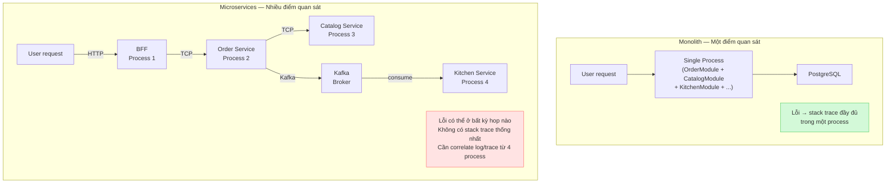
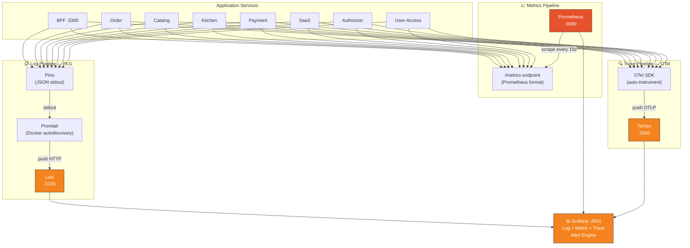
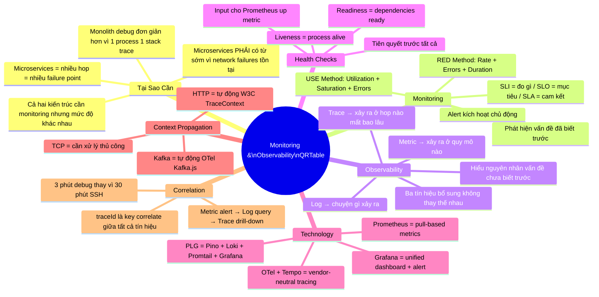

# Monitoring & Observability: Lý Thuyết và Triển Khai Thực Chiến — QRTable Phase 6

> **Triết lý tài liệu:** Hiểu _tại sao_ trước _như thế nào_. Lý thuyết được dạy qua ngữ cảnh
> cụ thể của QRTable — không học trừu tượng mà học để áp dụng ngay. Tài liệu bao phủ cả
> **Monitoring** (phát hiện vấn đề, đo lường SLO) và **Observability** (hiểu nguyên nhân, debug).
>
> **Phạm vi:** Phase 6 — Bước 6.1 (Health Check + PLG + Prometheus + Tempo/OTel)
> và Bước 6.2 (Grafana Dashboards + Alerting). Đây là lý thuyết nền tảng kèm lộ trình
> triển khai — không phải code snippet copy-paste.

---

## Mục Lục

1. [Vấn Đề Cần Giải Quyết](#1-vấn-đề-cần-giải-quyết)
2. [Monolith vs Microservices — Tại Sao Observability Trở Thành Bắt Buộc](#2-monolith-vs-microservices--tại-sao-observability-trở-thành-bắt-buộc)
3. [Monitoring và Observability — Hai Khái Niệm Bổ Sung Cho Nhau](#3-monitoring-và-observability--hai-khái-niệm-bổ-sung-cho-nhau)
4. [Ba Trụ Cột Của Observability](#4-ba-trụ-cột-của-observability)
5. [Health Checks — Tiên Quyết Trước Tất Cả](#5-health-checks--tiên-quyết-trước-tất-cả)
6. [Distributed Tracing và Context Propagation](#6-distributed-tracing-và-context-propagation)
7. [Technology Stack — Tại Sao Chọn Gì](#7-technology-stack--tại-sao-chọn-gì)
8. [Kiến Trúc Observability Trong QRTable](#8-kiến-trúc-observability-trong-qrtable)
9. [Bước 6.1A — Health Checks Toàn Service](#9-bước-61a--health-checks-toàn-service)
10. [Bước 6.1B — Stack PLG: Pino + Loki + Promtail + Grafana](#10-bước-61b--stack-plg-pino--loki--promtail--grafana)
11. [Bước 6.1C — Prometheus và Custom Metrics](#11-bước-61c--prometheus-và-custom-metrics)
12. [Bước 6.1D — Tempo và OpenTelemetry](#12-bước-61d--tempo-và-opentelemetry)
13. [Bước 6.1E — Context Propagation qua TCP và Kafka](#13-bước-61e--context-propagation-qua-tcp-và-kafka)
14. [Bước 6.2 — Grafana Dashboards và Alerting](#14-bước-62--grafana-dashboards-và-alerting)
15. [Verification — Tiêu Chí Nghiệm Thu](#15-verification--tiêu-chí-nghiệm-thu)
16. [Tổng Kết Mental Model](#16-tổng-kết-mental-model)

---

## 1. Vấn Đề Cần Giải Quyết

### 1.1 Một Request Đi Qua Nhiều Hop

QRTable là microservices thực sự. Khi khách bàn 5 bấm "Đặt món", request không đi đến một nơi — nó qua nhiều service theo nhiều protocol khác nhau:

```
Customer PWA
    ↓ HTTP REST
BFF (port 3300)
    ↓ TCP
Order Service
    ↓ TCP
Catalog Service (kiểm tra stock)
    ↓ Kafka: order.confirmed
Kitchen Service (tạo KDS ticket)
    ↓ Redis Pub/Sub
BFF (emit WebSocket)
    ↓ WebSocket
KDS màn hình bếp
```

**Câu hỏi thực tế:** Khách báo "đặt món rồi mà bếp không thấy gì". Bạn debug thế nào?

Nếu không có monitoring & observability:

- SSH vào từng container, đọc `stdout` từng service
- Không biết request có đến Order không, có qua Kafka không, Kitchen có nhận không
- Không biết bước nào thất bại, bước nào trễ
- Mỗi lần sự cố cần 20–30 phút để định vị, đôi khi không tìm được nguyên nhân

Nếu có monitoring & observability:

- Một trace ID duy nhất nối toàn bộ hành trình từ BFF đến KDS
- Log tập trung: query `traceId = "abc123"` thấy ngay log của tất cả service liên quan
- Metric cho biết latency breakdown theo từng hop
- Nếu Kitchen không nhận Kafka event, consumer lag metric cảnh báo trước khi khách phàn nàn

### 1.2 Ba Tình Huống Điển Hình Của QRTable

**Tình huống 1 — Không biết service nào chết:** BFF không trả response nhưng không rõ TCP call đến Order bị lỗi hay Order call Catalog bị lỗi. Health check giải quyết: biết ngay service nào không healthy.

**Tình huống 2 — Không biết tại sao chậm:** POS phàn nàn "danh sách đơn hàng tải rất chậm". Không có metric thì không biết P95 latency của `GET /admin/orders` là 2s hay 10s, không biết bottleneck ở BFF hay Order hay PostgreSQL. Prometheus + tracing giải quyết.

**Tình huống 3 — Không thể demo tin cậy:** Demo với hội đồng nhưng không có dashboard nào cho thấy traffic live, đơn/phút, KDS latency, tất cả service đang healthy. Grafana dashboard giải quyết — biến raw data thành câu chuyện vận hành có thể kể trong 5 phút.

---

## 2. Monolith vs Microservices — Tại Sao Observability Trở Thành Bắt Buộc

Đây là phần lý thuyết cốt lõi nhất. Hiểu sự khác biệt giữa hai kiến trúc từ góc nhìn observability mới hiểu tại sao QRTable — với 8 services và 4 protocol khác nhau — **không thể vận hành thiếu** monitoring & observability.

### 2.1 Debugging Trong Monolith — Tại Sao Đơn Giản Hơn

Trong monolith, toàn bộ business logic chạy trong **một process duy nhất** trên **một máy** (hoặc vài instance giống hệt nhau). Điều này có nghĩa:

```
Monolith Process
├── HTTP Handler
├── OrderModule
├── CatalogModule
├── KitchenModule
├── PaymentModule
└── Database connection pool
```

**Khi có lỗi trong monolith:**

1. **Stack trace đầy đủ:** Lỗi xảy ra ở `OrderService.submit()` → stack trace chứa toàn bộ call chain từ HTTP handler xuống đến dòng code gây lỗi. Không cần "đi tìm" lỗi ở đâu — nó nằm ngay trong stack trace.

2. **Một process = một log stream:** Toàn bộ log của request nằm trong cùng một file/stdout. Grep `"order-submit"` trong một file là đủ.

3. **In-process call không cần network:** Khi `OrderModule` gọi `CatalogModule`, đó là function call trong cùng process — không có network latency, không có timeout, không có serialization. Không cần trace để biết "call đi qua đâu".

4. **Transaction rõ ràng:** Một database transaction bao phủ toàn bộ operation — nếu lỗi thì rollback ngay, không có partial state trải khắp nhiều service.

**Monitoring trong monolith cũng đủ với công cụ đơn giản:**

- Một log file → grep
- Một process → `top` hoặc `htop` để xem CPU/memory
- Một database → query `pg_stat_statements` để tìm slow query
- Uptime check: nếu process sống, system sống

Đây là lý do nhiều hệ thống monolith chạy nhiều năm chỉ với `console.log` và đôi khi cũng tốt.

### 2.2 Debugging Trong Microservices — Tại Sao Phức Tạp Hơn Căn Bản

Microservices phân rã monolith thành **nhiều process độc lập** giao tiếp qua **network**. Chính sự thay đổi này tạo ra một loạt vấn đề hoàn toàn mới:

#### Sơ đồ: Sự Khác Biệt Căn Bản — Debug Monolith vs Microservices

> Trong monolith, một lỗi có một stack trace trong một process. Trong microservices, cùng một "lỗi" từ góc nhìn user có thể là tập hợp của nhiều failure mode độc lập trải khắp nhiều service.



**Vấn đề 1 — Network failure modes không tồn tại trong monolith:**

Khi `OrderModule` gọi `CatalogModule` trong monolith, đó là function call — không thể "timeout", không thể "connection refused". Nhưng trong microservices, TCP call từ Order đến Catalog có thể:

- Timeout (Catalog quá tải)
- Connection refused (Catalog chưa khởi động)
- Partial failure (Catalog nhận request nhưng không trả response)
- Network partition (network glitch giữa hai container)

Mỗi failure mode này yêu cầu strategy debug khác nhau — và **bạn cần metric + trace để phân biệt chúng**.

**Vấn đề 2 — Không có stack trace thống nhất:**

Trong monolith: `Error at OrderService.submitOrder (order.service.ts:45) at CatalogService.deductStock (catalog.service.ts:23) at...` — toàn bộ call chain nằm trong một trace.

Trong microservices: Khi Order gọi TCP đến Catalog và Catalog lỗi, **Order chỉ thấy "TCP timeout"** — không thấy stack trace bên trong Catalog. Catalog lỗi gì? Ở dòng code nào? Không biết nếu không có distributed tracing.

**Vấn đề 3 — Log phân tán:**

Một request trong QRTable tạo ra log entries trong BFF, Order, Catalog, và Kitchen — bốn process riêng biệt, bốn stdout stream riêng. Nếu không có centralized logging và `traceId` được propagate, không thể ghép lại toàn bộ câu chuyện của một request.

**Vấn đề 4 — Distributed transactions và partial failure:**

Trong monolith, nếu `OrderModule.save()` thành công nhưng `KitchenModule.createTicket()` fail, database transaction rollback cả hai. Trong microservices, nếu Order save thành công nhưng Kafka message đến Kitchen bị lost, **trạng thái không nhất quán** — Order service nghĩ ticket đã được tạo, Kitchen không biết gì. Cần observability để phát hiện trạng thái này.

**Vấn đề 5 — "Blame game" giữa services:**

Khi có sự cố, câu hỏi đầu tiên là "lỗi ở service nào?". Không có distributed tracing, đây là một cuộc tranh luận dựa trên phỏng đoán. Với distributed tracing, có câu trả lời chính xác trong vài giây.

### 2.3 Bảng So Sánh Căn Bản

| Khía cạnh               | Monolith                 | Microservices                      |
| ----------------------- | ------------------------ | ---------------------------------- |
| **Điểm quan sát**       | Một process              | N processes, N log streams         |
| **Lỗi xác định bằng**   | Stack trace đơn lẻ       | Distributed trace qua N hops       |
| **Log debug**           | Grep một file            | Query tập trung với traceId        |
| **Network failures**    | Không tồn tại            | Timeout, partition, retry storm    |
| **Latency attribution** | Rõ ràng trong call stack | Cần trace để phân tích từng hop    |
| **Partial failures**    | Không có (transaction)   | Có thể xảy ra ở mọi hop            |
| **Dependency health**   | Một DB, một external     | N databases, Kafka, Redis, gRPC... |
| **Công cụ tối thiểu**   | grep + top + query       | Centralized log + metrics + traces |

### 2.4 Monolith Cũng Cần Monitoring — Nhưng Ở Mức Khác

Không nên hiểu nhầm rằng monolith không cần monitoring. Mọi hệ thống production đều cần monitoring — sự khác biệt là **mức độ phức tạp và phạm vi cần thiết**:

**Monolith cần (và đủ với):**

- Uptime monitoring: process còn sống không?
- Resource monitoring: CPU, memory, disk của một server
- Error rate từ log file
- Database slow query monitoring
- HTTP response time (nếu có web layer)

**Monolith bắt đầu cần observability khi:**

- Codebase lớn, nhiều module tương tác phức tạp
- Database query phức tạp, khó biết query nào chậm
- Nhiều người dùng đồng thời — cần hiểu distribution, không chỉ average
- Business logic phức tạp — cần trace call flow để debug edge cases

**Microservices cần observability từ ngày đầu vì:**

- Sự phức tạp của distributed system không cho phép debug thủ công
- Failure domain nhiều hơn một monolith trưởng thành
- Network là dependency — có thể fail bất cứ lúc nào
- Không thể SSH vào 8 container để debug một request

**Kết luận:** Cả monolith và microservices đều cần monitoring. Microservices **bắt buộc** phải có observability (log + metric + trace) từ sớm vì không có nó, hệ thống trở thành "black box" không thể vận hành tin cậy. QRTable với 8 services và 4 protocol (HTTP/TCP/Kafka/WebSocket) là minh chứng điển hình.

### 2.5 Tại Sao QRTable Đặt Phase 6 Là Observability

Nhìn lại roadmap QRTable: Phase 0 → Phase 5 là xây feature. Phase 6 là observability. Tại sao không làm từ Phase 0?

**Lý do thực tế:** Khi team nhỏ, codebase còn nhỏ, chạy local với Docker Compose — có thể debug bằng cách đọc log từng container. Nhưng khi hệ thống có 8 services và sẵn sàng demo/deploy, không thể tiếp tục debug thủ công.

**Lý do kỹ thuật:** Một số metric (order rate, KDS latency, payment success rate) chỉ có ý nghĩa khi có traffic thật. Xây dashboard trước khi có traffic là premature optimization.

**Lý do cho demo/thesis:** Observability stack chứng minh hệ thống không chỉ "chạy được" mà còn "có thể vận hành". Đây là điểm cộng quan trọng — hội đồng thấy Grafana dashboard với live metrics chứng tỏ bạn hiểu sản xuất, không chỉ lập trình.

---

## 3. Monitoring và Observability — Hai Khái Niệm Bổ Sung Cho Nhau

### 3.1 Monitoring — Phát Hiện Vấn Đề, Đo Lường Cam Kết

Monitoring là quá trình **liên tục đo lường** và **so sánh với ngưỡng định trước** để phát hiện khi hệ thống lệch khỏi trạng thái bình thường. Monitoring trả lời câu hỏi bạn đã biết trước cần hỏi.

```
Monitoring = đặt câu hỏi trước → hệ thống tự trả lời theo thời gian thực
           = "Error rate > 5%? → Alert"
           = "Service down? → Alert"
           = reactive — biết KHI vấn đề đang xảy ra hoặc mới xảy ra
```

#### SLI, SLO, SLA — Nền Tảng Của Monitoring Có Ý Nghĩa

Monitoring chỉ có giá trị khi được neo vào **cam kết về chất lượng dịch vụ**. Ba khái niệm này định nghĩa cái gì cần monitor và tại sao:

**SLI (Service Level Indicator):** Chỉ số đo lường thực tế — con số bạn đo được.

```
SLI = tỷ lệ request thành công
    = (request status 2xx) / (tổng request) = 99.3%

SLI = P95 latency của BFF = 145ms
SLI = Kafka consumer lag của Kitchen = 12 messages
```

**SLO (Service Level Objective):** Mục tiêu bạn đặt ra cho SLI — ngưỡng để xác định "đang ổn" hay "có vấn đề".

```
SLO = tỷ lệ request thành công ≥ 99.5% (trong 30 ngày rolling)
SLO = P95 latency BFF ≤ 500ms
SLO = KDS ticket created trong 30s sau order.confirmed
```

**SLA (Service Level Agreement):** Cam kết chính thức với người dùng/khách hàng — thường có hậu quả pháp lý hoặc tài chính nếu vi phạm. Trong QRTable (hệ thống thesis), SLA không chính thức nhưng SLO vẫn quan trọng như chuẩn để đánh giá.

**Error Budget:** Phần "được phép không đạt SLO". Ví dụ SLO 99.5% availability → error budget = 0.5% downtime/tháng ≈ 3.6 giờ/tháng. Khi error budget cạn → tập trung reliability, không ship feature mới.

**Tại sao quan trọng cho QRTable:** Dashboard Business Metrics (Section 14) không chỉ hiển thị số — nó cần ngưỡng cụ thể để biết "đang tốt" hay "cần action". KDS processing time panel có threshold 10 phút — đây là SLO thực tế của QRTable.

#### RED Method — Framework Monitoring Cho Services

RED (Rate, Errors, Duration) là framework chuẩn để monitor service-oriented systems. Với mỗi service trong QRTable, cần monitor:

| Chỉ số       | Ý nghĩa                                 | Ví dụ QRTable                                                              |
| ------------ | --------------------------------------- | -------------------------------------------------------------------------- |
| **Rate**     | Bao nhiêu request/giây đang được xử lý? | `rate(http_requests_total{service="order"}[1m])`                           |
| **Errors**   | Bao nhiêu % request đang thất bại?      | `rate(http_requests_total{status=~"5.."}[5m]) / rate(...)`                 |
| **Duration** | Request mất bao lâu? (P50, P95, P99)    | `histogram_quantile(0.95, rate(http_request_duration_seconds_bucket[5m]))` |

RED method phù hợp cho tất cả services của QRTable — BFF, Order, Catalog, Kitchen, Payment, SaaS.

#### USE Method — Framework Monitoring Cho Infrastructure

USE (Utilization, Saturation, Errors) là framework cho infrastructure resources:

| Chỉ số          | Ý nghĩa                                    | Ví dụ QRTable                                            |
| --------------- | ------------------------------------------ | -------------------------------------------------------- |
| **Utilization** | % thời gian resource đang bận              | PostgreSQL connection pool usage %, Redis memory usage % |
| **Saturation**  | Queue depth — resource đang bị "ép" không? | Kafka consumer lag, PostgreSQL queue length              |
| **Errors**      | Lỗi ở cấp resource                         | Redis connection error count, Kafka broker error rate    |

USE method áp dụng cho: PostgreSQL, Redis, Kafka, CPU, Memory, Network của Docker containers.

### 3.2 Observability — Hiểu Nguyên Nhân, Debug Unknown Unknowns

Observability là khả năng **suy luận về trạng thái bên trong** của hệ thống chỉ từ các tín hiệu bên ngoài (log, metric, trace) — kể cả với những failure mode bạn **chưa từng hình dung trước**.

```
Observability = khả năng trả lời câu hỏi chưa biết trước
             = "Tại sao 2% request của tenant-A chậm hơn tenant-B?"
             = "Kafka consumer lag đột biến lúc 10:23 — do message nào?"
             = proactive debugging — tìm ra vấn đề chưa có alert cho nó
```

**Ví dụ QRTable — câu hỏi observability, không phải monitoring:**

- Một tenant cụ thể bị chậm hơn các tenant khác — không có alert cho điều này, nhưng với trace + structured log có `tenantId`, bạn có thể query và phát hiện
- KDS ticket của một station chậm hơn station kia — cần trace để xem processing time theo station
- Một Kafka consumer message gây ra vòng lặp retry — cần trace message ID qua toàn bộ flow

### 3.3 Monitoring và Observability Cần Nhau — Không Thay Thế Nhau

Đây là điểm hay bị hiểu nhầm nhất. Không phải "microservices dùng observability, monolith dùng monitoring". Cả hai cần cả hai — nhưng với vai trò khác nhau trong cùng một hệ thống:

```
Alert metric kích hoạt (Monitoring)
        ↓
        "Có vấn đề với Order service"
        ↓
Query log để hiểu vấn đề là gì (Observability)
        ↓
        "Order submit đang fail với error 'Catalog TCP timeout'"
        ↓
Trace để tìm nguồn gốc vấn đề (Observability)
        ↓
        "Catalog service có slow query, 300ms trên UPDATE statement"
        ↓
Fix vấn đề, xem metric recovery (Monitoring)
        ↓
        "Error rate đã về 0%, P95 latency bình thường"
```

**Monitoring không đủ một mình** vì nó chỉ nói "có vấn đề" — không nói "tại sao". Khi alert kích hoạt, bạn cần observability để tìm nguyên nhân.

**Observability không đủ một mình** vì bạn không thể ngồi nhìn Grafana 24/7 để phát hiện vấn đề. Monitoring alert là cơ chế chủ động thông báo khi có sự cố, không cần ai xem.

**Workflow thực tế:**

1. Monitoring đặt alert + SLO targets
2. Alert kích hoạt khi SLO bị vi phạm
3. Observability (log + trace) giúp debug nguyên nhân
4. Fix → monitoring confirm SLO đã recover

### 3.4 Ba Tín Hiệu — Nền Tảng Của Cả Monitoring Và Observability

| Tín hiệu    | Vai trò trong Monitoring                | Vai trò trong Observability                    |
| ----------- | --------------------------------------- | ---------------------------------------------- |
| **Logs**    | Đếm error rate, count event             | Debug "chuyện gì đã xảy ra" cho request cụ thể |
| **Metrics** | Alert khi ngưỡng bị vượt, SLO dashboard | Trend analysis, capacity planning              |
| **Traces**  | Latency SLO per endpoint                | Debug "bottleneck ở hop nào", root cause       |

Ba tín hiệu không thay thế nhau — chúng bổ sung:

- Metric cho biết **có** vấn đề (anomaly detection)
- Log cho biết vấn đề là **gì** (error message, context)
- Trace cho biết vấn đề xảy ra **ở đâu** trong flow (span breakdown)

---

## 4. Ba Trụ Cột Của Observability

### 4.1 Trụ Cột 1: Logs — Sự Kiện Có Ngữ Cảnh

Log là bản ghi sự kiện có timestamp xảy ra trong hệ thống. Trong microservices, không phải log nào cũng đủ để debug.

#### Structured Logging — Không Phải Plain Text

```
# Plain text log — không thể query có ngữ cảnh
[2026-05-14 10:23:45] Order submitted for table 5, tenant abc

# Structured JSON log — machine-readable, queryable, correlatable
{
  "timestamp": "2026-05-14T10:23:45.123Z",
  "level": "info",
  "service": "order",
  "tenantId": "tenant-abc",
  "traceId": "abc123def456",
  "spanId": "span789",
  "event": "order.submitted",
  "orderId": "order-uuid-001",
  "tableId": "table-005",
  "itemCount": 3,
  "msg": "Order submitted successfully"
}
```

Với structured log, query "Tìm tất cả log của tenant-abc trong 30 phút qua có level ERROR" là một dòng LogQL — thao tác không thể làm với plain text.

#### Log Levels — Nguyên Tắc Sử Dụng

| Level   | Dùng khi nào                                   | Ví dụ trong QRTable                                 |
| ------- | ---------------------------------------------- | --------------------------------------------------- |
| `error` | Lỗi cần attention ngay — không phải user error | TCP call đến Catalog timeout, DB connection fail    |
| `warn`  | Bất thường nhưng không cần action ngay         | Kafka consumer lag tăng, cache miss rate cao        |
| `info`  | Sự kiện bình thường quan trọng                 | Order submitted, Payment completed, Session created |
| `debug` | Chi tiết cho debug — tắt ở production          | Query parameters, intermediate state                |
| `trace` | Cực kỳ verbose — deep debug only               | Từng bước trong saga, từng Kafka message            |

**Quy tắc QRTable:** Production chạy `info` level. Khi debug issue, tạm bật `debug` cho service đó mà không restart toàn stack.

#### Centralized Log Aggregation — Tại Sao Cần

Trong microservices, không thể SSH vào từng container để xem log. Cần một nơi tập trung:

```
BFF log     → stdout ─┐
Order log   → stdout ─┤
                      ├─→ Promtail (collector) → Loki (storage) → Grafana (query UI)
Catalog log → stdout ─┤
Kitchen log → stdout ─┘
```

**Loki** lưu log theo time-series + labels. Không index full-text (khác Elasticsearch) — chỉ index labels. Rẻ và đơn giản hơn nhưng query cần biết label.

**LogQL** — ngôn ngữ query của Loki:

```
# Tìm tất cả ERROR của Order service
{app="order"} |= "ERROR"

# Tìm log có tenantId cụ thể
{app="order"} | json | tenantId="tenant-abc"

# Đếm error rate theo thời gian
count_over_time({app="order"} |= "ERROR" [5m])

# Tìm tất cả log liên quan đến một trace — xuyên qua nhiều service
{app=~"bff|order|catalog|kitchen"} | json | traceId="abc123def456"
```

Câu query cuối cùng là ví dụ về sức mạnh của structured logging + centralized storage: một query duy nhất trả về toàn bộ log của một request qua 4 services.

---

### 4.2 Trụ Cột 2: Metrics — Số Liệu Có Ngữ Cảnh

Metric là **đo lường định lượng** của hệ thống theo thời gian. Khác với log (sự kiện đơn lẻ), metric là aggregation — tổng, trung bình, phần trăm tính trên nhiều sự kiện.

#### Bốn Loại Metric (Prometheus Data Model)

**Counter — chỉ tăng, không bao giờ giảm:**

```
http_requests_total{service="order", method="POST", status="200"} = 1547
```

Dùng cho: tổng số request, error, order, Kafka message. Query: `rate(http_requests_total[5m])` → request/giây trong 5 phút.

**Gauge — có thể tăng hoặc giảm:**

```
active_websocket_connections{service="bff", tenantId="t-001"} = 23
redis_memory_used_bytes = 134217728
kafka_consumer_lag{topic="order.confirmed", group="kitchen"} = 42
```

Dùng cho: trạng thái hiện tại — kết nối, memory, queue depth.

**Histogram — phân phối giá trị:**

```
http_request_duration_seconds_bucket{le="0.1"} = 1200  # 1200 req < 100ms
http_request_duration_seconds_bucket{le="0.5"} = 1450  # 1450 req < 500ms
http_request_duration_seconds_bucket{le="1.0"} = 1480  # 1480 req < 1s
http_request_duration_seconds_bucket{le="+Inf"} = 1500 # tổng tất cả
```

Dùng để tính P50, P95, P99 latency.

**Summary — tương tự Histogram, tính phân vị ở client:** Ít dùng trong practice vì khó aggregate nhiều instance.

#### Tại Sao P95/P99 Quan Trọng Hơn Average

```
Ví dụ: 100 request latency (ms):
  10ms × 90 request  +  200, 500, 1000, 1500, 2000ms × 10 request

Average = (90×10 + 5200) / 100 = 61ms → "Ổn"
P95 = 1000ms  → "5% khách hàng đợi > 1 giây"
P99 = 2000ms  → "1% khách hàng đợi > 2 giây"
```

Average che giấu outliers. P95/P99 cho biết trải nghiệm thực tế của người dùng xui xẻo — đây mới là con số quan trọng cho SLO.

#### PromQL — Ngôn Ngữ Query Của Prometheus

```
# Error rate của Order service (RED Method — Errors)
rate(http_requests_total{service="order", status=~"5.."}[5m])
/ rate(http_requests_total{service="order"}[5m])

# P95 latency của BFF (RED Method — Duration)
histogram_quantile(0.95,
  rate(http_request_duration_seconds_bucket{service="bff"}[5m])
)

# Throughput (RED Method — Rate)
rate(http_requests_total{service="order"}[1m])

# Kafka consumer lag (USE Method — Saturation)
kafka_consumer_lag{topic="order.confirmed", group="kitchen-group"}

# Business metric — Orders per minute
rate(qrtable_orders_total[1m]) * 60
```

---

### 4.3 Trụ Cột 3: Traces — Hành Trình Request

Trace là **bản ghi hành trình của một request** qua toàn bộ hệ thống phân tán. Đây là tín hiệu duy nhất có thể trả lời "bottleneck nằm ở hop nào?" trong microservices.

#### Khái Niệm Cốt Lõi

**Trace:** Đại diện cho toàn bộ hành trình — từ BFF đến KDS. Định danh bởi `trace_id` duy nhất (16 bytes hex).

**Span:** Một đơn vị công việc. Mỗi service hop tạo ít nhất một span, có: `span_id`, `parent_span_id`, tên operation, timestamps start/end, attributes tùy ý.

**Context Propagation:** Cơ chế truyền `trace_id` + `span_id` từ service này sang service khác — qua HTTP header, TCP metadata, Kafka header.

#### Anatomy Của Một Trace Trong QRTable

```
Trace ID: abc123def456  (Duration: 385ms total)

├── [BFF] POST /customer/orders                   0ms → 385ms  (385ms)
│   ├── [BFF] Auth guard + validation             0ms → 12ms   (12ms)
│   └── [BFF→Order] TCP call: ORDER_SUBMIT        12ms → 365ms (353ms)
│       ├── [Order] Handler: submitOrder          12ms → 60ms  (48ms)
│       │   ├── [Order] Redis: get session        12ms → 18ms  (6ms)
│       │   └── [Order] PostgreSQL: insert order  18ms → 60ms  (42ms)
│       └── [Order→Catalog] TCP: DEDUCT_STOCK     60ms → 350ms (290ms) ← BOTTLENECK!
│           ├── [Catalog] PostgreSQL: SELECT lock 60ms → 120ms (60ms)
│           └── [Catalog] PostgreSQL: UPDATE      120ms → 350ms (230ms) ← slow query
│
└── [Async] Kafka: order.confirmed published      365ms
    └── [Kitchen] consume order.confirmed         370ms → 385ms (15ms)
```

Từ trace này bạn biết ngay: 290ms trong 353ms là do Catalog TCP call, cụ thể là PostgreSQL UPDATE chậm. Không cần đoán, không cần đọc log từng service.

---

## 5. Health Checks — Tiên Quyết Trước Tất Cả

Health check không nằm trong "three pillars" truyền thống nhưng trong thực tế là **tiên quyết** — nếu không biết service nào đang chạy, các tín hiệu khác vô nghĩa. Đây cũng là input quan trọng cho Monitoring: Prometheus scrape health endpoint để tạo `up` metric cho alerting.

### 5.1 Hai Loại Health Check

**Liveness — Process còn sống không?**

```
GET /health/live → { status: "ok" }
```

Trả về 200 nếu process đang chạy. Không check dependency. Nếu fail → orchestrator (Docker/K8s) restart container ngay.

**Readiness — Service có sẵn sàng nhận traffic không?**

```
GET /health/ready → {
  "status": "ok",
  "info": {
    "postgres": { "status": "up" },
    "redis": { "status": "up" },
    "kafka": { "status": "up" }
  }
}
```

Check tất cả external dependencies. Nếu fail → không route traffic đến service này, nhưng không restart.

**Quy tắc quan trọng:** Readiness check phải nhẹ — không tạo real query phức tạp. Dùng `SELECT 1` cho PostgreSQL, `PING` cho Redis. Health check bản thân không được trở thành bottleneck.

### 5.2 Health Check Trong QRTable — Mapping Theo Service

| Service     | Readiness Checks                                                                    |
| ----------- | ----------------------------------------------------------------------------------- |
| BFF         | Redis PING + tất cả TCP clients reach được (Order, Catalog, Kitchen, Payment, SaaS) |
| Authorizer  | Keycloak HTTP reachable + gRPC listener active                                      |
| Catalog     | PostgreSQL `SELECT 1`                                                               |
| Order       | PostgreSQL `SELECT 1` + Redis PING + Kafka producer initialized                     |
| Kitchen     | Redis PING + Kafka consumer group active                                            |
| Payment     | PostgreSQL `SELECT 1` + Redis PING + SePay config loaded                            |
| SaaS        | PostgreSQL `SELECT 1` + Redis PING                                                  |
| User-Access | MongoDB connection active                                                           |

**NestJS Terminus** là thư viện chính thức cho health check trong NestJS, expose `/health/live` và `/health/ready` với built-in indicators cho TypeORM, Redis, HTTP, gRPC.

---

## 6. Distributed Tracing và Context Propagation

### 6.1 Tại Sao Context Propagation Là Thách Thức Kỹ Thuật

Trong monolith, một request = một thread = một execution context duy nhất. Trace của request đó là call stack trong process đó. Trong microservices, một request vượt qua nhiều process và nhiều protocol:

```
HTTP request → BFF process
    ↓ TCP call (không có headers như HTTP!)
Order process
    ↓ Kafka message (có headers, nhưng phải manually inject)
Kitchen process
    ↓ Redis Pub/Sub (không có trace context natively)
BFF (WebSocket emit)
```

Để trace nối được qua tất cả hop, phải inject `trace_id` và `span_id` vào **mọi boundary**:

- HTTP header: `traceparent: 00-{traceId}-{spanId}-01` (W3C TraceContext standard)
- TCP metadata: custom field trong NestJS TCP message
- Kafka header: `traceparent` header trong Kafka record

### 6.2 OpenTelemetry — Standard Mở Tránh Vendor Lock-in

OpenTelemetry (OTel) là standard mở cho telemetry (traces, metrics, logs). Trước OTel, mỗi vendor (Jaeger, Zipkin, Datadog) có SDK riêng — tích hợp một vendor là lock-in. OTel giải quyết bằng cách là **vendor-neutral layer**:

```
Application code
    ↓ OTel SDK (instrument, collect)
    ↓ OTel Collector (process, route) — optional
    ↓
  Tempo (Grafana)  |  Jaeger  |  Datadog  |  Any backend
```

QRTable dùng OTel SDK → push trực tiếp sang Tempo (không cần Collector cho local setup).

### 6.3 Auto-instrumentation vs Manual Instrumentation

**Auto-instrumentation:** OTel SDK tự động tạo spans cho HTTP, database queries, gRPC, Kafka — không cần thay đổi code. Chỉ cần import instrumentation package đầu entry file.

**Manual instrumentation:** Tự tạo span cho business logic quan trọng:

```typescript
const span = tracer.startSpan('order.confirmationSaga');
span.setAttributes({ tenantId, orderId, step: 'catalog-deduct' });
try {
  // ... saga logic ...
} finally {
  span.end();
}
```

**Chiến lược QRTable:** Auto cho HTTP + TypeORM + Kafka + Redis. Manual cho business operations quan trọng (saga, KDS operations, payment flow).

### 6.4 W3C TraceContext Standard

Format header chuẩn để propagate trace context qua HTTP:

```
traceparent: 00-abc123def456789012345678901234-span001-01
             │  │                               │        │
             version  trace_id (32 hex chars)  span_id  flags (sampled=1)
```

OTel SDK tự động đọc `traceparent` từ incoming request, tạo child span, inject `traceparent` vào outgoing request. Vấn đề còn lại: TCP và Kafka không có HTTP headers — cần giải quyết thủ công (xem Section 13).

---

## 7. Technology Stack — Tại Sao Chọn Gì

### 7.1 Bảng Quyết Định Tổng Thể

| Nhu cầu                     | Chọn                 | Lý do                                                                    |
| --------------------------- | -------------------- | ------------------------------------------------------------------------ |
| Structured logging          | **Pino**             | Fastest Node.js logger, JSON native, overhead thấp                       |
| Log collection agent        | **Promtail**         | Native Grafana ecosystem, Docker autodiscovery tự động                   |
| Log storage + query         | **Loki**             | Lightweight (không index full-text), cùng hệ sinh thái Grafana           |
| Metrics scraping + storage  | **Prometheus**       | De-facto standard, pull-based, PromQL mạnh, NestJS native module         |
| Distributed tracing backend | **Tempo**            | Cùng hệ sinh thái Grafana, không cần Cassandra/ES, correlate với Loki    |
| Instrumentation standard    | **OpenTelemetry**    | Vendor-neutral, auto-instrument NestJS/Express, không lock-in            |
| Visualization + alerting    | **Grafana**          | Unified dashboard Log/Metric/Trace, alert engine, datasource correlation |
| Health check framework      | **@nestjs/terminus** | Official NestJS, declarative, built-in indicators                        |

### 7.2 Tại Sao PLG (Không Phải ELK)

**ELK Stack:** Elasticsearch + Logstash + Kibana — stack phổ biến nhưng nặng:

- Elasticsearch index full-text → cần nhiều RAM (~2–4GB chỉ riêng ES)
- Không tích hợp native với Prometheus/Tempo → phải chuyển tab khi debug

**PLG Stack:** Promtail + Loki + Grafana — nhẹ hơn nhiều:

- Loki chỉ index labels → nhẹ hơn đáng kể, phù hợp single-node Docker Compose
- Grafana: **một UI duy nhất** cho cả Log + Metric + Trace — correlate không cần chuyển app

Cho QRTable (Docker Compose single-node, RAM hạn chế), PLG là lựa chọn đúng.

### 7.3 Tại Sao Tempo (Không Phải Jaeger)

**Jaeger:** Tracing backend phổ biến nhưng cần Cassandra hoặc Elasticsearch cho storage, UI riêng biệt.

**Tempo:** Object storage backend (local filesystem cho dev) — không cần infra phụ, tích hợp native Grafana. Từ log hoặc metric, click `trace_id` → mở Tempo trace trực tiếp trong cùng Grafana.

---

## 8. Kiến Trúc Observability Trong QRTable

### 8.1 Data Flow Tổng Thể

#### Sơ đồ: Ba Pipeline Tín Hiệu — Log, Metric, Trace

> Ba tín hiệu đi theo ba con đường về Grafana. Promtail autodiscover Docker containers theo label. Prometheus pull-scrape `/metrics` endpoint. OTel SDK push traces sang Tempo. Grafana là điểm tập trung duy nhất để query và correlate cả ba.



### 8.2 Correlation — Sức Mạnh Thực Sự Của Grafana

Grafana không chỉ hiển thị từng tín hiệu riêng biệt — nó cho phép **correlate** giữa chúng trong cùng một UI:

```
Workflow debug thực tế — 3 phút thay vì 30 phút:

1. Grafana Metrics dashboard → spike error rate lúc 10:23
2. Click vào spike → Grafana Explore, Loki query:
   {app="order"} 10:22–10:24 | json | level="error"
3. Thấy log: "Catalog TCP timeout, traceId=abc123"
4. Click trace_id="abc123" → Grafana tự mở Tempo
5. Trace tree: BFF(12ms) → Order(48ms) → Catalog(290ms!) ← đây
6. Catalog span: PostgreSQL UPDATE 230ms ← root cause
7. Action: optimize Catalog query, thêm index
```

---

## 9. Bước 6.1A — Health Checks Toàn Service

### 9.1 NestJS Terminus — Setup Chuẩn

**@nestjs/terminus** cung cấp built-in indicators và framework compose:

```typescript
// Module setup
@Module({
  imports: [TerminusModule],
  controllers: [HealthController],
})
export class HealthModule {}

// Controller
@Controller('health')
export class HealthController {
  constructor(
    private health: HealthCheckService,
    private db: TypeOrmHealthIndicator,
  ) {}

  @Get('live')
  @HealthCheck()
  live() {
    return this.health.check([]); // empty = chỉ check process alive
  }

  @Get('ready')
  @HealthCheck()
  ready() {
    return this.health.check([
      () => this.db.pingCheck('postgres'),
      () => this.redis.pingCheck('redis', { type: 'redis', url: REDIS_URL }),
      // Custom indicators cho Kafka, TCP clients...
    ]);
  }
}
```

### 9.2 Custom Health Indicators

Terminus có built-in cho TypeORM, Redis, HTTP. Với Kafka consumer và NestJS TCP client, cần custom indicator:

**Kafka Consumer Health:** Check consumer group đã joined, không có active rebalance.

**NestJS TCP Client Health (BFF):** Gửi TCP `PING` message đến từng microservice, verify nhận `PONG`. BFF dùng indicator này để verify tất cả 7 downstream services reach được.

### 9.3 Response Format và HTTP Status

```json
// 200 — healthy
{ "status": "ok", "info": { "postgres": {"status":"up"}, "redis": {"status":"up"} } }

// 503 — unhealthy
{ "status": "error", "error": { "postgres": {"status":"down","message":"ECONNREFUSED"} } }
```

### 9.4 Tích Hợp Với Prometheus — `up` Metric

```yaml
# prometheus.yml
scrape_configs:
  - job_name: 'qrtable-health'
    metrics_path: '/health/live'
    static_configs:
      - targets:
          [
            'bff:3300',
            'order:3001',
            'catalog:3002',
            'kitchen:3003',
            'payment:3004',
            'saas:3005',
            'authorizer:3006',
            'user-access:3007',
          ]
```

Prometheus tự động tạo: `up{instance="order:3001"} = 0` khi service down → trigger Grafana alert "Service Down".

---

## 10. Bước 6.1B — Stack PLG: Pino + Loki + Promtail + Grafana

### 10.1 Pino — Structured Logger

Pino là logger nhanh nhất cho Node.js, JSON native, overhead thấp. Tích hợp NestJS qua `nestjs-pino`:

```typescript
// AppModule
PinoModule.forRoot({
  pinoHttp: {
    autoLogging: true, // log mỗi request/response
    level: process.env.LOG_LEVEL ?? 'info',
    // Thêm context vào mọi log
    customProps: (req) => ({
      tenantId: req.headers['x-tenant-id'],
    }),
    // Production: JSON thuần; Development: pretty-print
    transport: process.env.NODE_ENV !== 'production' ? { target: 'pino-pretty' } : undefined,
  },
});
```

```typescript
// Sử dụng trong service
@Injectable()
class OrderService {
  constructor(private readonly logger: PinoLogger) {}

  async submitOrder(dto: SubmitOrderDto, tenantId: string) {
    this.logger.info({ tenantId, sessionId: dto.sessionId }, 'Order submit started');
    try {
      const order = await this.createOrder(dto, tenantId);
      this.logger.info({ tenantId, orderId: order.id }, 'Order submitted');
      return order;
    } catch (error) {
      this.logger.error({ tenantId, error: error.message }, 'Order submit failed');
      throw error;
    }
  }
}
```

**Quy tắc:** Luôn log `tenantId` và `traceId` trong mọi log entry liên quan đến business operation. Đây là labels chính để filter và correlate.

### 10.2 Promtail — Log Collector

Promtail autodiscover Docker containers và forward log về Loki:

```
Container stdout → /var/lib/docker/containers/<id>-json.log
    ↓
Promtail (đọc file + apply labels từ Docker labels)
    ↓
Loki (push HTTP)
```

```yaml
# promtail-config.yaml
scrape_configs:
  - job_name: docker-containers
    docker_sd_configs:
      - host: unix:///var/run/docker.sock
    relabel_configs:
      - source_labels: [__meta_docker_container_label_app]
        target_label: app
    pipeline_stages:
      - json:
          expressions:
            level: level
            traceId: traceId
            tenantId: tenantId
      - labels:
          level: ''
          app: ''
```

```yaml
# docker-compose.app.yaml — label cho mỗi service
services:
  order:
    labels:
      app: 'order' # Promtail dùng label này → {app="order"} trong Loki
```

### 10.3 Loki — Log Storage

Loki lưu log theo time-series + labels. Không full-text index → query phải filter label trước, search text sau.

```yaml
# loki-config.yaml
auth_enabled: false
server:
  http_listen_port: 3100
storage_config:
  filesystem:
    directory: /loki/chunks
limits_config:
  retention_period: 168h # Giữ 7 ngày
  ingestion_rate_mb: 10
```

### 10.4 Verify PLG

```
1. docker compose up -d
2. Tạo traffic (login, submit order, ...)
3. Grafana :3001 → Explore → Loki
4. Query: {app="bff"}                          → thấy log JSON
5. Query: {app="order"} |= "ERROR"             → filter error
6. Query: {app=~"bff|order"} | json | tenantId="t-001"  → filter tenant
```

---

## 11. Bước 6.1C — Prometheus và Custom Metrics

### 11.1 NestJS Prometheus Module

```typescript
// AppModule
PrometheusModule.register({
  path: '/metrics',
  defaultMetrics: { enabled: true }, // auto: HTTP latency, memory, CPU
});
```

Auto-generated metrics sau khi setup: `http_requests_total`, `http_request_duration_seconds`, `nodejs_heap_used_bytes`, `process_cpu_seconds_total`.

### 11.2 Custom Business Metrics

Các metrics mà Grafana dashboard Business cần:

```typescript
// Counter: tổng order theo status
export const ordersTotal = new Counter({
  name: 'qrtable_orders_total',
  help: 'Total orders created',
  labelNames: ['tenantId', 'status'], // submitted, confirmed, cancelled
});

// Counter: revenue
export const revenueTotal = new Counter({
  name: 'qrtable_revenue_vnd_total',
  help: 'Total revenue in VND',
  labelNames: ['tenantId', 'paymentMethod'], // cash, vietqr
});

// Histogram: KDS processing time (quan trọng cho SLO monitoring)
export const kdsProcessingDuration = new Histogram({
  name: 'qrtable_kds_processing_duration_seconds',
  help: 'Time from order.confirmed to KDS completion',
  labelNames: ['tenantId', 'station'],
  buckets: [30, 60, 120, 300, 600, 1200], // 30s, 1m, 2m, 5m, 10m, 20m
});

// Gauge: active WebSocket connections
export const activeWsConnections = new Gauge({
  name: 'qrtable_websocket_connections_active',
  help: 'Active WebSocket connections',
  labelNames: ['tenantId', 'role'],
});

// Gauge: Kafka consumer lag (USE Method — Saturation)
export const kafkaConsumerLag = new Gauge({
  name: 'qrtable_kafka_consumer_lag',
  help: 'Kafka consumer offset lag',
  labelNames: ['topic', 'consumerGroup'],
});
```

### 11.3 Prometheus Scrape Config

```yaml
# prometheus.yml
global:
  scrape_interval: 15s

scrape_configs:
  - job_name: 'qrtable-services'
    static_configs:
      - targets:
          - 'bff:3300'
          - 'order:3001'
          - 'catalog:3002'
          - 'kitchen:3003'
          - 'payment:3004'
          - 'saas:3005'
          - 'authorizer:3006'
          - 'user-access:3007'
    metrics_path: '/metrics'

  - job_name: 'infrastructure'
    static_configs:
      - targets:
          - 'kafka-exporter:9308'
          - 'redis-exporter:9121'
          - 'postgres-exporter:9187'
```

---

## 12. Bước 6.1D — Tempo và OpenTelemetry

### 12.1 OTel SDK Setup

```bash
# Packages cần
@opentelemetry/sdk-node
@opentelemetry/auto-instrumentations-node
@opentelemetry/exporter-trace-otlp-http
@opentelemetry/sdk-trace-base
```

```typescript
// tracing.ts — import ĐẦU TIÊN trong main.ts
import { NodeSDK } from '@opentelemetry/sdk-node';
import { getNodeAutoInstrumentations } from '@opentelemetry/auto-instrumentations-node';
import { OTLPTraceExporter } from '@opentelemetry/exporter-trace-otlp-http';

const sdk = new NodeSDK({
  serviceName: process.env.OTEL_SERVICE_NAME ?? 'unknown',
  traceExporter: new OTLPTraceExporter({
    url: process.env.OTEL_EXPORTER_OTLP_ENDPOINT ?? 'http://tempo:4318/v1/traces',
  }),
  instrumentations: [
    getNodeAutoInstrumentations({
      '@opentelemetry/instrumentation-fs': { enabled: false }, // tắt noise
    }),
  ],
});

sdk.start();
process.on('SIGTERM', () => sdk.shutdown());
```

```typescript
// main.ts — tracing phải là dòng đầu tiên
import './tracing'; // ← TRƯỚC TẤT CẢ
import { NestFactory } from '@nestjs/core';
// ...
```

```yaml
# docker-compose.app.yaml — per-service
services:
  bff:
    environment:
      OTEL_SERVICE_NAME: 'bff'
      OTEL_EXPORTER_OTLP_ENDPOINT: 'http://tempo:4318/v1/traces'
  order:
    environment:
      OTEL_SERVICE_NAME: 'order'
      OTEL_EXPORTER_OTLP_ENDPOINT: 'http://tempo:4318/v1/traces'
  # ... repeat cho mọi service
```

### 12.2 Auto-instrumentation Coverage

| Library         | Spans được tạo tự động                                         |
| --------------- | -------------------------------------------------------------- |
| HTTP incoming   | Span cho mỗi request với method, path, status                  |
| HTTP outgoing   | Span cho mỗi outgoing fetch/axios                              |
| TypeORM         | Span cho mỗi query với SQL type                                |
| Redis (ioredis) | Span cho mỗi Redis command                                     |
| gRPC            | Span cho gRPC calls                                            |
| Kafka.js        | Span cho produce và consume (với traceparent header injection) |
| PostgreSQL (pg) | Span cho raw queries                                           |

Chỉ cần setup SDK một lần — toàn bộ database queries, Redis calls, Kafka messages đều có trace span.

### 12.3 Tempo Config

```yaml
# tempo-config.yaml
server:
  http_listen_port: 3200
distributor:
  receivers:
    otlp:
      protocols:
        http:
          endpoint: 0.0.0.0:4318
        grpc:
          endpoint: 0.0.0.0:4317
storage:
  trace:
    backend: local
    local:
      path: /tmp/tempo/blocks
    wal:
      path: /tmp/tempo/wal
```

---

## 13. Bước 6.1E — Context Propagation qua TCP và Kafka

Đây là phần kỹ thuật quan trọng và phức tạp nhất — làm trace "nối" được qua tất cả hop.

### 13.1 HTTP → HTTP — Tự Động

OTel SDK tự inject/extract `traceparent` header. Không cần làm gì thêm.

### 13.2 HTTP → TCP — Cần Xử Lý Thủ Công

NestJS TCP không có HTTP headers. Cần inject trace context vào message payload:

```typescript
// Concept: BFF inject trace context vào TCP message
const traceContext = {
  traceId: activeSpan.spanContext().traceId,
  spanId: activeSpan.spanContext().spanId,
  traceFlags: activeSpan.spanContext().traceFlags,
};

// Inject vào payload theo convention QRTable
this.orderClient.send('ORDER_SUBMIT', {
  ...payload,
  _traceContext: traceContext,
});

// Order service: extract và restore context để tạo child span
// → trace tiếp tục từ BFF sang Order với đúng parent
```

Giải pháp chuẩn: OTel `TextMapPropagator` với custom carrier cho TCP, hoặc NestJS interceptor tự động propagate cho tất cả TCP call/handler.

### 13.3 Kafka — Tự Động Với OTel Kafka.js Instrumentation

Kafka records có headers — OTel Kafka.js instrumentation tự inject/extract `traceparent`:

```typescript
// Producer — OTel tự inject traceparent vào headers
await producer.send({
  topic: 'order.confirmed',
  messages: [{ key: orderId, value: JSON.stringify(event) }],
  // OTel tự thêm: headers: { traceparent: '00-abc123-span789-01' }
});

// Consumer — OTel tự extract và tạo child span
// → trace liên tục từ Order (producer) sang Kitchen (consumer)
```

### 13.4 Verify Context Propagation

```
1. Submit một order từ Customer PWA
2. Grafana → Explore → Tempo
3. Search by Service: "bff", Time range: last 5 minutes
4. Trace tree phải có:
   ├── BFF (root span)
   ├── Order Service (child — TCP)
   │   └── Catalog Service (grandchild — TCP)
   └── Kitchen Service (async child — Kafka)

Nếu trace dừng ở BFF → TCP propagation chưa đúng
Nếu trace dừng ở Order → Kafka propagation chưa đúng
```

---

## 14. Bước 6.2 — Grafana Dashboards và Alerting

### 14.1 Nguyên Tắc Thiết Kế Dashboard

Dashboard tốt trả lời câu hỏi, không chỉ hiển thị số:

- **Câu hỏi rõ ràng:** "Service nào unhealthy?" — không phải "đây là một số"
- **Ngữ cảnh:** đơn vị đúng (ms, không phải seconds), threshold visual
- **Action orientation:** xem xong biết làm gì

### 14.2 Dashboard 1 — System Overview

Mục tiêu: "Hệ thống có đang sống không?" — nhìn một lần biết ngay.

```
Row 1: Service Health (UP/DOWN per service)
┌──────────┬──────────┬──────────┬──────────┬──────────┬──────────┬──────────┬──────────┐
│ BFF: ✅  │ Order:✅ │Catalog:✅│Kitchen:✅│Payment:✅│ SaaS: ✅ │Auth: ✅  │UserA: ✅ │
└──────────┴──────────┴──────────┴──────────┴──────────┴──────────┴──────────┴──────────┘

Row 2: Traffic Overview
┌──────────────────────────────────┬──────────────────────────────────┐
│ HTTP Requests/s (all services)   │ Error Rate % (5xx / total)       │
│ [time series — 1h window]        │ [line chart — red threshold 5%]  │
└──────────────────────────────────┴──────────────────────────────────┘

Row 3: Infrastructure Health (USE Method)
┌─────────────────┬─────────────────┬─────────────────┬─────────────────┐
│ Kafka Lag       │ Redis Memory %  │ PG Conn Pool %  │ P95 Latency     │
│ (per topic)     │ (threshold 80%) │ (threshold 90%) │ (all services)  │
└─────────────────┴─────────────────┴─────────────────┴─────────────────┘
```

```
# PromQL
up{job="qrtable-services"}                                # Service UP/DOWN
sum(rate(http_requests_total[5m])) by (service)           # Request rate (RED-Rate)
sum(rate(http_requests_total{status=~"5.."}[5m]))         # Error rate (RED-Errors)
/ sum(rate(http_requests_total[5m]))
histogram_quantile(0.95, rate(http_request_duration_seconds_bucket[5m]))  # P95 (RED-Duration)
```

### 14.3 Dashboard 2 — Business Metrics

Mục tiêu: Câu hỏi hội đồng/Owner quan tâm — không phải CPU.

```
Row 1: Revenue & Orders
┌──────────────────────────┬──────────────────────────┐
│ Orders/minute            │ Revenue/hour (VND)       │
│ [stat + sparkline trend] │ [stat + sparkline trend] │
└──────────────────────────┴──────────────────────────┘

Row 2: KDS Operations — SLO: 10 phút
┌──────────────────────────┬──────────────────────────┐
│ KDS P95 Processing Time  │ Active Tickets by Station│
│ [gauge — target < 10m]   │ [bar — KITCHEN vs BAR]   │
└──────────────────────────┴──────────────────────────┘

Row 3: Payment & Sessions
┌──────────────────────────┬──────────────────────────┐
│ Payment Success Rate %   │ Payment Method Split     │
│ [stat — target > 99%]    │ [pie — cash vs VietQR]   │
└──────────────────────────┴──────────────────────────┘

Row 4: Multi-tenant View (có filter variable theo tenantId)
┌──────────────────────────┬──────────────────────────┐
│ Active Sessions          │ Orders by Tenant         │
│ (gauge per tenant)       │ (bar chart)              │
└──────────────────────────┴──────────────────────────┘
```

```
# PromQL
rate(qrtable_orders_total{status="submitted"}[1m]) * 60        # Orders/minute
histogram_quantile(0.95, rate(qrtable_kds_processing_duration_seconds_bucket[10m]))
                                                               # KDS P95
sum(rate(qrtable_payments_total{status="completed"}[5m]))
/ sum(rate(qrtable_payments_total[5m])) * 100                  # Payment success %
```

### 14.4 Dashboard 3 — Per-Service Drill-down

Mục tiêu: Debug một service cụ thể. Có template variable `service` để chọn service.

```
Filter: service = [bff | order | catalog | kitchen | payment | saas | ...]

Row 1: RED Metrics
┌──────────────────────────────┬──────────────────────────────┐
│ Request Rate (by endpoint)   │ Error Rate % (by endpoint)   │
└──────────────────────────────┴──────────────────────────────┘

Row 2: Latency
┌──────────────────────────────┬──────────────────────────────┐
│ P50 / P95 / P99 Latency      │ Latency heatmap over time    │
└──────────────────────────────┴──────────────────────────────┘

Row 3: Dependencies
┌──────────────────────────────┬──────────────────────────────┐
│ DB query duration P95        │ Redis operation latency      │
└──────────────────────────────┴──────────────────────────────┘
```

### 14.5 Alerting Rules

**Alerting trong Grafana** có thể dùng Prometheus Alert Rules hoặc Grafana Alert Rules. Cả hai đều integrate vào Grafana UI.

| Alert              | Condition                       | Severity | For |
| ------------------ | ------------------------------- | -------- | --- |
| Service Down       | `up{job="qrtable"} == 0`        | Critical | 2m  |
| High Error Rate    | `error_rate > 0.05` per service | High     | 5m  |
| Kafka Consumer Lag | `kafka_lag > 1000`              | Warning  | 3m  |
| KDS SLA Breach     | `kds_p95 > 1200s`               | High     | 5m  |
| Redis Memory High  | `redis_memory_pct > 0.8`        | Warning  | 5m  |

```yaml
# prometheus-rules.yaml (Prometheus Alert Rules)
groups:
  - name: qrtable
    rules:
      - alert: ServiceDown
        expr: up{job="qrtable-services"} == 0
        for: 2m
        labels: { severity: critical }
        annotations:
          summary: '{{ $labels.instance }} is down'

      - alert: HighErrorRate
        expr: |
          sum(rate(http_requests_total{status=~"5.."}[5m])) by (service)
          / sum(rate(http_requests_total[5m])) by (service) > 0.05
        for: 5m
        labels: { severity: high }
        annotations:
          summary: 'High error rate on {{ $labels.service }}: {{ $value | humanizePercentage }}'
```

**Notification channel:** Cho thesis/demo, Grafana gửi alert về Grafana UI (alert history) + optional webhook endpoint để verify alert kích hoạt.

---

## 15. Verification — Tiêu Chí Nghiệm Thu

Phase 6 hoàn thành khi verify được tất cả:

### 15.1 Health Checks

```bash
# Mỗi service trả về 200
curl http://localhost:3300/health/live    # BFF liveness
curl http://localhost:3300/health/ready  # BFF readiness + dependencies

# Test failure detection: dừng Redis
docker stop redis
curl http://localhost:3300/health/ready  # → 503, redis: down

docker start redis
# Đợi ~5s
curl http://localhost:3300/health/ready  # → 200, redis: up
```

### 15.2 Loki — Log Query

```bash
# Grafana :3001 → Explore → Loki
# Sau khi chạy traffic thật hoặc load script:

{app="order"}                                    # log của Order service
{app="bff", level="error"}                       # filter error
{app=~"order|catalog"} | json | tenantId="t-001" # filter tenant
```

### 15.3 Tempo — Trace Propagation

```
1. Submit một order từ Customer PWA
2. Grafana → Explore → Tempo → Search, service="bff"
3. Trace tree PHẢI có:
   BFF (root) → Order → Catalog → [async] Kitchen
4. Duration của mỗi span phải realistic (không phải 0ms)
5. Attributes phải có: tenantId, service name đúng
```

### 15.4 Prometheus — Metrics Live

```
# Grafana → Prometheus (hoặc curl trực tiếp)
rate(http_requests_total{service="bff"}[1m])     # > 0 sau traffic
qrtable_orders_total                             # tăng sau mỗi order
up{job="qrtable-services"}                       # tất cả = 1
```

### 15.5 Alert Verification

```bash
# Test "ServiceDown" alert:
docker stop order                     # Dừng Order service

# Đợi 2 phút (alert for: 2m)
# Grafana → Alerting → Alert Rules
# → "ServiceDown" phải chuyển sang "Firing" state

docker start order
# Đợi ~2 phút
# → Alert phải về "Normal"
```

### 15.6 Demo Story — 5-Minute Capability

Sau Phase 6, phải có khả năng demo luồng này trong dưới 5 phút:

```
1. Mở Grafana :3001
2. System Overview dashboard → chỉ 8 service đang UP
3. Submit một order từ Customer PWA
4. Business Metrics dashboard → orders/minute tăng
5. Grafana Explore → Loki: {app="order"} → thấy log "Order submitted"
6. Grafana Explore → Tempo: tìm trace vừa tạo
7. Trace tree: BFF → Order → Catalog → Kitchen — chứng minh distributed tracing
8. Giải thích ý nghĩa: "Đây là P95 latency, đây là KDS processing time, đây là error rate"
```

---

## 16. Tổng Kết Mental Model

#### Sơ đồ: Mental Model — Monitoring & Observability trong QRTable



**Về tại sao microservices cần observability hơn monolith:**
Monolith có một stack trace, một log file, không có network failures. Microservices có N process, N log stream, network là dependency có thể fail bất cứ lúc nào. Debugging distributed systems mà không có observability là tìm kim trong nhiều đống rơm — không phải một đống.

**Về monitoring và observability:**
Không phải "chọn một trong hai". Monitoring phát hiện vấn đề (alert khi ngưỡng bị vượt). Observability hiểu nguyên nhân (log + trace sau khi alert). Workflow: alert → log → trace → fix → metric confirm recovery.

**Về ba tín hiệu:**
Log trả lời "chuyện gì", Metric trả lời "bao nhiêu và so với gì", Trace trả lời "ở đâu và mất bao lâu". Ba tín hiệu bổ sung không thay thế — mỗi cái có câu hỏi riêng.

**Về health check:**
Tiên quyết trước khi nghĩ đến bất cứ thứ gì khác. Nếu không biết service nào chạy, log và metric không có giá trị. Health check → Prometheus `up` metric → Grafana alert "Service Down" là vòng hoàn chỉnh.

**Về context propagation:**
HTTP tự động. Kafka tự động với OTel instrumentation. TCP cần xử lý thủ công — đây là điểm duy nhất cần viết code thủ công cho tracing trong QRTable. Nếu bỏ qua, trace sẽ dừng ở BFF và không nối được sang các microservices.

**Về Grafana:**
Không chỉ là dashboard tool. Nó là điểm correlation: từ metric spike → click → Loki query → click traceId → Tempo trace. Luồng debug này chỉ work khi cả ba datasource đều configured và dữ liệu có đủ context (tenantId, traceId trong mọi log entry).
