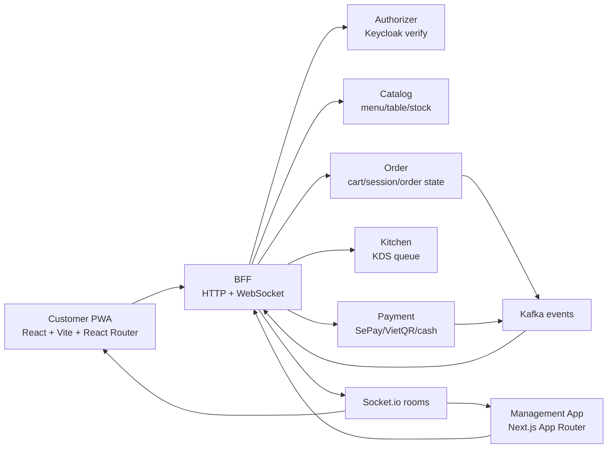
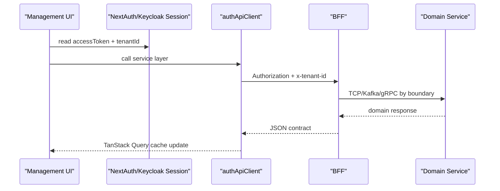
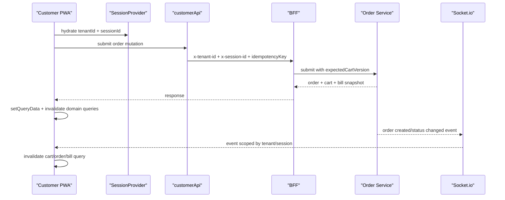

# React.js & Next.js — Tài Liệu Ôn Tập Thực Chiến Cho QRTable

> **Phạm vi:** Bao gồm toàn bộ kiến thức đủ để đọc hiểu và xây dựng frontend app thực tế —
> không đi vào edge case hiếm gặp hay tính năng experimental. Phù hợp cho developer đã biết
> React/Next.js phiên bản cũ và muốn cập nhật lên React 19 / Next.js App Router hiện đại.
>
> **Version theo project hiện tại:** Management App đang dùng React `19.2.4` + Next.js `16.1.7`;
> Customer PWA đang dùng React `19.2.4` + Vite. Tài liệu vẫn giữ phần Next.js 15 vì các
> breaking changes như async request APIs, App Router mental model và caching là nền tảng để
> hiểu code Next.js 16 trong dự án.
>
> **Mục tiêu cá nhân hóa:** Không chỉ nhớ API. Sau khi đọc, bạn phải trả lời được câu hỏi
> phỏng vấn kiểu: "Vì sao QRTable chọn Server Component ở đây?", "Realtime data được sync thế
> nào?", "Tenant isolation đi qua frontend ra sao?", "Khi nào dùng TanStack Query thay vì
> Server Action?".

---

## Mục Lục

**Phần 0 — QRTable Lens: Đọc React/Next.js Theo Dự Án**

- [0. Frontend Map Của QRTable](#0-frontend-map-của-qrtable)
- [0.1. Cách Trả Lời Phỏng Vấn](#01-cách-trả-lời-phỏng-vấn)
- [0.2. Rule Of Thumb Trong QRTable](#02-rule-of-thumb-trong-qrtable)

**Phần 1 — React Core: Hooks và Patterns**

1. [Component Model và JSX](#1-component-model-và-jsx)
2. [useState — Quản Lý State](#2-usestate--quản-lý-state)
3. [useEffect — Side Effects](#3-useeffect--side-effects)
4. [useReducer — State Phức Tạp](#4-usereducer--state-phức-tạp)
5. [useContext — Shared State](#5-usecontext--shared-state)
6. [useRef — DOM và Mutable Values](#6-useref--dom-và-mutable-values)
7. [useMemo, useCallback, React.memo — Performance](#7-usememo-usecallback-reactmemo--performance)
8. [Suspense và lazy — Code Splitting](#8-suspense-và-lazy--code-splitting)
9. [Error Boundaries](#9-error-boundaries)
10. [Custom Hooks — Tái Sử Dụng Logic](#10-custom-hooks--tái-sử-dụng-logic)

**Phần 2 — React 18: Concurrent Features** 11. [createRoot](#11-createroot) 12. [Automatic Batching](#12-automatic-batching) 13. [useTransition và startTransition](#13-usetransition-và-starttransition) 14. [useDeferredValue](#14-usedeferredvalue)

**Phần 3 — React 19: Tính Năng Mới** 15. [Actions — Async Transitions](#15-actions--async-transitions) 16. [useActionState](#16-useactionstate) 17. [useFormStatus](#17-useformstatus) 18. [useOptimistic](#18-useoptimistic) 19. [ref Như Prop Thường](#19-ref-như-prop-thường) 20. [React Server Components — Khái Niệm Nền Tảng](#20-react-server-components--khái-niệm-nền-tảng)

**Phần 4 — Next.js Pages Router (Legacy)** 21. [File Routing và Data Fetching Cũ](#21-file-routing-và-data-fetching-cũ)

**Phần 5 — Next.js App Router** 22. [Cấu Trúc Thư Mục](#22-cấu-trúc-thư-mục) 23. [Server Components vs Client Components](#23-server-components-vs-client-components) 24. [File Conventions: layout, page, loading, error, not-found](#24-file-conventions) 25. [Data Fetching Trong App Router](#25-data-fetching-trong-app-router) 26. [Caching — Hiểu Đúng Để Không Bị Bẫy](#26-caching--hiểu-đúng-để-không-bị-bẫy) 27. [Server Actions](#27-server-actions) 28. [Dynamic Routes và Route Handlers](#28-dynamic-routes-và-route-handlers) 29. [Metadata API](#29-metadata-api) 30. [next/image, next/link, next/navigation](#30-nextimage-nextlink-nextnavigation)

**Phần 6 — Rendering Strategies** 31. [SSG, SSR, ISR — Khi Nào Dùng Cái Nào](#31-ssg-ssr-isr--khi-nào-dùng-cái-nào)

**Phần 7 — Next.js 15: Thay Đổi Cần Biết** 32. [Breaking Changes Trong Next.js 15](#32-breaking-changes-trong-nextjs-15)

**Phần 8 — Ecosystem Thực Tế** 33. [TanStack Query](#33-tanstack-query) 34. [Zustand](#34-zustand) 35. [React Hook Form + Zod](#35-react-hook-form--zod)

**Phần 9 — QRTable Applied Playbook** 36. [Frontend Architecture Của QRTable](#36-frontend-architecture-của-qrtable) 37. [Data Flow: BFF, Tenant, Query Cache, Realtime](#37-data-flow-bff-tenant-query-cache-realtime) 38. [Interview Answer Bank](#38-interview-answer-bank)

---

# Phần 0 — QRTable Lens: Đọc React/Next.js Theo Dự Án

## 0. Frontend Map Của QRTable

QRTable không phải một app frontend đơn lẻ. Nó có hai bề mặt người dùng chính, mỗi bề mặt có runtime và trade-off khác nhau:

| App                   | Runtime                   | Người dùng                            | Vai trò trong hệ thống                                             | Stack thực tế                                                                                    |
| --------------------- | ------------------------- | ------------------------------------- | ------------------------------------------------------------------ | ------------------------------------------------------------------------------------------------ |
| `apps/management-app` | Next.js App Router        | owner, manager, staff, admin, kitchen | quản trị tenant, menu, tables, POS, KDS, payment settings          | React 19, Next.js 16, NextAuth v5, Keycloak, TanStack Query, Zustand, Socket.io, shadcn/Tailwind |
| `apps/customer-pwa`   | Vite SPA/PWA              | customer quét QR tại bàn              | join session, xem menu, cart, submit order, tracking, request bill | React 19, React Router, TanStack Query, Context session, Socket.io, localStorage                 |
| `libs/frontend/ui`    | shared UI lib             | cả hai app                            | button, dialog, sheet, table primitives                            | shadcn-style components                                                                          |
| `libs/shared/types`   | shared contract           | FE + BE                               | Order, Session, Menu, Bill, realtime event types                   | import hiện tại qua `@einvoice/types`                                                            |
| `libs/frontend/utils` | shared frontend utilities | cả hai app                            | `apiClient`, `formatCurrency`, `cn`, error helpers                 | import hiện tại qua `@einvoice/frontend-utils`                                                   |

> **Ghi chú repo hiện tại:** AGENTS.md mô tả namespace mục tiêu là `@qrtable/*`, nhưng code frontend hiện vẫn dùng alias `@einvoice/*` trong `tsconfig.base.json`. Khi trả lời phỏng vấn, nói theo domain là "shared frontend/types libs"; khi viết code trong repo hiện tại thì follow alias đang tồn tại, trừ khi team quyết định migrate alias.

### Observed In Project

| Pattern          | Đã thấy trong codebase                                                                  | Ý nghĩa                                                                                              |
| ---------------- | --------------------------------------------------------------------------------------- | ---------------------------------------------------------------------------------------------------- |
| Auth staff       | `apps/management-app/src/auth.ts` dùng NextAuth + Keycloak, JWT strategy, refresh token | frontend không tự quyết quyền; nó lấy identity/roles/tenant từ Authorizer/Keycloak rồi gửi xuống BFF |
| Tenant header    | `authApiClient` inject `Authorization` và `x-tenant-id`                                 | mọi request quản trị đi qua tenant boundary                                                          |
| Customer session | `SessionProvider` hydrate từ `localStorage`, set `x-session-id` trong `customerApi`     | customer không login Keycloak; session bàn ăn là identity tạm thời                                   |
| Server state     | `useOrdersQuery`, `useCustomerCartQuery`, `useCurrentBillQuery` dùng TanStack Query     | dữ liệu backend không nên nhét vào Zustand/Context                                                   |
| Realtime         | `useStaffOrderRealtime`, `useCustomerOrderRealtime`, `useKdsRealtime` dùng Socket.io    | event chỉ báo "data changed", UI invalidate/refetch query để lấy state chuẩn                         |
| Optimistic cart  | Customer PWA patch cart cache trước, rollback khi conflict                              | UX nhanh nhưng server vẫn là source of truth                                                         |
| Idempotency      | submit order tạo idempotency key                                                        | tránh double-submit khi mạng chậm hoặc user bấm lại                                                  |

### Mental Model Cốt Lõi

Trong QRTable, React/Next.js không chỉ để render UI. Nó là lớp điều phối giữa:

1. **Identity:** staff dùng Keycloak JWT; customer dùng session từ QR.
2. **Tenant isolation:** mọi request tenant-scoped phải mang `tenantId`/`x-tenant-id`.
3. **Server state:** dữ liệu menu/order/bill/table đến từ BFF và được cache bằng TanStack Query.
4. **Realtime consistency:** Socket.io event làm cache invalidation, không thay thế API contract.
5. **Local UI state:** filter, selected row, dialog open state có thể dùng component state hoặc Zustand.

Nếu phỏng vấn hỏi "frontend QRTable có khó ở đâu?", câu trả lời tốt là:

> "Điểm khó không nằm ở render component, mà ở consistency. POS/KDS/customer cùng nhìn một order lifecycle. Frontend phải tách server state khỏi UI state, scope cache theo tenant/session, dùng realtime để invalidate đúng query, và vẫn giữ optimistic UI/idempotency để trải nghiệm đặt món không bị chậm."

## 0.1. Cách Trả Lời Phỏng Vấn

Mỗi chủ đề trong tài liệu này nên được trả lời theo công thức 4 lớp:

1. **Định nghĩa:** khái niệm đó là gì.
2. **Vấn đề nó giải quyết:** vì sao React/Next.js cần nó.
3. **Trade-off:** khi nào không nên dùng.
4. **QRTable application:** dự án mình dùng hoặc nên dùng ở đâu.

Ví dụ với Server Components:

> "Server Component là component render trên server và không gửi JavaScript của component đó xuống client. Nó phù hợp với UI đọc dữ liệu hoặc shell/layout không cần interaction. Trong QRTable Management App, các route như dashboard shell, landing, billing detail có thể tận dụng Server Component để fetch data gần backend và giảm bundle. Nhưng POS live screen, KDS board, cart drawer vẫn cần Client Component vì có realtime, state, event handlers và mutation."

Ví dụ với TanStack Query:

> "TanStack Query quản lý server state: cache, loading/error, stale time, refetch, mutation, invalidation. Trong QRTable, order/cart/bill/table là server state vì nhiều actor có thể thay đổi cùng lúc. Vì vậy websocket event không render trực tiếp vào UI; nó invalidate query để lấy state mới từ BFF, tránh lệch contract và tránh xử lý business state ở client."

## 0.2. Rule Of Thumb Trong QRTable

| Câu hỏi thiết kế                                      | Chọn cái gì                                         | Lý do                                               |
| ----------------------------------------------------- | --------------------------------------------------- | --------------------------------------------------- |
| Data đọc một lần, SEO/landing hoặc dashboard summary? | Server Component + `fetch`/server helper            | giảm client JS, render sớm                          |
| Data thay đổi liên tục theo user action/realtime?     | TanStack Query trong Client Component               | cache/invalidation/polling/retry tốt hơn            |
| State chỉ là modal/filter/selected row?               | local state hoặc Zustand                            | không đưa UI state vào server cache                 |
| Form CRUD admin/menu/table?                           | React Hook Form + Zod                               | validation type-safe, ít re-render                  |
| Submit order/payment/bill?                            | mutation + idempotency key                          | chống double-submit/external side effect            |
| Realtime event tới client?                            | check tenant/session rồi invalidate query           | server vẫn là source of truth                       |
| Cần giữ session customer sau reload?                  | Context + localStorage hydrate                      | customer không có account, session gắn với QR/table |
| Cần tenant isolation?                                 | header `x-tenant-id` + shared types + backend guard | frontend hỗ trợ boundary, backend enforce boundary  |

# Phần 1 — React Core: Hooks và Patterns

## 1. Component Model và JSX

React xây dựng UI từ **components** — hàm JavaScript nhận props và trả về JSX. JSX là cú pháp giống HTML được transpile sang `React.createElement()`.

```tsx
function UserCard({ name, email }: { name: string; email: string }) {
  const isActive = true;

  return (
    // Phải có một root element — Fragment <> để tránh thêm div thừa
    <>
      <h2>{name}</h2>
      <p>{email}</p>
      {/* Conditional rendering */}
      {isActive && <span className="badge">Active</span>}
      {isActive ? <span>Online</span> : <span>Offline</span>}
    </>
  );
}
```

**Quy tắc JSX cần nhớ:**

| HTML                | JSX tương đương            | Lý do                          |
| ------------------- | -------------------------- | ------------------------------ |
| `class="..."`       | `className="..."`          | `class` là reserved keyword JS |
| `for="..."`         | `htmlFor="..."`            | `for` là reserved keyword JS   |
| `<br>`              | `<br />`                   | Self-closing bắt buộc có `/`   |
| `<!-- comment -->`  | `{/* comment */}`          | Comment trong JSX              |
| `style="color:red"` | `style={{ color: 'red' }}` | Object, camelCase properties   |

**Render danh sách — luôn cần `key`:**

```tsx
function ProductList({ products }: { products: Product[] }) {
  return (
    <ul>
      {products.map((product) => (
        // key phải unique trong danh sách, dùng ID thực — không dùng index nếu list có thể reorder
        <li key={product.id}>{product.name}</li>
      ))}
    </ul>
  );
}
```

---

## 2. useState — Quản Lý State

State là dữ liệu nội bộ của component. Khi state thay đổi, React re-render component đó và tất cả con của nó.

```tsx
import { useState } from 'react';

function Counter() {
  const [count, setCount] = useState<number>(0);

  // Functional update — LUÔN dùng khi giá trị mới phụ thuộc vào giá trị cũ
  const increment = () => setCount((prev) => prev + 1);

  return (
    <div>
      <p>Count: {count}</p>
      <button onClick={increment}>+</button>
    </div>
  );
}
```

### State Là Snapshot — Điều Quan Trọng Cần Hiểu

React không cập nhật state ngay lập tức — nó lên lịch re-render. Trong một event handler, `count` luôn là giá trị tại thời điểm render hiện tại:

```tsx
// ❌ Chỉ tăng 1 dù gọi 3 lần — cả 3 đều thấy count = 0 (snapshot)
const handleBad = () => {
  setCount(count + 1); // 0 + 1 = 1
  setCount(count + 1); // 0 + 1 = 1 (vẫn là 0!)
  setCount(count + 1); // 0 + 1 = 1
};

// ✅ Tăng 3 — functional update nhận state mới nhất
const handleGood = () => {
  setCount((prev) => prev + 1); // 0 → 1
  setCount((prev) => prev + 1); // 1 → 2
  setCount((prev) => prev + 1); // 2 → 3
};
```

### Update Object và Array — Không Mutate Trực Tiếp

```tsx
function Form() {
  const [user, setUser] = useState({ name: '', email: '' });
  const [tags, setTags] = useState<string[]>([]);

  // ✅ Object — spread để tạo object mới
  const updateName = (name: string) => setUser((prev) => ({ ...prev, name }));

  // ❌ KHÔNG làm thế này — mutate trực tiếp, React không detect thay đổi
  const badUpdate = () => {
    user.name = 'John'; // mutate!
    setUser(user); // cùng reference → React bỏ qua
  };

  // ✅ Array — không dùng push/splice/sort trực tiếp
  const addTag = (tag: string) => setTags((prev) => [...prev, tag]);
  const removeTag = (id: number) => setTags((prev) => prev.filter((_, i) => i !== id));
  const updateTag = (i: number, val: string) => setTags((prev) => prev.map((t, idx) => (idx === i ? val : t)));
}
```

---

## 3. useEffect — Side Effects

`useEffect` dùng cho những thứ xảy ra ngoài render: fetch data, subscribe event, timer, thao tác DOM.

```tsx
useEffect(
  () => {
    // Side effect
    return () => {
      /* cleanup */
    };
  },
  [
    /* dependencies */
  ],
);
```

| Dependency Array | Effect chạy khi nào                   |
| ---------------- | ------------------------------------- |
| Không truyền     | Sau mỗi lần render                    |
| `[]`             | Chỉ một lần sau mount                 |
| `[a, b]`         | Sau mount + mỗi khi a hoặc b thay đổi |

### Fetch Data — Pattern Đúng

```tsx
function UserProfile({ userId }: { userId: string }) {
  const [user, setUser] = useState<User | null>(null);
  const [loading, setLoading] = useState(true);

  useEffect(() => {
    let cancelled = false; // tránh race condition khi userId đổi nhanh

    setLoading(true);
    fetchUser(userId).then((data) => {
      if (!cancelled) {
        setUser(data);
        setLoading(false);
      }
    });

    return () => {
      cancelled = true;
    }; // cleanup
  }, [userId]); // chạy lại khi userId đổi

  if (loading) return <Spinner />;
  return <div>{user?.name}</div>;
}
```

> **Lưu ý thực tế:** Trong Next.js App Router và dự án có TanStack Query, rất ít khi cần tự viết fetch trong useEffect. Dùng Server Components hoặc TanStack Query thay thế khi có thể.

### QRTable Lens — useEffect Dùng Cho Boundary Với Thế Giới Bên Ngoài

Trong QRTable, `useEffect` nên được hiểu là "đồng bộ React với hệ thống bên ngoài", không phải "nơi fetch data mặc định".

Các case hợp lý trong codebase:

- `useStaffOrderRealtime()` mở Socket.io connection, đăng ký event, cleanup bằng `socket.off()` và `socket.disconnect()`.
- `useCustomerOrderRealtime()` lắng nghe `online`, `focus`, `visibilitychange` để invalidate cache khi customer quay lại tab.
- `SessionProvider` hydrate customer session từ `localStorage` sau khi app mount.
- KDS/POS timer dùng external clock hoặc browser APIs.

Khi phỏng vấn, nói ngắn gọn:

> "`useEffect` chạy sau render, nên tôi dùng nó cho side effects như subscription, browser APIs, localStorage hydration hoặc socket lifecycle. Với server state của QRTable như orders/cart/bill, tôi ưu tiên TanStack Query hoặc Server Components vì chúng có cache, invalidation, retry và loading/error state rõ ràng hơn tự fetch trong effect."

### Cleanup — Quan Trọng Nhưng Hay Bị Bỏ Qua

```tsx
useEffect(() => {
  const handler = (e: KeyboardEvent) => {
    if (e.key === 'Escape') closeModal();
  };
  window.addEventListener('keydown', handler);

  return () => window.removeEventListener('keydown', handler); // ← phải cleanup!
}, []);
```

### Hai Anti-Pattern Phổ Biến Nhất

```tsx
// ❌ Anti-pattern 1: dùng effect để tính derived state
useEffect(() => {
  setFullName(`${firstName} ${lastName}`); // không cần effect!
}, [firstName, lastName]);

// ✅ Tính trực tiếp trong render
const fullName = `${firstName} ${lastName}`;

// ❌ Anti-pattern 2: effect để filter/transform data
useEffect(() => {
  setFiltered(items.filter((item) => item.active)); // không cần!
}, [items]);

// ✅ Tính trực tiếp (dùng useMemo nếu heavy)
const filtered = items.filter((item) => item.active);
```

---

## 4. useReducer — State Phức Tạp

Khi state có nhiều fields liên quan hoặc logic update phức tạp, `useReducer` tổ chức code tốt hơn nhiều `useState`:

```tsx
type State = { items: CartItem[]; total: number };
type Action = { type: 'ADD'; payload: CartItem } | { type: 'REMOVE'; payload: string } | { type: 'CLEAR' };

function reducer(state: State, action: Action): State {
  switch (action.type) {
    case 'ADD':
      return {
        items: [...state.items, action.payload],
        total: state.total + action.payload.price,
      };
    case 'REMOVE': {
      const item = state.items.find((i) => i.id === action.payload);
      return {
        items: state.items.filter((i) => i.id !== action.payload),
        total: state.total - (item?.price ?? 0),
      };
    }
    case 'CLEAR':
      return { items: [], total: 0 };
    default:
      return state;
  }
}

function Cart() {
  const [state, dispatch] = useReducer(reducer, { items: [], total: 0 });

  return (
    <div>
      <p>Total: {state.total}</p>
      <button onClick={() => dispatch({ type: 'CLEAR' })}>Clear</button>
    </div>
  );
}
```

**Khi nào dùng `useReducer` thay `useState`:** state có 3+ fields liên quan, nhiều cách update khác nhau, hoặc muốn tách logic ra khỏi component để test.

---

## 5. useContext — Shared State

Context cho phép truyền dữ liệu xuống cây component mà không cần props drilling.

```tsx
// 1. Tạo context
interface ThemeContextValue {
  theme: 'light' | 'dark';
  toggleTheme: () => void;
}
const ThemeContext = createContext<ThemeContextValue | null>(null);

// 2. Provider
function ThemeProvider({ children }: { children: React.ReactNode }) {
  const [theme, setTheme] = useState<'light' | 'dark'>('light');
  const toggleTheme = () => setTheme((prev) => (prev === 'light' ? 'dark' : 'light'));

  return <ThemeContext.Provider value={{ theme, toggleTheme }}>{children}</ThemeContext.Provider>;
}

// 3. Custom hook để dùng — bắt null error sớm
function useTheme() {
  const ctx = useContext(ThemeContext);
  if (!ctx) throw new Error('useTheme must be inside ThemeProvider');
  return ctx;
}

// 4. Dùng ở bất kỳ component con nào
function ThemeToggle() {
  const { theme, toggleTheme } = useTheme();
  return <button onClick={toggleTheme}>Current: {theme}</button>;
}
```

**Giới hạn của Context:** Khi Provider value thay đổi, **mọi consumer đều re-render**, dù chúng không dùng phần thay đổi. Context phù hợp cho data ít thay đổi (theme, user, locale). Với state thay đổi thường xuyên → dùng Zustand.

---

## 6. useRef — DOM và Mutable Values

`useRef` có hai mục đích khác nhau, cần phân biệt rõ:

```tsx
function SearchInput() {
  // Mục đích 1: Truy cập DOM element
  const inputRef = useRef<HTMLInputElement>(null);
  const focusInput = () => inputRef.current?.focus();

  // Mục đích 2: Lưu giá trị mutable không trigger re-render
  // Khác useState ở chỗ: thay đổi ref.current KHÔNG gây re-render
  const timerRef = useRef<NodeJS.Timeout | null>(null);
  const previousValueRef = useRef<string>('');

  useEffect(() => {
    timerRef.current = setInterval(() => {
      // polling logic
    }, 5000);
    return () => {
      if (timerRef.current) clearInterval(timerRef.current);
    };
  }, []);

  return <input ref={inputRef} type="text" />;
}
```

**Khi nào dùng ref thay state:** giá trị cần lưu giữa renders nhưng thay đổi nó không cần UI update — ví dụ: timer ID, previous value, scroll position, flag đã mounted chưa.

---

## 7. useMemo, useCallback, React.memo — Performance

### React.memo — Skip Re-render Khi Props Không Đổi

```tsx
// Không có memo: re-render mỗi khi parent re-render dù props giống nhau
// Có memo: chỉ re-render khi props thực sự đổi (shallow comparison)
const ProductCard = React.memo(function ProductCard({ product }: { product: Product }) {
  return (
    <div>
      <h3>{product.name}</h3>
      <p>{product.price}</p>
    </div>
  );
});
```

### useMemo — Cache Kết Quả Tính Toán Nặng

```tsx
function ProductList({ products, searchTerm }: Props) {
  // Chỉ tính lại khi products hoặc searchTerm thay đổi
  const filtered = useMemo(
    () => products.filter((p) => p.name.toLowerCase().includes(searchTerm.toLowerCase())),
    [products, searchTerm],
  );

  return (
    <ul>
      {filtered.map((p) => (
        <li key={p.id}>{p.name}</li>
      ))}
    </ul>
  );
}
```

### useCallback — Cache Function Reference

Cần thiết khi truyền function xuống component đã `memo` — function mới mỗi render sẽ phá vỡ memo:

```tsx
function Parent() {
  const [count, setCount] = useState(0);

  // ❌ Không có useCallback: handleDelete là function MỚI mỗi render
  //    → ChildList.memo vô tác dụng vì props luôn "thay đổi"
  const handleDelete = (id: string) => deleteItem(id);

  // ✅ Có useCallback: cùng reference nếu dependency không đổi
  const handleDelete = useCallback((id: string) => {
    deleteItem(id);
  }, []); // dependency rỗng: hàm không thay đổi

  return (
    <>
      <p>Count: {count}</p>
      <button onClick={() => setCount((c) => c + 1)}>+</button>
      {/* ChildList chỉ re-render khi handleDelete thực sự đổi */}
      <ChildList onDelete={handleDelete} />
    </>
  );
}

const ChildList = React.memo(function ChildList({ onDelete }: { onDelete: (id: string) => void }) {
  // ...
});
```

**Khi nào nên dùng các optimization này:**

- `React.memo`: component render chậm và parent re-render thường xuyên.
- `useMemo`: tính toán thực sự nặng (filter/sort danh sách lớn, regex complex).
- `useCallback`: function truyền xuống component đã memo.

Không nên bọc `memo`/`useMemo`/`useCallback` vào tất cả mọi thứ — có overhead riêng.

### QRTable Lens — Performance Không Phải Bọc Memo Đại Trà

Trong QRTable, performance issue thường đến từ **danh sách thay đổi liên tục** và **màn hình vận hành lâu dài**:

- POS live orders table có thể nhiều order/items, kết hợp filter/sort/table calculation.
- KDS board cập nhật theo realtime, cần tránh re-render toàn board khi một ticket đổi trạng thái.
- Customer menu/cart cần cảm giác phản hồi nhanh khi add item.

Rule thực tế:

| Tình huống                             | Cách xử lý                                                              |
| -------------------------------------- | ----------------------------------------------------------------------- |
| List lớn, row nhiều                    | dùng virtualization (`@tanstack/react-virtual`) trước khi nghĩ đến memo |
| Tính toán derived data từ query result | `useMemo` nếu sort/filter/group nặng                                    |
| Function truyền vào child đã memo      | `useCallback` để ổn định reference                                      |
| Server state thay đổi                  | invalidate query đúng scope thay vì set nhiều state rời rạc             |
| Component chậm do bundle lớn           | code splitting/lazy hoặc tách Client Component nhỏ hơn                  |

Khi phỏng vấn:

> "Tôi không xem `useMemo` là default. Tôi đo hoặc nhìn pattern render trước: nếu list lớn thì virtualization có tác động lớn hơn; nếu derived data nặng thì memoize; nếu child đã memo thì ổn định callback. Với QRTable, màn POS/KDS quan trọng hơn landing vì nó chạy nhiều giờ và nhận realtime events."

---

## 8. Suspense và lazy — Code Splitting

```tsx
import { lazy, Suspense } from 'react';

// lazy() chỉ download JS khi component cần render lần đầu
const HeavyDashboard = lazy(() => import('./HeavyDashboard'));
const AdminPanel = lazy(() => import('./AdminPanel'));

function App() {
  const [showDashboard, setShowDashboard] = useState(false);

  return (
    <div>
      <button onClick={() => setShowDashboard(true)}>Open Dashboard</button>

      {showDashboard && (
        // Suspense hiển thị fallback trong khi lazy component đang tải
        <Suspense fallback={<div>Loading...</div>}>
          <HeavyDashboard />
        </Suspense>
      )}
    </div>
  );
}
```

**Suspense và Data Fetching (React 18+):** Suspense cũng hoạt động với data fetching qua TanStack Query (suspense mode) hoặc Server Components trong Next.js. Xem thêm ở Section 25.

---

## 9. Error Boundaries

Error Boundary bắt JavaScript error trong cây component con và hiển thị fallback UI thay vì crash toàn app. Dùng thư viện `react-error-boundary` thay vì tự viết class component:

```tsx
import { ErrorBoundary } from 'react-error-boundary';

function ErrorFallback({ error, resetErrorBoundary }: { error: Error; resetErrorBoundary: () => void }) {
  return (
    <div>
      <p>Đã xảy ra lỗi: {error.message}</p>
      <button onClick={resetErrorBoundary}>Thử lại</button>
    </div>
  );
}

function App() {
  return (
    <ErrorBoundary FallbackComponent={ErrorFallback}>
      <RiskyComponent />
    </ErrorBoundary>
  );
}
```

**Error Boundary không bắt được:** async errors trong event handlers, lỗi trong setTimeout/Promise, server errors. Chỉ bắt lỗi trong render và lifecycle.

---

## 10. Custom Hooks — Tái Sử Dụng Logic

Custom hook là hàm bắt đầu bằng `use`, có thể gọi các hook khác bên trong. Đây là cách tách logic ra khỏi UI để tái sử dụng:

```tsx
// Tái sử dụng logic fetch thay vì viết lại trong mỗi component
function useAsync<T>(asyncFn: () => Promise<T>, deps: unknown[]) {
  const [data, setData] = useState<T | null>(null);
  const [loading, setLoading] = useState(true);
  const [error, setError] = useState<Error | null>(null);

  useEffect(() => {
    let cancelled = false;
    setLoading(true);
    asyncFn()
      .then((result) => {
        if (!cancelled) setData(result);
      })
      .catch((err) => {
        if (!cancelled) setError(err);
      })
      .finally(() => {
        if (!cancelled) setLoading(false);
      });
    return () => {
      cancelled = true;
    };
    // eslint-disable-next-line react-hooks/exhaustive-deps
  }, deps);

  return { data, loading, error };
}

// Dùng lại ở bất kỳ component nào
function UserProfile({ id }: { id: string }) {
  const { data: user, loading, error } = useAsync(() => fetchUser(id), [id]);
  if (loading) return <Spinner />;
  if (error) return <p>Error: {error.message}</p>;
  return <div>{user?.name}</div>;
}
```

**Các loại custom hook hay gặp trong codebase:**

- `useDebounce` — delay update value
- `useLocalStorage` — sync state với localStorage
- `useClickOutside` — detect click ngoài element
- `useWindowSize` — track kích thước window
- `usePrevious` — lưu giá trị trước của state/prop

### QRTable Lens — Custom Hook Là Biên Giới Domain

Trong QRTable, custom hook không chỉ để "tái sử dụng code". Nó là cách đặt tên cho một **frontend use case**:

| Hook pattern      | Ví dụ trong QRTable                                                   | Nó che giấu complexity nào                             |
| ----------------- | --------------------------------------------------------------------- | ------------------------------------------------------ |
| Query hook        | `useOrdersQuery`, `useCustomerCartQuery`, `useCurrentBillQuery`       | query key, enabled state, polling, BFF service         |
| Mutation hook     | `useSubmitOrderMutation`, `useTransferTableMutation`                  | idempotency, expected version, invalidation, toast     |
| Realtime hook     | `useStaffOrderRealtime`, `useCustomerOrderRealtime`, `useKdsRealtime` | Socket.io lifecycle, tenant/session filtering, cleanup |
| Session/auth hook | `useAuthReadyForBff`, `useSession`                                    | hydration, token/session readiness                     |
| UI state hook     | `useOrderUiState`                                                     | selected order/filter/dialog state                     |

Interview framing:

> "Tôi dùng custom hooks để component nói bằng ngôn ngữ sản phẩm. Component không cần biết socket event nào phải invalidate query nào; nó chỉ gọi `useStaffOrderRealtime()`. Điều này giúp tách UI rendering khỏi orchestration logic và dễ test từng hook bằng renderHook."

---

# Phần 2 — React 18: Concurrent Features

## 11. createRoot

React 18 thay `ReactDOM.render` bằng `createRoot` để bật Concurrent Mode:

```tsx
// ❌ React 17 — legacy, không nên dùng nữa
import ReactDOM from 'react-dom';
ReactDOM.render(<App />, document.getElementById('root'));

// ✅ React 18+
import { createRoot } from 'react-dom/client';
const root = createRoot(document.getElementById('root')!);
root.render(<App />);
```

Concurrent Mode là nền tảng cho tất cả tính năng React 18+ (Transitions, Suspense streaming, v.v.). Các framework như Next.js tự động dùng `createRoot`.

---

## 12. Automatic Batching

**React 17 và cũ:** Chỉ batch state updates trong React event handlers. Trong `setTimeout`, `Promise.then`, native events — mỗi `setState` là một re-render riêng.

**React 18:** Tất cả updates đều được batch tự động — dù trong timeout, promise hay event handler:

```tsx
// React 17: 2 re-render
setTimeout(() => {
  setCount((c) => c + 1); // re-render 1
  setName('John'); // re-render 2
});

// React 18: 1 re-render duy nhất
setTimeout(() => {
  setCount((c) => c + 1); // } batch lại
  setName('John'); // } → 1 re-render
});
```

Không cần làm gì để bật — tự động khi dùng `createRoot`.

---

## 13. useTransition và startTransition

Transitions cho phép đánh dấu một state update là "không khẩn cấp". React ưu tiên urgent updates (typing, click) trước, có thể interrupt transition nếu có update mới hơn:

```tsx
import { useTransition } from 'react';

function SearchPage() {
  const [query, setQuery] = useState('');
  const [results, setResults] = useState<Result[]>([]);
  const [isPending, startTransition] = useTransition();

  const handleChange = (e: React.ChangeEvent<HTMLInputElement>) => {
    // Urgent: update input ngay lập tức — UI không bị lag
    setQuery(e.target.value);

    // Non-urgent: tìm kiếm có thể delay
    startTransition(() => {
      const filtered = heavySearch(e.target.value);
      setResults(filtered);
    });
  };

  return (
    <>
      <input value={query} onChange={handleChange} />
      {isPending && <p>Searching...</p>}
      <ResultList results={results} />
    </>
  );
}
```

**React 19 mở rộng:** `startTransition` giờ chấp nhận `async` function (xem Section 15).

---

## 14. useDeferredValue

Tương tự concept với `useTransition` nhưng dùng cho **giá trị nhận từ props** — khi không control được setState:

```tsx
function SearchResults({ query }: { query: string }) {
  // deferredQuery lag sau query — giúp input không bị freeze
  const deferredQuery = useDeferredValue(query);

  // Chỉ tính lại khi deferredQuery đổi (không phải mỗi keystroke)
  const results = useMemo(() => heavySearch(deferredQuery), [deferredQuery]);

  // UI mờ khi đang hiển thị kết quả cũ
  const isStale = query !== deferredQuery;

  return (
    <div style={{ opacity: isStale ? 0.6 : 1 }}>
      <ResultList results={results} />
    </div>
  );
}
```

---

# Phần 3 — React 19: Tính Năng Mới

> React 19 stable từ **5/12/2024**. Đây là major release sau 2 năm kể từ React 18.

## 15. Actions — Async Transitions

**Trước React 19** — quản lý async form/action thủ công, nhiều boilerplate:

```tsx
// React 18 — phải tự quản lý 3 state riêng
function OldForm() {
  const [isPending, setIsPending] = useState(false);
  const [error, setError] = useState<string | null>(null);
  const [success, setSuccess] = useState(false);

  const handleSubmit = async (e: React.FormEvent) => {
    e.preventDefault();
    setIsPending(true);
    setError(null);
    try {
      await submitData(formData);
      setSuccess(true);
    } catch (err) {
      setError(err.message);
    } finally {
      setIsPending(false);
    }
  };
}
```

**React 19 — Actions:** `startTransition` chấp nhận async function, pending state được quản lý tự động:

```tsx
// React 19 — gọn hơn nhiều
function NewForm() {
  const [error, setError] = useState<string | null>(null);
  const [isPending, startTransition] = useTransition();

  const handleSubmit = (e: React.FormEvent) => {
    e.preventDefault();
    startTransition(async () => {
      // ← async function trong transition
      try {
        await submitData(formData);
      } catch (err) {
        setError(err.message);
      }
    });
    // isPending tự động true khi async chạy, false khi xong
  };

  return (
    <form onSubmit={handleSubmit}>
      {error && <p className="error">{error}</p>}
      <button disabled={isPending}>{isPending ? 'Saving...' : 'Save'}</button>
    </form>
  );
}
```

---

## 16. useActionState

Hook mới trong React 19 kết hợp action + state management — đặc biệt phù hợp với form và Server Actions:

```tsx
import { useActionState } from 'react'; // từ 'react', không phải 'react-dom'

type FormState = { error: string | null; message: string | null };

// Action function nhận (previousState, formData) → trả về state mới
async function submitAction(prev: FormState, formData: FormData): Promise<FormState> {
  const name = formData.get('name') as string;
  if (!name.trim()) return { error: 'Name is required', message: null };

  try {
    await updateProfile({ name });
    return { error: null, message: 'Saved successfully!' };
  } catch {
    return { error: 'Failed to save', message: null };
  }
}

function ProfileForm() {
  const [state, formAction, isPending] = useActionState(submitAction, {
    error: null,
    message: null,
  });

  return (
    <form action={formAction}>
      {' '}
      {/* action truyền trực tiếp vào form */}
      <input name="name" disabled={isPending} />
      {state.error && <p className="error">{state.error}</p>}
      {state.message && <p className="success">{state.message}</p>}
      <button type="submit" disabled={isPending}>
        {isPending ? 'Saving...' : 'Save'}
      </button>
    </form>
  );
}
```

> **Lưu ý migration:** `useFormState` từ `react-dom` (React 18 với Next.js Server Actions) đã được thay thế bởi `useActionState` từ `react`. `useFormState` vẫn hoạt động nhưng deprecated.

---

## 17. useFormStatus

Cung cấp trạng thái của form đang bao quanh nó. Component dùng hook này **phải là con của form**:

```tsx
import { useFormStatus } from 'react-dom';

// ✅ Component con của form
function SubmitButton() {
  const { pending } = useFormStatus();
  return (
    <button type="submit" disabled={pending}>
      {pending ? 'Submitting...' : 'Submit'}
    </button>
  );
}

function MyForm() {
  return (
    <form action={serverAction}>
      <input name="email" type="email" />
      <SubmitButton /> {/* phải nằm TRONG form */}
    </form>
  );
}
```

Tại sao cần hook này? Vì `SubmitButton` là component tách riêng — nó không có quyền truy cập vào `isPending` của form cha nếu không qua props hoặc context. `useFormStatus` giải quyết vấn đề này gọn gàng hơn.

---

## 18. useOptimistic

Hiển thị UI optimistic ngay lập tức trong khi async action đang chạy, tự động rollback nếu thất bại:

```tsx
import { useOptimistic } from 'react';

function TodoList({ todos }: { todos: Todo[] }) {
  const [optimisticTodos, addOptimistic] = useOptimistic(
    todos,
    (state, newTodo: Todo) => [...state, newTodo], // updater function
  );

  async function addTodo(formData: FormData) {
    const text = formData.get('text') as string;
    const tempTodo = { id: 'temp', text, done: false };

    addOptimistic(tempTodo); // hiển thị ngay lập tức
    await saveTodo(text); // gọi server
    // sau khi server respond, todos thật từ server sẽ replace optimistic state
  }

  return (
    <>
      <ul>
        {optimisticTodos.map((todo) => (
          <li key={todo.id} style={{ opacity: todo.id === 'temp' ? 0.5 : 1 }}>
            {todo.text}
          </li>
        ))}
      </ul>
      <form action={addTodo}>
        <input name="text" />
        <button>Add</button>
      </form>
    </>
  );
}
```

### QRTable Lens — React 19 Actions Không Có Nghĩa Là Bỏ TanStack Query

React 19 làm form/action flow gọn hơn: `useActionState` quản lý state của action, `useFormStatus` đọc pending status từ form, `useOptimistic` cho optimistic UI, và `startTransition` hỗ trợ async action. Nhưng trong QRTable, chọn API này phải nhìn vào domain:

| React 19 feature        | Nên dùng trong QRTable khi                             | Cẩn thận                                                               |
| ----------------------- | ------------------------------------------------------ | ---------------------------------------------------------------------- |
| `useActionState`        | form mutation gần route/server action, return state rõ | không thay thế service layer nếu mutation cần BFF/realtime/query cache |
| `useFormStatus`         | submit button tách component con trong form            | chỉ hoạt động trong form boundary                                      |
| `useOptimistic`         | optimistic UI đơn giản, dễ rollback                    | order/payment cần idempotency và conflict strategy                     |
| async `startTransition` | non-urgent async UI update                             | không dùng để che giấu mutation error                                  |

Với Customer PWA cart, code hiện dùng TanStack Query `onMutate` để optimistic patch vì cart là server state có `cartVersion`. Đây là lựa chọn hợp lý hơn `useOptimistic` thuần React, vì cần rollback, conflict invalidation và cache sharing giữa nhiều component.

Interview answer:

> "React 19 Actions giúp form/action ít boilerplate hơn, nhưng QRTable vẫn phải chọn theo consistency model. Nếu mutation chỉ thuộc một form thì `useActionState` ổn. Nếu mutation ảnh hưởng server state được nhiều component dùng, như cart/order/bill, tôi ưu tiên TanStack Query mutation vì nó quản lý cache, rollback và invalidation tốt hơn."

---

## 19. ref Như Prop Thường

**React 18 và cũ** — cần `forwardRef` để truyền ref xuống component con:

```tsx
// React 18 — boilerplate
const Input = forwardRef<HTMLInputElement, InputProps>((props, ref) => <input ref={ref} {...props} />);
```

**React 19** — `ref` truyền như prop bình thường, không cần `forwardRef`:

```tsx
// ✅ React 19 — đơn giản hơn
function Input({ ref, ...props }: React.InputHTMLAttributes<HTMLInputElement> & { ref?: React.Ref<HTMLInputElement> }) {
  return <input ref={ref} {...props} />;
}

// Dùng bình thường
const inputRef = useRef<HTMLInputElement>(null);
<Input ref={inputRef} placeholder="Type here" />;
```

`forwardRef` vẫn hoạt động trong React 19 nhưng sẽ bị deprecated. Code mới nên dùng pattern mới.

---

## 20. React Server Components — Khái Niệm Nền Tảng

React Server Components (RSC) là concept render component hoàn toàn trên server — không gửi JavaScript về client. Từ React 19, RSC là stable trong React core (không chỉ qua Next.js).

**Hai loại component:**

|                       | Server Component | Client Component                      |
| --------------------- | ---------------- | ------------------------------------- |
| Render                | Trên server      | Server (initial) + Client (hydration) |
| JavaScript về browser | Không            | Có                                    |
| async/await           | Có thể           | Không                                 |
| useState, useEffect   | Không thể        | Có thể                                |
| Event handlers        | Không thể        | Có thể                                |
| Truy cập DB, file     | Có thể           | Không thể                             |

Chi tiết implementation trong Next.js App Router ở Section 23.

### QRTable Lens — Server Component Là Default, Client Component Là Ngoại Lệ Có Lý Do

Management App của QRTable dùng Next.js App Router, nên mental model đúng là:

- Route/page/layout mặc định nên là Server Component nếu chỉ đọc data, render shell, hoặc compose UI.
- Chỉ thêm `'use client'` ở component thật sự cần browser APIs, React state, event handlers, TanStack Query, NextAuth session provider, Socket.io hoặc form interaction.
- Không đẩy `'use client'` lên cả page chỉ vì một button nhỏ cần click. Tách button thành leaf Client Component.

Trong QRTable, các phần như POS live orders, KDS board, cart drawer, realtime status pill là Client Components vì chúng cần state/realtime/mutation. Các phần như landing section, static shell, metadata, hoặc server-side auth guard có thể ở Server Component/server layer để giảm bundle và tránh lộ logic server.

Interview answer:

> "Server Components giúp QRTable giảm JavaScript gửi xuống browser và giữ data fetching gần server hơn. Nhưng các màn vận hành như POS/KDS cần realtime và interaction nên phải là Client Component ở phần leaf. Tôi không chọn server hay client theo sở thích, mà theo boundary: có state/event/browser API thì client, còn render/read-only/composition thì server."

---

# Phần 4 — Next.js Pages Router (Legacy)

## 21. File Routing và Data Fetching Cũ

Pages Router vẫn được hỗ trợ đầy đủ trong Next.js 15. Cần biết để đọc code cũ.

### File-Based Routing

```
pages/
  index.tsx          → /
  about.tsx          → /about
  products/
    index.tsx        → /products
    [id].tsx         → /products/123   (dynamic)
  api/
    users.ts         → /api/users
```

### getStaticProps — Build Time (SSG)

```tsx
// pages/products/index.tsx
export async function getStaticProps() {
  const products = await fetchProducts();
  return {
    props: { products },
    revalidate: 60, // ISR: tái tạo sau 60s nếu có request
  };
}

export default function ProductsPage({ products }: { products: Product[] }) {
  return <ProductList products={products} />;
}
```

### getStaticPaths — Dynamic SSG

```tsx
// pages/products/[id].tsx
export async function getStaticPaths() {
  const ids = await fetchProductIds();
  return {
    paths: ids.map((id) => ({ params: { id } })),
    fallback: 'blocking', // 'blocking' | true | false
  };
}

export async function getStaticProps({ params }: { params: { id: string } }) {
  const product = await fetchProduct(params.id);
  if (!product) return { notFound: true };
  return { props: { product } };
}
```

### getServerSideProps — Per Request (SSR)

```tsx
// pages/dashboard.tsx
export async function getServerSideProps({ req, res }: GetServerSidePropsContext) {
  const token = req.cookies['token'];
  if (!token) return { redirect: { destination: '/login', permanent: false } };

  const user = await getUser(token);
  return { props: { user } };
}
```

### API Routes

```ts
// pages/api/products/[id].ts
import type { NextApiRequest, NextApiResponse } from 'next';

export default async function handler(req: NextApiRequest, res: NextApiResponse) {
  const { id } = req.query as { id: string };

  if (req.method === 'GET') {
    const product = await getProduct(id);
    if (!product) return res.status(404).json({ message: 'Not found' });
    return res.status(200).json(product);
  }

  res.setHeader('Allow', ['GET']);
  res.status(405).json({ message: 'Method Not Allowed' });
}
```

---

# Phần 5 — Next.js App Router

## 22. Cấu Trúc Thư Mục

App Router dùng thư mục `app/`. Mỗi **folder** là một route segment, mỗi **file** có vai trò cụ thể:

```
app/
  layout.tsx           → Root layout (bắt buộc, bao toàn bộ app)
  page.tsx             → Route /
  loading.tsx          → Loading UI cho /
  error.tsx            → Error UI cho /
  not-found.tsx        → 404 UI

  dashboard/
    layout.tsx         → Layout riêng cho /dashboard và các route con
    page.tsx           → Route /dashboard
    loading.tsx        → Loading UI riêng cho /dashboard

  products/
    page.tsx           → /products
    [id]/
      page.tsx         → /products/[id]   (dynamic route)

  api/
    products/
      route.ts         → /api/products   (Route Handler)
      [id]/
        route.ts       → /api/products/[id]
```

### QRTable Management App Structure

Trong project thực tế, `apps/management-app/src/app` đang dùng route groups để tách bề mặt nghiệp vụ:

| Route group              | Ví dụ route                                                 | Ý nghĩa                                     |
| ------------------------ | ----------------------------------------------------------- | ------------------------------------------- |
| `(auth)`                 | `/login`, `/auth/callback`                                  | login/callback flow với NextAuth + Keycloak |
| `(dashboard)`            | `/dashboard/menu`, `/dashboard/tables`, `/dashboard/orders` | owner/manager dashboard                     |
| `(pos)`                  | `/pos`, `/pos/tables`, `/pos/bills`, `/pos/payment`         | staff POS operations                        |
| `(kds)`                  | `/kds/kitchen`, `/kds/bar`                                  | kitchen display system                      |
| `(admin)`                | `/admin/tenants`, `/admin/plans`, `/admin/billing`          | SaaS admin surface                          |
| `api/auth/[...nextauth]` | NextAuth route handler                                      | auth endpoint nằm trong app router          |
| `api/internal/me`        | internal route                                              | đọc current user/profile từ server side     |

Điều này đáng nói khi phỏng vấn vì nó thể hiện App Router không chỉ là file routing, mà là cách encode domain boundaries vào folder structure.

---

## 23. Server Components vs Client Components

### Server Component — Mặc Định

Không cần khai báo gì — mọi file trong `app/` mặc định là Server Component:

```tsx
// app/products/page.tsx — Server Component
async function ProductsPage() {
  // Truy cập DB trực tiếp, không lộ về client
  const products = await db.select().from(productsTable);
  // Hoặc dùng fetch nội bộ
  const data = await fetch('http://internal-api/products').then((r) => r.json());

  return (
    <main>
      <h1>Products</h1>
      {products.map((p) => (
        <ProductCard key={p.id} product={p} />
      ))}
    </main>
  );
}
```

### Client Component — Thêm `'use client'`

Cần khi dùng hooks (`useState`, `useEffect`...) hoặc event handlers:

```tsx
// app/components/add-to-cart.tsx
'use client'; // ← directive này đánh dấu boundary

import { useState } from 'react';

function AddToCartButton({ productId }: { productId: string }) {
  const [added, setAdded] = useState(false);

  return (
    <button
      onClick={() => {
        addToCart(productId);
        setAdded(true);
      }}
    >
      {added ? '✓ Added' : 'Add to Cart'}
    </button>
  );
}
```

### Quy Tắc Quan Trọng Nhất: Push `'use client'` Xuống Sâu

```tsx
// ❌ Sai — bọc toàn bộ page trong 'use client' chỉ vì có một button cần state
'use client';
async function ProductPage() {
  const product = await fetchProduct(); // ← KHÔNG thể async trong Client Component!
}

// ✅ Đúng — Server Component làm phần nặng, Client Component chỉ phần cần interactivity
// app/products/[id]/page.tsx — Server Component
async function ProductPage({ params }: { params: Promise<{ id: string }> }) {
  const { id } = await params;
  const product = await fetchProduct(id); // chạy trên server

  return (
    <div>
      <h1>{product.name}</h1>
      <p>{product.description}</p>
      <AddToCartButton productId={id} /> {/* Client Component chỉ cho button */}
    </div>
  );
}
```

### Server Component Truyền Data Xuống Client Component

```tsx
// ✅ Server Component truyền serializable data qua props
async function Page() {
  const user = await getUser(); // fetch trên server

  return <UserForm initialName={user.name} />; // truyền data, không phải component
}

('use client');
function UserForm({ initialName }: { initialName: string }) {
  const [name, setName] = useState(initialName); // nhận data từ server
  return <input value={name} onChange={(e) => setName(e.target.value)} />;
}
```

---

## 24. File Conventions

### layout.tsx — Không Re-mount Khi Navigate

Layout **được giữ nguyên** khi navigate giữa các route con — state không bị reset:

```tsx
// app/layout.tsx — Root layout, bắt buộc, phải có <html> và <body>
export default function RootLayout({ children }: { children: React.ReactNode }) {
  return (
    <html lang="vi">
      <body>
        <Navbar />
        <main>{children}</main>
        <Footer />
      </body>
    </html>
  );
}

// app/dashboard/layout.tsx — Nested layout cho các route trong /dashboard
export default function DashboardLayout({ children }: { children: React.ReactNode }) {
  return (
    <div className="flex">
      <Sidebar />
      <div className="flex-1">{children}</div>
    </div>
  );
}
```

### loading.tsx — Streaming UI

`loading.tsx` tự động wrap page trong `<Suspense>`. Hiển thị ngay trong khi Server Component đang fetch:

```tsx
// app/products/loading.tsx
export default function Loading() {
  return <ProductGridSkeleton />;
}
```

### error.tsx — Error Boundary Tự Động

Phải là Client Component:

```tsx
// app/products/error.tsx
'use client';

export default function Error({ error, reset }: { error: Error; reset: () => void }) {
  return (
    <div>
      <h2>Something went wrong</h2>
      <p>{error.message}</p>
      <button onClick={reset}>Try again</button>
    </div>
  );
}
```

### not-found.tsx

```tsx
// app/not-found.tsx
export default function NotFound() {
  return <div>404 — Page not found</div>;
}

// Trigger bằng code
import { notFound } from 'next/navigation';

async function ProductPage({ params }: { params: Promise<{ id: string }> }) {
  const { id } = await params;
  const product = await getProduct(id);
  if (!product) notFound(); // render not-found.tsx gần nhất
  return <div>{product.name}</div>;
}
```

---

## 25. Data Fetching Trong App Router

### Fetch Trong Server Component — Cách Chính

```tsx
async function ProductsPage() {
  // Dynamic data: đọc mới theo request/user/tenant
  const products = await fetch('/api/products', { cache: 'no-store' }).then((r) => r.json());

  // Static/revalidated data: khai báo rõ thay vì dựa vào default theo version
  const cached = await fetch('/api/data', {
    cache: 'force-cache', // cache mãi mãi (SSG)
    // next: { revalidate: 3600 } // ISR — revalidate sau 1 giờ
    // next: { tags: ['products']} // tag-based invalidation
  }).then((r) => r.json());

  return <ProductList products={products} />;
}
```

> **QRTable rule:** Với Next.js 15/16, đừng trả lời phỏng vấn kiểu học thuộc "default cache là gì" rồi áp dụng máy móc. Trong SaaS multi-tenant, quan trọng hơn là khai báo rõ intent:
>
> - tenant/user-specific data: `cache: 'no-store'` hoặc route dynamic.
> - landing/public data ít đổi: `next: { revalidate: 300 }` hoặc `600` như landing code đang dùng.
> - static config/content: `force-cache` nếu an toàn.
> - mutation xong: invalidate bằng TanStack Query ở client hoặc `revalidatePath`/`revalidateTag` nếu dùng Server Actions/cache tags.

### Parallel Fetching — Tránh Waterfall

```tsx
async function DashboardPage() {
  // ❌ Sequential: 200ms + 300ms = 500ms tổng
  const user = await fetchUser();
  const orders = await fetchOrders();

  // ✅ Parallel: max(200ms, 300ms) = 300ms
  const [user, orders] = await Promise.all([fetchUser(), fetchOrders()]);

  return <Dashboard user={user} orders={orders} />;
}
```

### Streaming Với Suspense — Không Block Toàn Page

```tsx
// app/dashboard/page.tsx
import { Suspense } from 'react';

export default function DashboardPage() {
  return (
    <div>
      <h1>Dashboard</h1>
      {/* Render ngay, không đợi */}

      <Suspense fallback={<StatsSkeleton />}>
        <Stats /> {/* Slow — stream sau khi ready */}
      </Suspense>

      <Suspense fallback={<OrdersSkeleton />}>
        <RecentOrders /> {/* Cũng stream, độc lập với Stats */}
      </Suspense>
    </div>
  );
}

// Hai component async này chạy song song
async function Stats() {
  const data = await fetchStats(); // 2 giây
  return <StatsCard data={data} />;
}

async function RecentOrders() {
  const orders = await fetchOrders(); // 1 giây
  return <OrderList orders={orders} />;
}
```

---

## 26. Caching — Hiểu Đúng Để Không Bị Bẫy

Next.js có nhiều tầng caching. Điều quan trọng nhất cần nắm là **đừng trộn lẫn Data Cache, Full Route Cache, Router Cache và TanStack Query cache**. Chúng giải quyết các vấn đề khác nhau.

**Next.js 15 migration note:** Next.js 15 thay đổi nhiều default cache so với Next.js 14:

|                     | Next.js 14             | Next.js 15               |
| ------------------- | ---------------------- | ------------------------ |
| `fetch()` mặc định  | `force-cache` (cached) | `no-store` (không cache) |
| GET Route Handlers  | Cached                 | Không cache              |
| Client Router Cache | 30 giây                | 0 giây                   |

**QRTable project note:** Management App hiện dùng Next.js 16. Khi viết hoặc review code, ưu tiên explicit cache option thay vì dựa vào default của framework version. Đây là cách an toàn hơn vì QRTable có tenant-specific data, auth-specific data và realtime state.

| Cache layer          | Cache cái gì                      | QRTable nên dùng thế nào                                                                                |
| -------------------- | --------------------------------- | ------------------------------------------------------------------------------------------------------- |
| Next Data Cache      | kết quả `fetch` server-side       | public landing/menu preview có thể revalidate; tenant dashboard/live POS nên no-store hoặc client query |
| Full Route Cache     | HTML/RSC payload của route static | tốt cho landing/static pages, không phù hợp route phụ thuộc user session                                |
| Router Cache         | client navigation cache           | hữu ích cho UX, nhưng không thay thế query invalidation                                                 |
| TanStack Query cache | server state ở client             | order/cart/bill/table realtime data                                                                     |
| Browser/localStorage | session/customer prefs            | chỉ lưu identity tạm/session/prefs, không lưu source of truth của order                                 |

Interview answer:

> "Trong QRTable, caching không chỉ là tối ưu performance mà còn là correctness. Dữ liệu tenant/order/payment có thể thay đổi bởi staff, kitchen, customer và webhook, nên tôi không cache bừa ở route level. Tôi dùng explicit cache strategy: public read-mostly data có thể revalidate, còn operational state dùng TanStack Query với query key scoped theo tenant/session và invalidate theo realtime events."

### On-Demand Revalidation — Invalidate Khi Data Thay Đổi

```tsx
// app/actions/product.ts
'use server';
import { revalidateTag, revalidatePath } from 'next/cache';

export async function updateProduct(id: string, data: ProductData) {
  await db.update(products).set(data).where(eq(products.id, id));

  revalidateTag('products'); // invalidate tất cả fetch có tag 'products'
  revalidatePath('/products'); // invalidate HTML của route /products
  revalidatePath(`/products/${id}`); // invalidate route cụ thể
}

// Dùng tag khi fetch
const products = await fetch('/api/products', {
  next: { tags: ['products'] },
}).then((r) => r.json());
```

### Server Action vs TanStack Query Trong QRTable

Server Actions rất hợp cho form mutation trong App Router khi mutation nằm gần UI và có thể invalidate bằng `revalidatePath`/`revalidateTag`. Nhưng QRTable hiện có BFF, microservices, Keycloak/session headers, realtime events và shared API client, nên nhiều mutation vận hành vẫn nên đi qua service layer + TanStack Query.

| Mutation                                 | Nên dùng                                     | Lý do                                                              |
| ---------------------------------------- | -------------------------------------------- | ------------------------------------------------------------------ |
| POS confirm/cancel order                 | TanStack Query mutation                      | cần query invalidation, toast, realtime fallback, BFF auth headers |
| Customer submit order                    | TanStack Query mutation                      | cần expected cart version + idempotency key                        |
| Admin CRUD đơn giản trong Management App | Server Action hoặc Query mutation tùy module | nếu dùng Server Action phải đảm bảo auth/tenant boundary rõ        |
| Public landing form ít realtime          | Server Action có thể hợp                     | ít client cache, progressive enhancement tốt                       |

Interview answer:

> "Server Actions không thay thế toàn bộ API layer. Với QRTable, các nghiệp vụ order/payment có external state, idempotency và nhiều client cùng nhìn dữ liệu, nên TanStack Query mutation + BFF contract vẫn rõ ràng hơn. Server Actions phù hợp hơn cho form gần route hoặc mutation ít realtime, miễn là auth và tenant isolation được enforce ở server."

---

## 27. Server Actions

Server Actions là hàm `async` chạy trên server, gọi được từ Client Component. Đây là cách mutation chính trong App Router:

```tsx
// app/actions/product.ts
'use server';
import { revalidatePath } from 'next/cache';

export async function createProduct(formData: FormData) {
  const name = formData.get('name') as string;
  const price = Number(formData.get('price'));

  if (!name || price <= 0) throw new Error('Invalid input');

  await db.insert(products).values({ name, price });
  revalidatePath('/products');
}

export async function deleteProduct(id: string) {
  await db.delete(products).where(eq(products.id, id));
  revalidatePath('/products');
}
```

**Cách 1: Truyền vào form action (Progressive Enhancement)**

```tsx
// Hoạt động kể cả khi JavaScript bị tắt
function NewProductForm() {
  return (
    <form action={createProduct}>
      <input name="name" required />
      <input name="price" type="number" required />
      <button type="submit">Create</button>
    </form>
  );
}
```

**Cách 2: Gọi trong event handler (Client Component)**

```tsx
'use client';
import { deleteProduct } from '@/app/actions/product';

function DeleteButton({ productId }: { productId: string }) {
  const handleDelete = async () => {
    await deleteProduct(productId); // gọi như hàm bình thường
  };
  return <button onClick={handleDelete}>Delete</button>;
}
```

**Cách 3: Kết hợp với useActionState (có error handling)**

```tsx
'use server';
export async function createProductAction(prev: { error: string | null }, formData: FormData) {
  try {
    await db.insert(products).values({
      name: formData.get('name') as string,
    });
    revalidatePath('/products');
    return { error: null };
  } catch {
    return { error: 'Failed to create product' };
  }
}

// Client Component
('use client');
import { useActionState } from 'react';
import { createProductAction } from '@/app/actions/product';

function ProductForm() {
  const [state, action, isPending] = useActionState(createProductAction, { error: null });

  return (
    <form action={action}>
      <input name="name" />
      {state.error && <p className="error">{state.error}</p>}
      <button disabled={isPending}>{isPending ? 'Creating...' : 'Create'}</button>
    </form>
  );
}
```

---

## 28. Dynamic Routes và Route Handlers

### Dynamic Routes

```tsx
// app/products/[id]/page.tsx
// ⚠️ Next.js 15: params là Promise — phải await
async function ProductPage({ params }: { params: Promise<{ id: string }> }) {
  const { id } = await params;
  const product = await getProduct(id);
  if (!product) notFound();
  return <div>{product.name}</div>;
}

// generateStaticParams — pre-generate paths cho SSG
export async function generateStaticParams() {
  const products = await fetchAllProducts();
  return products.map((p) => ({ id: p.id }));
}
```

### Route Handlers — API Endpoints Trong App Router

```ts
// app/api/products/route.ts
import { NextRequest, NextResponse } from 'next/server';

export async function GET(request: NextRequest) {
  const { searchParams } = request.nextUrl;
  const q = searchParams.get('q');

  const products = await db.select().from(productsTable);
  return NextResponse.json(products);
}

export async function POST(request: NextRequest) {
  const body = await request.json();
  const product = await db.insert(productsTable).values(body).returning();
  return NextResponse.json(product[0], { status: 201 });
}

// app/api/products/[id]/route.ts — Dynamic route handler
export async function GET(
  request: NextRequest,
  { params }: { params: Promise<{ id: string }> }, // ⚠️ Next.js 15: Promise
) {
  const { id } = await params;
  const product = await getProduct(id);
  if (!product) return NextResponse.json({ error: 'Not found' }, { status: 404 });
  return NextResponse.json(product);
}

export async function DELETE(request: NextRequest, { params }: { params: Promise<{ id: string }> }) {
  const { id } = await params;
  await db.delete(productsTable).where(eq(productsTable.id, id));
  return new NextResponse(null, { status: 204 });
}
```

### Middleware — Chạy Trước Mọi Request

```ts
// middleware.ts — ở root project
import { NextResponse } from 'next/server';
import type { NextRequest } from 'next/server';

export function middleware(request: NextRequest) {
  const token = request.cookies.get('token')?.value;
  const isAuthRoute = request.nextUrl.pathname.startsWith('/dashboard');

  if (isAuthRoute && !token) {
    return NextResponse.redirect(new URL('/login', request.url));
  }

  // Thêm header vào response
  const response = NextResponse.next();
  response.headers.set('x-pathname', request.nextUrl.pathname);
  return response;
}

// Chỉ chạy middleware cho các route này
export const config = {
  matcher: ['/dashboard/:path*', '/api/:path*'],
};
```

---

## 29. Metadata API

App Router có Metadata API thay thế `next/head` của Pages Router:

```tsx
// app/layout.tsx — Static metadata
import type { Metadata } from 'next';

export const metadata: Metadata = {
  title: {
    default: 'My App',
    template: '%s | My App', // page con: "Product Name | My App"
  },
  description: 'My awesome application',
  openGraph: {
    type: 'website',
    title: 'My App',
    images: [{ url: '/og-image.jpg', width: 1200, height: 630 }],
  },
};

// app/products/[id]/page.tsx — Dynamic metadata
export async function generateMetadata({ params }: { params: Promise<{ id: string }> }): Promise<Metadata> {
  const { id } = await params;
  const product = await getProduct(id);

  return {
    title: product?.name, // "iPhone 15 | My App"
    description: product?.description,
    openGraph: {
      images: [product?.imageUrl ?? '/default-og.jpg'],
    },
  };
}
```

---

## 30. next/image, next/link, next/navigation

### next/image

```tsx
import Image from 'next/image';

// Local image — width/height bắt buộc
<Image src="/hero.jpg" alt="Hero" width={800} height={400} priority />

// Remote image — cần config trong next.config.ts
<Image
  src="https://cdn.example.com/photo.jpg"
  alt="Photo"
  fill                    // fill parent container (parent cần position: relative)
  className="object-cover"
/>
```

```ts
// next.config.ts — cho phép remote image domains
const config = {
  images: {
    remotePatterns: [{ protocol: 'https', hostname: 'cdn.example.com' }],
  },
};
```

### next/link

```tsx
import Link from 'next/link';

// Client-side navigation, prefetch tự động khi visible
<Link href="/about">About</Link>
<Link href={`/products/${id}`}>Product Detail</Link>
<Link href="/dashboard" prefetch={false}>Dashboard</Link>  // tắt prefetch
```

### next/navigation — App Router Router

```tsx
'use client';
import { useRouter, usePathname, useSearchParams } from 'next/navigation';

function Navigation() {
  const router = useRouter();
  const pathname = usePathname(); // '/products/123'
  const searchParams = useSearchParams(); // URLSearchParams

  const query = searchParams.get('q');

  return (
    <div>
      <p>Current: {pathname}</p>
      <button onClick={() => router.push('/dashboard')}>Go to Dashboard</button>
      <button onClick={() => router.back()}>Back</button>
      <button onClick={() => router.replace('/login')}>Replace (no history)</button>
    </div>
  );
}
```

> **Quan trọng:** App Router dùng `next/navigation`, KHÔNG dùng `next/router` (của Pages Router). Hai cái khác nhau hoàn toàn.

### next/font

```tsx
// app/layout.tsx
import { Inter, Roboto_Mono } from 'next/font/google';
import localFont from 'next/font/local';

const inter = Inter({
  subsets: ['latin'],
  display: 'swap',
});

const myFont = localFont({
  src: './fonts/MyFont.woff2',
  variable: '--font-my-font',
});

export default function RootLayout({ children }) {
  return (
    <html className={`${inter.className} ${myFont.variable}`}>
      <body>{children}</body>
    </html>
  );
}
```

---

# Phần 6 — Rendering Strategies

## 31. SSG, SSR, ISR — Khi Nào Dùng Cái Nào

### SSG — Static Site Generation

HTML được generate **lúc build**. Serve từ CDN, nhanh nhất có thể:

```tsx
// App Router: fetch với cache = force-cache (hoặc generateStaticParams)
async function BlogPage() {
  const posts = await fetch('https://api.example.com/posts', {
    cache: 'force-cache',
  }).then((r) => r.json());
  return <BlogList posts={posts} />;
}

// Pages Router tương đương
export async function getStaticProps() {
  return { props: { posts: await fetchPosts() } };
}
```

**Dùng khi:** Blog, docs, landing page, marketing — content ít thay đổi.

### SSR — Server-Side Rendering

HTML generate **mỗi request** — data luôn fresh:

```tsx
// App Router: khai báo no-store để data luôn fresh theo request
async function DashboardPage() {
  const data = await fetch('/api/dashboard', { cache: 'no-store' }).then((r) => r.json());
  return <Dashboard data={data} />;
}

// Hoặc dùng config
export const dynamic = 'force-dynamic'; // toàn bộ route là SSR

// Pages Router
export async function getServerSideProps({ req }) {
  return { props: { data: await fetchDashboard() } };
}
```

**Dùng khi:** Dashboard user-specific, profile, trang cần data mới nhất mỗi lần load.

### ISR — Incremental Static Regeneration

Kết hợp SSG và SSR: generate static lúc build, **tái tạo** sau một khoảng thời gian hoặc on-demand:

```tsx
// App Router: time-based ISR
async function ProductsPage() {
  const products = await fetch('/api/products', {
    next: { revalidate: 3600 }, // tái tạo tối đa 1 lần / giờ
  }).then(r => r.json());
  return <ProductList products={products} />;
}

// On-demand: invalidate ngay khi data thay đổi
import { revalidateTag } from 'next/cache';
async function updateProduct() {
  await db.update(products)...;
  revalidateTag('products'); // invalidate cache ngay
}
```

**Dùng khi:** Catalog sản phẩm, pricing, bài viết có thể sửa — cần balance giữa performance và freshness.

### So Sánh

|                | SSG                   | ISR                | SSR                |
| -------------- | --------------------- | ------------------ | ------------------ |
| Generate       | Build time            | Build + revalidate | Mỗi request        |
| Tốc độ (TTFB)  | Nhanh nhất            | Rất nhanh          | Chậm hơn           |
| Data freshness | Stale đến build mới   | Tương đối fresh    | Luôn mới nhất      |
| Use case       | Blog, docs, marketing | Catalog, pricing   | Dashboard, profile |

---

# Phần 7 — Next.js 15: Thay Đổi Cần Biết

## 32. Breaking Changes Trong Next.js 15

### ⚠️ #1 — Caching Mặc Định Thay Đổi Hoàn Toàn

Đây là thay đổi lớn nhất khi migrate từ Next.js 14 lên 15. Code chạy tốt trên Next.js 14 có thể chậm hơn hoặc stale theo cách khác nếu không kiểm soát cache rõ ràng:

```tsx
// Next.js 14 — mặc định CACHED (force-cache)
const data = await fetch('/api/data');
// Tương đương: fetch('/api/data', { cache: 'force-cache' })

// ✅ Next.js 15 — mặc định KHÔNG CACHE (no-store)
const data = await fetch('/api/data');
// Tương đương: fetch('/api/data', { cache: 'no-store' })
// → Mỗi request đều gọi API → có thể slow nếu không biết
```

Nếu muốn caching trong Next.js 15, phải **explicit**:

```tsx
// ISR
fetch(url, { next: { revalidate: 3600 } });

// SSG (cache mãi mãi)
fetch(url, { cache: 'force-cache' });

// Tag-based invalidation
fetch(url, { next: { tags: ['products'] } });
```

> **Project note:** QRTable Management App hiện ở Next.js 16, nên phần này dùng để hiểu migration history và tránh nhầm mental model. Khi viết code mới, hãy khai báo cache intent rõ ràng (`no-store`, `force-cache`, `revalidate`, tag/path invalidation) thay vì dựa vào default của version.

### ⚠️ #2 — params và searchParams Là Promise

```tsx
// ❌ Next.js 14 và cũ — dùng trực tiếp
async function Page({ params }: { params: { id: string } }) {
  const product = await getProduct(params.id); // params là object
}

// ✅ Next.js 15 — phải await params
async function Page({ params }: { params: Promise<{ id: string }> }) {
  const { id } = await params; // await trước
  const product = await getProduct(id);
}

// Tương tự với searchParams
async function Page({ searchParams }: { searchParams: Promise<{ q?: string }> }) {
  const { q } = await searchParams;
}
```

Áp dụng cho tất cả: page, layout, error, loading, route handler.

**Tự động migrate với codemod:**

```bash
npx @next/codemod@canary upgrade latest
```

### Tính Năng Mới Đáng Chú Ý

**Turbopack stable cho development:**

```bash
next dev --turbo
# hoặc trong package.json:
# "dev": "next dev --turbopack"
```

**`after()` — chạy code SAU khi response đã send:**

```tsx
import { after } from 'next/server';

export async function GET(request: NextRequest) {
  const data = await fetchData();

  after(async () => {
    // Chạy sau khi response đã send về client — không làm chậm response
    await logAnalytics(request);
    await updateCache();
  });

  return NextResponse.json(data); // gửi ngay, không đợi after()
}
```

---

# Phần 8 — Ecosystem Thực Tế

## 33. TanStack Query

TanStack Query (React Query) là lựa chọn chuẩn cho client-side data fetching: caching tự động, background refetch, loading/error state, pagination, optimistic updates.

### Setup Với App Router

```tsx
// app/providers.tsx — phải là Client Component
'use client';
import { QueryClient, QueryClientProvider } from '@tanstack/react-query';
import { useState } from 'react';

export function Providers({ children }: { children: React.ReactNode }) {
  // useState để không share queryClient giữa các requests (server-safe)
  const [queryClient] = useState(
    () =>
      new QueryClient({
        defaultOptions: {
          queries: { staleTime: 60 * 1000 }, // 1 phút
        },
      }),
  );

  return <QueryClientProvider client={queryClient}>{children}</QueryClientProvider>;
}

// app/layout.tsx
import { Providers } from './providers';
export default function RootLayout({ children }) {
  return (
    <html>
      <body>
        <Providers>{children}</Providers>
      </body>
    </html>
  );
}
```

### QRTable Setup Thực Tế

Management App và Customer PWA đều tạo `QueryClient` một lần ở provider/root entry và dùng shared `QUERY_CONFIG` từ `@einvoice/shared-constants`:

- `apps/management-app/src/app/providers.tsx`: bọc `SessionProvider`, `ThemeProvider`, `QueryClientProvider`, `AuthSessionHydrator`.
- `apps/customer-pwa/src/main.tsx`: bọc `QueryClientProvider`, còn `SessionProvider` nằm trong `App`.

Điểm đáng nói:

1. `QueryClient` được tạo trong `useState` ở Next app để không share cache giữa requests.
2. Query config nằm ở shared constants để hai frontend có behavior nhất quán.
3. Server state không lưu trong Zustand/Context; Context/Zustand chỉ giữ identity hoặc UI state.

Interview answer:

> "Tôi dùng TanStack Query như source-of-truth cache ở client cho server state. QueryClient được tạo ổn định ở root, query keys được đặt theo domain, và mutation/realtime đều invalidate theo key. Điều này quan trọng với QRTable vì một order có thể đổi bởi customer, staff, kitchen hoặc payment webhook."

### useQuery — Đọc Data

```tsx
'use client';
import { useQuery } from '@tanstack/react-query';

function ProductList() {
  const {
    data: products,
    isLoading,
    isError,
    error,
    refetch,
  } = useQuery({
    queryKey: ['products'], // cache key — array để dễ invalidate theo group
    queryFn: () => fetch('/api/products').then((r) => r.json()),
    staleTime: 5 * 60 * 1000, // 5 phút — không refetch nếu data chưa stale
    refetchOnWindowFocus: false, // không refetch khi focus tab
  });

  if (isLoading) return <Skeleton />;
  if (isError) return <p>Error: {error.message}</p>;

  return (
    <ul>
      {products.map((p) => (
        <li key={p.id}>{p.name}</li>
      ))}
    </ul>
  );
}

// Query với params — queryKey phải include params
function ProductDetail({ id }: { id: string }) {
  const { data } = useQuery({
    queryKey: ['products', id], // [group, params]
    queryFn: () => fetch(`/api/products/${id}`).then((r) => r.json()),
    enabled: !!id, // chỉ chạy khi id có giá trị
  });
}
```

### QRTable Query Key Pattern

Query key phải encode đúng scope để tránh tenant/session leak ở client cache.

```tsx
export const cartKeys = {
  all: ['customer-cart'] as const,
  snapshot: (tenantId: string, sessionId: string) => [...cartKeys.all, tenantId, sessionId] as const,
};

export const orderKeys = {
  all: ['customer-orders'] as const,
  list: (tenantId: string, sessionId: string) => [...orderKeys.all, 'list', tenantId, sessionId] as const,
  detail: (tenantId: string, sessionId: string, orderId: string) =>
    [...orderKeys.all, 'detail', tenantId, sessionId, orderId] as const,
};
```

Trong Management App, query key thường scope theo domain/admin surface (`admin-orders`, `tables`, `bill`, `payment`). Trong Customer PWA, query key bắt buộc có `tenantId` + `sessionId` vì cùng browser có thể từng join session khác.

Interview answer:

> "Query key là một phần của tenant isolation ở frontend. Backend vẫn enforce bảo mật, nhưng nếu frontend query key thiếu tenant/session thì cache có thể hiển thị stale data sai context sau khi chuyển bàn, chuyển tenant hoặc session hết hạn."

### useMutation — Thay Đổi Data

```tsx
import { useMutation, useQueryClient } from '@tanstack/react-query';

function CreateProductForm() {
  const queryClient = useQueryClient();

  const mutation = useMutation({
    mutationFn: (data: CreateProductDto) =>
      fetch('/api/products', {
        method: 'POST',
        body: JSON.stringify(data),
        headers: { 'Content-Type': 'application/json' },
      }).then((r) => r.json()),

    onSuccess: () => {
      // Invalidate cache → trigger refetch tự động
      queryClient.invalidateQueries({ queryKey: ['products'] });
    },

    onError: (error) => {
      console.error('Failed:', error);
    },
  });

  const handleSubmit = (e: React.FormEvent<HTMLFormElement>) => {
    e.preventDefault();
    const formData = new FormData(e.currentTarget);
    mutation.mutate({
      name: formData.get('name') as string,
      price: Number(formData.get('price')),
    });
  };

  return (
    <form onSubmit={handleSubmit}>
      <input name="name" required />
      <input name="price" type="number" required />
      <button type="submit" disabled={mutation.isPending}>
        {mutation.isPending ? 'Creating...' : 'Create'}
      </button>
      {mutation.error && <p className="error">{mutation.error.message}</p>}
    </form>
  );
}
```

### QRTable Mutation Pattern

Mutation trong QRTable thường có 4 bước:

1. gọi service layer (`orderService.*`, `tableService.*`) thay vì fetch inline trong component.
2. gửi đủ concurrency/idempotency data nếu nghiệp vụ cần (`expectedCartVersion`, `idempotencyKey`).
3. update cache trực tiếp khi response trả về state mới (`setQueryData`) hoặc invalidate domain queries.
4. xử lý UX (`toast`, rollback optimistic update, refetch khi conflict).

Ví dụ thực tế trong Customer PWA:

- `useSubmitOrderMutation()` lấy cart snapshot hiện tại, gửi `expectedCartVersion` và `idempotencyKey`.
- `useCartMutations()` dùng `onMutate` để optimistic patch cart, `onError` rollback, conflict thì invalidate.
- `useRequestBillMutation()` set lại bill/cart cache rồi invalidate order domain.

Ví dụ thực tế trong Management App:

- `useConfirmOrderMutation()` và `useMarkOrderServedMutation()` invalidate order list/detail.
- `useTransferTableMutation()` invalidate cả order queries và table queries vì một action ảnh hưởng nhiều aggregate.

Interview answer:

> "Tôi không mutate UI state rồi hy vọng server theo kịp. Với QRTable, mutation phải tôn trọng concurrency: cart dùng expected version, submit order dùng idempotency key, realtime chỉ báo thay đổi. Sau mutation, tôi update hoặc invalidate cache theo aggregate bị ảnh hưởng."

### Prefetch Trên Server — Tránh Loading Ở Client

```tsx
// app/products/page.tsx — Server Component
import { dehydrate, HydrationBoundary, QueryClient } from '@tanstack/react-query';

async function ProductsPage() {
  const queryClient = new QueryClient();

  // Prefetch trên server — client không cần fetch lại khi mount
  await queryClient.prefetchQuery({
    queryKey: ['products'],
    queryFn: fetchProducts, // hàm fetch server-side
  });

  return (
    <HydrationBoundary state={dehydrate(queryClient)}>
      <ProductListClient />
    </HydrationBoundary>
  );
}

// components/product-list-client.tsx — Client Component
('use client');
function ProductListClient() {
  const { data: products } = useQuery({
    queryKey: ['products'],
    queryFn: fetchProducts,
    // data đã có từ server prefetch → không show loading khi mount
  });

  return (
    <ul>
      {products?.map((p) => (
        <li key={p.id}>{p.name}</li>
      ))}
    </ul>
  );
}
```

---

## 34. Zustand

Zustand là global state management nhỏ gọn, không cần Provider, không boilerplate:

```tsx
// store/cart.ts
import { create } from 'zustand';
import { persist } from 'zustand/middleware';

interface CartItem {
  id: string;
  name: string;
  price: number;
  quantity: number;
}

interface CartStore {
  items: CartItem[];
  addItem: (item: Omit<CartItem, 'quantity'>) => void;
  removeItem: (id: string) => void;
  updateQty: (id: string, qty: number) => void;
  clearCart: () => void;
  total: () => number;
}

export const useCartStore = create<CartStore>()(
  persist(
    (set, get) => ({
      items: [],

      addItem: (newItem) =>
        set((state) => {
          const existing = state.items.find((i) => i.id === newItem.id);
          if (existing) {
            return {
              items: state.items.map((i) => (i.id === newItem.id ? { ...i, quantity: i.quantity + 1 } : i)),
            };
          }
          return { items: [...state.items, { ...newItem, quantity: 1 }] };
        }),

      removeItem: (id) => set((state) => ({ items: state.items.filter((i) => i.id !== id) })),

      updateQty: (id, qty) =>
        set((state) => ({
          items: state.items.map((i) => (i.id === id ? { ...i, quantity: qty } : i)),
        })),

      clearCart: () => set({ items: [] }),

      // Computed — gọi qua get()
      total: () => get().items.reduce((sum, item) => sum + item.price * item.quantity, 0),
    }),
    { name: 'cart' }, // persist vào localStorage với key 'cart'
  ),
);
```

```tsx
// Dùng trong component — không cần Provider, không cần wrapper
'use client';
function CartIcon() {
  const items = useCartStore((state) => state.items); // chỉ subscribe phần cần
  const total = useCartStore((state) => state.total());

  return (
    <div>
      <span>🛒 {items.length}</span>
      <span>${total}</span>
    </div>
  );
}

function AddToCartButton({ product }: { product: Product }) {
  const addItem = useCartStore((state) => state.addItem);
  return (
    <button onClick={() => addItem({ id: product.id, name: product.name, price: product.price })}>Add to Cart</button>
  );
}
```

**Subscribe một phần để tránh re-render không cần thiết:**

```tsx
// ❌ Subscribe toàn bộ store — re-render khi bất cứ gì đổi
const store = useCartStore();

// ✅ Subscribe chỉ phần cần — chỉ re-render khi items đổi
const items = useCartStore((state) => state.items);
const addItem = useCartStore((state) => state.addItem); // function stable, không re-render
```

### QRTable Lens — Zustand Chỉ Cho Client/UI State

Trong QRTable, đừng dùng Zustand để thay TanStack Query cho order/cart/bill. Zustand hợp với state local-to-client:

| State                                | Store phù hợp                     | Ví dụ                               |
| ------------------------------------ | --------------------------------- | ----------------------------------- |
| Auth profile/access token đã hydrate | Zustand                           | `useAuthStore` trong Management App |
| Selected order/filter trong POS      | Zustand                           | `useOrderUiState`                   |
| Dialog open/close                    | local `useState` hoặc small store | cancel dialog, drawer               |
| Customer cart data từ server         | TanStack Query                    | `useCustomerCartQuery`              |
| Customer session identity            | Context + localStorage            | `SessionProvider`                   |

Interview answer:

> "Tôi phân biệt server state và client state. Zustand tốt cho UI state có owner là browser, như selected order hoặc auth hydration cache. Nhưng order/cart/bill là server state vì nhiều actor thay đổi, nên nó thuộc TanStack Query."

---

## 35. React Hook Form + Zod

React Hook Form (RHF) + Zod là combo chuẩn nhất cho form validation:

```tsx
'use client';
import { useForm, SubmitHandler } from 'react-hook-form';
import { zodResolver } from '@hookform/resolvers/zod';
import { z } from 'zod';

// 1. Định nghĩa schema với Zod
const productSchema = z.object({
  name: z.string().min(2, 'Tên phải có ít nhất 2 ký tự'),
  price: z.coerce.number().positive('Giá phải lớn hơn 0'),
  category: z.enum(['electronics', 'clothing', 'food']),
  description: z.string().optional(),
});

type ProductFormData = z.infer<typeof productSchema>;

// 2. Component form
function ProductForm({ onSuccess }: { onSuccess: () => void }) {
  const {
    register, // đăng ký input field
    handleSubmit, // wrap submit handler với validation
    formState: { errors, isSubmitting, isDirty },
    reset, // reset form về default values
    watch, // watch value của field
    setValue, // set value programmatically
  } = useForm<ProductFormData>({
    resolver: zodResolver(productSchema),
    defaultValues: {
      name: '',
      price: 0,
      category: 'electronics',
    },
  });

  const onSubmit: SubmitHandler<ProductFormData> = async (data) => {
    // data đã được validate và typed đúng
    await createProduct(data);
    reset();
    onSuccess();
  };

  const currentName = watch('name'); // reactive watch

  return (
    <form onSubmit={handleSubmit(onSubmit)} noValidate>
      <div>
        <label htmlFor="name">Name</label>
        <input
          id="name"
          {...register('name')} // spread: name, ref, onChange, onBlur
        />
        {errors.name && <span className="error">{errors.name.message}</span>}
      </div>

      <div>
        <label htmlFor="price">Price</label>
        <input id="price" type="number" {...register('price')} />
        {errors.price && <span className="error">{errors.price.message}</span>}
      </div>

      <div>
        <label htmlFor="category">Category</label>
        <select id="category" {...register('category')}>
          <option value="electronics">Electronics</option>
          <option value="clothing">Clothing</option>
          <option value="food">Food</option>
        </select>
      </div>

      <button type="submit" disabled={isSubmitting || !isDirty}>
        {isSubmitting ? 'Saving...' : 'Save Product'}
      </button>
    </form>
  );
}
```

**Tại sao dùng RHF thay vì controlled inputs với useState:**

- Uncontrolled inputs — không re-render mỗi keystroke, performant hơn với form lớn.
- Validation tích hợp với Zod — type-safe, một source of truth cho schema.
- Quản lý trạng thái form (isDirty, isValid, isSubmitting) tự động.
- Xử lý lỗi per-field gọn gàng.

### QRTable Lens — Form Là API Contract, Không Chỉ Là UI

Trong Management App, các form như menu item, category, area/table mutation dùng React Hook Form + Zod để giữ input contract rõ ràng trước khi gọi BFF. Điều cần nói khi phỏng vấn:

- Zod schema mô tả shape và constraint ở frontend.
- DTO/backend vẫn là source of truth cuối cùng; frontend validation giúp UX tốt hơn, không thay thế backend validation.
- RHF giảm re-render với form nhiều field như menu item/payment settings.
- Khi submit mutation có side effect lớn, cần disable pending state và tránh double-submit.

Với QRTable-specific data:

| Field type            | Lưu ý                                                                                          |
| --------------------- | ---------------------------------------------------------------------------------------------- |
| Money VND             | hiển thị qua formatter/shared util; business rounding phải thống nhất với backend/shared utils |
| Tenant-scoped IDs     | không cho user tự nhập nếu có thể; lấy từ auth/session context                                 |
| Order/payment actions | cần pending state + idempotency nếu tạo external side effect                                   |
| Optional note         | trim và giới hạn length trước khi gửi                                                          |

Interview answer:

> "Form validation ở frontend giúp feedback nhanh, nhưng QRTable vẫn xem backend DTO là boundary bắt buộc. Tôi dùng RHF + Zod để giữ form performant và type-safe, sau đó mutation gọi service layer. Với payment/order, tôi chú ý pending state và idempotency để tránh double-submit."

---

# Phần 9 — QRTable Applied Playbook

Phần này là lớp cá nhân hóa quan trọng nhất: nối lý thuyết React/Next.js ở trên với QRTable thực tế và cách trả lời phỏng vấn.

## 36. Frontend Architecture Của QRTable

QRTable có frontend architecture theo kiểu **multi-surface**, không phải một SPA duy nhất.



### Management App

Management App là operational dashboard cho owner/staff/admin:

- Next.js App Router tổ chức route theo domain: `(dashboard)`, `(pos)`, `(kds)`, `(admin)`, `(auth)`.
- NextAuth v5 + Keycloak xử lý login, JWT session, refresh token.
- `authApiClient` inject `Authorization` và `x-tenant-id` khi gọi BFF.
- TanStack Query quản lý server state như orders, tables, bills, payment history.
- Socket.io hooks nhận realtime event rồi invalidate query.
- Zustand giữ state cục bộ như auth hydration hoặc order UI filter/selection.

Phỏng vấn nên nói:

> "Management App cần Next.js vì nó có nhiều route role-based, auth flow phức tạp, một phần landing/public rendering, và App Router giúp tách layout theo domain. Nhưng các màn realtime như POS/KDS vẫn chủ yếu là Client Components vì chúng cần socket, query cache và interaction liên tục."

### Customer PWA

Customer PWA là mobile-first flow sau khi khách quét QR:

- Vite + React Router đủ nhẹ cho QR/session flow.
- Customer không login Keycloak; identity là `tenantId` + `sessionId` từ QR/session.
- `SessionProvider` hydrate session từ `localStorage`.
- `customerApi` gửi `x-tenant-id` và `x-session-id`.
- Cart/order/bill dùng TanStack Query, có optimistic cart patch và conflict rollback.
- Socket.io invalidate đúng session scope và update tenant lifecycle banner.

Phỏng vấn nên nói:

> "Customer PWA không cần full Next.js SSR vì flow chính là authenticated-by-session SPA sau QR scan. Cái quan trọng là mobile UX, session persistence, realtime status và cache scoped theo tenant/session."

### Shared Libs Là API Contract

Frontend không nên tự định nghĩa lại domain type/status/formatter:

| Nhu cầu                 | Dùng trong repo hiện tại     | Ý nghĩa                                           |
| ----------------------- | ---------------------------- | ------------------------------------------------- |
| Domain types            | `@einvoice/types`            | shared FE/BE contract: Order, Bill, Session, Menu |
| Domain labels/constants | `@einvoice/shared-constants` | status labels, query config                       |
| UI primitives           | `@einvoice/frontend-ui`      | shadcn-style shared components                    |
| Utilities               | `@einvoice/frontend-utils`   | api client, currency formatter, error helpers     |

Khi trả lời phỏng vấn:

> "Tôi cố gắng không duplicate enum/status/type ở frontend. Shared types giúp UI compile-time align với backend contract, nhất là order status, bill status và realtime event payload."

## 37. Data Flow: BFF, Tenant, Query Cache, Realtime

### Staff Request Flow



Điểm cần nhấn mạnh:

- Frontend gửi tenant context, nhưng backend guard/service boundary mới là nơi enforce bảo mật.
- Component không gọi `fetch` trực tiếp rải rác; gọi qua service/hook để thống nhất auth, error, cache.
- Query key không được quá chung chung nếu data phụ thuộc tenant/user/session.

### Customer Order Flow



### Realtime Rule

Realtime event trong QRTable nên được hiểu là **invalidator**, không phải source of truth UI.

Sai:

```tsx
socket.on('events.orderStatusChanged', (event) => {
  setOrderStatus(event.status); // dễ lệch shape, thiếu field, bypass cache
});
```

Đúng:

```tsx
socket.on('events.orderStatusChanged', (event) => {
  if (event.tenantId !== tenantId) return;
  void queryClient.invalidateQueries({ queryKey: orderKeys.detail(event.orderId) });
});
```

Lý do:

- Event payload thường nhỏ, không phải full aggregate.
- Backend mới biết state cuối cùng sau transaction/outbox.
- Một event có thể ảnh hưởng nhiều query: order list, order detail, table status, bill/payment state.
- Invalidation giúp mọi component đang subscribe cùng thấy state nhất quán.

### Consistency Vocabulary Để Nói Khi Phỏng Vấn

| Khái niệm            | Giải thích trong QRTable                                                    |
| -------------------- | --------------------------------------------------------------------------- |
| Source of truth      | backend service + database/Redis theo service boundary                      |
| Server state         | order/cart/bill/table/menu data từ BFF, cache bằng TanStack Query           |
| UI state             | filter, selected row, dialog, drawer, local controls                        |
| Optimistic UI        | UI tạm thời cập nhật trước response để nhanh hơn                            |
| Rollback             | nếu mutation fail/conflict, trả cache về snapshot trước                     |
| Eventual consistency | realtime event/polling làm các client converge về state đúng                |
| Idempotency          | cùng một submit không tạo nhiều order/payment side effects                  |
| Tenant isolation     | frontend scope request/cache theo tenant; backend enforce bằng guard/filter |

Một câu trả lời tốt:

> "QRTable chấp nhận eventual consistency ở UI realtime: sau mutation hoặc socket event, client invalidate query và refetch state chuẩn. Với thao tác nhạy cảm như submit order/payment, dùng idempotency và expected version để tránh double-submit hoặc overwrite cart stale."

## 38. Interview Answer Bank

### 1. Vì sao dùng Next.js cho Management App nhưng dùng Vite cho Customer PWA?

Management App cần App Router, route groups, auth integration, landing/SEO-ish pages và khả năng tách server/client boundary. Customer PWA là flow mobile sau QR scan, chủ yếu chạy client-side, cần nhẹ và nhanh, nên Vite + React Router đủ phù hợp.

### 2. Server Component khác Client Component thế nào trong dự án?

Server Component render trên server, không gửi JS của component đó về browser và phù hợp với read-only/composition/data fetching. Client Component cần khi có state, event handler, browser APIs, TanStack Query hoặc Socket.io. Trong QRTable, shell/landing có thể server, còn POS/KDS/cart/realtime là client.

### 3. Khi nào không nên fetch trong `useEffect`?

Không nên dùng `useEffect` làm data fetching mặc định cho server state. Trong QRTable, order/cart/bill/table nên dùng TanStack Query vì có cache, loading/error, retry, invalidation và polling. `useEffect` dùng cho side effect như socket lifecycle, localStorage hydration hoặc browser event listeners.

### 4. Vì sao websocket event không render trực tiếp UI?

Vì event payload không chắc là full aggregate và có thể thiếu business fields. QRTable dùng event để invalidate query, sau đó refetch từ BFF để lấy state chuẩn. Cách này giữ consistency giữa customer, staff, KDS và payment webhook.

### 5. TanStack Query khác Zustand thế nào?

TanStack Query quản lý server state: dữ liệu đến từ backend và có thể stale. Zustand quản lý client/UI state: filter, selected row, hydrated auth cache. Cart/order/bill không nên đưa vào Zustand vì nhiều actor có thể thay đổi.

### 6. Tenant isolation thể hiện ở frontend ra sao?

Management App lấy `tenantId` từ auth profile/session và gửi `x-tenant-id` qua `authApiClient`. Customer PWA lấy `tenantId` và `sessionId` từ QR/session, gửi `x-tenant-id` và `x-session-id`. Query keys cũng phải scope theo tenant/session để tránh cache hiển thị sai context. Backend vẫn là nơi enforce isolation cuối cùng.

### 7. Vì sao submit order cần idempotency key?

Submit order là write operation tạo external/domain side effect. Nếu user double-click, mạng retry, hoặc app gửi lại request, idempotency key giúp backend nhận ra cùng một intent và không tạo duplicate order/payment. Customer PWA hiện tạo/persist idempotency key khi submit order.

### 8. Optimistic UI trong QRTable cần cẩn thận gì?

Optimistic UI chỉ là trạng thái tạm. Customer cart có thể patch cache ngay khi add item để UX nhanh, nhưng vẫn gửi `expectedCartVersion`; nếu server báo conflict thì rollback hoặc invalidate để lấy snapshot mới. Không optimistic cho mọi thứ, nhất là payment/order state nhạy cảm nếu không có conflict handling.

### 9. Next.js caching nên giải thích thế nào với SaaS multi-tenant?

Không nói đơn giản "cache càng nhiều càng tốt". Với tenant/user-specific data, cache sai có thể lộ hoặc hiển thị nhầm dữ liệu. QRTable nên explicit: public landing có thể revalidate; operational data như POS/KDS/order nên no-store hoặc TanStack Query cache scoped theo tenant/session và invalidate bằng realtime.

### 10. Server Actions có thay BFF/API layer không?

Không tự động. Server Actions hữu ích cho form mutation gần route, nhưng QRTable đang có BFF, auth headers, service boundary, idempotency, realtime invalidation và shared API clients. Với order/payment operational flows, TanStack Query mutation qua BFF hiện rõ contract hơn.

### 11. React Hook Form + Zod giải quyết gì?

RHF giảm re-render vì dùng uncontrolled inputs, Zod cung cấp schema validation type-safe. Trong QRTable, form menu/table/category/payment settings cần validate sớm để UX tốt, nhưng backend DTO vẫn là boundary cuối cùng.

### 12. Performance ở POS/KDS nên tối ưu từ đâu?

Đầu tiên nhìn data volume và render pattern: list lớn thì virtualization, derived data nặng thì `useMemo`, callback truyền xuống memoized child thì `useCallback`, bundle lớn thì code splitting. Không bọc memo đại trà. Với POS/KDS, realtime invalidation đúng scope thường quan trọng hơn micro-optimization.

### 13. Error Boundary dùng để làm gì?

Error Boundary tránh crash toàn app khi một phần UI lỗi render. Customer PWA có root `ErrorBoundary`, Next.js App Router có `error.tsx` per route segment. Nó không thay thế error handling cho async mutation; mutation errors vẫn xử lý bằng TanStack Query `onError`/toast.

### 14. `params`/`searchParams` async trong Next.js 15+ cần nhớ gì?

Trong App Router mới, nhiều request APIs như `params`, `searchParams`, `cookies`, `headers` là async hoặc có migration path async. Khi viết page/layout/metadata/route handler, type `params` là `Promise<...>` và `await` trước khi dùng. Điều này vẫn cần nhớ khi maintain Next.js 16 code.

### 15. Một câu tổng hợp để giới thiệu frontend QRTable

> "Frontend QRTable được chia thành Management App dùng Next.js cho dashboard/POS/KDS/admin và Customer PWA dùng Vite cho QR ordering. Data đi qua BFF, auth/tenant/session được inject ở API client, server state được quản lý bằng TanStack Query, realtime Socket.io chỉ invalidate cache, còn shared libs giữ type/status/UI contract nhất quán giữa các app."

## Tóm Tắt Thay Đổi Theo Version

| Version        | Thay đổi quan trọng nhất                                                                                                    |
| -------------- | --------------------------------------------------------------------------------------------------------------------------- |
| **React 16.8** | Hooks: useState, useEffect, useContext, useRef, useMemo, useCallback                                                        |
| **React 18**   | `createRoot`, Concurrent Mode, Automatic Batching, useTransition, useDeferredValue                                          |
| **React 19**   | Actions (async startTransition), useActionState, useFormStatus, useOptimistic, ref as prop                                  |
| **Next.js 13** | App Router (beta), Server Components, layout/loading/error convention                                                       |
| **Next.js 14** | App Router stable, Server Actions stable                                                                                    |
| **Next.js 15** | Async request APIs (`params`, `searchParams`, `cookies`, `headers`), caching defaults thay đổi, Turbopack stable, `after()` |
| **Next.js 16** | Version đang dùng trong Management App; tiếp tục App Router/RSC model, nên explicit cache strategy thay vì dựa vào default  |

## Anti-Patterns Cần Nhớ

| Sai                                              | Đúng                                                 |
| ------------------------------------------------ | ---------------------------------------------------- |
| Render UI trực tiếp từ WebSocket/event payload   | Dùng event để trigger invalidate query, refetch REST |
| Mutate state trực tiếp `user.name = 'x'`         | Luôn tạo object mới `{ ...user, name: 'x' }`         |
| Dùng `index` làm `key` trong list có thể reorder | Dùng ID unique                                       |
| Tính derived state bằng `useEffect`              | Tính trực tiếp trong render                          |
| Bọc `'use client'` vào toàn page vì cần 1 button | Push `'use client'` xuống leaf component             |
| Quên `await params` trong Next.js 15             | `const { id } = await params`                        |
| Fetch trong `useEffect` trong App Router         | Fetch trong Server Component hoặc TanStack Query     |
| Đăng ký listener trong `connect` event Socket.IO | Đăng ký ngoài, cleanup `socket.off` khi unmount      |
| Query key thiếu tenant/session scope             | Include `tenantId`, `sessionId`, params nghiệp vụ    |
| Dùng Zustand cho order/cart/bill server state    | Dùng TanStack Query, Zustand chỉ cho UI/client state |
| Socket event bỏ qua tenant/session check         | Check scope trước khi invalidate query               |
| Submit order/payment không có idempotency        | Tạo/gửi idempotency key cho write side effect        |
