# Redis: In-depth Theory — For QRTable

> **English canonical** — Vietnamese translation: [redis-qrtable.vi.md](redis-qrtable.vi.md)
>
> **Document philosophy:** Understand the _why_ before the _how_. Every concept is anchored in context
> QRTable's specifics so you don't learn abstract theory but learn to apply it immediately.
>
> **Current code status (2026-05-27):** This document is a supporting guide. Redis implemented for: cache JWT verification, anonymous customer session, public menu, rate limiting, Socket.io Redis Adapter, KDS runtime store, transfer/rebuild locks, daily order quota counter, tenant suspend flag, subscription cache and SePay OAuth state. Order cart/session uses Redis Hash `cart:{tenantId}:{sessionId}` / `session:{tenantId}:{sessionId}` with `cartVersion` check in the code. Order can safely release stale or manually selected empty table sessions after PostgreSQL validation, then deletes the matching session/cart keys. KDS Redis access is split behind a `KdsRedisRepository` facade with ticket, SLA and recovery stores. Lua script is a hardening option for cart, not the current implementation. The persistent source of truth (PostgreSQL) is still the place to store tenants, menus, orders, bills, payments and all data that needs auditing.

---

## Table of Contents

1. [Redis Problem Solved](#1-redis-problem-solved)
2. [Redis Essence — In-Memory Data Store](#2-redis-essence--in-memory-data-store)
3. [Years Data Structure In QRTable](#3-years-data-structure-in-qrtable)
4. [TTL — More Than Just Memory Cleanup](#4-ttl--more than-just-memory-cleanup)
5. [Cache-Aside Pattern](#5-cache-aside-pattern)
6. [Distributed Lock — Coordination Between Processes](#6-distributed-lock-coordination-between-processes)
7. [Redis vs PostgreSQL vs Kafka — Architecture Decision](#7-redis-vs-postgresql-vs-kafka--architecture-decision)
8. [Key Design and Multi-tenant](#8-key-design-and-multi-tenant)
9. [Main Streams in QRTable](#9-main-streams-in-qrtable)
10. [Configuration and Operational](#10-configuration-and-operational)
11. [Summary Mental Model](#11-summary-mental-model)

---

## 1. Redis Problem Solved

Before learning what Redis is, you need to understand what problem Redis was created to solve in QRTable. If you skip this part, you will tend to use Redis everywhere (replacing PostgreSQL) or not know when you really need it.

### 1.1 Original Problem: Fast, Short-Term, Shared Data

Imagine QRTable without Redis. The system can still run because PostgreSQL is a powerful enough platform. But a series of practical problems arise when the system is loaded and has many instances:

Example 1 — Customer's Cart: Customer sits at table 5, scans QR, adds items, adds more. Each addition is a small write to the temporary cart state. If cart is in PostgreSQL, each small operation creates a row write/update + transaction overhead. Carts that have not been submitted do not need to be that durable.

Example 2 — JWT verification: BFF receives each request and must authenticate the JWT token. If you call the Authorizer service or query the DB every time, a BFF instance handling 500 req/s will make 500 outbound calls/s just to validate the token — when that same token was successfully authenticated on the previous request.

Example 3 — Socket.io and multiple BFF instances: When scaling BFF to 2 instances, a client connects WebSocket to instance A, but the event that needs to be pushed can be triggered from code running in instance B. Without shared state, instance B does not know where the client is to emit.

Example 4 — Switching tables: Two employees move tables at the same time for the same session. There is no mutual exclusion mechanism shared between instances, both can read the old state and overwrite each other.

These are four different problems but have the same characteristics: **need to read/write fast, data is short-lived or can be reconstructed, and needs to be shared between multiple processes**. PostgreSQL can do it, but it's not the most suitable tool — it's designed for durability and consistency, not for in-memory speed and shared ephemeral state.

#### Diagram: QRTable Without Redis — Pain Points

> Illustrates the problems that arise when everything goes through PostgreSQL. Each red node is a real pain point: poor performance, failure to share state between instances, or temporary data taking up unnecessary space in the persistent DB.

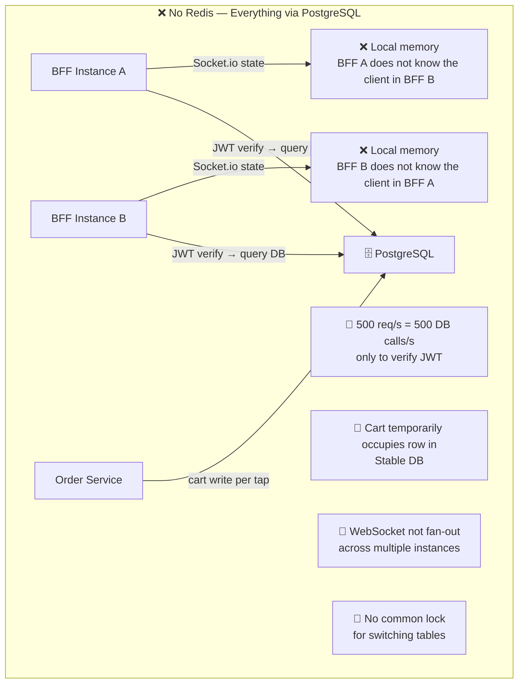

#### Diagram: QRTable With Redis — Correct Layering of Roles

> Redis solves each of the above pain points by creating a middle layer that specializes in fast, short-term data processing and shared state. PostgreSQL holds the true role of source of truth. Kafka holds the correct event log role. Redis plays the role of the in-memory runtime layer.

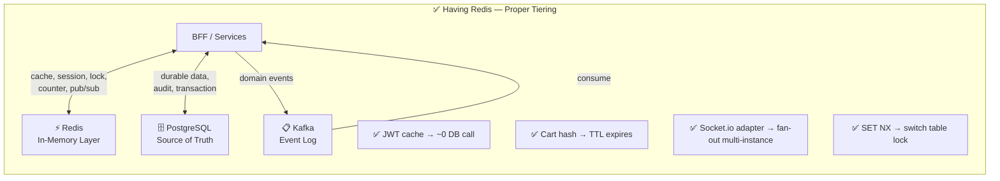

Redis doesn't replace PostgreSQL or Kafka — it fills a gap where neither fits: **data needs RAM speed, has a short lifespan or self-expiration, and can be shared between multiple processes**.

### 1.2 When is Redis NOT the Solution

Redis is not the answer to every problem. Knowing when _not_ to use Redis is just as important as knowing when to use:

**Do not use Redis when data needs to be audited or permanently saved:** If an order is lost after Redis restarts, it is a business bug, not an incident. Order, bill, payment, tenant info — it all has to be in PostgreSQL.

**Do not use Redis when you need durable event replay:** Redis Pub/Sub is "fire and forget" — if the subscriber is not online when the event is published, the event is lost forever. Use Kafka when you need consumers to re-read events after restarting.

**Do not use Redis when there is only one process:** If only one service instance needs a small unshared cache, local memory (eg Map in Node.js) is simpler and faster. Redis has network overhead.

**Don't use Redis without explicit invalidation:** Cache can easily become a source of business misunderstanding if you don't know when to delete/update. There is no contract invalidation → read straight from the source service until there is one.

---

## 2. Redis Nature — In-Memory Data Store

### 2.1 What Redis Really Is

Redis (Remote Dictionary Server) is essentially an **in-memory data structure store** — a data store that operates entirely in RAM. This is a fundamental difference compared to PostgreSQL (writes to disk before confirming) or Kafka (sequential disk I/O to achieve throughput).

Because everything is in RAM, Redis has extremely low latency — typically less than 1 millisecond for simple read/write operations. This is why Redis is suitable for hot paths: JWT cache, session lookup, KDS runtime state — places where every extra millisecond can be felt on the frontend.

But "in-memory" also means that Redis can lose data when restarting (if persistence is not configured). This is not a weakness — this is a **design feature**. QRTable exploits this feature by saving to Redis only what _can be reconstructed_ from PostgreSQL or from the service Owner.

#### Diagram: Redis Location In Storage System

> Each storage tier in QRTable has different speed and durability characteristics. Redis is on the fastest but least durable tier. Rule: data stored at any layer must match the characteristics of that layer.

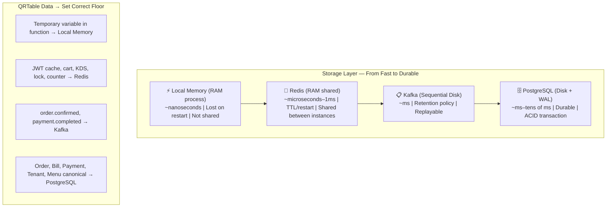

### 2.2 Single-Threaded and Atomic Operations

Redis processes commands in a **single-threaded** fashion — only one command is executed at a time. This may sound like a limitation, but it's actually the source of many of the guarantees Redis provides:

All Redis commands are **atomic** by nature. `INCR counter` (increment counter by 1) never has a race condition between reading and writing — it is impossible for two processes to read counter = 5, increase it to 6, and write twice the value 6 (the correct result must be 7). This is why QRTable uses Redis `INCR` for the daily order quota counter instead of `SELECT + UPDATE` in PostgreSQL.

This property is also the foundation of the distributed lock pattern: `SET key value NX PX ttl` is an atomic command — if the key does not exist, create it, if it already exists, do nothing. It is not possible for two requests to "win" the race when setting a lock.

### 2.3 A Sentence to Remember

```txt
PostgreSQL keeps the truth persistent.
Kafka keeps a replayable event history.
Redis holds fast, transient, or runtime state that needs to respond in under 1ms.
```

If you remove Redis from QRTable, the system is still _functionally correct_ — it's just slower, more resource-intensive, and can't scale to many instances. Here's a good test to see if something is worth putting in Redis: **"If Redis loses this key, can the system rebuild?"** — if the answer is No, don't save it only in Redis.

---

## 3. Five Data Structure In QRTable

Redis is not just a simple key-value store. Redis has many data structures, each optimized for different problems. QRTable uses five types — understand each type to read the code more easily and avoid using the wrong type.

### 3.1 String — Flag, Counter, OAuth State

String is the simplest type: a key that maps to a text or numeric value. Don't be fooled by the name "String" — Redis String can actually store any binary data, including serialized JSON.

QRTable uses String for three different groups:

**Flag:** `tenant:{tenantId}:suspended = "1"`. Key exists → tenant is suspended. Key does not exist → tenant active. BFF guard reads this key before each customer mutation for fast blocking at the edge (edge ​​enforcement), no need to query SaaS service.

**Counter:** `quota:{tenantId}:orders:{date}` stores the number of orders for the day as an integer string. Redis command `INCR` increases counter atomically — never has a race condition even though multiple Order instances are running in parallel.

**Serialized JSON:** `oauth_state:{state}` stores a JSON blob containing tenantId, userId, and CSRF token. String type is suitable because the entire payload reads and writes as one unit (one SET, one GET + DEL).

```txt
GET tenant:abc:suspended          → "1" (suspended) or nil (active)
INCR quota:abc:orders:2026-05-14 → 43 (43rd call)
GET oauth_state:xyz123            → {"tenantId":"abc","userId":"u1",...}
```

### 3.2 Hash — Cart and Session Snapshot

Hash is a field-value table associated with a key. Instead of serializing the entire object into a string and parsing it again each time a field needs to be modified, Hash allows reading/writing each field individually.

QRTable uses Hash for `cart:{tenantId}:{sessionId}` and `session:{tenantId}:{sessionId}`. Example of a cart hash:

```txt
cart:tenant-abc:sess-001
  tenantId    → "tenant-abc"
  sessionId   → "sess-001"
  cartVersion → "7"
  status      → "active"
  updatedAt   → "2026-05-14T10:00:00Z"
  items       → "[{itemId:..., qty:2}, ...]"
```

Reasons to choose Hash instead of String (JSON):

- Refresh the TTL of the entire hash with a command `PEXPIRE`.
- Read a specific field (`HGET cart:... cartVersion`) without deserializing the entire field.
- `cartVersion` is an optimistic locking indicator — when the client submits, the Order service checks if `expectedCartVersion` matches the current value. If there is no match → conflict, the client must refetch.

#### Diagram: Cart Hash and cartVersion Optimistic Locking

> `cartVersion` is a mechanism to detect conflicts between two tabs or two devices adding items to the cart in one session. When versions do not match, the Order service refuses to write and asks the client to retrieve the latest cart instead of silently overwriting.

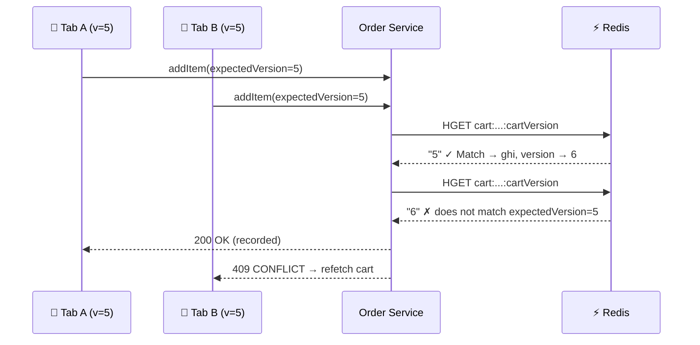

### 3.3 Sorted Set (ZSet) — SLA Due Queue

A Sorted Set is a collection of elements, each element has a _score_ (score\_), and Redis keeps the set always sorted by score.

Kitchen uses Sorted Set for SLA due queue: each kitchen ticket is added to ZSet with a score of Unix timestamp at SLA expiration. A worker periodically uses `ZRANGEBYSCORE kds:{tenantId}:sla 0 {now}` to retrieve all tickets that have exceeded the SLA and broadcasts a `kitchen.sla_warning` event to Kafka — then BFF pushes the alert to the WebSocket KDS client.

```txt
ZADD kds:abc:sla 1715688000 "ticket-001" → ticket expires SLA at 10:00
ZADD kds:abc:sla 1715690000 "ticket-002" → ticket expires SLA at 10:33

ZRANGEBYSCORE kds:abc:sla 0 1715689000 → ["ticket-001"] ← expired
```

Sorted Set is suitable because it is both a _set_ (no duplicates) and _self-sorted_ over time — no need for external sorting code, no need to poll the entire list.

### 3.4 Pub/Sub — Runtime Hint Unsustainable

Pub/Sub is Redis' built-in publish-subscribe mechanism: the publisher sends a message to the channel, all listening subscribers receive it immediately.

QRTable uses Pub/Sub for the KDS stream: when Kitchen updates a ticket in Redis, it publishes to channel `realtime:kds:{tenantId}`. The BFF subscriber receives this signal and emits WebSocket event `events.kdsQueueChanged` to the KDS client. The client receives the hint and performs a refetch queue snapshot from the Kitchen service.

**Important differences from Kafka:** Pub/Sub is **fire-and-forget**. If no subscribers are online at the time of publishing, the message is lost forever — no saving, no replay. So Pub/Sub is just a hint, never a source of truth. The frontend KDS client is not designed as "receive Pub/Sub to update state" — but rather "receive Pub/Sub → refetch snapshot from Kitchen".

```txt
❌ Wrong: Frontend listens to Pub/Sub and updates state directly from messages
✅ Correct: Frontend receives Pub/Sub hint → calls GET /kitchen/kds to get the latest state
```

### 3.5 SET NX PX — Distributed Lock

This is not a data structure but a **command pattern** used to create distributed locks:

```
SET lockKey lockValue NX PX ttlInMilliseconds
```

- `NX` (Not eXists): only set if key does not exist. This is an important atomic property — two requests called at the same time, only one wins.
- `PX ttl`: key is automatically deleted after `ttl` milliseconds — ensures the lock is not held forever if the process crashes.
- `lockValue`: unique value (usually request UUID) for safe release — only remove the lock if the value is still yours.

Details of this pattern are explained in more depth in [Section 6](#6-distributed-lock-coordination-between-processes).

---

## 4. TTL — More Than Just Memory Cleanup

TTL (Time To Live) is the time a key remains alive before Redis deletes itself. A common misconception is to think of TTL as just a memory cleanup mechanism. In fact, **TTL is part of the business contract**.

### 4.1 TTL Is a Contract, Not a Utility

Consider `oauth_state:{state}` with a 5 minute TTL: this is not "Redis cleans itself up every 5 minutes to save RAM". This is a security requirement — OAuth state is only valid for 5 minutes after creation. If the callback arrives after 5 minutes, the key no longer exists, the flow fails. This is correct behavior.

Similar to `bff-session:{tenantId}:{sessionId}` TTL 2h: when the edge session expires, the customer may need to re-enter through the QR/PWA flow. For Order-domain sessions, PostgreSQL remains the source of truth; Redis expiry alone does not close a dining session.

Important question when adding a new Redis key: **"How long is the TTL and why?"** — not "is the TTL necessary?". By default there should be TTL. Not having a TTL must be a deliberate decision for a clear reason.

### 4.2 TTL Affects System Behavior

#### Diagram: Consequences Of TTL Too Short vs Too Long

> Three common TTL scenarios and the consequences of each scenario. Too short a TTL increases the load on the source service. TTL is too long, causing the client to see old data. TTL is truly a balance between freshness and performance.

```mermaid
graph TB
subgraph "⏱️ TTL too short — menu cache 30s"
S1A["Customer opens menu"] --> S1B["Cache misses continuously"]
S1B --> S1C["All requests call Catalog service"]
S1C --> S1D["❌ Cache has no value — Catalog download increased"]
    end

subgraph "⏱️ TTL too long — menu cache 24h"
S2A["Admin corrected item price"] --> S2B["Invalidation did not occur"]
S2B --> S2C["Customer sees 24-hour old price"]
S2C --> S2D["❌ Stale data → wrong business"]
    end

subgraph "✅ TTL reasonable — menu cache 10m + invalidation on write"
S3A["Admin edits price"] --> S3B["Write path: DEL menu:{tenantId}"]
        S3B --> S3C["Cache miss → fetch fresh"]
S3D["Customer reads menu"] --> S3E["Cache hit in 10m"]
S3E --> S3F["✅ Fresh when needed, fast when not"]
    end

```

### 4.3 When Keys Are Allowed Without TTL

There is a case where a Redis key does not need a TTL: runtime flag, but the service Owner will clearly manage its lifecycle.

`tenant:{tenantId}:suspended` has no TTL because: when SaaS suspends tenant, it SET key. When SaaS is activated again, it will be DEL key. Lifecycle is driven by business operations, not time. If you set a short TTL, the tenant will be suspended but the key will automatically expire → BFF will no longer block mutations → the business will go wrong.

But non-TTL keys must be very few and must have a clear Owner. If the service Owner has a bug and does not DEL the key, the key lasts forever and takes up memory. This is why every non-TTL key must be documented for a clear reason.

---

## 5. Cache-Aside Pattern

Cache is the most popular use case of Redis. QRTable uses **cache-aside** (also known as lazy loading) — the simplest pattern and best suited to the current architecture.

### 5.1 Cache-Aside Mechanism

In cache-aside, application code (not Redis or DB) is responsible for coordinating between cache and source. Reading stream:

```
1. Read from Redis
2. If yes (cache hit) → return immediately
3. If there is no (cache miss) → read from source (DB or service)
4. Write results to Redis + TTL
5. Return results to the client
```

#### Diagram: Cache-Aside Read Flow

> Illustration of cache-aside read flow for public menu. The first request (cache miss) goes to the Catalog service and populates the cache. Subsequent requests within 10 minutes read from Redis directly. When the admin edits the menu, write path invalidate cache — request then cache miss again and get new data.

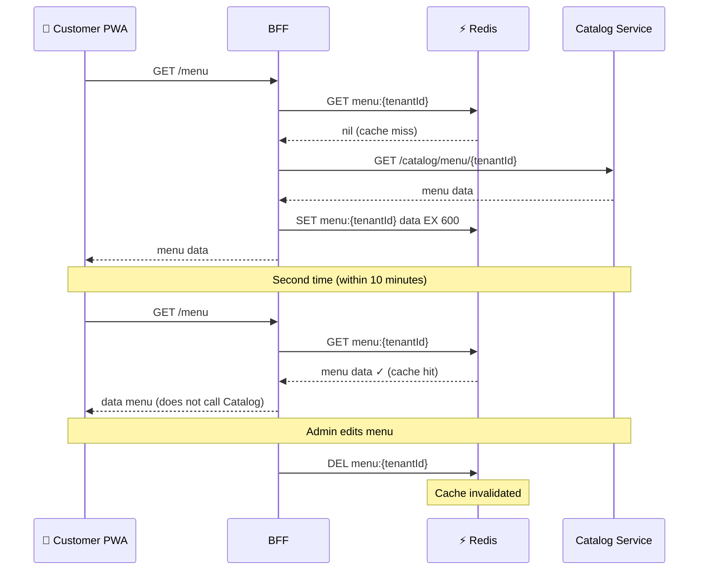

### 5.2 Cache Invalidation — A Harder Problem Than Read Cache

Phil Karlton famously said: _"There are only two hard things in Computer Science: cache invalidation and naming things."_

In QRTable, menu cache invalidation (`DEL menu:{tenantId}`) occurs when admin successfully writes path. This is **write-through invalidation** — after writing to the source, clear the cache. No need to write to cache right away (to avoid stale write race), just delete — next read will populate again.

If DEL does not occur (e.g. write succeeds but DEL has a network error), the cache will remain stale for up to TTL (10 minutes for menu). This is an acceptable **trade-off** because: the menu does not change continuously, 10 minutes of staleness does not seriously affect business, and TTL acts as the final safety net.

### 5.3 Cache Misses Must Not Damage Business

Immutable rule: **cache miss must result in a proper fallback, never a business error**.

If Redis goes down or the key expires, BFF must call the Catalog service and return the correct menu — slower but correct. Redis read code fails `throw` exception if cache miss; it must continue onto the fallback path.

---

## 6. Distributed Lock — Coordination Between Processes

### 6.1 Why Need Lock

When multiple service instances run in parallel, there are operations that are only allowed to occur at one time for a specific resource. QRTable has two instances:

**Transfer lock:** When an employee transfers desks, the session must lock the source and destination desks during execution. If two employees move to the same desk at the same time, the result is unknown.

**KDS rebuild lock:** When Kitchen service restarts, it rebuilds KDS state from the active orders list in PostgreSQL. If multiple instances rebuild at the same time, duplicate tickets can be created in the KDS Redis store.

Core problem: **lock cannot be in the local memory of a process**, because the other process cannot see it. The lock must be located where all instances can see it — Redis is the natural choice.

### 6.2 Pattern Correct: SET NX PX + Owner Value

```txt
Acquire lock:
  SET transfer:{tenantId}:{sessionId} {requestUUID} NX PX 30000
→ Returns "OK" if the lock can be obtained, nil if someone already holds it

Release lock (must check Owner):
  GET transfer:{tenantId}:{sessionId}
→ If value == requestUUID → DEL (is my lock)
→ If value != requestUUID → do nothing (lock has been reacquire by another request)
```

#### Diagram: Distributed Lock — Secure Acquire and Release

> Illustration of two requests trying to get a table transfer lock. Request A wins and holds the lock for 30 seconds. Request B must notify the employee of the conflict. When A releases, it checks the Owner value before deleting — to avoid accidentally deleting another request's lock if the TTL has expired and B has re-acquire.

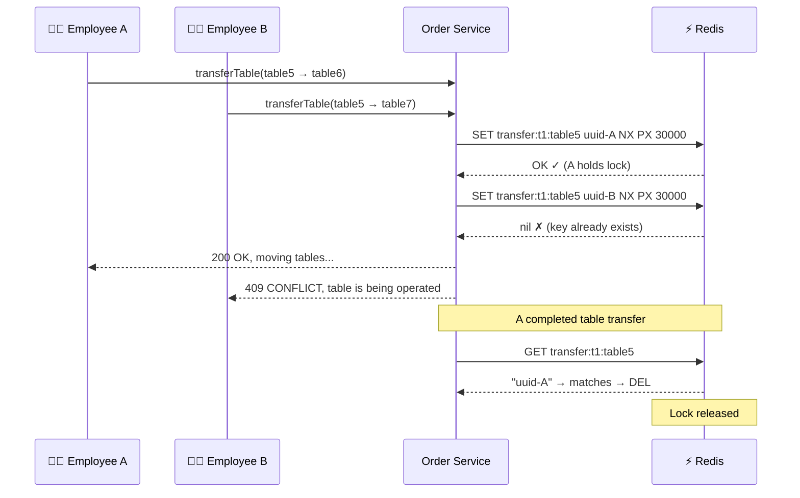

### 6.3 Common Mistakes When Using Lock

**Error 1 — Not checking the Owner when releasing:** If you only `DEL lockKey` without checking the value, there is a risk of deleting the lock of another request. For example: A acquires lock, A is late, TTL expires, B acquires lock, A completes and DEL — A has just deleted B's lock.

**Error 2 — TTL too long:** Lock transfer table only takes a few seconds. TTL 30 seconds is a safe margin. If you set a TTL of 5 minutes, a stuck request can block all operations on that table for 5 minutes.

**Error 3 — Not handling "unable to get lock":** The code must have a clear behavior when the lock fails — return a clear error message to the client, not crash or silently ignore.

**Error 4 — The logic inside the lock is too long:** The lock only protects for the minimum time necessary. Don't include all business logic in the lock — just include the part that needs mutual exclusion.

---

## 7. Redis vs PostgreSQL vs Kafka — Architecture Decisions

### 7.1 Decision Tree — Where Does This Data Belong?

Before adding any data to Redis, run through this decision tree:

#### Diagram: Decision Tree — Redis, PostgreSQL or Kafka?

> The decision tree starts from the most important question: "Will losing this data damage the business?" If Yes → PostgreSQL. If No (can be rebuilt) → continue to consider Redis or Kafka.

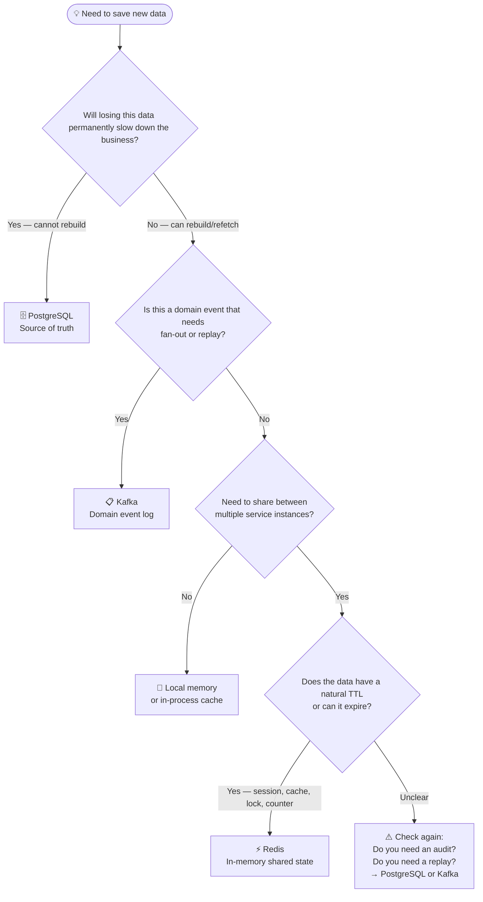

### 7.2 Anti-Pattern — Redis As Second Database

The most common mistake when first using Redis: starting to save everything in Redis because it is "faster", gradually Redis becomes the second database with no schema, no migration, no backup strategy.

Signs to recognize this anti-pattern:

- There is a Redis key with no TTL and no Owner to delete it.
- There is a Redis key that if lost, the team doesn't know where to rebuild from.
- There is a JOIN code between this Redis key and another Redis key.
- Have Redis reading code to make important business decisions without fallback.

In QRTable, every important Redis key has one of two: an explicit TTL, or the service Owner has an explicit deletion code. There is no "live forever without anyone knowing" key.

### 7.3 Comparison Table According to Use Case

| Use Case                       | Select            | Reason                                             |
| ------------------------------ | ----------------- | -------------------------------------------------- | ------- |
| Order, Bill, Payment canonical | PostgreSQL        | Need audit, transaction, cannot lose               |
| Menu canonical                 | PostgreSQL        | Source of truth for Catalog service                |
| JWT verification result        | Redis (cache)     | Short term, re-verifiable, high frequency          |
| Cart draft state               | Redis (hash)      | Temporarily, rebuild from session if               | is lost |
| KDS ticket runtime             | Redis (hash/zset) | Runtime projection, rebuild from active orders     |
| Transfer lock                  | Redis (string NX) | Shared mutex between Order instances               |
| Daily quota counter            | Redis (incr)      | Atomic counter, TTL by day                         |
| order.confirmed event          | Kafka             | Domain event needs Kitchen consumption, has replay |
| KDS update hint                | Redis Pub/Sub     | Signal is fast, lost, client refetch               |
| tenant suspended state         | Redis (flag)      | Edge enforcement is fast, SaaS is the Owner        |

### 7.4 Redis Pub/Sub vs Kafka — Clear Boundaries

This is the most confusing point. Both are "messaging" but the nature is completely different:

| Aspect             | Redis Pub/Sub                             | Kafka                                       |
| ------------------ | ----------------------------------------- | ------------------------------------------- |
| Persistence        | No — fire and forget                      | Yes — retention policy                      |
| Replay             | Impossible                                | Rewind offset any                           |
| Subscriber offline | Message lost                              | Consumer continues from committed offset    |
| Suitable for       | Runtime hint, trigger refetch             | Domain events, business reactions           |
| In QRTable         | `realtime:kds:{tenantId}` → BFF WebSocket | `order.confirmed`, `payment.completed`, ... |

**Brief rule:** Losing messages is acceptable because the client can refetch → Redis Pub/Sub. If the message is lost, it means the business did not happen → Kafka.

---

## 8. Key Design and Multi-tenant

### 8.1 Key Naming Rules

The Redis key in QRTable follows the format:

```txt
{domain}:{tenantId}:{resourceId}
```

For example:

```txt
cart:{tenantId}:{sessionId}
session:{tenantId}:{sessionId}
tenant:{tenantId}:suspended
subscription:{tenantId}
kds:{tenantId}:ticket:{ticketId}
quota:{tenantId}:orders:{date}
transfer:{tenantId}:{sessionId}
```

Two mandatory principles:

**Always have `tenantId` when the data belongs to the tenant:** Do not use `cart:{sessionId}` — if two tenants have the same sessionId (low probability but exists), they will share the same key, reading each other's data. This is a serious security bug.

**Domain prefix must be consistent and have Owner:** `menu:{tenantId}` belongs to BFF. `cart:{tenantId}:{sessionId}` belongs to Order. No service can write to the namespace of another service without a clear contract.

#### Diagram: Key Naming — True and False

> Illustrate two ways to name keys. The wrong key does not have a tenantId — two different tenants may collide keys. The correct key has tenantId in the prefix — the namespace is completely separate by tenant.

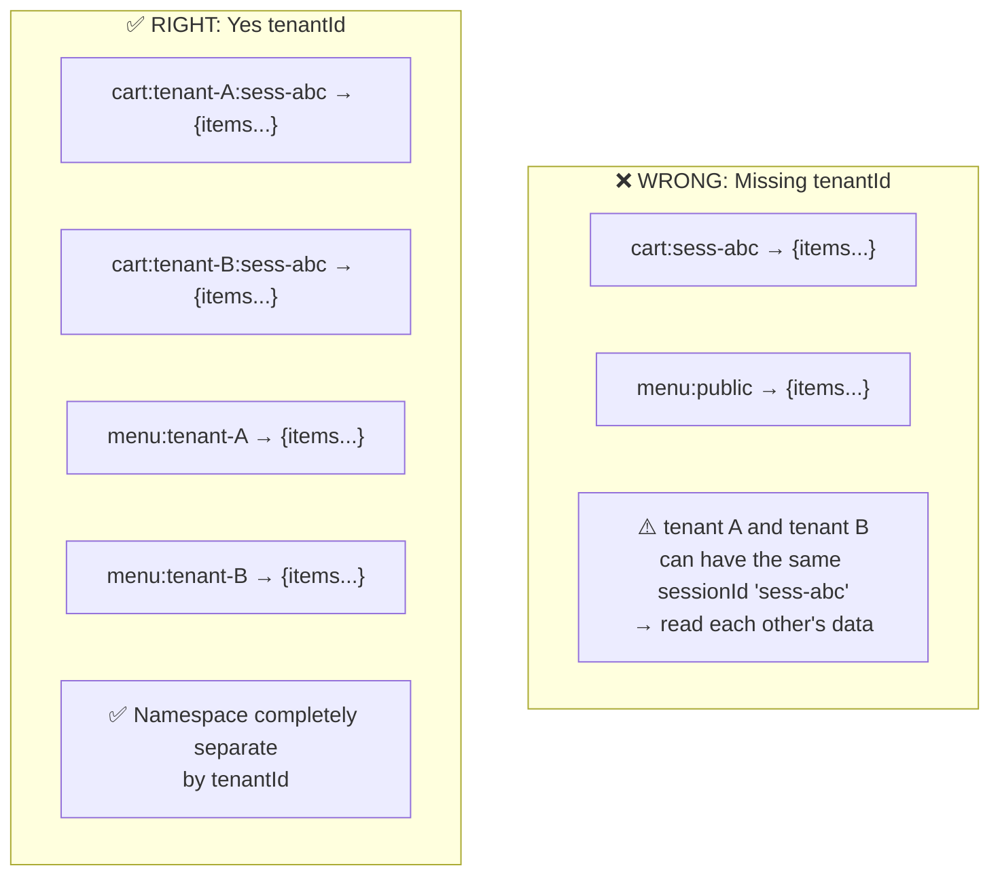

### 8.2 Current Key List

| Key patterns                                            | Owner          | Type                 | TTL         | Status          | Purpose                                              |
| ------------------------------------------------------- | -------------- | -------------------- | ----------- | --------------- | ---------------------------------------------------- |
| `user-token:{sha256(jwt)}`                              | BFF            | String               | 30m         | Deployment      | Cache Authorizer verification results                |
| `bff-session:{tenantId}:{sessionId}`                    | BFF            | String (JSON)        | 2h          | Deployment      | Anonymous customer session at edge                   |
| `bff-session:{sessionId}`                               | BFF            | String (JSON)        | 2h          | Legacy fallback | Support for lookup session missing tenantId          |
| `menu:{tenantId}`                                       | BFF            | String (JSON)        | 10m         | Deployment      | Cache public menu for Customer PWA                   |
| Throttle internal keys                                  | BFF            | Library-owned        | 60s         | Deployment      | Global HTTP rate limiting                            |
| `socket.io-adapter:*`                                   | BFF            | Pub/Sub internal     | n/a         | Deployment      | Scale WebSocket to multiple instances                |
| `session:{tenantId}:{sessionId}`                        | Order          | Hash                 | 2h          | Deployment      | Active session cache of Order domain                 |
| `cart:{tenantId}:{sessionId}`                           | Order          | Hash                 | 2h          | Deployment      | Shared cart draft state                              |
| `transfer:{tenantId}:{sessionId}`                       | Order          | String lock          | 30s         | Deployment      | Lock moves tables according to session               |
| `table-transfer:{tenantId}:{tableId}`                   | Order          | String lock          | 30s         | Deployment      | Lock source/destination tables when switching tables |
| `quota:{tenantId}:orders:{date}`                        | Order          | String counter       | 48h         | Deployment      | Daily order quota counter                            |
| `kds:{tenantId}:*`                                      | Kitchen        | Hash/Set/ZSet/String | Custom key  | Deployment      | KDS ticket, queue, SLA, dedupe                       |
| `lock:kds:rebuild:{tenantId}`                           | Kitchen        | String lock          | Short TTL   | Deployment      | Rebuild lock for KDS recovery                        |
| `realtime:kds:{tenantId}`                               | Kitchen/BFF    | Pub/Sub channel      | n/a         | Deployment      | Internal KDS fan-out hint                            |
| `tenant:{tenantId}:suspended`                           | SaaS/BFF guard | String flag          | No expire   | Deployment      | Block suspended tenants quickly at the edge          |
| `subscription:{tenantId}`                               | SaaS           | String (JSON)        | 5m          | Deployment      | Cache current subscription                           |
| `oauth_state:{state}`                                   | Payment        | String (JSON)        | 5m          | Deployment      | SePay OAuth state one-time consume                   |
| `idempotency:order-submit:{tenantId}:{sessionId}:{key}` | Order          | String               | Planned TTL | Expected        | Harden submit duplicate                              |

If the key is not in this table, do not default to the current implementation. Check code or `redis-usage-analysis.md`.

---

## 9. Main Flows In QRTable

### 9.1 Customer Session and Cart

This flow happens every time a customer scans the QR and works with the shopping cart. This is the most important hot path from a Redis perspective:

#### Diagram: Customer Session and Cart Flow

> All cart status in Redis is "draft" — not a real order yet. Only when the customer submits, Order service creates an Order record in PostgreSQL. `cartVersion` protects integrity when there is a conflict.

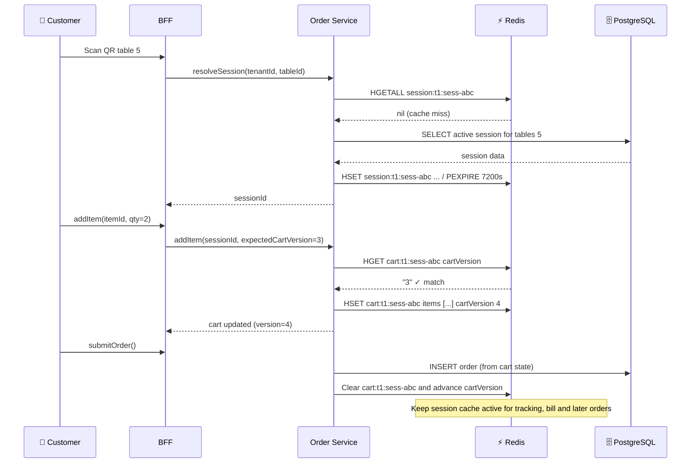

**Points to remember:**

- `cartVersion` is optimistic locking at the application layer, not a Redis feature.
- Cart is draft state in Redis; order persistence is in PostgreSQL.
- Cart cleanup after submission is proactive; session cleanup happens on payment close, idle empty-session close, or safe empty-session release, not immediately after every order.

### 9.2 Public Menu Cache

Simplest stream — pure cache-aside:

```txt
Customer opens menu
  → BFF: GET menu:{tenantId}
  → Cache miss → Catalog Service: GET /catalog/menu/{tenantId}
→ BFF: SET menu:{tenantId} data EX 600 (10 minutes)
→ Returns the menu

Admin edits menu/category/item
→ Write path successfully
  → BFF/Catalog: DEL menu:{tenantId}
→ The next request retrieves new data from the Catalog
```

There is no Kafka event or WebSocket for `menu.updated` in this flow — BFF actively invalidates the cache at the write path.

### 9.3 KDS Runtime

KDS (Kitchen Display System) is the most complex Redis use case in QRTable because it combines many data structures:

#### Diagram: KDS Runtime Flow

> KDS state in Redis is the runtime projection serving the kitchen screen. When order.confirmed arrives, Kitchen service both creates a KDS ticket in Redis and publishes Pub/Sub hint to BFF. BFF emits WebSocket to KDS client. Client refetch snapshot — independent of Pub/Sub message content.

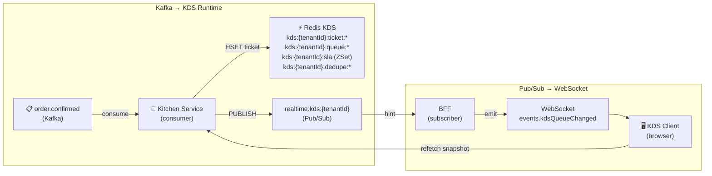

**Important point:** The Kafka consumer must be idempotent — check `kds:{tenantId}:dedupe:{eventId}` before creating a ticket. Kafka at-least-once can deliver duplicate events when rebalancing. Dedupe key in Redis is the first layer of protection.

**Repository ownership after refactor:** `KdsRedisRepository` is the public façade used by Kitchen services and controllers. Internally, `KdsTicketStoreRepository` owns ticket snapshots, station queues, priority, recall and item readiness; `KdsSlaStoreRepository` owns SLA due/claim/dedupe state; `KdsRecoveryStoreRepository` owns rebuild and recovery indexes. Keep Redis key construction in the KDS key utility and keep the façade thin so service code does not depend on low-level Redis primitives.

### 9.4 tenant Suspend and Subscription Cache

```txt
SaaS suspend tenant
→ SET tenant:{tenantId}:suspended "1"  (no TTL)
→ BFF guard reads flag → blocks customer mutations right at the edge

SaaS restore tenant
  → DEL tenant:{tenantId}:suspended

Subscription changes
→ SaaS updates DB
→ SET subscription:{tenantId} {json} EX 300  (or DEL to invalidate)
```

`tenant:{tenantId}:suspended` is a fast blocking mechanism at the edge — BFF does not need to call the SaaS service for each request. But when Redis or SaaS is not available, the guard must have a clear policy: fail-open or fail-closed? This decision depends on the risk level of each mutation.

### 9.5 SePay OAuth State

```txt
Owner starts connecting SePay
→ Payment creates a random state string
  → SET oauth_state:{state} {tenantId, userId, csrf} EX 300
  → Redirect sang SePay OAuth page

SePay callback (within 5 minutes)
  → Payment: GET oauth_state:{state}
  → Validate tenantId, userId, CSRF token
  → DEL oauth_state:{state}  ← one-time consume
→ Continue OAuth flow

Callback after 5 minutes
→ GET oauth_state:{state} → nil (TTL expired)
→ Return error, request to start again
```

Three mandatory requirements of OAuth state: short TTL (5 minutes), one-time consumption (DEL after successful reading), and no long-term token storage in Redis.

---

## 10. Configuration and Operational

### 10.1 Local Configuration

Redis local is in `docker-compose.provider.yaml`:

```yaml
redis:
  image: redis
  ports:
    - '6379:6379'
  healthcheck:
    test: redis-cli ping
  volumes:
    - ./docker/docker_data/redis_data:/data
```

| Parameters      | Meaning                                    | Note                                       |
| --------------- | ------------------------------------------ | ------------------------------------------ |
| `image: redis`  | Default Redis image                        | Consider specific battery version          |
| `6379:6379`     | Map port to host                           | Local app uses `localhost:6379`            |
| Volume `/data`  | Where Redis records persistence if enabled | Compose has not clearly configured RDB/AOF |
| No password/TLS | Simple open Redis local                    | Only suitable for local/dev                |

Environment variables:

```txt
REDIS_HOST=localhost
REDIS_PORT=6379
REDIS_TTL=1800000 ← Default TTL for CacheModule (milliseconds)
```

QRTable has two ways to use Redis in code:

| Type                       | When to use                                                                 |
| -------------------------- | --------------------------------------------------------------------------- |
| `CacheModule` / Keyv Redis | Simple cache at BFF/guard/controller, default TTL                           |
| `ioredis` direct client    | Need specific Redis primitives: `SET EX`, `DEL`, Pub/Sub, lock, KDS runtime |

### 10.2 Persistence: RDB and AOF

Redis is an in-memory store but can enable persistence:

| Mechanism              | Meaning                                     | When to care                                                        |
| ---------------------- | ------------------------------------------- | ------------------------------------------------------------------- |
| RDB snapshots          | Redis periodically writes snapshots to disk | Restore after restart, may lose data after the most recent snapshot |
| AOF (Append Only File) | Redis logs every write command              | More durable than RDB, needs file management                        |
| RDB + AOF              | Combining both                              | Production if Redis is difficult to rebuild                         |

QRTable designs Redis in such a way that it can be lost and restored. Do not rely on Redis persistence as the source of truth. PostgreSQL/service Owner is still the place to rebuild from.

### 10.3 Maxmemory and Eviction Policy

When Redis reaches its memory limit (`maxmemory`), it uses `maxmemory-policy` to decide:

| Policy           | Short meaning                                  | Warning with QRTable                            |
| ---------------- | ---------------------------------------------- | ----------------------------------------------- |
| `noeviction`     | Do not self-delete; new write command may fail | Safer for critical state, must monitor memory   |
| `allkeys-lru`    | Delete rarely used keys throughout keyspace    | Dangerous if there are important locks/sessions |
| `volatile-lru`   | Only delete keys with TTL according to LRU     | More suitable if the key has no TTL to keep     |
| `allkeys-random` | Random deletion                                | Unpredictable, should not                       |

QRTable contains cache, session, lock, KDS runtime and tenant suspend flag in the same Redis instance — do not choose a policy as if every key is cached. If production sets `maxmemory`, key classification and monitoring are needed.

### 10.4 Conflict and Failure Playbook

| Situation             | Signs                                                  | How to handle                                                           |
| --------------------- | ------------------------------------------------------ | ----------------------------------------------------------------------- |
| Cart version conflict | Client sends `expectedCartVersion` old                 | Return 409 conflict, client refetch new cart; no silent override        |
| Lock expired midway   | Request A keeps the lock too long, B gets a new lock   | Operation in lock must be short; release must check Owner value         |
| Cache stampede        | Multiple requests with the same miss, calling source   | Reasonable TTL, request coalescing if endpoint is hot                   |
| Pub/Sub message lost  | BFF downloaded right when Kitchen published            | Frontend refetch snapshot; Pub/Sub is not a source of truth             |
| Wrong type error      | `HGETALL` into key String                              | Debug with `TYPE key`; prefix must be unique according to type          |
| Key collision         | The two services use the same key pattern              | Key must have an Owner; Update key inventory when adding                |
| Redis unavailable     | Guard/cache/lock unreadable                            | Policy by business: cache miss fallback; mutation sensitive fail-closed |
| Unintended Eviction   | The key disappears even though the TTL has not expired | Check `maxmemory-policy` and memory usage                               |

### 10.5 Debugging Local

```bash
# Connect redis-cli
docker exec -it redis redis-cli

# See the type of key
TYPE cart:tenant-1:session-1

# See remaining TTL (seconds); -1 = no TTL; -2 = key does not exist
TTL cart:tenant-1:session-1

# Read hash
HGETALL cart:tenant-1:session-1

# Read string
GET tenant:tenant-1:suspended

# Scan key according to pattern (safe, not blocked)
SCAN 0 MATCH "cart:tenant-1:*" COUNT 100

# View memory and policy
INFO memory
CONFIG GET maxmemory-policy
```

**Dangerous command — do not use in production:**

```bash
KEYS * # Block Redis if keyspace is large
FLUSHDB # Delete the entire current DB
FLUSHALL # Delete all DB completely
MONITOR       # High overhead
```

When you see strange data, check in this order: Is the tenantId correct → who is the service Owner → is the TTL as expected → does the type match the docs → is there a legacy fallback key → is the prefix used incorrectly?

---

## 11. Mental Model Summary

#### Diagram: Aggregated Mental Model — Redis In QRTable

> Mind map summarizing all Redis knowledge applied to QRTable. From the nature (in-memory), through data structure (5 types), to architectural decisions (when to use Redis, when not). This is a "cheat sheet" to review before adding a new Redis key.

```mermaid
mindmap
  root((Redis\nQRTable))
Nature
In-Memory → less than 1ms
Single-threaded → every operation is atomic
Data may be lost when restarting
PostgreSQL is still the source of truth
    Data Structure
      String → flag, counter, OAuth state
      Hash → cart, session snapshot
      Sorted Set → SLA due queue
Pub/Sub → runtime hint is not persistent
      SET NX PX → distributed lock
    TTL
TTL is a business contract
By default there should be TTL
No TTL must have a clear reason
Cache miss → fallback, no crash
    Cache-Aside
Read Redis first
      Cache miss → fetch source → populate
      Write path → invalidate cache
Stale cache → TTL there safety net
    Lock
      SET NX PX → acquire atomic
Value = UUID → release safely
Short TTL → does not block for long
Check Owner before DEL
Architecture
Redis vs PG vs Kafka = different problems
      Pub/Sub ≠ Kafka → fire-and-forget
Key must have Owner + tenantId
Don't make Redis a 2nd DB
    Multi-Tenant
tenantId required in key
      {domain}:{tenantId}:{resourceId}
Namespaces are separated by tenant
Key inventory must be updated
```

After reading the entire document, here is a brief mental model to remember:

**In essence:** Redis is an in-memory data store — all in RAM, latency under 1ms, single-threaded so all commands are atomic. Data may be lost on restart if not persisted — this is a design feature, not a bug. QRTable exploits by only saving what can be reconstructed.

**About data structure:** Each type solves different problems. String for flag/counter/OAuth. Hash for multiple field snapshots (cart/session). Sorted Set for queue by time (SLA). Pub/Sub for runtime hints is not persistent. SET NX PX for distributed lock. Using the wrong type is a potential bug.

**About TTL:** TTL is not a memory cleaning utility — TTL is a contract. Each key needs a TTL or a clear reason why it is not TTL. Cache misses cannot cause business failure — there must be a fallback to the source.

**About cache-aside:** Read Redis → miss → fetch source → populate Redis. Write successfully → DEL cache. Stale cache within the TTL limit is an acceptable trade-off for performance.

**About lock:** SET NX PX with UUID value. Release by checking value before DEL. Short TTL. The logic inside the lock must be short. Failure when the lock cannot be obtained must have a clear behavior.

**About the decision to use Redis:** The core question is "If Redis loses this key, can the system rebuild?". If No → PostgreSQL. If Yes → consider Redis. Pub/Sub when hint can be lost. Kafka when the event must arrive and can be replayed.

**About multi-tenant:** `tenantId` is required in all tenant data keys — not negotiable. A key without a tenantId is a potential security bug. Every key must have a clear Owner service and be documented in the key inventory.

#### Diagram: Cheat Sheet — Quick Decisions

> Quick summary of important Redis keys with type, TTL, Owner and warnings. Use as a "quick reference" when debugging or adding new keys.

| Key Pattern                          | Type             | TTL       | Owner   | Warning                                          |
| ------------------------------------ | ---------------- | --------- | ------- | ------------------------------------------------ |
| `user-token:{sha256(jwt)}`           | String           | 30m       | BFF     | Re-verify when missing                           |
| `bff-session:{tenantId}:{sessionId}` | String           | 2h        | BFF     | Legacy fallback exists missing tenantId          |
| `menu:{tenantId}`                    | String           | 10m       | BFF     | Invalidate when admin write                      |
| `session:{tenantId}:{sessionId}`     | Hash             | 2h        | Order   | Rebuild from PG when missing                     |
| `cart:{tenantId}:{sessionId}`        | Hash             | 2h        | Order   | `cartVersion` check required                     |
| `transfer:{tenantId}:{sessionId}`    | String lock      | 30s       | Order   | SET NX, check Owner when releasing               |
| `quota:{tenantId}:orders:{date}`     | String counter   | 48h       | Order   | INCR atomic                                      |
| `kds:{tenantId}:`\*                  | Hash/ZSet/String | Depends   | Kitchen | Dedupe Kafka event before creating ticket        |
| `tenant:{tenantId}:suspended`        | String flags     | No expire | SaaS    | SaaS is Owner DEL; policy fail-open/closed clear |
| `subscription:{tenantId}`            | String           | 5m        | SaaS    | Invalidate when subscription change              |
| `oauth_state:{state}`                | String           | 5m        | Payment | One-time consume, DEL after validate             |
