# Redis: Lý Thuyết Chuyên Sâu Và Triển Khai Thực Chiến Trong QRTable

> **Bản tiếng Việt** — bản tiếng Anh canonical (chuẩn): [redis-qrtable.md](redis-qrtable.md)
>
> **Triết lý tài liệu:** Hiểu _tại sao_ trước _như thế nào_. Mọi khái niệm được neo chặt vào ngữ cảnh cụ thể của QRTable để bạn không học lý thuyết trừu tượng mà học để áp dụng ngay vào kiến trúc thực tế.
>
> **Trạng thái mã nguồn hiện tại (2026-05-27):** Đây là tài liệu hướng dẫn hỗ trợ. Redis trong QRTable được triển khai cho: lưu đệm (cache) kết quả xác thực JWT, phiên khách hàng ẩn danh (anonymous customer session), thực đơn công khai (public menu), giới hạn tốc độ gọi API (rate limiting), Socket.io Redis Adapter (mở rộng kết nối WebSocket đa tiến trình), kho lưu trữ runtime của màn hình bếp (KDS runtime store), khóa phân tán cho chuyển bàn và tái tạo dữ liệu bếp (transfer/rebuild locks), bộ đếm hạn ngạch đơn hàng theo ngày (daily order quota counter), cờ tạm ngưng nhà hàng (tenant suspend flag), cache gói dịch vụ thuê bao (subscription cache), và lưu trạng thái bảo mật OAuth của SePay. Giỏ hàng và phiên đặt món sử dụng Redis Hash `cart:{tenantId}:{sessionId}` / `session:{tenantId}:{sessionId}` kết hợp với kiểm tra phiên bản `cartVersion` trong mã nguồn. Dịch vụ Order có thể giải phóng an toàn các phiên bàn trống sau khi đối soát với PostgreSQL, sau đó xóa các khóa session/cart tương ứng trong Redis. Việc truy cập Redis trong dịch vụ Kitchen được tách bạch phía sau lớp Facade `KdsRedisRepository` gồm các kho lưu trữ vé bếp (ticket), hạn giờ chế biến (SLA) và phục hồi dữ liệu (recovery). Lua script là một phương án gia cố cho giỏ hàng nhưng chưa triển khai ở phiên bản hiện tại. Nguồn chân lý bền vững (Persistent Source of Truth) vẫn là PostgreSQL — nơi lưu giữ các thực thể cốt lõi như tenant, thực đơn, đơn hàng, hóa đơn, thanh toán và toàn bộ dữ liệu cần kiểm toán.

---

## Mục Lục

1. [Vấn Đề Redis Giải Quyết](#1-vấn-đề-redis-giải-quyết)
2. [Bản Chất Của Redis — In-Memory Data Store](#2-bản-chất-của-redis--in-memory-data-store)
3. [Năm Cấu Trúc Dữ Liệu Được Sử Dụng Trong QRTable](#3-năm-cấu-trúc-dữ-liệu-được-sử-dụng-trong-qrtable)
4. [TTL — Không Chỉ Là Dọn Dẹp Bộ Nhớ](#4-ttl--không-chỉ-là-dọn-dẹp-bộ-nhớ)
5. [Mô Hình Cache-Aside (Nạp Trì Hoãn)](#5-mô-hình-cache-aside-nạp-trì-hoãn)
6. [Khóa Phân Tán (Distributed Lock) — Điều Phối Giữa Các Tiến Trình](#6-khóa-phân-tán-distributed-lock--điều-phối-giữa-các-tiến-trình)
7. [Redis vs PostgreSQL vs Kafka — Quyết Định Kiến Trúc](#7-redis-vs-postgresql-vs-kafka--quyết-định-kiến-trúc)
8. [Quy Chuẩn Thiết Kế Khóa Và Đa Nhà Hàng (Multi-tenant)](#8-quy-chuẩn-thiết-kế-khóa-và-đa-nhà-hàng-multi-tenant)
9. [Các Luồng Nghiệp Vụ Chính Trong QRTable](#9-các-luồng-nghiệp-vụ-chính-trong-qrtable)
10. [Cấu Hình Và Vận Hành](#10-cấu-hình-và-vận-hành)
11. [Tổng Kết Mental Model (Mô Hình Tư Duy)](#11-tổng-kết-mental-model-mô-hình-tư-duy)

---

## 1. Vấn Đề Redis Giải Quyết

Trước khi tìm hiểu Redis là gì, bạn cần hiểu Redis được đưa vào QRTable để giải quyết bài toán gì. Nếu bỏ qua phần này, bạn sẽ có xu hướng lạm dụng Redis ở khắp mọi nơi (thay thế cả PostgreSQL) hoặc không biết khi nào hệ thống thực sự cần đến nó.

### 1.1 Bài Toán Gốc: Dữ Liệu Cần Tốc Độ Cao, Vòng Đời Ngắn Và Chia Sẻ Giữa Các Tiến Trình

Hãy tưởng tượng một hệ thống QRTable không có Redis. Hệ thống vẫn có thể hoạt động được vì PostgreSQL là một cơ sở dữ liệu rất mạnh mẽ. Tuy nhiên, hàng loạt vấn đề nghiêm trọng sẽ nảy sinh khi hệ thống chịu tải cao và triển khai nhiều bản sao (instances):

**Ví dụ 1 — Giỏ hàng của khách (Customer's Cart):** Khách hàng ngồi tại bàn số 5, quét mã QR, thêm món, đổi số lượng liên tục. Mỗi thao tác bấm thêm món là một lần ghi nhỏ vào trạng thái giỏ hàng tạm thời. Nếu giỏ hàng nằm trong PostgreSQL, mỗi thao tác nhỏ này sẽ tạo ra một câu lệnh `INSERT`/`UPDATE` kèm theo chi phí mở giao dịch (transaction overhead) và ghi đĩa (disk I/O). Giỏ hàng chưa được bấm gửi (submit) thì không cần mức độ bền vững (durability) tuyệt đối như vậy.

**Ví dụ 2 — Xác thực JWT (JWT Verification):** API Gateway (BFF) tiếp nhận hàng trăm yêu cầu mỗi giây và đều phải xác thực token JWT gửi kèm. Nếu mỗi yêu cầu đều phải gọi sang dịch vụ Authorizer hoặc truy vấn cơ sở dữ liệu, một instance của BFF xử lý 500 req/s sẽ tạo ra 500 cuộc gọi mạng nội bộ/giây chỉ để kiểm tra lại một chiếc token vừa mới được xác thực thành công cách đó vài mili-giây.

**Ví dụ 3 — Socket.io và triển khai đa instance:** Khi mở rộng BFF lên 2 instances chạy song song, một khách hàng kết nối WebSocket tới Instance A, nhưng sự kiện thông báo (ví dụ: món ăn đã xong) lại được kích hoạt từ mã nguồn chạy trên Instance B. Nếu không có bộ nhớ chia sẻ chung, Instance B hoàn toàn không biết kết nối của khách hàng đang nằm ở máy chủ nào để phát thông báo (emit event).

**Ví dụ 4 — Chuyển bàn (Table Transfer):** Hai nhân viên phục vụ cùng lúc thực hiện thao tác chuyển bàn cho cùng một phiên làm việc. Nếu không có cơ chế loại trừ lẫn nhau (mutual exclusion) được chia sẻ giữa các instance, cả hai tiến trình đều có thể đọc trạng thái cũ và ghi đè dữ liệu lên nhau, gây sai lệch nghiêm trọng.

Bốn ví dụ trên tuy là bốn bài toán khác nhau nhưng đều mang chung những đặc tính cốt lõi: **cần đọc/ghi cực nhanh, dữ liệu có vòng đời ngắn (short-lived) hoặc có thể tái tạo lại được, và cần được chia sẻ đồng bộ giữa nhiều tiến trình/instance**. PostgreSQL có thể gánh được, nhưng đó không phải công cụ tối ưu nhất cho bài toán này.

#### Sơ đồ: QRTable Khi Không Có Redis — Các Điểm Nghẽn

> Minh họa các vấn đề nảy sinh khi toàn bộ thao tác đều đổ dồn vào PostgreSQL. Mỗi nút màu đỏ đại diện cho một điểm nghẽn thực tế: hiệu năng suy giảm, không thể chia sẻ trạng thái giữa các instance, hoặc dữ liệu tạm chiếm dụng tài nguyên không cần thiết trong DB bền vững.

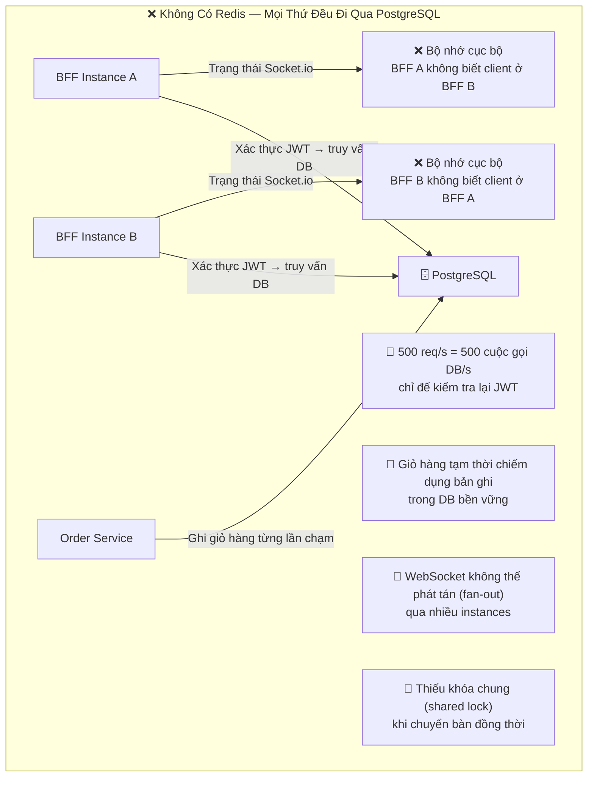

#### Sơ đồ: QRTable Khi Có Redis — Phân Tầng Đúng Vai Trò

> Redis giải quyết toàn bộ các điểm nghẽn trên bằng cách tạo ra một tầng trung gian chuyên biệt xử lý dữ liệu nhanh, ngắn hạn và chia sẻ trạng thái. PostgreSQL giữ đúng vai trò là nguồn chân lý bền vững (Source of Truth). Kafka giữ đúng vai trò là nhật ký sự kiện nghiệp vụ (Event Log). Redis đóng vai trò là tầng thực thi tức thời trên bộ nhớ RAM (In-Memory Runtime Layer).

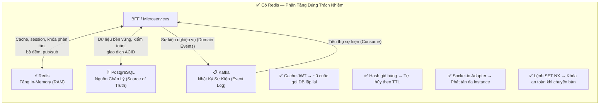

Redis không thay thế PostgreSQL hay Kafka — nó lấp vào khoảng trống mà cả hai công nghệ trên không tối ưu: **dữ liệu cần tốc độ phản hồi tính bằng micro-giây/mili-giây, có thời gian sống hữu hạn hoặc tự hết hạn, và cần được chia sẻ giữa nhiều tiến trình phân tán**.

### 1.2 Khi Nào Redis KHÔNG Phải Là Giải Pháp

Biết khi nào _không nên_ dùng Redis cũng quan trọng không kém việc biết khi nào nên dùng:

1. **Không dùng Redis khi dữ liệu cần kiểm toán (audit) hoặc lưu trữ vĩnh viễn:** Nếu một đơn hàng bị mất sau khi Redis khởi động lại, đó là lỗi nghiệp vụ (business bug) nghiêm trọng chứ không chỉ là sự cố kỹ thuật. Đơn hàng, hóa đơn, thông tin thanh toán, cấu hình nhà hàng bắt buộc phải nằm trong PostgreSQL.
2. **Không dùng Redis khi bạn cần khả năng phát lại sự kiện (Event Replay):** Cơ chế Pub/Sub của Redis hoạt động theo kiểu "bắn rồi quên" (fire-and-forget) — nếu bên nhận không online đúng lúc phát tin, tin nhắn sẽ bị mất vĩnh viễn. Khi cần các dịch vụ có thể đọc lại toàn bộ lịch sử sự kiện sau khi khởi động lại, bạn bắt buộc phải dùng Kafka.
3. **Không dùng Redis khi hệ thống chỉ có đúng một tiến trình duy nhất:** Nếu chỉ có một instance service duy nhất cần một bộ nhớ đệm nhỏ không chia sẻ cho ai, bộ nhớ RAM cục bộ của tiến trình (ví dụ: `Map` trong Node.js) sẽ đơn giản và nhanh hơn nhiều do không tốn chi phí truyền tải qua mạng (network overhead).
4. **Không dùng Redis khi thiếu chiến lược xóa đệm (Cache Invalidation) rõ ràng:** Dữ liệu cache sẽ trở thành nguồn cơn gây sai lệch nghiệp vụ nếu bạn không xác định được khi nào cần xóa hoặc cập nhật nó. Nếu chưa có hợp đồng xóa cache rõ ràng, hãy đọc trực tiếp từ dịch vụ nguồn.

---

## 2. Bản Chất Của Redis — In-Memory Data Store

### 2.1 Redis Thực Sự Là Gì?

Redis (Remote Dictionary Server) về bản chất là một **In-Memory Data Structure Store (kho lưu trữ cấu trúc dữ liệu trên bộ nhớ RAM)** — mọi thao tác đọc/ghi đều diễn ra trực tiếp trên RAM. Đây là sự khác biệt mang tính nền tảng so với PostgreSQL (phải ghi dữ liệu xuống đĩa cứng và nhật ký WAL trước khi xác nhận) hoặc Kafka (tận dụng tuần tự đĩa I/O để đạt thông lượng cao).

Nhờ toàn bộ dữ liệu nằm trên RAM, độ trễ (latency) của Redis cực kỳ thấp — thông thường **dưới 1 mili-giây** cho các thao tác đọc/ghi cơ bản. Đây là lý do Redis là lựa chọn hoàn hảo cho các "hot path" (nhánh mã nguồn được gọi với tần suất cực cao): lưu đệm xác thực JWT, tra cứu phiên khách hàng, cập nhật trạng thái đơn hàng trên màn hình bếp — những nơi mà mỗi mili-giây chậm trễ đều có thể ảnh hưởng trực tiếp đến trải nghiệm người dùng trên frontend.

Tuy nhiên, "in-memory" cũng đồng nghĩa với việc dữ liệu có thể bị mất khi tiến trình Redis khởi động lại (nếu không cấu hình ghi đĩa định kỳ). Đây không phải là nhược điểm — đây là một **đặc tính thiết kế (design feature)**. QRTable khai thác đặc tính này bằng cách chỉ lưu vào Redis những dữ liệu _có thể tái tạo lại được_ (reconstructable) từ PostgreSQL hoặc từ các dịch vụ nguồn.

#### Sơ đồ: Vị Trí Của Redis Trong Hệ Thống Lưu Trữ

> Mỗi tầng lưu trữ trong QRTable có đặc tính tốc độ và độ bền vững khác nhau. Redis nằm ở tầng có tốc độ cực nhanh nhưng độ bền vững thấp. Nguyên tắc vàng: Dữ liệu được lưu ở tầng nào phải hoàn toàn phù hợp với đặc tính của tầng đó.

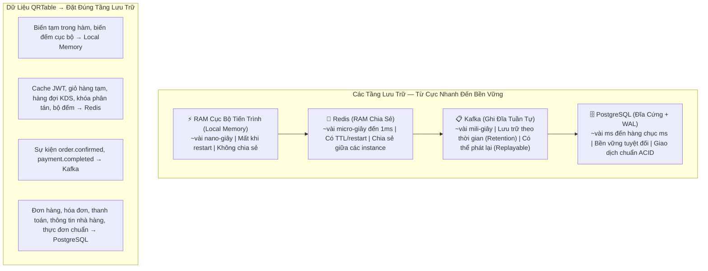

### 2.2 Đơn Luồng (Single-Threaded) Và Tính Nguyên Tử (Atomic Operations)

Redis xử lý các câu lệnh theo cơ chế **đơn luồng (Single-Threaded Event Loop)** — tại một thời điểm, chỉ có duy nhất một câu lệnh được thực thi. Điều này nghe có vẻ là một giới hạn, nhưng thực chất lại là nguồn gốc mang lại sự an toàn tuyệt đối cho nhiều tác vụ:

Mọi câu lệnh trong Redis đều mang **tính nguyên tử (Atomic)**. Lệnh `INCR counter` (tăng biến đếm lên 1) không bao giờ bị hiện tượng tương tranh (Race Condition) giữa việc đọc và ghi — không bao giờ xảy ra tình huống hai tiến trình cùng đọc ra `counter = 5`, cùng tăng lên 6 và ghi đè hai lần số 6 (kết quả chính xác phải là 7). Đây là lý do QRTable sử dụng lệnh `INCR` của Redis để đếm hạn ngạch đơn hàng theo ngày thay vì dùng các câu lệnh `SELECT + UPDATE` phức tạp trong PostgreSQL.

Đặc tính này cũng là nền tảng của mẫu khóa phân tán (Distributed Lock): Lệnh `SET key value NX PX ttl` là một thao tác nguyên tử — nếu khóa chưa tồn tại thì tạo mới (`NX = Not eXists`), nếu đã tồn tại thì không làm gì cả. Không thể có chuyện hai yêu cầu cùng lúc "chiến thắng" trong cuộc đua giành khóa.

### 2.3 Câu Thần Chú Cần Nhớ

```txt
PostgreSQL giữ nguồn chân lý bền vững lâu dài (Source of Truth).
Kafka giữ lịch sử sự kiện nghiệp vụ có thể phát lại (Event Log).
Redis giữ trạng thái tức thời, ngắn hạn và cần phản hồi dưới 1 mili-giây.
```

Nếu bạn tạm thời gỡ bỏ Redis ra khỏi QRTable, hệ thống vẫn phải đảm bảo **tính đúng đắn về mặt nghiệp vụ** — nó chỉ chạy chậm hơn, tốn nhiều tài nguyên hơn và khó mở rộng quy mô. Một câu hỏi kiểm tra rất hay trước khi đưa bất kỳ dữ liệu nào vào Redis: **"Nếu Redis mất sạch khóa này, hệ thống có thể tự dựng lại dữ liệu được không?"** — nếu câu trả lời là "Không", tuyệt đối không lưu dữ liệu đó duy nhất tại Redis!

---

## 3. Năm Cấu Trúc Dữ Liệu Được Sử Dụng Trong QRTable

Redis không chỉ là một kho chứa key-value (khóa - giá trị) đơn giản. Redis cung cấp nhiều cấu trúc dữ liệu phong phú, mỗi loại được tối ưu cho các bài toán khác nhau. QRTable sử dụng 5 cấu trúc cốt lõi:

### 3.1 String — Cờ Trạng Thái (Flag), Bộ Đếm (Counter), Trạng Thái OAuth

String là kiểu dữ liệu cơ bản nhất: một khóa ánh xạ tới một chuỗi văn bản hoặc một giá trị số. Tên gọi là "String" nhưng thực tế có thể chứa bất kỳ dữ liệu nhị phân nào, bao gồm cả chuỗi JSON đã được tuần tự hóa (serialized JSON).

QRTable sử dụng String cho 3 nhóm mục đích:

- **Cờ trạng thái (Flag):** `tenant:{tenantId}:suspended = "1"`. Khóa tồn tại -> Nhà hàng đang bị tạm ngưng dịch vụ. Khóa không tồn tại -> Nhà hàng đang hoạt động bình thường. BFF Guard đọc khóa này ở đầu mỗi yêu cầu thay đổi dữ liệu của khách để chặn ngay tại cửa ngõ (Edge Enforcement) mà không cần truy vấn dịch vụ SaaS.
- **Bộ đếm (Counter):** `quota:{tenantId}:orders:{date}` lưu trữ số lượng đơn hàng trong ngày dưới dạng số nguyên. Lệnh `INCR` giúp tăng giá trị này một cách nguyên tử — không bao giờ bị xung đột dữ liệu dù có hàng chục instance của dịch vụ Order cùng ghi nhận đơn hàng song song.
- **Dữ liệu JSON tuần tự hóa:** `oauth_state:{state}` lưu trữ một chuỗi JSON chứa `tenantId`, `userId`, và `csrfToken`. Dùng String rất phù hợp vì toàn bộ gói dữ liệu được đọc và xóa trọn gói trong một lần thao tác duy nhất (1 lệnh `SET`, 1 lệnh `GET + DEL`).

```txt
GET tenant:abc:suspended          → "1" (đang bị khóa) hoặc nil (đang hoạt động)
INCR quota:abc:orders:2026-05-14 → 43 (đơn hàng thứ 43 trong ngày)
GET oauth_state:xyz123            → {"tenantId":"abc","userId":"u1",...}
```

### 3.2 Hash — Giỏ Hàng Và Ảnh Chụp Phiên Đặt Món (Session Snapshot)

Hash là một bảng chứa các cặp trường - giá trị (field-value pairs) nằm bên trong một khóa chính. Thay vì phải đóng gói toàn bộ đối tượng thành chuỗi JSON rồi giải mã (parse) lại mỗi khi cần sửa một trường nhỏ, Hash cho phép đọc/ghi từng trường riêng biệt.

QRTable sử dụng Hash cho `cart:{tenantId}:{sessionId}` và `session:{tenantId}:{sessionId}`. Ví dụ cấu trúc của một Hash giỏ hàng:

```txt
cart:tenant-abc:sess-001
  tenantId    → "tenant-abc"
  sessionId   → "sess-001"
  cartVersion → "7"
  status      → "active"
  updatedAt   → "2026-05-14T10:00:00Z"
  items       → "[{itemId:..., qty:2}, ...]"
```

Lý do chọn Hash thay vì String (JSON):

- Có thể làm mới thời gian sống (TTL) của toàn bộ giỏ hàng bằng một lệnh `PEXPIRE`.
- Đọc nhanh một trường cụ thể (ví dụ: `HGET cart:... cartVersion`) mà không cần tốn chi phí giải mã toàn bộ danh sách món ăn.
- Trường `cartVersion` đóng vai trò là cơ chế **Optimistic Locking (khóa lạc quan)** — khi khách hàng bấm gửi đơn, dịch vụ Order sẽ đối chiếu xem `expectedCartVersion` từ phía client có trùng khớp với giá trị hiện tại trong Redis hay không. Nếu không khớp -> Báo lỗi xung đột (Conflict 409) và yêu cầu client tải lại giỏ hàng mới nhất.

#### Sơ đồ: Giỏ Hàng Dạng Hash Và Khóa Lạc Quan Qua cartVersion

> `cartVersion` là cơ chế phát hiện xung đột dữ liệu khi hai thiết bị hoặc hai tab cùng thêm món vào chung một giỏ hàng của bàn. Khi phiên bản không khớp, dịch vụ Order từ chối ghi đè và yêu cầu client lấy lại giỏ hàng mới nhất.

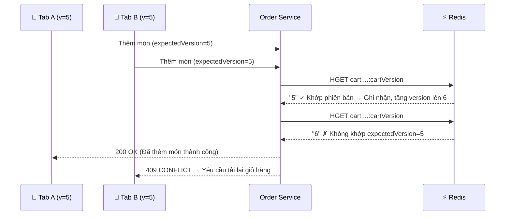

### 3.3 Sorted Set (ZSet) — Hàng Đợi Hạn Chế Biến Món (SLA Due Queue)

Sorted Set là một tập hợp các phần tử không trùng lặp, trong đó mỗi phần tử được gắn kèm một điểm số (_score_), và Redis luôn tự động sắp xếp các phần tử theo thứ tự điểm số từ thấp đến cao.

Dịch vụ Kitchen sử dụng Sorted Set để quản lý thời hạn chế biến món ăn (SLA - Service Level Agreement): Mỗi vé gọi món (ticket) được đưa vào ZSet với điểm số chính là dấu thời gian Unix (Unix timestamp) tại thời điểm hết hạn chế biến. Một tiến trình nền (background worker) định kỳ gọi lệnh `ZRANGEBYSCORE kds:{tenantId}:sla 0 {now}` để lấy ra toàn bộ các vé đã quá hạn chế biến, sau đó phát sự kiện cảnh báo `kitchen.sla_warning` lên Kafka -> BFF nhận sự kiện và gửi cảnh báo qua WebSocket tới màn hình bếp.

```txt
ZADD kds:abc:sla 1715688000 "ticket-001" → Vé 001 hết hạn lúc 10:00
ZADD kds:abc:sla 1715690000 "ticket-002" → Vé 002 hết hạn lúc 10:33

ZRANGEBYSCORE kds:abc:sla 0 1715689000 → Lấy ra ["ticket-001"] (đã quá hạn lúc hiện tại)
```

Sorted Set cực kỳ hoàn hảo cho bài toán này vì nó vừa đảm bảo không trùng lặp phần tử, vừa tự động sắp xếp theo thời gian mà không cần mã nguồn ứng dụng phải tự sort hay quét qua toàn bộ danh sách.

### 3.4 Pub/Sub — Tín Hiệu Thời Gian Thực Ngắn Hạn (Runtime Ephemeral Hint)

Pub/Sub (Publish/Subscribe) là cơ chế phát và nhận tin nhắn tích hợp sẵn của Redis: Bên phát (Publisher) gửi một thông điệp vào một kênh (channel), và toàn bộ các bên đang lắng nghe (Subscribers) sẽ nhận được thông điệp đó ngay lập tức.

QRTable sử dụng Pub/Sub cho luồng hiển thị bếp KDS: Khi dịch vụ Kitchen cập nhật trạng thái của một món ăn trong Redis, nó sẽ phát tin nhắn vào kênh `realtime:kds:{tenantId}`. Instance BFF đang lắng nghe kênh này nhận được tín hiệu và phát sự kiện WebSocket `events.kdsQueueChanged` tới trình duyệt của màn hình bếp. Màn hình bếp nhận được tín hiệu gợi ý (hint) này và chủ động gọi API lấy lại ảnh chụp (snapshot) danh sách món mới nhất từ Kitchen.

> [!IMPORTANT]
> **Sự khác biệt cốt tử so với Kafka:** Pub/Sub của Redis là **"Bắn rồi quên" (Fire-and-forget)**. Nếu tại thời điểm phát tin, không có subscriber nào đang online, tin nhắn sẽ biến mất vĩnh viễn — không lưu trữ, không thể đọc lại. Do đó, Pub/Sub chỉ được dùng làm tín hiệu gợi ý (hint), không bao giờ được coi là nguồn chân lý.
>
> - ❌ **Sai lầm:** Frontend lắng nghe Pub/Sub và cập nhật dữ liệu trực tiếp từ nội dung tin nhắn.
> - ✅ **Đúng chuẩn:** Frontend nhận tín hiệu Pub/Sub -> Gọi API `GET /kitchen/kds` để lấy toàn bộ dữ liệu mới nhất.

### 3.5 SET NX PX — Khóa Phân Tán (Distributed Lock)

Đây không phải là một kiểu dữ liệu riêng biệt mà là một **mẫu câu lệnh chuẩn (Command Pattern)** để thiết lập khóa phân tán:

```txt
SET lockKey lockValue NX PX ttlInMilliseconds
```

- `NX` (Not eXists): Chỉ tạo khóa nếu khóa chưa từng tồn tại. Đây là đặc tính nguyên tử tối quan trọng — hai yêu cầu gọi đồng thời thì chỉ có duy nhất một yêu cầu thành công.
- `PX ttl`: Khóa sẽ tự động bị xóa sau số mili-giây quy định — đảm bảo khóa không bị chiếm giữ vĩnh viễn nếu tiến trình đang giữ khóa bị sập (crash).
- `lockValue`: Một chuỗi định danh duy nhất (thường là UUID của yêu cầu) để phục vụ việc giải phóng khóa an toàn — chỉ xóa khóa nếu giá trị bên trong vẫn chính là UUID của mình.

---

## 4. TTL — Không Chỉ Là Dọn Dẹp Bộ Nhớ

TTL (Time To Live) là khoảng thời gian một khóa tồn tại trước khi Redis tự động xóa nó. Một sai lầm phổ biến là xem TTL đơn thuần là công cụ dọn dẹp để tiết kiệm RAM. Thực tế, **TTL là một phần của hợp đồng nghiệp vụ (Business Contract)**.

### 4.1 TTL Là Hợp Đồng Nghiệp Vụ

Hãy xem xét khóa `oauth_state:{state}` với TTL là 5 phút: Đây không phải là "Redis dọn dẹp để đỡ tốn RAM". Đây là một yêu cầu an ninh bắt buộc — trạng thái đăng nhập OAuth chỉ có hiệu lực tối đa trong vòng 5 phút. Nếu phản hồi chuyển hướng (callback) từ SePay đến sau 5 phút, khóa đã tự hủy, luồng xác thực thất bại. Đây là hành vi hoàn toàn chính xác về mặt bảo mật.

Tương tự với khóa `bff-session:{tenantId}:{sessionId}` có TTL 2 giờ: Khi phiên làm việc tạm thời tại cửa ngõ hết hạn, khách hàng có thể phải quét lại mã QR để vào lại menu. Tuy nhiên, đối với phiên ăn uống chính thức trong miền Order, PostgreSQL mới là nguồn chân lý; việc hết hạn khóa Redis không đồng nghĩa với việc tự ý đóng bàn ăn của khách.

Câu hỏi bắt buộc khi tạo bất kỳ khóa Redis mới nào: **"Khóa này có TTL bao lâu và lý do tại sao?"** — chứ không phải "khóa này có cần TTL hay không?". Mặc định mọi khóa đều phải có TTL, trừ khi có lý do nghiệp vụ được giải trình rõ ràng.

### 4.2 Tác Động Của Việc Đặt TTL

#### Sơ đồ: Hệ Quả Của Việc Đặt TTL Quá Ngắn vs Quá Dài

> Ba kịch bản TTL phổ biến và hệ quả thực tế. TTL quá ngắn làm tăng tải cho dịch vụ nguồn. TTL quá dài khiến người dùng nhìn thấy dữ liệu cũ. Đặt TTL hợp lý là sự cân bằng giữa tính tươi mới (freshness) và hiệu năng hệ thống.

```mermaid
graph TB
subgraph "⏱️ TTL Quá Ngắn — Cache thực đơn 30 giây"
        S1A["Khách mở thực đơn"] --> S1B["Liên tục bị Cache Miss"]
        S1B --> S1C["Mọi yêu cầu đều gọi vào Catalog Service"]
        S1C --> S1D["❌ Cache vô nghĩa — Tải của Catalog tăng vọt"]
    end

subgraph "⏱️ TTL Quá Dài — Cache thực đơn 24 giờ"
        S2A["Quản lý sửa giá món ăn"] --> S2B["Lỗi không kích hoạt xóa cache"]
        S2B --> S2C["Khách nhìn thấy giá cũ trong suốt 24h"]
        S2C --> S2D["❌ Dữ liệu lỗi thời (Stale Data) → Sai nghiệp vụ"]
    end

subgraph "✅ TTL Hợp Lý — Cache 10 phút + Xóa đệm khi có thay đổi"
        S3A["Quản lý chỉnh sửa giá"] --> S3B["Luồng ghi: DEL menu:{tenantId}"]
        S3B --> S3C["Yêu cầu sau bị Cache Miss → Nạp giá mới"]
        S3D["Khách vào đọc menu"] --> S3E["Cache Hit trong vòng 10 phút"]
        S3E --> S3F["✅ Dữ liệu mới khi cần, phản hồi cực nhanh khi đọc"]
    end
```

### 4.3 Khi Nào Cho Phép Khóa KHÔNG Có TTL?

Khóa không cần TTL chỉ được chấp nhận trong trường hợp: Đó là một cờ trạng thái runtime và dịch vụ sở hữu (Service Owner) có trách nhiệm quản lý vòng đời đóng/mở của nó một cách tường minh.

Khóa `tenant:{tenantId}:suspended` không có TTL vì: Khi SaaS tạm ngưng một nhà hàng, dịch vụ SaaS sẽ chủ động gọi `SET`. Khi nhà hàng được mở khóa lại, SaaS sẽ gọi `DEL`. Vòng đời của khóa gắn liền với hành động quản trị chứ không gắn với thời gian. Nếu đặt TTL ngắn, nhà hàng đang bị khóa nhưng hết hạn TTL sẽ tự động mở lại -> BFF không chặn được khách gọi món -> Sai lệch nghiệp vụ nghiêm trọng.

Tuy nhiên, các khóa không có TTL phải cực kỳ hạn chế và phải có tài liệu ghi rõ dịch vụ nào chịu trách nhiệm xóa nó.

---

## 5. Mô Hình Cache-Aside (Nạp Trì Hoãn)

Cache là ứng dụng phổ biến nhất của Redis. QRTable sử dụng mô hình **Cache-Aside** (còn gọi là Lazy Loading) — đây là mô hình đơn giản và phù hợp nhất với kiến trúc vi dịch vụ hiện tại.

### 5.1 Cơ Chế Hoạt Động

Trong mô hình Cache-Aside, chính mã nguồn ứng dụng (chứ không phải Redis hay Database) chịu trách nhiệm điều phối việc đọc/ghi giữa bộ nhớ đệm và nguồn dữ liệu chính.

Luồng đọc dữ liệu:

```txt
1. Đọc dữ liệu từ Redis.
2. Nếu tìm thấy (Cache Hit) → Trả kết quả về ngay lập tức.
3. Nếu không tìm thấy (Cache Miss) → Đọc dữ liệu từ nguồn gốc (PostgreSQL hoặc dịch vụ sở hữu).
4. Ghi kết quả vừa đọc được vào Redis kèm theo thời gian sống (TTL).
5. Trả kết quả về cho client.
```

#### Sơ đồ: Luồng Đọc Dữ Liệu Theo Mô Hình Cache-Aside

> Minh họa luồng đọc thực đơn công khai. Yêu cầu đầu tiên (Cache Miss) sẽ gọi sang dịch vụ Catalog và ghi vào Redis. Các yêu cầu trong 10 phút tiếp theo sẽ đọc thẳng từ Redis. Khi quản trị viên chỉnh sửa món, luồng ghi sẽ chủ động xóa khóa cache — yêu cầu tiếp theo sẽ nạp lại dữ liệu mới nhất.

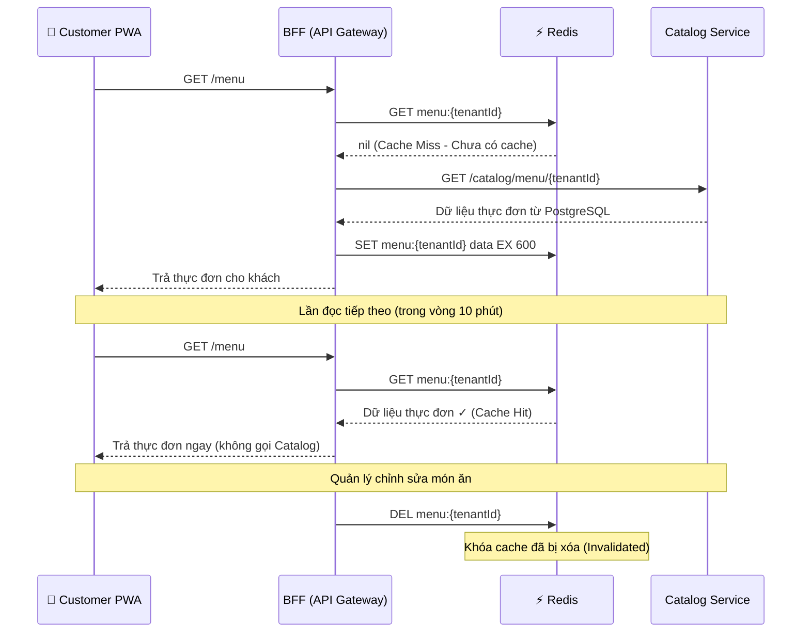

### 5.2 Xóa Bỏ Dữ Liệu Đệm (Cache Invalidation)

Chuyên gia máy tính Phil Karlton từng có câu nói nổi tiếng: _"Chỉ có hai việc khó trong Khoa học Máy tính: Xóa bộ nhớ đệm và đặt tên cho sự vật."_

Trong QRTable, việc xóa cache thực đơn (`DEL menu:{tenantId}`) diễn ra ngay khi quản trị viên thực hiện xong thao tác ghi dữ liệu. Đây là cơ chế **Write-Through Invalidation** — sau khi ghi thành công vào nguồn dữ liệu chính, lập tức xóa khóa cache. Không cần cố gắng ghi đè dữ liệu mới vào cache ngay lúc đó (để tránh xung đột tương tranh giữa các luồng ghi), chỉ cần xóa đi — lần đọc tiếp theo sẽ tự động nạp lại dữ liệu mới nhất.

Nếu thao tác `DEL` vô tình bị lỗi mạng, dữ liệu cũ sẽ chỉ tồn tại tối đa trong phạm vi TTL (10 phút đối với menu). Đây là một sự đánh đổi (trade-off) hoàn toàn chấp nhận được, trong đó TTL đóng vai trò là "tấm lưới bảo hiểm an toàn cuối cùng".

### 5.3 Cache Miss Tuyệt Đối Không Được Làm Lỗi Nghiệp Vụ

Nguyên tắc bất di bất dịch: **Cache Miss phải dẫn đến một luồng dự phòng (Fallback) hợp lệ, tuyệt đối không bao giờ được coi là lỗi nghiệp vụ.**

Nếu máy chủ Redis bị sập hoặc khóa vừa hết hạn, BFF phải tự động gọi sang dịch vụ Catalog để lấy dữ liệu thực đơn trả về cho khách — phản hồi có thể chậm hơn một chút nhưng nghiệp vụ vẫn phải chạy đúng. Đoạn mã đọc Redis nếu không thấy dữ liệu không được phép ném lỗi (throw Exception), mà phải tiếp tục đi vào nhánh fallback.

---

## 6. Khóa Phân Tán (Distributed Lock) — Điều Phối Giữa Các Tiến Trình

### 6.1 Tại Sao Cần Khóa Phân Tán?

Khi nhiều instance của một dịch vụ chạy song song, có những thao tác nghiệp vụ chỉ được phép xảy ra duy nhất một lần tại một thời điểm cho một tài nguyên cụ thể. Trong QRTable có hai trường hợp điển hình:

- **Khóa chuyển bàn (Transfer Lock):** Khi nhân viên thực hiện chuyển bàn cho khách, hệ thống phải khóa cả bàn nguồn và bàn đích trong suốt quá trình thao tác. Nếu hai nhân viên cùng lúc chuyển bàn vào cùng một vị trí trống, dữ liệu sẽ bị xung đột nghiêm trọng.
- **Khóa tái tạo dữ liệu bếp (KDS Rebuild Lock):** Khi dịch vụ Kitchen khởi động lại, nó cần dựng lại trạng thái màn hình bếp từ danh sách các đơn hàng đang xử lý trong PostgreSQL. Nếu nhiều instance cùng chạy lệnh rebuild đồng thời, các vé trùng lặp có thể bị tạo ra trong Redis.

Vấn đề cốt lõi: **Khóa không thể lưu trong RAM cục bộ của một tiến trình**, vì các tiến trình khác hoàn toàn không nhìn thấy được nó. Khóa bắt buộc phải nằm ở một nơi tập trung mà mọi instance đều truy cập được — và Redis chính là lựa chọn tối ưu.

### 6.2 Mô Hình Khóa Chuẩn: SET NX PX + Giá Trị Sở Hữu (Owner Value)

```txt
Xin cấp khóa (Acquire Lock):
  SET transfer:{tenantId}:{sessionId} {requestUUID} NX PX 30000
→ Trả về "OK" nếu giành được khóa thành công, trả về nil nếu đã có người khác giữ khóa

Giải phóng khóa (Release Lock — Bắt buộc kiểm tra quyền sở hữu):
  GET transfer:{tenantId}:{sessionId}
→ Nếu giá trị đọc được == requestUUID → Gọi lệnh DEL (Đúng là khóa của tôi)
→ Nếu giá trị != requestUUID → Không làm gì cả (Khóa cũ đã hết hạn và tiến trình khác đã nhận khóa mới)
```

#### Sơ đồ: Luồng Cấp Và Giải Phóng Khóa Phân Tán An Toàn

> Minh họa hai yêu cầu cùng xin khóa để chuyển bàn. Yêu cầu A đến trước và giữ khóa trong tối đa 30 giây. Yêu cầu B đến sau nhận thông báo xung đột. Khi A hoàn tất, nó kiểm tra mã UUID trước khi xóa — tránh việc xóa nhầm khóa của B nếu yêu cầu A bị trễ và khóa đã tự hết hạn trước đó.

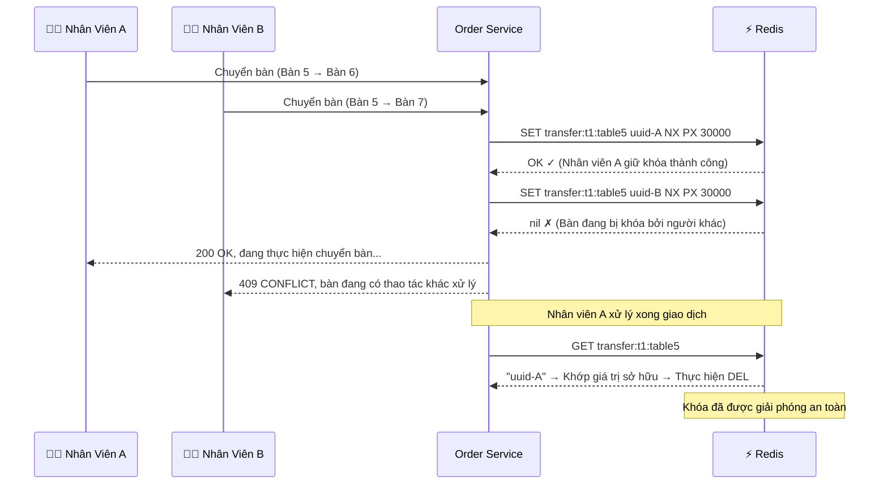

### 6.3 Những Lỗi Phổ Biến Khi Sử Dụng Khóa Phân Tán

1. **Lỗi 1 — Không kiểm tra giá trị sở hữu khi xóa khóa:** Nếu chỉ gọi lệnh `DEL lockKey` một cách mù quáng mà không kiểm tra giá trị bên trong, bạn có nguy cơ xóa nhầm khóa của một tiến trình khác. Ví dụ: Tiến trình A giữ khóa nhưng xử lý quá lâu làm hết hạn TTL 30s; tiến trình B nhảy vào xin khóa mới thành công; đúng lúc đó A hoàn thành và gọi `DEL` -> A đã xóa mất khóa hợp lệ của B!
2. **Lỗi 2 — Đặt TTL của khóa quá dài:** Thao tác chuyển bàn chỉ diễn ra trong vài giây. TTL 30 giây là một khoảng dự phòng an toàn. Nếu bạn đặt TTL lên tới 5 phút, một tiến trình bị treo có thể làm tê liệt toàn bộ thao tác trên chiếc bàn đó trong suốt 5 phút.
3. **Lỗi 3 — Không xử lý tình huống "không lấy được khóa":** Mã nguồn phải có phản hồi rõ ràng khi không giành được khóa — trả về mã lỗi 409 kèm thông báo dễ hiểu cho người dùng, tuyệt đối không để ứng dụng bị treo hoặc im lặng bỏ qua.
4. **Lỗi 4 — Nhồi nhét quá nhiều logic nặng vào bên trong phạm vi khóa:** Khóa chỉ nên bao bọc phần logic thực sự cần tính loại trừ lẫn nhau (Mutual Exclusion), không đưa toàn bộ các tác vụ gọi API bên ngoài hay xử lý nặng vào trong khối giữ khóa.

---

## 7. Redis vs PostgreSQL vs Kafka — Quyết Định Kiến Trúc

### 7.1 Cây Quyết Định (Decision Tree) — Dữ Liệu Này Thuộc Về Đâu?

Trước khi quyết định lưu bất kỳ dữ liệu nào vào Redis, hãy đi qua cây quyết định sau:

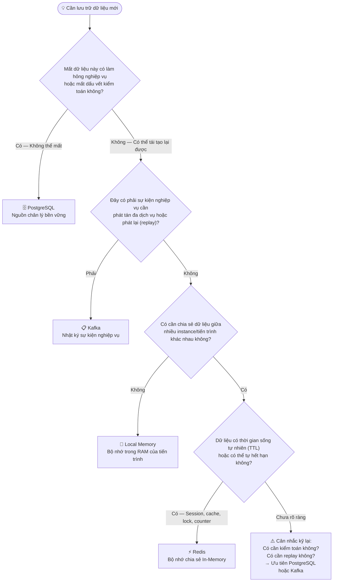

### 7.2 Mẫu Xấu (Anti-Pattern) — Biến Redis Thành Cơ Sở Dữ Liệu Thứ Hai

Sai lầm kinh điển nhất khi mới tiếp cận Redis: Thấy Redis quá nhanh nên bắt đầu lưu trữ tất cả mọi thứ vào Redis. Dần dần, Redis biến thành một cơ sở dữ liệu thứ hai không có cấu trúc chuẩn (schema), không có migration, và không có chiến lược sao lưu định kỳ.

Dấu hiệu nhận biết bạn đang mắc phải Anti-Pattern này:

- Xuất hiện các khóa Redis không có TTL và không có dịch vụ nào chịu trách nhiệm xóa nó.
- Có những khóa Redis mà nếu bị mất, cả đội ngũ phát triển không biết phải phục hồi lại từ đâu.
- Viết mã nguồn ứng dụng để "JOIN" dữ liệu giữa khóa Redis này với khóa Redis khác.
- Dựa vào dữ liệu trong Redis để đưa ra các quyết định nghiệp vụ sống còn mà không có luồng dự phòng (fallback) từ DB chính.

Trong QRTable, mọi khóa Redis quan trọng đều phải thỏa mãn một trong hai điều kiện: **Có TTL rõ ràng**, hoặc **Có mã nguồn xóa tường minh trong dịch vụ sở hữu**.

### 7.3 Bảng So Sánh Theo Từng Tình Huống Sử Dụng

| Tình huống sử dụng                           | Công nghệ lựa chọn    | Lý do kiến trúc                                                                                    |
| :------------------------------------------- | :-------------------- | :------------------------------------------------------------------------------------------------- |
| **Đơn hàng, hóa đơn, thanh toán chính thức** | **PostgreSQL**        | Cần kiểm toán, hỗ trợ giao dịch ACID, tuyệt đối không được mất dữ liệu.                            |
| **Dữ liệu thực đơn chuẩn**                   | **PostgreSQL**        | Nguồn chân lý gốc của dịch vụ Catalog.                                                             |
| **Kết quả xác thực token JWT**               | **Redis (Cache)**     | Dữ liệu ngắn hạn, có thể thẩm định lại bất kỳ lúc nào, tần suất gọi cực cao.                       |
| **Trạng thái giỏ hàng nháp của khách**       | **Redis (Hash)**      | Dữ liệu tạm thời trong lúc chọn món, có thể tạo lại từ đầu nếu mất.                                |
| **Danh sách vé bếp đang hiển thị (KDS)**     | **Redis (Hash/ZSet)** | Dữ liệu phóng chiếu runtime (Projection), có thể dựng lại từ các đơn đang mở trong PostgreSQL.     |
| **Khóa chuyển bàn**                          | **Redis (String NX)** | Cơ chế khóa phân tán chia sẻ giữa các instance của dịch vụ Order.                                  |
| **Bộ đếm hạn ngạch đơn hàng ngày**           | **Redis (INCR)**      | Thao tác tăng số nguyên tử, tự hết hạn theo ngày.                                                  |
| **Sự kiện `order.confirmed`**                | **Kafka**             | Sự kiện nghiệp vụ cần gửi sang bếp và thanh toán, cần khả năng phát lại khi dịch vụ khởi động lại. |
| **Tín hiệu thông báo bếp có món mới**        | **Redis Pub/Sub**     | Tín hiệu tức thời, nếu mất thì client vẫn tự động kéo snapshot định kỳ.                            |
| **Cờ tạm ngưng nhà hàng**                    | **Redis (Flag)**      | Chặn nhanh yêu cầu tại cửa ngõ BFF, dịch vụ SaaS chịu trách nhiệm bật/tắt.                         |

### 7.4 Redis Pub/Sub vs Kafka — Ranh Giới Rõ Ràng

| Tiêu chí                          | Redis Pub/Sub                                                  | Apache Kafka                                                                     |
| :-------------------------------- | :------------------------------------------------------------- | :------------------------------------------------------------------------------- |
| **Lưu trữ dữ liệu (Persistence)** | **Không** — Cơ chế bắn rồi quên (Fire-and-forget).             | **Có** — Lưu trữ bền vững trên đĩa theo thời gian (Retention Policy).            |
| **Khả năng phát lại (Replay)**    | **Không thể**.                                                 | **Có thể** — Dịch chuyển con trỏ (offset) về bất kỳ thời điểm nào trong quá khứ. |
| **Khi bên nhận bị Offline**       | Tin nhắn bị mất vĩnh viễn.                                     | Bên nhận tiếp tục đọc từ vị trí con trỏ cuối cùng sau khi online trở lại.        |
| **Mục đích sử dụng phù hợp**      | Tín hiệu gợi ý runtime, kích hoạt client tải lại dữ liệu.      | Sự kiện nghiệp vụ quan trọng, phản ứng chuỗi giữa các dịch vụ.                   |
| **Triển khai trong QRTable**      | `realtime:kds:{tenantId}` -> Gợi ý cập nhật cho WebSocket BFF. | `order.confirmed`, `payment.completed`, `tenant.created`.                        |

---

## 8. Quy Chuẩn Thiết Kế Khóa Và Đa Nhà Hàng (Multi-tenant)

### 8.1 Quy Tắc Đặt Tên Khóa (Key Naming Convention)

Mọi khóa Redis trong QRTable bắt buộc phải tuân theo định dạng chuẩn:

```txt
{domain}:{tenantId}:{resourceId}
```

Ví dụ thực tế:

```txt
cart:{tenantId}:{sessionId}
session:{tenantId}:{sessionId}
tenant:{tenantId}:suspended
subscription:{tenantId}
kds:{tenantId}:ticket:{ticketId}
quota:{tenantId}:orders:{date}
transfer:{tenantId}:{sessionId}
```

Hai nguyên tắc bắt buộc:

1. **Luôn luôn có `tenantId` khi dữ liệu thuộc về một nhà hàng:** Tuyệt đối không dùng dạng `cart:{sessionId}` — nếu hai nhà hàng vô tình trùng mã `sessionId`, họ sẽ đọc và ghi đè giỏ hàng của nhau. Đây là lỗ hổng an ninh cực kỳ nguy hiểm làm phá vỡ tính cô lập dữ liệu (Tenant Isolation).
2. **Tiền tố miền nghiệp vụ (Domain Prefix) phải nhất quán và có dịch vụ sở hữu:** `menu:{tenantId}` thuộc sở hữu của BFF. `cart:{tenantId}:{sessionId}` thuộc sở hữu của Order. Không dịch vụ nào được tự ý ghi đè vào không gian tên của dịch vụ khác.

### 8.2 Danh Mục Các Khóa Redis Đang Hoạt Động (Key Inventory)

| Mẫu khóa (Key Pattern)                | Dịch vụ sở hữu   | Kiểu dữ liệu    | TTL           | Mục đích sử dụng                                                         |
| :------------------------------------ | :--------------- | :-------------- | :------------ | :----------------------------------------------------------------------- |
| `user-token:{sha256(jwt)}`            | BFF              | String          | 30 phút       | Lưu đệm kết quả xác thực token từ Authorizer.                            |
| `bff-session:{tenantId}:{sessionId}`  | BFF              | String (JSON)   | 2 giờ         | Quản lý phiên khách hàng ẩn danh tại cửa ngõ API.                        |
| `bff-session:{sessionId}`             | BFF              | String (JSON)   | 2 giờ         | Khóa tương thích cũ (Legacy fallback) hỗ trợ tra cứu khi thiếu tenantId. |
| `menu:{tenantId}`                     | BFF              | String (JSON)   | 10 phút       | Lưu đệm thực đơn công khai cho Customer PWA.                             |
| Các khóa Throttle nội bộ              | BFF              | Library-owned   | 60 giây       | Giới hạn tốc độ gọi API (Rate Limiting).                                 |
| `socket.io-adapter:*`                 | BFF              | Pub/Sub nội bộ  | Không áp dụng | Đồng bộ phát tán tin nhắn WebSocket giữa nhiều instance BFF.             |
| `session:{tenantId}:{sessionId}`      | Order            | Hash            | 2 giờ         | Lưu đệm phiên đặt món đang hoạt động của miền Order.                     |
| `cart:{tenantId}:{sessionId}`         | Order            | Hash            | 2 giờ         | Lưu trữ trạng thái giỏ hàng nháp được chia sẻ tại bàn.                   |
| `transfer:{tenantId}:{sessionId}`     | Order            | String Lock     | 30 giây       | Khóa phân tán khi thực hiện chuyển bàn theo phiên.                       |
| `table-transfer:{tenantId}:{tableId}` | Order            | String Lock     | 30 giây       | Khóa bàn nguồn và bàn đích trong quá trình chuyển bàn.                   |
| `quota:{tenantId}:orders:{date}`      | Order            | String Counter  | 48 giờ        | Bộ đếm hạn ngạch số đơn hàng trong ngày của nhà hàng.                    |
| `kds:{tenantId}:*`                    | Kitchen          | Hash/Set/ZSet   | Tùy loại khóa | Lưu trữ vé bếp, hàng đợi chế biến, SLA và chống trùng lặp sự kiện.       |
| `lock:kds:rebuild:{tenantId}`         | Kitchen          | String Lock     | TTL ngắn      | Khóa ngăn chặn nhiều tiến trình cùng tái tạo dữ liệu bếp một lúc.        |
| `realtime:kds:{tenantId}`             | Kitchen / BFF    | Pub/Sub Channel | Không áp dụng | Kênh phát tín hiệu nội bộ khi có thay đổi trong hàng đợi bếp.            |
| `tenant:{tenantId}:suspended`         | SaaS / BFF Guard | String Flag     | Không hết hạn | Cờ chặn nhanh các thao tác của nhà hàng đang bị khóa tại cửa ngõ.        |
| `subscription:{tenantId}`             | SaaS             | String (JSON)   | 5 phút        | Lưu đệm thông tin gói dịch vụ hiện tại của nhà hàng.                     |
| `oauth_state:{state}`                 | Payment          | String (JSON)   | 5 phút        | Lưu trạng thái bảo mật OAuth của SePay (dùng một lần duy nhất).          |

---

## 9. Các Luồng Nghiệp Vụ Chính Trong QRTable

### 9.1 Phiên Khách Hàng Và Giỏ Hàng (Customer Session & Cart)

Đây là "hot path" quan trọng nhất trong hệ thống nhìn từ góc độ Redis:

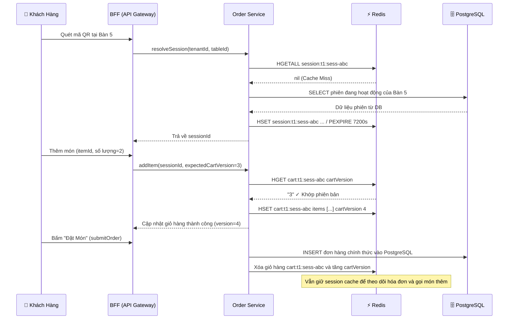

### 9.2 Lưu Đệm Thực Đơn Công Khai (Public Menu Cache)

Luồng hoạt động theo mô hình Cache-Aside kinh điển:

```txt
Khách mở xem thực đơn:
  → BFF kiểm tra khóa: GET menu:{tenantId}
  → Nếu chưa có trong Cache → Gọi Catalog Service lấy từ PostgreSQL
  → BFF ghi vào Redis: SET menu:{tenantId} data EX 600 (Lưu trong 10 phút)
  → Trả thực đơn cho khách

Quản lý chỉnh sửa món ăn / danh mục:
  → Ghi dữ liệu thành công vào PostgreSQL
  → BFF / Catalog chủ động gọi: DEL menu:{tenantId}
  → Lần yêu cầu tiếp theo của khách sẽ tự động nạp lại dữ liệu thực đơn mới nhất
```

### 9.3 Tầng Thực Thi Của Màn Hình Bếp (KDS Runtime)

KDS (Kitchen Display System) là trường hợp sử dụng Redis phức tạp nhất trong hệ thống vì nó kết hợp nhiều cấu trúc dữ liệu:

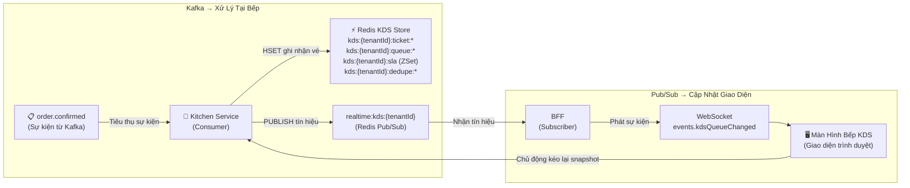

> [!TIP]
> **Chống trùng lặp sự kiện (Idempotency):** Do Kafka đảm bảo cơ chế phân phối "ít nhất một lần" (at-least-once), sự kiện `order.confirmed` có thể bị gửi lặp lại khi dịch vụ tái cân bằng (rebalance). Kitchen Service luôn kiểm tra khóa `kds:{tenantId}:dedupe:{eventId}` trong Redis trước khi tạo vé mới để đảm bảo tính duy nhất.

### 9.4 Cờ Khóa Nhà Hàng Và Lưu Đệm Gói Thuê Bao

```txt
Khi SaaS tạm ngưng dịch vụ một nhà hàng:
→ SaaS gọi lệnh: SET tenant:{tenantId}:suspended "1" (Không đặt TTL)
→ BFF Guard kiểm tra cờ này đầu tiên → Chặn đứng mọi thao tác gọi món ngay tại cửa ngõ

Khi nhà hàng được mở khóa trở lại:
→ SaaS gọi lệnh: DEL tenant:{tenantId}:suspended

Khi thông tin gói thuê bao (subscription) thay đổi:
→ SaaS cập nhật DB bền vững
→ SaaS gọi: SET subscription:{tenantId} {json} EX 300 (hoặc gọi DEL để xóa cache)
```

### 9.5 Trạng Thái Bảo Mật OAuth Của SePay

```txt
Chủ nhà hàng bấm kết nối cổng thanh toán SePay:
→ Dịch vụ Payment tạo chuỗi mã ngẫu nhiên (state)
→ Ghi vào Redis: SET oauth_state:{state} {tenantId, userId, csrf} EX 300 (TTL 5 phút)
→ Chuyển hướng người dùng sang trang ủy quyền của SePay

SePay chuyển hướng quay lại (trong vòng 5 phút):
→ Payment kiểm tra: GET oauth_state:{state}
→ Đối soát hợp lệ tenantId, userId, CSRF Token
→ Xóa khóa ngay lập tức: DEL oauth_state:{state} (Sử dụng 1 lần duy nhất - One-time consume)
→ Tiếp tục hoàn tất liên kết tài khoản

Nếu người dùng xác thực sau 5 phút:
→ Khóa đã tự hủy theo TTL → Trả về lỗi hết hạn và yêu cầu thực hiện lại từ đầu
```

---

## 10. Cấu Hình Và Vận Hành

### 10.1 Khai Báo Trong Môi Trường Local

Trong tệp tin `docker-compose.provider.yaml`:

```yaml
redis:
  image: redis:7-alpine
  ports:
    - '6379:6379'
  healthcheck:
    test: ['CMD', 'redis-cli', 'ping']
    interval: 5s
    timeout: 3s
    retries: 5
  volumes:
    - ./docker/docker_data/redis_data:/data
```

Biến môi trường phía ứng dụng:

```txt
REDIS_HOST=localhost
REDIS_PORT=6379
REDIS_TTL=1800000 # TTL mặc định cho CacheModule (30 phút, tính bằng mili-giây)
```

QRTable sử dụng Redis qua hai hình thức trong mã nguồn:

- `CacheModule` / Keyv Redis: Dùng cho các tầng cache đơn giản tại controller/guard.
- `ioredis` Client trực tiếp: Dùng khi cần các thao tác chuyên sâu như `SET EX`, `DEL`, khóa phân tán, Pub/Sub và xử lý hàng đợi bếp KDS.

### 10.2 Cơ Chế Lưu Trữ Đĩa (Persistence): RDB Và AOF

Mặc dù Redis là In-Memory Store, nó hỗ trợ hai cơ chế ghi dữ liệu xuống đĩa để phục hồi khi khởi động lại:

- **RDB (Redis Database Snapshots):** Định kỳ sao chụp toàn bộ dữ liệu trong RAM vào tệp nhị phân trên đĩa. Khởi động lại rất nhanh nhưng có thể mất dữ liệu phát sinh giữa hai lần chụp.
- **AOF (Append Only File):** Ghi nhật ký mọi câu lệnh ghi vào tệp tin. Rất an toàn, ít mất dữ liệu nhưng tệp tin có thể phình to và tốn tài nguyên I/O hơn.

> [!NOTE]
> QRTable được thiết kế với tư duy: **Redis có thể mất và tự dựng lại được**. Do đó, không bao giờ được coi cơ chế ghi đĩa của Redis là nơi lưu trữ dữ liệu an toàn thay thế cho PostgreSQL.

### 10.3 Chính Sách Giải Phóng Bộ Nhớ (Eviction Policy Khi Đạt Maxmemory)

Khi Redis chạm ngưỡng dung lượng bộ nhớ tối đa (`maxmemory`), tham số `maxmemory-policy` sẽ quyết định cách ứng xử:

| Chính sách (Policy) | Ý nghĩa ngắn gọn                                                           | Lưu ý trong hệ thống QRTable                                                                  |
| :------------------ | :------------------------------------------------------------------------- | :-------------------------------------------------------------------------------------------- |
| `noeviction`        | Không tự xóa khóa nào; các lệnh ghi mới sẽ báo lỗi bộ nhớ đầy.             | An toàn cho các khóa nghiệp vụ quan trọng, bắt buộc phải giám sát dung lượng RAM.             |
| `allkeys-lru`       | Tự động xóa các khóa ít được dùng nhất (LRU) trên toàn bộ không gian khóa. | **Nguy hiểm** vì có thể xóa nhầm các khóa phân tán hoặc cờ tạm ngưng nhà hàng đang hoạt động. |
| `volatile-lru`      | Chỉ tự động xóa các khóa **có thiết lập TTL** theo thuật toán LRU.         | **Khuyến nghị nhất** cho môi trường sản xuất khi các khóa quan trọng đều không có TTL.        |
| `allkeys-random`    | Xóa ngẫu nhiên các khóa để lấy chỗ trống.                                  | Hoàn toàn không thể dự đoán, tuyệt đối không sử dụng.                                         |

### 10.4 Các Lệnh Debug An Toàn vs Lệnh Nguy Hiểm

Các lệnh hữu ích khi kiểm tra và gỡ lỗi qua `redis-cli`:

```bash
# Kết nối vào container Redis
docker exec -it redis redis-cli

# Kiểm tra kiểu dữ liệu của một khóa
TYPE cart:tenant-1:session-1

# Xem thời gian sống còn lại (tính bằng giây); -1 = không có TTL; -2 = khóa không tồn tại
TTL cart:tenant-1:session-1

# Đọc toàn bộ nội dung của một Hash
HGETALL cart:tenant-1:session-1

# Đọc nội dung chuỗi String
GET tenant:tenant-1:suspended

# Quét danh sách khóa theo tiền tố (An toàn, không làm nghẽn hệ thống)
SCAN 0 MATCH "cart:tenant-1:*" COUNT 100

# Xem thống kê bộ nhớ và chính sách hiện tại
INFO memory
CONFIG GET maxmemory-policy
```

> [!CAUTION]
> **Các lệnh CẤM sử dụng trên môi trường Production:**
>
> - `KEYS *`: Quét toàn bộ khóa trên luồng chính, gây "đóng băng" (block) Redis nếu có hàng triệu bản ghi.
> - `FLUSHDB` / `FLUSHALL`: Xóa sạch toàn bộ cơ sở dữ liệu ngay lập tức.
> - `MONITOR`: In ra mọi câu lệnh đang chạy theo thời gian thực, gây suy giảm hiệu năng nghiêm trọng.

---

## 11. Tổng Kết Mental Model (Mô Hình Tư Duy)

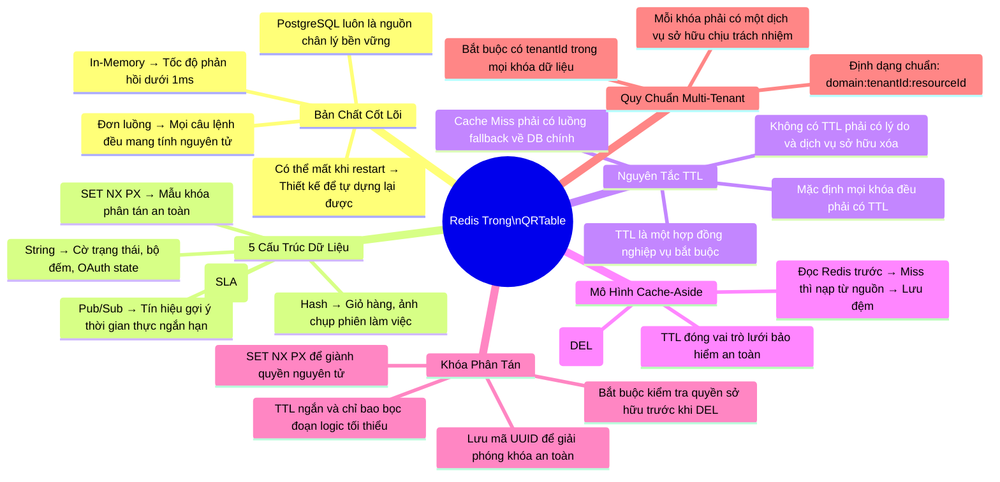

### Tóm Tắt Nhanh Các Khóa Cốt Lõi (Cheat Sheet)

| Khóa (Key Pattern)                   | Kiểu dữ liệu     | TTL       | Dịch vụ sở hữu | Lưu ý quan trọng                                              |
| :----------------------------------- | :--------------- | :-------- | :------------- | :------------------------------------------------------------ |
| `user-token:{sha256(jwt)}`           | String           | 30m       | BFF            | Tự động thẩm định lại qua Authorizer khi hết hạn.             |
| `bff-session:{tenantId}:{sessionId}` | String           | 2h        | BFF            | Phiên khách hàng ẩn danh tại cửa ngõ API.                     |
| `menu:{tenantId}`                    | String           | 10m       | BFF            | Xóa đệm ngay khi quản trị viên cập nhật thực đơn.             |
| `session:{tenantId}:{sessionId}`     | Hash             | 2h        | Order          | Dựng lại từ PostgreSQL khi bị Cache Miss.                     |
| `cart:{tenantId}:{sessionId}`        | Hash             | 2h        | Order          | Bắt buộc đối soát `cartVersion` để chống xung đột ghi đè.     |
| `transfer:{tenantId}:{sessionId}`    | String Lock      | 30s       | Order          | Dùng `SET NX PX`, bắt buộc kiểm tra UUID trước khi `DEL`.     |
| `quota:{tenantId}:orders:{date}`     | String Counter   | 48h       | Order          | Tăng số nguyên tử qua lệnh `INCR`.                            |
| `kds:{tenantId}:*`                   | Hash/ZSet/String | Tùy loại  | Kitchen        | Khử trùng lặp sự kiện Kafka trước khi tạo vé mới.             |
| `tenant:{tenantId}:suspended`        | String Flag      | Không TTL | SaaS           | Dịch vụ SaaS chịu trách nhiệm `SET` khi khóa và `DEL` khi mở. |
| `subscription:{tenantId}`            | String           | 5m        | SaaS           | Xóa đệm ngay khi gói dịch vụ của nhà hàng thay đổi.           |
| `oauth_state:{state}`                | String           | 5m        | Payment        | Dùng 1 lần duy nhất, xóa ngay sau khi xác thực thành công.    |

---

> **Lưu ý về nguồn tham khảo:** Tài liệu này được biên soạn dựa trên việc đối chiếu mã nguồn thực tế của QRTable trên nhánh `main` với tài liệu chính thức của Redis (thông qua Context7). Khi có sự khác biệt giữa tài liệu này và mã nguồn đang chạy, hãy ưu tiên mã nguồn và các tài liệu kiến trúc canonical, sau đó cập nhật lại bản hướng dẫn này.
