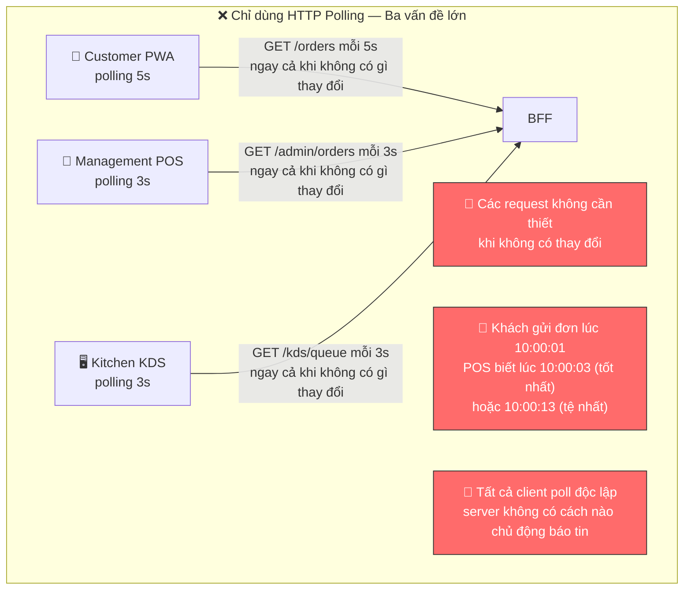
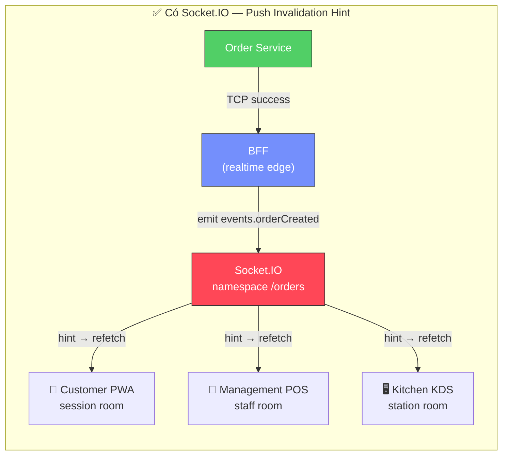
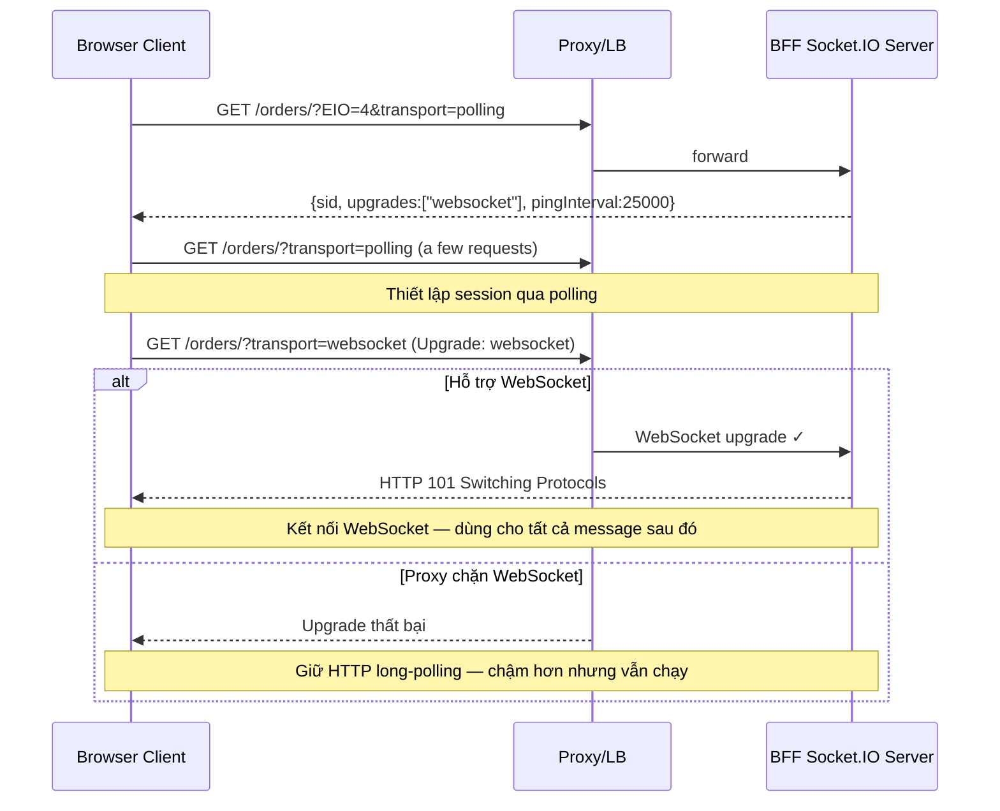
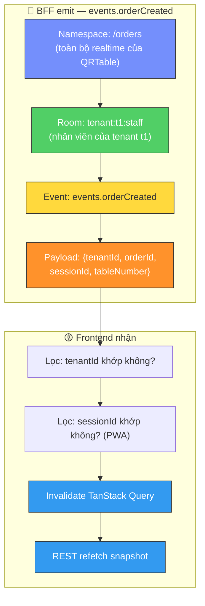
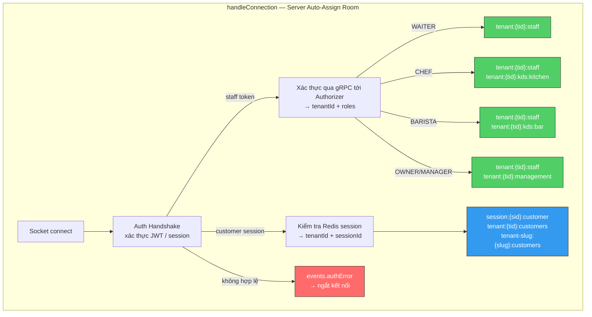
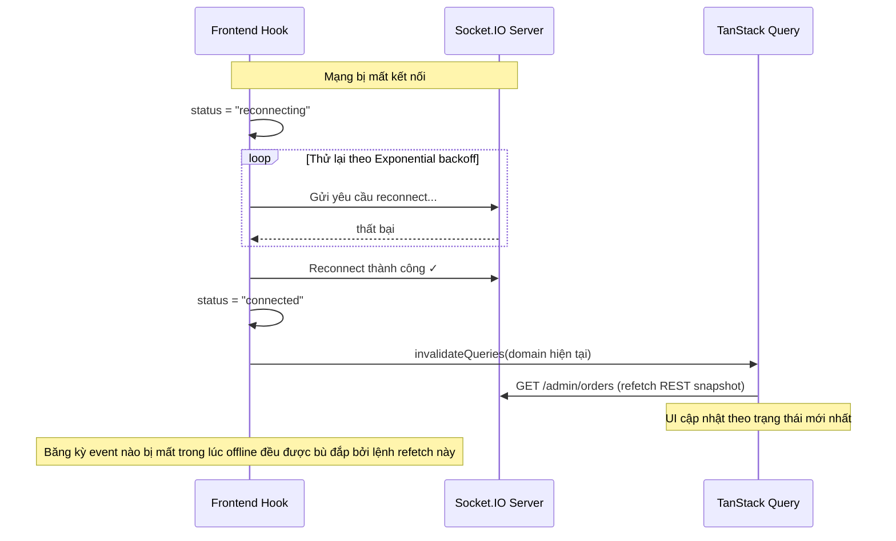
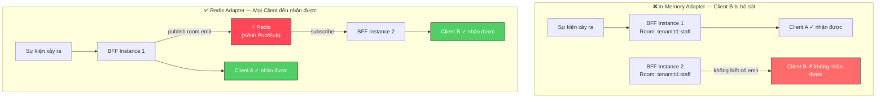
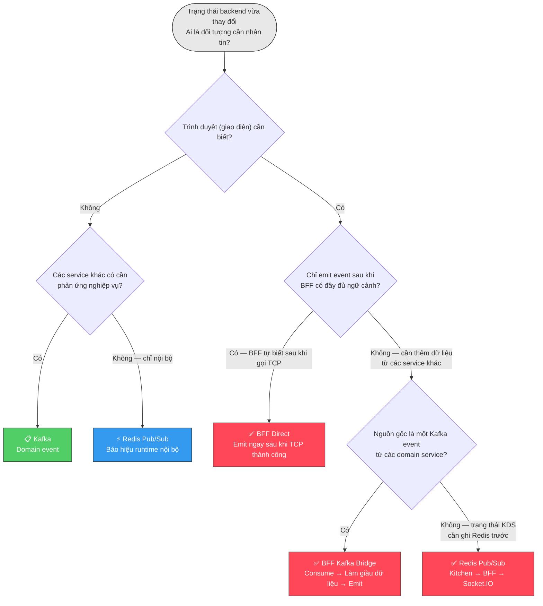

# WebSocket & Socket.IO: Lý thuyết chuyên sâu — Dành cho QRTable

> **Triết lý tài liệu:** Hiểu rõ _tại sao (why)_ trước khi học _như thế nào (how)_. Mọi khái niệm đều được gắn kết với bối cảnh cụ thể của QRTable để bạn không chỉ học lý thuyết suông mà có thể áp dụng được ngay lập tức.
>
> **Trạng thái code hiện tại (14-05-2026):** Tài liệu này đóng vai trò là hướng dẫn hỗ trợ. QRTable sử dụng Socket.IO `4.8.3` thông qua BFF Gateway namespace `/orders`. BFF sẽ tự động chỉ định các room dựa trên JWT staff hoặc session customer đã được xác thực — client không được phép tự chọn room. Frontend nhận event dưới dạng _invalidation hint_ (gợi ý làm mới), sau đó dùng TanStack Query để refetch REST snapshot. BFF sử dụng Socket.IO Redis Adapter để fan-out khi chạy nhiều instance. Không có durable replay (phát lại tin nhắn) cho client bị mất kết nối — khi kết nối lại (reconnection) bắt buộc phải refetch REST snapshot.

---

## Mục lục

1. [Vấn đề mà Socket.IO giải quyết](#1-van-de-ma-socketio-giai-quyet)
2. [Bản chất của Socket.IO - Không phải WebSocket thuần túy](#2-ban-chat-cua-socketio---khong-phai-websocket-thuan-tuy)
3. [Giải phẫu của một Realtime Event](#3-giai-phau-cua-mot-realtime-event)
4. [Kiến trúc Realtime: BFF là Edge duy nhất](#4-kien-truc-realtime-bff-la-edge-duy-nhat)
5. [Namespace, Room và việc gán Room từ Server](#5-namespace-room-va-viec-gan-room-tu-server)
6. [Event Registry — Danh sách và Ý nghĩa](#6-event-registry--danh-sach-va-y-nghia)
7. [Frontend Contract — Chỉ là Hint, không phải Source of Truth](#7-frontend-contract--chi-la-hint-khong-phai-source-of-truth)
8. [Redis Adapter — Scale nhiều BFF Instance](#8-redis-adapter--scale-nhieu-bff-instance)
9. [Quyết định kiến trúc: Socket.IO vs Kafka vs Redis Pub/Sub vs Polling](#9-quyet-dinh-kien-truc-socketio-vs-kafka-vs-redis-pubsub-vs-polling)
10. [Cấu hình và Vận hành](#10-cau-hinh-va-van-hanh)
11. [Lộ trình đọc hiểu mã nguồn & Giải thích cấu hình thực tế](#11-lo-trinh-doc-hieu-ma-nguon-va-giai-thich-cau-hinh-thuc-te)
12. [Tóm tắt Mental Model](#12-tom-tat-mental-model)

---

## 1. Vấn đề mà Socket.IO giải quyết

Trước khi tìm hiểu Socket.IO là gì, bạn cần hiểu rõ vấn đề mà nó giải quyết trong QRTable. Nếu bỏ qua phần này, bạn sẽ có xu hướng sử dụng Socket.IO như một Kafka thứ hai hoặc ngược lại, mà không biết khi nào thực sự cần đến nó.

### 1.1 Vấn đề gốc rễ: Nhiều màn hình, Một nhà hàng, Dữ liệu phải đồng nhất

QRTable là một hệ thống vận hành nhà hàng — không phải là một trang thống kê số liệu cập nhật mỗi giờ một lần. Tại bất kỳ thời điểm nào trong ca làm việc, có rất nhiều màn hình đang mở đồng thời:

- Customer PWA trên điện thoại của khách hàng bàn 5
- POS của nhân viên phục vụ đang cầm máy tính bảng
- KDS trên màn hình nhà bếp (kitchen)
- KDS trên màn hình quầy pha chế (bar)

Khi khách hàng bàn 5 nhấn "Gửi đơn hàng" (Submit Order), điều gì xảy ra? POS của nhân viên cần biết để xác nhận. KDS của nhà bếp cần biết để bắt đầu chế biến. Nếu hệ thống không có realtime, hai màn hình còn lại sẽ phải ngồi đợi lượt polling tiếp theo — có thể là 3 giây, có thể là 10 giây.

Không có realtime, hệ thống vẫn _chính xác (correct)_ nhưng vận hành sẽ cho cảm giác chậm chạp. Trong một nhà hàng đông khách, sự chậm trễ 5 giây có thể khiến nhân viên làm việc trên dữ liệu cũ và nhà bếp bắt đầu làm sai món.

#### Sơ đồ: QRTable khi không có Realtime — Vấn đề của Polling

> Minh họa ba màn hình thực hiện polling độc lập. Mỗi màn hình hỏi backend theo các khoảng thời gian riêng — tiêu thụ request ngay cả khi không có thay đổi nào, và vẫn phản ứng chậm khi có thay đổi thực tế.



#### Sơ đồ: Có Socket.IO — Server chủ động thông báo (Push Invalidation Hint)

> Với Socket.IO, server không đợi client hỏi. Khi trạng thái thay đổi, BFF emit event tới đúng room. Các màn hình liên quan nhận được hint ngay lập tức và tiến hành refetch REST snapshot. Không còn polling vô nghĩa khi không có thay đổi.



Socket.IO giải quyết vấn đề này bằng cách đảo ngược quy trình: **server chủ động thông báo cho client khi có thay đổi, thay vì client phải hỏi định kỳ**. Điều này giúp giảm các request vô ích và giảm độ trễ xuống gần như bằng không.

### 1.2 Khi nào Socket.IO KHÔNG phải là giải pháp

Socket.IO không phải là câu trả lời cho mọi nhu cầu realtime. Việc biết khi nào _không_ nên dùng nó cũng quan trọng như biết khi nào nên dùng:

**Không dùng Socket.IO cho các business command:** Gửi order (submit order), xác nhận/hủy order, bắt đầu/hoàn thành KDS ticket, chuyển bàn — tất cả phải đi qua REST → BFF → TCP service. Không dùng WebSocket cho các mutation vì chúng yêu cầu guard, validation DTO, transaction, audit log, và tính idempotency. Socket.IO là một kênh thông báo (notification channel), không phải là một API mutation.

**Không dùng Socket.IO thay thế cho Kafka:** Khi Kitchen service cần phản ứng sau khi Order service commit, đó là một domain event giữa các service. Kafka mới là lựa chọn đúng đắn. WebSocket là một edge UI — không phải là một message bus ở backend.

**Không dùng Socket.IO khi cần durable replay (lưu trữ và phát lại tin nhắn):** Event Socket.IO hoạt động theo cơ chế fire-and-forget (gửi và quên). Nếu client đang offline khi event được kích hoạt, event đó sẽ bị mất vĩnh viễn. Đối với các domain event backend, cần đảm bảo xử lý ngay cả khi consumer bị sập, sử dụng Kafka/outbox.

**Không dùng Socket.IO để che giấu lỗi của source of truth:** Nếu REST snapshot trả về kết quả sai, đừng sửa nó bằng cách vá (patch) giao diện trực tiếp từ payload của realtime event. Bạn phải sửa ở service Owner chịu trách nhiệm về dữ liệu đó.

---

## 2. Bản chất của Socket.IO — Không phải WebSocket thuần túy

### 2.1 Hiểu lầm phổ biến: Socket.IO ≠ WebSocket

Sai lầm phổ biến nhất là nghĩ Socket.IO chỉ là "WebSocket với cú pháp dễ dùng hơn". Socket.IO thực chất là một thư viện realtime chạy trên **Engine.IO**, một lớp transport riêng biệt — và WebSocket chỉ là _một trong những transport_ mà Engine.IO có thể sử dụng.

Khi client kết nối, Socket.IO không đi thẳng vào WebSocket ngay. Nó bắt đầu bằng **HTTP long-polling**, trao đổi thông tin về khả năng kết nối (capabilities), sau đó mới _nâng cấp (upgrade)_ lên WebSocket nếu cả hai đầu đều hỗ trợ. Quá trình này được gọi là transport negotiation (đàm phán phương thức truyền tải).

```txt
1. Client gửi request HTTP GET polling
2. Server trả về thông tin session (sid, upgrades, pingInterval...)
3. Client gửi thêm vài request polling để thiết lập
4. Nếu có hỗ trợ WebSocket → upgrade (HTTP → WS)
5. Sau khi upgrade, sử dụng WebSocket cho tất cả các message tiếp theo
```

Hiểu được điều này rất quan trọng vì: nếu một proxy/firewall chặn upgrade WebSocket, Socket.IO vẫn hoạt động được qua long-polling — chậm hơn nhưng không bị chặn hoàn toàn.

#### Sơ đồ: Transport Negotiation — Từ Polling nâng cấp lên WebSocket

> Mỗi kết nối Socket.IO bắt đầu bằng HTTP polling để thương lượng, sau đó nâng cấp lên WebSocket. Nếu quá trình nâng cấp thất bại (do proxy chặn), Socket.IO duy trì kết nối ở dạng HTTP long-polling — hiệu năng giảm nhưng vẫn hoạt động. Đây là lý do Socket.IO hoạt động bền bỉ hơn WebSocket thuần túy trong các môi trường thực tế.



### 2.2 Socket.IO bổ sung những gì so với WebSocket thuần túy

WebSocket thuần túy chỉ là một giao thức kết nối hai chiều — không có room, không có namespace, không tự động reconnect, không có fallback. Nếu QRTable dùng WebSocket thuần túy, đội ngũ phát triển phải tự xây dựng lại tất cả:

| Tính năng                  | WebSocket thuần túy | Socket.IO                 |
| -------------------------- | ------------------- | ------------------------- |
| Tự động reconnect          | Tự xây dựng         | Có sẵn, cấu hình được     |
| Fallback transport         | Không có            | Tự động dùng long-polling |
| Room (nhóm socket)         | Tự xây dựng         | Có sẵn                    |
| Namespace                  | Không có            | Có sẵn                    |
| Acknowledgement (callback) | Tự xây dựng         | Có sẵn                    |
| Multi-server adapter       | Tự xây dựng         | Redis Adapter             |
| Mã hóa Binary/JSON         | Tự xử lý thủ công   | Có sẵn                    |

QRTable cần các tính năng như room (phân quyền theo tenant/role/station), namespace (phân tách các domain realtime), reconnect (khi mạng chập chờn), và Redis Adapter (khi chạy nhiều BFF instance). Sử dụng Socket.IO giúp chúng ta có sẵn các tính năng này thay vị tự viết lại.

### 2.3 Những gì Socket.IO KHÔNG cung cấp

Socket.IO không phải là một giải pháp vạn năng. Điều quan trọng cần hiểu là những giới hạn của nó:

**Không lưu trữ tin nhắn bền vững (durable message storage):** Các event sau khi emit đi là xong — không được lưu lại để các client offline có thể đọc sau. Đây là điểm khác biệt cốt lõi so với Kafka.

**Không đảm bảo phân phát chính xác một lần (no exactly-once delivery):** Socket.IO sử dụng cơ chế at-most-once (tối đa một lần) cho các emit thông thường. Acknowledgment giúp biết một bên đã nhận, nhưng không đảm bảo trạng thái cho toàn bộ hệ thống.

**Không tích hợp sẵn phân quyền (no built-in authorization):** Gán room, handshake xác thực, cô lập tenant (tenant isolation) — tất cả đều là trách nhiệm của mã nguồn ứng dụng, không phải của Socket.IO.

QRTable chấp nhận cơ chế at-most-once cho UI hint vì: **việc mất event không làm hỏng dữ liệu — client chỉ cập nhật chậm hơn một chút, và sẽ refetch dữ liệu chính xác khi kết nối lại hoặc khi người dùng quay lại ứng dụng**.

---

## 3. Giải phẫu của một Realtime Event

Mọi giao tiếp trong Socket.IO của QRTable đều có cấu trúc rõ ràng. Hiểu rõ từng lớp giúp debug nhanh hơn và thiết kế các event mới chính xác hơn.

### 3.1 Bốn lớp của một Event

```txt
Namespace   : /orders
Không gian realtime chứa toàn bộ giao tiếp của QRTable

Room        : tenant:t1:staff
Nhóm socket nhận event — server tự suy luận ra, client không được tự chọn

Event name  : events.orderCreated
Tên chuỗi để client đăng ký lắng nghe (listener)

Payload     : { tenantId, orderId, sessionId, tableNumber, ... }
Dữ liệu để client filter và biết query nào cần được invalidate
```

#### Sơ đồ: Cấu trúc của một lệnh Emit từ BFF

> Bốn cấp độ của một lệnh emit: BFF gọi `server.to(room).emit(eventName, payload)`. Redis Adapter đảm bảo fan-out room qua tất cả instance. Client nhận event và sử dụng payload để lọc + invalidate query.



### 3.2 Payload chỉ dùng để lọc, không dùng để render UI

Đây là nguyên tắc quan trọng nhất trong toàn bộ thiết kế realtime của QRTable:

**Payload event chỉ dùng để quyết định _có refetch hay không_ và quyết định _query nào cần refetch_ — không dùng để render trực tiếp lên UI.**

Lý do: payload có thể bị thất lạc (mất kết nối), đến muộn (sau khi trạng thái đã thay đổi lần nữa), hoặc thiếu trường (khi thay đổi schema). REST snapshot từ service Owner luôn là source of truth cuối cùng và an toàn nhất.

```txt
✅ Đúng:
  socket.on('events.orderCreated', (payload) => {
    if (payload.tenantId !== myTenantId) return;  // lọc
    queryClient.invalidateQueries(['orders', tenantId]);  // kích hoạt refetch
  });

❌ Sai:
  socket.on('events.orderCreated', (payload) => {
    setOrders(prev => [...prev, payload.order]);  // render trực tiếp từ payload
  });
```

### 3.3 Khả năng phân phát (Delivery Semantics) — Tại sao event có thể bị mất

Socket.IO với cấu hình mặc định có ngữ nghĩa **at-most-once** (tối đa một lần): các event được emit đi một lần, client có thể nhận được hoặc không. Không có cơ chế tự động gửi lại (retry) cho các emit thông thường.

Các tình huống event có thể không đến được client:

| Tình huống                     | Hệ quả                               | Cách xử lý của QRTable                 |
| ------------------------------ | ------------------------------------ | -------------------------------------- |
| Client offline khi emit        | Event bị mất vĩnh viễn               | Kết nối lại → refetch active domain    |
| Client đang reconnect          | Event emit trong lúc này bị trôi qua | Refetch sau khi kết nối lại thành công |
| Mạng chập chờn                 | Mất gói tin → event không đến được   | Socket.IO reconnect → refetch          |
| BFF instance emit sai instance | Redis Adapter fan-out không bao phủ  | Redis Adapter giải quyết vấn đề này    |

Thiết kế của QRTable chấp nhận cơ chế at-most-once vì mọi trạng thái đều có một REST snapshot làm điểm tựa an toàn. Mất event → UI chỉ cập nhật chậm hơn một chút, chứ không bị sai dữ liệu.

---

## 4. Kiến trúc Realtime: BFF là Edge duy nhất

### 4.1 Tại sao BFF là điểm duy nhất kết nối trực tiếp tới Browser

Trong QRTable, không có service nào khác ngoài BFF được phép giao tiếp trực tiếp với browser qua WebSocket. Kitchen service, Order service, Payment service — tất cả đều phải thông qua BFF.

Lý do kiến trúc:

**Ranh giới bảo mật (Security boundary):** BFF là nơi duy nhất có đầy đủ ngữ cảnh để xác thực JWT, phân giải session, và biết room nào phù hợp với client đang kết nối. Nếu Kitchen service emit trực tiếp, nó sẽ phải biết socket ID của từng client — điều này vi phạm nguyên tắc phân tách trách nhiệm (separation of concerns).

**Làm giàu dữ liệu (Enrichment):** Kafka event từ Payment service chỉ chứa `paymentId`, nhưng browser cần có `sessionId` để biết cần emit vào room nào. BFF là nơi duy nhất có thể làm giàu dữ liệu bằng cách gọi Order service — các service như Kitchen hay Payment không cần biết về cấu trúc của session.

**Giảm phụ thuộc (Decoupling):** Nếu sau này chúng ta thay thế Socket.IO bằng một công nghệ khác, chúng ta chỉ cần sửa ở BFF. Các service còn lại không cần biết gì về các giao thức truyền thông với browser.

### 4.2 Ba luồng kích hoạt Emit khác nhau

Không phải mọi event đều có cùng nguồn gốc. QRTable áp dụng ba pattern khác nhau tùy thuộc vào loại event:

#### Sơ đồ: Ba luồng Emit — BFF Direct, Kafka Bridge, Redis Pub/Sub

> Ba luồng emit khác nhau phục vụ cho ba loại event khác nhau. Điểm chung: đều đi qua BFF trước khi đến browser. Điểm khác biệt: nguồn kích hoạt và thời điểm emit khác nhau.

```mermaid
graph TB
subgraph "Luồng 1: BFF Direct (sau khi TCP thành công)"
        FE1["Frontend\nREST command"]
        BFF1["BFF Controller"]
        SVC1["Order/Kitchen Service\n(TCP)"]
        WS1["Socket.IO emit"]

        FE1 -->|"POST /orders"| BFF1
        BFF1 -->|"TCP gRPC"| SVC1
        SVC1 -->|"success response"| BFF1
        BFF1 -->|"events.orderCreated / events.orderStatusChanged"| WS1
    end

subgraph "Luồng 2: Kafka Bridge (domain events)"
        KFK["Kafka\npayment.completed\nkitchen.sla_warning"]
        BFF2["BFF Kafka Bridge"]
        ENR["Enrich: call Order\nđể lấy sessionId"]
        WS2["Socket.IO emit"]

        KFK -->|"consume"| BFF2
        BFF2 --> ENR
        ENR -->|"events.paymentCompleted\nevents.kitchenSlaWarning"| WS2
    end

subgraph "Luồng 3: Redis Pub/Sub (KDS nội bộ)"
        KS["Kitchen Service"]
        RKV["Redis KDS State\n(ghi ticket/queue)"]
        RPB["Redis Pub/Sub\nrealtime:kds:{tenantId}"]
        BFF3["BFF KDS Subscriber"]
        WS3["Socket.IO emit"]

        KS --> RKV
        KS -->|"PUBLISH"| RPB
        RPB -->|"subscribe"| BFF3
        BFF3 -->|"events.kdsQueueChanged"| WS3
    end

    style WS1 fill:#ff4757,stroke:#333,color:#fff
    style WS2 fill:#ff4757,stroke:#333,color:#fff
    style WS3 fill:#ff4757,stroke:#333,color:#fff
    style KFK fill:#51cf66,stroke:#333,color:#fff
    style RPB fill:#339af0,stroke:#333,color:#fff
```



### 4.3 Tại sao KDS không dùng Kafka trực tiếp để emit event

Một câu hỏi tự nhiên: tại sao KDS không dùng event Kafka `order.confirmed` để emit luôn `events.kdsQueueChanged`? Tại sao phải đi vòng qua Redis Pub/Sub?

**Lý do:** Khi BFF consume `order.confirmed` từ Kafka, Kitchen service _có thể chưa hoàn thành việc xử lý_ — tức là chưa kịp ghi dữ liệu KDS ticket vào Redis. Nếu BFF emit `events.kdsQueueChanged` ngay lúc này, frontend sẽ refetch dữ liệu nhưng chưa thấy ticket mới trong queue. **State hint chỉ được phát sau khi state thực tế đã tồn tại.**

Luồng xử lý đúng: Kitchen consume Kafka → ghi KDS vào Redis → publish qua Redis Pub/Sub → BFF emit event → frontend refetch (lúc này ticket chắc chắn đã nằm trong Redis).

---

## 5. Namespace, Room và việc gán Room từ Server

### 5.1 Namespace `/orders` — Không gian duy nhất

QRTable sử dụng một namespace duy nhất:

```txt
/orders
```

Cấu hình Gateway hiện tại:

```ts
@WebSocketGateway({ cors: { origin: '*' }, namespace: '/orders' })
export class OrderEventsGateway implements OnGatewayConnection {}
```

Frontend lấy URL namespace dựa trên BFF origin:

```ts
// REST base:   http://localhost:3300/api/v1
// Socket URL: http://localhost:3300/orders ← không có /api/v1
const url = new URL(API_CONFIG.DEFAULT_BFF_URL);
const socketUrl = `${url.origin}/orders`;
```

**Lỗi thường gặp:** Sử dụng `http://localhost:3300/api/v1/orders` — sẽ bị lỗi 404 vì namespace không có tiền tố `/api/v1`. Namespace là một route kết nối realtime riêng, không phải REST route.

Hệ thống không có kế hoạch tạo thêm namespace riêng biệt cho `/kds` — KDS sử dụng chung namespace `/orders` và phân quyền dựa trên room + filter của event.

### 5.2 Room — Server tự suy luận, Client không tự chọn

Room là nhóm socket để BFF emit tới đúng đối tượng nhận. Nguyên tắc bất di bất dịch: **client không gửi lên tên room, server tự suy luận ra từ dữ liệu đã xác thực**.

Tại sao không tin tưởng client? Nếu client được phép gửi tên room `tenant:other-tenant:staff` để join, họ sẽ nhận được toàn bộ event của các tenant khác — đây là lỗ hổng bảo mật nghiêm trọng trong kiến trúc multi-tenant.

Quá trình gán room diễn ra trong `handleConnection` sau khi handshake xác thực thành công:

#### Sơ đồ: Gán Room dựa trên Role

> Server tự động gán socket vào các room ngay sau khi kết nối dựa trên role/session đã xác thực. Client không gửi bất kỳ tên room nào. Các event cũ như `join.staff` hay `join.session` đều bị từ chối.



Bảng phân bổ room chi tiết cho từng actor:

| Actor / Role               | Các Room được join                                                                                             |
| -------------------------- | -------------------------------------------------------------------------------------------------------------- |
| Customer sessions          | `session:{sessionId}:customer`, `tenant:{tenantId}:customers`, optionally `tenant-slug:{tenantSlug}:customers` |
| WAITER                     | `tenant:{tenantId}:staff`                                                                                      |
| CHEF                       | `tenant:{tenantId}:staff`, `tenant:{tenantId}:kds:kitchen`                                                     |
| BARISTA                    | `tenant:{tenantId}:staff`, `tenant:{tenantId}:kds:bar`                                                         |
| Owner / MANAGER            | `tenant:{tenantId}:staff`, `tenant:{tenantId}:management`                                                      |
| Owner / MANAGER opt-in KDS | `tenant:{tenantId}:kds:kitchen` hoặc `tenant:{tenantId}:kds:bar` thông qua `subscribe.kds`                     |

### 5.3 Auth Handshake: Staff vs Customer

**Staff (Management App)** gửi kèm JWT trong trường `auth`:

```ts
io('http://localhost:3300/orders', {
  auth: { token: accessToken },
  transports: ['websocket', 'polling'],
});
```

BFF xác thực token thông qua gRPC tới Authorizer, cache kết quả trong Redis, suy luận ra `tenantId` và danh sách roles.

**Customer (PWA)** gửi thông tin session định danh:

```ts
io('http://localhost:3300/orders', {
  auth: { tenantId, sessionId, tenantSlug },
});
```

BFF kiểm tra key session trong Redis theo `tenantId`. Nếu không tồn tại → emit `events.authError` → ngắt kết nối.

BFF cũng hỗ trợ fallback headers (`Authorization: Bearer` / `x-tenant-id` / `x-session-id`) cho các trường hợp cấu hình `auth` gặp sự cố, nhưng Socket.IO `auth` vẫn là kênh chính quy (canonical).

### 5.4 `subscribe.kds` — Đăng ký thêm (Opt-in) cho Owner/MANAGER

`subscribe.kds` là event duy nhất được gửi từ phía client (ngoài handshake xác thực), dành cho các Owner/MANAGER muốn theo dõi một KDS station cụ thể:

```ts
socket.emit('subscribe.kds', { station: 'KITCHEN' | 'BAR' });
```

Điều kiện tiên quyết:

- Socket đã có `tenantId` từ handshake xác thực trước đó.
- Role phải thuộc nhóm `SUPER_ADMIN`, `Owner`, hoặc `MANAGER`.
- CHEF/BARISTA không được phép dùng `subscribe.kds` để đăng ký xem các station khác.

---

## 6. Event Registry — Danh sách và Ý nghĩa

### 6.1 Quy tắc đặt tên

Các event hiện tại sử dụng hai phong cách:

```txt
events.orderCreated          ← domain event, bắt đầu bằng "events."
tenant.suspended             ← lifecycle event, tiền tố là tên domain tương ứng
```

Không tự ý thêm các biến thể tên khác nhau cho cùng một ý nghĩa. Trước khi thêm một event mới, đặc tả (spec) của nó phải được phê duyệt theo quy trình tại [Mục 10.3](#103-quy-tac-khi-them-event-moi).

### 6.2 Các Event về Order / Session / Bill

| Event                       | Nguồn kích hoạt                        | Các Room nhận                                  | Hành động ở Frontend                       |
| --------------------------- | -------------------------------------- | ---------------------------------------------- | ------------------------------------------ |
| `events.cartUpdated`        | BFF sau khi gọi Order TCP              | `session:{sid}:customer`, `tenant:{tid}:staff` | Invalidate domain cart/bill/order          |
| `events.orderCreated`       | BFF sau khi submit order               | `session:{sid}:customer`, `tenant:{tid}:staff` | Invalidate danh sách/chi tiết order, table |
| `events.orderStatusChanged` | BFF sau khi thay đổi trạng thái        | `tenant:{tid}:staff`, optional session         | Invalidate domain order/table              |
| `events.serviceRequested`   | BFF sau khi yêu cầu dịch vụ            | `session:{sid}:customer`, `tenant:{tid}:staff` | Invalidate danh sách yêu cầu dịch vụ       |
| `events.billRequested`      | BFF sau khi yêu cầu thanh toán         | `session:{sid}:customer`, `tenant:{tid}:staff` | Invalidate bill/cart/order/service         |
| `events.tableTransferred`   | BFF sau khi thực hiện saga chuyển bàn  | `session:{sid}:customer`, `tenant:{tid}:staff` | Invalidate session/order/table             |
| `events.paymentCompleted`   | Kafka `payment.completed` → BFF bridge | `session:{sid}:customer`, `tenant:{tid}:staff` | Invalidate payment/order/bill              |

### 6.3 Các Event về KDS

| Event                      | Nguồn kích hoạt                          | Các Room nhận                                             | Hành động ở Frontend                                      |
| -------------------------- | ---------------------------------------- | --------------------------------------------------------- | --------------------------------------------------------- |
| `events.kdsQueueChanged`   | Kitchen Redis Pub/Sub → BFF              | `tenant:{tid}:kds:kitchen/bar`, `tenant:{tid}:management` | Lọc tenant/station → invalidate queue                     |
| `events.kitchenItemReady`  | BFF Kitchen controller sau khi đồng bộ   | `tenant:{tid}:staff`, `session:{sid}:customer`            | POS/PWA invalidate order; KDS invalidate nếu khớp station |
| `events.kitchenSlaWarning` | Kafka `kitchen.sla_warning` → BFF bridge | Station room, `tenant:{tid}:management`                   | Lọc tenant/station → invalidate queue                     |

Payload của KDS chứa đầy đủ các trường: `eventId`, `eventType`, `schemaVersion`, `tenantId`, `station`, `revision`, `occurredAt`. Nếu frontend theo dõi số `revision` và phát hiện có khoảng hụt (gap) → thực hiện refetch snapshot ngay lập tức.

### 6.4 Các Event về Vòng đời Tenant (Tenant Lifecycle)

| Event              | Nguồn kích hoạt      | Các Room nhận                                            | Hành động ở Frontend                          |
| ------------------ | -------------------- | -------------------------------------------------------- | --------------------------------------------- |
| `tenant.suspended` | BFF admin controller | `tenant:{tid}:customers`, `tenant-slug:{slug}:customers` | Patch trạng thái tenant, chặn luồng của khách |
| `tenant.activated` | BFF admin controller | `tenant:{tid}:customers`, `tenant-slug:{slug}:customers` | Patch trạng thái tenant thành active          |
| `tenant.closed`    | BFF admin controller | `tenant:{tid}:customers`, `tenant-slug:{slug}:customers` | Patch trạng thái tenant thành closed          |

### 6.5 Các Event KHÔNG tồn tại

Không được tự ý định nghĩa và sử dụng các event sau nếu chưa có spec:

```txt
events.menuUpdated  ← Menu sử dụng cơ chế cache/REST invalidation, không dùng event WS
events.menu.updated
(payment.refunded chưa có trong Kafka registry được duyệt)
Luồng notification chung (generic notification stream)
```

---

## 7. Frontend Contract — Chỉ là Hint, không phải Source of Truth

### 7.1 Quy tắc cốt lõi

Toàn bộ hệ thống frontend realtime của QRTable được xây dựng dựa trên một nguyên tắc duy nhất:

```txt
WebSocket event is hint.
REST snapshot is source of truth.
```

Event Socket.IO chỉ được dùng để: lọc xem event có liên quan đến mình hay không → kích hoạt TanStack Query invalidate → React Query tự động refetch REST snapshot. Tuyệt đối không dùng payload của event để cập nhật trực tiếp trạng thái hiển thị quan trọng trên UI.

#### Sơ đồ: Anti-Pattern vs Đúng — Render trực tiếp từ Payload vs Refetch

> Hai cách xử lý event: sai là vẽ lại giao diện trực tiếp từ dữ liệu payload (dễ bị cũ, thiếu trường hoặc mất event); đúng là chỉ dùng event để báo hiệu invalidate TanStack Query rồi để React Query tự đi refetch REST snapshot mới nhất.

```mermaid
graph TB
subgraph "❌ SAI: Render từ payload"
        EW["events.orderCreated\n{order: {...full data...}}"]
        RW["setOrders(prev => [...prev, payload.order])"]
UW["UI render từ local state\n← dễ bị cũ/thiếu/mất"]

        EW --> RW --> UW
    end

    subgraph "✅ ĐÚNG: Invalidate → Refetch"
        ER["events.orderCreated\n{tenantId, orderId, sessionId}"]
FR["lọc: tenantId khớp?"]
        IR["queryClient.invalidateQueries(\n  ['orders', tenantId]\n)"]
        RR["TanStack Query refetch\nGET /admin/orders"]
UR["UI render từ REST snapshot\n← luôn mới nhất"]

        ER --> FR --> IR --> RR --> UR
    end

    style UW fill:#ff6b6b,stroke:#333,color:#fff
    style UR fill:#51cf66,stroke:#333,color:#fff
    style IR fill:#339af0,stroke:#333,color:#fff
```



### 7.2 Quản lý vòng đời Socket thông qua Hook

Mỗi hook socket chịu trách nhiệm quản lý toàn bộ vòng đời kết nối của nó:

```txt
useCustomerOrderRealtime()  ← Dành cho Customer PWA
useStaffOrderRealtime()     ← Dành cho Management POS
useKdsRealtime(station)     ← Dành cho Management KDS
```

Mỗi hook phải đảm bảo:

- Khởi tạo socket instance khi có đầy đủ auth/session.
- Đăng ký lắng nghe các event **bên ngoài** callback của event `connect` — không đăng ký bên trong `connect` để tránh việc tạo ra nhiều listener trùng lặp khi reconnect.
- Lọc payload theo tenant/session/station trước khi gọi invalidate.
- Dọn dẹp listener bằng `socket.off(...)` và ngắt kết nối bằng `socket.disconnect()` khi hook unmount.

**Lỗi thường gặp — Lắng nghe event bị nhân bản (Duplicate listeners):**

```ts
// ❌ Sai: đăng ký bên trong connect, mỗi lần reconnect sẽ đăng ký thêm 1 lần
socket.on('connect', () => {
  socket.on('events.orderCreated', handler); // bị trùng lặp sau khi reconnect
});

// ✅ Đúng: đăng ký bên ngoài connect
socket.on('events.orderCreated', handler);
socket.on('connect', () => {
  // chỉ thực hiện refetch lại domain hiện tại sau khi reconnect thành công
  queryClient.invalidateQueries(['orders', tenantId]);
});
```

### 7.3 Bắt buộc lọc theo tenant/session/station

Không phải mọi event truyền đến room đều thuộc về component hiện tại. Room `tenant:{tid}:staff` chứa toàn bộ nhân viên của tenant đó — POS nhận cả event KDS, KDS nhận cả event POS. Bộ lọc (filter) là chốt chặn cuối cùng:

| Hook                       | Bộ lọc bắt buộc cần có  |
| -------------------------- | ----------------------- |
| `useCustomerOrderRealtime` | `tenantId`, `sessionId` |
| `useStaffOrderRealtime`    | `tenantId`              |
| `useKdsRealtime(station)`  | `tenantId`, `station`   |

### 7.4 Chiến lược Reconnect — Tránh việc giao diện bị đơ

#### Sơ đồ: Luồng Reconnect và việc Refetch sau Reconnect

> Khi mất kết nối mạng, Socket.IO tự động thử kết nối lại. Khi kết nối lại thành công, hook bắt buộc phải refetch domain hiện tại vì rất nhiều event đã bị bỏ lỡ trong khoảng thời gian mất mạng. Đừng tự tin rằng "mạng có lại thì sẽ nhận được đầy đủ event".



Các sự kiện kích hoạt refetch lại domain hiện tại để phòng ngừa:

- `connect` (kết nối đầu tiên)
- `connect` sau khi reconnect thành công
- Thay đổi trạng thái hiển thị của tab (Visibility API)
- Sự kiện focus lại cửa sổ trình duyệt (window focus)

Bốn sự kiện này tạo nên một hệ thống lưới an toàn, đảm bảo giao diện người dùng không bao giờ bị kẹt lại ở một trạng thái cũ.

### 7.5 Trạng thái kết nối — Giảm cấp trải nghiệm người dùng (UX Degraded)

| Trạng thái     | Ý nghĩa                            | Cách hiển thị trên giao diện (UX)                    |
| -------------- | ---------------------------------- | ---------------------------------------------------- |
| `idle`         | Chưa đủ điều kiện kết nối          | Chờ thông tin auth/session sẵn sàng                  |
| `connected`    | Kết nối socket thành công          | Giao diện realtime hoạt động bình thường             |
| `reconnecting` | Socket.IO đang cố gắng reconnect   | Hiển thị trạng thái "đang kết nối lại..."            |
| `degraded`     | Mất realtime, chuyển sang dự phòng | Hiện banner báo lỗi + tăng tần suất polling thủ công |
| `auth-error`   | Token/session không hợp lệ         | Chuyển hướng đăng nhập / xử lý hết hạn session       |

Lưu ý: `auth-error` không được tạo ra một vòng lặp thông báo toast liên tục. Khi nhận event `events.authError`, hãy dẫn hướng người dùng sang luồng reload hoặc luồng hết hạn tùy theo ứng dụng.

---

## 8. Redis Adapter — Scale nhiều BFF Instance

### 8.1 Vấn đề khi không có Adapter

Mặc định, Socket.IO sử dụng adapter lưu trữ trong bộ nhớ (in-memory adapter) — các room và kết nối socket chỉ tồn tại trên RAM của chính tiến trình đó. Khi BFF chạy duy nhất một instance, việc emit đến các room hoạt động hoàn hảo.

Nhưng khi chạy từ hai instance BFF trở lên, vấn đề sẽ phát sinh:

```txt
Client A kết nối vào BFF Instance 1 → thuộc room "tenant:t1:staff" trên Instance 1
Client B kết nối vào BFF Instance 2 → thuộc room "tenant:t1:staff" trên Instance 2

Sự kiện xảy ra → Instance 1 emit dữ liệu tới room "tenant:t1:staff"
→ Client A nhận được ✓ (vì chung instance)
→ Client B KHÔNG nhận được ✗ (khác instance, Instance 2 hoàn toàn không biết gì về lệnh emit này)
```

#### Sơ đồ: Khi không có Adapter vs Khi có Redis Adapter

> Khi không có Redis Adapter, lệnh emit từ một instance chỉ tới được socket đang kết nối trực tiếp vào instance đó. Redis Adapter sử dụng Redis Pub/Sub để truyền lệnh emit qua lại giữa các instance — mọi client đều nhận được dữ liệu bất kể họ đang kết nối vào instance nào.



### 8.2 Bản chất của Redis Adapter

Redis Adapter thay thế bộ nhớ RAM cục bộ bằng một lớp trung gian sử dụng cơ chế Redis Pub/Sub để đồng bộ hóa các lệnh emit giữa các instance. Khi Instance 1 gọi `server.to(room).emit(...)`, Redis Adapter sẽ publish một tin nhắn tới Redis channel. Tất cả các instance BFF khác đang subscribe channel đó sẽ nhận được và phát tiếp tới các kết nối socket thuộc quyền quản lý của mình.

Redis Adapter **không** lưu trữ tin nhắn bền vững — nó chỉ làm nhiệm vụ chuyển tiếp tin nhắn thời gian thực. Nếu client offline, tin nhắn vẫn bị mất y như in-memory adapter. Redis Adapter chỉ xử lý vấn đề scale nhiều instance, chứ không giải quyết vấn đề durable delivery.

Cấu hình trong BFF:

```txt
apps/bff/src/app/modules/realtime/adapters/redis-io.adapter.ts
apps/bff/src/main.ts

Luồng khởi động:
NestFactory.create(AppModule)
  → RedisIoAdapter.connectToRedis(redis://host:port)
  → app.useWebSocketAdapter(redisIoAdapter)
  → app.listen(PORT)
```

Nếu Redis không chạy, BFF có thể không khởi động được luồng realtime đúng cách. **Hãy luôn kiểm tra Redis hoạt động trước khi tiến hành debug Socket.IO.**

### 8.3 Sticky Session — Khi vẫn dùng phương thức dự phòng Long-Polling

Redis Adapter giải quyết được việc emit chéo giữa các instance, nhưng vẫn có một vấn đề khác: **các request HTTP long-polling từ cùng một phiên Socket.IO phải luôn đi đến đúng một instance BFF duy nhất**.

Socket.IO sử dụng ID session (`sid`) để nhận diện client. Với WebSocket, kết nối là duy nhất và liên tục nên không gặp vấn đề gì. Nhưng với long-polling, mỗi lần poll là một request HTTP độc lập. Nếu bộ cân bằng tải (load balancer) điều hướng request này sang instance khác, instance đó sẽ không nhận ra `sid` → trả về lỗi HTTP 400 `Session ID unknown`.

Hai hướng giải quyết:

| Giải pháp                         | Khi nào áp dụng                               | Đánh đổi                                                |
| --------------------------------- | --------------------------------------------- | ------------------------------------------------------- |
| Sticky session (IP hash / cookie) | Muốn duy trì cơ chế dự phòng long-polling     | Cấu hình load balancer phức tạp hơn                     |
| Chỉ cho phép WebSocket            | Đảm bảo môi trường mạng luôn hỗ trợ WebSocket | Rủi ro nếu client nằm trong mạng chặn kết nối WebSocket |

Hiện tại staff/KDS hook khai báo `transports: ['websocket', 'polling']` — nếu deploy nhiều instance, hãy cân nhắc cấu hình sticky session hoặc chuyển hẳn sang WebSocket-only sau khi đã kiểm tra kỹ môi trường proxy thực tế.

---

## 9. Quyết định kiến trúc: Socket.IO vs Kafka vs Redis Pub/Sub vs Polling

### 9.1 Sơ đồ quyết định — Thay đổi trạng thái đi qua kênh nào?

Đây là câu hỏi thực tế nhất khi bạn phát triển tính năng mới cho hệ thống QRTable.

#### Sơ đồ: Quyết định chọn kênh truyền thông báo

> Sơ đồ quyết định bắt đầu bằng câu hỏi: "Ai cần nhận thông báo về sự thay đổi này?" — trình duyệt hay một service khác. Nếu trình duyệt → dùng Socket.IO. Nếu service → dùng Kafka. Nếu chỉ dùng nội bộ tiến trình BFF → dùng Redis Pub/Sub. Nếu không cần ngay lập tức → dùng polling.



### 9.2 Anti-Pattern — Sử dụng Socket.IO như một Command Bus

Việc đưa các lệnh ghi dữ liệu (mutation) chạy qua kết nối WebSocket là cách nhanh nhất để tạo ra một hệ thống cực kỳ khó bảo trì. Các REST command hiện tại của chúng ta đã được tích hợp sẵn:

- Guard và phân quyền thông qua HTTP middleware
- Tự động validation DTO
- Đảm bảo transaction ở service Owner quản lý dữ liệu
- Cơ chế ghi audit log rõ ràng
- Hỗ trợ khóa chống trùng lặp (Idempotency key)

Nếu bạn biến một event thành một lệnh thay đổi dữ liệu (mutation command) qua WebSocket, bạn sẽ phải tự mình code lại toàn bộ các tính năng trên. **Không có bất kỳ lợi ích nào xứng đáng với chi phí đó trong phạm vi hiện tại của dự án.**

Nguyên tắc rất rõ ràng: KDS bắt đầu/hoàn thành/hủy ticket, chuyển bàn, gửi order — tất cả bắt buộc đi qua REST. Socket.IO chỉ tiếp nhận lệnh đăng ký thêm `subscribe.kds`.

### 9.3 So sánh bốn kênh truyền dữ liệu

| Kênh truyền   | Bền vững (Durable) | Khả năng Fan-out                 | Khả năng Replay    | Phù hợp cho                               |
| ------------- | ------------------ | -------------------------------- | ------------------ | ----------------------------------------- |
| Socket.IO     | Không              | Thông qua Redis Adapter          | Không              | Gửi invalidation hint cho trình duyệt     |
| Kafka         | Có (retention)     | Thông qua consumer group         | Có (offset rewind) | Truyền domain event giữa các service      |
| Redis Pub/Sub | Không              | Trong tiến trình + liên instance | Không              | Báo hiệu nội bộ siêu nhanh, chấp nhận mất |
| HTTP Polling  | Không áp dụng      | Mỗi client tự gửi request        | Không áp dụng      | Chạy dự phòng, dữ liệu không cần gấp      |

**Quy tắc nhanh của QRTable:**

```txt
Dữ liệu hiển thị UI → REST + TanStack Query
Tín hiệu realtime cho UI → Socket.IO
Domain event giữa các service → Kafka
Trạng thái runtime nhanh nội bộ → Redis
Tín hiệu KDS nội bộ BFF → Redis Pub/Sub → BFF → Socket.IO
```

---

## 10. Cấu hình và Vận hành

### 10.1 Cấu hình môi trường Local

Các thư viện dependencies ở backend:

```txt
@nestjs/websockets
@nestjs/platform-socket.io
socket.io
@socket.io/redis-adapter
redis
```

Các thư viện dependencies ở frontend:

```txt
socket.io-client
```

Các biến môi trường ở BFF:

```txt
REDIS_HOST=localhost
REDIS_PORT=6379
```

Các biến môi trường ở frontend:

```txt
NEXT_PUBLIC_BFF_URL=http://localhost:3300/api/v1   ← Ứng dụng quản lý (Management App)
VITE_BFF_URL=http://localhost:3300/api/v1          ← Ứng dụng khách hàng (Customer PWA)
```

Checklist cần kiểm tra trước khi tiến hành debug Socket.IO ở local:

1. BFF đã chạy ở `http://localhost:3300` chưa?
2. Redis đã chạy ở `localhost:6379` chưa?
3. Biến môi trường BFF URL ở frontend đã trỏ đúng chưa?
4. URL kết nối socket thực tế đã dùng đúng `http://localhost:3300/orders` (không có `/api/v1`) chưa?
5. Staff đã có đầy đủ access token gửi lên chưa? Customer đã gửi kèm `tenantId` và `sessionId` chưa?
6. Log của BFF có báo lỗi `WS rejected` hay auth error gì không?

### 10.2 Reverse Proxy và cấu hình WebSocket Upgrade

Nếu BFF chạy phía sau Nginx hoặc Ingress, cấu hình proxy phải hỗ trợ nâng cấp kết nối (WebSocket upgrade):

```nginx
proxy_http_version 1.1;
proxy_set_header Upgrade $http_upgrade;
proxy_set_header Connection "upgrade";
proxy_set_header Host $host;
proxy_set_header X-Forwarded-For $proxy_add_x_forwarded_for;
```

Nếu thiếu các header `Upgrade` và `Connection`, quá trình nâng cấp WebSocket sẽ thất bại, khiến Socket.IO bị kẹt ở chế độ dự phòng long-polling.

**Cấu hình CORS môi trường Production:** Hiện tại Gateway đang mở cấu hình `origin: '*'`. Khi deploy lên production, cần chuyển đổi sang danh sách cho phép (allowlist):

```txt
https://management.example.com
https://customer.example.com
```

### 10.3 Quy tắc khi thêm Event mới

Trước khi tiến hành thêm bất kỳ event nào, bạn phải trả lời đầy đủ 8 câu hỏi thiết kế sau:

1. Event này thuộc về domain nghiệp vụ nào?
2. Service nào là Source of truth cho dữ liệu liên quan?
3. Event xảy ra sau sự kiện commit nào? (BFF Direct / Kafka bridge / Redis Pub/Sub)
4. Room nào sẽ nhận được event này?
5. Payload tối thiểu cần gửi đi để frontend lọc/invalidate là gì?
6. Frontend sẽ invalidate những query key nào của TanStack Query?
7. Đã có cơ chế dự phòng polling/reconnect khi mất kết nối chưa?
8. Kịch bản này có thực sự cần truyền tải qua Kafka thay vì Socket.IO hay không?

### 10.4 Bảng hướng dẫn xử lý Sự cố và Lỗi (Conflict and Failure Playbook)

| Lỗi / Trạng thái                                | Dấu hiệu nhận biết                                         | Cách xử lý                                                                                                |
| ----------------------------------------------- | ---------------------------------------------------------- | --------------------------------------------------------------------------------------------------------- |
| Redis bị sập khi khởi động                      | BFF báo lỗi realtime, không đồng bộ được giữa các instance | Kiểm tra lại biến `REDIS_HOST`, `REDIS_PORT`, kiểm tra Docker container Redis                             |
| Socket kết nối được nhưng không nhận event      | Client đi vào sai room hoặc server emit sai room           | Kiểm tra lại handshake xác thực, vai trò (role), Redis session, kiểm tra room trong `RealtimeAuthService` |
| Nhận được event nhưng UI không đổi              | Thiết lập invalidate query key sai hoặc REST không refetch | Kiểm tra hook, TanStack Query key, xem tab Network có request REST sau event không                        |
| Nhận nhầm event của tenant hoặc station khác    | Bộ lọc ở frontend bị thiếu                                 | Bổ sung bộ lọc kiểm tra tenantId/sessionId/station phù hợp                                                |
| Giao diện bị đơ sau khi có mạng lại             | Hook không thực hiện refetch sau khi kết nối lại           | Thực hiện invalidate các query active ngay trong handler sự kiện `connect`                                |
| Bị lặp xử lý (Duplicate listener) sau reconnect | Một event kích hoạt xử lý nhiều lần                        | Không đăng ký listener bên trong handler của `connect`; nhớ dọn dẹp bằng `socket.off`                     |
| Lỗi `events.authError`                          | Token/session bị thiếu, hết hạn hoặc không đủ quyền        | Kiểm tra lại token gửi lên, `tenantId/sessionId`, session trong Redis, vai trò                            |
| HTTP 400 `Session ID unknown` khi scale         | Request long-polling bị trỏ sang instance khác             | Cấu hình sticky session trên load balancer hoặc chuyển hẳn sang WebSocket-only                            |
| Event bắn ra trước khi dữ liệu kịp ghi xong     | Frontend refetch nhưng chưa thấy dữ liệu mới               | Đảm bảo chỉ emit event sau khi gọi TCP thành công hoặc sau khi KDS ghi xong dữ liệu vào Redis             |

### 10.5 Debug — Các điểm cần kiểm tra trong mã nguồn

**Phía Backend BFF:**

| Tập tin mã nguồn                                                                                                                                                                                  | Vai trò & Trách nhiệm chính                                                                                                                                 |
| :------------------------------------------------------------------------------------------------------------------------------------------------------------------------------------------------ | :---------------------------------------------------------------------------------------------------------------------------------------------------------- |
| [main.ts](file:///Users/vodinhquan/Developer/Graduation-Thesis/graduation-thesis/qr-order/apps/bff/src/main.ts)                                                                                   | File chạy ban đầu (Bootstrap) cho BFF. Thực hiện import tập tin `bootstrap.ts` để cấu hình Otel và chạy server.                                             |
| [bootstrap.ts](file:///Users/vodinhquan/Developer/Graduation-Thesis/graduation-thesis/qr-order/apps/bff/src/bootstrap.ts)                                                                         | Khởi tạo ứng dụng NestJS, khởi tạo `RedisIoAdapter` từ các cấu hình môi trường, và đăng ký adapter thông qua `app.useWebSocketAdapter(redisIoAdapter)`.     |
| [redis-io.adapter.ts](file:///Users/vodinhquan/Developer/Graduation-Thesis/graduation-thesis/qr-order/apps/bff/src/app/modules/realtime/adapters/redis-io.adapter.ts)                             | Cấu hình cho Redis Adapter của Socket.IO, quản lý việc mở rộng ngang (horizontal scaling) của realtime trên nhiều instance BFF bằng Redis Pub/Sub.          |
| [order-events.gateway.ts](file:///Users/vodinhquan/Developer/Graduation-Thesis/graduation-thesis/qr-order/apps/bff/src/app/modules/realtime/gateways/order-events.gateway.ts)                     | WebSocket Gateway chính cho namespace `/orders`. Quản lý vòng đời kết nối socket (`handleConnection`) và chặn các luồng xin join room thủ công từ client.   |
| [realtime-auth.service.ts](file:///Users/vodinhquan/Developer/Graduation-Thesis/graduation-thesis/qr-order/apps/bff/src/app/modules/realtime/services/realtime-auth.service.ts)                   | Thực hiện giải mã, xác thực JWT (cho staff) hoặc xác minh session (cho customer) và tự động gán client kết nối vào các room tương ứng từ phía server.       |
| [realtime-events.service.ts](file:///Users/vodinhquan/Developer/Graduation-Thesis/graduation-thesis/qr-order/apps/bff/src/app/modules/realtime/services/realtime-events.service.ts)               | Đóng gói (encapsulate) toàn bộ logic phát tin realtime hướng Client (xác định room nào cần nhận và kích hoạt `gateway.emitToRoom`).                         |
| [kds-internal-events.subscriber.ts](file:///Users/vodinhquan/Developer/Graduation-Thesis/graduation-thesis/qr-order/apps/bff/src/app/modules/realtime/services/kds-internal-events.subscriber.ts) | Subscribe kênh Redis Pub/Sub `realtime:kds:*` để cập nhật trạng thái KDS sau khi Kitchen service ghi dữ liệu vào Redis và truyền tin báo cho gateway.       |
| [realtime-kafka-bridge.service.ts](file:///Users/vodinhquan/Developer/Graduation-Thesis/graduation-thesis/qr-order/apps/bff/src/app/modules/realtime/services/realtime-kafka-bridge.service.ts)   | Subscribe các Kafka topics từ các service nghiệp vụ (thành toán, cảnh báo SLA), thực hiện làm giàu dữ liệu thông qua TCP calls trước khi đẩy qua Socket.IO. |

**Phía Frontend hooks:**

| Tập tin mã nguồn                                                                                                                                                                            | Vai trò & Trách nhiệm chính                                                                                                                                    |
| :------------------------------------------------------------------------------------------------------------------------------------------------------------------------------------------ | :------------------------------------------------------------------------------------------------------------------------------------------------------------- |
| [use-customer-order-realtime.ts](file:///Users/vodinhquan/Developer/Graduation-Thesis/graduation-thesis/qr-order/apps/customer-pwa/src/features/order/hooks/use-customer-order-realtime.ts) | Hook quản lý kết nối socket của khách hàng (PWA). Gửi kèm `tenantId` & `sessionId` ở handshake xác thực và invalidate TanStack Query tương ứng.                |
| [use-staff-order-realtime.ts](file:///Users/vodinhquan/Developer/Graduation-Thesis/graduation-thesis/qr-order/apps/management-app/src/features/order/hooks/use-staff-order-realtime.ts)     | Hook quản lý kết nối socket của nhân viên phục vụ (Staff POS). Gửi kèm JWT token để xác thực và subscribe các event thay đổi của hóa đơn, đơn hàng.            |
| [use-kds-realtime.ts](file:///Users/vodinhquan/Developer/Graduation-Thesis/graduation-thesis/qr-order/apps/management-app/src/features/kds/hooks/use-kds-realtime.ts)                       | Hook quản lý kết nối socket tại màn hình nhà bếp (KDS). Cho phép đăng ký station (KITCHEN/BAR) thông qua event `subscribe.kds` và lắng nghe sự thay đổi queue. |

---

## 11. Lộ trình đọc hiểu mã nguồn & Giải thích cấu hình thực tế

Để hiểu sâu sắc cách tổ chức, cấu hình và triển khai logic realtime trong codebase hiện tại, hãy đi theo lộ trình 4 bước bên dưới.

### Bước 1: Khởi tạo hạ tầng & Cấu hình Adapter

Hãy bắt đầu bằng việc đọc cấu hình khởi chạy hạ tầng ở BFF để thấy cách Socket.IO server tích hợp với NestJS.

- **Đọc file [bootstrap.ts](file:///Users/vodinhquan/Developer/Graduation-Thesis/graduation-thesis/qr-order/apps/bff/src/bootstrap.ts):**
  Xem từ dòng 20 đến 25, bạn sẽ thấy cách BFF tạo instance `RedisIoAdapter` bằng cách lấy các config về Redis và CORS của `AppModule.CONFIGURATION`. Sau đó, tiến hành kết nối tới Redis và khai báo sử dụng adapter:

  ```typescript
  const redisIoAdapter = new RedisIoAdapter(app, corsOrigin);
  await redisIoAdapter.connectToRedis(`redis://${redisHost}:${redisPort}`);
  app.useWebSocketAdapter(redisIoAdapter);
  ```

  _Giải thích cấu hình:_ Dòng `app.useWebSocketAdapter` thay thế adapter mặc định của NestJS bằng `RedisIoAdapter`. Lệnh này đảm bảo rằng mọi WebSocket gateway khai báo trong toàn bộ ứng dụng BFF sau đó đều sử dụng adapter này để quản lý kết nối và phát tin.

- **Đọc file [redis-io.adapter.ts](file:///Users/vodinhquan/Developer/Graduation-Thesis/graduation-thesis/qr-order/apps/bff/src/app/modules/realtime/adapters/redis-io.adapter.ts):**
  Xem cách lớp `RedisIoAdapter` kế thừa `IoAdapter` của NestJS và override hàm `createIOServer` để cấu hình CORS cho socket:
  ```typescript
  override createIOServer(port: number, options: SocketIoServerOptions = {}): ReturnType<IoAdapter['createIOServer']> {
    const serverOptions: SocketIoServerOptions = {
      ...options,
      cors: {
        ...existingCors,
        origin: this.corsOrigin,
      },
    };
    const server = super.createIOServer(port, serverOptions);
    if (this.adapterConstructor) {
      server.adapter(this.adapterConstructor);
    }
    return server;
  }
  ```
  _Giải thích cấu hình:_ Hàm `createClient` của thư viện `redis` được khởi tạo và nhân bản (duplicate) làm hai kết nối riêng: `pubClient` (chuyên phát tin) và `subClient` (chuyên lắng nghe). `createAdapter` của `@socket.io/redis-adapter` sẽ liên kết hai client này để đồng bộ hóa các lệnh `emit` chéo qua lại giữa nhiều instance BFF khi hệ thống được scale lên theo chiều ngang.

### Bước 2: Quá trình Handshake & Phân phối Room từ Server

Tiếp theo, hãy đọc cách server thiết lập kết nối ban đầu và chặn các lỗ hổng bảo mật liên quan đến phân quyền room.

- **Đọc file [order-events.gateway.ts](file:///Users/vodinhquan/Developer/Graduation-Thesis/graduation-thesis/qr-order/apps/bff/src/app/modules/realtime/gateways/order-events.gateway.ts):**
  Xem hàm `handleConnection` (dòng 25-36): Khi client kết nối tới namespace `/orders`, gateway sẽ gọi sang `RealtimeAuthService` để phân giải các room hợp lệ và duyệt qua để cho socket join room:

  ```typescript
  const rooms = await this.auth.resolveConnectionRooms(socket);
  for (const room of rooms) {
    await socket.join(room);
  }
  ```

  Nếu có bất kỳ lỗi nào xảy ra trong quá trình xác thực (ví dụ: token hết hạn, session không tồn tại), gateway sẽ bắn ngược lại sự kiện `events.authError` báo lỗi và chủ động ngắt kết nối (`socket.disconnect(true)`).
  Đồng thời, hãy chú ý các callback xử lý các event legacy `join.session` và `join.staff` (dòng 42-56). Chúng được giữ lại để trả về lỗi phân quyền nếu client cố tình tự gửi yêu cầu join room từ phía trình duyệt.

- **Đọc file [realtime-auth.service.ts](file:///Users/vodinhquan/Developer/Graduation-Thesis/graduation-thesis/qr-order/apps/bff/src/app/modules/realtime/services/realtime-auth.service.ts):**
  Đọc hàm `resolveConnectionRooms` (dòng 58-73): Hàm này kiểm tra sự tồn tại của token xác thực. Nếu có JWT gửi lên trong trường `auth.token` (hoặc thông qua header `Authorization`), server coi đây là kết nối từ **Staff** và chuyển tới hàm `verifyStaffToken` rồi gán room qua `buildStaffRooms`. Ngược lại, nếu chỉ có thông tin `tenantId` & `sessionId` (trong `auth` hoặc headers), server coi đó là kết nối từ **Customer** và chuyển tới hàm `buildCustomerRooms`.

  _Giải thích cấu hình gRPC xác thực:_

  ```typescript
  private async verifyStaffToken(token: string): Promise<AuthorizeResponse> {
    const cacheKey = this.tokenCacheKey(token);
    const cached = await this.cacheManager.get<AuthorizeResponse>(cacheKey);
    if (cached?.valid) {
      return cached;
    }
    const response = await firstValueFrom(
      this.authorizer.verifyUserToken({ processId: randomUUID(), token })
    );
    // ... cache kết quả trong 30 phút ...
  }
  ```

  BFF không trực tiếp lưu thông tin user hay mật khẩu mà nó đóng vai trò cổng trung gian. Nó sử dụng gRPC gọi sang `AuthorizerService` để kiểm tra tính hợp lệ của token và lấy về thông tin Tenant, danh sách Roles của nhân viên. Sau đó, lưu cache kết quả trong 30 phút vào Redis để tránh quá tải cho hệ thống gRPC khi client thực hiện kết nối lại liên tục do mạng kém.

  _Giải thích cấu hình xác minh session khách hàng:_

  ```typescript
  private async buildCustomerRooms(...) {
    const hasBffSession = Boolean(await this.cacheManager.get(getSessionCacheKey(sid, tid)));
    if (!hasBffSession && !(await this.hasActiveOrderSession(tid, sid))) {
      throw new UnauthorizedException();
    }
    // ...
  }
  ```

  Để bảo vệ dữ liệu, server kiểm tra xem khách hàng có thực sự đang có một session truy cập hợp lệ hay không. Server sẽ kiểm tra session trong bộ nhớ BFF Cache hoặc kiểm tra trạng thái session trực tiếp trong Redis nghiệp vụ của Order Service (thông qua `hasActiveOrderSession` kiểm tra key hash `session:{tenantId}:{sessionId}` xem trường `status` có bằng `ACTIVE` không). Nếu hợp lệ mới cho phép join vào room `session:{sessionId}:customer` và `tenant:{tenantId}:customers`.

### Bước 3: Phát tin (Emit) & 3 Luồng luân chuyển dữ liệu thực tế

Khi dữ liệu nghiệp vụ thay đổi, BFF sẽ là Edge duy nhất phát tin realtime. Hãy tìm hiểu 3 luồng luân chuyển dữ liệu chính trong mã nguồn:

- **Đọc file [realtime-events.service.ts](file:///Users/vodinhquan/Developer/Graduation-Thesis/graduation-thesis/qr-order/apps/bff/src/app/modules/realtime/services/realtime-events.service.ts):**
  File này gom tất cả các logic emit event về một mối, đóng vai trò như một facade. Ví dụ khi order được tạo, hàm `emitOrderCreated` (dòng 28-33) sẽ xác định room customer (`WsRoom.customer`) và room staff (`WsRoom.staff`) tương ứng để gọi gateway gửi tin nhắn `events.orderCreated` đi.

- **Đọc luồng 1 (BFF Direct):**
  Được gọi trực tiếp trong các BFF controllers ngay khi có phản hồi TCP thành công từ microservices khác (ví dụ: ngay sau khi submit order thành công hoặc thay đổi trạng thái giỏ hàng).

- **Đọc luồng 2 (Kafka Bridge) tại [realtime-kafka-bridge.service.ts](file:///Users/vodinhquan/Developer/Graduation-Thesis/graduation-thesis/qr-order/apps/bff/src/app/modules/realtime/services/realtime-kafka-bridge.service.ts):**
  Khi module được khởi tạo, service này sẽ tạo kết nối `kafkajs` consumer và subscribe hai topic nghiệp vụ từ Kafka: `KITCHEN_SLA_WARNING_TOPIC` và `PAYMENT_COMPLETED_TOPIC`.
  Hãy xem hàm `emitPaymentCompleted` (dòng 79-111):

  ```typescript
  const snapshot = await firstValueFrom(
    this.orderClient.send(TCP_REQUEST_MESSAGE.ORDER.BILL_GET_PAYMENT_SNAPSHOT, req),
  );
  const sessionId = snapshot.data?.sessionId;
  ```

  _Giải thích cấu hình:_ Sự kiện thanh toán hoàn tất được sinh ra từ Payment Service và đẩy vào Kafka, nhưng event này chỉ chứa `billId` mà không có thông tin room của customer (`sessionId`). Do đó, BFF Kafka Bridge đóng vai trò trung gian: nó consume event, thực hiện gọi một TCP request tới `ORDER_SERVICE` để lấy snapshot hóa đơn chứa `sessionId` (làm giàu dữ liệu - enrichment), sau đó mới phát tin `events.paymentCompleted` tới đúng room của khách hàng đang đợi ở trình duyệt.

- **Đọc luồng 3 (Redis Pub/Sub) tại [kds-internal-events.subscriber.ts](file:///Users/vodinhquan/Developer/Graduation-Thesis/graduation-thesis/qr-order/apps/bff/src/app/modules/realtime/services/kds-internal-events.subscriber.ts):**
  Khi module KDS khởi chạy, nó sử dụng Redis client để subscribe pattern `realtime:kds:*` từ Redis Pub/Sub:
  ```typescript
  await this.subClient.pSubscribe('realtime:kds:*', (message, channel) => {
    void this.onKdsMessage(channel, message);
  });
  ```
  _Giải thích cấu hình:_ Các thay đổi trong queue của màn hình nhà bếp (KDS) được ghi nhận và lưu trữ trực tiếp trên Redis bởi Kitchen Service. Khi có thay đổi, Kitchen Service sẽ publish một tín hiệu qua Redis Pub/Sub. BFF lắng nghe tín hiệu này thông qua `pSubscribe`, parse dữ liệu sự kiện thành `KdsQueueChangedEvent` và gọi `realtime.emitKdsQueueChanged` để phát tin cho KDS ở frontend. Cơ chế này đảm bảo dữ liệu queue luôn tồn tại sẵn sàng trên Redis trước khi frontend nhận được hint và đi refetch dữ liệu.

### Bước 4: Tích hợp Realtime phía Client (Frontend)

Cuối cùng, hãy xem cách frontend đăng ký lắng nghe và quản lý vòng đời socket để tránh rò rỉ bộ nhớ hoặc bị đơ giao diện.

- **Đọc file [use-customer-order-realtime.ts](file:///Users/vodinhquan/Developer/Graduation-Thesis/graduation-thesis/qr-order/apps/customer-pwa/src/features/order/hooks/use-customer-order-realtime.ts):**
  - **Khởi tạo và xác thực (dòng 70-79):** Hook sử dụng thư viện `socket.io-client` để khởi tạo kết nối thông qua hàm `io()` tới URL namespace `/orders`, tự động đính kèm thông tin `auth` chứa cặp `tenantId` và `sessionId` của khách hàng.
  - **Quản lý vòng đời lắng nghe (dòng 157-202):** Bạn sẽ thấy toàn bộ các sự kiện kết nối (`connect`, `disconnect`, `reconnect`, `events.cartUpdated`, `events.orderCreated`...) được đăng ký lắng nghe một cách trực tiếp bên trong block `useEffect`.
  - **Dọn dẹp tài nguyên (dòng 178-202):** Khi component hoặc hook unmount, hàm clean-up của `useEffect` sẽ được gọi để hủy bỏ lắng nghe (`socket.off`) và đóng kết nối hoàn toàn nhằm tránh rò rỉ bộ nhớ (memory leak) hoặc tạo ra các listener bị trùng lặp khi hook khởi chạy lại.
  - **Bộ lọc an toàn (dòng 106-133):** Các callback lắng nghe event (như `onCartUpdated`...) luôn có câu lệnh kiểm tra:
    ```typescript
    if (event.tenantId !== tenantId || event.sessionId !== sessionId) return;
    ```
    Đây là bộ lọc cuối cùng nhằm đảm bảo rằng trình duyệt của khách hàng ở một bàn/ca session cụ thể sẽ không xử lý nhầm hoặc làm mới dữ liệu của các bàn/ca session khác cùng nằm trong một mạng thông báo chung.

---

## 12. Tóm tắt Mental Model

#### Sơ đồ tư duy: Mental Model tổng hợp — Socket.IO trong QRTable

> Sơ đồ tư duy tóm tắt toàn bộ kiến thức Socket.IO áp dụng cho dự án QRTable. Đi từ bản chất (invalidation hint), qua kiến trúc (BFF edge, ba luồng emit), đến các quyết định thiết kế (không làm command bus, không làm source of truth).

```mermaid
mindmap
  root((Socket.IO\nQRTable))
    Bản chất
      Chỉ là Invalidation hint → kích hoạt refetch REST
      Ngữ nghĩa at-most-once (tối đa một lần)
      Không hỗ trợ lưu trữ phát lại (no durable replay)
      REST snapshot luôn là source of truth duy nhất
    Phương thức truyền tải
      WebSocket là kênh chính (primary)
      Long-polling là kênh dự phòng (fallback)
      Tự động thương lượng nâng cấp (negotiation)
      Upgrade có thể thất bại khi đi qua proxy
    Kiến trúc
      BFF là điểm duy nhất kết nối ra browser
      Ba luồng emit chính: Direct / Kafka / Redis Pub/Sub
      Kitchen không kết nối và phát tin trực tiếp
      Hint phát đi sau khi trạng thái đã sẵn sàng
    Namespace và Room
      Namespace /orders dùng chung toàn hệ thống
      Room được server gán dựa trên JWT/session
      Client không được tự chọn room
      Các event join tự chế (join.staff) bị chặn
    Xác thực (Auth)
      Staff: JWT truyền trong auth.token
      Customer: truyền cặp tenantId + sessionId
      events.authError → buộc ngắt kết nối
      Cache xác thực token trong bộ nhớ Redis
    Frontend
      Hook quản lý trọn vẹn vòng đời socket
      Bắt buộc lọc theo tenantId/sessionId/station
      Không đăng ký listener bên trong handler connect
      Reconnect thành công bắt buộc đi kèm refetch active domain
    Quy mô (Scale)
      Redis Adapter phục vụ fan-out giữa các instance
      Dùng sticky session nếu vẫn muốn dự phòng long-polling
      Redis sập = mất khả năng đồng bộ liên instance
      Adapter không cung cấp khả năng lưu trữ tin nhắn
    Quyết định
      Socket.IO = UI browser hint (phát tin cho trình duyệt)
      Kafka = domain event (giao tiếp giữa các service)
      Redis Pub/Sub = runtime hint (giao tiếp nội bộ cực nhanh)
      HTTP Polling = kênh dự phòng chậm khi cần
```

Sau khi đọc xong tài liệu, đây là Mental Model ngắn gọn bạn cần ghi nhớ:

**Về bản chất:** Socket.IO chỉ là lớp phát tín hiệu làm mới giao diện (invalidation hint) — server báo: "dữ liệu vừa đổi đấy, hãy đi lấy lại đi". Nó không phải là source of truth, không phải command bus, cũng không phải giải pháp thay thế cho Kafka. Truyền tin theo cơ chế at-most-once, chấp nhận mất gói tin — kiến trúc frontend phải được thiết kế để chịu được việc này.

**Về truyền tải:** Socket.IO bắt đầu bằng long-polling rồi nâng cấp lên WebSocket. Không phải WebSocket thuần túy. Việc dự phòng bằng long-polling rất có lợi trong môi trường proxy phức tạp, nhưng yêu cầu cấu hình sticky session nếu bạn muốn chạy nhiều instance BFF đồng thời.

**Về kiến trúc:** BFF là điểm duy nhất kết nối với trình duyệt. Có ba luồng đẩy tin — Direct (ngay sau TCP thành công), Kafka bridge (domain event làm giàu dữ liệu), Redis Pub/Sub (KDS phải đợi ghi xong trạng thái mới phát tin). Tuyệt đối không để các service nghiệp vụ phát tin trực tiếp tới trình duyệt.

**Về namespace và room:** Một namespace duy nhất `/orders` cho toàn bộ dự án QRTable. Room do server tự quyết định dựa trên JWT/session đã xác thực — client không được tự ý chọn room. Đây là ranh giới bảo mật, không phải là một quy ước thiết kế thông thường.

**Về frontend:** Các hook tự chịu trách nhiệm quản lý vòng đời socket của mình. Bắt buộc phải lọc tin theo tenantId/sessionId/station. Không đăng ký lắng nghe event bên trong callback `connect`. Khi có kết nối lại (reconnect) bắt buộc phải refetch lại domain hiện tại. Payload của event chỉ dùng để lọc và kích hoạt invalidate — không bao giờ được dùng để trực tiếp vẽ UI.

**Về scaling:** Redis Adapter giúp đồng bộ hóa các lệnh emit chéo giữa nhiều instance BFF. Nó không cung cấp khả năng lưu trữ tin nhắn bền vững. Nếu giữ cơ chế dự phòng long-polling, load balancer bắt buộc phải bật sticky session.

**Về lựa chọn công nghệ:** Hãy luôn tự hỏi: "Ai cần nhận thông báo về sự thay đổi này?". Trình duyệt → dùng Socket.IO. Các service ở backend → dùng Kafka. Các tiến trình nghiệp vụ nhanh của BFF/KDS → dùng Redis Pub/Sub. Không dùng chung một kênh cho nhiều mục đích khác nhau.

#### Sơ đồ: Bảng tra nhanh — Các luồng Emit theo Sự kiện

> Bảng tóm tắt nhanh nguồn phát, room nhận và hành động ở frontend tương ứng với từng nhóm sự kiện. Hãy sử dụng bảng này làm tài liệu tham khảo nhanh khi phát triển tính năng hoặc khi cần debug.

| Nhóm sự kiện                                                      | Nguồn phát          | Room nhận tin                                  | Hành động ở Frontend                  |
| ----------------------------------------------------------------- | ------------------- | ---------------------------------------------- | ------------------------------------- |
| `events.orderCreated`, `events.orderStatusChanged`, `cartUpdated` | BFF Direct (TCP)    | `session:{sid}:customer`, `tenant:{tid}:staff` | Invalidate order/cart/bill            |
| `events.paymentCompleted`                                         | Kafka bridge        | `session:{sid}:customer`, `tenant:{tid}:staff` | Invalidate payment/bill/order         |
| `events.kdsQueueChanged`                                          | Redis Pub/Sub → BFF | `tenant:{tid}:kds:kitchen/bar`, `management`   | Lọc station → invalidate queue        |
| `events.kitchenSlaWarning`                                        | Kafka bridge        | Station room, `management`                     | Lọc station → invalidate queue        |
| `tenant.suspended/activated/closed`                               | BFF Direct (admin)  | `tenant:{tid}:customers`                       | Cập nhật lại ngữ cảnh vòng đời tenant |
