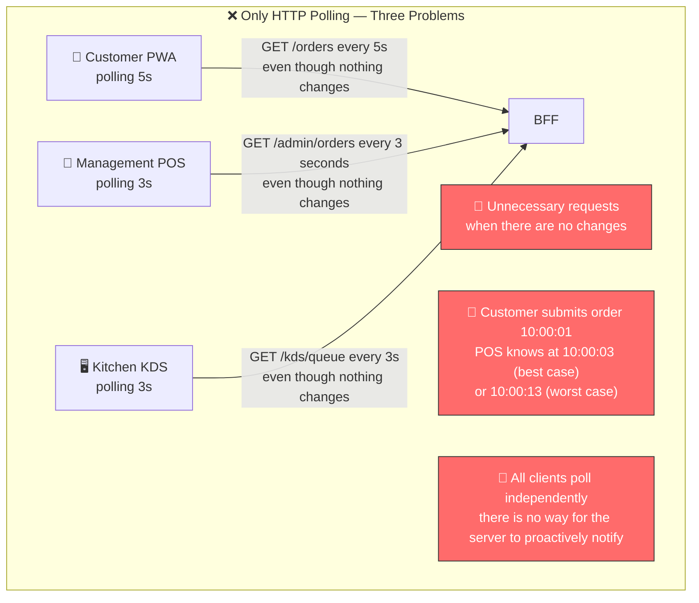
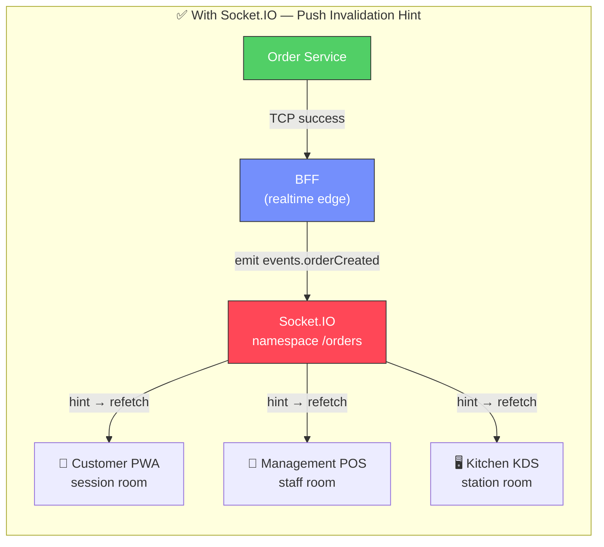
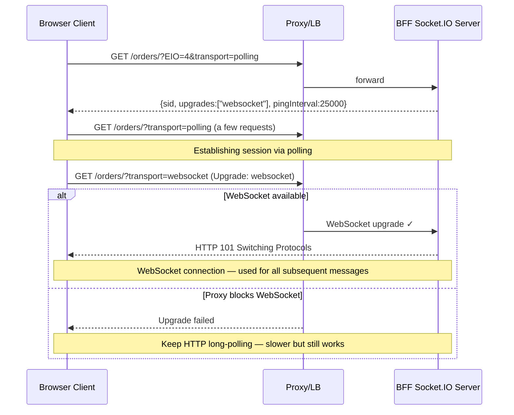
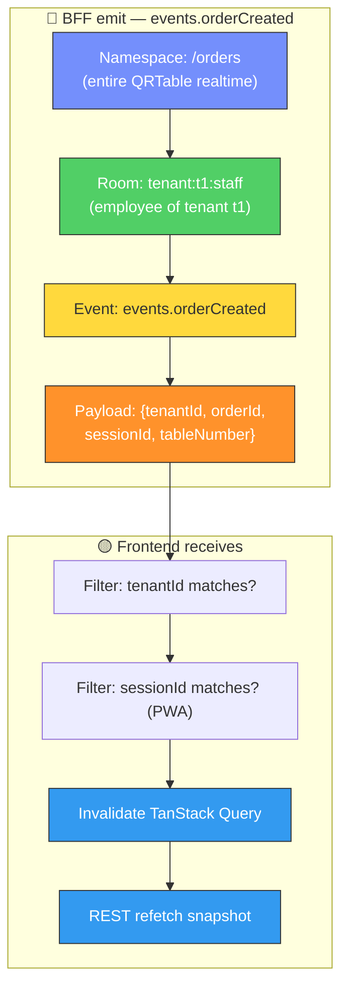
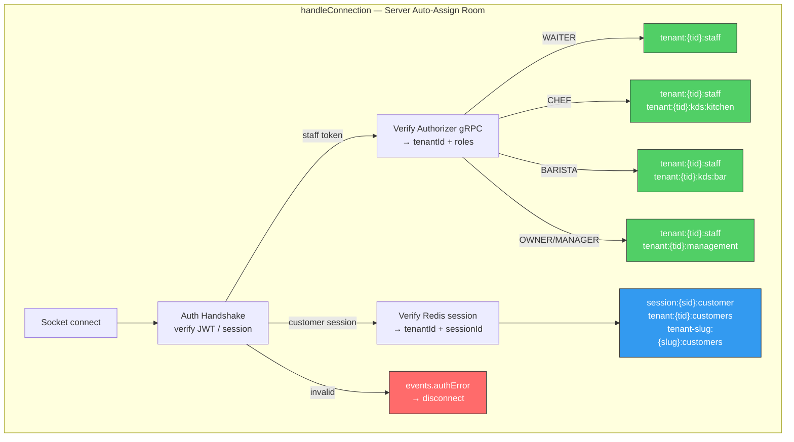
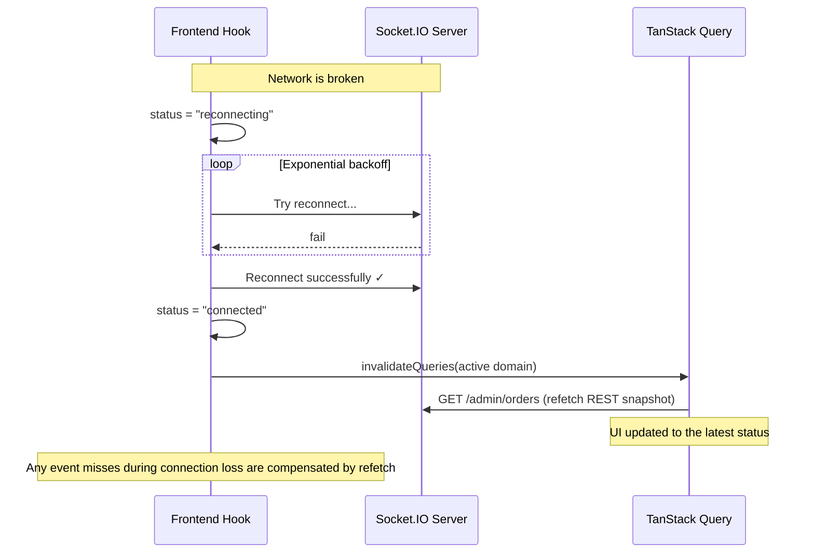
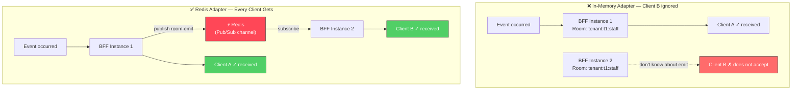
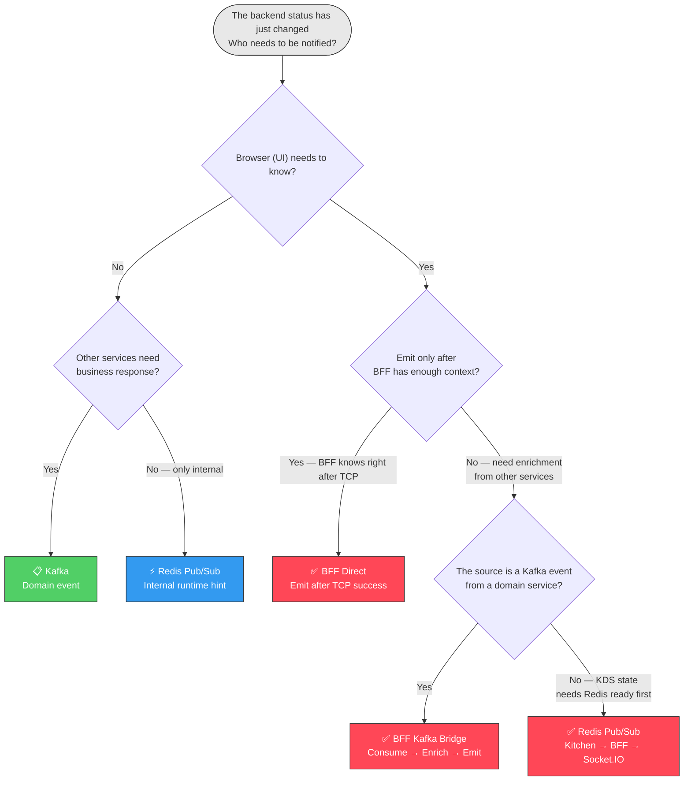

# WebSocket & Socket.IO: In-depth Theory — For QRTable

> **Document philosophy:** Understand the _why_ before the _how_. Every concept is anchored in context
> QRTable's specifics so you don't learn abstract theory but learn to apply it immediately.
>
> **Current code status (2026-05-14):** This document is a supporting guide. QRTable uses Socket.IO `4.8.3` via NestJS BFF Gateway namespace `/orders`. BFF assigns rooms themselves from JWT staff or verified customer sessions — clients are not allowed to choose rooms themselves. The frontend receives the event as _invalidation hint_ (refresh hint), then TanStack Query refetch REST snapshot. BFF uses Socket.IO Redis Adapter to fan-out when running multiple instances. There is no durable replay for clients that have lost connection — reconnection must be accompanied by a refetch snapshot.

---

## Table of Contents

1. [Socket.IO Problem Solved](#1-socketio-problem-solved)
2. [Nature of Socket.IO - Not Pure WebSocket](#2-nature-socketio - not-pure-websocket)
3. [Anatomy of a Realtime Event](#3-anatomy-of-an-event-realtime)
4. [Realtime Architecture: BFF Is The Only Edge](#4-realtime-architecture-bff-is-the-only-edge)
5. [Namespace, Room and Server-Derived Assignment](#5-namespace-room-and-server-derived-assignment)
6. [Event Registry — List and Meaning](#6-event-registry--list-and-meaning)
7. [Frontend Contract — Hint, Not Source of Truth](#7-frontend-contract--hint-not-source-of-truth)
8. [Redis Adapter — Scale Multiple BFF Instances](#8-redis-adapter--scale-multiple-bff-instances)
9. [Architectural Decision: Socket.IO vs Kafka vs Redis Pub/Sub vs Polling](#9-architectural-decision-socketio-vs-kafka-vs-redis-pubsub-vs-polling)
10. [Configuration and Operational](#10-configuration-and-operational)
11. [Summary Mental Model](#11-summary-mental-model)

---

## 1. Socket.IO Problem Solved

Before learning what Socket.IO is, you need to understand what problem it was created to solve in QRTable. If you skip this part, you will tend to use Socket.IO as a second Kafka, or vice versa, not knowing when you really need it.

### 1.1 Original Problem: Multiple Screens, One Restaurant, Data Must Match

QRTable is a restaurant operations system — not a once-hourly statistics page. At any given time during a shift, there are multiple screens open simultaneously:

- Customer PWA on the customer's phone 5
- The POS of the waiter is holding a tablet
- KDS on kitchen screen
- KDS on bar screen

When customer table 5 clicks "Submit Order", what happens? The employee's POS needs to know to confirm. The kitchen's KDS needs to know to start processing. If the system doesn't have realtime, the other two screens sit waiting for the next polling — maybe 3 seconds, maybe 10 seconds.

Without realtime, the system still _correct_ but feels slow to operate. In a crowded restaurant, a 5-second delay can mean the staff is working on old data and the kitchen starts making the wrong dish.

#### Diagram: QRTable Without Realtime — Polling Problem

> Illustration of three screens polling independently. Each screen asks the backend at its own intervals — consuming requests even when there are no changes, and still reacting slowly when there are real changes.



#### Diagram: Yes Socket.IO — Server Proactively Alerts

> With Socket.IO, the server does not wait for the client to ask. When the state changes, BFF emits the event to the correct room. Related screens receive hints immediately and refetch REST snapshots. There is no pointless polling when there are no changes.



Socket.IO solves this problem by proactively reversing: **the server notifies the client when there are changes, instead of the client asking periodically**. This reduces useless requests and reduces delay to nearly zero.

### 1.2 When Socket.IO is NOT the Solution

Socket.IO is not the answer to all realtime needs. Knowing when _not_ to use it is just as important as knowing when to use it:

**Do not use Socket.IO for business commands:** Submit order, confirm/cancel order, start/done KDS ticket, transfer table — all going through REST → BFF → TCP service. Do not use WebSocket to mutate because it requires guard, DTO validation, transaction, audit, and idempotency. Socket.IO is a notification channel, not a mutation API.

**Do not use Socket.IO instead of Kafka:** When Kitchen service needs to react after an Order service commit, it is a domain event between services. Kafka is right. WebSocket is an edge UI — not a message bus backend.

**Do not use Socket.IO when durable replay is needed:** Event Socket.IO is fire-and-forget. If the client is offline when the event is triggered, the event is lost forever. For domain events, it is necessary to ensure processing even if the consumer goes down, using Kafka/outbox.

**Do not use Socket.IO to hide source of truth errors:** If the REST snapshot returns incorrect results, do not fix it by patching the UI from the realtime payload. Must edit service Owner.

---

## 2. Nature of Socket.IO — Not Pure WebSocket

### 2.1 Common Misunderstanding: Socket.IO ≠ WebSocket

The most common mistake is to think of Socket.IO as "WebSocket with sugar syntax". Socket.IO is actually a realtime library that runs on **Engine.IO**, a separate transport layer — and WebSocket is just _one of the transports_ that Engine.IO can use.

When the client connects, Socket.IO does not go directly to WebSocket. It starts with **HTTP long-polling**, exchanges information about capabilities, then _upgrades_ to WebSocket if both ends support it. This process is called transport negotiation.

```txt
1. Client sends an HTTP GET polling request
2. Server returns session information (sid, upgrades, pingInterval...)
3. Client sends a few more polling requests to set up
4. If WebSocket is available → upgrade (HTTP → WS)
5. After upgrade, use WebSocket for all subsequent messages
```

Understanding this is important because: if a proxy/firewall blocks WebSocket upgrade, Socket.IO still works via long-polling — slower but not completely blocked.

#### Diagram: Transport Negotiation — From Polling to WebSocket

> Each Socket.IO connection starts with HTTP polling to negotiate, then upgrades to WebSocket. If the upgrade fails (the proxy blocks), Socket.IO stays long-polling — degraded but still functional. This is why Socket.IO is more robust than pure WebSocket in real environments.



### 2.2 What does Socket.IO add compared to pure WebSocket

WebSocket is purely a two-way connection protocol — no rooms, no namespaces, no automatic reconnection, no fallbacks. If QRTable uses pure WebSocket, the team must build it all themselves:

| Features                    | Pure WebSocket | Socket.IO               |
| --------------------------- | -------------- | ----------------------- |
| Reconnect automatically     | Build your own | Available, configurable |
| Fallback transportation     | None           | Automatic long-polling  |
| Rooms (socket group)        | Build your own | Available               |
| Namespaces                  | None           | Available               |
| Acknowledgements (callback) | Build your own | Available               |
| Multi-server adapter        | Build your own | Redis Adapter           |
| Binary/JSON encoding        | Craft          | Available               |

QRTable needs rooms (decentralized by tenant/role/station), namespaces (realtime domain separation), reconnect (when network is down), and Redis Adapter (when running multiple BFF instances). Use Socket.IO to have these available instead of building your own.

### 2.3 What Socket.IO DOES NOT Provide

Socket.IO is not a universal solution. It's important to understand what Socket.IO _does_ guarantee:

**There is no durable message storage:** Messages are emitted and gone — not saved for offline clients to read later. This is a fundamental difference with Kafka.

**No exactly-once delivery:** Socket.IO has at-most-once semantics for regular emit. Acknowledgment helps know one party has received, but does not guarantee the entire system.

**No built-in authorization:** Room assignment, auth handshake, tenant isolation — all the responsibility of the application code, not Socket.IO.

QRTable accepts at-most-once for UI hints because: **losing events does not corrupt the data — the client is just slower to know, and will refetch correctly when reconnecting/focusing**.

---

## 3. Anatomy of a Realtime Event

All communication in Socket.IO QRTable has a clear structure. Understanding each layer helps debug faster and design new events more accurately.

### 3.1 Four Layers of an Event

```txt
Namespace   : /orders
The realtime space contains all QRTable communications

Room        : tenant:t1:staff
The socket group receives the event — the server infers it, the client does not choose it

Event name  : events.orderCreated
String name for the client to register as a listener

Payload     : { tenantId, orderId, sessionId, tableNumber, ... }
Data for the client to filter and know which queries need to be invalidated
```

#### Diagram: Structure Of An Emit From BFF

> Four levels of an emit: BFF calls `server.to(room).emit(eventName, payload)`. Redis Adapter ensures fan-out room across all instances. Client receives and uses payload to filter + invalidate query.



### 3.2 Payload is used for filtering, not for rendering

This is the most important principle of the entire realtime QRTable design:

**Payload event is for deciding _whether to refetch_ and which _refetch query_ — not to render UI directly.**

Reason: the payload may miss (connection lost), late (arrive after the state has changed again), or missing fields (schema changed). The REST snapshot from the service Owner is always the ultimate source of truth.

```txt
✅ Correct:
  socket.on('events.orderCreated', (payload) => {
    if (payload.tenantId !== myTenantId) return;  // filter
    queryClient.invalidateQueries(['orders', tenantId]);  // trigger refetch
  });

❌ Sai:
  socket.on('events.orderCreated', (payload) => {
setOrders(prev => [...prev, payload.order]);  // render from payload
  });
```

### 3.3 Delivery Semantics — Why Events Can Be Lost

Socket.IO with default configuration has **at-most-once** semantics: events are emitted once, maybe to the client, maybe not. There is no automatic retry for normal emit.

Situations where the event may not reach the client:

| Situation                        | Consequences                        | How to handle QRTable             |
| -------------------------------- | ----------------------------------- | --------------------------------- |
| Client offline when emit         | Event lost forever                  | Reconnect → refetch active domain |
| Client reconnecting              | Event emit in this interval takes   | Post-reconnect refetch            |
| Network glitch                   | Packet loss → event not arriving    | Socket.IO reconnect → refetch     |
| BFF instance emit false instance | Redis Adapter fan-out without cover | Redis Adapter fixes this issue    |

The design of QRTable accepts at-most-once because every state has a REST snapshot as a safety net. Missing event → UI is a bit slow to update, but not wrong.

---

## 4. Realtime Architecture: BFF Is the Only Edge

### 4.1 Why BFF Is The Only Point Emit About Browser

In QRTable, there is no service other than BFF that talks directly to the browser via WebSocket. Kitchen service, Order service, Payment service — all go through BFF.

Architectural reasons:

**Security boundary:** BFF is the only place that has context to verify JWT, resolve session, and know which room is suitable for the connecting client. If Kitchen service emits directly, it needs to know each client's socket ID — this breaks separation of concerns.

**Enrichment:** Kafka event from Payment service contains `paymentId`, but the browser needs `sessionId` to know which room to emit to. BFF is the only place that can be enriched by calling Order service — Kitchen or Payment should not know about the session contract.

**Decoupling:** If Socket.IO is replaced with another technology in the future, only BFF needs to change. The remaining services do not know anything about browser protocols.

### 4.2 Three Different Trigger Emit Sources

Not all events have the same origin. QRTable has three different patterns depending on the type of event:

#### Diagram: Three Emit Streams — BFF Direct, Kafka Bridge, Redis Pub/Sub

> Three different emit streams serve three different types of events. Common point: they all go through BFF before going to the browser. Another point: the trigger source and emit time are different.

```mermaid
graph TB
subgraph "Flow 1: BFF Direct (sau TCP success)"
        FE1["Frontend\nREST command"]
        BFF1["BFF Controller"]
        SVC1["Order/Kitchen Service\n(TCP)"]
        WS1["Socket.IO emit"]

        FE1 -->|"POST /orders"| BFF1
        BFF1 -->|"TCP gRPC"| SVC1
        SVC1 -->|"success response"| BFF1
        BFF1 -->|"events.orderCreated"| WS1
    end

subgraph "Flow 2: Kafka Bridge (domain events)"
        KFK["Kafka\npayment.completed\nkitchen.sla_warning"]
        BFF2["BFF Kafka Bridge"]
ENR["Enrich: call Order\nget sessionId"]
        WS2["Socket.IO emit"]

        KFK -->|"consume"| BFF2
        BFF2 --> ENR
        ENR -->|"events.paymentCompleted\nevents.kitchenSlaWarning"| WS2
    end

subgraph "Flow 3: Redis Pub/Sub (KDS internal)"
        KS["Kitchen Service"]
        RKV["Redis KDS State\n(ghi ticket/queue)"]
        RPB["Redis Pub/Sub\nrealtime:kds:{tenantId}"]
        BFF3["BFF KDS Subscriber"]
        WS3["Socket.IO emit"]

        KS --> RKV
        KS -->|"PUBLISH"| RPB
        RPB -->|"subscribe"| BFF3
        BFF3 -->|"events.kdsQueueChanged"| WS3
    end

    style WS1 fill:#ff4757,stroke:#333,color:#fff
    style WS2 fill:#ff4757,stroke:#333,color:#fff
    style WS3 fill:#ff4757,stroke:#333,color:#fff
    style KFK fill:#51cf66,stroke:#333,color:#fff
    style RPB fill:#339af0,stroke:#333,color:#fff
```



### 4.3 Why KDS Doesn't Use Kafka Directly to Emit

Natural question: why doesn't KDS use Kafka `order.confirmed` to emit `events.kdsQueueChanged` too? Why go through Redis Pub/Sub?

**Reason:** When BFF consumes `order.confirmed` from Kafka, Kitchen service _may not have finished processing_ — has not yet written the KDS ticket to Redis. If BFF emits `events.kdsQueueChanged` right now, the frontend refetch but does not see the new ticket in the queue. **State hint must be played after the state actually exists.**

Correct flow: Kitchen consume Kafka → write Redis KDS → publish Redis Pub/Sub → BFF emit → frontend refetch (now the ticket is already in Redis).

---

## 5. Namespace, Room and Server-Derived Assignment

### 5.1 Namespace /orders — Unique Space

QRTable uses a single namespace:

```txt
/orders
```

Current Gateway:

```ts
@WebSocketGateway({ cors: { origin: '*' }, namespace: '/orders' })
export class OrderEventsGateway implements OnGatewayConnection {}
```

Frontend gets namespace URL from BFF origin:

```ts
// REST base:   http://localhost:3300/api/v1
// Socket URL: http://localhost:3300/orders ← no /api/v1
const url = new URL(API_CONFIG.DEFAULT_BFF_URL);
const socketUrl = `${url.origin}/orders`;
```

**Common error:** Using `http://localhost:3300/api/v1/orders` — will result in a 404 because the namespace does not have the prefix `/api/v1`. Namespace is a private route, not a REST route.

There are no plans to create a separate `/kds` namespace — KDS uses the same `/orders` namespace and delegates permissions using rooms + event filters.

### 5.2 Rooms — Server Inferred, Client Not Selected

Room is a socket group for BFF to emit to the correct recipient. Immutable principle: **client does not send room name, server deduces it from verified data**.

Why not trust the client? If a client is allowed to join room `tenant:other-tenant:staff`, that client will receive events from other tenants — this is a serious security hole in a multi-tenant environment.

Room assignment occurs in `handleConnection` after a successful auth handshake:

#### Diagram: Room Assignment By Role

> Server joins socket to rooms immediately upon connection, based on verified role/session. The client does not send any room name. Legacy events `join.staff` and `join.session` were rejected.



Full table of rooms by actor:

| Actor / Role               | Rooms are joined                                                                                             |
| -------------------------- | ------------------------------------------------------------------------------------------------------------ |
| Customer sessions          | `session:{sessionId}:customer`, `tenant:{tenantId}:customers`, optional `tenant-slug:{tenantSlug}:customers` |
| WAITER                     | `tenant:{tenantId}:staff`                                                                                    |
| CHEF                       | `tenant:{tenantId}:staff`, `tenant:{tenantId}:kds:kitchen`                                                   |
| BARISTA                    | `tenant:{tenantId}:staff`, `tenant:{tenantId}:kds:bar`                                                       |
| Owner / MANAGER            | `tenant:{tenantId}:staff`, `tenant:{tenantId}:management`                                                    |
| Owner / MANAGER opt-in KDS | `tenant:{tenantId}:kds:kitchen` or `tenant:{tenantId}:kds:bar` via `subscribe.kds`                           |

### 5.3 Auth Handshake: Staff vs Customer

**Staff (Management App)** sends JWT in `auth`:

```ts
io('http://localhost:3300/orders', {
  auth: { token: accessToken },
  transports: ['websocket', 'polling'],
});
```

BFF verifies token via Authorizer gRPC, caches results in Redis, infers `tenantId` and roles.

**Customer (PWA)** sends session identity:

```ts
io('http://localhost:3300/orders', {
  auth: { tenantId, sessionId, tenantSlug },
});
```

BFF checks the Redis session key exists according to `tenantId`. If does not exist → emit `events.authError` → disconnect.

BFF also supports fallback headers (`Authorization: Bearer` / `x-tenant-id` / `x-session-id`) for cases where `auth` fails to transmit, but canonical is Socket.IO `auth`.

### 5.4 subscription.kds — Opt-in For Owner/MANAGER

`subscribe.kds` is the only event sent by the client (other than auth), for the Owner/MANAGER who wants to see a specific KDS station:

```ts
socket.emit('subscribe.kds', { station: 'KITCHEN' | 'BAR' });
```

Required conditions:

- Socket already has `tenantId` from auth handshake.
- Role is `SUPER_ADMIN`, `Owner`, or `MANAGER`.
- CHEF/BARISTA cannot use `subscribe.kds` to access other stations.

---

## 6. Event Registry — List and Meaning

### 6.1 Naming Principles

The current event uses two styles:

```txt
events.orderCreated          ← domain events, prefixed "events."
tenant.suspended             ← lifecycle events, domain prefix
```

Don't add name variations for the same meaning. Before adding a new event, the spec must be finalized according to the procedure at [Section 10.3](#103-rules-for-adding-new-event).

### 6.2 Events Order / Session / Bill

| Events                      | Source                                 | Rooms receive                                  | Frontend action                           |
| --------------------------- | -------------------------------------- | ---------------------------------------------- | ----------------------------------------- |
| `events.cartUpdated`        | BFF after Order TCP                    | `session:{sid}:customer`, `tenant:{tid}:staff` | Invalidate cart/bill/order domain         |
| `events.orderCreated`       | BFF after submitting order             | `session:{sid}:customer`, `tenant:{tid}:staff` | Invalidate order list/detail, table state |
| `events.orderStatusChanged` | BFF after status change                | `tenant:{tid}:staff`, optional session         | Invalidate order/table domain             |
| `events.serviceRequested`   | BFF after service request              | `session:{sid}:customer`, `tenant:{tid}:staff` | Invalidate service requests               |
| `events.billRequested`      | BFF after bill request                 | `session:{sid}:customer`, `tenant:{tid}:staff` | Invalidate bill/cart/order/service        |
| `events.tableTransferred`   | BFF after transfer saga                | `session:{sid}:customer`, `tenant:{tid}:staff` | Invalidate session/order/table            |
| `events.paymentCompleted`   | Kafka `payment.completed` → BFF bridge | `session:{sid}:customer`, `tenant:{tid}:staff` | Invalidate payment/order/bill             |

### 6.3 Events KDS

| Events                     | Source                                   | Rooms receive                                             | Frontend action                                             |
| -------------------------- | ---------------------------------------- | --------------------------------------------------------- | ----------------------------------------------------------- |
| `events.kdsQueueChanged`   | Kitchen Redis Pub/Sub → BFF              | `tenant:{tid}:kds:kitchen/bar`, `tenant:{tid}:management` | Filter tenant/station → invalidate queue                    |
| `events.kitchenItemReady`  | BFF Kitchen controller after Order sync  | `tenant:{tid}:staff`, `session:{sid}:customer`            | POS/PWA invalidate order; KDS invalidate if station matches |
| `events.kitchenSlaWarning` | Kafka `kitchen.sla_warning` → BFF bridge | Station room, `tenant:{tid}:management`                   | Filter tenant/station → invalidate queue                    |

KDS payload has `eventId`, `eventType`, `schemaVersion`, `tenantId`, `station`, `revision`, `occurredAt`. If the frontend tracks revision and detects a gap → refetch snapshot.

### 6.4 Events Tenant Lifecycle

| Events             | Source               | Rooms receive                                            | Frontend actions                         |
| ------------------ | -------------------- | -------------------------------------------------------- | ---------------------------------------- |
| `tenant.suspended` | BFF admin controller | `tenant:{tid}:customers`, `tenant-slug:{slug}:customers` | Patch tenant status, block customer flow |
| `tenant.activated` | BFF admin controller | `tenant:{tid}:customers`, `tenant-slug:{slug}:customers` | Patch tenant status active               |
| `tenant.closed`    | BFF admin controller | `tenant:{tid}:customers`, `tenant-slug:{slug}:customers` | Patch tenant status closed               |

### 6.5 Events Do Not Exist

Do not claim the following events if there is no spec:

```txt
events.menuUpdated ← menu uses cache/REST invalidation, no WS events
events.menu.updated
payment.refunded ← There is no WS bridge for refund yet
generic notification stream
```

---

## 7. Frontend Contract — Hint, Not Source of Truth

### 7.1 Core Rules

The entire QRTable realtime frontend is built on a single principle:

```txt
WebSocket event is hint.
REST snapshot is source of truth.
```

Event Socket.IO is only used to: filter to see if the event is related to you → trigger TanStack Query invalidate → React Query automatically refetch REST snapshot. Never render important domain state solely from the payload event.

#### Diagram: Anti-Pattern vs Correct — Render From Payload vs Refetch

> Two ways to handle events: wrong is to render directly from the payload (can be stale, missing fields, or miss event); It's true that using the event is only to trigger invalidate TanStack Query and then let React Query refetch REST snapshot.

```mermaid
graph TB
subgraph "❌ WRONG: Render from payload"
        EW["events.orderCreated\n{order: {...full data...}}"]
        RW["setOrders(prev => [...prev, payload.order])"]
UW["UI rendering from local state\n← may be stale/missing/missing"]

        EW --> RW --> UW
    end

    subgraph "✅ RIGHT: Invalidate → Refetch"
        ER["events.orderCreated\n{tenantId, orderId, sessionId}"]
FR["filter: tenantId matches?"]
        IR["queryClient.invalidateQueries(\n  ['orders', tenantId]\n)"]
        RR["TanStack Query refetch\nGET /admin/orders"]
UR["UI render from REST snapshot\n← always latest"]

        ER --> FR --> IR --> RR --> UR
    end

    style UW fill:#ff6b6b,stroke:#333,color:#fff
    style UR fill:#51cf66,stroke:#333,color:#fff
    style IR fill:#339af0,stroke:#333,color:#fff
```



### 7.2 Socket Lifecycle Ownership Hook

Each hook socket is responsible for the entire lifecycle:

```txt
useCustomerOrderRealtime()  ← Customer PWA
useStaffOrderRealtime()     ← Management POS
useKdsRealtime(station)     ← Management KDS
```

Each hook must:

- Create socket instance when enough auth/session.
- Register listeners **outside** `connect` event — do not register in `connect` because reconnecting will create duplicate listeners.
- Filter payload by tenant/session/station before invalidating.
- Cleanup with `socket.off(...)` and `socket.disconnect()` when unmounting.

**Common error — Duplicate listeners:**

```ts
// ❌ Wrong: register in connect, reconnect = 2nd registration
socket.on('connect', () => {
  socket.on('events.orderCreated', handler); // duplicate after reconnect
});

// ✅ Correct: register outside connect
socket.on('events.orderCreated', handler);
socket.on('connect', () => {
  // only refetch active domain after reconnect
  queryClient.invalidateQueries(['orders', tenantId]);
});
```

### 7.3 Required Filter By tenant/Session/Station

Not every event in the room belongs to me. A room `tenant:{tid}:staff` contains all tenant employees — POS receives KDS events, KDS receives POS events. Filter is the final layer of protection:

| Hook                       | Required filter         |
| -------------------------- | ----------------------- |
| `useCustomerOrderRealtime` | `tenantId`, `sessionId` |
| `useStaffOrderRealtime`    | `tenantId`              |
| `useKdsRealtime(station)`  | `tenantId`, `station`   |

### 7.4 Reconnect Strategy — Don't Let the UI Stuck

#### Diagram: Reconnect Flow and Post-Reconnect Refetch

> When the network goes down, Socket.IO tries to reconnect itself. After successfully reconnecting, the hook must refetch the active domain because many events may have been missed since the connection was lost. Do not rely on "will receive all events after reconnecting".



Event triggers refetch active domain:

- `connect` (first connection)
- `connect` after reconnecting
- Visibility change tab (visibility API)
- Window focus

These four triggers are a safety net that ensures the UI is never stuck in the same state.

### 7.5 Connection Status — UX Degraded

| Status         | Meaning                              | Action UX                               |
| -------------- | ------------------------------------ | --------------------------------------- |
| `idle`         | Not eligible to connect              | Wait for auth/session to be ready       |
| `connected`    | Socket connection is successful      | Realtime works normally                 |
| `reconnecting` | Socket.IO is trying to reconnect     | Displays "reconnecting..."              |
| `degraded`     | Realtime decline, use polling/manual | Show banner + increase polling interval |
| `auth-error`   | Invalid token/session                | Redirect login / refresh session        |

`auth-error` should not create a toast loop. If you receive `events.authError`, lead the user to reload/refresh token/session expired flow depending on the app.

---

## 8. Redis Adapter — Scale Multiple BFF Instances

### 8.1 Problems Without Adapter

Socket.IO uses in-memory adapters by default — rooms and socket connections only exist in a process's memory. When BFF runs an instance, emit to room works perfectly.

When scaling to two BFF instances, the problem appears:

```txt
Client A connects to BFF Instance 1 → belongs to room "tenant:t1:staff" at Instance 1
Client B connects to BFF Instance 2 → belongs to room "tenant:t1:staff" at Instance 2

Event occurs → Instance 1 emit "tenant:t1:staff"
→ Client A receives ✓ (same instance)
→ Client B DOES NOT receive ✗ (different instance, Instance 2 does not know about this emit)
```

#### Diagram: No Adapter vs Redis Adapter

> Without Redis Adapter, emit from an instance points to the socket connecting to that instance. The Redis Adapter uses Redis Pub/Sub to forward emit between instances — every client receives the event regardless of which instance it is connected to.



### 8.2 What is Redis Adapter

Redis Adapter replaces the in-memory adapter with a layer that uses Redis Pub/Sub to synchronize room emit between instances. When Instance 1 calls `server.to(room).emit(...)`, the Redis Adapter publishes to the Redis channel. All BFF instances subscribing to that channel receive and forward the emit to their socket.

The Redis Adapter **doesn't** store persistent events — it's just a real-time relay. If the client is offline, the event is still lost as with the in-memory adapter. Redis Adapter only solves the multi-instance problem, not durable delivery.

Setup in BFF:

```txt
apps/bff/src/app/modules/realtime/adapters/redis-io.adapter.ts
apps/bff/src/main.ts

Startup flow:
NestFactory.create(AppModule)
  → RedisIoAdapter.connectToRedis(redis://host:port)
  → app.useWebSocketAdapter(redisIoAdapter)
  → app.listen(PORT)
```

If Redis is not running, BFF may not be able to start the correct realtime path. **Check Redis before debugging Socket.IO.**

### 8.3 Sticky Session — While Still Using Long-Polling

Redis Adapter solves room emit, but there is an independent problem: **HTTP long-polling requests from the same Socket.IO session must arrive at the same BFF instance**.

Socket.IO uses session ID (`sid`) to identify the client. With WebSocket, the connection is persistent — no problem. With long-polling, each poll is a new HTTP request. If the load balancer routes these requests to another instance, the other instance does not know `sid` → HTTP 400 `Session ID unknown`.

Two solutions:

| Solution                          | When using                                       | Trade-off                                                |
| --------------------------------- | ------------------------------------------------ | -------------------------------------------------------- |
| Sticky session (IP hash / cookie) | Still want fallback long-polling                 | Load balancer is more complicated                        |
| WebSocket-only transport          | Tested and believe WebSocket is always available | It's possible that the environment is blocking WebSocket |

Staff/KDS hooks declare `transports: ['websocket', 'polling']` — if deploying multiple instances, consider sticky session or switching to WebSocket-only after testing the real proxy.

---

## 9. Architecture Decision: Socket.IO vs Kafka vs Redis Pub/Sub vs Polling

### 9.1 Decision Tree — Which Type of Change Uses Which Channel?

This is the most practical question when adding new features to QRTable.

#### Diagram: Decision Tree — Select Notification Channel

> The decision tree starts with the question "Who needs to know about this change?" — browser or other service. If browser → Socket.IO. If service → Kafka. If only internal BFF → Redis Pub/Sub. If not needed immediately → polling.



### 9.2 Anti-Pattern — Using Socket.IO As Command Bus

Adding mutations via WebSocket is the path to an architecture that is difficult to maintain. The current REST command has:

- Guard and permission validation in HTTP middleware
- DTO automatic validation
- Transaction in service Owner
- Audit log is clear
- Idempotency key support

If you turn an event into a mutation command via WebSocket, you have to rebuild all of the above yourself. **There is no benefit to justify that cost in the current scope.**

The principle is clear: KDS start/done/recall ticket, transfer table, submit order — all go through REST. Socket.IO only accepts `subscribe.kds` opt-ins.

### 9.3 Four Channel Comparison

| Channel       | Sustainable     | Fan-out                     | Replay              | Suitable for                            |
| ------------- | --------------- | --------------------------- | ------------------- | --------------------------------------- |
| Socket.IO     | No              | Via Redis Adapter           | No                  | UI invalidation hint for browser        |
| Kafka         | Yes (retention) | Via consumer groups         | Yes (offset rewind) | Domain events between services          |
| Redis Pub/Sub | No              | In-process + multi-instance | No                  | Internal runtime hint is fast, may take |
| HTTP Polling  | N/A             | Each client polls itself    | N/A                 | Fallback, data not needed immediately   |

**QRTable Short Rules:**

```txt
Data to render UI → REST + TanStack Query
Near realtime UI signal → Socket.IO
Domain event between services → Kafka
Internal fast runtime state → Redis
Internal KDS Hint BFF → Redis Pub/Sub → BFF → Socket.IO
```

---

## 10. Configuration and Operational

### 10.1 Local Configuration

Dependencies backend:

```txt
@nestjs/websockets
@nestjs/platform-socket.io
socket.io
@socket.io/redis-adapter
redis
```

Dependencies frontend:

```txt
socket.io-client
```

BFF environment:

```txt
REDIS_HOST=localhost
REDIS_PORT=6379
```

Frontend environment:

```txt
NEXT_PUBLIC_BFF_URL=http://localhost:3300/api/v1   ← Management App
VITE_BFF_URL=http://localhost:3300/api/v1          ← Customer PWA
```

Checklist before debugging Socket.IO local:

1. BFF is running at `http://localhost:3300`?
2. Redis running at `localhost:6379`?
3. Frontend env correct BFF URL?
4. Actual Socket URL is `http://localhost:3300/orders` (no `/api/v1`)?
5. Does staff have access tokens? Customer has `tenantId` and `sessionId`?
6. Does BFF log have `WS rejected` or auth error?

### 10.2 Reverse Proxy and WebSocket Upgrade

If BFF runs behind Nginx/ingress, the proxy must support WebSocket upgrade:

```nginx
proxy_http_version 1.1;
proxy_set_header Upgrade $http_upgrade;
proxy_set_header Connection "upgrade";
proxy_set_header Host $host;
proxy_set_header X-Forwarded-For $proxy_add_x_forwarded_for;
```

Missing `Upgrade` and `Connection` headers → WebSocket upgrade failed → Socket.IO stuck in long-polling.

**CORS production:** Gateway is now open `origin: '*'`. Production should switch to allowlist:

```txt
https://management.example.com
https://customer.example.com
```

### 10.3 Rules for Adding New Event

Before adding a new event, you must finalize the spec according to 8 questions:

1. Which domain does the event belong to?
2. Which service is Source of truth in?
3. After which commit does the event occur? (BFF Direct / Kafka bridge / Redis Pub/Sub)
4. Which room accepts?
5. What is the minimum payload to filter/invalidate?
6. Which frontend refetch TanStack Query key?
7. Is there any fallback polling/reconnect?
8. Does this domain event need Kafka instead of Socket.IO?

### 10.4 Conflict and Failure Playbook

| Conflict                                   | Signs                                                      | How to handle                                                            |
| ------------------------------------------ | ---------------------------------------------------------- | ------------------------------------------------------------------------ |
| Redis down on startup                      | BFF realtime path error, no fan-out multi-instance         | Check `REDIS_HOST`, `REDIS_PORT`, Redis containers                       |
| Socket connect but not receiving event     | Client enters wrong room or emits to wrong room            | Check auth handshake, role, Redis session, room in `RealtimeAuthService` |
| Receive event but UI does not change       | Query key invalidate is wrong or snapshot does not refetch | Check hook, TanStack Query key, Network tab REST request after event     |
| Receive events of other tenants/stations   | Frontend lacks filter                                      | Filter required tenantId/sessionId/station                               |
| Finished reconnecting old UI               | Hook does not refetch after reconnect                      | Invalidate active domain in `connect` handler                            |
| Duplicate listeners after reconnect        | Handler calls multiple times                               | Do not register listener in `connect`; cleanup `socket.off`              |
| `events.authError`                         | Token/session missing, expired, forbidden                  | Check `auth.token`, `tenantId/sessionId`, Redis session, role            |
| HTTP 400 `Session ID unknown` when scaling | Long-polling routed to wrong instance                      | Sticky session or WebSocket-only transport                               |
| Event fired before state ready             | Frontend refetch but no new data yet                       | Only emit after TCP success or after Kitchen finishes recording Redis    |

### 10.5 Debug — Where to Look in Code

**Backend BFF:**

| File                                                                           | Content                                          |
| ------------------------------------------------------------------------------ | ------------------------------------------------ |
| `apps/bff/src/main.ts`                                                         | Register `RedisIoAdapter`                        |
| `apps/bff/src/app/modules/realtime/gateways/order-events.gateway.ts`           | Namespace `/orders`, auth, legacy join rejection |
| `apps/bff/src/app/modules/realtime/services/realtime-auth.service.ts`          | Staff/customer handshake, server-derived rooms   |
| `apps/bff/src/app/modules/realtime/services/realtime-events.service.ts`        | Mapping event → room → event name                |
| `apps/bff/src/app/modules/realtime/adapters/redis-io.adapter.ts`               | Redis Adapter setup                              |
| `apps/bff/src/app/modules/realtime/services/kds-internal-events.subscriber.ts` | Redis Pub/Sub → KDS hints                        |
| `apps/bff/src/app/modules/realtime/services/realtime-kafka-bridge.service.ts`  | Kafka bridge for payment/SLA                     |

**Frontend hooks:**

| File                                                                        | Content                 |
| --------------------------------------------------------------------------- | ----------------------- |
| `apps/customer-pwa/src/features/order/hooks/use-customer-order-realtime.ts` | Customer session socket |
| `apps/management-app/src/features/order/hooks/use-staff-order-realtime.ts`  | Staff POS socket        |
| `apps/management-app/src/features/kds/hooks/use-kds-realtime.ts`            | KDS station socket      |

---

## 11. Mental Model Summary

#### Diagram: Synthetic Mental Model — Socket.IO In QRTable

> Mind map summarizing all Socket.IO knowledge applied to QRTable. From the essence (invalidation hint), through the architecture (BFF edge, three emit streams), to design decisions (not command bus, not source of truth).

```mermaid
mindmap
  root((Socket.IO\nQRTable))
Nature
      Invalidation hint → refetch REST
      At-most-once delivery
There are no durable replays
REST snapshot is source of truth
    Transport
WebSocket is primary
Long-polling is fallback
Transport negotiation automatically
Upgrade may fail at proxy
Architecture
BFF is the only edge
Three streams: Direct / Kafka / Redis Pub/Sub
Kitchen does not emit directly
Hint plays after ready state
    Namespace & Room
Namespace /orders for all QRTable
Room is inferred by the server from JWT/session
Client does not choose room
Legacy join.staff is rejected
    Auth
Staff: JWT in auth.token
      Customer: tenantId + sessionId
      events.authError → disconnect
Cache token verify in Redis
    Frontend
Hook owns socket lifecycle
      Filter tenantId/sessionId/station
Do not register listeners in connect
      Reconnect → refetch active domain
    Scale
Redis Adapter for multi-instance fan-out
Sticky session if still using polling
Redis down = realtime no fan-out
The adapter does not provide durable storage
Decision
      Socket.IO = UI browser hint
      Kafka = domain event services
      Redis Pub/Sub = internal runtime hint
REST polling = fallback when needed
```

After reading the entire document, here is a brief mental model to remember:

**In essence:** Socket.IO is an invalidation hint layer for the UI — the server says "something just changed, please refetch". Not source of truth, not command bus, not Kafka alternative. At-most-once semantics, events can be lost — the design must accept this.

**About transport:** Socket.IO starts with long-polling and then upgrades to WebSocket. Not pure WebSocket. Fallback long-polling is advantageous in complex proxy environments but requires sticky sessions when scaling multiple instances.

**About architecture:** BFF is the only emit point about the browser. Three different streams — Direct (after TCP success), Kafka bridge (domain events enrich), Redis Pub/Sub (KDS must wait for state to be ready). Do not emit from the service domain directly to the browser.

**About namespace and room:** One namespace `/orders` for the entire QRTable. Room is inferred by the server from the verified JWT/session — the client cannot choose it themselves. This is a security boundary, not a convention.

**About the frontend:** Hooks own the entire socket lifecycle. Required filter by tenantId/sessionId/station. Do not register listeners in `connect`. Reconnect must come with refetch active domain. Payload events are only used to filter and trigger invalidate — not to render UI directly.

**About scaling:** Redis Adapter solves fan-out between multiple BFF instances. Does not provide durable storage — just real-time relay. If you still use long-polling fallback, the load balancer needs a sticky session.

**About the decision:** The core question is "Who needs to know about this change?". Browser → Socket.IO. service backend → Kafka. Internal BFF/KDS runtime → Redis Pub/Sub. Do not share channels between these purposes.

#### Diagram: Cheat Sheet — Emit Stream By Event

> Quick summary table of source, receiving room and frontend action for each event group. Use as a "quick reference" when adding features or debugging.

| Event Group                          | Source              | Receiving Room                                 | Frontend                          |
| ------------------------------------ | ------------------- | ---------------------------------------------- | --------------------------------- |
| `events.orderCreated`, `cartUpdated` | BFF Direct (TCP)    | `session:{sid}:customer`, `tenant:{tid}:staff` | Invalidate order/cart/bill        |
| `events.paymentCompleted`            | Kafka bridge        | `session:{sid}:customer`, `tenant:{tid}:staff` | Invalidate payment/bill/order     |
| `events.kdsQueueChanged`             | Redis Pub/Sub → BFF | `tenant:{tid}:kds:kitchen/bar`, `management`   | Filter station → invalidate queue |
| `events.kitchenSlaWarning`           | Kafka bridge        | Station room, `management`                     | Filter station → invalidate queue |
| `tenant.suspended/activated/closed`  | BFF Direct (admin)  | `tenant:{tid}:customers`                       | Patch tenant lifecycle context    |
