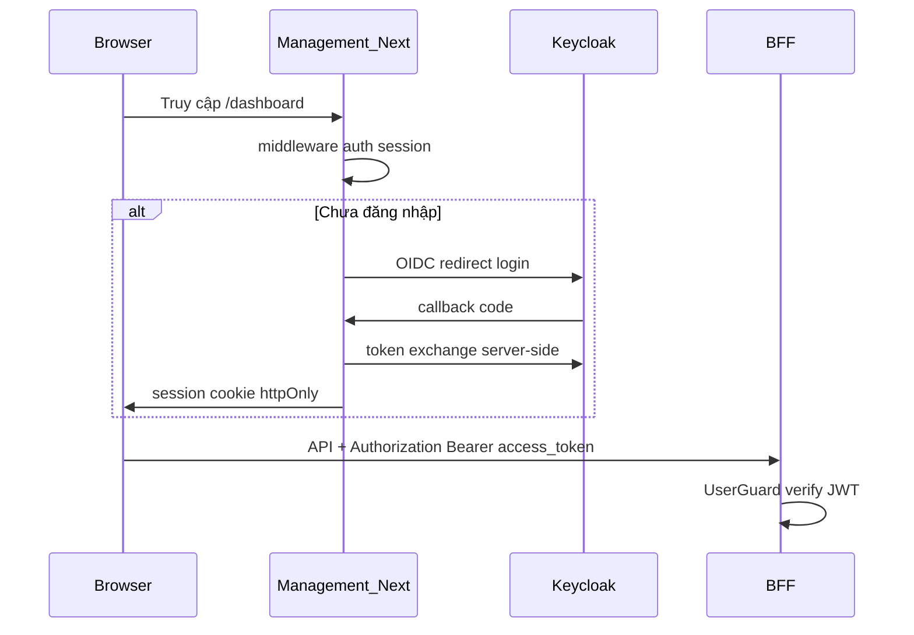

# Kế hoạch Step 1.25 — Auth Frontend & Custom Keycloak UI

## Bối cảnh đã đọc (tóm tắt)

- **[docs/technical-architecture.md](docs/technical-architecture.md):** Management App (Next.js App Router) dùng JWT Keycloak; middleware + role điều hướng `/admin`, `/dashboard`, `/pos`, `/kds/`; BFF là single API entry; claims `tenant_id`, roles trong `realm_access.roles`.
- **[docs/step-0-6b-authentication-authorization-chi-tiet.md](docs/step-0-6b-authentication-authorization-chi-tiet.md):** Luồng thực tế repo: BFF port theo [.env.example](.env.example) là `3300`, prefix `api/v1`; `POST /api/v1/authorizer/login` (password grant qua Authorizer → Keycloak); `GET /api/v1/authorizer/me` cần `Authorization: Bearer` + UserGuard + MongoDB user + role mapping; lỗi `401` gồm `INVALID_TOKEN`, `USER_NOT_PROVISIONED`.
- **[docs/implementation_plan.md](docs/implementation_plan.md):** Step 1.25 mô tả NextAuth **hoặc** Keycloak JS — **đã chốt: Auth.js (NextAuth v5)** theo xác nhận của bạn.
- **[docs/business-logic.md](docs/business-logic.md):** Ma trận actor/role (OWNER, MANAGER, WAITER, CHEF, BARISTA, SUPER_ADMIN) khớp với routing nội bộ.

## Hiện trạng mã nguồn (điểm neo)

| Thành phần                                                                                                                 | Trạng thái                                                                                                                                                           |
| -------------------------------------------------------------------------------------------------------------------------- | -------------------------------------------------------------------------------------------------------------------------------------------------------------------- |
| [apps/management-app/src/middleware.ts](apps/management-app/src/middleware.ts)                                             | Đã chặn `/dashboard`, `/pos`, `/kds`, `/admin`; đọc cookie `qrtable_roles` / `qrtable_role`; redirect `/login` + `?next=`                                            |
| [apps/management-app/src/lib/auth/role-routing.ts](apps/management-app/src/lib/auth/role-routing.ts)                       | Đã map role → home + `hasAccessToPath` (OWNER/MANAGER vào `/pos`, v.v.)                                                                                              |
| [apps/management-app/src/app/(auth)/login/page.tsx](<apps/management-app/src/app/(auth)/login/page.tsx>) & `auth/callback` | Placeholder; chưa OIDC thật                                                                                                                                          |
| [docker-compose.provider.yaml](docker-compose.provider.yaml)                                                               | Keycloak 25, `start-dev`, chỉ volume `keycloak_data` — **chưa** mount theme/JAR                                                                                      |
| BFF Authorizer                                                                                                             | [apps/bff/src/app/modules/authorizer/controllers/authorizer.controller.ts](apps/bff/src/app/modules/authorizer/controllers/authorizer.controller.ts): `login` + `me` |

**Lưu ý:** [libs/configuration/src/lib/app.config.ts](libs/configuration/src/lib/app.config.ts) default `PORT` là `3000` nếu không set env; [.env.example](.env.example) ghi `PORT=3300` cho BFF — khi verify cần thống nhất URL BFF thực tế.

## Kiến trúc mục tiêu (Auth.js + Keycloak)

- **Session:** Auth.js lưu session (JWT strategy hoặc database — MVP nên **JWT session** + lưu `access_token` / `refresh_token` / `expires_at` trong token được mã hóa, theo pattern refresh trong tài liệu Auth.js trên Context7).
- **Bearer cho BFF:** Mọi `fetch` từ client tới BFF nên đi qua một lớp thống nhất: **Route Handlers / Server Actions** lấy token qua `auth()` (không expose refresh token ra client), hoặc dùng **BFF proxy** trong Next (ít lộ token hơn). Kế hoạch chi tiết trong doc sẽ so sánh 2 cách và chọn một làm chuẩn dự án (khuyến nghị: server-side attach Bearer).
- **401 từ BFF:** Interceptor phía client: nếu `401` + `INVALID_TOKEN` → `signIn('keycloak')` hoặc xóa session và redirect; nếu `USER_NOT_PROVISIONED` → trang lỗi có hướng dẫn (đồng bộ với [step-0-6b](docs/step-0-6b-authentication-authorization-chi-tiet.md)).
- **Middleware Next.js:** Thay/thích hợp logic hiện tại: dùng `auth()` từ Auth.js trong middleware (hoặc kiểm tra session cookie) thay vì chỉ cookie `qrtable_roles` thủ công; vẫn tái sử dụng `getRoleHomeRoute` / `hasAccessToPath` sau khi parse roles từ session (từ JWT Keycloak `realm_access.roles`).
- **Zustand:** Store `userProfile` + `roles` + `permissions` (optional): hydrate từ `GET /api/v1/authorizer/me` sau khi đã có session (permissions chỉ có sau khi BFF/Authorizer resolve MongoDB — **không** tin tưởng hoàn toàn chỉ roles trên JWT cho UI nhạy cảm).

## Keycloak (realm `qrtable`)

- **Client OIDC cho Next (browser flow):** Tạo client mới (ví dụ `management-app` hoặc tái cấu hình) với:
  - Standard flow + **PKCE**
  - Redirect URI: `{NEXTAUTH_URL}/api/auth/callback/keycloak` (hoặc id provider tùy cấu hình Auth.js)
  - Web origins phù hợp dev/prod
  - Scope: `openid profile email offline_access` (để có refresh token nếu Keycloak cho phép)
- **Client `qrtable-bff` (confidential)** giữ nguyên cho luồng hiện có; Auth.js dùng client riêng tránh lộ secret ra browser.
- **Giao diện đăng nhập:** Sau Keycloakify, trong Admin Console chọn **Login theme** = theme build từ Keycloakify.

## Keycloakify (theo Context7 — [docs.keycloakify.dev deploying](https://docs.keycloakify.dev/deploying-your-theme))

- Khởi tạo project Keycloakify (React + Tailwind; có thể tham chiếu starter hoặc [Tailcloakify](https://github.com/almig-kompressoren-gmbh/tailcloakify) nếu muốn rút ngắn thời gian — doc sẽ ghi rõ trade-off).
- Áp dụng design token trùng [apps/management-app](apps/management-app) (màu, font, logo) — có thể copy CSS variables từ `globals.css` / Tailwind theme.
- **Build:** `yarn build-keycloak-theme` → JAR trong `dist_keycloak/`.
- **Tích hợp Docker (quan trọng):** Tài liệu Keycloakify hiện hướng dẫn đặt JAR vào `**/opt/keycloak/providers/`** và với image production chạy `kc.sh build` rồi `start` (ví dụ Keycloak 26 trong doc). Repo đang dùng **Keycloak 25 + `start-dev`**: trong file kế hoạch chi tiết (`docs/`) sẽ mô tả **hai hướng*: (A) nâng compose lên flow `build` + `start` tương thích Keycloakify; (B) thử mount JAR vào providers vẫn `start-dev` và ghi rõ rủi ro/nếu fail thì chuyển A. *(Đây là điểm cần verify thực tế khi implement — không bịa kết quả.)

## Verify (theo yêu cầu Step 1.25)

1. Truy cập `/dashboard` khi chưa đăng nhập → redirect Keycloak, UI theme mới.
2. Đăng nhập user **WAITER** (đúng realm roles + MongoDB mapping) → về `/pos`; gọi API BFF kèm `Authorization: Bearer <access_token>` thành công (ví dụ `GET /api/v1/authorizer/me`).
3. Token hết hạn: refresh tự động hoặc re-auth; không loop vô hạn.

## Đầu ra bạn yêu cầu

- Sau khi bạn **phê duyệt** kế hoạch này, tạo file Markdown tiếng Việt **rất chi tiết** trong [docs/](docs/), ví dụ tên đề xuất: `docs/step-1-25-auth-frontend-keycloakify-chi-tiet.md`, gồm:
  - Mục tiêu & phạm vi
  - Bảng env vars (Next + Keycloak + Auth.js)
  - Cấu hình Keycloak (screenshot checklist)
  - Cấu trúc file Next.js (route handlers, `auth.ts`, provider client)
  - Luồng middleware + role matrix (trích [role-routing.ts](apps/management-app/src/lib/auth/role-routing.ts))
  - Chiến lược Bearer + 401
  - Keycloakify: cấu trúc repo theme, build, Docker
  - Rủi ro & rollback
  - Checklist nghiệm thu

## Phụ thuộc & không làm trong Step 1.25

- Không đổi guard chain BFF/Authorizer (đã ổn theo step-0-6b).
- Customer PWA / SessionGuard không nằm trong step này.
