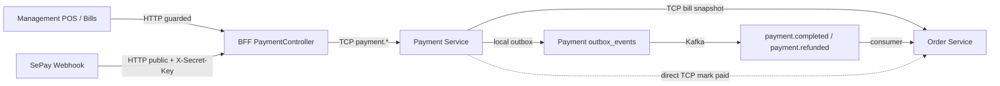

# Phase 3 Payment — Code Quality & Refactor Audit

**Ngày audit:** 2026-05-09  
**Phạm vi:** Phase 3 Payment implementation + Step 2.4 Batch 3 Order persistence handoff  
**Trạng thái:** Audit/report only. Chưa sửa code, chưa refactor.  
**Verdict:** Request changes trước khi coi Phase 3 là ổn định để mở rộng.

---

## 1. Mục tiêu audit

Báo cáo này rà soát lại phần đã triển khai quanh Phase 3 Payment theo các trục:

- Tổ chức mã nguồn trong Nx monorepo.
- Ranh giới bounded context giữa Payment, Order, BFF, frontend.
- Chất lượng TypeScript contracts, enum/status, DTO/runtime validation.
- Đồng bộ biến môi trường, port, config, Kafka/TCP.
- Rủi ro conflict/bất đồng bộ trong luồng Payment -> Order.
- Test coverage, lint/build signals, CI/Nx hygiene.
- Kế hoạch refactor tiếp theo, nhưng không thực hiện refactor trong audit này.

---

## 2. Tài liệu và nguồn đã đọc

### Tài liệu nội bộ

- `docs/superpowers/handoffs/step-2.4/2026-04-29-step-2.4-batch-3-handoff.md`
- `docs/superpowers/plans/2026-05-08-phase-3-payment-implementation-plan.md`
- `docs/specs/business-logic-phase-3-spec.vi.md`
- `docs/phases/phase-3-payment.md`
- `docs/superpowers/audits/phase-3-payment-audit-report.md`
- `docs/superpowers/audits/phase-3-payment-audit-report.vi.md`
- `docs/architecture/permission-matrix.md`
- `AGENTS.md`

### Code được rà soát trọng tâm

- `apps/payment/src/app/modules/payment/**`
- `apps/payment/src/configuration/index.ts`
- `apps/payment/src/main.ts`
- `apps/bff/src/app/modules/payment/**`
- `apps/order/src/app/modules/order/services/bill.service.ts`
- `apps/order/src/app/modules/order/services/payment-events-consumer.service.ts`
- `apps/order/src/app/modules/order/controllers/order.controller.ts`
- `libs/interfaces/src/lib/tcp/payment/**`
- `libs/interfaces/src/lib/gateway/payment/**`
- `libs/interfaces/src/lib/tcp/order/**`
- `libs/shared/types/src/lib/bill.types.ts`
- `libs/constants/src/lib/enum/tcp-request-message.ts`
- `libs/configuration/src/lib/tcp.config.ts`
- `libs/configuration/src/lib/kafka.config.ts`
- `apps/management-app/src/features/payment/**`
- `.env.example`
- `apps/*/project.json`

### Context7 / official docs đã dùng

Theo yêu cầu "use context7", đã tra cứu NestJS bằng Context7 CLI:

```bash
npx ctx7@latest library "NestJS" "Review NestJS microservices TCP transport, ConfigModule environment validation, guards, controllers, and provider organization for a NestJS Nx microservices payment service audit"
npx ctx7@latest docs /nestjs/docs.nestjs.com "NestJS microservices TCP transport ClientProxy send, MessagePattern handlers, ConfigModule environment validation, guard organization, and provider/module structure best practices for auditing a payment microservice"
```

Kết quả docs chính thức được dùng để đối chiếu:

- NestJS TCP microservice bootstrap dùng `NestFactory.createMicroservice()` hoặc `app.connectMicroservice()` với `Transport.TCP`.
- `ClientProxy.send(pattern, payload)` trả Observable response theo message pattern.
- `@MessagePattern()` định tuyến TCP handler.
- Config nên được validate ở boot thông qua `ConfigModule`/validation schema hoặc cơ chế validation tương đương.
- Guard có thể áp dụng cho HTTP route và microservice handler tùy boundary.

Nguồn Context7 trả về:

- `https://github.com/nestjs/docs.nestjs.com/blob/master/content/microservices/basics.md`
- `https://github.com/nestjs/docs.nestjs.com/blob/master/content/microservices/guards.md`
- `https://github.com/nestjs/docs.nestjs.com/blob/master/content/techniques/configuration.md`

---

## 3. Verification đã chạy

Các lệnh dưới đây được chạy trong workspace hiện tại. Một số lệnh ban đầu đọc cache; sau đó đã chạy lại với `--skip-nx-cache` cho build/lint trọng yếu.

| Lệnh                                                                                                          | Kết quả | Ghi chú                                                               |
| ------------------------------------------------------------------------------------------------------------- | ------- | --------------------------------------------------------------------- |
| `npx nx test payment`                                                                                         | PASS    | 5 suites, 19 tests                                                    |
| `npx nx test order --testFile=apps/order/src/app/modules/order/tests/payment-events-consumer.service.spec.ts` | PASS    | 1 suite, 8 tests                                                      |
| `npx nx test bff --testFile=apps/bff/src/app/modules/payment/tests/payment.controller.spec.ts`                | PASS    | Nhưng thực tế chạy toàn bộ BFF: 14 suites, 82 tests                   |
| `npx nx build payment --configuration=development --skip-nx-cache`                                            | PASS    | Webpack compiled successfully                                         |
| `npx nx build order --configuration=development --skip-nx-cache`                                              | PASS    | Webpack compiled successfully                                         |
| `npx nx build entities --skip-nx-cache`                                                                       | PASS    | Nx vẫn báo `entities:build` flaky                                     |
| `npx nx lint payment --skip-nx-cache`                                                                         | PASS    | 0 errors                                                              |
| `npx nx lint order --skip-nx-cache`                                                                           | PASS    | 0 errors                                                              |
| `npx nx lint bff --skip-nx-cache`                                                                             | PASS    | 0 errors, 18 warnings trong guard specs                               |
| `npx nx lint management-app --skip-nx-cache`                                                                  | PASS    | 0 errors, 17 warnings                                                 |
| `npx nx build management-app --skip-nx-cache`                                                                 | PASS    | Next build pass; warning middleware deprecated và Recharts width `-1` |

### Verification caveats

- `bff --testFile` không filter đúng như kỳ vọng; cần chỉnh target Jest hoặc dùng option đúng của Nx/Jest.
- `management-app` có test files nhưng `apps/management-app/project.json` không có `test` target và `apps/management-app/package.json` không có script `test`.
- Nx báo `entities:build` flaky dù build pass. Đây là tín hiệu CI/hệ cache cần xử lý riêng.

---

## 4. Architecture snapshot



Điểm cần chú ý: code hiện tại vừa dùng event-driven outbox/Kafka, vừa có direct TCP `BILL_MARK_PAID` từ Payment sang Order sau khi Payment transaction commit. Đây là quyết định kiến trúc cần được chốt rõ bằng ADR.

---

## 5. Findings theo severity

### P3-A01 — High — Payment hoàn tất Order bằng cả direct TCP và Kafka event

**Bằng chứng**

- `apps/payment/src/app/modules/payment/services/payment.service.ts`
  - `confirmCash()` ghi outbox `payment.completed`, sau đó gọi `markBillPaidTcp()`.
  - `handleSepayWebhook()` ghi outbox `payment.completed`, sau đó gọi `markBillPaidTcp()`.
- `apps/order/src/app/modules/order/services/payment-events-consumer.service.ts`
  - Consumer Kafka `payment.completed` cũng gọi `billService.markPaid()`.
- Phase 3 plan mô tả Payment publish `payment.completed` qua local outbox, Order Service consume event để cập nhật bill.

**Tác động**

- Có hai đường ghi cùng một state Order: direct TCP và Kafka consumer.
- Nếu direct TCP thành công, Kafka event sau đó trở thành duplicate/no-op. Điều này có thể chấp nhận được nếu được document, nhưng hiện chưa có ADR.
- Nếu direct TCP thất bại và Kafka consumer không chạy, BFF có thể trả về Payment đã paid nhưng Bill vẫn `PENDING_PAYMENT` trong một khoảng thời gian hoặc lâu hơn.
- Nếu sau này thêm Catalog/Notification/BFF bridge, source of truth "ai đóng bill" càng dễ bị hiểu sai.

**Khuyến nghị**

Chọn một trong hai hướng:

1. **Event-only, đúng spec hơn:** Payment chỉ ghi payment + outbox trong transaction; Order chỉ cập nhật bill qua Kafka consumer.
2. **Sync-fast-path có fallback event:** Giữ direct TCP để giảm latency POS, nhưng ADR phải nói rõ đây là optimization; Kafka vẫn là recovery/event propagation. Cần metric/log để phát hiện direct TCP fail và cần test idempotency.

**Acceptance criteria**

- Có ADR ngắn trong `docs/superpowers/specs/` hoặc `docs/architecture/`.
- Tests cover duplicate `payment.completed` khi bill đã `PAID`.
- Tests cover direct TCP failure nhưng outbox vẫn pending/published.
- Payment service không có đường cập nhật Order "ngầm" không được document.

---

### P3-A02 — High — Manual refund dùng `roundedTotal`, có thể sai khi VietQR overpaid

**Bằng chứng**

- Phase 3 decision: VietQR overpaid được accept, lưu actual `paidAmount`.
- `apps/payment/src/app/modules/payment/services/payment.service.ts` set `payment.paidAmount = payload.transferAmount` trong SePay flow.
- `apps/payment/src/app/modules/payment/services/refund.service.ts` tạo refund với `amount: payment.roundedTotal`.

**Tác động**

- Nếu khách chuyển khoản nhiều hơn bill total, hệ thống ghi nhận `paidAmount` lớn hơn `roundedTotal`.
- Refund "full refund only" hiện sẽ hoàn `roundedTotal`, không phải actual paid amount.
- Audit/refund/reconciliation có thể thiếu phần overpaid.

**Khuyến nghị**

- Làm rõ policy: full refund nghĩa là full bill amount hay full actual paid amount.
- Nếu theo nghĩa full payment, dùng `payment.paidAmount ?? payment.roundedTotal`.
- Nếu chỉ refund bill amount, cần rename/copy rõ trong UI/audit: "refund bill total, not overpayment balance" và có flow xử lý phần dư.

**Acceptance criteria**

- Test `requestRefund()` với `paidAmount > roundedTotal`.
- Refund response/audit ghi amount đúng policy.
- Docs Phase 3 cập nhật rõ behavior overpaid refund.

---

### P3-A03 — High — SePay webhook thiếu runtime validation DTO/schema

**Bằng chứng**

- BFF webhook nhận `@Body() payload: SepayWebhookPayload`.
- `SepayWebhookPayload` là TypeScript type trong `libs/interfaces/src/lib/tcp/payment/payment-request.interface.ts`, không phải class DTO có decorator.
- Global `ValidationPipe` không validate được type-only interface.

**Tác động**

- External input từ SePay đi vào Payment Service mà không có runtime boundary validation.
- Các field như `id`, `transferAmount`, `transferType`, `transactionDate`, `content` có thể missing/sai type.
- Payment Service có thể log/audit payload xấu hoặc throw lỗi không kiểm soát.

**Khuyến nghị**

- Tạo `SepayWebhookRequestDto` trong gateway payment DTO.
- Validate:
  - `id`: number/int
  - `transferType`: enum `in | out`
  - `transferAmount`: positive number
  - `content`, `gateway`, `accountNumber`, `referenceCode`, `transactionDate`: string với length limit
  - nullable fields: `code`, `subAccount`
- BFF public endpoint vẫn `@Authorization({ secured: false })`, nhưng input phải validate trước TCP.

**Acceptance criteria**

- Request body malformed trả 400 qua BFF.
- Missing/invalid `X-Secret-Key` vẫn trả 401.
- Valid SePay webhook vẫn trả raw `{ success: true }`.

---

### P3-A04 — High — Payment domain statuses/actions bị định nghĩa phân tán

**Bằng chứng**

- `apps/payment/src/app/modules/payment/entities/payment.entity.ts` định nghĩa `PaymentStatus`.
- `apps/payment/src/app/modules/payment/entities/refund.entity.ts` định nghĩa `RefundStatus`.
- `apps/payment/src/app/modules/payment/entities/audit-payment.entity.ts` định nghĩa `AuditPaymentAction`, `AuditActorType`.
- `libs/interfaces/src/lib/tcp/payment/payment-response.interface.ts` định nghĩa lại `PaymentStatus`, `RefundStatus`.
- `apps/management-app/src/features/payment/services/payment.service.ts` copy literal unions cho payment/refund status.
- `libs/shared/constants/src/lib/status.ts` có comment cũ: `PAYMENT_STATUSES` removed, replaced by `BillStatus`, dễ gây hiểu nhầm vì Phase 3 Payment aggregate thật sự cần status riêng.

**Tác động**

- Khi thêm status/action mới, frontend/backend/TCP/entity dễ lệch nhau.
- Không có một source of truth cho status dùng trong DB/API/UI.
- Audit/permission/reporting khó reuse type.

**Khuyến nghị**

- Tạo shared contract rõ ràng, ví dụ:
  - `libs/shared/types/src/lib/payment.types.ts`
  - `PaymentStatus`, `RefundStatus`, `PaymentAuditAction`, `PaymentActorType`
  - dùng const-object + type alias theo ADR hiện có.
- Entity, TCP response, frontend service import từ shared contract.
- Cập nhật comment cũ trong `status.ts`: Payment aggregate status bị loại bỏ ở Phase 2A, nhưng được tái lập có chủ đích ở Phase 3.

**Acceptance criteria**

- `rg "type PaymentStatus|type RefundStatus"` chỉ còn source of truth và import.
- Enum completeness tests cover payment/refund/audit statuses.
- Management app không copy literal status union.

---

### P3-A05 — Medium — `Bill.paymentId` có trong shared contract nhưng không persisted/returned

**Bằng chứng**

- `libs/shared/types/src/lib/bill.types.ts` có `paymentId?: string`.
- `libs/entities/src/lib/bill.entity.ts` chưa có column `payment_id`.
- `apps/order/src/app/modules/order/services/bill.service.ts` `markPaid()` nhận `paymentId` nhưng chỉ set `status`, `paymentMethod`, `paidAt`.
- `toBillDto()` không trả `paymentId`.

**Tác động**

- Frontend/shared contract gợi ý Bill biết Payment aggregate id, nhưng DB và response không có.
- Refund/history có thể cần mapping bill -> payment; hiện phải query Payment history riêng.
- Dễ gây bug khi UI hoặc service khác tin rằng `bill.paymentId` tồn tại.

**Khuyến nghị**

Chốt một trong hai:

- Bill không lưu payment reference: remove `paymentId` khỏi shared Bill contract.
- Bill có lưu payment reference: thêm `payment_id` nullable vào entity, set trong `markPaid()`, trả trong DTO, test.

**Acceptance criteria**

- Contract, entity, service response nhất quán.
- `BillMarkPaidTcpRequest.paymentId` không bị bỏ qua nếu vẫn tồn tại.

---

### P3-A06 — Medium — DB constraints trong Payment entities chưa phản ánh spec đầy đủ

**Bằng chứng**

- Spec/audit schema có check constraints cho payment status, method, non-negative amounts.
- Current TypeORM entity dùng `varchar` và TypeScript union, nhưng DB không enforce:
  - `PaymentEntity.status`
  - `PaymentEntity.method`
  - `RefundEntity.status`
  - amount fields

**Tác động**

- DB có thể chứa status/action sai nếu bug hoặc manual migration insert.
- TypeScript union không bảo vệ dữ liệu persisted.
- Query/reporting sau này dễ gặp giá trị lạ.

**Khuyến nghị**

- Thêm `@Check` constraints hoặc migration SQL explicit.
- Tối thiểu tạo centralized constants và validate trước save.
- Vì project đang `synchronize: true`, vẫn nên document rằng production cần migration/check constraints trước khi tắt synchronize.

**Acceptance criteria**

- Entity metadata hoặc migration có status/method/amount checks.
- Test entity metadata hoặc integration test DB constraint nếu có test DB.

---

### P3-A07 — Medium — Kafka outbox/consumer thiếu retry-on-startup và multi-instance safety

**Bằng chứng**

- `PaymentOutboxPublisherService.onModuleInit()` connect Kafka fail thì log error và set producer `null`; không retry.
- `PaymentEventsConsumerService.onModuleInit()` connect/subscribe/run fail thì disconnect và set consumer `null`; không retry.
- Outbox polling dùng `findPendingRows()` không có row lock/claim mechanism.

**Tác động**

- Kafka tạm thời chưa sẵn sàng lúc service boot: service chạy nhưng event publisher/consumer có thể không tự phục hồi.
- Nếu scale nhiều instance Payment, nhiều poller có thể đọc cùng pending rows và publish duplicate. At-least-once chấp nhận duplicate, nhưng cần idempotent consumers và eventId handling rõ hơn.
- Current Order consumer idempotent theo bill state `PAID` no-op, nhưng không track eventId.

**Khuyến nghị**

- Thêm startup retry/backoff hoặc health/readiness fail khi Kafka integration bắt buộc.
- Thêm in-process guard để tránh overlapping poll cycle.
- Nếu scale multi-instance, dùng DB claim: status `PROCESSING`, `locked_at`, `locked_by`, hoặc `FOR UPDATE SKIP LOCKED`.
- Chuẩn hóa event idempotency policy.

**Acceptance criteria**

- Test producer connect failure retries hoặc exposes degraded health.
- Test duplicate event does not corrupt bill.
- Docs ghi rõ Phase 3 single-instance hay multi-instance assumption.

---

### P3-A08 — Medium — Payment config vẫn fallback DB về shared `qrtable`

**Bằng chứng**

- `apps/payment/src/configuration/index.ts` đặt `DEFAULT_PAYMENT_DATABASE = 'qrtable'`.
- `PaymentTypeOrmConfiguration` dùng `PAYMENT_TYPEORM_DATABASE || TYPEORM_DATABASE || qrtable`.
- Target standard nói database-per-service; Payment owns `payments`, `refunds`, `audit_payments`, local outbox.

**Tác động**

- Local/dev dễ chạy chung DB, trái với mental model database-per-service.
- Khi deploy production, nếu quên `PAYMENT_TYPEORM_DATABASE`, Payment tables có thể xuất hiện trong DB chung.

**Khuyến nghị**

- Quyết định rõ:
  - Local demo chấp nhận fallback shared DB.
  - Production/staging bắt buộc `PAYMENT_TYPEORM_DATABASE`.
- Validate theo `NODE_ENV`: production không cho fallback `qrtable`.
- `.env.example` nên đưa `PAYMENT_TYPEORM_DATABASE=qrtable_payment` rõ ràng, không chỉ comment.

**Acceptance criteria**

- Config test cover production missing `PAYMENT_TYPEORM_DATABASE`.
- Deployment guide ghi rõ DB ownership.

---

### P3-A09 — Medium — Test coverage Payment chưa bám rủi ro nghiệp vụ

**Bằng chứng**

- `payment.service.spec.ts` hiện có một số policy checks và unique collision case.
- `refund.service.spec.ts` chỉ assert literal strings, chưa instantiate `RefundService`.
- Chưa thấy unit tests đầy đủ cho:
  - underpaid webhook matched payment
  - duplicate webhook id
  - webhook after cash paid
  - overpaid VietQR refund amount
  - direct TCP markBillPaid failure
  - outbox creation trong same transaction

**Tác động**

- Những case rủi ro cao nhất của Payment Phase 3 chưa được bảo vệ.
- Refactor sau này dễ làm lệch behavior mà test vẫn pass.

**Khuyến nghị**

- Trước khi refactor service, viết behavior tests theo spec.
- Test không cần DB thật ở bước đầu; mock `DataSource.transaction`, repositories, outbox repo.
- Sau đó cân nhắc integration test với test DB nếu migration/constraint được thêm.

**Acceptance criteria**

- `refund.service.spec.ts` test actual `requestRefund()` và `confirmRefund()`.
- `payment.service.spec.ts` cover webhook/cash/QR/idempotency cases.
- Test names mô tả policy bằng business language.

---

### P3-A10 — Medium — Frontend payment types copy contract backend

**Bằng chứng**

- `apps/management-app/src/features/payment/services/payment.service.ts` tự định nghĩa `StaffPaymentRecord`, `RefundRecord` với literal statuses.
- Backend đã có TCP/gateway response types nhưng chưa có shared frontend-safe contract.

**Tác động**

- Frontend và backend có thể lệch status/field mà TypeScript không bắt được.
- Refactor Payment status/action phải sửa thủ công nhiều nơi.

**Khuyến nghị**

- Dùng shared payment contract từ `libs/shared/types`.
- Nếu frontend không import backend TCP types trực tiếp, tạo gateway-facing types riêng ở shared lib.
- Response DTO nên có status type cụ thể, không dùng `string`.

**Acceptance criteria**

- Management app imports `PaymentStatus`, `RefundStatus`, response shape từ shared contract.
- No duplicated literal status unions in app code.

---

### P3-A11 — Low/Medium — Payment UI dùng polling, chưa thấy BFF bridge `payment.completed`

**Bằng chứng**

- `usePaymentHistoryQuery()` refetch mỗi 3s khi có `PENDING`.
- Search trong `apps/bff/src/app/modules/realtime` không thấy `payment.completed` bridge.
- Phase 3 docs nói POS/PWA có thể nhận confirmation qua WebSocket/realtime path.

**Tác động**

- POS vẫn hoạt động bằng polling, nhưng realtime contract trong docs chưa hoàn chỉnh.
- Customer PWA chỉ hiển thị trạng thái bill/request payment, chưa có payment completed bridge.

**Khuyến nghị**

- Chốt Phase 3 baseline: polling-only hay realtime bridge.
- Nếu realtime là yêu cầu Phase 3, thêm BFF Kafka bridge cho `payment.completed` và invalidate/query UI theo event.
- Nếu polling-only cho Phase 3, update docs để không gây kỳ vọng sai.

**Acceptance criteria**

- Có test BFF bridge hoặc docs nói rõ polling-only.
- POS/PWA behavior nhất quán với spec.

---

### P3-A12 — Low/Medium — Nx project metadata và targets chưa đồng bộ

**Bằng chứng**

- `apps/payment/project.json` có `"tags": []`, trong khi `apps/order/project.json` có `["type:app", "scope:order"]`.
- `apps/management-app/project.json` và `apps/customer-pwa/project.json` cũng chưa có tags.
- `management-app` có test files nhưng không có Nx `test` target.
- `npx nx test bff --testFile=...` không filter như tên option gợi ý.

**Tác động**

- Module boundary rules hiện không enforce scope thật sự.
- CI khó chạy focused tests cho payment UI.
- Agents sau này khó xác định project ownership.

**Khuyến nghị**

- Thêm tags tối thiểu:
  - `payment`: `type:app`, `scope:payment`
  - `management-app`: `type:app`, `scope:management`
  - `customer-pwa`: `type:app`, `scope:customer`
- Thêm/chuẩn hóa test target cho frontend nếu muốn giữ tests.
- Cập nhật Jest/Nx command docs.

**Acceptance criteria**

- `nx show project payment` hiển thị tags đúng.
- `npx nx test management-app` chạy được hoặc test files được đưa về target hiện có.
- Focused BFF payment test command thực sự chỉ chạy suite payment.

---

### P3-A13 — Low — Lint/build warnings cần được gom cleanup, không chặn Phase 3

**Bằng chứng**

- BFF lint: 18 warnings `@typescript-eslint/no-explicit-any` trong guard specs.
- Management app lint: 17 warnings, gồm unused vars, `no-img-element`, React compiler incompatible library warnings với TanStack Table.
- Management app build: Next warning `middleware` convention deprecated, Recharts width/height `-1`.
- Nx build: `entities:build` flaky.

**Tác động**

- Không chặn compile hiện tại.
- Warnings tích tụ làm CI khó phân biệt warning mới/cũ.
- Recharts warning có thể báo layout SSR/prerender chưa ổn.

**Khuyến nghị**

- Tách cleanup warnings thành task riêng sau khi xử lý High/Medium findings.
- Với warnings intentional, thêm comment/disable scoped thay vì để noise.
- Theo dõi Nx flaky task riêng trong CI.

---

## 6. Những điểm đang ổn

- Payment app scaffold build được và đăng ký TCP service port `3208`.
- `.env.example` đã được align dải HTTP `3300-3308`, Payment HTTP `3308`, TCP `3208`.
- BFF Payment endpoints đã đi qua guard chain cho staff routes:
  - `@Authorization({ secured: true })`
  - `@Permissions([...])`
- SePay webhook đã public có secret check riêng, không dùng user/tenant/permission guard.
- Secret compare dùng `timingSafeEqual`, tốt hơn string compare thông thường.
- Payment repositories hầu hết đều tenant-scoped ở các query staff/payment id.
- Payment reference extraction ưu tiên `code`, fallback `content`, phù hợp SePay payload reality.
- Payment outbox ghi trong transaction với payment/refund mutation.
- Order `markPaid()` idempotent ở mức bill đã `PAID` thì return no-op.
- Build/lint/test trọng yếu đều pass.

---

## 7. Refactor roadmap đề xuất

### Phase R0 — Decision lock trước khi sửa code

Mục tiêu: tránh refactor theo hai hướng trái nhau.

- Chốt ADR `Payment -> Order completion`: event-only hay sync-fast-path + event fallback.
- Chốt `full refund` dùng bill total hay actual paid amount.
- Chốt Bill có lưu `paymentId` hay không.
- Chốt Phase 3 frontend realtime: polling-only hay BFF bridge `payment.completed`.

Kết quả mong muốn:

- 1 ADR ngắn.
- Update nhỏ vào Phase 3 docs nếu policy thay đổi.
- Không sửa service code ở bước này.

### Phase R1 — Shared contracts và runtime validation

Mục tiêu: xóa bất đồng bộ type/status.

- Tạo shared payment domain types:
  - `PaymentStatus`
  - `PaymentMethod` reuse existing
  - `RefundStatus`
  - `PaymentAuditAction`
  - `PaymentActorType`
  - `PaymentCompletedEvent`
  - `PaymentRefundedEvent`
- BFF/payment/frontend import shared types.
- Tạo `SepayWebhookRequestDto`.
- Response DTO status chuyển từ `string` sang shared type.

Verification:

- `rg "type PaymentStatus|type RefundStatus"` không còn duplicate ngoài source of truth.
- `npx nx test shared-types`
- `npx nx test payment`
- `npx nx test bff`
- `npx nx build management-app`

### Phase R2 — Payment correctness tests trước refactor

Mục tiêu: khóa behavior trước khi tách service.

Test cần thêm:

- `createVietQr()` reuse pending payment.
- `confirmCash()`:
  - reject insufficient amount
  - reject already paid
  - create outbox in transaction
  - handle direct TCP policy theo ADR
- `handleSepayWebhook()`:
  - unmatched returns success
  - non-incoming returns success
  - underpaid audits but keeps `PENDING`
  - duplicate id no-op
  - after paid no-op
  - overpaid stores actual `paidAmount`
- `requestRefund()`:
  - rejects non-paid payment
  - uses correct amount per ADR
  - blocks duplicate active refund
- `confirmRefund()`:
  - transitions refund/payment
  - emits outbox

Verification:

- `npx nx test payment`
- `npx nx test order --testFile=apps/order/src/app/modules/order/tests/payment-events-consumer.service.spec.ts`

### Phase R3 — Split PaymentService responsibilities

Mục tiêu: giảm coupling và làm service dễ review.

Đề xuất tách:

- `PaymentSettlementService`: cash + common mark paid rules.
- `SepayWebhookService`: parse/match/apply webhook.
- `PaymentQueryService`: history/status.
- `PaymentOrderGateway`: TCP calls to Order.
- `PaymentMapper`: entity -> response.
- `PaymentReferenceService`: giữ như hiện tại.
- `PaymentEventBuilder`: chuyển sang shared event contract.

Không nên tách quá sâu nếu test chưa đủ. Tách theo behavior thật, không tách theo cảm giác.

Verification:

- Test behavior từ R2 vẫn pass.
- Build payment/order/bff pass không cache.

### Phase R4 — Outbox/Kafka hardening

Mục tiêu: làm rõ độ tin cậy event.

- Add retry/backoff on Kafka startup failure hoặc readiness degraded.
- Add poll overlap guard.
- Nếu multi-instance: claim rows bằng DB status/lock.
- Add event idempotency policy cho consumers.
- Add logs/metrics cho outbox failed rows.

Verification:

- Unit tests cho connect failure/retry hoặc degraded mode.
- Manual/automated test duplicate event no-op.

### Phase R5 — Nx/frontend cleanup

Mục tiêu: giảm noise CI và đồng bộ project boundaries.

- Add Nx tags cho payment/frontend apps.
- Add test target cho `management-app` hoặc di chuyển tests vào setup hiện hành.
- Fix/fence lint warnings.
- Fix Next middleware deprecation later.
- Investigate `entities:build` flaky warning.

Verification:

- `npx nx lint payment order bff management-app --skip-nx-cache`
- `npx nx build payment order entities management-app --skip-nx-cache`
- Focused frontend payment tests chạy được qua Nx hoặc documented command.

---

## 8. Open questions cần người phụ trách quyết định

1. Payment -> Order completion có cần synchronous POS latency thấp không, hay event-only là đủ?
2. Overpaid VietQR khi refund full thì refund actual paid amount hay bill rounded total?
3. Bill aggregate có nên lưu `paymentId` để truy vết nhanh không?
4. Phase 3 baseline có yêu cầu realtime `payment.completed` tới POS/PWA không, hay polling 3s chấp nhận được?
5. Production/staging có bắt buộc DB-per-service ngay từ Phase 3 không?
6. Phase 3 có chạy nhiều instance Payment/Order không, hay single-instance demo?

---

## 9. Suggested next action

Trước khi sửa code, nên tạo một plan refactor ngắn theo thứ tự:

1. ADR decisions.
2. Shared contracts + SePay DTO validation.
3. Behavior tests.
4. PaymentService split.
5. Outbox/Kafka hardening.
6. Nx/frontend cleanup.

Ưu tiên cao nhất là P3-A01, P3-A02, P3-A03, P3-A04 vì đây là các điểm có thể tạo bất đồng bộ production hoặc làm refactor sau này dễ sai hướng.

---

## 10. Appendix — command log summary

```bash
npx nx test payment
# PASS: 5 suites, 19 tests

npx nx test order --testFile=apps/order/src/app/modules/order/tests/payment-events-consumer.service.spec.ts
# PASS: 1 suite, 8 tests

npx nx test bff --testFile=apps/bff/src/app/modules/payment/tests/payment.controller.spec.ts
# PASS: 14 suites, 82 tests
# Caveat: command did not limit to only payment.controller.spec.ts

npx nx build payment --configuration=development --skip-nx-cache
# PASS

npx nx build order --configuration=development --skip-nx-cache
# PASS

npx nx build entities --skip-nx-cache
# PASS
# Caveat: Nx detected flaky task entities:build

npx nx lint payment --skip-nx-cache
# PASS, 0 errors

npx nx lint order --skip-nx-cache
# PASS, 0 errors

npx nx lint bff --skip-nx-cache
# PASS, 0 errors, 18 warnings

npx nx lint management-app --skip-nx-cache
# PASS, 0 errors, 17 warnings

npx nx build management-app --skip-nx-cache
# PASS
# Caveat: Next middleware deprecated warning, Recharts width/height warning
```
