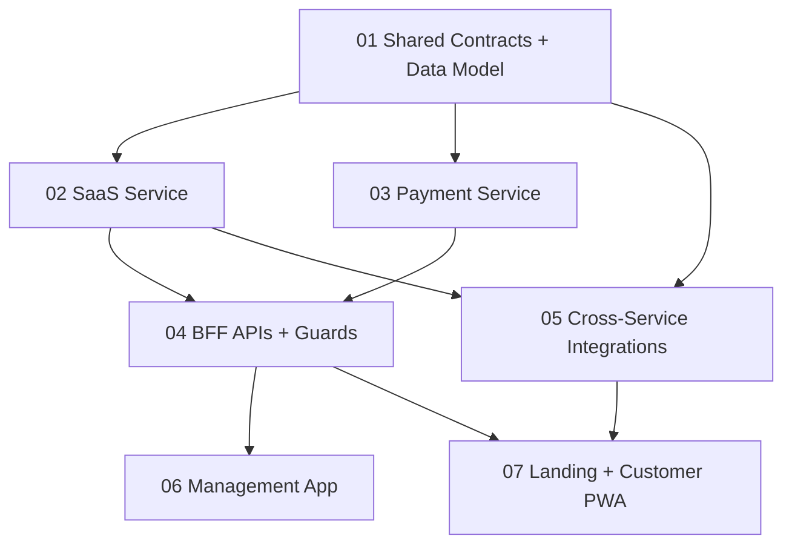

# Phase 4B SaaS Execution Map Implementation Plan

> **For agentic workers:** REQUIRED SUB-SKILL: Use `superpowers:executing-plans` and `superpowers:subagent-driven-development` to implement this plan task-by-task directly on `main`. Steps use checkbox (`- [ ]`) syntax for tracking.

**Goal:** Chia Phase 4B thành các release độc lập, test được, đúng Path 2.5: admin-assisted onboarding, SaaS lifecycle/subscription, SePay OAuth2 Connect cho tenant, Tier 2 subscription billing, landing static, và suspend behavior.

**Architecture:** BFF vẫn là API gateway và guard boundary; SaaS Service sở hữu tenant/plan/subscription/invoice; Payment Service sở hữu tenant payment settings và SePay OAuth tokens; các service còn lại chỉ nhận contract nhỏ đúng bounded context. Plan ưu tiên small vertical slices, giữ backward compatibility với `saas.*` route hiện có, rồi thêm namespace `tenant.*`, `subscription.*`, `plan.*`, `payment_settings.*`.

**Tech Stack:** Nx 22, NestJS 11, TypeORM/PostgreSQL, Mongoose/MongoDB, Redis cache, KafkaJS, TCP microservices, Next.js 16, React/Vite PWA, shadcn/ui, TanStack Query, Jest/Vitest, browser-use for UI verification during execution.

---

## 0. Inputs Đã Xác Nhận

- Spec chính thức: `docs/specs/business-logic-phase-4b-spec.md`.
- Audit: `docs/superpowers/audits/phase-4b-audit-report.md`.
- Q25 đã chốt `E (Resolved)`: đã có SePay Client ID + Client Secret.
- Redirect URI thật: `https://saas-pos-microservices-qrtable-mana.vercel.app/dashboard/payment-settings/sepay-callback`.
- Backend public webhook base phải dùng `PUBLIC_API_BASE_URL`, không hardcode frontend Vercel domain.
- Context7 CLI đã dùng:
  - `npx ctx7@latest library "NestJS" ...` → chọn `/nestjs/docs.nestjs.com`.
  - `npx ctx7@latest docs /nestjs/docs.nestjs.com ...` → xác nhận patterns: injectable services, TypeORM repository injection, TCP microservice bootstrap, `Test.createTestingModule`.
  - `npx ctx7@latest library "Nx" ...` → chọn `/websites/nx_dev` cho Nx monorepo/affected workflow. Không gọi thêm docs vì AGENTS.md giới hạn tối đa 3 ctx7 commands/question.

## 1. Plan Files

Implement theo đúng thứ tự sau. Mỗi file có file map, tasks, commands, acceptance checks riêng.

1. `docs/superpowers/plans/2026-05-12-phase-4b-saas/01-shared-contracts-data-model.md`
   - Shared constants, permissions, TCP interfaces, TypeORM entities, Mongo schema fields, seed/migration scripts.
2. `docs/superpowers/plans/2026-05-12-phase-4b-saas/02-saas-service-lifecycle-subscription.md`
   - SaaS bounded context: tenants, plans, subscriptions, invoices, onboarding mini-saga, cron, outbox.
3. `docs/superpowers/plans/2026-05-12-phase-4b-saas/03-payment-service-sepay-connect.md`
   - Payment bounded context: tenant payment settings, AES-GCM token storage, SePay OAuth2 client, bank selection, Tier 1 QR generation.
4. `docs/superpowers/plans/2026-05-12-phase-4b-saas/04-bff-guards-webhooks-api.md`
   - BFF REST API, `TenantStatusGuard`, `TenantPlanGuard`, webhook routing, response DTO mapping.
5. `docs/superpowers/plans/2026-05-12-phase-4b-saas/05-cross-service-integrations-quotas.md`
   - Authorizer, User-Access, Catalog, Order quota counters, Kafka consumer side effects.
6. `docs/superpowers/plans/2026-05-12-phase-4b-saas/06-management-app-admin-dashboard.md`
   - Management app admin/dashboard pages: tenants, plans, subscription, billing, payment-settings.
7. `docs/superpowers/plans/2026-05-12-phase-4b-saas/07-landing-customer-pwa-quality-gates.md`
   - Landing page with `ui-ux-pro-max`, Customer PWA suspended mode, browser-use verification, final quality gates.

## 2. Dependency Graph



## 3. Execution Rules

- Work directly on `main`. Do not create a branch or git worktree for Phase 4B execution.
- Commit exactly once after finishing each plan file and passing that file's verification commands.
- Subagents may implement/review tasks, but they must not create per-task commits. The coordinator makes the single plan-file commit after the final review gate.
- During a plan file, leave changes uncommitted until all tasks in that file are done; use `git status --short` frequently to keep the working tree understandable.
- Do not combine changes from two plan files into one commit unless the files explicitly share a single verification boundary.
- All controllers stay thin. Business rules live in services. Repository code remains behind providers.
- No service may write another service's database.
- No secrets in code, logs, tests, snapshots, Markdown examples, or screenshots.
- Keep old `saas.*` contracts working until the new BFF routes and frontend are green.
- Mock SePay only in tests/local isolation. The production/demo path uses real SePay OAuth credentials from env.

## 4. Global Verification Commands

Run scoped commands inside each plan. Run these before declaring Phase 4B ready:

```bash
pnpm nx test saas
pnpm nx test payment
pnpm nx test bff
pnpm nx test user-access
pnpm nx test authorizer
pnpm nx test catalog
pnpm nx test order
pnpm --dir apps/management-app test
pnpm --dir apps/customer-pwa test
pnpm nx run-many -t lint --projects=saas,payment,bff,user-access,authorizer,catalog,order
```

Expected:

```txt
All selected test targets pass.
All selected lint targets pass or report only pre-existing issues explicitly documented in the execution note.
```

## 5. Quality Review Gate

Before committing each plan file's work, run a code-review pass using `code-review-and-quality` with this checklist:

- Correctness: task acceptance checks pass and cover negative paths.
- Readability: controllers are thin, service methods are named by domain intent, no large god service added without deliberate split.
- Architecture: data ownership follows §3 of the spec; no cross-service DB access.
- Security: no token/plain webhook secret logging; env validation fails fast when required secrets are missing.
- Performance: list endpoints are paginated; no unbounded tenant-wide scans on hot paths.
- Verification: include exact commands and output summary in the commit or handoff.
