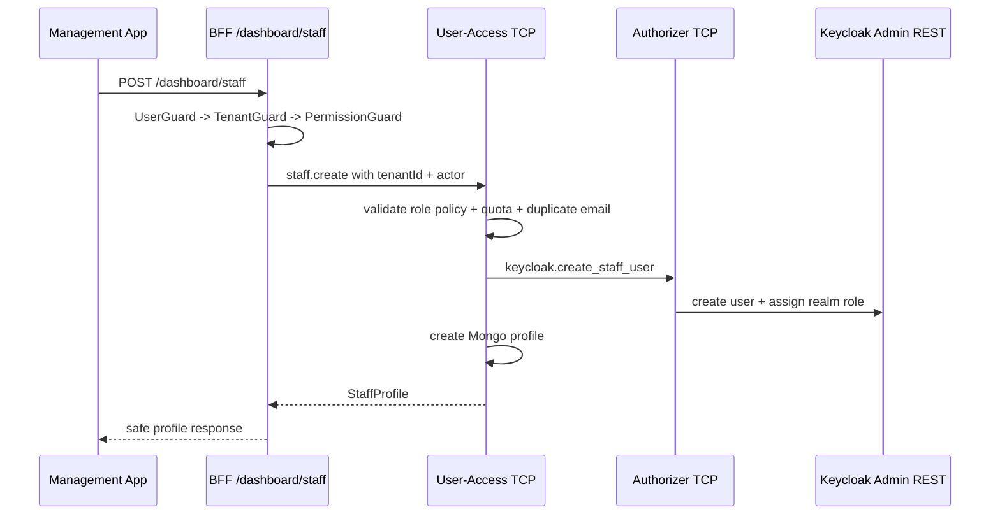

# Phase 4C Staff Management Design

> **Status:** Approved direction from audit on 2026-05-31.
> **Canonical phase doc:** `docs/phases/phase-4c-staff-management.md`.
> **Scope:** Phase 4C.1 backend and Phase 4C.2 Management App UI.

## 1. Goal

Phase 4C enables tenant Owner and Manager users to manage restaurant staff from the Management App without exposing Keycloak Admin operations to the browser. The feature covers staff creation, tenant-scoped directory listing/detail, Owner-only role reassignment, Owner-only disable, and Owner-only re-enable.

Notification/email delivery remains outside this phase. Staff setup uses a provided initial password and optional Keycloak `UPDATE_PASSWORD` required action.

## 2. Audit Baseline

CodeGraph and source inspection show these reusable pieces:

- `User` Mongo schema already has `tenantId`, `isActive`, `disabledAt`, and `roles`.
- `role.json` and `PERMISSION` already define the six canonical roles and staff permissions.
- `User-Access` already enforces `max_staff` quota through SaaS current subscription.
- `Authorizer` already has Keycloak create-owner, assign realm role, disable user, and admin get-user helpers.
- BFF already applies `UserGuard` -> `TenantGuard` -> `PermissionGuard`.
- `/dashboard/staff` exists but renders a skeleton page instead of staff-management behavior.

The audit found these conflicts or gaps:

- Phase text previously said staff role change should use `ROLE_UPDATE`, but the permission matrix grants `role.update` only to `SUPER_ADMIN`. Role template management is not staff membership management. The phase doc now uses `USER_UPDATE` plus an Owner-only policy check.
- Current BFF user route exposes only `POST /users`, not stable `/dashboard/staff` routes.
- Current staff create flow can create Keycloak users but does not assign Keycloak realm roles, which can trigger `AUTH_ROLE_MAPPING_MISMATCH` on login.
- Current `CreateUserRequestDto.roles` carries Mongo role ids, but Phase 4C needs role names such as `WAITER`, `CHEF`, and `BARISTA`.
- User-Access has no tenant-scoped list/get/update/role-change/enable/disable staff commands.
- Authorizer has no replace-role operation. Context7 Keycloak docs confirm Admin REST supports POST and DELETE on `/users/{id}/role-mappings/realm` for realm role mappings, plus PUT `/users/{id}` with `enabled`.

## 3. Product Policy

Phase 4C staff policy:

| Actor                         | Can list                                  | Can create                             | Can change role                                 | Can disable                    | Can enable                     |
| ----------------------------- | ----------------------------------------- | -------------------------------------- | ----------------------------------------------- | ------------------------------ | ------------------------------ |
| `OWNER`                       | Yes                                       | `MANAGER`, `WAITER`, `CHEF`, `BARISTA` | Yes, for `MANAGER`, `WAITER`, `CHEF`, `BARISTA` | Yes                            | Yes                            |
| `MANAGER`                     | Yes                                       | `WAITER`, `CHEF`, `BARISTA`            | No                                              | No                             | No                             |
| `WAITER` / `CHEF` / `BARISTA` | No                                        | No                                     | No                                              | No                             | No                             |
| `SUPER_ADMIN`                 | Not a dashboard-staff actor in this phase | Not through `/dashboard/staff`         | Not through `/dashboard/staff`                  | Not through `/dashboard/staff` | Not through `/dashboard/staff` |

Non-goals:

- Owner transfer.
- Creating another Owner.
- Managing `SUPER_ADMIN`.
- Tenant-specific custom role templates.
- Notification, invitation email, reset-password email, or SMTP/provider integration.
- Hard delete of staff profiles.

## 4. Architecture

The design keeps the existing service ownership:

- **BFF** owns external HTTP routes, guard chain, tenant context, permission checks, and actor policy checks that are about the current request.
- **Authorizer** owns Keycloak Admin REST operations: create identity, assign/replace realm roles, enable/disable identity, get admin user.
- **User-Access** owns Mongo application profiles, tenant staff membership, role references, staff counts, and profile active status.
- **Management App** owns staff directory UX and permission-aware controls.

Flow:



The source of truth is split:

- Keycloak decides whether the user can log in.
- User-Access profile decides tenant membership, application roles, permissions, and staff directory state.
- BFF rejects calls before reaching services when the current actor lacks permission or tenant context.

## 5. API Surface

External BFF routes:

| Method  | Route                              | Permission       | Actor policy                                                  |
| ------- | ---------------------------------- | ---------------- | ------------------------------------------------------------- |
| `GET`   | `/dashboard/staff`                 | `USER_GET_ALL`   | Owner or Manager tenant actor                                 |
| `GET`   | `/dashboard/staff/:userId`         | `USER_GET_BY_ID` | Owner or Manager tenant actor                                 |
| `POST`  | `/dashboard/staff`                 | `USER_CREATE`    | Owner can create Manager/staff; Manager can create staff only |
| `PATCH` | `/dashboard/staff/:userId/role`    | `USER_UPDATE`    | Owner only                                                    |
| `POST`  | `/dashboard/staff/:userId/disable` | `USER_DELETE`    | Owner only                                                    |
| `POST`  | `/dashboard/staff/:userId/enable`  | `USER_UPDATE`    | Owner only                                                    |

The route parameter `userId` is the Keycloak subject stored as `User.userId`. Mongo `_id` is internal and must not be the browser contract for staff actions.

## 6. Data Contracts

### Staff role

Allowed staff-management role names:

```typescript
export type StaffRoleName = 'MANAGER' | 'WAITER' | 'CHEF' | 'BARISTA';
```

`OWNER` and `SUPER_ADMIN` are excluded from staff management payloads.

### Create staff request

```typescript
export interface CreateStaffRequest {
  email: string;
  firstName: string;
  lastName: string;
  roleName: StaffRoleName;
  password: string;
  requirePasswordUpdate?: boolean;
}
```

`requirePasswordUpdate` defaults to `true` for staff created from the dashboard. The UI may let the Owner/Manager turn it off for local demo speed, but backend behavior must be explicit.

### Change staff role request

```typescript
export interface ChangeStaffRoleRequest {
  roleName: StaffRoleName;
}
```

### Staff response

```typescript
export interface StaffProfileResponse {
  userId: string;
  tenantId: string;
  email: string;
  firstName: string;
  lastName: string;
  displayName: string;
  roleName: StaffRoleName;
  isActive: boolean;
  disabledAt: string | null;
  createdAt: string;
  updatedAt: string;
}
```

No password, Keycloak admin metadata, raw role ObjectId, or token data appears in this response.

### List query

```typescript
export interface ListStaffQuery {
  search?: string;
  roleName?: StaffRoleName;
  status?: 'ACTIVE' | 'DISABLED';
  page?: number;
  limit?: number;
}
```

`page` defaults to `1`, `limit` defaults to `20`, and maximum `limit` is `100`.

### List response

```typescript
export interface StaffListResponse {
  items: StaffProfileResponse[];
  page: number;
  limit: number;
  total: number;
}
```

## 7. Backend Design

### BFF

Add a focused dashboard staff controller instead of extending the legacy `/users` endpoint. This gives the Management App a stable contract and prevents Phase 4C from inheriting the old `roles: string[]` ObjectId shape.

Files:

- `apps/bff/src/app/modules/user/controllers/dashboard-staff.controller.ts`
- `apps/bff/src/app/modules/user/controllers/dashboard-staff.controller.spec.ts`
- `apps/bff/src/app/modules/user/user.module.ts`

BFF responsibilities:

- Read `tenantId` from `MetadataKey.TENANT_ID`.
- Read actor `userId`, roles, and permissions from `MetadataKey.USER_DATA`.
- Reject missing tenant with `TENANT_REQUIRED`.
- Reject Owner-only actions when the actor does not have `OWNER`.
- Forward all staff requests to User-Access TCP with `tenantId`, `requestedByUserId`, and `requestedByRoles`.

### User-Access

Add staff-specific service/repository methods rather than overloading `UserService.create`.

Files:

- `apps/user-access/src/app/modules/user/services/staff-management.service.ts`
- `apps/user-access/src/app/modules/user/services/staff-management.service.spec.ts`
- `apps/user-access/src/app/modules/user/repositories/user.repository.ts`
- `apps/user-access/src/app/modules/user/controllers/user.controller.ts`
- `apps/user-access/src/app/modules/user/user.module.ts`

User-Access responsibilities:

- Resolve role names through `role` collection and fail when the requested role is not one of `MANAGER`, `WAITER`, `CHEF`, `BARISTA`.
- Enforce actor policy for create/change/status.
- Enforce `max_staff` before Keycloak creation for tenant staff.
- Create Keycloak identity through Authorizer and only then create Mongo profile.
- If Mongo profile creation fails after Keycloak creation, disable the Keycloak user with reason `staff_profile_create_failed`.
- List only current tenant staff and exclude `OWNER`/`SUPER_ADMIN`.
- Replace profile role and Keycloak realm role as a coordinated action.
- Disable/enable one profile by `{ tenantId, userId }`.

### Authorizer

Generalize Keycloak admin operations for staff.

Files:

- `libs/interfaces/src/lib/tcp/authorizer/keycloak.request.interface.ts`
- `libs/interfaces/src/lib/tcp/authorizer/authorizer.response.interface.ts`
- `apps/authorizer/src/app/keycloak/services/keycloak-http.service.ts`
- `apps/authorizer/src/app/keycloak/services/keycloak-admin.service.ts`
- `apps/authorizer/src/app/keycloak/controllers/keycloak.controller.ts`
- `apps/authorizer/src/app/keycloak/services/keycloak-admin.service.spec.ts`

Authorizer responsibilities:

- Create staff user with `tenant_id` and assigned realm role.
- Replace managed realm roles by deleting existing QRTable app roles from the user and adding the requested role.
- Enable or disable a user through Keycloak `PUT /admin/realms/{realm}/users/{id}`.
- Preserve existing non-role user attributes when changing enabled status.

Context7 Keycloak confirmation:

- Keycloak Admin REST supports adding realm role mappings with POST `/users/{id}/role-mappings/realm`.
- It supports deleting realm role mappings with DELETE `/users/{id}/role-mappings/realm`.
- User enabled/disabled state is updated through the user representation `enabled` field on PUT `/users/{id}`.

## 8. UI Design

Replace the skeleton page at `/dashboard/staff` with a dashboard tool surface.

Files:

- `apps/management-app/src/features/staff/types.ts`
- `apps/management-app/src/features/staff/api.ts`
- `apps/management-app/src/features/staff/components/staff-table.tsx`
- `apps/management-app/src/features/staff/components/staff-filters.tsx`
- `apps/management-app/src/features/staff/components/create-staff-dialog.tsx`
- `apps/management-app/src/features/staff/components/change-staff-role-dialog.tsx`
- `apps/management-app/src/features/staff/components/staff-status-dialog.tsx`
- `apps/management-app/src/features/staff/hooks/use-staff-query.ts`
- `apps/management-app/src/app/(dashboard)/dashboard/staff/page.tsx`
- `libs/shared/constants/src/lib/vi-domain-labels.ts`
- `libs/shared/constants/src/index.ts`

UX rules:

- Owner and Manager see the staff directory.
- Owner sees create, role change, disable, and enable controls.
- Manager sees create controls only for `WAITER`, `CHEF`, and `BARISTA`.
- Disabled staff rows remain visible with a status badge.
- Staff status labels render through `staffStatusVi()` from `@einvoice/shared-constants`, not raw `ACTIVE` or `DISABLED`.
- Role labels render through `staffRoleVi()` from `@einvoice/shared-constants`, not raw wire values.
- The create dialog states in UI copy that email delivery is not part of the current system flow.

## 9. Error Modes

Stable backend errors:

| Error                              | HTTP | Meaning                                                                            |
| ---------------------------------- | ---- | ---------------------------------------------------------------------------------- |
| `TENANT_REQUIRED`                  | 403  | Authenticated route lacks tenant context                                           |
| `AUTH_PERMISSION_DENIED`           | 403  | Missing permission or actor policy violation                                       |
| `USER_ALREADY_EXISTS`              | 409  | Email already exists in User-Access or Keycloak duplicate mapped to staff creation |
| `USER_ID_REQUIRED`                 | 403  | Actor metadata missing user id                                                     |
| `TENANT_PLAN_LIMIT_EXCEEDED`       | 403  | Current plan max staff reached or subscription unavailable                         |
| `USER_NOT_FOUND`                   | 404  | Staff user does not exist in current tenant                                        |
| `USER_ROLE_NOT_MANAGEABLE`         | 400  | Requested or target role is outside Phase 4C staff scope                           |
| `USER_STATUS_INVALID`              | 409  | Requested enable/disable transition is redundant or invalid                        |
| `KEYCLOAK_ADMIN_PERMISSION_DENIED` | 403  | Authorizer service account lacks Keycloak admin rights                             |
| `KEYCLOAK_USER_CREATION_FAILED`    | 500  | Keycloak did not return a created user id                                          |

If new error codes are added, update `libs/error-messages` and any tests that assert stable codes.

## 10. Testing Strategy

Backend unit tests:

- Staff create maps role name to role id and Keycloak realm role.
- Manager cannot create Manager.
- Owner can create Manager.
- `max_staff` blocks before Keycloak mutation.
- Duplicate email blocks before Keycloak mutation.
- Mongo failure after Keycloak creation disables the Keycloak user.
- List staff filters by tenant, role, status, and search.
- Owner-only role change rejects Manager.
- Role change updates Keycloak and Mongo profile.
- Disable/enable is tenant-scoped and does not hard delete.

BFF controller tests:

- All routes require `Authorization({ secured: true })` and expected permissions.
- Owner-only actions reject non-Owner actors before forwarding.
- Tenant id and actor metadata are forwarded into TCP payload.

Frontend tests:

- Staff page renders table from API results.
- Filters update query parameters and refetch.
- Owner sees role/status actions.
- Manager does not see role/status actions and cannot choose `MANAGER` in create dialog.
- Create dialog submits role name and password payload.
- Status and role labels are mapped to display labels.

Manual smoke:

1. Owner creates `WAITER` with initial password.
2. New staff logs into Keycloak and lands at `/pos`.
3. Owner changes the staff role to `CHEF`.
4. Staff logs in again and lands at `/kds/kitchen`.
5. Owner disables staff.
6. Disabled staff login fails.
7. Owner enables staff.
8. Staff login succeeds again.

## 11. Rollout Notes

- Existing `POST /users` remains for compatibility but is not the Management App staff contract.
- Re-seed Mongo roles only if `role.json` changes. This design avoids changing the permission matrix.
- After changing role or status, manual verification must use a fresh login or cleared BFF `user-token:{sha256(jwt)}` cache because permissions are cached for 30 minutes.
- No Kafka topic is introduced. Staff management side effects are synchronous identity/profile changes and UI refetches.

## 12. Open Decisions Closed By This Spec

- **Role-change permission:** use `USER_UPDATE` plus Owner-only policy, not `ROLE_UPDATE`.
- **Enable support:** included because the UI and acceptance criteria already require disable/enable.
- **Managed role set:** `MANAGER`, `WAITER`, `CHEF`, `BARISTA`.
- **Staff action id:** use Keycloak `userId`, not Mongo `_id`.
- **Email delivery:** excluded.
