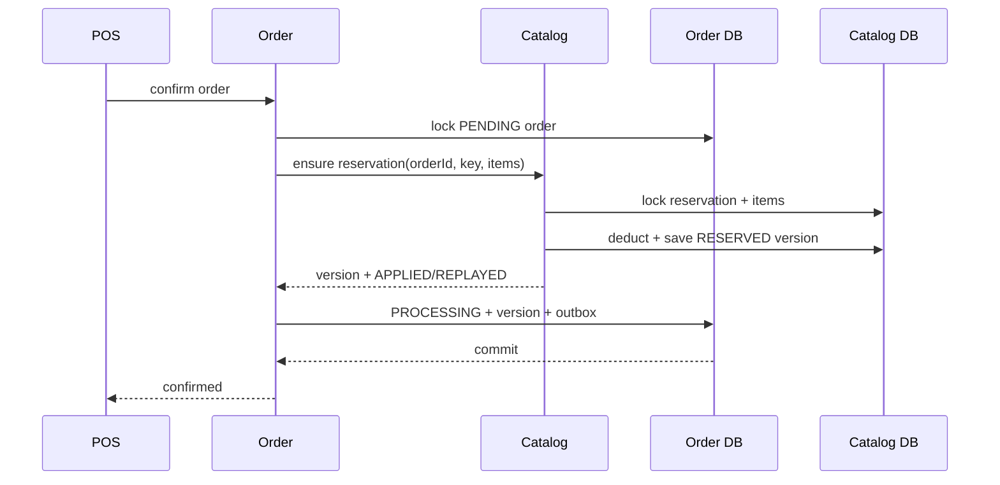

# Order Confirm Stock Idempotency Design

> **Status:** Implemented and verified on 2026-06-20.
> **Scope:** Thesis-complete end-to-end idempotency for Order Confirm stock deduction, compensation, and processing-order cancellation.
> **Canonical references:** `docs/phases/phase-4a-saga-hardening.md` and `docs/testing/phase-5/saga-validation-strategy.md`.
> **AI/slide handoff:** The pre-implementation finding that Catalog ignored `idempotencyKey` is obsolete. Use the implementation snapshot and claim policy below.

## 0. Implementation Snapshot For AI And Slide Sessions

The design in this document is implemented in the current working tree.

Current code behavior:

- Catalog reads and persists the deduct reservation key in `stock_reservations`.
- Catalog stores the immutable request hash, state, version, deduct result, and release result in PostgreSQL.
- The reservation transition and menu-item stock mutation share one Catalog transaction.
- Repeating the same active tenant/order/key/payload returns `REPLAYED` without another deduction.
- A matching release restores stock once; a duplicate release returns `REPLAYED`.
- Reconfirming after compensation increments the reservation version.
- An older release returns `STALE` and cannot release the newer reservation.
- Order stores `stock_reservation_version` with `PROCESSING`, order items, and `order.confirmed` outbox in one transaction.
- A bounded five-second first-response timeout prevents an unbounded Catalog TCP wait.

Primary implementation anchors:

- `apps/catalog/src/app/modules/menu-item/services/stock-reservation.service.ts`
- `apps/catalog/src/app/modules/menu-item/repositories/stock-reservation.repository.ts`
- `libs/entities/src/lib/stock-reservation.entity.ts`
- `apps/order/src/app/modules/order/services/order-confirm-saga.service.ts`
- `apps/order/src/app/modules/order/services/catalog-stock-gateway.service.ts`
- `apps/order/src/app/modules/order/tests/order-confirm-stock-idempotency.integration.spec.ts`

Fresh verification on 2026-06-20:

- Catalog: 13 suites, 88 tests passed.
- Order: 19 active suites, 120 tests passed; opt-in suites are separate.
- Order Confirm lost-response/version integration: 3 tests passed against PostgreSQL and Catalog TCP.
- Stock contention integration: 1 test passed against the external stack.
- Catalog and Order lint passed.
- `shared-types`, `entities`, Catalog, and Order builds passed. The `interfaces` project has no Nx `build` target and is compiled through consuming builds.
- Documentation anchors: 55 verified.

### Superseded finding

The following statement described the code before this implementation and must not be reused in slides:

> Catalog does not read `data.idempotencyKey`, does not persist the key, and therefore does not provide end-to-end stock idempotency.

That statement is no longer true. The remaining limitation is narrower: recovery after an ambiguous Catalog response requires the caller to retry the same Order confirm. There is no autonomous Saga recovery worker, and exactly-once TCP/Kafka delivery is not claimed.

### Slide-safe claim

> Catalog persists a versioned stock reservation in the same local transaction as the stock mutation. Repeating the same active reservation returns the stored result instead of deducting stock again; versioned release prevents duplicate or stale compensation from changing a newer reservation.

## 1. Goal

Make Catalog stock mutations idempotent across the Order-Catalog TCP boundary without introducing a general Saga framework, background recovery worker, CDC, or distributed lock.

The implementation must guarantee that:

- retrying the same active reservation does not deduct stock twice;
- retrying the same release does not restore stock twice;
- an order can be confirmed again after a completed compensation;
- an old compensation cannot release a newer reservation;
- reusing an order reservation with different item quantities is rejected;
- Catalog persists reservation state and stock changes in one local transaction;
- Order persists the Catalog reservation version with the successful confirmation.

Automatic recovery when no caller ever retries remains outside this scope.

## 2. Design-Time CodeGraph Baseline

CodeGraph was run before direct source inspection.

```text
Files: 1,222
Nodes: 15,715
Edges: 31,468
Index: up to date
```

The impact graph for `StockMutationResult` identifies the main contract path:

```text
shared Catalog TCP interfaces
  -> Catalog MenuItemController
  -> Catalog MenuItemService
  -> Order CatalogStockGatewayService
  -> OrderConfirmSagaService
```

Direct source inspection adds one important caller that the graph did not report: `OrderStateTransitionService.cancelProcessing()` also calls `releaseForOrder`. The implementation must update this path to avoid a cancellation regression.

Pre-implementation behavior, now superseded:

- Order locks the order row and sends stable deduct/release keys.
- Catalog performs transactional row-locked stock updates.
- Catalog did not read or persist the idempotency key before this design was implemented.
- Order only knows that stock was deducted after receiving the Catalog response.
- A lost response after Catalog commit can therefore cause a second deduction on retry.

## 3. Decision

Use a Catalog-owned `stock_reservations` state record keyed by tenant and order. The record represents the desired stock effect for one order, not a generic command log.

Each reservation has a monotonically increasing version:

- repeated deduct while the current version is `RESERVED` is a replay;
- deduct after the current version is `RELEASED` creates the next version;
- release applies only to the matching version;
- release for an older version is stale and performs no stock mutation.

Order stores the successful `reservationVersion` so later cancellation releases the exact Catalog reservation that belongs to the confirmed order.

### Rejected alternatives

| Alternative                                                | Reason rejected                                                                                                                                                              |
| ---------------------------------------------------------- | ---------------------------------------------------------------------------------------------------------------------------------------------------------------------------- |
| Unique row per `(tenant, idempotency_key, operation)` only | It cannot safely model `deduct -> compensate -> confirm again` with the current stable order key. A replay may return an old deduct result after stock was already restored. |
| Durable Saga execution table and recovery worker in Order  | It provides stronger autonomous recovery but adds a workflow engine, polling, retry policy, and operational state outside the thesis-complete scope.                         |
| Redis lock or Redis idempotency cache                      | Stock is PostgreSQL-owned durable state. A cache cannot atomically commit the idempotency record with stock changes.                                                         |

## 4. Invariants

The implementation must preserve these invariants:

1. **Tenant isolation:** every reservation lookup and uniqueness constraint includes `tenant_id`.
2. **Catalog ownership:** only Catalog mutates `menu_items.stock` and `stock_reservations`.
3. **Single active effect:** one `(tenant_id, order_id)` has at most one `RESERVED` version.
4. **Payload stability:** the normalized item/quantity payload for an order is immutable across reservation versions.
5. **Atomic Catalog mutation:** reservation transition and all item stock mutations commit or roll back together.
6. **Versioned release:** a release can affect only the reservation version supplied by Order.
7. **Order commit point:** `PROCESSING`, order items, `stock_reservation_version`, and `order.confirmed` outbox commit in one Order transaction.
8. **Non-negative stock:** Catalog validates all quantities and available stock under pessimistic item locks before deduction.

## 5. Data Model

### Catalog `stock_reservations`

```text
id                       uuid primary key
tenant_id                varchar(64) not null
order_id                 uuid not null
reservation_key          varchar(128) not null
request_hash             char(64) not null
version                  integer not null default 0
state                    varchar(20) not null
deduct_result            jsonb null
release_result           jsonb null
last_release_key         varchar(128) null
released_at              timestamp null
created_at               timestamp not null
updated_at               timestamp not null
```

Constraints and indexes:

- unique `(tenant_id, order_id)`;
- unique `(tenant_id, reservation_key)`;
- check `version >= 0`;
- state values are `RESERVED` and `RELEASED` through the shared `StockReservationState` enum.

Version `0` is a claim row with no applied stock effect. The first successful deduct transitions it to `RESERVED` version `1`.

`request_hash` is SHA-256 over sorted, aggregated `menuItemId:quantity` pairs. Catalog computes it from the request; clients never provide it.

### Order `orders`

Add one nullable column:

```text
stock_reservation_version integer null
```

It is set only when Order commits a successful confirmation. It remains available while the order is `PROCESSING` so cancellation can release the exact reservation.

The column is nullable for rolling compatibility with pre-migration orders.

## 6. TCP Contract

Deduct request keeps the current fields:

```typescript
export type StockDeductForOrderTcpRequest = {
  tenantId: string;
  orderId: string;
  idempotencyKey: string;
  items: ValidateOrderableItemInput[];
};
```

Release adds the reservation version:

```typescript
export type StockReleaseForOrderTcpRequest = {
  tenantId: string;
  orderId: string;
  idempotencyKey: string;
  reservationVersion: number | null;
  items: ValidateOrderableItemInput[];
};
```

`null` is accepted only for a legacy `PROCESSING` order created before `stock_reservation_version` existed. Catalog handles that path once by creating a released reservation record atomically with the stock restoration.

Both commands return an envelope:

```typescript
export type StockMutationOutcome = 'APPLIED' | 'REPLAYED' | 'STALE';

export type StockMutationOperationResult = {
  reservationVersion: number;
  outcome: StockMutationOutcome;
  items: StockMutationResult[];
};
```

Semantics:

- `APPLIED`: this request changed stock and reservation state;
- `REPLAYED`: the requested state already existed and stored results were returned;
- `STALE`: an older release was ignored because a newer reservation version exists.

## 7. Catalog State Transitions

| Current state         | Command                          | Condition             | Next state       | Stock effect | Outcome    |
| --------------------- | -------------------------------- | --------------------- | ---------------- | ------------ | ---------- |
| No row                | Deduct                           | valid payload         | `RESERVED`, v1   | subtract     | `APPLIED`  |
| `RESERVED`, vN        | Deduct                           | same key/hash         | unchanged        | none         | `REPLAYED` |
| `RELEASED`, vN        | Deduct                           | same key/hash         | `RESERVED`, vN+1 | subtract     | `APPLIED`  |
| Any                   | Deduct                           | key/hash mismatch     | unchanged        | none         | conflict   |
| `RESERVED`, vN        | Release vN                       | valid payload         | `RELEASED`, vN   | add          | `APPLIED`  |
| `RELEASED`, vN        | Release vN                       | same payload          | unchanged        | none         | `REPLAYED` |
| vCurrent > vRequested | Release old version              | same payload          | unchanged        | none         | `STALE`    |
| Any                   | Release future version           | vRequested > vCurrent | unchanged        | none         | conflict   |
| No row                | Legacy release with null version | valid payload         | `RELEASED`, v1   | add          | `APPLIED`  |
| `RELEASED` legacy row | Legacy release with null version | same payload          | unchanged        | none         | `REPLAYED` |

The deduct service claims the reservation row before locking menu items:

1. `INSERT ... ON CONFLICT DO NOTHING` for `(tenant_id, order_id)`.
2. `SELECT ... FOR UPDATE` the claimed row.
3. Validate reservation key and request hash.
4. Lock menu items in deterministic id order.
5. Apply the state transition and stock mutation.
6. Save menu items and reservation state in the same transaction.

This prevents concurrent first-use requests from creating two reservation records or applying stock twice.

Release locks the existing reservation by `(tenant_id, order_id)` and validates the immutable request hash. Its `idempotencyKey` is a release/audit key and is stored as `last_release_key`; it is not compared with the original deduct `reservation_key`. Only the legacy null-version path may create a released row when no reservation exists.

## 8. Order Confirm Flow



### Ambiguous deduct response

If Catalog commits but the response is lost:

- Order does not compensate because it cannot prove success;
- the Order transaction rolls back and remains `PENDING`;
- the next confirm resends the same reservation key and payload;
- Catalog returns the active reservation as `REPLAYED` without deducting again;
- Order commits using the returned reservation version.

### Order persistence failure after acknowledged deduct

For failures raised inside the Order transaction callback after Catalog responds, Order attempts compensation before releasing the locked order row. This serializes normal retries behind the compensation attempt.

The outer transaction error handler remains a safety net for commit-time rejection. Catalog release is idempotent, so repeating the same versioned release is safe.

### Confirm again after compensation

When the previous version is `RELEASED`, the next deduct transitions the same reservation record to `RESERVED` with `version + 1`. Order stores the new version.

### Cancel a processing order

Order sends `stockReservationVersion` with `cancel-processing:{orderId}:{version}`. Catalog releases only that version. A duplicate cancellation or delayed release cannot inflate stock or affect a newer version.

## 9. Timeout And Error Handling

`CatalogStockGatewayService` applies a named first-response timeout to stock commands. It does not automatically retry business errors.

Error policy:

- insufficient stock remains `CATALOG_STOCK_INSUFFICIENT`;
- reservation key, payload hash, or future-version mismatch uses a new `CATALOG_STOCK_OPERATION_CONFLICT` error with HTTP/TCP conflict semantics;
- missing reservation for a non-legacy release uses the same operation conflict error;
- transport timeout remains an ambiguous outcome and is mapped to the existing gateway error path;
- retrying the original Order confirm is the recovery action.

Compensation failure preserves the original Order error and logs tenant, order, reservation version, and release key. No background retry worker is added.

## 10. Service Structure

Catalog stock orchestration moves out of `MenuItemService` into focused components:

- `StockReservationService`: validates and executes reservation state transitions.
- `StockReservationRepository`: claims and pessimistically locks reservation rows.
- `stock-mutation.util.ts`: aggregates/sorts quantities and computes the deterministic request hash.
- `MenuItemRepository`: remains responsible for locking and loading owned menu item rows.

The controller delegates the two stock message patterns to `StockReservationService`. Menu CRUD remains in `MenuItemService`.

No generic idempotency framework is introduced because only Catalog stock reservation needs this state model.

## 11. Migration And Compatibility

Two additive migrations are required:

1. Catalog creates `stock_reservations` and its constraints/indexes.
2. Order adds nullable `stock_reservation_version`.

Safe deployment order:

1. Deploy/run both additive migrations.
2. Deploy Catalog with the new response envelope and release compatibility path.
3. Deploy Order with the new contract and persisted version.

The repository deployment normally starts all app services from one image set after migrations. Mixed-version TCP compatibility is therefore not maintained indefinitely; the nullable legacy release path exists for persisted pre-deployment `PROCESSING` orders, not for long-running mixed application versions.

Rollback removes only the additive column/table after the old application version is restored. Operators must not drop the reservation table while the new Order version is running.

## 12. Test Strategy

### Unit and contract tests

- first deduct applies stock and creates version 1;
- duplicate active deduct returns `REPLAYED` and does not save menu items again;
- same order/key with different payload returns conflict;
- insufficient stock rolls back the claim row and stock mutation;
- release applies once;
- duplicate release returns `REPLAYED`;
- deduct after release creates the next version;
- stale release cannot affect the next version;
- future release version returns conflict;
- legacy null-version release applies once;
- gateway preserves the response envelope and adds timeout behavior;
- Order stores the reservation version with `PROCESSING` and outbox;
- ambiguous deduct error does not compensate;
- acknowledged deduct followed by Order failure releases the matching version;
- processing cancellation releases the stored version.

### PostgreSQL integration and fault injection

An opt-in Order-Catalog integration slice must prove:

1. same order/key sent twice changes real Catalog stock once;
2. deduct response treated as lost, then confirm retried, produces one net deduction and one Order outbox row;
3. deduct, compensation, and reconfirm produces the correct next version and one active net deduction;
4. stale compensation for the previous version does not change current stock;
5. existing two-order stock contention behavior remains one success and one insufficient-stock failure.

UI evidence is not required for compensation correctness.

## 13. Documentation Updates

After implementation and verification:

- update `docs/phases/phase-4a-saga-hardening.md`;
- update `docs/testing/phase-5/saga-validation-strategy.md`;
- update `docs/technical-architecture.md` and `docs/business-logic.md`;
- correct Slide 22 and Slide 23 claims in `docs/graduation-thesis-resources/thesis-defense-slide-builder-script.md`;
- update `docs/DOC-CODE-ANCHORS.md` for the new service/entity/test anchors;
- run `pnpm verify:doc-anchors`.

## 14. Non-Goals

- General-purpose Saga execution framework.
- Durable Order Saga state table.
- Automatic recovery worker for abandoned reservations.
- Scheduled reservation expiry.
- CDC/Debezium.
- Redis locks or Redis idempotency cache.
- Cross-service database access.
- Exactly-once TCP or Kafka delivery claims.
- Unbounded reservation history table.

## 15. Acceptance Criteria

- Catalog reads and persists the deduct reservation key.
- Catalog deduplicates an active deduct in PostgreSQL.
- Catalog deduplicates a release by reservation version/state.
- Catalog rejects payload mismatch for the same order reservation.
- Reservation transition and stock mutation share one Catalog transaction.
- Order persists the returned reservation version in its confirmation transaction.
- Retry after a simulated lost Catalog response produces one net stock deduction.
- Compensation followed by reconfirm produces the next reservation version and correct stock.
- Stale compensation cannot release a newer reservation.
- Processing-order cancellation remains correct and idempotent.
- Focused unit/contract tests, opt-in integration tests, typecheck, lint, and doc-anchor verification pass.
