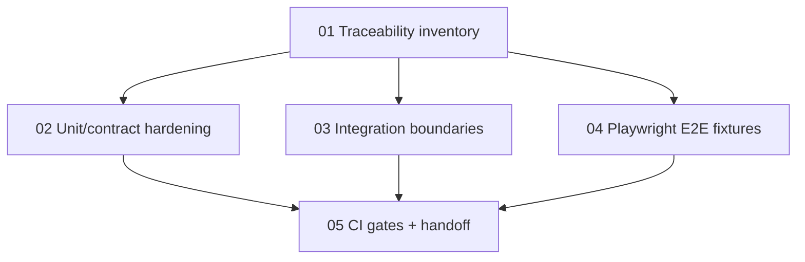

# Phase 5 Testing Execution Plan

> Working plan for implementing Phase 5 testing after the Phase 4A representative Saga slice and Phase 4B stabilization. Canonical scope lives in `docs/phases/phase-5-7-finalization.md`; these files are execution plans for future sessions.

## Goal

Turn Phase 5 from a testing strategy into an executable rollout: trace business rules to tests, close P0/P1 gaps at the right layer, stabilize Playwright demo flows, and document gates for PR, full local verification, and pre-demo runs.

## Plan Files

| Order | Plan file                            | Purpose                                                                                   | Can run in parallel?                                     |
| ----- | ------------------------------------ | ----------------------------------------------------------------------------------------- | -------------------------------------------------------- |
| 1     | `01-traceability-inventory-plan.md`  | Build the rule-to-test matrix and classify `covered/partial/missing/gap/deferred` status. | Must start first; other work depends on its first draft. |
| 2     | `02-unit-contract-hardening-plan.md` | Add or harden fast Jest tests for P0/P1 rules.                                            | Yes, after traceability produces priority slices.        |
| 3     | `03-integration-boundary-plan.md`    | Prove real DB/Redis/Kafka/TCP/Auth boundaries and seed/reset policy.                      | Yes, after traceability identifies stack-dependent gaps. |
| 4     | `04-playwright-e2e-plan.md`          | Build deterministic browser E2E for demo-critical flows.                                  | Partly; can prepare fixtures while integration matures.  |
| 5     | `05-ci-gates-and-handoff-plan.md`    | Wire commands, documentation, reporting, skip policy, and session handoff.                | Last for final gates; command inventory can start early. |

Additional focused evidence guide:

- `saga-validation-strategy.md` — defines how to prove the two representative Saga flows for the thesis: Order Confirm Saga and SaaS Onboarding Mini-Saga.

## Recommended Order

1. Create the traceability matrix first. Do not write new tests until the matrix labels whether a rule is truly `missing`, `partial`, `implementation-gap`, `security-gap`, or `deferred-by-phase`.
2. Resolve P0 implementation/security gaps before treating them as Step 5.2 test-only work:
   - `docs/testing/phase-5/specs/phase-5-p0-webhook-secret-verification-spec.md`
   - `docs/testing/phase-5/specs/phase-5-p0-vnd-rounding-ownership-spec.md`
   - `docs/testing/phase-5/specs/phase-5-p0-saas-quota-enforcement-spec.md`
   - `docs/testing/phase-5/specs/phase-5-p0-order-stock-confirmation-spec.md`
3. Before any SePay OAuth, payment settings, webhook, or browser payment-settings work, read `docs/testing/phase-5/specs/phase-5-sepay-local-mock-testing-policy.md`. Default tests use mock SePay; live SePay is manual opt-in only.
4. Split test implementation by layer:
   - Unit/contract workers own pure policies, guards, DTOs, constants, event payloads, and frontend hook/component behavior.
   - Integration workers own real boundary proofs: DB transaction, Redis semantics, Kafka/outbox, TCP service contracts, auth smoke.
   - E2E workers own user-visible demo journeys only; they must not duplicate API contract assertions.
5. Stabilize seed and fixtures before expanding E2E. E2E without deterministic data will create noise, not confidence.
6. Finalize CI gates only after the test commands and skip policy are honest about required stack.

## Parallelization Map

## Expected Outputs

- `docs/testing/phase-5/traceability-matrix.md` or equivalent matrix artifact.
- P0 mini-specs for security or implementation gaps that cannot be treated as test-only work.
- SePay local/mock testing policy that separates default automated coverage from live-provider smoke.
- New or updated Jest tests for P0/P1 rules in BFF, Catalog, Order, Kitchen, Payment, SaaS, frontend apps, and shared libraries.
- Integration test command(s), readiness checks, seed/reset policy, and documented skip behavior.
- Saga validation evidence map for Order Confirm and SaaS Onboarding, including commands, claim limits, and thesis artifact checklist.
- Playwright specs or fixtures for QR ordering, payment close-session, SaaS onboarding, suspended tenant, and admin/dashboard smoke.
- Package scripts and CI/pre-demo gate documentation that distinguish quick PR checks from full stack checks.

## Session Handoff Rules

- Start every session by reading this README, the specific plan file being executed, and `docs/phases/phase-5-7-finalization.md`.
- Check `git status --short` before editing. The workspace may already contain unrelated work; do not revert it.
- Keep traceability status current as tests land. A test without a matrix row is easy to lose; a matrix row without a test path is not proof.
- Prefer `rg`/`rg --files` for inventory. Use Playwright browser work only for actual UI verification, not for unit-level behavior.
- For local web testing, run helper scripts with `--help` before using them and keep browser scripts focused on reconnaissance-then-action.
- Do not make default Phase 5 tests depend on real SePay, Vercel preview domains, or public tunnels; use the local/mock SePay policy unless running explicit live smoke.
- Final verification is always last: format docs, run the relevant Nx/Jest/Playwright command for touched work, and record skipped stack-dependent checks honestly.
