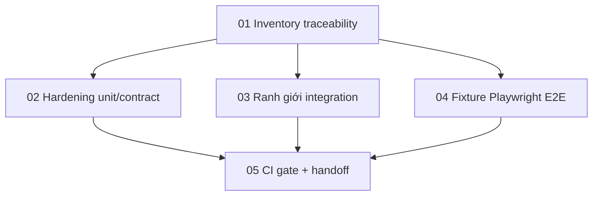

# Kế hoạch triển khai kiểm thử Phase 5

> Kế hoạch làm việc để triển khai kiểm thử Phase 5 sau Phase 4B. Phạm vi chuẩn (canonical) nằm trong `docs/phases/phase-5-7-finalization.md`; các tệp trong thư mục này là kế hoạch thực thi cho các phiên làm việc sau.

## Mục tiêu

Biến Phase 5 từ chiến lược kiểm thử thành lộ trình có thể chạy được: trace các business rule sang test, khép khoảng trống P0/P1 đúng tầng (layer), ổn định các luồng demo trên Playwright, và ghi nhận các gate cho PR, verify đầy đủ trên máy local, và chạy thử trước demo.

## Các tệp kế hoạch

| Thứ tự | Tệp kế hoạch                         | Mục đích                                                                                                                         | Chạy song song được không?                                           |
| ------ | ------------------------------------ | -------------------------------------------------------------------------------------------------------------------------------- | -------------------------------------------------------------------- |
| 1      | `01-traceability-inventory-plan.md`  | Xây ma trận rule-to-test và phân loại trạng thái `covered` / `partial` / `missing` / `implementation-gap` / `deferred-by-phase`. | Phải bắt đầu trước; các hạng mục khác phụ thuộc bản nháp đầu tiên.   |
| 2      | `02-unit-contract-hardening-plan.md` | Bổ sung hoặc củng cố Jest nhanh, deterministic cho rule P0/P1.                                                                   | Có, sau khi traceability có các lát ưu tiên.                         |
| 3      | `03-integration-boundary-plan.md`    | Chứng minh ranh giới thật: DB/Redis/Kafka/TCP/Auth và chính sách seed/reset.                                                     | Có, sau khi traceability chỉ ra khoảng trống phụ thuộc stack.        |
| 4      | `04-playwright-e2e-plan.md`          | Xây E2E trình duyệt deterministic cho luồng demo quan trọng.                                                                     | Một phần; có thể chuẩn bị fixture khi integration đang trưởng thành. |
| 5      | `05-ci-gates-and-handoff-plan.md`    | Nối lệnh, tài liệu, báo cáo, chính sách skip và handoff phiên.                                                                   | Cuối cùng cho gate cuối; inventory lệnh có thể bắt sớm.              |

## Thứ tự khuyến nghị

1. Tạo ma trận traceability trước. Không viết test mới cho đến khi ma trận gắn nhãn rule là thật sự `missing`, `partial`, `implementation-gap`, `security-gap`, hay `deferred-by-phase`.
2. Xử lý khoảng trống triển khai / bảo mật P0 trước khi coi đó là việc chỉ-test của Bước 5.2 (bản tiếng Việt trong thư mục này; bản tiếng Anh canonical tại `docs/testing/phase-5/specs/`):

- `[specs/phase-5-p0-webhook-secret-verification-spec.md](specs/phase-5-p0-webhook-secret-verification-spec.md)`
- `[specs/phase-5-p0-vnd-rounding-ownership-spec.md](specs/phase-5-p0-vnd-rounding-ownership-spec.md)`
- `[specs/phase-5-p0-saas-quota-enforcement-spec.md](specs/phase-5-p0-saas-quota-enforcement-spec.md)`

3. Trước mọi việc liên quan SePay OAuth, payment settings, webhook hoặc browser payment-settings, đọc `[specs/phase-5-sepay-local-mock-testing-policy.md](specs/phase-5-sepay-local-mock-testing-policy.md)`. Test mặc định dùng mock SePay; SePay live chỉ chạy manual opt-in.
4. Chia triển khai test theo tầng:

- Worker unit/contract: policy thuần, guard, DTO, constants, event payload, hành vi hook/component frontend.
- Worker integration: chứng minh ranh giới thật: transaction DB, ngữ nghĩa Redis, Kafka/outbox, hợp đồng TCP service, auth smoke.
- Worker E2E: chỉ hành trình demo nhìn thấy được; không trùng lặp assertion hợp đồng API.

5. Ổn định seed và fixture trước khi mở rộng E2E. E2E không có dữ liệu deterministic sẽ tạo nhiễu, không phải độ tin cậy.
6. Hoàn thiện CI gate chỉ sau khi lệnh test và chính sách skip thành thật với stack bắt buộc.

## Sơ đồ song song hóa

## Đầu ra kỳ vọng

- `docs/testing/phase-5/traceability-matrix.md` hoặc artifact ma trận tương đương.
- Mini-spec P0 cho khoảng trống bảo mật hoặc triển khai không thể chỉ xử lý bằng test.
- Testing policy SePay local/mock để tách coverage automated mặc định khỏi live-provider smoke.
- Jest mới hoặc cập nhật cho rule P0/P1 trên BFF, Catalog, Order, Kitchen, Payment, SaaS, frontend app và thư viện dùng chung.
- Lệnh integration test, readiness check, chính sách seed/reset, và hành vi skip được tài liệu hóa.
- Playwright spec hoặc fixture cho đặt món QR, đóng session thanh toán, onboarding SaaS, tenant suspended, và smoke admin/dashboard.
- Script trong `package.json` và tài liệu gate CI/pre-demo phân biệt kiểm tra PR nhanh với kiểm tra full stack.

## Quy tắc handoff phiên

- Mỗi phiên bắt đầu bằng việc đọc README này, tệp kế hoạch đang thực thi, và `docs/phases/phase-5-7-finalization.md`.
- Kiểm `git status --short` trước khi sửa. Workspace có thể đã có thay đổi không liên quan; không revert.
- Giữ trạng thái traceability cập nhật khi test được merge. Test không có dòng ma trận dễ bị lạc; dòng ma trận không có đường dẫn test không phải bằng chứng.
- Ưu tiên `rg` / `rg --files` cho inventory. Chỉ dùng Playwright browser cho verify UI thật, không cho hành vi cấp unit.
- Với test web local, chạy script helper kèm `--help` trước khi dùng; giữ script trình duyệt tập trung reconnaissance rồi mới hành động.
- Không để test Phase 5 mặc định phụ thuộc SePay thật, domain preview Vercel, hoặc public tunnel; dùng policy SePay local/mock trừ khi chạy live smoke opt-in rõ ràng.
- Verify cuối cùng luôn là bước cuối: format tài liệu, chạy lệnh Nx/Jest/Playwright liên quan phần đã chạm, và ghi nhận trung thực các check phụ thuộc stack đã bỏ qua.
